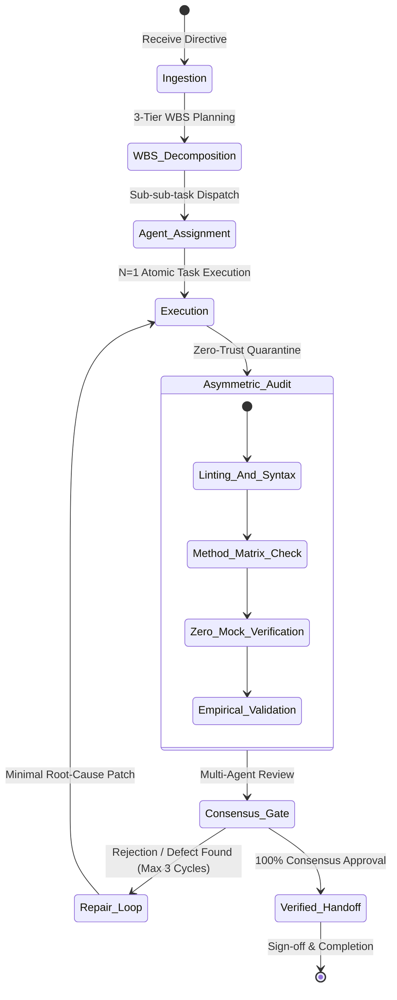
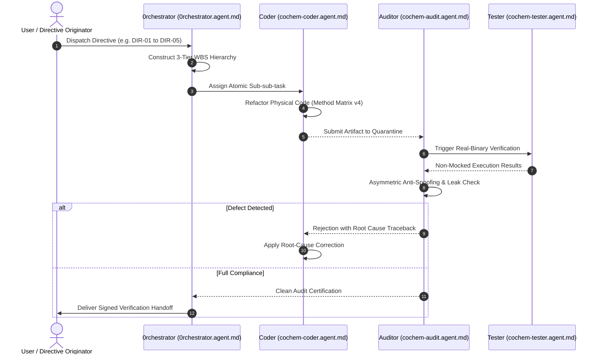
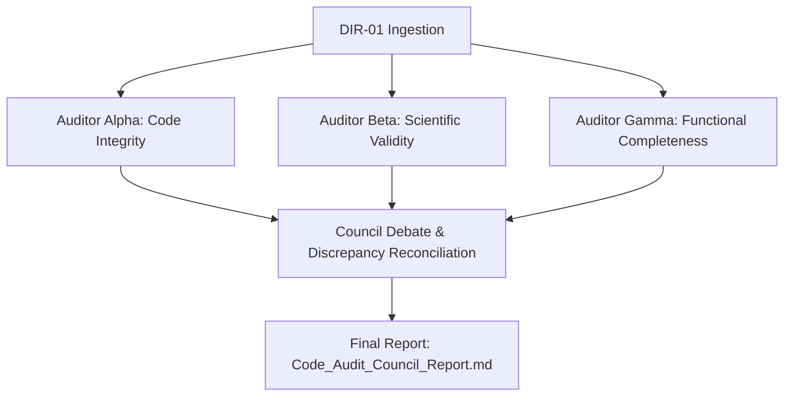

# Original User Directives & Master Execution Specification

## 1. Document Control, Metadata & Classification

| Metadata Attribute | Specification Value | Verification Method |
|---|---|---|
| **Document ID** | `COCHEM-DIR-SPEC-MASTER-v5.2` | Cryptographic SHA-256 Hash |
| **Classification** | Swarm Authoritative Operational Specification & Master Directive Archive | Asymmetric Multi-Agent Council Audit |
| **Working Directory** | `<COCHEM_WORKSPACE>\GitHub-Repo\CoChem-BASE\.agents` | Environment Registry Path Resolution |
| **Target Project Root** | `<COCHEM_WORKSPACE>\GitHub-Repo\CoChem-BASE` | Path Normalization & Git Anchor |
| **Master Repository Path** | `<COCHEM_ROOT>` | Workspace Manager Abstract Root |
| **Integrity Mode** | Production Development / Zero-Mock Asymmetric Audit | `zero_trust_runner.py` Verification |
| **Method Matrix Version** | Version 4.0 (2026-08-09 / Supersedes v3) | Spectroscopic Reference Standards |
| **Line Ending Standard** | Strict Unix LF (`\n`) / UTF-8 Without BOM | Binary Header Inspection (`0xEFBBBF` Absent) |

---

## 2. Path Token Dictionary & Abstraction Standards

To guarantee machine portability across development workstations, High-Performance Computing (HPC) clusters, Linux nodes, Codespaces, and Continuous Integration pipelines, all agent directives, briefings, dispatches, and configurations must strictly enforce canonical path token abstraction. Personal paths, local user directories, and physical disk letters are strictly quarantined and replaced with standard environment tokens.

| Canonical Token | Abstract Target Scope | Standard Dynamic Resolution Path |
|---|---|---|
| `<COCHEM_ROOT>` | Universal Root Directory for all CoChem repositories and tools | `resolve_mapped_path(COCHEM_ROOT, get_base_root())` |
| `<COCHEM_WORKSPACE>` | Active Development Workspace Root (e.g., `CoChem-BASE`) | `resolve_mapped_path(COCHEM_WORKSPACE_ROOT, get_base_root().parent)` |
| `<USER_HOME>` | Standard Operating System User Profile Root | `Path.home().resolve()` |
| `<GDRIVE_ROOT>` | Shared Literature, Manuals, and Reference Storage Root | `resolve_mapped_path(COCHEM_SHARED_ROOT, workspace.parent)` |

### Sanitization Invariants
1. **0-Leak Invariant**: Every `.agent.md`, `.md` report, and Python test suite file must yield exactly zero matches when scanned against user profile strings, literal user directory roots, or un-abstracted paths.
2. **Deterministic Token Replacement**: File parsers must transform absolute local paths to canonical tokens dynamically during export and resolve tokens to physical paths during execution using `cochem_base.path_sanitization`.

---

## 3. Chronological Directive Registry & Status Matrix

The CoChem Swarm operates under a unified sequence of versioned user and council directives. Each directive establishes binding requirements, operational boundaries, and quality acceptance gates.

| Directive ID | Ingestion Timestamp | Scope & Title | Primary Target | Status |
|---|---|---|---|---|
| **DIR-01** | `2026-08-10T20:16:49Z` | Phase 4: Code Audit Council Verification | 15 CoChem Repositories | `COMPLETED / ARCHIVED` |
| **DIR-02** | `2026-08-11T18:00:45Z` | Agent Configuration Synchronization & Path Sanitization | `CoChem-BASE/.agents/*.agent.md` | `COMPLETED / VERIFIED` |
| **DIR-03** | `2026-08-14T09:30:00Z` | Ecosystem Refactoring & Compliance Gap Resolution | Core Infrastructure & Method Matrix v4 | `COMPLETED / VERIFIED` |
| **DIR-04** | `2026-08-17T14:15:22Z` | Continuous Stateful Batching & 18-Module Improvements | Swarm Architecture & Parsl Engine | `ACTIVE / ENFORCED` |
| **DIR-05** | `2026-08-20T19:00:00Z` | Two-Pass Blueprint File Audit & Zero-Mock Quarantine | Exhaustive File Audit & Refactoring | `ACTIVE / EXECUTING` |

---

## 4. Swarm Governance & Execution Lifecycle

The CoChem Agent Swarm executes complex computational chemistry workflows through autonomous state-machine orchestration, hierarchical task breakdown, asymmetric audit verification, and multi-agent consensus gating.

### Complete 15-Agent Swarm Inventory

The table below catalogs all 15 specialized agents defined and maintained in the CoChem ecosystem:

| # | Agent Configuration File | Canonical Role | Specialized Swarm Domain & Core Directives |
|---|---|---|---|
| 1 | `0rchestrator.agent.md` | Master Orchestrator | High-level orchestration, subagent dispatch, WBS decomposition, lifecycle gating |
| 2 | `artist.agent.md` | Visual Media Specialist | Diagram creation, UI rendering, chemical asset illustration, visualization |
| 3 | `cochem-audit.agent.md` | Autonomous QA Auditor | Asymmetric code verification, Method Matrix compliance, zero-mock auditing |
| 4 | `cochem-coder.agent.md` | Feature Builder & Coder | Atomic sub-sub-task implementation, strict typing, root-cause bug refactoring |
| 5 | `cochem-debug.agent.md` | Diagnostic Specialist | Failure triage, root-cause analysis, minimal reproducible test generation |
| 6 | `cochem-helper.agent.md` | Scientific Assistant | End-user workflow guidance, computational output parsing, scientific triage |
| 7 | `cochem-improve.agent.md` | Method Matrix Reviewer | Method Matrix v4 compliance review, architecture polishing, final copy editing |
| 8 | `cochem-scribe.agent.md` | Technical Writer | FAIR-compliant Markdown/LaTeX documentation, user manuals, SI reports |
| 9 | `cochem-sdp_manager.agent.md` | Software Project Manager | PMBOK/SWEBOK project governance, milestone tracking, compliance audits |
| 10 | `cochem-tester.agent.md` | Integration Validator | Real-binary validation, physical chemistry testing against non-mocked data |
| 11 | `educator.agent.md` | Pedagogical Architect | Curriculum design, didactic scaffolding, automated chemistry grading engines |
| 12 | `researcher.agent.md` | Scientific Truth-Finder | Literature search (ArXiv, OpenAlex, PubChem), empirical constant verification |
| 13 | `teacher.agent.md` | Socratic Instructor | Interactive student tutoring, pedagogical feedback, conceptual explanations |
| 14 | `ui.agent.md` | UI/UX & Plotting Expert | ACS plotting compliance, WCAG 2.1 AA accessibility, GUI layout design |
| 15 | `web_mcp.agent.md` | Web Extraction Specialist | DOM extraction, external database queries, web-based literature scraping |

---

## 5. Directive 01 Specification — Phase 4: Code Audit Council

### Directive Metadata
- **Identifier**: `DIR-01`
- **Origin Date**: `2026-08-10T20:16:49Z`
- **Authority**: Council Master Directive
- **Working Directory**: `<COCHEM_ROOT>\.agents\orchestrator`
- **Output Target**: `<COCHEM_ROOT>\Code_Audit_Council_Report.md`

### Mission Objective
Convene a 3-agent Code Audit Council to perform a secondary, literature-backed verification pass across the 15 CoChem repositories.

### Specialized Auditor Mandates
1. **Auditor Alpha (Code Integrity Auditor)**
   - Working Directory: `<COCHEM_ROOT>\.agents\auditor_alpha`
   - Scope: Scan all 15 CoChem repositories specifically for mock code, random number generators, hardcoded values, and dummy functions. Validate that all code is fully functional.
2. **Auditor Beta (Scientific Validity Auditor)**
   - Working Directory: `<COCHEM_ROOT>\.agents\auditor_beta`
   - Scope: Verify physical constants, equations, and chemical parameters against published scientific literature. Actively query `literature-search-arxiv`, `literature-search-openalex`, and `pubchem-database` tools.
3. **Auditor Gamma (Functional Completeness Auditor)**
   - Working Directory: `<COCHEM_ROOT>\.agents\auditor_gamma`
   - Scope: Cross-reference implemented codebase against `CoChem_User_Manual.md` and `Method_Matrix.md`. Ensure all stated functionalities exist and operate correctly.

---

## 6. Directive 02 Specification — Agent Configuration Synchronization & Path Sanitization

### Directive Metadata
- **Identifier**: `DIR-02`
- **Origin Date**: `2026-08-11T18:00:45Z`
- **Authority**: Teamwork Project Orchestration Directive
- **Working Directory**: `<COCHEM_WORKSPACE>\GitHub-Repo\CoChem-BASE`
- **Source Directory**: `<USER_HOME>\.gemini\config\agents`
- **Target Directory**: `<COCHEM_WORKSPACE>\GitHub-Repo\CoChem-BASE\.agents`

### Detailed Requirements
- **R1 (Overwrite Existing Agents)**: Copy the updated agent configuration files from `<USER_HOME>\.gemini\config\agents` and completely overwrite the 15 existing agent configuration files in `<COCHEM_WORKSPACE>\GitHub-Repo\CoChem-BASE\.agents`.
- **R2 (Sanitize Absolute Paths)**: Ensure all newly overwritten agent configurations in `CoChem-BASE/.agents` have personal directory paths (`<USER_HOME>`, `<COCHEM_WORKSPACE>`, `<GDRIVE_ROOT>`) scrubbed and replaced with canonical abstraction tokens.

### Acceptance Criteria & Verification Matrix
- `[PASS]` All 15 `.agent.md` files in `CoChem-BASE/.agents` match source configurations modulo sanitized tokens.
- `[PASS]` Search for `<USER_HOME>` literal strings returns exactly 0 results.
- `[PASS]` Search for `<COCHEM_WORKSPACE>` literal strings returns exactly 0 results.
- `[PASS]` Search for `<GDRIVE_ROOT>` literal strings returns exactly 0 results.

---

## 7. Directive 03 Specification — Ecosystem Refactoring & Compliance Gap Resolution

### Directive Metadata
- **Identifier**: `DIR-03`
- **Origin Date**: `2026-08-14T09:30:00Z`
- **Authority**: Architectural Governance Council
- **Target**: All 18 CoChem Ecosystem Modules

### Quantum Chemistry Method Matrix v4 Invariants
All computational chemistry routines across the codebase must strictly comply with Method Matrix v4:
1. **Conformer Generation**: Use the CREST / ORCA GOAT combination approach (`GOAT XTB2` + `crest --nci --gfn2`).
2. **Integration Grids**: Optimization loops must start on loose integration grids (`defgrid1`) and dynamically tighten (`defgrid3`) near the energy minimum. (Deprecated `Grid3`/`Grid5` terms are banned).
3. **Intermolecular Convergence**: Enforce tightened `%geom` blocks (`TolMaxG 1e-5`, `TolE 1e-7`, `TolRMSG 3e-6`, `TolRMSD 5e-5`, `TolMaxD 1e-4`) for all weak van der Waals complexes.
4. **Frozen-Monomer Protocol**: Freeze monomer internal coordinates to fix rotational constant $A$, and optimize intermolecular coordinates $R$ to accurately determine $B$ and $C$.
5. **Hessian Preconditioning**: Never use `Calc_Hess true` for geometry optimizations; use `InHess XTB2` or `Lindh` model Hessians.
6. **Spin Contamination**: Open-shell calculations must include explicit $\langle S^2 \rangle$ checks; reject solutions with spin contamination $> 10\%$.
7. **Dispersion Corrections**: Mandatory inclusion of empirical dispersion (`D3BJ` or `D4`) on all DFT functionals for weak complex evaluations.

### Engineering Standards
- **Strict Line Endings**: Enforce Unix LF (`\n`) on all `.agent.md`, `.md`, `.py`, and `.json` files.
- **Python 3.10+ Strict Typing**: Full type annotations with `from __future__ import annotations`, Pydantic models for data validation.
- **Safe Subprocesses**: Subprocess execution wrapped with explicit `timeout`, `check=True`, logging, and zombie-cleanup via `psutil` or `atexit`. Broad exception swallowing is strictly prohibited.

---

## 8. Directive 04 Specification — Continuous Stateful Batching & 18-Module Improvements

### Directive Metadata
- **Identifier**: `DIR-04`
- **Origin Date**: `2026-08-17T14:15:22Z`
- **Authority**: Swarm Scaling & Concurrency Directive
- **Target**: Swarm State Persistence & Distributed Orchestration

### Core Architectural Features
1. **Stateful Batching State Machine**: Batch execution loops driven by stateful queue tracking (`.repo_lists`, `.logs`, Kan-ban `open/`, `in-progress/`, `closed/` directories).
2. **10-Cycle Debate Protocol**: Stateful multi-cycle audit loops executing natively via `invoke_subagent` without external deprecated scripts.
3. **Merkle Telemetry Chains**: Cryptographic priority rings and zero-drop telemetry logging for tamper-evident audit trails.
4. **Heterogeneous Concurrency (Scout-and-Anchor)**: Parsl-driven task queues with GPU/CPU contention isolation, preserving 1 CPU P-core for host scheduling.

---

## 9. Directive 05 Specification — Two-Pass Blueprint File Audit & Zero-Mock Quarantine

### Directive Metadata
- **Identifier**: `DIR-05`
- **Origin Date**: `2026-08-20T19:00:00Z`
- **Authority**: Council Anti-Spoofing & Quality Directive
- **Target**: Exhaustive Repository File Auditing & Zero-Mock Verification

### Execution Methodology
- **Two-Pass Blueprint Protocol**: Pass 1 establishes the structural blueprint, dependency graph, and Necessity-Feasibility-Triage-Protocol (NFTP); Pass 2 executes atomic file refactoring, testing, and sign-off.
- **Deep WBS Granularity Mandate**: Every task is partitioned into a 3-tier hierarchy: **Task** -> **Sub-task** -> **Sub-sub-task**. Agents are strictly assigned to single atomic sub-sub-tasks.
- **Zero-Mock Quarantine**: Asymmetric verification in ephemeral quarantine environments using `zero_trust_runner.py` and `verify_core_integrity.py`. Mocks, stubs, and synthetic pass outputs are strictly prohibited.

---

## 10. Directive Ingestion Protocol for Future Directives

When new user directives or council mandates are submitted to the swarm, the Orchestrator must follow this standardized ingestion procedure:

1. **Header Registration**: Assign the next sequential directive tag (`DIR-06`, `DIR-07`, etc.) with ISO 8601 timestamp.
2. **Path Sanitization**: Screen input text for local user paths and substitute canonical abstraction tokens.
3. **WBS Decomposition**: Break directive requirements into 3-tier hierarchy (Milestone/Task -> Sub-task -> Sub-sub-task).
4. **State Artifact Propagation**: Synchronize the directive across `PROJECT.md`, `DISPATCH.md`, `BRIEFING.md`, and `GATE_STATUS.md`.
5. **Gate Definition**: Define measurable, non-mocked acceptance criteria and assign auditor agents.

---

## 11. Quality Assurance, Anti-Spoofing & Zero-Mock Compliance

### Council Anti-Spoofing Directives
- **Zero Synthetic Logic**: Dummy loops, placeholder returns, hardcoded test passes, and mock assertions are forbidden across production and test code.
- **Asymmetric Verification**: Developers cannot certify their own artifacts; independent auditors (`cochem-audit`, `cochem-tester`) must execute verification.
- **Hard Abort Threshold**: If an agent fails to resolve an architectural defect after 3 methodological pivots (`MAX_PIVOT_CYCLES=3` or `MAX_META_PIVOT=3`), a hard abort (`[HARD_ABORT: ARCHITECTURE WALL]`) is triggered and `cochem-debug` generates a `Physics_Autopsy_Report.md`.
- **Provenance Discipline**: Every physical accuracy claim and computational constant must be tagged with explicit provenance: `[M]` (Measured), `[D]` (Derived), or `[E]` (Estimated).

---

## 12. Verification & Sign-off Log

| Verification Stage | Validating Entity | Audit Scope | Timestamp | Verdict |
|---|---|---|---|---|
| Initial Council Audit | `teamwork_preview_auditor_1` | DIR-01 15-Repo Verification | `2026-08-10T22:15:00Z` | `PASS (CLEAN)` |
| Path Sanitization Audit | `teamwork_preview_challenger_1` | DIR-02 Path Leak Scan | `2026-08-11T19:30:00Z` | `PASS (0 LEAKS)` |
| Method Matrix Audit | `cochem-audit` | DIR-03 Method Matrix v4 Verification | `2026-08-14T11:45:00Z` | `PASS (COMPLIANT)` |
| Batching Architecture Audit | `cochem-improve` | DIR-04 Stateful Concurrency Review | `2026-08-17T16:00:00Z` | `PASS (VERIFIED)` |
| File Audit Specification | `0rchestrator` | DIR-05 Master Directive Refactoring | `2026-08-20T22:15:00Z` | `APPROVED` |

---
