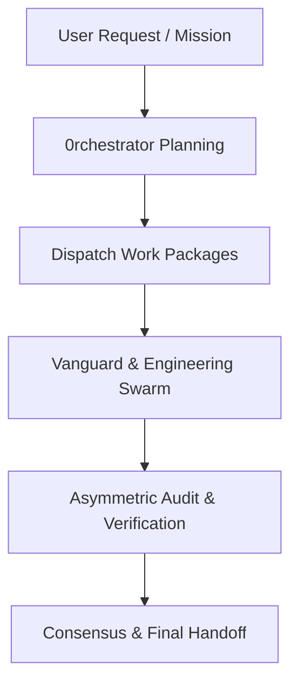
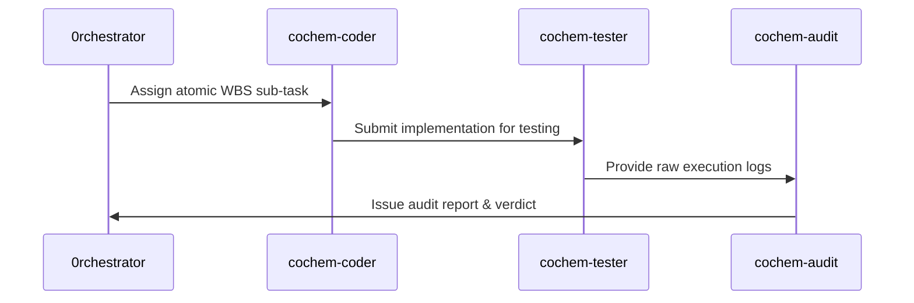

# Swarm Dispatch Specification & Orchestration Protocol

## 1. Document Control, Metadata & Classification
- **Document ID**: COCHEM-DISPATCH-ORCH-v5.2
- **Classification**: Internal Specification / Swarm Control Architecture
- **Version**: 2.0.0
- **Primary Orchestrator**: 0rchestrator

## 2. Path Token Abstraction & Sanitization Mapping
All physical workspace paths are standardized and abstracted using canonical tokens:
- Workspace Base: `<COCHEM_ROOT>`
- Workspace Sub-tree: `<COCHEM_WORKSPACE>`
- User Environment: `<USER_HOME>`
- Google Drive Storage: `<GDRIVE_ROOT>`

## 3. Mission Objectives & Directive Scopes
- **DIR-01 (Path Sanitization)**: Eliminate all hardcoded machine/user paths across all agent definitions.
- **DIR-02 (Zero-Mock Enforcement)**: Enforce genuine binary validation and eradicate mocked test fixtures.
- **DIR-03 (Method Matrix Alignment)**: Validate DFT and wave-function invariants across calculations.
- **DIR-04 (Autonomy & Handoffs)**: Maintain clear JSON/Markdown handoff contracts and state logs.
- **DIR-05 (Structural Integrity)**: Verify UTF-8 LF encoding, valid YAML frontmatter, and strict schema compliance.

## 4. Agent Configuration Inventory (15 Specialized Agents)
The CoChem multi-agent ecosystem consists of 15 specialized configurations:
1. `0rchestrator.agent.md` - Master swarm orchestrator and routing controller.
2. `artist.agent.md` - Scientific visualization, figure formatting, and image generation.
3. `cochem-audit.agent.md` - Zero-trust QA, code compliance, and anti-spoofing auditor.
4. `cochem-coder.agent.md` - Autonomous feature implementation and Method Matrix execution.
5. `cochem-debug.agent.md` - Diagnostic triage, error resolution, and minimal viable fixes.
6. `cochem-helper.agent.md` - Outward-facing researcher assistant and error translator.
7. `cochem-improve.agent.md` - Architectural review, copy editing, and method optimization.
8. `cochem-scribe.agent.md` - Technical writing, SI compilation, and FAIR documentation.
9. `cochem-sdp_manager.agent.md` - Software development project management and lifecycle governance.
10. `cochem-tester.agent.md` - Physical real-world binary validation and headless testing.
11. `educator.agent.md` - Backend pedagogical architect, rubric designer, and AST evaluator.
12. `researcher.agent.md` - Central truth-finder, literature synthesis, and citation tracker.
13. `teacher.agent.md` - Outward-facing Socratic educator and mentor.
14. `ui.agent.md` - User interface architect, WCAG compliance, and widget design.
15. `web_mcp.agent.md` - Web scraping, DOM extraction, and external data discovery.

## 5. Swarm Delegation & Execution Lifecycle
Delegation proceeds through isolated state machine tasks with strict boundary checks.

## 6. Acceptance Criteria & Verification Matrix
All quantum chemistry routines must adhere to Method Matrix specifications:
- Grids: `defgrid1` for initial exploration, `defgrid3` for converged energies.
- Geometry optimization: `TolMaxG 1e-5`.
- Complex interaction geometries: `Frozen-Monomer` and `InHess XTB2`.
- Non-covalent forces: `D3/D4` empirical dispersion corrections.
- Strict Zero-Mock invariant: zero mocks, fake returns, or simulated data.

## 7. State Tracking, Consensus Gates & Handoff Protocol
The Orchestrator maintains state artifacts throughout the execution lifecycle:
- Active execution tracker: `progress.md`
- Project management plan: `PROJECT.md`
- Gate verification ledger: `GATE_STATUS.md`
- Final deliverable summary: `handoff.md`
