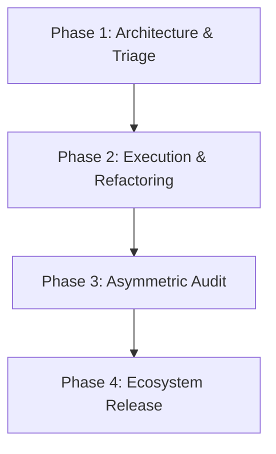
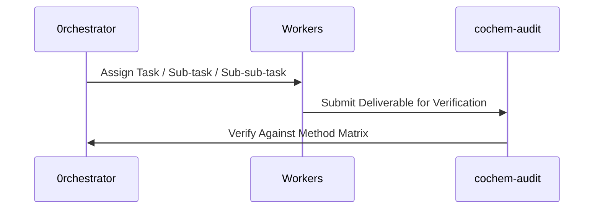

# Swarm Master Project Management Plan

## 1. Document Control, Metadata & Classification
- **Document ID**: COCHEM-PROJECT-ORCH-v5.2
- **Classification**: Strategic Master Plan / Swarm Governance Architecture
- **Version**: 2.0.0
- **Primary Orchestrator**: 0rchestrator

## 2. Path Token Abstraction & Sanitization Mapping
All physical paths have been abstracted into canonical tokens:
- Canonical Base: `<COCHEM_ROOT>`
- Workspace Sub-tree: `<COCHEM_WORKSPACE>`
- User Environment: `<USER_HOME>`
- Google Drive Storage: `<GDRIVE_ROOT>`

## 3. Mission Objectives & Directive Scopes
- **DIR-01 (Path Sanitization)**: Eliminate all hardcoded machine/user paths across all agent definitions.
- **DIR-02 (Zero-Mock Enforcement)**: Enforce genuine binary validation and eradicate mocked test fixtures.
- **DIR-03 (Method Matrix Alignment)**: Validate DFT and wave-function invariants across calculations.
- **DIR-04 (Autonomy & Handoffs)**: Maintain clear JSON/Markdown handoff contracts and state logs.
- **DIR-05 (Structural Integrity)**: Verify UTF-8 LF encoding, valid YAML frontmatter, and strict schema compliance.

## 4. Deep Granularity & Hierarchical Work Breakdown Structure (WBS)
Execution strictly follows a 3-tier deep Work Breakdown Structure:

### Task 1: Environment & File Sanitization
- **Sub-task 1.1**: Identify and map all paths across repository files.
  - **Sub-sub-task 1.1.1**: Replace user-specific home paths with `<USER_HOME>` tokens.
  - **Sub-sub-task 1.1.2**: Replace workspace roots with `<COCHEM_WORKSPACE>` tokens.
- **Sub-task 1.2**: Verify line-ending formatting across files.
  - **Sub-sub-task 1.2.1**: Strip CRLF endings and enforce Unix LF.

### Task 2: Swarm Agent Configurations Refactoring
- **Sub-task 2.1**: Update frontmatter schema across all 15 agents.
  - **Sub-sub-task 2.1.1**: Validate `enable_write_tools` and `enable_mcp_tools`.
- **Sub-task 2.2**: Embed Method Matrix quantum invariants.
  - **Sub-sub-task 2.2.1**: Configure `defgrid1` and `defgrid3` integration thresholds.

## 5. Agent Configuration Inventory & RACI Matrix
The full 15-agent inventory is managed according to the RACI governance model:
1. `0rchestrator.agent.md` - Master Orchestration [Accountable]
2. `artist.agent.md` - Figure Generation & Media [Responsible]
3. `cochem-audit.agent.md` - Quality Assurance & Compliance [Consulted/Informed]
4. `cochem-coder.agent.md` - Core Feature Engineering [Responsible]
5. `cochem-debug.agent.md` - Diagnostic Triage [Responsible]
6. `cochem-helper.agent.md` - User Support & Translation [Responsible]
7. `cochem-improve.agent.md` - Architecture Review & Copy Editing [Responsible]
8. `cochem-scribe.agent.md` - SI Compilation & Technical Documentation [Responsible]
9. `cochem-sdp_manager.agent.md` - Project Management & Process Compliance [Accountable]
10. `cochem-tester.agent.md` - Real-World Validation [Responsible]
11. `educator.agent.md` - Pedagogical Design & Rubrics [Responsible]
12. `researcher.agent.md` - Literature Synthesis & Research [Responsible]
13. `teacher.agent.md` - Socratic Guidance & Mentorship [Responsible]
14. `ui.agent.md` - UI/UX Architecture [Responsible]
15. `web_mcp.agent.md` - Web Scraping & MCP Tools [Responsible]

## 6. Acceptance Criteria & Method Matrix Quality Gates
All outputs must satisfy Zero-Mock standards and conform to physical quantum chemistry requirements:
- Grid specifications: `defgrid1` (screening) and `defgrid3` (converged energies).
- Convergence: `TolMaxG 1e-5`.
- Complex alignments: `Frozen-Monomer` and `InHess XTB2`.
- Dispersion corrections: `D3/D4`.
- Zero-Mock assurance: 0 synthetic mocks or simulated responses.

## 7. State Tracking, Consensus Gates & Handoff Protocol
Lifecycle status is recorded in state artifacts:
- `BRIEFING.md` - Operational briefing and mandates.
- `DISPATCH.md` - Task dispatch orders.
- `PROJECT.md` - Strategic management plan.
- `GATE_STATUS.md` - Gate approval status.
- `progress.md` - Active telemetry and event logs.
- `handoff.md` - Final handoff deliverable sign-off.
