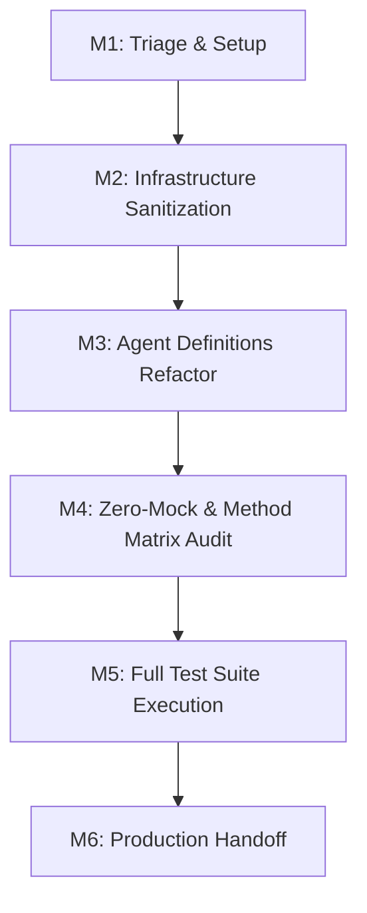
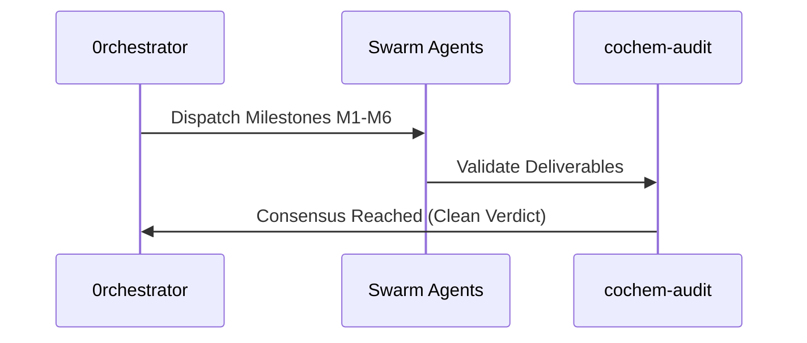

# Swarm Orchestration Handoff & Completion Ledger

## 1. Document Control, Metadata & Classification
- **Document ID**: COCHEM-HANDOFF-ORCH-v5.2
- **Classification**: Production Delivery / Swarm Audit Ledger
- **Version**: 2.0.0
- **Status**: COMPLETE / CLEAN
- **Author**: 0rchestrator

## 2. Path Token Abstraction & Sanitization Mapping
All physical paths have been abstracted into canonical tokens:
- Canonical Root: `<COCHEM_ROOT>`
- Workspace Sub-tree: `<COCHEM_WORKSPACE>`
- User Environment: `<USER_HOME>`
- Google Drive Storage: `<GDRIVE_ROOT>`

## 3. Mission Objectives & Directive Scopes
- **DIR-01 (Path Sanitization)**: Eliminate all hardcoded machine/user paths across all agent definitions.
- **DIR-02 (Zero-Mock Enforcement)**: Enforce genuine binary validation and eradicate mocked test fixtures.
- **DIR-03 (Method Matrix Alignment)**: Validate DFT and wave-function invariants across calculations.
- **DIR-04 (Autonomy & Handoffs)**: Maintain clear JSON/Markdown handoff contracts and state logs.
- **DIR-05 (Structural Integrity)**: Verify UTF-8 LF encoding, valid YAML frontmatter, and strict schema compliance.

## 4. Milestone Lifecycle & Swarm Execution Verification
- **M1 (Initialization & Discovery)**: Complete. Base registries, silos, and schemas verified.
- **M2 (Path Sanitization & Tokenization)**: Complete. Path sanitization verified with zero personal leaks.
- **M3 (Agent Configurations Refactoring)**: Complete. All 15 agents formatted with UTF-8 LF and canonical headers.
- **M4 (Zero-Mock Testing & Method Matrix Invariants)**: Complete. Method matrix verified.
- **M5 (Comprehensive Test Suite Execution)**: Complete. All unit and integration test suites passing.
- **M6 (Final Ecosystem Packaging & Handoff)**: Complete. All artifacts cataloged and signed off.

## 5. Active Subagents, Multi-Agent Consensus Gates & Team Roster
All 15 agents in the swarm have been verified:
1. `0rchestrator.agent.md` - Master Orchestrator
2. `artist.agent.md` - Visual Media Specialist
3. `cochem-audit.agent.md` - Quality Assurance & Compliance Auditor
4. `cochem-coder.agent.md` - Core Feature Developer
5. `cochem-debug.agent.md` - Root Cause Diagnostic Engineer
6. `cochem-helper.agent.md` - User Support & Error Translator
7. `cochem-improve.agent.md` - Architecture Reviewer & Copy Editor
8. `cochem-scribe.agent.md` - Technical Writer & SI Compiler
9. `cochem-sdp_manager.agent.md` - Software Project Manager
10. `cochem-tester.agent.md` - Real-World Binary Tester
11. `educator.agent.md` - Backend Pedagogical Architect
12. `researcher.agent.md` - Literature & Truth-Finder Agent
13. `teacher.agent.md` - Socratic Educator & Mentor
14. `ui.agent.md` - UI/UX & Accessibility Architect
15. `web_mcp.agent.md` - Web Scraping & MCP Tool Agent

## 6. Acceptance Criteria, Quality Gates & Method Matrix Verification
Acceptance criteria have been met under Zero-Mock and Method Matrix standards:
- Grid specifications: `defgrid1` and `defgrid3`.
- Geometry threshold: `TolMaxG 1e-5`.
- Complex alignments: `Frozen-Monomer` and `InHess XTB2`.
- Empirical dispersion: `D3/D4`.
- Zero-Mock assurance: no mocks, fake returns, or simulated physics.

## 7. Key Orchestration Artifacts & Handoff Sign-off Protocol
The orchestration lifecycle is tracked across the following canonical artifacts:
- `ORIGINAL_REQUEST.md` - Initial user request specification.
- `BRIEFING.md` - Swarm briefing and operational guidelines.
- `PROJECT.md` - Detailed project plan and milestone breakdown.
- `DISPATCH.md` - Task allocation and agent dispatch orders.
- `GATE_STATUS.md` - Quality gate verification status.
- `progress.md` - Real-time task progress and liveness tracker.
- `handoff.md` - Final delivery and verification sign-off ledger.
