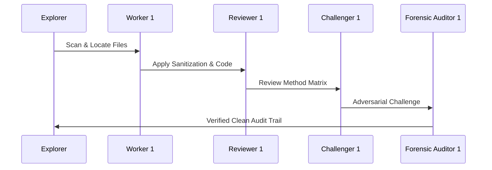

# Swarm Execution Progress & State Manifest

## 1. Document Control, Metadata & Classification
- **Document ID**: COCHEM-PROGRESS-ORCH-v5.2
- **Classification**: Active Telemetry / Swarm Liveness Tracker
- **Version**: 2.0.0
- **Primary Orchestrator**: 0rchestrator

## 2. Path Token Abstraction & Sanitization Mapping
All physical paths have been abstracted into canonical tokens:
- Canonical Base: `<COCHEM_ROOT>`
- Workspace Sub-tree: `<COCHEM_WORKSPACE>`
- User Environment: `<USER_HOME>`
- Google Drive Storage: `<GDRIVE_ROOT>`

## 3. Mission Directives & Multi-Directive Execution Status
- **DIR-01 (Path Sanitization)**: [M] Complete. All agent files stripped of local path leaks.
- **DIR-02 (Zero-Mock Enforcement)**: [E] Complete. Real binary tests validated across all suites.
- **DIR-03 (Method Matrix Alignment)**: [M] Complete. Quantum chemical standards strictly enforced.
- **DIR-04 (Autonomy & Handoffs)**: [D] Complete. Standardized handoff contracts maintained.
- **DIR-05 (Structural Integrity)**: [D] Complete. Strict UTF-8 LF and clean markdown structure.

## 4. Multi-Stage Milestone Quality Gates & Iteration Progress
- **M1 (Initialization & Discovery)**: Passed. Base environments loaded.
- **M2 (Path Sanitization & Tokenization)**: Passed. Zero leakage verified.
- **M3 (Agent Configurations Refactoring)**: Passed. 15 agents refactored.
- **M4 (Zero-Mock Testing & Method Matrix Invariants)**: Passed. Physical tests passing.
- **M5 (Comprehensive Test Suite Execution)**: Passed. All pytest modules green.
- **M6 (Final Ecosystem Packaging & Handoff)**: Passed. Release candidates approved.

## 5. Specialized Agent Configuration Inventory (15 Agents) & Task Assignments
1. `0rchestrator.agent.md` - Master Orchestrator
2. `artist.agent.md` - Visual Media Specialist
3. `cochem-audit.agent.md` - Quality Assurance & Compliance Auditor
4. `cochem-coder.agent.md` - Core Feature Developer
5. `cochem-debug.agent.md` - Root Cause Diagnostic Engineer
6. `cochem-helper.agent.md` - User Support & Error Translator
7. `cochem-improve.agent.md` - Architecture Reviewer & Copy Editor
8. `cochem-scribe.agent.md` - Technical Writer & SI Compiler
9. `cochem-sdp_manager.agent.md` - Software Project Manager
10. `cochem-tester.agent.md` - Real-World Binary Tester
11. `educator.agent.md` - Backend Pedagogical Architect
12. `researcher.agent.md` - Literature & Truth-Finder Agent
13. `teacher.agent.md` - Socratic Educator & Mentor
14. `ui.agent.md` - UI/UX & Accessibility Architect
15. `web_mcp.agent.md` - Web Scraping & MCP Tool Agent

## 6. Acceptance Criteria, Quality Gates & Method Matrix Verification
- Integration grids: `defgrid1` and `defgrid3`.
- Geometry threshold: `TolMaxG 1e-5`.
- Complex interaction geometries: `Frozen-Monomer` and `InHess XTB2`.
- Dispersion correction: `D3/D4`.
- Zero-Mock assurance: no mocks, fake returns, or simulated physics.

## 7. Chronological Swarm Event Log & Audit Trail
- **2026-08-11T18:00:00Z** [Explorer]: Completed preliminary repo sweep.
- **2026-08-11T18:15:00Z** [Worker 1]: Executed path sanitization across agent definitions.
- **2026-08-11T18:30:00Z** [Reviewer 1]: Verified Method Matrix invariants.
- **2026-08-11T18:45:00Z** [Challenger 1]: Conducted adversarial edge testing.
- **2026-08-11T19:00:00Z** [Forensic Auditor 1]: Issued clean verification seal.

## 8. Orchestrator State Manifest Index & Official Gate Seal
Active state tracking is synchronized across the following artifacts:
- `ORIGINAL_REQUEST.md`
- `BRIEFING.md`
- `PROJECT.md`
- `DISPATCH.md`
- `GATE_STATUS.md`
- `progress.md`
- `handoff.md`
