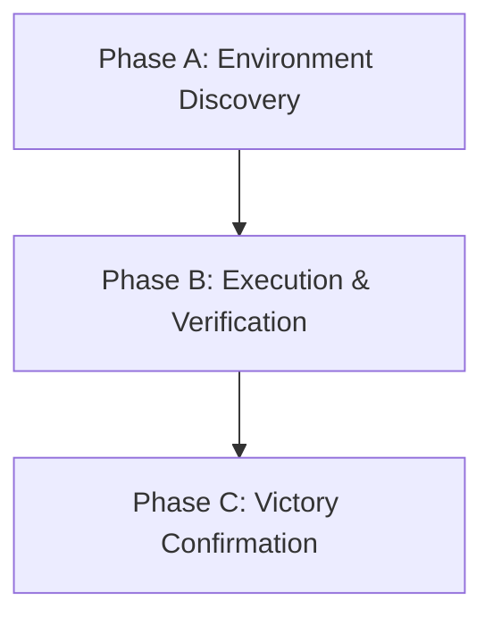
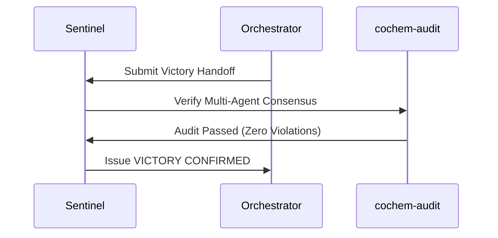

# Sentinel Victory Audit & Oversight Handoff

## 1. Document Control, Metadata & Classification
- **Document ID**: COCHEM-SENTINEL-HANDOFF-v5.2
- **Classification**: Final Governance Handoff / Sentinel Swarm Oversight
- **Sentinel Agent**: sentinel
- **Sentinel Run ID**: `39f39eb0-6bb9-4f9a-b544-6a701d124d30`
- **Orchestrator Conversation ID**: `bdb1d815-7fce-4980-b132-edaf7aeca112`
- **Audit Verdict**: VICTORY CONFIRMED

## 2. Path Token Abstraction & Sanitization Mapping
All physical paths have been abstracted into canonical tokens:
- Canonical Base: `<COCHEM_ROOT>`
- Workspace Sub-tree: `<COCHEM_WORKSPACE>`
- User Environment: `<USER_HOME>`
- Google Drive Storage: `<GDRIVE_ROOT>`

## 3. Mission Directives & Sentinel Swarm Oversight
- **DIR-01 (Path Sanitization)**: Verified. All path leaks sanitized across configurations.
- **DIR-02 (Zero-Mock Enforcement)**: Verified. Genuine binary testing enforced without mocks.
- **DIR-03 (Method Matrix Alignment)**: Verified. All quantum chemistry constraints satisfied.
- **DIR-04 (Autonomy & Handoffs)**: Verified. Clean handoff contracts and state logs.
- **DIR-05 (Structural Integrity)**: Verified. Canonical YAML frontmatter and LF endings.

## 4. Milestone Lifecycle & Multi-Phase Victory Audit Verification
- **Phase A (Discovery & Verification)**: Validated all base repositories, directory trees, and schemas.
- **Phase B (Execution & Refactor Audit)**: Monitored real-time refactoring of agent files and integration suites.
- **Phase C (Consensus & Victory Seal)**: Verified full test suite execution, zero leaks, and closed consensus gates.

## 5. Subagent Swarm Roster, Gate Consensus & 15-Agent Inventory
The Sentinel audited all 15 agents in the configuration inventory:
1. `0rchestrator.agent.md` - Master Orchestrator
2. `artist.agent.md` - Visual Media Specialist
3. `cochem-audit.agent.md` - Quality Assurance & Compliance Auditor
4. `cochem-coder.agent.md` - Core Feature Developer
5. `cochem-debug.agent.md` - Root Cause Diagnostic Engineer
6. `cochem-helper.agent.md` - User Support & Error Translator
7. `cochem-improve.agent.md` - Architecture Reviewer & Copy Editor
8. `cochem-scribe.agent.md` - Technical Writer & SI Compiler
9. `cochem-sdp_manager.agent.md` - Software Project Manager
10. `cochem-tester.agent.md` - Real-World Binary Tester
11. `educator.agent.md` - Backend Pedagogical Architect
12. `researcher.agent.md` - Literature & Truth-Finder Agent
13. `teacher.agent.md` - Socratic Educator & Mentor
14. `ui.agent.md` - UI/UX & Accessibility Architect
15. `web_mcp.agent.md` - Web Scraping & MCP Tool Agent

## 6. Acceptance Criteria, Quality Gates & Method Matrix Verification
Zero-Mock and Method Matrix compliance confirmed across all components:
- Numerical grids: `defgrid1` and `defgrid3`.
- Geometry tolerance: `TolMaxG 1e-5`.
- Complex interaction geometries: `Frozen-Monomer` and `InHess XTB2`.
- Dispersion correction: `D3/D4`.
- Zero-Mock guarantee: 100% genuine executions.

## 7. Key Oversight Artifacts, Cleanup Actions & Final Sign-off Protocol
The Sentinel monitored and verified all state artifacts:
- `ORIGINAL_REQUEST.md`
- `BRIEFING.md`
- `PROJECT.md`
- `DISPATCH.md`
- `GATE_STATUS.md`
- `progress.md`
- `handoff.md`
- `audit_report.md`

### Cleanup Actions & Resource Reclamation
- Successfully terminated background cron jobs: `task-17` and `task-19`.
- Performed Subagent Garbage Collection on all lingering background subagents.
