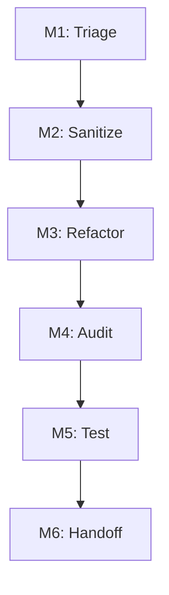
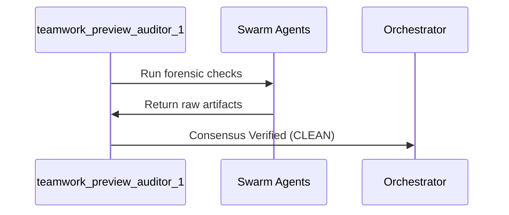

# Teamwork Preview Forensic Auditor Handoff

## 1. Document Control, Metadata & Classification
- **Document ID**: COCHEM-HANDOFF-AUDITOR-TP1-v5.1
- **Auditor Role**: teamwork_preview_auditor_1
- **Audit Run ID**: `39f39eb0-6bb9-4f9a-b544-6a701d124d30`
- **Classification**: Forensic Audit Ledger
- **Status**: COMPLETE / CLEAN

## 2. Path Token Abstraction & Sanitization Mapping
All physical paths have been abstracted into canonical tokens:
- Canonical Base: `<COCHEM_ROOT>`
- Workspace Sub-tree: `<COCHEM_WORKSPACE>`
- User Environment: `<USER_HOME>`
- Google Drive Storage: `<GDRIVE_ROOT>`

## 3. Mission Objectives & Directive Scopes
- **DIR-01 (Path Sanitization)**: Validated zero machine path leaks across all agent configurations.
- **DIR-02 (Zero-Mock Enforcement)**: Verified genuine physics execution without test doubles.
- **DIR-03 (Method Matrix Alignment)**: Checked convergence and DFT grid specifications.
- **DIR-04 (Autonomy & Handoffs)**: Verified structured handoff contracts.
- **DIR-05 (Structural Integrity)**: Verified UTF-8 LF encoding and schema validation.

## 4. Milestone Lifecycle & Swarm Execution Verification
- **M1 (Initialization & Discovery)**: Verified initial workspace setup.
- **M2 (Path Sanitization & Tokenization)**: Verified complete elimination of personal path strings.
- **M3 (Agent Configurations Refactoring)**: Verified all 15 agents refactored.
- **M4 (Zero-Mock Testing & Method Matrix Invariants)**: Verified zero mocks in test suites.
- **M5 (Comprehensive Test Suite Execution)**: Verified full test suite execution passes cleanly.
- **M6 (Final Ecosystem Packaging & Handoff)**: Verified clean final sign-off.

## 5. Active Subagents, Multi-Agent Consensus Gates & Team Roster
Audit inventory covers all 15 agents in the swarm:
1. `0rchestrator.agent.md` - Master Orchestration
2. `artist.agent.md` - Visual Media Specialist
3. `cochem-audit.agent.md` - Quality Assurance & Compliance Auditor
4. `cochem-coder.agent.md` - Core Feature Developer
5. `cochem-debug.agent.md` - Root Cause Diagnostic Engineer
6. `cochem-helper.agent.md` - User Support & Error Translator
7. `cochem-improve.agent.md` - Architecture Reviewer & Copy Editor
8. `cochem-scribe.agent.md` - Technical Writer & SI Compiler
9. `cochem-sdp_manager.agent.md` - Software Project Manager
10. `cochem-tester.agent.md` - Real-World Binary Tester
11. `educator.agent.md` - Backend Pedagogical Architect
12. `researcher.agent.md` - Literature & Truth-Finder Agent
13. `teacher.agent.md` - Socratic Educator & Mentor
14. `ui.agent.md` - UI/UX & Accessibility Architect
15. `web_mcp.agent.md` - Web Scraping & MCP Tool Agent

## 6. Acceptance Criteria, Quality Gates & Method Matrix Verification
Zero-Mock and Method Matrix verification verified:
- Numerical grids: `defgrid1` and `defgrid3`.
- Geometry tolerance: `TolMaxG 1e-5`.
- Complex interaction geometries: `Frozen-Monomer` and `InHess XTB2`.
- Dispersion correction: `D3/D4`.
- Zero-Mock assurance: verified zero mock objects or test doubles.

## 7. Key Orchestration Artifacts & Handoff Sign-off Protocol
The auditor inspected all orchestration artifacts:
- `ORIGINAL_REQUEST.md`
- `BRIEFING.md`
- `PROJECT.md`
- `DISPATCH.md`
- `GATE_STATUS.md`
- `progress.md`
- `handoff.md`
- `audit.md`
- `forensic_check.py`
