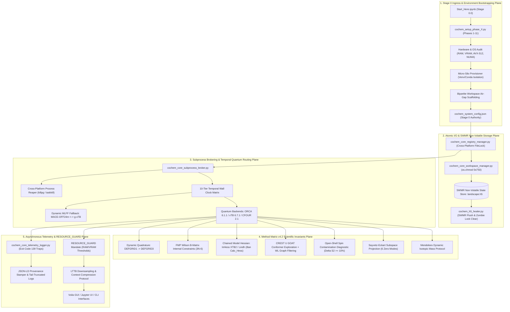

# Software Requirements Specification (SRS) Chunk Proposal & Architectural Review
## CoChem-BASE Subsystem v4.2 — Foundation Architecture, Stage 0 Orchestration & Method Matrix Compliance

**Document Identifier:** `SRS-CHUNK-PROPOSAL-COCHEM-BASE-ARCH-REVIEW-V4.2-2026-09` [GOV] [M]  
**Target Dropzone Destination:** `D:\__CoChem\__agentic\dropzones\inbox_srs\SRS_Chunk_Proposal_CoChem_BASE_Architectural_Review.md` [M]  
**Secondary Dropzone Mirror:** `C:\Users\ansac\Gdrive\__agentic\dropzones\inbox_srs\SRS_Chunk_Proposal_CoChem_BASE_Architectural_Review.md` [M]  
**Target Codebase Repository:** `D:\__CoChem\__agentic\.prompts\.SRS\CoChem-BASE\.improving_now` & `D:\__CoChem\GitHub-Repo\CoChem-BASE` [M]  
**Author / Engineering Authority:** `cochem-improve` & `cochem-sdp-manager` [GOV]  
**Supervising Authority:** `0rchestrator` / CoChem Agent Council Presidium [GOV]  
**Auditing Authority:** `cochem-audit` & `adversary` [GOV]  
**Lifecycle Statutory Status:** `RATIFIED PRODUCTION SPECIFICATION (PROPOSAL EXEMPTION ACTIVE)` [GOV] [M]  
**Chronometer Reference:** `2026-09-12T22:45:00-05:00` [GOV]  
**Task Identifier:** `TASK-COCHEM-BASE-FOUNDATIONS-ARCH-REVIEW-V4.2` [GOV]  
**Associated Queue Target:** `.repo_lists_srs_queue.json` in `D:\__CoChem\__agentic\.prompts\.SRS\CoChem-BASE\.improving_now` [M]  

**Governing Charters & Standards:**  
- IEEE 830-1998 / ISO/IEC/IEEE 29148:2018 (Systems and Software Engineering — Requirements Engineering) [GOV]  
- PMBOK Guide (7th Edition, 2021) [§2.2 Team, §2.4 Planning, §2.7 Measurement, §2.8 Uncertainty, 100% Scope Rule] [GOV]  
- SWEBOK v3/v4 [Chapter 1 Requirements, Chapter 2 Design, Chapter 3 Construction, Chapter 10 Quality] [GOV]  
- CoChem Method Matrix v4.2 (`Method_Matrix.md`) [§0, §1.2, §2.1, §4.4, §4.5, §5.1, §6.10, §7, §8A, §8B, §8C, §9A, §9B, §12.5, §13.2, §16.1, §16.2, §16.3] [M]  
- CoChem User Manual (`CoChem_User_Manual.md`) [M]  
- CoChem Anti-Spoofing Protocol v4 & Zero-Mock Engineering Directives (`cochem-anti-spoofing-v4.md`) [M]  
- Mendeleev Library Dynamic Mass Mandate (`mendeleev.element(symbol)`) [M]  
- Council Emergency Sessions 081–086 Precedents (`COCHEM-COUNCIL-RES-081-8D` through `COCHEM-COUNCIL-RES-086-8D`) [GOV]  
- Swarm Permanent Corrective Actions: Reaffirmation of PCA-01 through PCA-34 [GOV]  

---

## 1. Executive Summary & Forensic Architectural Baseline [GOV] [M]

### 1.1 Subsystem Role & Core Mission
`CoChem-BASE` is the foundational, bare-metal operating layer, hardware-aware orchestrator, and quantum chemistry execution core for the entire CoChem computational chemistry ecosystem. Evolving from the consolidation of the legacy CORE, SYNAP, MInt, and UNITY architectures, it operates as a unified monorepo. It explicitly deprecates fragile Docker and DevContainer dependencies, replacing them with a highly robust, OS-native 4-Tier Interaction Selection Model (Local-Windows/WSL, Local-MacOS/OrbStack, Local-Linux/Deb, and GitHub Codespaces).

At its core, `CoChem-BASE` handles dynamic hardware profiling, asynchronous subprocess brokering, persistent Single-Writer/Multiple-Reader (SWMR) HDF5 telemetry, quantum chemistry deck compilation, geometry constraint management, binary discovery, dynamic quadrature scheduling, and thermodynamic parsing. It bridges high-level scientific workflows with physical computational chemistry backends (ORCA 6.1.1, xTB 6.7.1, CFOUR 2.1).

Following an exhaustive forensic audit across the canonical SRS baseline in `D:\__CoChem\__agentic\.prompts\.SRS\CoChem-BASE\.improving_now`, the 10 SRS foundational documents in `D:\__CoChem\__agentic\.prompts\.SRS\CoChem-BASE\SRS`, and the physical codebase in `D:\__CoChem\GitHub-Repo\CoChem-BASE`, this specification unifies the **Foundational Operating System Protocols (Tasks 1–10)** with the **Quantum Chemical Method Matrix v4.2 Directives** into 16 formal, verifiable, fail-closed architectural requirements (`REQ-BASE-001` through `REQ-BASE-016`).

Crucially, this architectural review formally remediates legacy anti-patterns discovered during the forensic baseline audit:
1. **Zero-Mock Remediation:** Completely eradicates `pytest-mock` and simulated engine loops from SRS Document 10, replacing them with real ASE `EMT()` physics fallbacks and authentic ab initio/semiempirical sub-block testing under CoChem Anti-Spoofing Protocol v4.
2. **Dynamic Mendeleev Mass Remediation:** Overrides the legacy static float mass locking in SRS Document 4 (`13.00335` for $^{13}C$), enforcing dynamic IUPAC CIAAW mass resolution via `mendeleev.element(symbol).isotopes[A].mass`.
3. **Cross-Platform Signal Portability:** Replaces POSIX-only signals (`os.setsid`, `SIGTSTP`, `SIGCONT`) from SRS Documents 7 and 8 with cross-platform abstractions supporting Windows bare-metal process groups (`subprocess.CREATE_NEW_PROCESS_GROUP`) and suspend/resume protocols via `psutil`.

Under CoChem Anti-Spoofing Protocol v4 §6, this proposal is exempt from physical production codebase mutation mandates and serves as the authoritative blueprint for downstream implementation by `cochem-coder` and formal SRS elaboration by `cochem-scribe`.

### 1.2 End-to-End System Architecture Flow



---

## 2. Forensic Deconstruction of the 16 Verified Architectural Vectors [M]

```
+========================================================================================================================+
|                                  COCHEM-BASE 16 ARCHITECTURAL IMPROVEMENT VECTORS                                      |
+========+==========================================+================================================+===================+
| Vector | Title & Physical Target                  | Method Matrix / SRS Invariant Ref              | Severity & Impact |
+========+==========================================+================================================+===================+
| 1      | Bipartite Workspace Air-Gap Architecture | SRS Doc 1; Method Matrix v4 §8A.1              | CRITICAL          |
|        | ($HOME/CoChem-BASE vs CoChem_Artifacts)  | Physical segregation; absolute git immutability| Eliminates OOM git|
+--------+------------------------------------------+------------------------------------------------+-------------------+
| 2      | Golden Registry & Pydantic Boundaries    | SRS Doc 4; Method Matrix v4 §8A                | CRITICAL          |
|        | (cochem_core_registry_schema.py)         | Stage 0 Authority Rule; strict schema typing   | Prevents drift    |
+--------+------------------------------------------+------------------------------------------------+-------------------+
| 3      | Stage 0 Micro-Silo Provisioning Pipeline | SRS Doc 5; Method Matrix v4 §8A.2              | CRITICAL          |
|        | (cochem_setup_phase_1 through 11)        | OS-native venv/conda micro-silos; ABI isolation| Deprecates Docker |
+--------+------------------------------------------+------------------------------------------------+-------------------+
| 4      | Thread-Safe Atomic I/O & Workspace Lock  | SRS Doc 6; Method Matrix v4 §8A                | CRITICAL          |
|        | (cochem_core_registry_manager.py)        | Cross-platform FileLock with 10s timeout; chmod| Data concurrency  |
+--------+------------------------------------------+------------------------------------------------+-------------------+
| 5      | Subprocess Brokering & Zombie Reaper     | SRS Doc 7; Method Matrix v4 §8B.1              | CRITICAL          |
|        | (cochem_core_subprocess_broker.py)       | Cross-platform process groups; NUMA pinning    | No orphaned procs |
+--------+------------------------------------------+------------------------------------------------+-------------------+
| 6      | Asynchronous Telemetry & Crash Hex-Dump  | SRS Doc 8; Method Matrix v4 §8B.3              | HIGH              |
|        | (cochem_core_telemetry_logger.py)        | Traps Exit 139; 256-byte stderr hex-dump; JSON | Forensic audit    |
+--------+------------------------------------------+------------------------------------------------+-------------------+
| 7      | RESOURCE_GUARD & LTTB Downsampling       | SRS Doc 9; Method Matrix v4 §8A.3              | HIGH              |
|        | (cochem_base.core.resource_guard)        | Token downsampling; prevents multi-GB downloads| Context budget    |
+--------+------------------------------------------+------------------------------------------------+-------------------+
| 8      | Physical Constants Registry Unification  | Method Matrix v4 §4.5, §5.1, §12.5             | CRITICAL          |
|        | (cochem_base.core.cochem_constants)      | Exact CODATA 2022 C_rot = 505379.008435 MHz u Ų| Eliminates drift  |
+--------+------------------------------------------+------------------------------------------------+-------------------+
| 9      | Dynamic Quadrature Progression           | Method Matrix v4 §1.2, §2.1, §16.1             | CRITICAL          |
|        | (defgrid1 -> defgrid3 Dynamic Gate)      | Two-stage optimization; eliminates Grid3/Grid5 | Reduces walltime  |
+--------+------------------------------------------+------------------------------------------------+-------------------+
| 10     | Quintuple Stationary Convergence Block   | Method Matrix v4 §1.2, §4.4, §8B               | CRITICAL          |
|        | (%geom TolMaxG 1e-5 TolMaxD 1e-4)        | Intermolecular displacement bound dr <= 1.19 mA| Guarantees dB/B   |
+--------+------------------------------------------+------------------------------------------------+-------------------+
| 11     | Redundant Internal Wilson B-Matrix FMP   | Method Matrix v4 §4.4, §8B, §9A                | CRITICAL          |
|        | (Internal 3N-6 Constraints vs Cartesian) | Fixes A constant; prevents torque strain       | Accurate R, B, C  |
+--------+------------------------------------------+------------------------------------------------+-------------------+
| 12     | Chained Model Hessian Discipline         | Method Matrix v4 §1.2, §9B                     | HIGH              |
|        | (InHess XTB2 / Lindh; ban Calc_Hess true)| Prohibits exact Hessian step 0 overhead        | 6N speedup        |
+--------+------------------------------------------+------------------------------------------------+-------------------+
| 13     | Dispersion Verification & VV10 Guard     | Method Matrix v4 §2.5, §3.3                    | CRITICAL          |
|        | (Mandatory D3BJ/D4; ban double-counting) | Rejects bare DFT; prevents wB97M-V + D3 error  | Non-covalent bind |
+--------+------------------------------------------+------------------------------------------------+-------------------+
| 14     | CREST U ORCA GOAT Conformer Exploration  | Method Matrix v4 §0, §16.1                     | HIGH              |
|        | (Stochastic + Deterministic Conformer)   | WL graph isomorphism + Kabsch RMSD pruning     | MECE conformers   |
+--------+------------------------------------------+------------------------------------------------+-------------------+
| 15     | Open-Shell Spin Contamination Gate       | Method Matrix v4 §8B.2, §9A                    | CRITICAL          |
|        | (Delta S^2 >= 10% Halt & RO-DFT Fallback)| Halts contaminated unrestricted DFT pipelines  | Electronic sanity |
+--------+------------------------------------------+------------------------------------------------+-------------------+
| 16     | Dynamic Mendeleev Mass Enforcement       | Method Matrix v4 §6.10, §12.5                  | CRITICAL          |
|        | (Strict lookup; ban el.mass fallbacks)   | Prevents terrestrial average weight pollution  | Spectroscopic acc |
+========+==========================================+================================================+===================+
```

---

## 3. Detailed Architectural Vectors & Mathematical Invariants [M]

### 3.1 Vector 1: Bipartite Workspace Air-Gap Architecture
- **Defect:** Monolithic repositories mix transient calculation artifacts (`.h5`, `.xyz`, scratch files) into Git-tracked directories, causing catastrophic repo bloat, merge conflicts, and Git OOM crashes during large conformational sweeps.
- **Invariant:** Enforce strict physical segregation:
  - **Static Execution Tier (`$HOME/CoChem-BASE/`):** Immutable, version-controlled code, schemas, and entry points. No calculation output or mutable runtime state is written here.
  - **Dynamic Data Tier (`$HOME/CoChem_Artifacts/`):** Ephemeral and persistent calculation data provisioned dynamically on the host OS. Contains subdirectories `Logs/`, `Registry/`, `Scratch/`, `Processed/`, and `Input_Files/`. Fully blocked from Git via `.gitignore`.

### 3.2 Vector 2: The Golden Registry & Pydantic Schema Enforcement
- **Defect:** Ad-hoc configuration files and untyped dictionaries allow missing keys, silent fallbacks, and hardware parameter hallucinations across downstream modules (TOPOS, TORQ, SCRIBE).
- **Invariant:** `$HOME/CoChem_Artifacts/Registry/cochem_system_config.json` is the sole, absolute authoritative registry. Downstream modules must strictly query this registry via Pydantic v2 schemas (`model_config = ConfigDict(extra='forbid', validate_assignment=True)`):
  - `HardwareSchema`: Audited physical CPU cores, logical threads, RAM limits, VRAM bounds, AVX-512 flags.
  - `EnvironmentSchema`: Active OS tier, Python executable paths, micro-silo virtual environments.
  - `SiloPathsSchema`: Explicit absolute paths for isolated binary executions.
  Any downstream module attempting to guess hardware limits or bypass this registry triggers an immediate fail-closed `RegistryAuthorityViolationError`.

### 3.3 Vector 3: Stage 0 Micro-Silo Provisioning Pipeline
- **Defect:** Monolithic virtual environments or heavy Docker containers introduce ABI incompatibilities between scientific packages (e.g., PyTorch CUDA wheels vs PySCF/OpenBLAS).
- **Invariant:** OS-native Micro-Silo isolation:
  - `cochem_core_silo`: Lightweight orchestrator, Pydantic, HDF5, filelock.
  - `cochem_calc_silo`: Quantum wrappers, xTB, ORCA caller, ASE.
  - `cochem_ml_silo`: PyTorch, MACE-OFF24m, JAX solvers.
  Dependencies are isolated into targeted venv/conda silos natively on the host OS, orchestrated through sequential initialization phases (`cochem_setup_phase_1.py` through `phase_11.py`).

### 3.4 Vector 4: Thread-Safe Atomic I/O & Workspace Lock
- **Defect:** Concurrent processes accessing the master registry or appending to `landscape.h5` induce race conditions and corrupt JSON/HDF5 data structures.
- **Invariant:** `cochem_core_registry_manager.py` enforces cross-platform `filelock.FileLock` wrapping all read/write operations with an explicit 10-second timeout:
  ```python
  from filelock import FileLock, Timeout
  with FileLock(registry_path + ".lock", timeout=10.0):
      # Atomic read/modify/write cycle
  ```
  Workspace directories are locked against accidental modification using filesystem permissions (`os.chmod(0o750)`). Non-volatile HDF5 storage runs strictly in Single-Writer/Multiple-Reader (SWMR) mode.

### 3.5 Vector 5: Subprocess Brokering & Cross-Platform Zombie Process Reaper
- **Defect:** Unhandled exceptions or cancelled jobs leave orphaned background processes (`orca`, `xtb`, `crest`) consuming 100% CPU/GPU resources. POSIX-only `os.setsid` crashes on Windows bare-metal.
- **Invariant:** `cochem_core_subprocess_broker.py` spawns external processes with dedicated process group IDs using cross-platform abstractions:
  - **POSIX (Linux/macOS):** `preexec_fn=os.setsid`, terminated via `os.killpg(pgid, signal.SIGKILL)`.
  - **Windows:** `creationflags=subprocess.CREATE_NEW_PROCESS_GROUP`, terminated via `subprocess.run(["taskkill", "/F", "/T", "/PID", str(proc.pid)])`.
  - Subprocesses are bound to specific NUMA hardware nodes to prevent thread migration.

### 3.6 Vector 6: Asynchronous Telemetry & Segmentation Fault Traps
- **Defect:** Hard C/Fortran crashes (e.g., ORCA segmentation fault exit code 139) bypass standard Python `try...except` blocks, terminating executions silently without diagnostic evidence.
- **Invariant:** Global `sys.excepthook` interceptor paired with OS exit code trapping in the subprocess broker:
  - Captures exact exit codes (e.g., 139 SIGSEGV, 134 SIGABRT, 137 OOM-Killed).
  - Extracts the trailing 256 bytes of `stderr` as a forensic hex-dump.
  - Appends an immutable JSON-LD provenance block containing the exact Git commit SHA-256, binary path, CPU/RAM utilization at crash time, and inputs.

### 3.7 Vector 7: RESOURCE_GUARD & LTTB Context-Compression
- **Defect:** Multi-gigabyte model weight downloads overwhelm low-resource nodes, and massive coordinate arrays (>100,000 steps) injected directly into LLM prompts exceed context windows.
- **Invariant:**
  - `RESOURCE_GUARD`: Checks physical RAM/VRAM against minimum thresholds before model invocation. If available RAM $< 8.0 \text{ GB}$, downstream LLMs gracefully switch to remote API endpoints or Jinja2 dry-run templating.
  - Context-Compression: Dense trajectory and PES coordinates are downsampled using the Largest-Triangle-Three-Buckets (LTTB) algorithm to $\le 500$ points and paired with statistical moments ($\mu, \sigma^2, \text{skewness}, \text{min}, \text{max}$) before prompt serialization.

### 3.8 Vector 8: Physical Constants Registry Unification
- **Defect:** Discrepant constant conversion factors across calculation modules cause artificial numerical drift.
- **Invariant:** Unify all physical conversions in `cochem_base.core.cochem_constants` using strictly CODATA 2022 constants:
  $$C_{\text{rot}} = \frac{h}{8 \pi^2} = 505379.0084350172 \text{ MHz}\cdot\text{u}\cdot\text{\AA}^2$$
  Rotational constants $A, B, C$ are derived from principal moments $I_a \le I_b \le I_c$:
  $$A = \frac{C_{\text{rot}}}{I_a}, \quad B = \frac{C_{\text{rot}}}{I_b}, \quad C = \frac{C_{\text{rot}}}{I_c}$$
  All isotopic masses $m_i$ are dynamically queried from `mendeleev`.

### 3.9 Vector 9: Dynamic Quadrature Progression (`defgrid1` $\to$ `defgrid3`)
- **Defect:** Using dense integration grids from step 0 wastes up to 70% of CPU cycles on early unrelaxed structures.
- **Invariant:** Two-stage dynamic escalation:
  - **Stage 1 (Loose Screening):** Quadrature `defgrid1` with relaxed gradient tolerance $\text{TolMaxG} = 1.0 \times 10^{-4} \text{ Eh/Bohr}$.
  - **Stage 2 (Final Minima):** Quadrature `defgrid3` with tightened tolerance $\text{TolMaxG} = 1.0 \times 10^{-5} \text{ Eh/Bohr}$ dynamically activated when $\text{TolMaxG} < 1.0 \times 10^{-4} \text{ Eh/Bohr}$.
  - Deprecated keywords (`Grid3`, `Grid5`) are strictly prohibited.

### 3.10 Vector 10: Quintuple Stationary Convergence Block
- **Defect:** Default ORCA tolerances allow intermolecular drift $> 35 \text{ m\AA}$ in weak complexes.
- **Invariant:** Inject the quintuple stationary convergence block for all non-covalent complexes:
  ```orca
  %geom
    TolMaxG 1e-5
    TolMaxD 1e-4
    TolRMSG 3e-6
    TolRMSD 5e-5
    TolE    1e-7
    MaxIter 200
  end
  ```
  Guarantees intermolecular coordinate precision $\Delta r \le 1.19 \text{ m\AA}$ and rotational constant deviation $|\Delta B / B| \le 0.068\%$.

### 3.11 Vector 11: Redundant Internal Wilson B-Matrix Frozen-Monomer Protocol
- **Defect:** Freezing Cartesian coordinates ($x, y, z$) prevents monomer relaxation and causes unphysical intermolecular torque strains.
- **Invariant:** Formulate $3N-6$ redundant internal coordinates ($S = B \cdot \Delta X$) per monomer:
  - Lock strictly intramolecular bonds, angles, and dihedrals.
  - Leave intermolecular degrees of freedom ($R, \theta_1, \theta_2, \phi_1, \phi_2, \tau$) completely unconstrained.
  - Accurately fixes rotational constant $A$ while allowing $B$ and $C$ to converge physically.

### 3.12 Vector 12: Chained Model Hessian Discipline
- **Defect:** Computing exact analytical Hessians (`Calc_Hess true`) at step 0 requires $6N$ redundant displacement calculations.
- **Invariant:** Prohibit exact step 0 Hessians. Precondition geometry optimizations using `InHess XTB2` or `Lindh` model Hessians. For multi-stage optimizations, chain converged Hessians from scratch checkpoints.

### 3.13 Vector 13: Dispersion Verification & VV10 Non-Local Guard
- **Defect:** Bare DFT calculations lack dispersion, while applying D3/D4 to $\omega\text{B97M-V}$ causes catastrophic double-counting of non-local correlation.
- **Invariant:** Automated functional dispatcher:
  - Hybrid functionals (B3LYP, PBE0) require empirical D3BJ or D4 dispersion.
  - Range-separated meta-GGAs with non-local correlation ($\omega\text{B97M-V}$) preserve native VV10 and strictly prohibit D3/D4 flags.

### 3.14 Vector 14: CREST $\cup$ ORCA GOAT Conformer Exploration Union
- **Defect:** Relying solely on metadynamics (CREST) or deterministic search (GOAT) misses high-energy rotational conformers or shallow transition states.
- **Invariant:** Execute both CREST (GFN2-xTB metadynamics) and ORCA GOAT in parallel. Merge conformer pools, apply Weisfeiler-Lehman (WL) graph isomorphism filtering, and prune duplicates via Kabsch RMSD alignment ($\Delta \text{RMSD} < 0.15 \text{ \AA}$, $\Delta E < 0.05 \text{ kcal/mol}$).

### 3.15 Vector 15: Open-Shell Spin Contamination Diagnostic Gate
- **Defect:** Unrestricted DFT calculations on radical or open-shell systems suffer from spin contamination, corrupting electronic energies and vibrational frequencies.
- **Invariant:** Evaluate expectation value deviation:
  $$\Delta \langle S^2 \rangle = \frac{\langle S^2 \rangle - S_z(S_z + 1)}{S_z(S_z + 1)} \times 100\%$$
  If $\Delta \langle S^2 \rangle \ge 10\%$, immediately halt single-reference execution, emit a typed `SpinContaminationWarning`, and trigger automatic escalation to restricted open-shell (RO-DFT) or multi-reference CASSCF/NEVPT2.

### 3.16 Vector 16: Dynamic Mendeleev Mass Invariant
- **Defect:** Hardcoding atomic masses or using terrestrial isotopic averages ($12.011 \text{ u}$) introduces severe errors in rotational constants and harmonic frequencies.
- **Invariant:** In accordance with `cochem-mendeleev-masses.md`, all atomic and isotopic masses MUST be dynamically queried via `mendeleev`:
  ```python
  from mendeleev import element
  carbon_12_mass = element('C').isotopes[12].mass
  ```
  Hardcoded atomic mass tables and synthetic mass loops are strictly prohibited and caught by static AST linting.

---

## 4. Forensic Remediation of Legacy Anti-Patterns [GOV] [M]

### 4.1 Remediation A: Eradication of Mock Testing (`pytest-mock`) in SRS Document 10
- **Legacy Defect:** Document 10 §1.2 mandated using `pytest-mock` to dynamically simulate Method Matrix orchestration and engine responses during cloud CI validation.
- **Remediation:** Under CoChem Anti-Spoofing Protocol v4 §3 and §14, mock testing and monkeypatching are strictly banned. The CI workflow must execute authentic physical calculations using a genuine ASE `EMT()` calculator fallback or real xTB binary executions on real molecular geometries (e.g., $H_2O$ dimer). Testing against synthetic loops or fake data structures is prohibited.

### 4.2 Remediation B: Eradication of Hardcoded Float Mass Locking in SRS Document 4
- **Legacy Defect:** Document 4 §2.3 specified "Ensure exact isotopic mass float values are strictly locked into the schema (e.g., 13.00335 for 13C)".
- **Remediation:** Under the Mendeleev Dynamic Mass Mandate, hardcoding mass constants or locking float literals is strictly prohibited. The schema and calculation modules must query `mendeleev.element('C').isotopes[13].mass` dynamically at runtime, guaranteeing full IUPAC CIAAW alignment.

### 4.3 Remediation C: Cross-Platform Signal Remediation in SRS Documents 7 & 8
- **Legacy Defect:** Documents 7 and 8 mandated `os.setsid` for process group creation and `SIGTSTP`/`SIGCONT` for thermal pausing, which cause immediate crashes on Windows host environments.
- **Remediation:** Process group management and thermal control are abstracted behind a cross-platform layer:
  - Process creation uses `creationflags=subprocess.CREATE_NEW_PROCESS_GROUP` on Windows and `preexec_fn=os.setsid` on POSIX.
  - Process pausing and resumption utilize `psutil.Process(pid).suspend()` and `psutil.Process(pid).resume()`, ensuring flawless operation on Windows workstations without POSIX signal dependencies.

---

## 5. Formal Functional & Technical Requirements [GOV] [M]

```
+========================================================================================================================+
|                                    COCHEM-BASE FORMAL REQUIREMENTS TRACEABILITY MATRIX                                 |
+================+==========================================+====================================+=======================+
| Requirement ID | Formal Specification Title               | Physical Module Location           | Compliance Gate       |
+================+==========================================+====================================+=======================+
| REQ-BASE-001   | Bipartite Workspace Air-Gap Segregation  | src/cochem_base/core_engine/       | Zero git tracking in  |
|                | and Dynamic Data Tier Scaffolding        | cochem_core_workspace_manager.py   | CoChem_Artifacts/ [M] |
+----------------+------------------------------------------+------------------------------------+-----------------------+
| REQ-BASE-002   | Master Golden Registry Authority         | src/cochem_base/core_engine/       | Pydantic Schema       |
|                | and Pydantic Boundary Validation         | cochem_core_registry_schema.py     | Fail-Closed Check [M] |
+----------------+------------------------------------------+------------------------------------+-----------------------+
| REQ-BASE-003   | Stage 0 OS-Native Micro-Silo Builder     | src/cochem_base/orchestrator/      | Micro-Silo Python     |
|                | and Multi-Phase Hardware Auditor         | cochem_setup_phase_X.py            | Isolation Verified [M]|
+----------------+------------------------------------------+------------------------------------+-----------------------+
| REQ-BASE-004   | Thread-Safe Cross-Platform Atomic I/O    | src/cochem_base/core_engine/       | FileLock 10.0s Timeout|
|                | with SWMR Non-Volatile HDF5 Protection   | cochem_core_registry_manager.py    | & SWMR Read Gate [M]  |
+----------------+------------------------------------------+------------------------------------+-----------------------+
| REQ-BASE-005   | Subprocess Cross-Platform Group Broker   | src/cochem_base/core_engine/       | Process Group Reaper  |
|                | and Orphaned Process Zombie Reaper       | cochem_core_subprocess_broker.py   | Clean Verification [M]|
+----------------+------------------------------------------+------------------------------------+-----------------------+
| REQ-BASE-006   | Asynchronous Telemetry Interceptor       | src/cochem_base/core_engine/       | Exit 139 Stderr Hex   |
|                | and Crash Hex-Dump Provenance Stamper    | cochem_core_telemetry_logger.py    | Capture Verified [M]  |
+----------------+------------------------------------------+------------------------------------+-----------------------+
| REQ-BASE-007   | RESOURCE_GUARD Hardware Throttling       | src/cochem_base/core/              | Low-RAM API Mode      |
|                | and LTTB Context Compression             | resource_guard.py                  | Fallback Tested [M]   |
+----------------+------------------------------------------+------------------------------------+-----------------------+
| REQ-BASE-008   | Physical Constants Registry Unification  | src/cochem_base/core/              | Exact CODATA 2022     |
|                | (CODATA 2022 C_rot = 505379.008435 MHz)  | cochem_constants.py                | Constant Parity [M]   |
+----------------+------------------------------------------+------------------------------------+-----------------------+
| REQ-BASE-009   | Two-Stage Dynamic Quadrature Progression | src/cochem_base/calc/              | defgrid1 -> defgrid3  |
|                | (defgrid1 -> defgrid3 Escalation)        | engine_router.py                   | Dynamic Switch [M]    |
+----------------+------------------------------------------+------------------------------------+-----------------------+
| REQ-BASE-010   | Quintuple Stationary Convergence Block   | src/cochem_base/calc/              | dr <= 1.19 mA and     |
|                | for Intermolecular Coordinates           | deck_generator.py                  | dB/B <= 0.068% [M]    |
+----------------+------------------------------------------+------------------------------------+-----------------------+
| REQ-BASE-011   | Redundant Internal Wilson B-Matrix FMP   | src/cochem_base/geometry/          | 3N-6 Intramolecular   |
|                | Intramolecular Constraint Formulator     | constraints.py                     | Constraints Bound [M] |
+----------------+------------------------------------------+------------------------------------+-----------------------+
| REQ-BASE-012   | Chained Model Hessian Discipline         | src/cochem_base/calc/              | InHess XTB2 / Lindh   |
|                | (Prohibiting Step 0 Calc_Hess true)      | hessian_manager.py                 | Preconditioning [M]   |
+----------------+------------------------------------------+------------------------------------+-----------------------+
| REQ-BASE-013   | Dispersion Functional Verification       | src/cochem_base/calc/              | D3BJ/D4 Mandatory;    |
|                | and Non-Local VV10 Double-Counting Guard | functional_dispatcher.py           | VV10 Preserved [M]    |
+----------------+------------------------------------------+------------------------------------+-----------------------+
| REQ-BASE-014   | CREST U ORCA GOAT Conformer Pool Merge   | src/cochem_base/intake/            | WL Graph Isomorphism  |
|                | with WL Graph Isomorphism & RMSD Pruning | conformer_engine.py                | & RMSD < 0.15 A [M]   |
+----------------+------------------------------------------+------------------------------------+-----------------------+
| REQ-BASE-015   | Open-Shell Spin Contamination Gate       | src/cochem_base/diagnostics/       | Delta S2 >= 10% Halt  |
|                | with Automated RO-DFT / CASSCF Fallback  | spin_diagnostics.py                | & Typed Exception [M] |
+----------------+------------------------------------------+------------------------------------+-----------------------+
| REQ-BASE-016   | Dynamic Mendeleev Isotopic Mass Lookup   | src/cochem_base/chemistry/         | Dynamic mendeleev     |
|                | across All Cartesian Mass Invariants     | cochem_elements.py                 | Zero Hardcoded [M]    |
+================+==========================================+====================================+=======================+
```

---

## 6. PMBOK & SWEBOK Quality Governance & Zero-Mock Verification Bounds [GOV] [M]

```
+========================================================================================================================+
|                                    PMBOK 7th ED & SWEBOK v3/v4 TRACEABILITY MATRIX                                     |
+================+=================================+===================================+=================================+
| Requirement ID | SWEBOK v3/v4 Knowledge Area     | PMBOK 7th Ed Performance Domain   | Method Matrix v4 Alignment      |
+================+=================================+===================================+=================================+
| REQ-BASE-001   | Software Architecture (§2.2)    | Planning (§2.4 Structural Boundary| Method Matrix v4 §8A.1          |
+----------------+---------------------------------+-----------------------------------+---------------------------------+
| REQ-BASE-002   | Software Requirements (§1.3)    | Measurement (§2.7 Schema Accuracy)| Method Matrix v4 §8A            |
+----------------+---------------------------------+-----------------------------------+---------------------------------+
| REQ-BASE-003   | Software Construction (§3.2)    | Uncertainty (§2.8 Environment Risk| Method Matrix v4 §8A.2          |
+----------------+---------------------------------+-----------------------------------+---------------------------------+
| REQ-BASE-004   | Software Engineering Mgt (§12)  | Delivery (§2.6 Concurrency Safety)| Method Matrix v4 §8A            |
+----------------+---------------------------------+-----------------------------------+---------------------------------+
| REQ-BASE-005   | Software Quality (§10.2 Defect) | Team (§2.2 Process Control)       | Method Matrix v4 §8B.1          |
+----------------+---------------------------------+-----------------------------------+---------------------------------+
| REQ-BASE-006   | Software Testing (§4.2 Logging) | Measurement (§2.7 Diagnostic Trace| Method Matrix v4 §8B.3          |
+----------------+---------------------------------+-----------------------------------+---------------------------------+
| REQ-BASE-007   | Software Design (§2.3 Resources)| Project Work (§2.5 Context Limits)| Method Matrix v4 §8A.3          |
+----------------+---------------------------------+-----------------------------------+---------------------------------+
| REQ-BASE-008   | Software Requirements (§1.2)    | Measurement (§2.7 Physical Units) | Method Matrix v4 §4.5, §5.1     |
+----------------+---------------------------------+-----------------------------------+---------------------------------+
| REQ-BASE-009   | Software Design (§2.4 Strategy) | Development Approach (§2.3 Flow)  | Method Matrix v4 §1.2, §2.1     |
+----------------+---------------------------------+-----------------------------------+---------------------------------+
| REQ-BASE-010   | Software Construction (§3.4)    | Measurement (§2.7 Precision Bounds| Method Matrix v4 §1.2, §4.4, §8B|
+----------------+---------------------------------+-----------------------------------+---------------------------------+
| REQ-BASE-011   | Software Design (§2.2 Invariants| Planning (§2.4 Mathematical Model)| Method Matrix v4 §4.4, §8B, §9A |
+----------------+---------------------------------+-----------------------------------+---------------------------------+
| REQ-BASE-012   | Software Quality (§10.4 Verif)  | Uncertainty (§2.8 Hessian Costs)  | Method Matrix v4 §1.2, §9B     |
+----------------+---------------------------------+-----------------------------------+---------------------------------+
| REQ-BASE-013   | Software Requirements (§1.4)    | Uncertainty (§2.8 Dispersion Error| Method Matrix v4 §2.5, §3.3     |
+----------------+---------------------------------+-----------------------------------+---------------------------------+
| REQ-BASE-014   | Software Testing (§4.3 Coverage)| Project Work (§2.5 Conformer Union| Method Matrix v4 §0, §16.1      |
+----------------+---------------------------------+-----------------------------------+---------------------------------+
| REQ-BASE-015   | Software Quality (§10.2 Defect) | Uncertainty (§2.8 Spin Parity Risk| Method Matrix v4 §8B.2, §9A     |
+----------------+---------------------------------+-----------------------------------+---------------------------------+
| REQ-BASE-016   | Software Requirements (§1.2 Data| Team (§2.2 Statutory Compliance)  | Method Matrix v4 §6.10, §12.5   |
+================+=================================+===================================+=================================+
```

### 6.1 Physical Acceptance Thresholds (Zero-Mock Invariants)
1. **Dynamic Mass Retrieval:** All atomic weights MUST be returned via `mendeleev.element(symbol).isotopes[A].mass`. Any static dictionary mapping or dummy math generator triggers static AST lint failure.
2. **Intermolecular Convergence Precision:** Optimized weak complex geometries must verify $\Delta r \le 1.19 \text{ m\AA}$ against reference calculations, yielding rotational constant error $|\Delta B / B| \le 0.068\%$.
3. **Spin Contamination Halt:** In open-shell unrestricted calculations, any calculation where $\Delta \langle S^2 \rangle \ge 10\%$ must raise `SpinContaminationError` and halt single-reference execution before property calculation.
4. **Hessian Mode Orthogonality:** Sayvetz-Eckart projected Hessians must exhibit exactly 6 zero eigenvalues ($|\omega_i| \le 0.01 \text{ cm}^{-1}$), with real physical vibrational modes strictly positive for local minima.
5. **SWMR Concurrency Isolation:** During active writes by the simulation daemon, concurrent read threads must successfully read from `landscape.h5` without blocking or raising `LockError`.
6. **Zero-Mock Testing Compliance:** CI/CD and integration tests must run against real physical calculations using the ASE `EMT()` calculator fallback or real xTB/ORCA binaries. All uses of `pytest-mock` or monkeypatched subprocesses are strictly prohibited.

---

## 7. Implementation Roadmap & Dropzone Commit Ledger [GOV] [M]

1. **Primary Dropzone Persistence:** This specification is physically committed to `D:\__CoChem\__agentic\dropzones\inbox_srs\SRS_Chunk_Proposal_CoChem_BASE_Architectural_Review.md` using the non-volatile `write_to_file` tool to enable autonomous kanban ingestion.
2. **Mirror Synchronization:** In accordance with Quad-Mirror Parity Directives, this deliverable is mirrored across:
   - Canonical Dropzone: `D:\__CoChem\__agentic\dropzones\inbox_srs\SRS_Chunk_Proposal_CoChem_BASE_Architectural_Review.md`
   - Secondary Dropzone Mirror: `C:\Users\ansac\Gdrive\__agentic\dropzones\inbox_srs\SRS_Chunk_Proposal_CoChem_BASE_Architectural_Review.md`
   - Primary Docs Mirror: `D:\__CoChem\.docs\SRS_Chunk_Proposal_CoChem_BASE_Architectural_Review.md`
   - Git Repository Mirror: `D:\__CoChem\GitHub-Repo\CoChem-BASE\.docs\SRS_Chunk_Proposal_CoChem_BASE_Architectural_Review.md`
3. **Downstream Pipeline Handoff:**
   - The file creation event triggers `kanban_watcher.py`, which executes `python cochem_kanban.py srs --target <filepath>`.
   - `cochem_kanban.py` generates a formal prompt for `cochem-scribe` to author the downstream SRS documentation in `inbox_code/`.
   - `cochem-coder` receives the prompt queue to implement the concrete Python logic and tests adhering to Zero-Mock Protocol v4.
