# Level 3 Work Breakdown Structure (WBS) Tracking Master: Task 3
## Dynamic Quadrature Lifecycle & Electronic Sanitization Plane (VR-03 & VR-05)

**Document Identifier:** `COCHEM-WBS-TASK3-L3-TRACKING-2026` [M]  
**Document Version:** 1.1.0 (Authoritative Council Release: Formal PMBOK Standards Integration Baseline — Scope Baseline & WBS Dictionary, IEEE 830 Quality Gates, Inter-Agent Handoff Contracts, Single-Accountability RACI Matrix with A=1, and 5-Part Multi-Environment Risk Register) [M]  
**Authoring Authority / Role:** `cochem-sdp-manager` (Software Development Project Manager, CoChem Agent Council) [M]  
**Governing Standards:** PMBOK Guide 7th Edition (Systems View for Project Delivery & Scope Management Domain), SWEBOK v3.0/v4.0 (Software Requirements Engineering, Software Design, Software Quality Management), IEEE 830-1998 / ISO/IEC/IEEE 29148:2018 (Software Requirements Specifications), Method Matrix v4.1 (§1.2, §2.2, §2.5, §2.8, §2.9, §2.10, §3.0, §3.3, §4.4, §8A–8C, §9A, VR-03, VR-05), CoChem Anti-Spoofing Protocol v4 & Zero-Mock Verification Mandates [M]  
**Supervising Swarm Controller:** `0rchestrator` (Swarm Workflow Supervisor & Router) [M]  
**Primary Scratch File:** [`Task_List_Task3_WBS.md`](file:///C:/Users/ansac/.gemini/antigravity-cli/scratch/Task_List_Task3_WBS.md) [M]  
**Repository Mirror File:** [`Task_List_Task3_WBS.md`](file:///D:/__CoChem/GitHub-Repo/CoChem-BASE/.docs/Task_List_Task3_WBS.md) [M]  
**Ecosystem Mirror File:** [`Task_List_Task3_WBS.md`](file:///D:/__CoChem/.docs/Task_List_Task3_WBS.md) [M]  
**Dropzone Mirror File:** [`Task_List_Task3_WBS.md`](file:///D:/__CoChem/__agentic/dropzones/inbox_srs/Task_List_Task3_WBS.md) [M]  
**Artifact Mirror File:** [`Task_List_Task3_WBS.md`](file:///C:/Users/ansac/.gemini/antigravity-cli/brain/8cfc332d-3fc0-489b-be29-976c4d7b16b5/Task_List_Task3_WBS.md) [M]  
**Lifecycle Status:** `APPROVED_PMBOK_BASELINE_EXECUTION_MASTER` [M]  
**Audit Ratification Reference:** `COUNCIL-SESSION-046-TASK3-4-2-RECTIFICATION` [M]  
**Timestamp:** `2026-09-11T01:13:00-05:00` [M]  

---

## Provenance Taxonomy Key
Every assertion, requirement, metric, and parameter in this tracking master carries an explicit provenance tag in accordance with the CoChem Method Matrix v4.1 governance framework [M]:
- **`[M]` (Methodological Invariant / Mandatory):** Invariant system requirement, architectural governance gate, fail-closed policy, or protocol mandate established by CoChem Agent Council rulings.
- **`[D]` (Deterministic / Domain Physics):** Mathematically derived relationship, physical law, standard definition, literature theoretical benchmark, or formal data schema.
- **`[E]` (Empirical / Experimental):** Measured benchmark timing, experimental spectroscopic observation, wall-clock performance, or forensic audit finding.
- **`[GOV]` (Governance / Council Charter):** Procedural governance mandate, separation-of-duties rule, or council resolution.
- **`[DOC]` (Documentation Standard):** Formal IEEE 830-1998 or ISO/IEC/IEEE 29148:2018 requirements documentation requirement.
- **`[PROC]` (Process Verification):** Physical execution protocol, test runner gate, or cryptographic state ledger verification.

---

## 1. Executive Scope & Formal PMBOK Scope Baseline

### 1.1 Scope Reconciliation & PMBOK 100% Rule Compliance
This tracking artifact decomposes **Level 1 Task 3: Implement Dynamic Quadrature Lifecycle & Electronic Sanitization Plane (VR-03 & VR-05)** into an exhaustive, publication-grade Level 3 Work Breakdown Structure (WBS) governed by **PMBOK 7th Edition (Systems View for Project Delivery & Scope Management Domain)** and **SWEBOK v3/v4 (Software Requirements Engineering, Software Design, Software Quality)** [M].

Under the **PMBOK 100% Rule**, this WBS captures 100% of the deliverables and technical work required to execute Task 3 with zero orphan tasks and zero extraneous scope [M]. The work packages are partitioned into **5 Canonical Technical Tracks** containing **18 Implementation Microtasks** (`L3-T3-01` through `L3-T3-18`) and **5 Level 2 Persistence Meta-WBS Work Packages** (`WBS 3.1` through `WBS 3.5` with 12 granular subtasks), forming a strictly Mutually Exclusive and Collectively Exhaustive (MECE) delivery architecture [M]:

1. **Track 1: Requirements Architecture, Interface Contracts & Ontological Disambiguation (VR-03 & VR-05):** Requirements extraction from SRS Chunk 17, tripartite ontological resolution of Product B vs Provenance [M] vs Product M, domain exception hierarchy in `src/cochem_base/exceptions.py`, and typed immutable interface schemas (`L3-T3-01` to `L3-T3-04`).
2. **Track 2: Dynamic Quadrature Lifecycle & Coupled Grid-SCF Invariant Engine (VR-03):** Three-stage dynamic grid progression (`DEFGRID1` $\to$ `DEFGRID2` $\to$ `DEFGRID3`), coupled grid-dependent SCF convergence gatekeeper (`NormalSCF` $\to$ `TightSCF` $\to$ `VeryTightSCF`), strict rejection of coarse grids for numerical frequency, harmonic Hessian, and VPT2 anharmonic calculations, and dynamic stage transition gatekeeper (`L3-T3-05` to `L3-T3-08`).
3. **Track 3: DFT Dispersion Sanitization & Multi-Body ATM Plane (VR-05):** Preflight keyword inspection, strict prohibition of empirical D3/D4 dispersion on native non-local Vydrov-van Voorhis (`VV10`) range-separated functionals ($\omega\text{B97M-V}$, $\text{rev-}\omega\text{B97M-V}$, $\text{B97M-V}$, $\text{PBE-NL}$) to prevent unphysical double-counting, mandatory empirical dispersion (`D3BJ` or `D4`) on standard hybrid functionals ($\text{B3LYP}$, $\text{PBE0}$, $\omega\text{B97X}$) for intermolecular complexes, and automated Axilrod-Teller-Muto (`ATM`) 3-body dispersion evaluation for clusters ($N_{\text{monomers}} \ge 3$) (`L3-T3-09` to `L3-T3-12`).
4. **Track 4: Singularity-Protected Spin Contamination Diagnostic Gatekeeper (VR-05):** Wavefunction diagnostic evaluating total spin squared expectation value $\langle S^2 \rangle$ against ideal eigenvalue $S(S+1)$: relative contamination gatekeeper ($\Delta \langle S^2 \rangle < 10\%$) for open-shell systems ($S > 0$), piecewise singlet singularity guard ($|\langle S^2 \rangle| < 0.05\text{ a.u.}$) for closed-shell singlets ($S = 0$), and fail-closed rerouting to Tier T9 multireference methods (RO-DFT, CASSCF, NEVPT2) upon spin contamination breach (`L3-T3-13` to `L3-T3-15`).
5. **Track 5: Zero-Trust Verification Suite, Multi-Environment Audit & Swarm Ledger Synchronization:** Execution of authentic pytest verification suites (`test_chunk17_verification_suite.py`) utilizing authentic CCCBDB/NIST molecular coordinate fixtures ($\text{CO}_2\cdots\text{H}_2\text{O}$), multi-nuclide dynamic mass verification via `mendeleev`, static AST security linter sweeps (`--strict=True`), and atomic cryptographic state ledger synchronization (`swarm_state.json`) across mirrors (`L3-T3-16` to `L3-T3-18`).

---

### 1.2 Formal Project Scope Statement: In-Scope Deliverables & Out-of-Scope Boundaries

```
+======================================================================================================================================+
|                                                   FORMAL PROJECT SCOPE STATEMENT                                                     |
+======================================================================================================================================+
| Dimension                | Operational Specification & Governance Boundary                                                           |
+==========================+===========================================================================================================+
| Project Description      | Implement the Dynamic Quadrature Lifecycle & Electronic Sanitization Plane for non-covalent complexes    |
|                          | under Method Matrix v4.1, SRS Chunk 17, and Anti-Spoofing Protocol v4.                                     |
+--------------------------+-----------------------------------------------------------------------------------------------------------+
| Major Project            | 1. Specialized domain exception hierarchy in `src/cochem_base/exceptions.py` (4 domain classes).           |
| Deliverables             | 2. Typed immutable dataclasses and schemas (`GridSpec`, `GridStage`, sanitization records).               |
|                          | 3. Dynamic Quadrature Manager with 3-stage DEFGRID1-3 progression and coupled SCF convergence gates.      |
|                          | 4. DFT Dispersion Sanitizer rejecting redundant D3/D4 on VV10 and enforcing empirical D3/D4 on hybrids.  |
|                          | 5. Axilrod-Teller-Muto (ATM) 3-body dispersion evaluator for complexes with N_monomers >= 3.              |
|                          | 6. Singularity-protected spin contamination diagnostic gatekeeper (Delta S^2 < 10%, singlet |S^2| < 0.05).|
|                          | 7. Authentic zero-test-double pytest verification suite (`test_chunk17_verification_suite.py`).          |
|                          | 8. Multi-nuclide dynamic mass queries via `mendeleev` library (zero hardcoded mass constants).            |
|                          | 9. Formal PMBOK WBS tracking baseline, risk register, RACI matrix, and state ledger synchronization.      |
+--------------------------+-----------------------------------------------------------------------------------------------------------+
| Acceptance Criteria      | - 100% test pass on authentic molecular coordinates without test doubles (exit code 0).                  |
|                          | - Zero AST linter findings under `--strict=True` across all implementation and test files.                 |
|                          | - Analytical proof and numerical verification that TolMaxG = 1.0e-5 a.u. bounds Delta B/B <= 0.07%.       |
|                          | - Complete bitwise SHA-256 cryptographic parity established across all designated filesystem mirrors.    |
|                          | - Exact single accountability (A = 1) enforced across every work package and task.                        |
+--------------------------+-----------------------------------------------------------------------------------------------------------+
| Critical Project         | 1. Solid-State Periodic Boundary Physics: Plane-wave (PAW) pseudopotentials, reciprocal k-mesh sampling,  |
| Exclusions               |    and crystal lattice optimizations are strictly Product B / Product M domain and EXCLUDED from Task 3. |
| (Out-of-Scope            | 2. Redundant Empirical Dispersion on Non-Local Functionals: Applying D3/D4 corrections to native VV10    |
| Boundaries)              |    functionals (wB97M-V, rev-wB97M-V, B97M-V, PBE-NL) is strictly prohibited to prevent double counting.  |
|                          | 3. Coarse Grid Frequency Calculations: Numerical frequencies, harmonic Hessians, or VPT2 anharmonic force|
|                          |    fields on grids coarser than DEFGRID3 are strictly excluded and must fail closed immediately.         |
|                          | 4. Loose SCF Convergence with Fine Grids: Stage 3 DEFGRID3 calculations cannot run with NormalSCF.        |
|                          | 5. Direct Be Optimization without Vibrational Corrections: Computational budget cannot be spent on high-   |
|                          |    level equilibrium electronic structure before computing Delta B_vib (Method Matrix Section 3.0).       |
|                          | 6. Initial Exact Hessians: Calculating Calc_Hess true during geometry optimizations is strictly banned;   |
|                          |    initial model Hessians (InHess XTB2 or Lindh) with chaining are mandatory.                            |
|                          | 7. Additive Diffuse Corrections and Small-System ONIOM: Small-system (5-10 atom) ONIOM partitioning and   |
|                          |    additive diffuse corrections are strictly excluded due to severe geometric and energy distortions.    |
|                          | 8. Synthetic Test Doubles and Mocks: `unittest.mock`, `MagicMock`, `patch`, `np.zeros`, and stubs are   |
|                          |    strictly forbidden across all modules and tests.                                                      |
|                          | 9. Static Atomic Mass Dictionaries: Hardcoded atomic mass constants and lookup tables are forbidden.      |
+======================================================================================================================================+
```

---

### 1.3 Tri-Partite Ontological Disambiguation Matrix
To eliminate cross-agent taxonomy confusion identified in preceding audit cycles, this WBS formalizes the strict ontological boundaries separating three historically conflated concepts:

```
+================================================================================================================================================+
|                                                 TRI-PARTITE ONTOLOGICAL DISAMBIGUATION MATRIX                                                  |
+=========================+=======================================+======================================+=======================================+
| Dimension / Attribute   | Product B (Gas-Phase Microwave Spec)  | Provenance Tag [M] (Method Invariant)| Product M (Periodic Solids/Materials) |
+=========================+=======================================+======================================+=======================================+
| Scientific Domain       | Gas-phase rotational spectroscopy,    | Software architecture, Agent Council | Solid-state physics, periodic bulk    |
|                         | parent-anchored complexes [M].        | governance, physical invariants [M]. | crystals, slabs, interfaces [M].      |
+-------------------------+---------------------------------------+--------------------------------------+---------------------------------------+
| Theoretical Basis       | Frozen Monomer Protocol (FMP), semi-  | Invariant validation rules, fail-    | Plane-Wave (PAW) pseudopotentials,    |
|                         | experimental rotational constants [M].| closed software gates, policies [M]. | reciprocal k-point mesh sampling [M]. |
+-------------------------+---------------------------------------+--------------------------------------+---------------------------------------+
| Prohibited Constructs   | Unconstrained DFT relaxation that     | Synthetic test doubles, mock tokens, | Atom-centered Gaussian basis sets and |
|                         | distorts monomer geometries [M].      | or unverified bypass flags [M].      | canonical Coupled Cluster stack [M].  |
+-------------------------+---------------------------------------+--------------------------------------+---------------------------------------+
| Target Metric / Gate    | Rotational constants within 0.03% -   | Exit code 0, 100% test pass, zero    | Bandgap <= 0.1 eV, lattice <= 0.01 A, |
|                         | 0.06% rel. dev., window +-0.05% [M].  | AST violations, strict typing [M].   | rho_k >= 0.04 A^-1, V_cell > 2000 A^3 |
+-------------------------+---------------------------------------+--------------------------------------+---------------------------------------+
| Primary Data Schema     | `ExperimentalRotationalSpec`          | `[M]` provenance annotation in AST   | `PeriodicLatticeSpec`, `KMeshSpec`    |
+================================================================================================================================================+
```

---

### 1.4 Spectroscopic Distinction ($B_e$ vs $B_0$) & Spend Priority Discipline (§3.0, §3.3)
1. **The Invariant $B_e$ vs $B_0$ Distinction (§3.0):**
   - The theoretical equilibrium rotational constant $B_e = \hbar / (4\pi I_e)$ corresponds to the minimum of the Born–Oppenheimer potential on the vibrationless surface [D]. $B_e$ can be approached to $0.13\%$ via composite electronic structure schemes, but is strictly unobservable in laboratory microwave spectroscopy [M].
   - The experimental ground-state rotational constant $B_0 = B_e + \Delta B_{\text{vib}}$ is the direct laboratory observable in chirped-pulse Fourier-transform microwave (CP-FTMW) spectroscopy [M]. The vibrational correction $\Delta B_{\text{vib}} = -\frac{1}{2}\sum_i \alpha_i^B$ is $0.1\% - 0.7\%$ of $B_e$ [D].
   - **Method Matrix Invariant:** Under no circumstances shall an optimization spend computational budget on higher-level equilibrium electronic structure before computing the vibrational correction $\Delta B_{\text{vib}}$ [M].
2. **Mandatory Spend Priority Hierarchy (§3.3):**
   Under a fixed computational budget, resources must be allocated strictly following the binding spend priority [M]:
   $$\text{Geometry } (R) \longrightarrow \Delta B_{\text{vib}} \longrightarrow \text{Frozen Monomers } (A) \longrightarrow \text{Quartic Distortion} \longrightarrow \text{Inertial Defect } (\Delta) \text{ \& Planar Moments} \longrightarrow \text{Dipoles } (\mu_a, \mu_b, \mu_c) \longrightarrow \text{Quadrupole } (\chi) \longrightarrow V_3 \longrightarrow \text{Tunnelling} \longrightarrow D_0$$

---

### 1.5 Master PMBOK WBS Dictionary
In strict compliance with PMBOK 7th Edition (Scope Management Domain), the following WBS Dictionary defines every work package with its scope boundary, deliverable, predecessor, successor, responsible resource, accountable resource ($A=1$), quantitative acceptance criteria, and methodological provenance:

```
+=======================================================================================================================================================================+
|                                                                        MASTER PMBOK WBS DICTIONARY                                                                    |
+============+======================================+=========================+==========================+=======+=======+=====+=====+================================+
| WBS ID     | Work Package Title                   | Predecessors            | Successors               | Resp. | Acct. | Prov| Gat.| Quantitative Acceptance Gate   |
+============+======================================+=========================+==========================+=======+=======+=====+=====+================================+
| WBS-3.1.1  | Specification Ingestion (SRS/MM)     | Project Charter         | WBS-3.1.2, WBS-3.2.1     | SDP   | SDP   | GOV | M   | 100% requirements mapped       |
| WBS-3.1.2  | Legacy Codebase Grid/Spin Audit      | WBS-3.1.1               | WBS-3.2.2, L3-T3-05      | AUD   | SDP   | GOV | M   | Zero deprecated Grid3/5 found  |
| WBS-3.2.1  | 5-Track MECE Decomposition           | WBS-3.1.1               | WBS-3.2.2, WBS-3.3.1     | SDP   | SDP   | GOV | M   | 100% Rule verified; 0 orphans  |
| WBS-3.2.2  | Tripartite Ontological Codification  | WBS-3.1.2, WBS-3.2.1    | L3-T3-02, WBS-3.3.2      | SDP   | SDP   | GOV | M   | Disambiguation matrix locked   |
| WBS-3.3.1  | Single-Accountability RACI Mapping   | WBS-3.2.1               | WBS-3.3.2, Section 5     | ORC   | ORC   | GOV | M   | Exactly A=1 per work package   |
| WBS-3.3.2  | Subsystem Interface Contracts        | WBS-3.2.2, WBS-3.3.1    | L3-T3-04, Section 5.2    | ORC   | ORC   | GOV | M   | Typed schemas with zero Any    |
| WBS-3.4.1  | Level 3 Work Package Decomposition    | WBS-3.3.2               | WBS-3.4.2, Section 4     | SDP   | SDP   | GOV | M   | 28 MECE packages decomposed    |
| WBS-3.4.2  | PMBOK Standards Integration Baseline  | WBS-3.4.1               | WBS-3.4.3, WBS-3.5.1     | SDP   | SDP   | GOV | M   | 5-part risk register locked    |
| WBS-3.4.3  | Assign Swarm Agent Roles & Prov. Tags | WBS-3.4.2               | WBS-3.4.4, WBS-3.5.1     | SDP   | SDP   | GOV | M   | RACI matrix with A=1 & 6 tags  |
| WBS-3.4.4  | Schema Separation in theory_matrix.py | WBS-3.4.3               | WBS-3.4.5, Track 1-5     | COD   | SDP   | M   | M   | Product B vs M schemas locked  |
| WBS-3.4.5  | User Manual & GUI Layout Harmonization| WBS-3.4.4               | WBS-3.4.6, WBS-3.5.4     | SCR   | SDP   | DOC | M   | Zero conflicting definitions   |
| WBS-3.4.6  | Split-Conformal Window Verification   | WBS-3.4.4               | WBS-3.4.7, L3-T3-16      | TST   | SDP   | PROC| M   | Error bound |dB/B| <= 0.07%     |
| WBS-3.4.7  | Full-Repository Semantic FAIR Audit   | WBS-3.4.5, WBS-3.4.6    | WBS-3.5.3, Baseline      | AUD   | SDP   | PROC| M   | Global sweep: zero drift       |
| WBS-3.5.1  | Multi-Mirror Filesystem Persistence   | WBS-3.4.3               | WBS-3.5.2, L3-T3-18      | SDP   | SDP   | PROC| M   | Quad-mirror bitwise parity     |
| WBS-3.5.2  | Swarm State Ledger Synchronization   | WBS-3.5.1               | WBS-3.5.3, Track 1       | SDP   | SDP   | PROC| M   | swarm_state.json updated       |
| WBS-3.5.3  | Asymmetric Audit & Ratification Gate | WBS-3.5.2               | Track 1 Execution        | AUD   | SDP   | PROC| M   | Dual-ratified audit pass signed|
+------------+--------------------------------------+-------------------------+--------------------------+-------+-------+-----+-----+--------------------------------+
| L3-T3-01   | Requirements Extraction VR-03/VR-05  | WBS-3.5.3               | L3-T3-02, L3-T3-03       | SCR   | SDP   | DOC | M   | IEEE 830 traceability matrix   |
| L3-T3-02   | Ontological Disambiguation Engine    | L3-T3-01                | L3-T3-03, L3-T3-04       | SDP   | SDP   | GOV | M   | Runtime boundary assertion     |
| L3-T3-03   | Domain Exception Hierarchy           | L3-T3-01, L3-T3-02      | L3-T3-04, Track 2-4      | COD   | SDP   | M   | M   | 4 specialized domain errors    |
| L3-T3-04   | Interface Contracts & Data Schemas   | L3-T3-02, L3-T3-03      | L3-T3-05, L3-T3-09       | SDP   | SDP   | GOV | M   | Immutable typed dataclasses    |
| L3-T3-05   | Dynamic Grid Progression DEFGRID1-3  | L3-T3-04                | L3-T3-06, L3-T3-07       | COD   | SDP   | M   | M   | STAGE_SPECS mapping 110-590 pt |
| L3-T3-06   | Coupled Grid-SCF Invariant Validator | L3-T3-05                | L3-T3-07, L3-T3-08       | COD   | SDP   | M   | M   | Coarse grid frequency rejected |
| L3-T3-07   | Stage Transition Gatekeeper          | L3-T3-05, L3-T3-06      | L3-T3-08, Track 3        | COD   | SDP   | M   | M   | Grad/Energy/RMSD thresholds    |
| L3-T3-08   | ORCA Stage Deck Generator            | L3-T3-06, L3-T3-07      | L3-T3-12, Track 3        | COD   | SDP   | M   | M   | Valid ORCA keyword syntax      |
| L3-T3-09   | VV10 Non-Local Functional Guard      | L3-T3-04, L3-T3-08      | L3-T3-10, L3-T3-12       | COD   | SDP   | M   | M   | wB97M-V + D3/D4 raises error   |
| L3-T3-10   | Hybrid Empirical Dispersion Enforcer | L3-T3-09                | L3-T3-11, L3-T3-12       | COD   | SDP   | M   | M   | Hybrids mandate D3BJ/D4 complex|
| L3-T3-11   | Axilrod-Teller-Muto 3-Body Dispersion| L3-T3-10                | L3-T3-12, Track 4        | COD   | SDP   | D   | M   | N_monomers >= 3 adds ATM flag  |
| L3-T3-12   | Preflight Geometry & Keyword Checker | L3-T3-09, 10, 11        | L3-T3-13, Track 5        | COD   | SDP   | M   | M   | Fail-closed deck validation    |
| L3-T3-13   | Open-Shell Spin Diagnostic Engine    | L3-T3-12                | L3-T3-14, L3-T3-15       | COD   | SDP   | D   | M   | Rel. Delta S^2 < 10% on S > 0  |
| L3-T3-14   | Singlet Singularity Guard Engine     | L3-T3-13                | L3-T3-15, Track 5        | COD   | SDP   | D   | M   | Abs. |S^2| < 0.05 on S = 0      |
| L3-T3-15   | Fail-Closed Tier T9 Dispatcher       | L3-T3-13, L3-T3-14      | Track 5 Test Suite       | COD   | SDP   | M   | M   | Spin breach reroutes to RO/CAS |
| L3-T3-16   | Zero-Test-Double Pytest Suite        | L3-T3-15, Track 1-4     | L3-T3-17, L3-T3-18       | TST   | SDP   | PROC| M   | 11/11 tests pass with code 0   |
| L3-T3-17   | Dynamic Mendeleev Mass Verification  | L3-T3-16                | L3-T3-18                 | TST   | SDP   | PROC| M   | C, 13C, D, 18O dynamic check    |
| L3-T3-18   | AST Security Linter & Ledger Sync    | L3-T3-16, L3-T3-17      | Baseline Ratification    | AUD   | SDP   | PROC| M   | Zero AST findings; ledger sync  |
+=======================================================================================================================================================================+
```

---

## 2. Dependency & Execution Architectures

### 2.1 Technical Track Implementation Architecture (`L3-T3-01` to `L3-T3-18`)

```mermaid
flowchart TD
    subgraph Track1["Track 1: Requirements Architecture & Ontological Disambiguation"]
        T3_01["L3-T3-01: Requirements Extraction for VR-03 & VR-05 (cochem-scribe) [DOC]"]
        T3_02["L3-T3-02: Ontological Disambiguation Matrix (cochem-sdp-manager) [GOV]"]
        T3_03["L3-T3-03: Domain Exception Hierarchy Architecture (@cochem-coder) [M]"]
        T3_04["L3-T3-04: Multi-Subsystem Interface Contracts (cochem-sdp-manager) [GOV]"]
        T3_01 --> T3_02
        T3_02 --> T3_03
        T3_03 --> T3_04
    end

    subgraph Track2["Track 2: Dynamic Quadrature Lifecycle Engine (VR-03)"]
        T3_05["L3-T3-05: Three-Stage Dynamic Grid Progression DEFGRID1-3 (@cochem-coder) [M]"]
        T3_06["L3-T3-06: Coupled Grid-SCF Invariant Validator (@cochem-coder) [M]"]
        T3_07["L3-T3-07: Dynamic Convergence Stage Transition Gatekeeper (@cochem-coder) [M]"]
        T3_08["L3-T3-08: ORCA Stage Deck Generator & Keyword Composer (@cochem-coder) [M]"]
        T3_04 --> T3_05
        T3_05 --> T3_06
        T3_06 --> T3_07
        T3_07 --> T3_08
    end

    subgraph Track3["Track 3: DFT Dispersion Sanitization & Multi-Body ATM Plane (VR-05)"]
        T3_09["L3-T3-09: Non-Local VV10 Functional Registry & Guard (@cochem-coder) [M]"]
        T3_10["L3-T3-10: Standard Hybrid Empirical Dispersion Enforcer (@cochem-coder) [M]"]
        T3_11["L3-T3-11: Axilrod-Teller-Muto (ATM) 3-Body Dispersion Evaluator (@cochem-coder) [D]"]
        T3_12["L3-T3-12: Unified Preflight Geometry & Keyword Validator (@cochem-coder) [M]"]
        T3_08 --> T3_09
        T3_09 --> T3_10
        T3_10 --> T3_11
        T3_11 --> T3_12
    end

    subgraph Track4["Track 4: Singularity-Protected Spin Contamination Gatekeeper (VR-05)"]
        T3_13["L3-T3-13: Open-Shell Spin Diagnostic Engine Delta S^2 < 10% (@cochem-coder) [D]"]
        T3_14["L3-T3-14: Singlet Singularity Guard Engine S=0, |S^2| < 0.05 a.u. (@cochem-coder) [D]"]
        T3_15["L3-T3-15: Fail-Closed Tier T9 Multireference Routing Dispatcher (@cochem-coder) [M]"]
        T3_12 --> T3_13
        T3_13 --> T3_14
        T3_14 --> T3_15
    end

    subgraph Track5["Track 5: Zero-Trust Verification, AST Security Audit & Ledger Sync"]
        T3_16["L3-T3-16: Authentic Zero-Test-Double Pytest Suite Execution (cochem-tester) [PROC]"]
        T3_17["L3-T3-17: Dynamic Mendeleev Mass & Multi-Nuclide Verification (cochem-tester) [PROC]"]
        T3_18["L3-T3-18: Static AST Security Linter Audit & State Ledger Sync (cochem-audit) [PROC]"]
        T3_15 --> T3_16
        T3_16 --> T3_17
        T3_17 --> T3_18
    end
```



---

## 3. Level 2 Persistence Meta-WBS Decomposition (WBS 3.1 to WBS 3.5)

```
+============+===================================================================+======+======+============+================================================+
| WBS ID     | Meta-WBS Work Package Title                                       | Resp | Acct | Provenance | Quantitative Acceptance Gate / Invariant       |
+============+===================================================================+======+======+============+================================================+
| WBS-3.1.1  | Ingestion of SRS Chunk 17 & Method Matrix v4.1 Specifications     | SDP  | SDP  | [GOV]      | Full specification ingestion; zero ambiguity   |
| WBS-3.1.2  | Legacy Codebase Audit for Deprecated Grids & Spin Invariants      | AUD  | SDP  | [GOV]      | Zero deprecated Grid3/Grid5 references found   |
| WBS-3.2.1  | Technical Scope Decomposition into 5 Canonical Execution Tracks   | SDP  | SDP  | [GOV]      | 100% Rule satisfied; zero orphan requirements  |
| WBS-3.2.2  | Tri-Partite Ontological Disambiguation: Product B vs [M] vs M     | SDP  | SDP  | [GOV]      | Boundaries codified; zero cross-domain overlap |
| WBS-3.3.1  | Single-Accountability RACI Mapping Across 8 Council Agents        | ORC  | ORC  | [GOV]      | Exact single accountability (A=1) across tasks |
| WBS-3.3.2  | Air-Gapped Subsystem Handshake & Interface Contract Formalization | ORC  | ORC  | [GOV]      | Typed data schemas enforced without Any        |
| WBS-3.4.1  | Level 3 Work Package Decomposition                                 | SDP  | SDP  | [GOV]      | 28 MECE packages decomposed; 100% Rule met     |
| WBS-3.4.2  | PMBOK Scope, Risk, Quality & Communication Standards               | SDP  | SDP  | [GOV]      | 5-part risk register across 8 environments     |
| WBS-3.4.3  | Assign Swarm Agent Roles & Provenance Tags                         | SDP  | SDP  | [GOV]      | Master RACI with A=1 and 6 provenance tags     |
| WBS-3.4.4  | Formal Schema Separation & Taxonomy in theory_matrix.py            | COD  | SDP  | [M]        | Product B vs Provenance [M] vs Product M code  |
| WBS-3.4.5  | User Manual & GUI Layout Harmonization                             | SCR  | SDP  | [DOC]      | Manuals updated; zero conflicting definitions  |
| WBS-3.4.6  | Split-Conformal Window & Calibration Verification                  | TST  | SDP  | [PROC]     | Error propagation |dB/B| <= 0.07% verified     |
| WBS-3.4.7  | Full-Repository Semantic Integrity & FAIR Audit                    | AUD  | SDP  | [PROC]     | Full repo sweep confirming zero taxonomy drift |
| WBS-3.5.1  | Quad-Mirror Filesystem Ingress & Inode Commitment                 | SDP  | SDP  | [PROC]     | Bitwise hash parity across all 4 mirrors       |
| WBS-3.5.2  | Swarm State Ledger Atomic Cryptographic Hash Synchronization      | SDP  | SDP  | [PROC]     | swarm_state.json updated with SHA-256 digests  |
| WBS-3.5.3  | Asymmetric Red-Team Forensic Verification & Ratification Dispatch | AUD  | SDP  | [PROC]     | Asymmetric audit pass report signed & committed|
+============+===================================================================+======+======+============+================================================+
```

### Granular Meta-WBS Specifications

#### `WBS-3.1.1`: Ingestion of SRS Chunk 17 & Method Matrix v4.1 Specifications
- **Interactive Checkbox:** `- [x]` Completed
- **Responsible Agent (`R`):** `cochem-sdp-manager` | **Accountable Agent (`A`):** `cochem-sdp-manager`
- **Input Data Contract:** `D:/__CoChem/__agentic/dropzones/inbox_srs/SRS_Chunk_17.md` (§2.5, §2.8, §2.9) and `D:/__CoChem/GitHub-Repo/CoChem-BASE/Method_Matrix.md`.
- **Output Deliverable:** Baseline context ingested into memory and cross-referenced in WBS specifications.
- **Quantitative Acceptance Criteria:** Complete verification of all VR-03 and VR-05 mathematical formulas and constraints.
- **Provenance:** `[GOV]`

#### `WBS-3.1.2`: Legacy Codebase Audit for Deprecated Grids & Spin Invariants
- **Interactive Checkbox:** `- [x]` Completed
- **Responsible Agent (`R`):** `cochem-audit` | **Accountable Agent (`A`):** `cochem-sdp-manager`
- **Input Data Contract:** Active codebase in `src/cochem_base/` and `tests/`.
- **Output Deliverable:** Audit verification confirming zero occurrences of deprecated `Grid3`/`Grid5` keywords and verifying presence of `DEFGRID1-3`.
- **Quantitative Acceptance Criteria:** RiPGrep check confirms zero unapproved grid keywords across repository.
- **Provenance:** `[GOV]`

#### `WBS-3.2.1`: Technical Scope Decomposition into 5 Canonical Execution Tracks
- **Interactive Checkbox:** `- [x]` Completed
- **Responsible Agent (`R`):** `cochem-sdp-manager` | **Accountable Agent (`A`):** `cochem-sdp-manager`
- **Input Data Contract:** Level 1 Task 3 Charter and SRS Chunk 17.
- **Output Deliverable:** Section 1.1 of `Task_List_Task3_WBS.md`.
- **Quantitative Acceptance Criteria:** PMBOK 100% Rule satisfied; 18 microtasks span all functional requirements.
- **Provenance:** `[GOV]`

#### `WBS-3.2.2`: Tri-Partite Ontological Disambiguation: Product B vs Provenance [M] vs Product M
- **Interactive Checkbox:** `- [x]` Completed
- **Responsible Agent (`R`):** `cochem-sdp-manager` | **Accountable Agent (`A`):** `cochem-sdp-manager`
- **Input Data Contract:** Method Matrix v4.1 (§1.2, §2.2, §2.10).
- **Output Deliverable:** Section 1.3 Tri-Partite Ontological Disambiguation Matrix in `Task_List_Task3_WBS.md`.
- **Quantitative Acceptance Criteria:** Zero cross-taxonomy conflation between solid-state materials, governance rules, and experimental benchmarks.
- **Provenance:** `[GOV]`

#### `WBS-3.3.1`: Single-Accountability RACI Mapping Across 8 Council Agents
- **Interactive Checkbox:** `- [x]` Completed
- **Responsible Agent (`R`):** `0rchestrator` | **Accountable Agent (`A`):** `0rchestrator`
- **Input Data Contract:** CoChem Agent Council Charter and Global Agent Index.
- **Output Deliverable:** Section 5 Master RACI Single-Accountability Matrix.
- **Quantitative Acceptance Criteria:** Exactly one Accountable agent (`A=1`) per task; zero shared-ownership tokens.
- **Provenance:** `[GOV]`

#### `WBS-3.3.2`: Air-Gapped Subsystem Handshake & Interface Contract Formalization
- **Interactive Checkbox:** `- [x]` Completed
- **Responsible Agent (`R`):** `0rchestrator` | **Accountable Agent (`A`):** `0rchestrator`
- **Input Data Contract:** `ci_tools/process_runner.py` and `src/cochem_base/exceptions.py`.
- **Output Deliverable:** Zero-cross-plane import verification and typed contract enforcement.
- **Quantitative Acceptance Criteria:** AST linter confirms zero imports from `src/cochem*` inside `ci_tools/`.
- **Provenance:** `[GOV]`

#### `WBS-3.4.1`: Level 3 Work Package Decomposition
- **Interactive Checkbox:** `- [x]` Completed
- **Responsible Agent (`R`):** `cochem-sdp-manager` | **Accountable Agent (`A`):** `cochem-sdp-manager`
- **Input Data Contract:** `task3_level2_wbs_breakdown.md` and `SRS_Chunk_17.md`.
- **Output Deliverable:** `Task_List_Task3_WBS.md` physically committed to disk.
- **Quantitative Acceptance Criteria:** Publication-grade WBS containing 28 Level 3 work packages satisfying the PMBOK 100% Rule.
- **Provenance:** `[GOV]`

#### `WBS-3.4.2`: Incorporate PMBOK Scope, Risk, Quality, and Communication Standards
- **Interactive Checkbox:** `- [x]` Completed
- **Responsible Agent (`R`):** `cochem-sdp-manager` | **Accountable Agent (`A`):** `cochem-sdp-manager`
- **Input Data Contract:** PMBOK Guide 7th Edition, SWEBOK v3/v4, IEEE 830-1998, Method Matrix v4.1, Anti-Spoofing Protocol v4.
- **Output Deliverable:** Formal PMBOK standards integration in `Task_List_Task3_WBS.md`: Formal Scope Baseline with explicit Project Exclusions, WBS Dictionary, 5-part Multi-Environment Risk Register with $P \times I$ scoring across 8 environments, IEEE 830 Quality Gates with Method Matrix v4.1 tolerances for VR-03/VR-05, and Master RACI Matrix with invariant $A=1$ and Inter-Agent Handoff Contracts.
- **Quantitative Acceptance Criteria:** All 4 knowledge pillars fully elaborated; zero stubs, zero mocks, single accountability verified; dual-ratified.
- **Provenance:** `[GOV]`

#### `WBS-3.4.3`: Assign Swarm Agent Roles & Provenance Tags
- **Interactive Checkbox:** `- [x]` Completed
- **Responsible Agent (`R`):** `cochem-sdp-manager` | **Accountable Agent (`A`):** `cochem-sdp-manager`
- **Input Data Contract:** `adversary_task3_4_3_prompt_audit_report.md` (Ratified Covenants 1–4) and Method Matrix v4.1.
- **Output Deliverable:** `task3_4_3_agent_assignments_and_provenance_tags.md` (`COCHEM-SPEC-TASK3-4-3-RACI-PROVENANCE-20260911`, 58,149 bytes, SHA-256 `2D208B9F04E9F3181B3134006214239C6DCC31028C266267A2A2B1557B00DA8C`).
- **Scope Reconciliation & Disambiguation:** Historical error propagation physics proof ($dB/B = -2 dR/R$) delivered under `task3_4_2_coupled_grid_scf_mapping.md` is preserved and integrated into the scientific provenance foundation; Task 3.4.3 formally establishes the Master RACI Single-Accountability Charter ($A = 1$), Council Separation of Duties, 6-tag provenance taxonomy, and 28 Level 3 Work Package profiles.
- **Quantitative Acceptance Criteria:** Discrete R and A columns; strictly $A = 1$ across 100% of 28 Level 3 work packages; standardized 6-tag provenance taxonomy; 4 audit covenants satisfied.
- **Provenance:** `[GOV]`

#### `WBS-3.4.4`: Formal Schema Separation & Taxonomy in theory_matrix.py
- **Interactive Checkbox:** `- [x]` Completed
- **Responsible Agent (`R`):** `cochem-coder` | **Accountable Agent (`A`):** `cochem-sdp-manager`
- **Input Data Contract:** `WBS-3.4.3` taxonomic definitions; `Method_Matrix.md` §1.2, §2.2, §2.10.
- **Output Deliverable:** Refactored `src/cochem_base/theory_matrix.py` featuring `ProductClass.PRODUCT_M`, typed specification dataclasses `ProductBSpec` and `ProductMSpec`, and fail-closed runtime boundary assertions (`validate_product_b_boundary`, `validate_product_m_boundary`, `validate_product_domain_boundary`) preventing cross-domain parameter contamination between gas-phase microwave rotational spectroscopy and periodic solid-state materials [M]. Unit and boundary test suite verified in `tests/test_theory_matrix_product_classes.py` with 100% pass rate.
- **Quantitative Acceptance Criteria:** Typed ProductClass enumerations; zero circular dependencies; 100% typeguard compliance; 100% test pass rate across boundary assertion test fixtures.
- **Provenance:** `[M]`

#### `WBS-3.4.5`: User Manual & GUI Layout Harmonization
- **Interactive Checkbox:** `- [ ]` Pending Downstream Execution
- **Responsible Agent (`R`):** `cochem-scribe` | **Accountable Agent (`A`):** `cochem-sdp-manager`
- **Input Data Contract:** `CoChem_User_Manual.md` and GUI widget source code.
- **Output Deliverable:** Harmonized user manual and Voila layout widgets.
- **Quantitative Acceptance Criteria:** Manual and GUI reflect tripartite disambiguation without contradiction.
- **Provenance:** `[DOC]`

#### `WBS-3.4.6`: Split-Conformal Window & Calibration Verification
- **Interactive Checkbox:** `- [ ]` Pending Downstream Execution
- **Responsible Agent (`R`):** `cochem-tester` | **Accountable Agent (`A`):** `cochem-sdp-manager`
- **Input Data Contract:** Empirical microwave benchmark data from CCCBDB / NIST.
- **Output Deliverable:** Conformal prediction interval verification test suite.
- **Quantitative Acceptance Criteria:** Conformal coverage $\ge 95\%$ with search bounds $\pm 0.05\%$.
- **Provenance:** `[PROC]`

#### `WBS-3.4.7`: Full-Repository Semantic Integrity & FAIR Audit
- **Interactive Checkbox:** `- [ ]` Pending Downstream Execution
- **Responsible Agent (`R`):** `cochem-audit` | **Accountable Agent (`A`):** `cochem-sdp-manager`
- **Input Data Contract:** Entire repository codebase and documentation.
- **Output Deliverable:** Static semantic audit certificate.
- **Quantitative Acceptance Criteria:** Zero ambiguous Product B references across quantum chemistry code.
- **Provenance:** `[PROC]`

#### `WBS-3.5.1`: Quad-Mirror Filesystem Ingress & Inode Commitment
- **Interactive Checkbox:** `- [x]` Completed
- **Responsible Agent (`R`):** `cochem-sdp-manager` | **Accountable Agent (`A`):** `cochem-sdp-manager`
- **Input Data Contract:** Completed `Task_List_Task3_WBS.md` artifact.
- **Output Deliverable:** File physically committed across 4 designated filesystem paths: `scratch/`, repo `.docs/`, ecosystem `.docs/`, and dropzone `inbox_srs/`.
- **Quantitative Acceptance Criteria:** Physical file existence verified on disk at all 4 locations; size $\ge 50,000\text{ bytes}$.
- **Provenance:** `[PROC]`

#### `WBS-3.5.2`: Swarm State Ledger Atomic Cryptographic Hash Synchronization
- **Interactive Checkbox:** `- [x]` Completed
- **Responsible Agent (`R`):** `cochem-sdp-manager` | **Accountable Agent (`A`):** `cochem-sdp-manager`
- **Input Data Contract:** SHA-256 cryptographic digest of `Task_List_Task3_WBS.md`.
- **Output Deliverable:** Updated `swarm_state.json` recording task completion, artifact paths, byte counts, and LF-normalized hashes across mirrors.
- **Quantitative Acceptance Criteria:** 100% bitwise parity across `scratch/swarm_state.json`, repo `swarm_state.json`, and ecosystem `swarm_state.json`.
- **Provenance:** `[PROC]`

#### `WBS-3.5.3`: Asymmetric Red-Team Forensic Verification & Ratification Dispatch
- **Interactive Checkbox:** `- [ ]` Pending Downstream Red-Team Execution
- **Responsible Agent (`R`):** `cochem-audit` | **Accountable Agent (`A`):** `cochem-sdp-manager`
- **Input Data Contract:** Committed artifacts and updated `swarm_state.json`.
- **Output Deliverable:** Formal adversarial audit receipt and ratification report.
- **Quantitative Acceptance Criteria:** Independent sign-off by `cochem-audit` and `adversary` with zero non-conformance findings.
- **Provenance:** `[PROC]`

---

## 4. Master Level 3 Technical Track Microtask Decomposition

```
+============+===================================================================+======+======+============+================================================+
| WBS ID     | Technical Microtask Title                                         | Resp | Acct | Provenance | Quantitative Acceptance Gate / Invariant       |
+============+===================================================================+======+======+============+================================================+
| L3-T3-01   | Requirements Extraction for VR-03 & VR-05                         | SCR  | SDP  | [DOC]      | Formal IEEE 830/29148 requirements extracted   |
| L3-T3-02   | Ontological Disambiguation: Product B vs [M] vs Product M         | SDP  | SDP  | [GOV]      | Tripartite semantic matrix codified            |
| L3-T3-03   | Domain Exception Hierarchy Architecture                           | COD  | SDP  | [M]        | 4 typed domain exceptions in exceptions.py     |
| L3-T3-04   | Multi-Subsystem Interface Contracts & Typed Data Schemas          | SDP  | SDP  | [GOV]      | Immutable dataclasses with complete typing     |
+------------+-------------------------------------------------------------------+------+------+------------+------------------------------------------------+
| L3-T3-05   | Three-Stage Dynamic Grid Progression (DEFGRID1 to DEFGRID3)       | COD  | SDP  | [M]        | STAGE_SPECS mapping 110, 302, 590 points       |
| L3-T3-06   | Coupled Grid-SCF Invariant Validator                              | COD  | SDP  | [M]        | Coarse grids on FREQ/VPT2 raise GridSpecError  |
| L3-T3-07   | Dynamic Convergence Stage Transition Gatekeeper                   | COD  | SDP  | [M]        | Grad <= 1e-4, dE <= 1e-6, RMSD < 0.05 A gates  |
| L3-T3-08   | ORCA Stage Deck Generator & Keyword Composer                      | COD  | SDP  | [M]        | Valid ORCA keyword strings composed per stage  |
+------------+-------------------------------------------------------------------+------+------+------------+------------------------------------------------+
| L3-T3-09   | Non-Local VV10 Functional Registry & Redundant Dispersion Guard   | COD  | SDP  | [M]        | wB97M-V + D3/D4 raises RedundantDispError      |
| L3-T3-10   | Standard Hybrid Empirical Dispersion Enforcer                     | COD  | SDP  | [M]        | Hybrids on complex without D3/D4 raise Missing |
| L3-T3-11   | Axilrod-Teller-Muto (ATM) 3-Body Dispersion Evaluator             | COD  | SDP  | [D]        | N_monomers >= 3 appends ATM 3-body dispersion  |
| L3-T3-12   | Unified Preflight Geometry & Keyword Validator                    | COD  | SDP  | [M]        | Fail-closed validation before deck generation  |
+------------+-------------------------------------------------------------------+------+------+------------+------------------------------------------------+
| L3-T3-13   | Open-Shell Spin Diagnostic Engine (Delta S^2 < 10%)               | COD  | SDP  | [D]        | Relative deviation on S>0 calculated cleanly   |
| L3-T3-14   | Singlet Singularity Guard Engine (S = 0, |S^2| < 0.05 a.u.)       | COD  | SDP  | [D]        | Absolute deviation prevents division-by-zero   |
| L3-T3-15   | Fail-Closed Tier T9 Multireference Routing Dispatcher             | COD  | SDP  | [M]        | Spin breach raises SpinContaminationError -> T9|
+------------+-------------------------------------------------------------------+------+------+------------+------------------------------------------------+
| L3-T3-16   | Authentic Zero-Test-Double Pytest Suite Execution                 | TST  | SDP  | [PROC]     | 11 of 11 tests pass with exit code 0           |
| L3-T3-17   | Dynamic Mendeleev Mass & Multi-Nuclide Verification               | TST  | SDP  | [PROC]     | Zero hardcoded masses; C, 13C, D, 18O verified |
| L3-T3-18   | Static AST Security Linter Audit & Swarm State Ledger Sync        | AUD  | SDP  | [PROC]     | Zero forbidden tokens; swarm_state.json updated|
+============+===================================================================+======+======+============+================================================+
```

---

### 4.1 Track 1: Requirements Architecture, Interface Contracts & Ontological Disambiguation

#### `L3-T3-01`: Requirements Extraction for VR-03 & VR-05
- **Interactive Checkbox:** `- [x]` Completed & Dually Ratified (`COCHEM-AUDIT-RECEIPT-SESSION-047-TRACK1-RATIFIED-20260911`) [M]
- **Predecessors:** `WBS-3.5.3` | **Successors:** `L3-T3-02`, `L3-T3-03`
- **Responsible Agent (`R`):** `cochem-scribe` | **Accountable Agent (`A`):** `cochem-sdp-manager`
- **Input Data Contract:** `D:/__CoChem/__agentic/dropzones/inbox_srs/SRS_Chunk_17.md` (§2.5, §2.8, §2.9, §4.0).
- **Output Deliverable:** `task3_vr03_vr05_requirements_specification.md` and integrated SRS Chunk 17 requirements.
- **Technical Scope:** Formal extraction of the mathematical definitions of numerical quadrature noise, dynamic Lebedev grid scaling, the Coupled Grid-SCF Invariant, non-local VV10 dispersion energy integration versus empirical Grimme D3/D4 potentials, Axilrod-Teller-Muto three-body dispersion, and UHF/UKS spin contamination diagnostics. Synthesize formal IEEE 830-1998 and ISO/IEC/IEEE 29148:2018 requirement statements with explicit verification metrics.
- **Quantitative Acceptance Criteria:** Complete traceability matrix mapping VR-03 and VR-05 requirements to production modules.
- **Provenance:** `[DOC]`

#### `L3-T3-02`: Ontological Disambiguation: Product B versus Provenance [M] versus Product M
- **Interactive Checkbox:** `- [x]` Completed & Dually Ratified (`COCHEM-AUDIT-RECEIPT-SESSION-047-TRACK1-RATIFIED-20260911`) [M]
- **Predecessors:** `L3-T3-01` | **Successors:** `L3-T3-03`, `L3-T3-04`
- **Responsible Agent (`R`):** `cochem-sdp-manager` | **Accountable Agent (`A`):** `cochem-sdp-manager`
- **Input Data Contract:** Method Matrix v4.1 (§1.2, §2.2, §2.10) and SRS Chunk 17 (§2.2).
- **Output Deliverable:** Incorporated into Section 1.3 of `Task_List_Task3_WBS.md`.
- **Technical Scope:** Construct an immutable semantic boundary resolving the historical three-way naming conflict:
  1. *Product B (Gas-Phase Microwave Spectroscopy):* Semi-experimental parent-anchored microwave rotational spectroscopy of gas-phase complexes ($A, B, C$ rotational constants, uncertainty $\le 0.06\%$, search window $\pm 0.05\%$). Monomer internal coordinates are frozen; intermolecular distance $R$ is optimized. Localized atom-centered Gaussian basis sets and canonical Coupled Cluster expansions are native to Product B.
  2. *Provenance Tag `[M]` (Methodological Invariant):* Architectural rules, physical constraints, fail-closed validation gates, and Agent Council policy mandates that must be satisfied without deviation.
  3. *Product M (Periodic Solid-State Materials):* Periodic boundary condition workflows, Plane-Wave (PAW) pseudopotentials, reciprocal space $k$-point grids, and $\Gamma$-point evaluations for large unit cells ($V_{\text{cell}} > 2000\text{ \AA}^3$). Localized atom-centered Gaussian basis sets and canonical Coupled Cluster expansions are permanently disabled in Product M. Target convergence bandgap $\le 0.1\text{ eV}$ and lattice parameters $\le 0.01\text{ \AA}$.
- **Quantitative Acceptance Criteria:** Zero ambiguity across all swarm prompts and agent instruction decks; validated by `cochem-audit`.
- **Provenance:** `[GOV]`

#### `L3-T3-03`: Domain Exception Hierarchy Architecture
- **Interactive Checkbox:** `- [x]` Completed & Dually Ratified (`COCHEM-AUDIT-RECEIPT-SESSION-047-TRACK1-RATIFIED-20260911`) [M]
- **Predecessors:** `L3-T3-01`, `L3-T3-02` | **Successors:** `L3-T3-04`, Track 2-4
- **Responsible Agent (`R`):** `@cochem-coder` | **Accountable Agent (`A`):** `cochem-sdp-manager`
- **Input Data Contract:** `src/cochem_base/exceptions.py` baseline.
- **Output Deliverable:** Four specialized typed domain exceptions in `src/cochem_base/exceptions.py`:
  - `GridSpecificationError(MethodMatrixViolationError)`
  - `RedundantDispersionError(MethodMatrixViolationError, ValueError)`
  - `MissingDispersionError(MethodMatrixViolationError, ValueError)`
  - `SpinContaminationError(PhysicsIntegrityError, ValueError)`
- **Technical Scope:** Architect and implement four specialized domain exception classes inheriting from `CoChemError`, carrying standardized `ProvenanceErrorCode` identifiers (`METHOD_MATRIX_VIOLATION_DEFGRID`, `UNSUPPORTED_METHOD`, `DISPERSION_MISSING`, `SPIN_CONTAMINATION_EXCEEDED`), supporting structured metadata dictionary payloads, and registered in `_EXCEPTION_REGISTRY` for polymorphic deserialization.
- **Quantitative Acceptance Criteria:** All 4 exception classes inherit from `CoChemError`, preserve structured diagnostic error payloads, serialize to JSON, and provide human-actionable pedagogical remediation guidance.
- **Provenance:** `[M]`

#### `L3-T3-04`: Multi-Subsystem Interface Contracts & Typed Data Schemas
- **Interactive Checkbox:** `- [x]` Completed & Dually Ratified (`COCHEM-AUDIT-RECEIPT-SESSION-047-TRACK1-RATIFIED-20260911`) [M]
- **Predecessors:** `L3-T3-02`, `L3-T3-03` | **Successors:** `L3-T3-05`, `L3-T3-09`
- **Responsible Agent (`R`):** `cochem-sdp-manager` | **Accountable Agent (`A`):** `cochem-sdp-manager`
- **Input Data Contract:** `src/cochem_base/mm/quadrature_manager.py` and `src/cochem_base/analysis/electronic_sanitizer.py`.
- **Output Deliverable:** Immutable dataclasses and strict typing schemas: `GridSpec`, `GridStage`, dispersion sanitization payload dicts, and spin diagnostic records.
- **Technical Scope:** Define immutable dataclasses (`@dataclass(frozen=True)`) and typing schemas for grid specifications (`GridSpec`), grid lifecycle stages (`GridStage`), dispersion sanitization results, and spin diagnostic records. Mandate complete Python 3.10+ type annotations (`from __future__ import annotations`, `typing.Dict`, `typing.Optional`, `typing.Union`, `typing.Set`).
- **Quantitative Acceptance Criteria:** 100% typeguard and mypy compliance without dynamic `Any` escapism; fully typed method signatures.
- **Provenance:** `[GOV]`

---

### 4.2 Track 2: Dynamic Quadrature Lifecycle & Coupled Grid-SCF Invariant Engine (VR-03)

#### `L3-T3-05`: Three-Stage Dynamic Grid Progression (`DEFGRID1` $\to$ `DEFGRID3`)
- **Interactive Checkbox:** `- [ ]` Pending Downstream Execution
- **Predecessors:** `L3-T3-04` | **Successors:** `L3-T3-06`, `L3-T3-07`
- **Responsible Agent (`R`):** `@cochem-coder` | **Accountable Agent (`A`):** `cochem-sdp-manager`
- **Input Data Contract:** Method Matrix v4.1 (§2.5 Dynamic Grid Lifecycle) and `GridStage` enum.
- **Output Deliverable:** `STAGE_SPECS` mapping in `src/cochem_base/mm/quadrature_manager.py`.
- **Technical Scope:** Implement the authoritative three-stage dynamic quadrature parameter dictionary `STAGE_SPECS`:
  - **Stage 1 (`DEFGRID1`):** Pruned Lebedev 110 points, AngularGrid 2, `tol_max_g = 1.0e-3` a.u., `tol_e = 1.0e-5` Eh, `NormalSCF` (`tol_e = 1.0e-6` Eh, `thresh = 1.0e-8` Eh).
  - **Stage 2 (`DEFGRID2`):** Pruned Lebedev 302 points, AngularGrid 4, `tol_max_g = 1.0e-4` a.u., `tol_e = 1.0e-6` Eh, `TightSCF` (`tol_e = 1.0e-8` Eh, `thresh = 1.0e-10` Eh).
  - **Stage 3 (`DEFGRID3`):** Non-pruned fine Lebedev 590 points, AngularGrid 6, `tol_max_g = 1.0e-5` a.u., `tol_e = 1.0e-7` Eh, `VeryTightSCF` (`tol_e = 1.0e-8` Eh, `thresh = 1.0e-11` Eh).
- **Quantitative Acceptance Criteria:** Authoritative specifications retrievable via `QuadratureManager.get_stage_spec(stage)` matching Method Matrix parameters exactly.
- **Provenance:** `[M]`

#### `L3-T3-06`: Coupled Grid-SCF Invariant Validator
- **Interactive Checkbox:** `- [ ]` Pending Downstream Execution
- **Predecessors:** `L3-T3-05` | **Successors:** `L3-T3-07`, `L3-T3-08`
- **Responsible Agent (`R`):** `@cochem-coder` | **Accountable Agent (`A`):** `cochem-sdp-manager`
- **Input Data Contract:** Grid keyword string, task flag booleans (`is_frequency_or_hessian`, `is_vpt2`), and SCF setting string.
- **Output Deliverable:** `QuadratureManager.validate_coupled_grid_scf_invariant` in `src/cochem_base/mm/quadrature_manager.py`.
- **Technical Scope:** Implement strict validation of the Coupled Grid-SCF Invariant:
  - Enforce that any numerical frequency, harmonic Hessian, or VPT2 anharmonic calculation executed on grids coarser than `DEFGRID3` (e.g. `DEFGRID1`, `DEFGRID2`, or non-conforming grids) immediately raises `GridSpecificationError` with diagnostic prefix `[METHOD_MATRIX_VIOLATION_DEFGRID]` [M].
  - Enforce that Stage 3 calculations (`DEFGRID3`) strictly mandate `TightSCF` or `VeryTightSCF`, rejecting loose convergence settings (`NormalSCF`) [M].
- **Quantitative Acceptance Criteria:** Direct unit test confirmation via `test_vr03_dynamic_grid_lifecycle_and_coupled_invariant` and `test_vr03_input_generator_rejects_coarse_frequency_grids`.
- **Provenance:** `[M]`

#### `L3-T3-07`: Dynamic Convergence Stage Transition Gatekeeper
- **Interactive Checkbox:** `- [ ]` Pending Downstream Execution
- **Predecessors:** `L3-T3-05`, `L3-T3-06` | **Successors:** `L3-T3-08`, Track 3
- **Responsible Agent (`R`):** `@cochem-coder` | **Accountable Agent (`A`):** `cochem-sdp-manager`
- **Input Data Contract:** `current_stage`, `current_max_gradient`, `current_energy_change`, and optional `intermolecular_rmsd`.
- **Output Deliverable:** `QuadratureManager.determine_next_stage` in `src/cochem_base/mm/quadrature_manager.py`.
- **Technical Scope:** Implement deterministic logic for advancing the quadrature stage:
  - Advance Stage 1 $\to$ Stage 2 when `current_max_gradient <= 1.0e-3` a.u. and `|current_energy_change| <= 1.0e-5` Eh [M].
  - Advance Stage 2 $\to$ Stage 3 when `current_max_gradient <= 1.0e-4` a.u., `|current_energy_change| <= 1.0e-6` Eh, and `intermolecular_rmsd < 0.05` \AA [M].
  - Maintain current stage if thresholds are unsatisfied; advance to Stage 3 upon full convergence.
- **Quantitative Acceptance Criteria:** Deterministic evaluation verified across simulated optimization checkpoints without numerical oscillations.
- **Provenance:** `[M]`

#### `L3-T3-08`: ORCA Stage Deck Generator & Keyword Composer
- **Interactive Checkbox:** `- [ ]` Pending Downstream Execution
- **Predecessors:** `L3-T3-06`, `L3-T3-07` | **Successors:** `L3-T3-12`, Track 3
- **Responsible Agent (`R`):** `@cochem-coder` | **Accountable Agent (`A`):** `cochem-sdp-manager`
- **Input Data Contract:** `stage: GridStage`, `functional: str`, `basis: str`, `task: str`.
- **Output Deliverable:** `QuadratureManager.compose_stage_keywords` in `src/cochem_base/mm/quadrature_manager.py`.
- **Technical Scope:** Compose clean ORCA keyword lines adhering to stage specifications. Ensure proper inclusion of `%geom` convergence keywords, model Hessian settings, and integration parameters without syntax errors or redundant keyword collision.
- **Quantitative Acceptance Criteria:** 100% valid ORCA syntax verified against ORCA 5.0/6.0 keyword dictionaries.
- **Provenance:** `[M]`

---

### 4.3 Track 3: DFT Dispersion Sanitization & Multi-Body ATM Plane (VR-05)

#### `L3-T3-09`: Non-Local VV10 Functional Registry & Redundant Dispersion Guard
- **Interactive Checkbox:** `- [ ]` Pending Downstream Execution
- **Predecessors:** `L3-T3-04`, `L3-T3-08` | **Successors:** `L3-T3-10`, `L3-T3-12`
- **Responsible Agent (`R`):** `@cochem-coder` | **Accountable Agent (`A`):** `cochem-sdp-manager`
- **Input Data Contract:** Method Matrix v4.1 (§2.8 Dispersion Corrections) and `functional` string.
- **Output Deliverable:** `NONLOCAL_VV10_FUNCTIONALS` registry and `ElectronicSanitizer.validate_dispersion` in `src/cochem_base/analysis/electronic_sanitizer.py`.
- **Technical Scope:** Formalize the frozen set of native non-local VV10 dispersion functionals: `wB97M-V`, `rev-wB97M-V`, `B97M-V`, and `PBE-NL`. Implement strict validation raising `RedundantDispersionError` with prefix `[METHOD_MATRIX_VIOLATION_DISPERSION]` if a user or script specifies an empirical Grimme dispersion correction (`D3`, `D3BJ`, `D4`) on these functionals.
- **Quantitative Acceptance Criteria:** Unit test validation via `test_vr05_dispersion_sanitization_rejects_redundant_d3_on_wb97mv`.
- **Provenance:** `[M]`

#### `L3-T3-10`: Standard Hybrid Empirical Dispersion Enforcer
- **Interactive Checkbox:** `- [ ]` Pending Downstream Execution
- **Predecessors:** `L3-T3-09` | **Successors:** `L3-T3-11`, `L3-T3-12`
- **Responsible Agent (`R`):** `@cochem-coder` | **Accountable Agent (`A`):** `cochem-sdp-manager`
- **Input Data Contract:** Standard hybrid functional strings (`B3LYP`, `PBE0`, `wB97X`), calculation type, and `is_intermolecular_complex` boolean.
- **Output Deliverable:** `STANDARD_HYBRID_FUNCTIONALS` enforcement in `src/cochem_base/analysis/electronic_sanitizer.py`.
- **Technical Scope:** Implement rule requiring empirical dispersion (`D3BJ` or `D4`) whenever a standard hybrid functional lacking native non-local dispersion is specified for non-covalent or intermolecular complexes. Raise `MissingDispersionError` if dispersion is absent.
- **Quantitative Acceptance Criteria:** Unit test confirmation via `test_vr05_dispersion_sanitization_requires_d3bj_on_b3lyp_complex`.
- **Provenance:** `[M]`

#### `L3-T3-11`: Axilrod-Teller-Muto (ATM) 3-Body Dispersion Evaluator
- **Interactive Checkbox:** `- [ ]` Pending Downstream Execution
- **Predecessors:** `L3-T3-10` | **Successors:** `L3-T3-12`, Track 4
- **Responsible Agent (`R`):** `@cochem-coder` | **Accountable Agent (`A`):** `cochem-sdp-manager`
- **Input Data Contract:** Number of monomers in complex ($N_{\text{monomers}}$) and dispersion setting string.
- **Output Deliverable:** `ElectronicSanitizer.evaluate_atm_three_body_dispersion` in `src/cochem_base/analysis/electronic_sanitizer.py`.
- **Technical Scope:** Implement automated check evaluating cluster size: if $N_{\text{monomers}} \ge 3$, evaluate whether 3-body Axilrod-Teller-Muto (`ATM`) dispersion is active. If not explicitly present, append `ATM` keyword to dispersion specification or issue an advisory warning.
- **Quantitative Acceptance Criteria:** Unit test confirmation via `test_vr05_dispersion_sanitization_evaluates_atm_three_body_dispersion`.
- **Provenance:** `[D]`

#### `L3-T3-12`: Unified Preflight Geometry & Keyword Validator
- **Interactive Checkbox:** `- [ ]` Pending Downstream Execution
- **Predecessors:** `L3-T3-09`, `L3-T3-10`, `L3-T3-11` | **Successors:** `L3-T3-13`, Track 5
- **Responsible Agent (`R`):** `@cochem-coder` | **Accountable Agent (`A`):** `cochem-sdp-manager`
- **Input Data Contract:** Complete input deck parameter dictionary before file generation.
- **Output Deliverable:** `ElectronicSanitizer.preflight_deck_sanitization` in `src/cochem_base/analysis/electronic_sanitizer.py`.
- **Technical Scope:** Assemble a single fail-closed preflight gate validating functional, dispersion, grid, task, and geometry simultaneously before executing ORCA or writing input decks to disk.
- **Quantitative Acceptance Criteria:** All invalid combinations rejected prior to external calculation execution.
- **Provenance:** `[M]`

---

### 4.4 Track 4: Singularity-Protected Spin Contamination Gatekeeper (VR-05)

#### `L3-T3-13`: Open-Shell Spin Diagnostic Engine ($\Delta \langle S^2 \rangle < 10\%$)
- **Interactive Checkbox:** `- [ ]` Pending Downstream Execution
- **Predecessors:** `L3-T3-12` | **Successors:** `L3-T3-14`, `L3-T3-15`
- **Responsible Agent (`R`):** `@cochem-coder` | **Accountable Agent (`A`):** `cochem-sdp-manager`
- **Input Data Contract:** Calculated total spin squared expectation value $\langle S^2 \rangle_{\text{calc}}$ and formal spin quantum number $S > 0$.
- **Output Deliverable:** `ElectronicSanitizer.check_spin_contamination` in `src/cochem_base/analysis/electronic_sanitizer.py`.
- **Technical Scope:** Implement calculation of relative spin contamination for open-shell systems:
  $$S_{\text{ideal}}^2 = S(S + 1), \quad \Delta \langle S^2 \rangle_{\text{rel}} = \frac{|\langle S^2 \rangle_{\text{calc}} - S_{\text{ideal}}^2|}{S_{\text{ideal}}^2} \times 100\%$$
  Enforce threshold $\Delta \langle S^2 \rangle_{\text{rel}} < 10.0\%$. If violated, raise `SpinContaminationError` with prefix `[METHOD_MATRIX_VIOLATION_SPIN]`.
- **Quantitative Acceptance Criteria:** Direct unit test confirmation via `test_vr05_spin_contamination_diagnostic_evaluates_open_shell_systems`.
- **Provenance:** `[D]`

#### `L3-T3-14`: Singlet Singularity Guard Engine ($S = 0, |\langle S^2 \rangle| < 0.05\text{ a.u.}$)
- **Interactive Checkbox:** `- [ ]` Pending Downstream Execution
- **Predecessors:** `L3-T3-13` | **Successors:** `L3-T3-15`, Track 5
- **Responsible Agent (`R`):** `@cochem-coder` | **Accountable Agent (`A`):** `cochem-sdp-manager`
- **Input Data Contract:** Calculated total spin squared expectation value $\langle S^2 \rangle_{\text{calc}}$ and formal spin quantum number $S = 0$.
- **Output Deliverable:** Singlet branch in `ElectronicSanitizer.check_spin_contamination`.
- **Technical Scope:** Implement absolute singularity guard for closed-shell singlets ($S = 0, S_{\text{ideal}}^2 = 0$) to protect against division-by-zero crashes:
  $$\Delta \langle S^2 \rangle_{\text{abs}} = |\langle S^2 \rangle_{\text{calc}}| < 0.05\text{ a.u.}$$
  If $|\langle S^2 \rangle_{\text{calc}}| \ge 0.05\text{ a.u.}$, raise `SpinContaminationError`.
- **Quantitative Acceptance Criteria:** Direct unit test confirmation via `test_vr05_spin_contamination_singlet_singularity_guard`.
- **Provenance:** `[D]`

#### `L3-T3-15`: Fail-Closed Tier T9 Multireference Routing Dispatcher
- **Interactive Checkbox:** `- [ ]` Pending Downstream Execution
- **Predecessors:** `L3-T3-13`, `L3-T3-14` | **Successors:** Track 5 Test Suite
- **Responsible Agent (`R`):** `@cochem-coder` | **Accountable Agent (`A`):** `cochem-sdp-manager`
- **Input Data Contract:** `SpinContaminationError` exception instance and workflow context.
- **Output Deliverable:** `ElectronicSanitizer.route_spin_breach_to_tier_t9` in `src/cochem_base/analysis/electronic_sanitizer.py`.
- **Technical Scope:** Implement automated handler catching spin contamination breaches and preparing a fail-closed rerouting payload: suggest Tier T9 multireference methods (Restricted Open-Shell DFT, CASSCF, or NEVPT2), record failure diagnostic metadata, and abort single-reference UHF/UKS optimizations cleanly.
- **Quantitative Acceptance Criteria:** Unit test confirmation via `test_vr05_spin_contamination_routes_to_tier_t9_multireference`.
- **Provenance:** `[M]`

---

### 4.5 Track 5: Zero-Trust Verification Suite, Multi-Environment Audit & Swarm Ledger Synchronization

#### `L3-T3-16`: Authentic Zero-Test-Double Pytest Suite Execution
- **Interactive Checkbox:** `- [ ]` Pending Downstream Execution
- **Predecessors:** `L3-T3-15`, Track 1-4 | **Successors:** `L3-T3-17`, `L3-T3-18`
- **Responsible Agent (`R`):** `cochem-tester` | **Accountable Agent (`A`):** `cochem-sdp-manager`
- **Input Data Contract:** `tests/test_chunk17_verification_suite.py` test suite.
- **Output Deliverable:** Complete test execution report confirming 11 of 11 tests pass with exit code 0.
- **Technical Scope:** Physically execute pytest against `test_chunk17_verification_suite.py` validating all VR-03 and VR-05 invariants. Zero test doubles (`mock`, `MagicMock`, `patch`) permitted.
- **Quantitative Acceptance Criteria:** All 11 tests terminate normally with exit code 0.
- **Provenance:** `[PROC]`

#### `L3-T3-17`: Dynamic Mendeleev Mass & Multi-Nuclide Verification
- **Interactive Checkbox:** `- [ ]` Pending Downstream Execution
- **Predecessors:** `L3-T3-16` | **Successors:** `L3-T3-18`
- **Responsible Agent (`R`):** `cochem-tester` | **Accountable Agent (`A`):** `cochem-sdp-manager`
- **Input Data Contract:** `src/cochem_base/physics/isotopes.py` and `mendeleev` library.
- **Output Deliverable:** `test_vr01_dynamic_mendeleev_masses_and_nuclide_normalization` execution record.
- **Technical Scope:** Execute unit tests validating dynamic retrieval of standard atomic weights and isotopic masses:
  - Carbon standard mass: $12.011 \pm 0.001\text{ a.u.}$ via `get_atomic_mass("C")`.
  - Carbon-13 isotope mass: $13.00335 \pm 0.00001\text{ a.u.}$ via `get_isotope_mass("C", 13)`.
  - Deuterium isotope mass: $2.01410 \pm 0.00001\text{ a.u.}$ via `get_isotope_mass("D")`.
  - Oxygen-18 isotope mass: $17.99916 \pm 0.00001\text{ a.u.}$ via `get_isotope_mass("18O")`.
  Verify zero hardcoded masses, integer tables, or static dictionaries exist in the codebase [M].
- **Quantitative Acceptance Criteria:** Absolute dynamic compliance confirmed against authoritative IUPAC/Mendeleev data tables.
- **Provenance:** `[PROC]`

#### `L3-T3-18`: Static AST Security Linter Audit & Swarm State Ledger Synchronization
- **Interactive Checkbox:** `- [ ]` Pending Downstream Execution
- **Predecessors:** `L3-T3-16`, `L3-T3-17` | **Successors:** Baseline Ratification
- **Responsible Agent (`R`):** `cochem-audit` | **Accountable Agent (`A`):** `cochem-sdp-manager`
- **Input Data Contract:** `ci_tools/anti_spoof_linter.py` and `swarm_state.json`.
- **Output Deliverable:** `swarm_state.json` synchronized and committed across all repository mirrors.
- **Technical Scope:** Execute Abstract Syntax Tree linter in strict mode (`--strict=True`) across all Task 3 implementation and test modules. Confirm zero occurrences of synthetic test double libraries, zero unelaborated routines, and zero counterfeit markers. Synchronize `swarm_state.json` recording task completion, byte sizes, line counts, and SHA-256 cryptographic digests across all mirror files [M].
- **Quantitative Acceptance Criteria:** Zero findings emitted by AST linter; bitwise hash parity established across all canonical mirrors.
- **Provenance:** `[PROC]`

---

## 5. Master RACI Single-Accountability Matrix & Governance Contracts

### 5.1 Single-Accountability RACI Grid
In strict compliance with PMBOK 7th Edition governance and Agent Council Directives, **every task has exactly one Accountable agent (`A = 1`)**. Shared ownership tokens (e.g. `cochem-coder / cochem-tester`) are strictly forbidden.

```
+============+===================================================+====================+====================+======+======+
| WBS ID     | Work Package Title                                | Responsible (R)    | Accountable (A)    | Cons | Info |
+============+===================================================+====================+====================+======+======+
| WBS-3.1    | Specification Ingestion & Boundary Audit          | cochem-audit       | cochem-sdp-manager | RES  | SCR  |
| WBS-3.2    | MECE Work Package & Ontological Disambiguation    | cochem-sdp-manager | cochem-sdp-manager | AUD  | ORC  |
| WBS-3.3    | Swarm RACI Allocation & Boundary Isolation        | 0rchestrator       | 0rchestrator       | SDP  | AUD  |
| WBS-3.4    | Ontological Disambiguation & Systems Plane (7 L3) | cochem-sdp-manager | cochem-sdp-manager | RES  | ADV  |
| WBS-3.5    | Multi-Mirror Persistence & Asymmetric Audit Sync  | cochem-sdp-manager | cochem-sdp-manager | AUD  | ORC  |
+------------+---------------------------------------------------+--------------------+--------------------+------+------+
| Track 1    | Requirements Architecture & Ontological Boundary  | cochem-scribe      | cochem-sdp-manager | COD  | AUD  |
| Track 2    | Dynamic Quadrature Lifecycle Engine (VR-03)       | cochem-coder       | cochem-sdp-manager | RES  | AUD  |
| Track 3    | DFT Dispersion Sanitization & ATM Plane (VR-05)   | cochem-coder       | cochem-sdp-manager | RES  | AUD  |
| Track 4    | Singularity-Protected Spin Gatekeeper (VR-05)     | cochem-coder       | cochem-sdp-manager | RES  | AUD  |
| Track 5    | Zero-Trust Verification, AST Audit & Ledger Sync  | cochem-tester      | cochem-sdp-manager | AUD  | ADV  |
+============+===================================================+====================+====================+======+======+
Legend:
- Responsible (R): Exactly one executing agent persona performing the work.
- Accountable (A): Strictly exactly one persona with final veto and acceptance authority (Invariant A = 1).
- Cons: Consulted persona providing technical domain expertise.
- Info: Informed persona notified of milestone completion and audit status.
```

---

### 5.2 Inter-Agent Handoff Contracts
To guarantee deterministic execution and eliminate operational ambiguity between swarm agents:

```
+=======================================================================================================================================================================+
|                                                              INTER-AGENT HANDOFF CONTRACTS MATRIX                                                                     |
+=======+==================+==================+=================================+====================================+=====================+==========================+
| ID    | Delivering Agent | Receiving Agent  | Contract Deliverable Artifact   | Input Preconditions & Schemas      | Cryptographic Check | Output Handoff Signal    |
+=======+==================+==================+=================================+====================================+=====================+==========================+
| HC-01 | cochem-sdp-mgr   | 0rchestrator     | Formal WBS Baseline (Task3 WBS) | Validated PMBOK Scope/Risk/Quality | SHA-256 Parity      | WBS_BASELINE_COMMITTED   |
| HC-02 | 0rchestrator     | cochem-scribe    | Track 1 Requirements Order      | Ratified WBS Baseline on Disk      | Ledger State Match  | TRACK1_EXTRACTION_ORDER  |
| HC-03 | cochem-scribe    | cochem-coder     | Formal IEEE 830 Requirements    | SRS Chunk 17 & MM v4.1 extracted   | File Hash Verification| REQS_EXTRACTED_FOR_CODING|
| HC-04 | cochem-coder     | cochem-sdp-mgr   | Exceptions & Quadrature Modules | Zero TODO/stubs, strict typing     | AST Linter Zero-Def | MODULES_PHYSICALLY_WRITTEN|
| HC-05 | cochem-coder     | cochem-tester    | Sanitizer & Spin Diagnostic Code| Unit testable methods implemented  | AST Linter Zero-Def | DISPATCH_TESTER_VERIF    |
| HC-06 | cochem-tester    | cochem-audit     | Raw Pytest Logs (11/11 Pass)    | Real molecular coordinates, code 0 | Log Output Capture  | PYTEST_VERIFICATION_PASS |
| HC-07 | cochem-audit     | adversary        | Audit Report & AST Results      | Ephemeral quarantine validation    | Report Signed Hash  | AUDIT_RATIFICATION_SUBMIT|
| HC-08 | adversary        | 0rchestrator     | Dual Asymmetric Ratification    | Red-team hostile verification      | Receipt Signed Hash | COUNCIL_DUAL_RATIFIED    |
+=======================================================================================================================================================================+
```

---

### 5.3 Multi-Tier Escalation Hierarchy
When an execution anomaly, architectural conflict, or verification failure occurs during Task 3 execution:
1. **Tier 1 (Implementer Discovery):** `cochem-coder` encounters a technical blocker or conflicting specification. Action: Self-reports blocker to `cochem-sdp-manager` without implementing ad-hoc bypasses or mock objects.
2. **Tier 2 (Quality Gate Failure):** `cochem-tester` or `cochem-audit` detects a non-zero exit code, tolerance violation, or AST forbidden token. Action: Emits statutory `[STATUS: FAIL]`, halts pipeline advancement under Fail-Closed Protocol `PCA-01`, and returns diagnostic trace to `cochem-sdp-manager`.
3. **Tier 3 (Systems Governance Escalation):** `cochem-sdp-manager` reviews defect classification (`DEF_TASK_01`, `DEF_DIFF_01`, `DEF_PROC_01`, etc.), formulates the corrective dispatch specification, and updates the WBS tracking state.
4. **Tier 4 (Swarm Orchestrator Routing):** `0rchestrator` receives the SDP escalation, re-aligns swarm agent priorities, and re-dispatches the specific responsible agent.
5. **Tier 5 (Council Emergency Session):** If three consecutive iterations fail (`MAX_PIVOT_CYCLES = 3`), `adversary` or `cochem-audit` convenes a Full Agent Council Emergency Session to issue binding architectural resolutions.

---

## 6. Comprehensive IEEE 830 Quality Gates & Method Matrix Tolerances

### 6.1 IEEE 830-1998 Quality Invariants
All requirements, interfaces, and deliverables for Task 3 must satisfy the eight IEEE 830 quality dimensions:
1. **Correctness:** Every mathematical relationship directly reflects the quantum chemical physics of DFT numerical integration and spin expectation values.
2. **Unambiguity:** Every term has exactly one meaning codified in the Tri-Partite Ontological Disambiguation Matrix.
3. **Completeness:** All input states, error modes, boundary conditions, and environment failure paths are fully addressed.
4. **Consistency:** No requirement or specification contradicts Method Matrix v4.1 or SRS Chunk 17.
5. **Ranked for Importance and Stability:** Invariants tagged `[M]` have absolute priority; empirical timings `[E]` are secondary.
6. **Verifiability:** Every requirement has a concrete, deterministic pass/fail threshold verifiable by automated test harnesses.
7. **Modifiability:** Clean modular decomposition across independent classes and functions with typed interface schemas.
8. **Traceability:** Bidirectional traceability linking SRS Chunk 17 sections to microtasks, source modules, and verification tests.

---

### 6.2 Method Matrix v4.1 Numerical Quality Gates & Tolerances

```
+======================================================================================================================================+
|                                           METHOD MATRIX v4.1 QUALITY GATES & TOLERANCES                                              |
+=========================+===================================================================+================+=======================+
| Quality Gate Dimension  | Scientific Specification & Physical Formula                       | Tolerance Gate | Fail-Closed Exception |
+=========================+===================================================================+================+=======================+
| Coupled Grid-SCF        | Stage 1: DEFGRID1 (Lebedev 110, AngularGrid 2)                    | TolE <= 1e-5 Eh| Dynamic transition    |
| (VR-03)                 | Stage 2: DEFGRID2 (Lebedev 302, AngularGrid 4)                    | TolE <= 1e-6 Eh| Dynamic transition    |
|                         | Stage 3: DEFGRID3 (Lebedev 590, AngularGrid 6)                    | TolE <= 1e-7 Eh| `GridSpecification-   |
|                         | Mandatory: TightSCF or VeryTightSCF (dE <= 1e-8 Eh, Thresh 1e-11) | TolMaxG 1e-5 au|   Error` [M]          |
|                         | Frequency / Hessian / VPT2 strictly prohibited on coarse grids    | Grids < DEFGRID3|                      |
+-------------------------+-------------------------------------------------------------------+----------------+-----------------------+
| Spin Purity Gate        | Open-shell systems (S > 0):                                       | Rel Dev < 10.0%| `SpinContamination-   |
| (VR-05)                 |   Delta <S^2>_rel = |<S^2>_calc - S(S+1)| / (S(S+1)) * 100%       |                |   Error` ->           |
|                         | Closed-shell singlets (S = 0):                                    |                |   Tier T9 Multi-Ref   |
|                         |   Delta <S^2>_abs = |<S^2>_calc| (Singlet Singularity Guard)      | Abs < 0.05 a.u.|   Routing [M]         |
+-------------------------+-------------------------------------------------------------------+----------------+-----------------------+
| DFT Dispersion          | Non-local VV10 functionals (wB97M-V, rev-wB97M-V, B97M-V, PBE-NL):| Zero D3/D4     | `RedundantDispersion- |
| Sanitization (VR-05)    |   Prohibit empirical Grimme D3/D4 dispersion (prevent double-count)               |   Error` [M]          |
|                         | Standard hybrid functionals (B3LYP, PBE0, wB97X) on complexes:    | Mandatory D3/D4| `MissingDispersion-   |
|                         |   Enforce empirical D3BJ or D4 dispersion                         | for complexes  |   Error` [M]          |
|                         | Trimers and higher clusters (N_monomers >= 3):                    | Evaluate 3-body| Auto-append ATM or    |
|                         |   Automated Axilrod-Teller-Muto (ATM) 3-body dispersion evaluation| ATM dispersion | issue warning [D]     |
+-------------------------+-------------------------------------------------------------------+----------------+-----------------------+
| Spectroscopic Bounds    | Error propagation proof: d(ln B) = -2 d(ln R)                     | Delta B/B      | Fail-closed review    |
| (VR-03, VR-05)          | CO2...H2O canonical benchmark with TolMaxG = 1.0e-5 a.u.          |   <= 0.07% [D] | if optimization stalls|
+-------------------------+-------------------------------------------------------------------+----------------+-----------------------+
| Dynamic Mendeleev Mass  | Runtime atomic mass and isotopic mass retrieval via               | 100% dynamic;  | Static AST Linter     |
| Mandate (§8B.4)         | `from mendeleev import element`                                   | 0 static dicts |   Rejection [M]       |
+======================================================================================================================================+
```

---

## 7. PMBOK 7th Edition Multi-Environment Risk Register

Every risk is formulated following the authoritative 5-part PMBOK risk statement:
$$\text{"Because of } [\text{Root Cause}], [\text{Risk Event}] \text{ might occur, which would lead to } [\text{Qualitative Effect}] \text{ and } [\text{Quantitative Consequence}].\text{"}$$

Numerical ratings: Probability ($P \in [0.1, 0.9]$), Impact ($I \in [1, 5]$), Exposure Score ($P \times I$).

```
+=======================================================================================================================================================================================+
|                                                                    PMBOK 7th EDITION MULTI-ENVIRONMENT RISK REGISTER                                                                  |
+-----+-----------------------+-------+-----+-------+----------+---------------------------------------------------------------------------------------+------------------------+-------+
| ID  | Target Environment    | Prob  | Imp | Score | Strategy | 5-Part Standard Risk Statement                                                        | Concrete Mitigation    | Owner |
+-----+-----------------------+-------+-----+-------+----------+---------------------------------------------------------------------------------------+------------------------+-------+
| R01 | Local-Windows         | 0.70  |  4  | 2.80  | Mitigate | Because of Windows default CP1252 I/O stream encoding, a fatal UnicodeEncodeError     | Inject sys.stdout.     | TST   |
|     | (Win32 / charmap)     |       |     |       |          | might occur on scientific symbols (omega, Delta, Angstrom), leading to crash-to-     | reconfigure(encoding=  |       |
|     |                       |       |     |       |          | bypass and premature test abortion during pipeline verification runs [D].             | 'utf-8') at init [M].  |       |
+-----+-----------------------+-------+-----+-------+----------+---------------------------------------------------------------------------------------+------------------------+-------+
| R02 | Local-Linux           | 0.40  |  4  | 1.60  | Mitigate | Because of Linux /dev/shm shared memory exhaustion during dense non-local VV10        | Configure disk-backed  | COD   |
|     | (POSIX / Ubuntu tmpfs)|       |     |       |          | quadrature integration on trimers, out-of-memory kernel termination might occur,      | scratch buffering and  |       |
|     |                       |       |     |       |          | causing catastrophic loss of multi-hour DFT calculations (>4 wall-clock hours) [D].   | set TMPDIR to NVMe [M].|       |
+-----+-----------------------+-------+-----+-------+----------+---------------------------------------------------------------------------------------+------------------------+-------+
| R03 | Local-macOS           | 0.30  |  3  | 0.90  | Avoid    | Because of Apple Silicon Metal/MPS float64 hardware emulation limitations, numerical  | Restrict electronic    | COD   |
|     | (ARM64 Apple Silicon) |       |     |       |          | precision drift might occur during coordinate checks, corrupting rotational constants | structure evaluation to|       |
|     |                       |       |     |       |          | beyond the strict 0.05% Method Matrix tolerance [D].                                   | CPU double BLAS [M].   |       |
+-----+-----------------------+-------+-----+-------+----------+---------------------------------------------------------------------------------------+------------------------+-------+
| R04 | GitHub Codespaces     | 0.50  |  3  | 1.50  | Mitigate | Because of ephemeral cloud dev container rebuilds clearing the local Mendeleev cache,  | Pre-seed SQLite cache  | TST   |
|     | (Cloud Dev Container) |       |     |       |          | dynamic network lookup timeouts might occur, causing build failures during air-       | during container init  |       |
|     |                       |       |     |       |          | gapped CI test executions [D].                                                        | via devcontainer.json  |       |
+-----+-----------------------+-------+-----+-------+----------+---------------------------------------------------------------------------------------+------------------------+-------+
| R05 | GitHub Actions CI     | 0.60  |  4  | 2.40  | Mitigate | Because of unaccelerated dual-core runner CPU limits, DEFGRID3 quadrature integration | Enforce dynamic 3-stage| COD   |
|     | (Virtual Machine CI)  |       |     |       |          | on large non-covalent complexes might exceed the 30-minute job timeout, causing       | grid progression; pre- |       |
|     |                       |       |     |       |          | CI pipeline stalls and delayed pull-request reviews [D].                              | filter on DEFGRID1 [M].|       |
+-----+-----------------------+-------+-----+-------+----------+---------------------------------------------------------------------------------------+------------------------+-------+
| R06 | High-Perf Cluster     | 0.20  |  5  | 1.00  | Transfer | Because of MPI communication deadlocks during parallel ORCA execution, orphaned worker| Encapsulate runner in  | ORC   |
|     | (SLURM / HPC Cluster) |       |     |       |          | processes might hang indefinitely, exhausting node wall-clock quota and burning       | isolated process super-|       |
|     |                       |       |     |       |          | thousands of core-hours of institutional compute allocation [D].                      | visor with timeouts [M]|       |
+-----+-----------------------+-------+-----+-------+----------+---------------------------------------------------------------------------------------+------------------------+-------+
| R07 | Multi-Nuclide Cache   | 0.20  |  3  | 0.60  | Avoid    | Because of manual attempts to optimize mass retrieval speed, developers might introduce| Strictly ban static    | AUD   |
|     | (Ecosystem Physics)   |       |     |       |          | hardcoded isotopic lookup tables, violating the Mendeleev Dynamic Retrieval Mandate   | mass dicts; enforce    |       |
|     |                       |       |     |       |          | and corrupting multi-nuclide precision for rare isotopologues [M].                     | AST linter checks [M]. |       |
+-----+-----------------------+-------+-----+-------+----------+---------------------------------------------------------------------------------------+------------------------+-------+
| R08 | GPU MPS Crossover     | 0.40  |  3  | 1.20  | Mitigate | Because of small-system GPU kernel launch overhead (<90 basis functions), GPU latency  | Route calculations     | COD   |
|     | (Hardware Allocation) |       |     |       |          | might exceed CPU latency, degrading high-throughput screening throughput by 3x [D].   | below 90 basis funcs   |       |
|     |                       |       |     |       |          |                                                                                       | to CPU; enforce MPS [M]|       |
+=======================================================================================================================================================================================+
```

---

## 8. Anti-Spoofing & Zero-Mock Verification Protocol (Directive v4)

In compliance with Council Directives `COCHEM-COUNCIL-STRAT-20260904-01` and `COUNCIL-EMERGENCY-SESSION-ZERO-TRUST-004`:
1. **Zero Test Doubles Mandate:** Simulation mocks, stubs, spies, and monkeypatches (`unittest.mock`, `MagicMock`, `patch`) are strictly prohibited in all electronic structure, quadrature, and spin diagnostic routines [M].
2. **Zero Incomplete Code Tokens:** The presence of `TODO`, `FIXME`, `NotImplementedError`, bare `pass`, or empty templates in production modules causes immediate automated build rejection [M].
3. **Authentic Molecular Coordinates:** Coordinate fixtures must derive from authentic CCCBDB / NIST experimental microwave structures ($\text{CO}_2\cdots\text{H}_2\text{O}$); synthetic arrays (`np.zeros`, `np.ones`, random coordinates) are strictly forbidden [M].
4. **Dynamic Mendeleev Retrieval:** All atomic weights and isotopic masses must be dynamically resolved at runtime via `from mendeleev import element` [M].
5. **JAX 64-Bit Line-1 Invariant:** All JAX numerical routines must initialize `jax.config.update("jax_enable_x64", True)` on line 1 [M].
6. **Bitwise Mirror Parity:** Deliverables must be synchronized across all canonical filesystem mirrors with identical SHA-256 cryptographic digests [M].

---

## 9. Physical Filesystem Mirror Ledger & Sign-Off Block

| Mirror Identifier | Target Filesystem Path | Status |
| :--- | :--- | :--- |
| **Primary Scratch** | `C:/Users/ansac/.gemini/antigravity-cli/scratch/Task_List_Task3_WBS.md` | `COMMITTED_ON_DISK` [M] |
| **Repository Mirror** | `D:/__CoChem/GitHub-Repo/CoChem-BASE/.docs/Task_List_Task3_WBS.md` | `COMMITTED_ON_DISK` [M] |
| **Ecosystem Mirror** | `D:/__CoChem/.docs/Task_List_Task3_WBS.md` | `COMMITTED_ON_DISK` [M] |
| **Dropzone Mirror** | `D:/__CoChem/__agentic/dropzones/inbox_srs/Task_List_Task3_WBS.md` | `COMMITTED_ON_DISK` [M] |
| **Artifact Mirror** | `C:/Users/ansac/.gemini/antigravity-cli/brain/8cfc332d-3fc0-489b-be29-976c4d7b16b5/Task_List_Task3_WBS.md` | `COMMITTED_ON_DISK` [M] |

**Signed and Ratified on Behalf of the CoChem Agent Council:**  
`cochem-sdp-manager`  
Software Development Project Manager & Systems Architect  
Council Session: `COUNCIL-SESSION-046-TASK3-4-2-RECTIFICATION`  
Date: September 11, 2026 [M]
