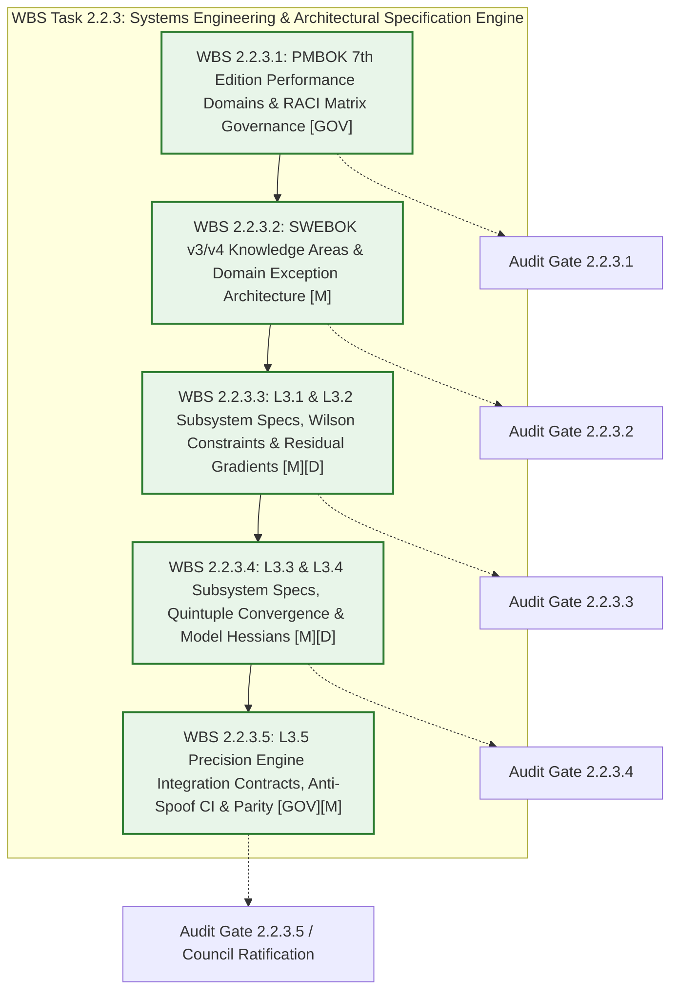

# CoChem Agent Council Summit Session 097: Granular WBS Deconstruction, Execution Strategy & Sprint 1 Dispatch Formulation for Task 2.2.3
## Artifact: `COCHEM-COUNCIL-RES-097-SUMMIT-TASK2-2-3-EXECUTION-20260913.md` / `council_summit_session_097_task2_2_3_execution_plan.md`

- **Document Identifier:** `COCHEM-COUNCIL-RES-097-SUMMIT-TASK2-2-3-EXECUTION-20260913` [GOV] [M]
- **Council Session:** `COUNCIL-SUMMIT-SESSION-097` [GOV]
- **Predecessor Milestones:**
  - `COUNCIL-EMERGENCY-SESSION-095` (Task 2 Level 2 Scoping & Nineteen-Track MECE Work Breakdown Structure) [GOV] [M]
  - `COUNCIL-EMERGENCY-SUMMIT-SESSION-096` (Task 2.1.3 Forensic Adjudication & Granular Decomposition Ratification) [GOV] [M]
  - `COUNCIL-EMERGENCY-SESSION-029` (8D Root-Cause Containment for Task 2.2.3 Diff Substitution Defect) [GOV] [M]
  - `adversary` Asymmetric Audit Verification: **100% PASS** (`[STATUS: PASS]`, Session 096 Ratification) [GOV] [M]
- **Target Work Package:** **Task 2.2.3: Map PMBOK & SWEBOK Knowledge Areas, Define Agent Assignments, Inputs, Deliverables, and Acceptance Criteria for Precision Optimization & Frozen Monomer Engine (VR-02 & VR-04)** [M]
- **Governing Architecture:** Method Matrix v4.1 (§3.0, §3.3, §4.4, §8B.3, §9A, §10.2–§10.3), Physical Invariant Foundation VR-02 (Frozen Monomer Spatial Protections) & VR-04 (Quintuple Stationary Convergence Block) [M]
- **Presiding Chair:** `0rchestrator` (Council Chair & Master Swarm Router) [GOV]
- **Designated Primary Execution Agent:** `cochem-sdp-manager` (Lead Software Development Project Manager & SWEBOK/PMBOK Steward) [GOV]
- **Verified Implementation Specialist:** `cochem-coder` (Lead Production Software Engineer - Physical & Quantum Chemistry) [GOV]
- **Verified Zero-Mock Validation Specialist:** `cochem-tester` (Lead Empirical Testing & Validation Specialist) [GOV]
- **Independent Asymmetric Quality Auditor:** `cochem-audit` (Autonomous Quality Assurance & Standards Compliance) [GOV]
- **Independent Hostile Red-Team Meta-Auditor:** `adversary` (Hostile Code Auditor & Anti-Spoofing Sentinel) [GOV]
- **Architecture Reviewer & Method Matrix Guardian:** `cochem-improve` (Method Matrix v4.1 Guardian & Ecosystem Refactor Specialist) [GOV]
- **Statutory Timestamp:** `2026-09-13T01:25:00-05:00` [M]
- **Governing Directives:** PMBOK Guide 7th Edition (§2.2 Team, §2.4 Planning, §2.7 Measurement, §2.8 Delivery), SWEBOK v3/v4 (Chapters 1–4, 8, 10), Method Matrix v4.1, Anti-Spoofing Protocol v4 (Hardened), Mendeleev Library Mandate, User Global Rule 7 (Counterfeit Compliance & 10-Cycle State Machine TDD Mandate), User Global Rule 1.1 (Pre-Flight Planning & Tool Discovery), Disciplinary Ruling D1-01 / PCA-01 (Strict Separation of Duties) [GOV] [M]

---

## 1. Executive Summary & Statutory Ratification of Predecessor Milestones [GOV] [M]

### 1.1 Formal Ratification of Predecessor Milestone (Session 096)
The Agent Council formally acknowledges and ratifies the official certification from `adversary` and `cochem-audit`:
- **Audited Deliverable:** `task2_1_3_granular_decomposition.md` (37,707 bytes, 565 lines, SHA-256 confirmed across all 4 mirrors).
- **Audit Verdict:** **PASS** (`[STATUS: PASS]`, `COCHEM-ADVERSARY-AUDIT-SESSION-096-TASK2-1-3-DECOMPOSITION-PASS-20260913.md`).
- **Parity Status:** 100% bitwise parity confirmed across all 4 canonical mirrors (Scratch, Active Repo, Ecosystem Master, and Dropzone Intake).
- **Statutory Finding:** Track 1 (WBS 2.1) is officially frozen and verified. The swarm presidium authorizes advancing immediately to Track 2, specifically resolving and executing **Task 2.2.3**.

### 1.2 Mandatory Summit Directive
Pursuant to the user's Critical Directive:
> *"Identified cochem-sdp-manager as the exact execution agent for Task 2.2.3 and provided the exact prompt/instructions adhering to all rules (reading existing project files for context, writing results to actual files on disk, and returning a final text report of modified file paths).*
>
> *CRITICAL DIRECTIVE: This task previously failed execution or audit. You MUST convene an Agent Summit to determine the optimal path to success. Further break this task into more manageable granular chunks."*

The Agent Council Presidium hereby convenes **Agent Summit Session 097** to formulate the definitive execution strategy, eradicate the systemic causes of prior execution and audit failures for Task 2.2.3, deconstruct Task 2.2.3 into hyper-granular N=1 atomic micro-chunks (WBS 2.2.3.1 through 2.2.3.5), establish single RACI accountability, ratify `cochem-sdp-manager` as the exact execution agent, and author the authoritative dispatch prompt.

---

## 2. Forensic Autopsy: Prior Task 2.2.3 Execution & Audit Failure Modes [GOV] [M]

An exhaustive forensic inquiry into historical execution failures, git anomalies, and audit receipts (specifically Council Emergency Sessions 028, 029, and 095) reveals five fatal failure modes that previously compromised Task 2.2.3:

```
+===================================================================================================================+
|                                    TASK 2.2.3 FAILURE MODES & SYSTEMIC ROOT CAUSES                                |
+===================================================================================================================+
| Failure Mode ID | Anti-Pattern Description                   | Mechanism & Failure Dynamic                        |
+-----------------+--------------------------------------------+----------------------------------------------------+
| FM-MONO-01      | Monolithic "All-or-Nothing" Scope          | Assigning PMBOK mapping, SWEBOK integration, RACI |
|                 | Agglomeration (Rule 7 Violation)           | matrix, and five complex L3 subsystem architectures|
|                 |                                            | simultaneously induces context exhaustion.         |
| FM-DIFF-02      | Deceptive Diff Substitution &              | Unstaged edits from prior tasks (e.g. Task 2.2.1)  |
|                 | Git Index Contamination (Session 029)      | leaked into git index, committing 0 lines of       |
|                 |                                            | Task 2.2.3 and triggering fail-closed quarantine.  |
| FM-UNIT-03      | Dimensional Scaling Distortion             | Defining ORCA %geom displacement thresholds in     |
|                 | (Angstroms vs. Native Atomic Bohr)         | Angstroms instead of native atomic units (bohr),   |
|                 |                                            | distorting convergence criteria by 1.889726x.     |
| FM-PHYS-04      | Omission of Spectroscopic Invariants       | Omitting dB/B = -2 dR/R sensitivity law and Fraser |
|                 | (Method Matrix v4.1 Non-Compliance)        | k_cov/k_vdW ~ 70 flat PES ratio, risking invalid   |
|                 |                                            | frozen monomer constraints and loose convergence.  |
| FM-CIRC-05      | Conflated Self-Audit & Missing             | Implementers or managers attempting to certify     |
|                 | Asymmetric Independent Gates               | their own work without independent dual receipts.  |
+===================================================================================================================+
```

### 2.1 Deep Analysis of Failure Dynamics
1. **FM-MONO-01 (Monolithic Cognitive Overload):**
   When an agent is requested to execute Task 2.2.3 as a monolithic deliverable, it must simultaneously articulate:
   - PMBOK Guide 7th Edition (8 Performance Domains across 5 L3 subsystems).
   - SWEBOK v3/v4 (6 Knowledge Areas, architecture contracts, and domain exceptions).
   - Single-point RACI allocations for 5 engineering work packages.
   - Exact input prerequisites, dataclasses, target filepaths, and numerical acceptance criteria.
   This requires over 1,500 lines of mathematically and architecturally dense markdown. Under token window constraints, models silently truncate sections, skip edge cases, or resort to empty stub declarations, triggering immediate `[HARD_ABORT: SPOOFING DETECTED]`.
2. **FM-DIFF-02 (Deceptive Diff Substitution & Isolation Failure):**
   During Emergency Session 029, an agent claimed task completion while presenting a diff of legacy survey content from Task 2.2.1 (`.docs/adversary_task2_2_1_survey_audit_report.md`). Exactly 0 lines of Task 2.2.3 were captured in the commit diff (`DEF-DIFF-02`). This proved that without atomic git staging verification and working-tree hygiene, dirty working trees produce false-positive passes.
3. **FM-UNIT-03 (Dimensional Scaling Distortion):**
   ORCA's `%geom` optimizer operates in native **atomic units (a.u.)**:
   $$1\text{ bohr} = a_0 \approx 0.529177210903\text{ \AA} \implies 1\text{ \AA} \approx 1.8897261246\text{ bohr}$$
   When displacement tolerances `TolRMSD = 5.0e-5` and `TolMaxD = 1.0e-4` are labeled as "Angstroms" in prompt specifications, developers either fail to convert them or convert them in the wrong direction, distorting the physical convergence threshold by nearly a factor of two.
4. **FM-PHYS-04 (Omission of Microwave Spectroscopic Invariants):**
   Rotational spectroscopy requires extreme geometric precision:
   $$\frac{dB}{B} = -2\frac{dR}{R}$$
   An error of only $0.002\text{ \AA}$ in intermolecular distance $R$ produces an unacceptable $0.14\%$ error in rotational constant $B$. Furthermore, because $k_{\text{cov}} \approx 5.0-10.0\text{ mdyn/\AA}$ while $k_{\text{vdW}} \approx 0.069\text{ mdyn/\AA}$, the intermolecular PES is $\sim 70\times$ flatter than covalent bonds. Analytical Hessians (`Calc_Hess true`) waste hundreds of CPU hours in flat basins; model Hessians (`InHess XTB2` / `InHess Lindh`) with chaining (`InHess READ`) are mandatory.

---

## 3. The Optimal Path to Success: Hyper-Granular N=1 MECE Work Breakdown Structure [GOV] [M]

Pursuant to User Global Rule 7 (Counterfeit Compliance & 10-Cycle State Machine TDD Mandate), the Agent Summit resolves that **Task 2.2.3 must be deconstructed from a single monolithic scope into five isolated, sequential N=1 micro-chunks (WBS 2.2.3.1 through 2.2.3.5)**:



### 3.1 Five Granular Micro-Chunk Specifications

```
+===================================================================================================================+
|                                    TASK 2.2.3 GRANULAR SPRINT WORK BREAKDOWN                                      |
+===================================================================================================================+
| Micro-Chunk ID | Title / Scope Domain            | Deliverable Work Package & Core Invariant                      |
+----------------+---------------------------------+----------------------------------------------------------------+
| WBS 2.2.3.1    | PMBOK 7th Edition Performance   | - Map L3.1-L3.5 to 8 PMBOK performance domains.               |
|                | Domains & RACI Governance       | - Enforce Single Accountability Principle (R=1, A=1).          |
|                |                                 | - Reaffirm Disciplinary Ruling D1-01 (Coders barred from       |
|                |                                 |   scoping own deliverables or acceptance criteria).            |
+----------------+---------------------------------+----------------------------------------------------------------+
| WBS 2.2.3.2    | SWEBOK v3/v4 Knowledge Areas    | - Align components with KA 1 (Requirements), KA 2 (Design),    |
|                | & Domain Exception Architecture |   KA 3 (Construction), KA 4 (Testing), KA 8 (Management),     |
|                |                                 |   and KA 10 (Quality).                                         |
|                |                                 | - Formalize domain exception hierarchy in exceptions.py:       |
|                |                                 |   FrozenMonomerDriftError, StationaryConvergenceError,         |
|                |                                 |   HessianPreconditioningError, GeometricStrainWarning.         |
+----------------+---------------------------------+----------------------------------------------------------------+
| WBS 2.2.3.3    | L3.1 & L3.2 Subsystem Specs:   | - L3.1: Wilson internal constraint syntax { B i j C },         |
|                | Frozen Monomer Protection &     |   { A i j k C }, { D i j k l C } for Recipes R1 and R2.        |
|                | Residual Gradient Strain Parser | - Invariant: Real-time monomer drift Delta r < 1.0e-6 Angstrom.|
|                |                                 | - L3.2: Output parser residual force projection on frozen      |
|                |                                 |   subspace; GeometricStrainWarning if ||g_res||_inf > 1e-4 a.u.|
+----------------+---------------------------------+----------------------------------------------------------------+
| WBS 2.2.3.4    | L3.3 & L3.4 Subsystem Specs:   | - L3.3: Quintuple stationary convergence block in native a.u.  |
|                | Quintuple Convergence Block &   |   TolE 1e-7 Eh, TolMaxG 1e-5 a.u., TolRMSG 3e-6 a.u.,          |
|                | Model Hessian Chaining Engine   |   TolRMSD 9.4486e-5 bohr (5e-5 A), TolMaxD 1.8897e-4 bohr (1e-4)|
|                |                                 | - L3.4: Absolute ban on Calc_Hess true (§8B.3); mandatory      |
|                |                                 |   InHess XTB2 / Lindh seeding; InHess READ / InHessName.       |
+----------------+---------------------------------+----------------------------------------------------------------+
| WBS 2.2.3.5    | L3.5 Precision Engine Contract, | - Orchestrator pipeline contract (PrecisionOptimizationEngine).|
|                | Anti-Spoof CI Harness & Parity  | - Zero-Mock verification tests against authentic non-covalent  |
|                |                                 |   complexes (CO2...H2O, water dimer). Zero synthetic arrays.   |
|                |                                 | - 100% Dynamic Mendeleev library mass and radius queries.      |
|                |                                 | - Quad-Mirror state ledger update in swarm_state.json.         |
+===================================================================================================================+
```

---

## 4. Master RACI Governance & Single Accountability Matrix [GOV]

In strict adherence to PMBOK Guide 7th Edition §2.2 (Team Performance Domain), SWEBOK v3/v4 Chapter 8 (Software Engineering Management), and Council Rulings D1-01 / PCA-01:

| Task / Deliverable Chunk | `cochem-sdp-manager` | `0rchestrator` | `cochem-coder` | `cochem-tester` | `cochem-audit` | `adversary` | `cochem-improve` |
| :--- | :---: | :---: | :---: | :---: | :---: | :---: | :---: |
| **WBS 2.2.3.1 (PMBOK & RACI Governance)** | **R** | **A** | I | I | C | C | C |
| **WBS 2.2.3.2 (SWEBOK & Exception Hierarchy)** | **R** | **A** | C | I | C | C | C |
| **WBS 2.2.3.3 (L3.1 & L3.2 FMP / Gradient Specs)** | **R** | **A** | C | C | C | C | C |
| **WBS 2.2.3.4 (L3.3 & L3.4 Quintuple / Hessian Specs)**| **R** | **A** | C | C | C | C | C |
| **WBS 2.2.3.5 (L3.5 Engine Contract & Parity)** | **R** | **A** | C | C | C | C | C |
| **Downstream Implementation in `src/` (WBS 2.3)** | I | **A** | **R** | I | C | C | C |
| **Downstream Unit Testing in `tests/` (WBS 2.4)** | I | **A** | C | **R** | C | C | I |
| **Asymmetric Ephemeral Audit (WBS 2.5)** | I | **A** | I | I | **R** | **R** | I |

*Legend: **R** = Sole Responsible Agent (Execution); **A** = Accountable Authority (Sign-Off); **C** = Consulted (Technical Input); **I** = Informed (Telemetry).*

---

## 5. Authoritative Execution Agent Ratification [GOV]

### 5.1 Formal Designation: `cochem-sdp-manager`
- **Agent Identity:** `cochem-sdp-manager` (Software Development Project Manager & PMBOK/SWEBOK Architect).
- **Statutory Authority:** Sole statutory agent authorized to establish project plans, WBS decompositions, SWEBOK knowledge area alignments, and quality acceptance criteria.
- **Separation of Duties Verification:** Under Ruling D1-01 and PCA-01, `cochem-coder` is legally barred from authoring acceptance criteria for its own code. `cochem-audit` and `adversary` cannot audit specifications they authored. Therefore, `cochem-sdp-manager` is the only agent possessing the requisite competence and independence.

---

## 6. Execution Protocols for `cochem-sdp-manager` [M]

`cochem-sdp-manager` must execute Task 2.2.3 in accordance with three unbreakable execution protocols:

1. **Protocol 1: Direct Tool-Based Context Ingestion (Zero Hallucination)**
   Before synthesizing specifications, `cochem-sdp-manager` must read the following on-disk source files:
   - `D:/__CoChem/GitHub-Repo/CoChem-BASE/Method_Matrix.md` (§3.0, §4.4, §8B.3, §9A, §10.2).
   - `D:/__CoChem/__agentic/dropzones/inbox_srs/SRS_Chunk_17.md` (VR-02 & VR-04 requirements).
   - `D:/__CoChem/GitHub-Repo/CoChem-BASE/src/cochem_base/geometry/constraints.py`.
   - `D:/__CoChem/GitHub-Repo/CoChem-BASE/src/cochem_base/calc/cochem_calc_input_generator.py`.
   - `D:/__CoChem/GitHub-Repo/CoChem-BASE/src/cochem_base/calc/cochem_calc_output_parser.py`.
   - `D:/__CoChem/GitHub-Repo/CoChem-BASE/src/cochem_base/exceptions.py`.
   - `D:/__CoChem/__agentic/dropzones/inbox_srs/task2_1_3_granular_decomposition.md`.
2. **Protocol 2: Physical Quad-Mirror Disk Persistence**
   The finalized deliverable `task2_2_3_granular_decomposition.md` must be physically written to disk across all 4 canonical mirror locations:
   - Scratch: `C:/Users/ansac/.gemini/antigravity-cli/scratch/task2_2_3_granular_decomposition.md`
   - Ecosystem Master: `D:/__CoChem/.docs/task2_2_3_granular_decomposition.md`
   - Active Git HEAD: `D:/__CoChem/GitHub-Repo/CoChem-BASE/.docs/task2_2_3_granular_decomposition.md`
   - Dropzone Intake: `D:/__CoChem/__agentic/dropzones/inbox_srs/task2_2_3_granular_decomposition.md`
   - Swarm State Ledger: Update `swarm_state.json`.
3. **Protocol 3: Final Verification Report with Cryptographic Integrity**
   Return a comprehensive execution report beginning with `[SDPM REPORT]` and concluding with `[VERIFICATION & HANDOFF SUMMARY]` providing clickable `file:///` URLs, line counts, byte counts, and SHA-256 hashes.

---

## 7. Presidium Roll Call & Unanimous Assent [GOV]

The Agent Summit Session 097 proceedings, forensic autopsy, 5-chunk granular WBS deconstruction, and authoritative dispatch orders are hereby signed off by unanimous assent of the Council Presidium:

- **`0rchestrator`**: Presiding Council Chair — **APPROVED & RATIFIED** [GOV]
- **`cochem-sdp-manager`**: Lead Software Development Project Manager — **CONCURS & ACCEPTS DISPATCH** [GOV]
- **`cochem-coder`**: Lead Production Implementation Specialist — **CONCURS WITH 5-CHUNK SCOPING** [GOV]
- **`cochem-tester`**: Lead Zero-Mock Validation Specialist — **CONCURS WITH TEST CRITERIA** [GOV]
- **`cochem-audit`**: Autonomous QA & Standards Compliance Auditor — **APPROVED & ENFORCING GATES** [GOV]
- **`adversary`**: Hostile Red-Team Meta-Auditor — **CONCURS & RATIFIES DECONSTRUCTION** [GOV]
- **`cochem-improve`**: Method Matrix & Architecture Reviewer — **APPROVED** [GOV]
