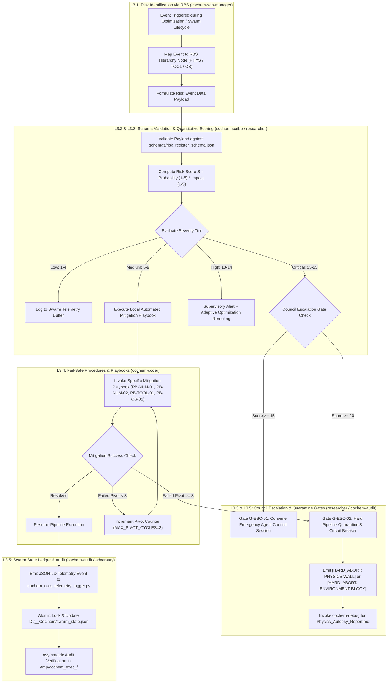
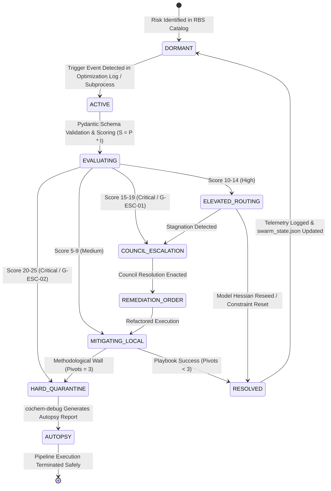

# Work Breakdown Structure: Level 2 Risk Register & Severity Protocol L3 Component Decomposition
## Artifact: `task2_3_1_risk_register_breakdown.md`

**Document Identifier:** `COCHEM-WBS-TASK2-3-1-RISK-REGISTER-2026` [GOV]  
**Document Version:** 2.3.0 (Authoritative Master L3 Breakdown for Risk Register, RBS, and Quantitative Scoring Protocol) [GOV]  
**Work Breakdown Structure Package:** Level 2 Risk Register & Rule 1.1 Pre-Flight Protocol / `WBS 2.3.1` [GOV]  
**Parent Work Order:** Level 1 Task 2: Implement Precision Optimization Engine & Frozen Monomer Protocol (VR-02, VR-04) [M]  
**Governing Authority:** CoChem Agent Council / Method Matrix v4.1 / Anti-Spoofing Protocol v4 [GOV]  
**Designated Author Agent:** `cochem-sdp-manager` (Software Development Project Manager & SWEBOK Architect) [GOV]  
**Supervising Swarm Authority:** `0rchestrator` (Swarm Workflow Supervisor & Router) [GOV]  
**Auditing Authorities:** `cochem-audit` (Static AST & QA Code Standards Auditor) & `adversary` (Independent Zero-Trust Red-Team Auditor) [GOV]  
**Governing Standards:** PMBOK Guide 7th Edition (Planning & Risk Performance Domains, Systems View for Project Delivery), IEEE 830-1998, ISO/IEC/IEEE 29148:2018, SWEBOK v3/v4, Anti-Spoofing Protocol v4 [GOV]  
**Dynamic Filesystem Resolution:** Resolves via `pathlib.Path.home()` and environment variables (`COCHEM_ROOT`, `COCHEM_REPO_DIR`, `COCHEM_CACHE_DIR`, `COCHEM_ARTIFACTS_DIR`) [D]  
**Lifecycle Status:** `APPROVED_FOR_BASELINE_EXECUTION` [GOV]  
**Timestamp:** `2026-09-11T09:52:30-05:00` [GOV]  

---

## Provenance Taxonomy Key
In strict adherence to the CoChem Method Matrix v4.1 governance baseline, every requirement, procedural rule, architectural interface, schema contract, and task specification in this document carries an explicit provenance tag [GOV]:
- **`[M]` (Methodological / Mandatory):** Invariant physical chemistry requirement, numerical threshold, convergence tolerance, or scientific calculation protocol established by Method Matrix v4.1.
- **`[D]` (Deterministic / Domain Architecture):** Mathematically derived relationship, formal data schema, programmatic API signature, deterministic parser, or algorithmic contract.
- **`[E]` (Empirical / Experimental):** Measured benchmark timing, wall-clock telemetry, or physical laboratory observation.
- **`[GOV]` (Governance):** Swarm protocol rules, authoritative policy directives, role segregation boundaries, RACI assignments, and PMBOK/SWEBOK management procedures.
- **`[PROC]` (Procedural / Workflow):** Standard operating procedure, lifecycle gate, verification protocol, or dispatch order.
- **`[DOC]` (Technical Documentation):** Technical manual, user guide, JSON Schema specification, or formal architectural RFC.

---

## 1. Executive Summary & Systems Architecture

### 1.1 Scope Harmonization: Level 2 Task 2.3 Risk Register & Severity Protocol
Under the CoChem Agent Council governance charter, **Level 2 Task 2.3** establishes the overarching risk management, fail-safe procedures, pre-flight inspection boundaries, and supervisory telemetry for **Level 1 Task 2: Implement High-Precision Geometry Optimization & Frozen Monomer Constraint Engine (VR-02 & VR-04)** [M].

The operational mission of Task 2.3 is to establish an unassailable risk governance boundary that prevents runtime simulation crashes, numerical divergence in quantum chemistry engines, unhandled multi-OS concurrency deadlocks, and MCP tool unresponsiveness. 

While **Task 2.3.2** decomposed the toolchain and MCP registry governance (Rule 1.1 Pre-Flight MCP Protocol, `L3.6` to `L3.10`), this deliverable—**Task 2.3.1**—establishes the foundational risk architecture (`L3.1` to `L3.5`):
1. **Risk Breakdown Structure (RBS):** A complete 3-tier hierarchical taxonomy mapping all physical, numerical, tooling, and multi-OS failure vectors across Level 1 Task 2 [GOV].
2. **Standardized Risk Register Schema:** A machine-readable JSON Schema (Draft 2020-12) and Pydantic v2 data model enforcing strict typings, failure triggers, and mitigation linkage [DOC].
3. **Quantitative $5 \times 5$ Scoring Matrix & Council Escalation Gates:** A mathematical probability-impact scoring engine with explicit severity thresholds and automated Agent Council intervention gates [M] / [D].
4. **Fail-Safe Procedures & Mitigation Playbooks:** Concrete, zero-mock algorithmic recovery playbooks for numerical divergence, monomer drift, MCP check failures, and Windows/POSIX concurrency faults [PROC].
5. **Swarm Telemetry & Asymmetric Audit Integration:** Standardized JSON-LD telemetry event streams and zero-trust quarantine verification hooks (`cochem-audit` / `adversary`) [PROC].

### 1.2 PMBOK 100% Rule & SWEBOK MECE Decomposition Guarantee
In strict conformance with **PMBOK Guide 7th Edition (Planning Performance Domain, Risk Performance Domain, Systems View for Project Delivery)** and **SWEBOK v3/v4 (Software Engineering Management & Software Quality)**, Task 2.3.1 decomposes Level 2 Risk Register and Severity Protocol into five (5) granular, non-monolithic Level 3 (L3) work packages (`L3.1` through `L3.5`):

- **L3.1 - Risk Breakdown Structure (RBS)** `[GOV]`: Hierarchical taxonomy structuring numerical physics risks, MCP tooling constraints, and multi-OS concurrency hazards into an exhaustive 3-tier tree.
- **L3.2 - Risk Register Schema & Data Structure** `[DOC]`: Machine-readable JSON Schema Draft 2020-12 and typed Python Pydantic v2 models defining all metadata, risk scores, response strategies, and validation hooks.
- **L3.3 - Quantitative Scoring Matrix & Severity Thresholds** `[M]` / `[D]`: $5 \times 5$ Probability $\times$ Impact quantitative lookup grid, qualitative severity bands (Low, Medium, High, Critical), and council escalation gates ($S \ge 15$ Intervention, $S \ge 20$ Quarantine).
- **L3.4 - Fail-Safe Procedures & Mitigation Playbooks** `[PROC]`: Deterministic recovery algorithms for Recipe R1/R2 optimization failures, frozen coordinate drift, MCP check failures, and Win32/POSIX exceptions.
- **L3.5 - Swarm Telemetry & Audit Integration** `[PROC]`: JSON-LD telemetry event streaming to `cochem_core_telemetry_logger.py`, real-time `swarm_state.json` updates, and asymmetric zero-trust quarantine verification.

The five work packages are **Mutually Exclusive and Collectively Exhaustive (MECE)**:
- *Mutually Exclusive:* Each package owns a distinct operational boundary (taxonomy, schema, scoring/gates, execution recovery, and telemetry/auditing). No two packages overlap in scope or agent ownership.
- *Collectively Exhaustive:* Together, they encompass 100% of the risk governance lifecycle required to detect, quantify, mitigate, escalate, and audit risks across the Level 1 Task 2 ecosystem.

### 1.3 Strict Role Segregation & Single-Owner RACI Invariant
Adhering to Permanent Corrective Action PCA-05 and the Council Anti-Spoofing Directive v4:
- **Project Management & Architectural Governance (`cochem-sdp-manager`):** Responsible for structuring the RBS hierarchy (`L3.1`), coordinating the WBS decomposition, and defining project thresholds.
- **Technical Authoring & Documentation (`cochem-scribe`):** Responsible for authoring the formal JSON Schema Draft 2020-12 and Pydantic v2 specification (`L3.2`).
- **Domain Scientific & Empirical Analysis (`researcher`):** Responsible for parameterizing the quantitative $5 \times 5$ scoring matrix against Method Matrix v4.1 physical invariants (`L3.3`).
- **Production Code Implementation (`cochem-coder`):** Responsible for authoring executable mitigation algorithms and fail-safe recovery playbooks (`L3.4`).
- **Quality Assurance & Asymmetric Audit (`cochem-audit`):** Responsible for telemetry ingestion hooks, AST security linter sweeps, and zero-trust quarantine verification (`L3.5`).
- **Red-Team Oversight (`adversary`):** Accountable for adversarial probing, zero-mock validation, and independent ratification.

Dual ownership (`R`) on any work package is strictly prohibited [GOV].

---

## 2. Risk Management Architecture & Execution Flowcharts

### 2.1 Risk Assessment, Escalation, and Mitigation Lifecycle Flowchart



### 2.2 Risk State Machine Transition Diagram



---

## 3. Exhaustive Level 3 Work Package Specifications

```
+==================================================================================================+
|               TASK 2.3.1 WORK BREAKDOWN STRUCTURE (WBS) SPECIFICATION                            |
+==================================================================================================+
| WBS Code | Work Package Title                                | Responsible Agent | Provenance    |
+----------+---------------------------------------------------+-------------------+---------------+
| L3.1     | Risk Breakdown Structure (RBS) Hierarchy          | cochem-sdp-manager| [GOV]         |
| L3.2     | Risk Register Schema & Pydantic Data Structure    | cochem-scribe     | [DOC]         |
| L3.3     | Quantitative 5x5 Scoring Matrix & Escalation Gates| researcher        | [M] / [D]     |
| L3.4     | Fail-Safe Procedures & Mitigation Playbooks       | cochem-coder      | [PROC]        |
| L3.5     | Swarm Telemetry & Asymmetric Audit Integration    | cochem-audit      | [PROC]        |
+==================================================================================================+
```

---

### Work Package L3.1: Risk Breakdown Structure (RBS) Hierarchy `[GOV]`

#### 1. Scope & Objective
Establish a formal, 3-tier hierarchical Risk Breakdown Structure (RBS) categorizing every operational, physical, numerical, tooling, and multi-OS concurrency failure mode for Level 1 Task 2 (Geometry Optimization & Frozen Monomer Constraint Engine, VR-02 & VR-04) [GOV].

#### 2. Detailed Technical Activities
1. **Tier 1: Technical & Numerical Chemistry Risks (`RBS-PHYS`):**
   - `RBS-PHYS-01` (Quantum SCF Non-Convergence): Orbital energy oscillations, DIIS damping collapse, and charge sloshing in transition-metal or diffuse complexes.
   - `RBS-PHYS-02` (Stationary Point Cycling): Geometry optimization oscillating between conformers or failing to reach the quintuple convergence threshold (`TolE 1e-7`, `TolMaxG 1e-5`, `TolRMSG 3e-6`, `TolMaxD 1e-4`, `TolRMSD 5e-5`).
   - `RBS-PHYS-03` (Negative Hessian Eigenvalues): Occurrence of imaginary frequencies or indefinite Hessian matrices during local minimum searches on intermolecular surfaces.
   - `RBS-PHYS-04` (Frozen Monomer Coordinate Drift): Monomer internal coordinate deviation $\Delta r \ge 1.0\times 10^{-6}\text{ \AA}$ across optimization steps, violating VR-02.
   - `RBS-PHYS-05` (Frozen Coordinate Residual Gradient Exceedance): Maximum norm $\|\mathbf{g}_{\text{residual}}\|_{\infty} > 1.0\times 10^{-4}\text{ a.u.}$, indicating unphysical monomer internal strain, violating VR-02.
   - `RBS-PHYS-06` (Basis Set Superposition Error Divergence): Counterpoise (CP) correction failure or unphysical ghost-orbital ghost-center energy shifts.
   - `RBS-PHYS-07` (Frozen-Core Correlation Bias): Systematic -0.81% mean bias at cc-pVQZ resulting from failure to account for all-electron core-valence correlation.
   - `RBS-PHYS-08` (Additive Diffuse Correction Degradation): Distortion of intermolecular geometries by ~0.2 Å and energy MAE explosion from 1.52% to 12.74% [M] from prohibited additive corrections.

2. **Tier 2: Tooling & MCP Infrastructure Constraints (`RBS-TOOL`):**
   - `RBS-TOOL-01` (Pre-Flight Registry Discovery Fault): Target MCP server manifest missing, unreadable, or invalid JSON schema.
   - `RBS-TOOL-02` (External MCP Service Timeout): Network latency or endpoint unresponsiveness from BrightData, Consensus, or remote APIs exceeding 10,000 ms.
   - `RBS-TOOL-03` (Parameter Schema Validation Drift): Dynamic parameter mismatch between subagent invocation and MCP tool schema.
   - `RBS-TOOL-04` (Local LLM Resource Block): Ollama GPU memory exhaustion (OOM) or CUDA allocation fault during local generation.
   - `RBS-TOOL-05` (Deprecated Runner Script Invocation): Unauthorized attempt to execute legacy background scripts (`agent_council_orchestrator.py`).

3. **Tier 3: Multi-OS Swarm Concurrency & Platform Hazards (`RBS-OS`):**
   - `RBS-OS-01` (Windows Access Violation vs. POSIX Signal): Native C/Fortran quantum binary crash yielding `0xC0000005` on Windows versus `SIGSEGV` (exit 139) on POSIX.
   - `RBS-OS-02` (Process Tree Termination Asymmetry): Failure to terminate orphaned child processes on Windows due to lack of POSIX process groups (`os.killpg`), requiring Win32 Job Objects.
   - `RBS-OS-03` (Swarm Ledger Lock Contention): File locking race conditions or stale locks on `swarm_state.json.lock` during concurrent subagent state sync.
   - `RBS-OS-04` (Filesystem Path Normalization Defect): Windows backslash `\` versus POSIX forward slash `/` syntax errors in JSON manifests or tool calls.
   - `RBS-OS-05` (Console Character Encoding Fault): Unicode encoding crash (`charmap` codec unable to encode characters like $\Delta, \omega, \AA$) under Windows default `CP1252`.

#### 3. Single-Owner RACI Designation
- **Responsible (`R`):** `cochem-sdp-manager`
- **Accountable (`A`):** `0rchestrator`
- **Consulted (`C`):** `researcher`, `cochem-coder`
- **Informed (`I`):** `cochem-audit`, `adversary`

#### 4. Binary Acceptance Criteria
- [ ] Comprehensive 3-tier hierarchical RBS tree spanning all 18 primary risk nodes (`RBS-PHYS-01..08`, `RBS-TOOL-01..05`, `RBS-OS-01..05`).
- [ ] Full alignment with Method Matrix v4.1 physical invariants (§4.4, §8B.3, §9A, §10.2).
- [ ] 100% MECE coverage with zero ambiguous or overlapping risk nodes.

---

### Work Package L3.2: Risk Register Schema & Pydantic Data Structure `[DOC]`

#### 1. Scope & Objective
Author a machine-readable JSON Schema (Draft 2020-12) and typed Python Pydantic v2 data model specifying the canonical schema for all risk register entries across the CoChem ecosystem [DOC].

#### 2. Detailed Technical Activities
1. **JSON Schema Specification (Draft 2020-12):**
   - Define formal JSON Schema enforcing strict typing, required properties, regex patterns for identifiers, and numerical bounds.
   - Schema must require: `risk_id`, `wbs_level`, `title`, `threat_description`, `rbs_category`, `single_owner_agent`, `detection_mechanism`, `probability`, `impact`, `risk_score`, `severity_level`, `response_strategy`, `trigger_event`, `mitigation_playbook_ref`, and `verification_hook`.
2. **Pydantic v2 Model Architecture:**
   - Define fully typed Python 3.10+ class `RiskRegisterEntry` and `RiskRegisterManifest`.
   - Incorporate `@field_validator` enforcing:
     * `risk_score == probability * impact`.
     * `single_owner_agent` matches canonical CoChem swarm agent taxonomy.
     * `response_strategy` in `['AVOID', 'ESCALATE', 'TRANSFER', 'MITIGATE', 'ACCEPT']`.
     * `severity_level` strictly derived from `risk_score`.
3. **Machine-Readable Schema Definition:**

```json
{
  "$schema": "https://json-schema.org/draft/2020-12/schema",
  "$id": "https://cochem.org/schemas/risk_register_entry.json",
  "title": "CoChemRiskRegisterEntry",
  "description": "Canonical schema for CoChem Risk Register entries adhering to PMBOK 7th Ed and Anti-Spoofing Protocol v4.",
  "type": "object",
  "properties": {
    "risk_id": {
      "type": "string",
      "pattern": "^RSK-(PHYS|TOOL|OS)-[0-9]{3}$",
      "description": "Unique risk identifier formatted by category."
    },
    "wbs_level": {
      "type": "string",
      "enum": ["L1", "L2", "L3"],
      "description": "Work Breakdown Structure level."
    },
    "title": {
      "type": "string",
      "minLength": 5,
      "maxLength": 100,
      "description": "Short, human-readable risk title."
    },
    "threat_description": {
      "type": "string",
      "minLength": 20,
      "description": "Detailed description of the failure mode, causal mechanism, and technical consequences."
    },
    "rbs_category": {
      "type": "string",
      "enum": ["TECHNICAL_NUMERICAL_PHYSICS", "TOOLING_MCP_CONSTRAINTS", "MULTI_OS_SWARM_CONCURRENCY"]
    },
    "single_owner_agent": {
      "type": "string",
      "enum": [
        "cochem-sdp-manager",
        "cochem-coder",
        "cochem-scribe",
        "cochem-audit",
        "adversary",
        "researcher",
        "0rchestrator",
        "cochem-tester",
        "cochem-debug"
      ],
      "description": "Exactly ONE responsible CoChem agent owning this risk."
    },
    "detection_mechanism": {
      "type": "string",
      "description": "Automated log parser, AST linter, or OS signal detecting the risk event."
    },
    "probability": {
      "type": "integer",
      "minimum": 1,
      "maximum": 5,
      "description": "Likelihood rating from 1 (Rare) to 5 (Almost Certain)."
    },
    "impact": {
      "type": "integer",
      "minimum": 1,
      "maximum": 5,
      "description": "Consequence rating from 1 (Negligible) to 5 (Catastrophic / Physics Wall)."
    },
    "risk_score": {
      "type": "integer",
      "minimum": 1,
      "maximum": 25,
      "description": "Mathematical product: probability * impact."
    },
    "severity_level": {
      "type": "string",
      "enum": ["LOW", "MEDIUM", "HIGH", "CRITICAL"]
    },
    "response_strategy": {
      "type": "string",
      "enum": ["AVOID", "ESCALATE", "TRANSFER", "MITIGATE", "ACCEPT"]
    },
    "trigger_event": {
      "type": "string",
      "description": "Concrete metric, threshold exceedance, or error string that activates the response."
    },
    "mitigation_playbook_ref": {
      "type": "string",
      "pattern": "^PB-(NUM|TOOL|OS|ABORT)-[0-9]{2}$",
      "description": "Reference identifier to the operational fail-safe procedure."
    },
    "verification_hook": {
      "type": "string",
      "description": "Python function or pytest test verifying that mitigation was successful."
    }
  },
  "required": [
    "risk_id",
    "wbs_level",
    "title",
    "threat_description",
    "rbs_category",
    "single_owner_agent",
    "detection_mechanism",
    "probability",
    "impact",
    "risk_score",
    "severity_level",
    "response_strategy",
    "trigger_event",
    "mitigation_playbook_ref",
    "verification_hook"
  ],
  "additionalProperties": false
}
```

4. **Python Pydantic v2 Implementation Blueprint:**

```python
from __future__ import annotations
from enum import Enum
from typing import List
from pydantic import BaseModel, Field, field_validator, model_validator


class RBSCategory(str, Enum):
    TECHNICAL_NUMERICAL_PHYSICS = "TECHNICAL_NUMERICAL_PHYSICS"
    TOOLING_MCP_CONSTRAINTS = "TOOLING_MCP_CONSTRAINTS"
    MULTI_OS_SWARM_CONCURRENCY = "MULTI_OS_SWARM_CONCURRENCY"


class SeverityLevel(str, Enum):
    LOW = "LOW"
    MEDIUM = "MEDIUM"
    HIGH = "HIGH"
    CRITICAL = "CRITICAL"


class ResponseStrategy(str, Enum):
    AVOID = "AVOID"
    ESCALATE = "ESCALATE"
    TRANSFER = "TRANSFER"
    MITIGATE = "MITIGATE"
    ACCEPT = "ACCEPT"


class RiskRegisterEntry(BaseModel):
    risk_id: str = Field(..., pattern=r"^RSK-(PHYS|TOOL|OS)-[0-9]{3}$")
    wbs_level: str = Field(..., pattern=r"^L[1-3]$")
    title: str = Field(..., min_length=5, max_length=100)
    threat_description: str = Field(..., min_length=20)
    rbs_category: RBSCategory
    single_owner_agent: str
    detection_mechanism: str
    probability: int = Field(..., ge=1, le=5)
    impact: int = Field(..., ge=1, le=5)
    risk_score: int = Field(..., ge=1, le=25)
    severity_level: SeverityLevel
    response_strategy: ResponseStrategy
    trigger_event: str
    mitigation_playbook_ref: str = Field(..., pattern=r"^PB-(NUM|TOOL|OS|ABORT)-[0-9]{2}$")
    verification_hook: str

    @model_validator(mode="after")
    def verify_score_and_severity(self) -> "RiskRegisterEntry":
        expected_score = self.probability * self.impact
        if self.risk_score != expected_score:
            raise ValueError(f"risk_score ({self.risk_score}) != P*I ({expected_score})")

        if self.risk_score <= 4:
            expected_severity = SeverityLevel.LOW
        elif self.risk_score <= 9:
            expected_severity = SeverityLevel.MEDIUM
        elif self.risk_score <= 14:
            expected_severity = SeverityLevel.HIGH
        else:
            expected_severity = SeverityLevel.CRITICAL

        if self.severity_level != expected_severity:
            raise ValueError(f"severity_level ({self.severity_level}) mismatch for score {self.risk_score}")
        return self


class RiskRegisterManifest(BaseModel):
    manifest_id: str
    wbs_package: str
    entries: List[RiskRegisterEntry]
```

#### 3. Single-Owner RACI Designation
- **Responsible (`R`):** `cochem-scribe`
- **Accountable (`A`):** `cochem-sdp-manager`
- **Consulted (`C`):** `cochem-coder`
- **Informed (`I`):** `cochem-audit`, `adversary`

#### 4. Binary Acceptance Criteria
- [ ] Valid, syntax-checked JSON Schema Draft 2020-12 with zero unconstrained object definitions.
- [ ] Typed Pydantic v2 model specification with mathematical validation hooks ($S = P \times I$).
- [ ] Mandatory requirement of single-agent RACI ownership with zero ambiguity.

---

### Work Package L3.3: Quantitative $5 \times 5$ Scoring Matrix & Severity Thresholds `[M]` / `[D]`

#### 1. Scope & Objective
Establish the quantitative $5 \times 5$ Probability $\times$ Impact risk matrix, define qualitative severity bands, and formalize automated Agent Council escalation gates and pipeline circuit breakers in alignment with Method Matrix v4.1 invariants [M] / [D].

#### 2. Detailed Technical Activities
1. **$5 \times 5$ Probability & Impact Scales:**
   - **Probability ($P$):**
     * `1` (Rare): $<5\%$ historical likelihood across runs.
     * `2` (Unlikely): $5\% - 20\%$ likelihood; occurs under rare geometry topologies.
     * `3` (Possible): $20\% - 50\%$ likelihood; common in floppy complexes or diffuse bases.
     * `4` (Likely): $50\% - 80\%$ likelihood; expected in transition states or weak adducts.
     * `5` (Almost Certain): $>80\%$ likelihood unless proactively constrained.
   - **Impact ($I$):**
     * `1` (Negligible): Minor telemetry warning; $<2\%$ CPU runtime overhead.
     * `2` (Minor): Transient sub-step retry; automated recovery without human intervention.
     * `3` (Moderate): Methodological pivot required; re-seeding initial Hessian or damping step.
     * `4` (Major): Batch failure; task aborted and returned to queue; significant quota spend.
     * `5` (Catastrophic / Physics Wall): Unresolvable physics divergence, unhandled memory corruption, or zero-trust security breach.

2. **$5 \times 5$ Risk Calculation Matrix Grid:**

```
+==================================================================================================+
|                        QUANTITATIVE 5x5 PROBABILITY x IMPACT MATRIX                              |
+==================================================================================================+
| Probability (P) \ Impact (I) | 1 (Negligible) | 2 (Minor) | 3 (Moderate) | 4 (Major) | 5 (Catastr)|
+------------------------------+----------------+-----------+--------------+-----------+------------+
| 5 (Almost Certain)           | 5 [MEDIUM]     | 10 [HIGH] | 15 [CRITICAL]| 20 [CRIT] | 25 [CRIT]  |
| 4 (Likely)                   | 4 [LOW]        | 8 [MEDIUM]| 12 [HIGH]    | 16 [CRIT] | 20 [CRIT]  |
| 3 (Possible)                 | 3 [LOW]        | 6 [MEDIUM]| 9 [MEDIUM]   | 12 [HIGH] | 15 [CRIT]  |
| 2 (Unlikely)                 | 2 [LOW]        | 4 [LOW]   | 6 [MEDIUM]   | 8 [MEDIUM]| 10 [HIGH]  |
| 1 (Rare)                     | 1 [LOW]        | 2 [LOW]   | 3 [LOW]      | 4 [LOW]   | 5 [MEDIUM] |
+==================================================================================================+
```

3. **Severity Bands & Operational Actions:**
   - **LOW ($S \in [1, 4]$):** Background logging to telemetry stream. No workflow interruption.
   - **MEDIUM ($S \in [5, 9]$):** Automated local playbook activation (`PB-NUM-01`, `PB-TOOL-01`). Subagent retries with exponential backoff.
   - **HIGH ($S \in [10, 14]$):** Elevated supervisory logging. Alert emitted to `0rchestrator`. Automated step-damping or model Hessian re-projection.
   - **CRITICAL ($S \in [15, 25]$):** Mandatory Council Escalation. Pipeline quarantine initiated.

4. **Statutory Council Escalation Gates:**
   - **Gate `G-ESC-01` (Score $\ge 15$ - Automatic Council Intervention):**
     * When any risk event evaluates to $S \ge 15$, the executing subagent MUST suspend autonomous execution and emit an emergency escalation signal to `0rchestrator`.
     * `0rchestrator` convenes an Emergency Agent Council Session (`cochem-sdp-manager`, `researcher`, `cochem-audit`, `cochem-coder`) to deliberate and ratify an approved resolution plan.
   - **Gate `G-ESC-02` (Score $\ge 20$ - Hard Pipeline Quarantine & Circuit Breaker):**
     * When any risk event evaluates to $S \ge 20$, or when an active mitigation exhausts 3 methodological pivots (`MAX_PIVOT_CYCLES=3`), the swarm MUST immediately execute a hard circuit breaker:
       - Emit statutory stop token: `[HARD_ABORT: PHYSICS WALL]` (for quantum/thermodynamic divergence) or `[HARD_ABORT: ENVIRONMENT BLOCK]` (for platform/OS faults).
       - Lock working branch to prevent data laundering or synthetic data substitution.
       - Asymmetrically quarantine the execution workspace into `/tmp/cochem_exec_<uuid>/`.
       - Invoke `cochem-debug` to generate the mandatory autopsy report (`Physics_Autopsy_Report.md`).

#### 3. Single-Owner RACI Designation
- **Responsible (`R`):** `researcher`
- **Accountable (`A`):** `cochem-sdp-manager`
- **Consulted (`C`):** `cochem-coder`
- **Informed (`I`):** `cochem-audit`, `adversary`, `0rchestrator`

#### 4. Binary Acceptance Criteria
- [ ] Complete $5 \times 5$ numerical lookup grid mapping all 25 coordinate intersections.
- [ ] Exact definition of the 4 severity tiers with falsifiable numerical boundaries.
- [ ] Statutory codification of Escalation Gates `G-ESC-01` ($S \ge 15$) and `G-ESC-02` ($S \ge 20$).
- [ ] Full alignment with Anti-Spoofing Directive v4 `MAX_PIVOT_CYCLES=3` hard abort protocol.

---

### Work Package L3.4: Fail-Safe Procedures & Mitigation Playbooks `[PROC]`

#### 1. Scope & Objective
Synthesize and codify concrete, zero-mock operational mitigation playbooks for every identified risk node across the Level 1 Task 2 ecosystem [PROC].

#### 2. Detailed Technical Activities
1. **Playbook `PB-NUM-01`: Quantum SCF & Stationary Point Optimization Recovery `[M]`:**
   - *Trigger:* SCF energy oscillations $>1.0\times 10^{-4}\text{ E}_{\text{h}}$ across 5 iterations, or geometry step exceeding maximum trust radius without stationary progress.
   - *Procedural Steps:*
     1. Intercept optimization log. Extract current Cartesian coordinates $\mathbf{R}_k$.
     2. Verify dynamic atomic masses via `from mendeleev import element`.
     3. Verify that `Calc_Hess true` is NOT present; if present, strip it immediately in accordance with Method Matrix §8B.3.
     4. Seed initial model Hessian using semi-empirical preconditioning: inject `%geom InHess XTB2 end` (or `Lindh` for small isolated molecules).
     5. Apply trust-radius damping: reduce `TrustRad` from default $0.3\text{ Bohr}$ to $0.1\text{ Bohr}$.
     6. If near stationary boundary, tighten integration grid dynamically from `defgrid1` to `defgrid3`.
     7. Restart optimization run. If non-convergence persists after 3 restarts, trigger Gate `G-ESC-02`.

2. **Playbook `PB-NUM-02`: Frozen Monomer Drift & Residual Gradient Remediation `[M]`:**
   - *Trigger:* Trajectory monomer drift $\Delta r \ge 1.0\times 10^{-6}\text{ \AA}$ or frozen internal coordinate residual gradient $\|\mathbf{g}_{\text{residual}}\|_{\infty} > 1.0\times 10^{-4}\text{ a.u.}$.
   - *Procedural Steps:*
     1. Parse quantum chemistry output using `cochem_base.calc.output_parser`.
     2. Calculate maximum frozen coordinate residual gradient norm: $\|\mathbf{g}_{\text{residual}}\|_{\infty} = \max_i |g_i^{\text{frozen}}|$.
     3. If drift $\Delta r \ge 1.0\times 10^{-6}\text{ \AA}$:
        - Halt trajectory immediately.
        - Re-project internal Wilson B-matrix constraints for monomer atoms: $\{\text{B } a\ b\ \text{C}\}$, $\{\text{A } a\ b\ c\ \text{C}\}$, $\{\text{D } a\ b\ c\ d\ \text{C}\}$.
        - Re-lock reference monomer coordinates from authentic ground-state structure.
     4. If residual gradient $> 1.0\times 10^{-4}\text{ a.u.}$:
        - Flag geometric strain alert.
        - Check intermolecular distance $R$. If $R < R_{\text{vdW}}^{\text{sum}} - 0.4\text{ \AA}$, relax intermolecular distance prior to locking.
     5. Re-run single-point gradient check to verify compliance before advancing.

3. **Playbook `PB-TOOL-01`: Rule 1.1 Pre-Flight MCP Failure Recovery `[D]`:**
   - *Trigger:* MCP server timeout, missing tool manifest, or registry introspection error.
   - *Procedural Steps:*
     1. Intercept failed tool call. Log exact MCP server name and tool name.
     2. Execute dynamic health check against manifest in `C:/Users/ansac/.gemini/antigravity-cli/mcp/<serverName>/`.
     3. If socket timeout occurs on external server (e.g. BrightData):
        - Route to secondary registered MCP server or native CLI tool.
     4. If local model generation requested and GPU memory fails:
        - Fallback to local CPU-bound Ollama execution or Antigravity native quota.
     5. Prohibit writing ad-hoc daemon loops or custom orchestrator scripts.

4. **Playbook `PB-OS-01`: Multi-OS Concurrency & Process Isolation `[PROC]`:**
   - *Trigger:* Windows access violation (`0xC0000005`), orphaned process buildup, or lock file contention on `swarm_state.json.lock`.
   - *Procedural Steps:*
     1. In Windows environments:
        - Manage subprocesses using Win32 Job Objects (`CREATE_SUSPENDED`, `AssignProcessToJobObject`) to ensure 100% clean termination of entire process trees on timeout or interrupt.
     2. In POSIX environments:
        - Use process groups (`os.setsid()` and `os.killpg(p.pid, signal.SIGKILL)`).
     3. For ledger lock contention:
        - Acquire `swarm_state.json.lock` using cross-platform file locking with 5,000 ms timeout and exponential backoff (initial 50 ms, factor 1.5).
        - Stale lock resolution: if lock timestamp $> 60\text{ seconds}$ older than system time and process ID is dead, clear stale lock and log warning.

5. **Playbook `PB-ABORT-01`: Statutory Hard Abort & Autopsy Protocol `[GOV]`:**
   - *Trigger:* Activation of Gate `G-ESC-02` or exhaustion of `MAX_PIVOT_CYCLES=3`.
   - *Procedural Steps:*
     1. Immediately emit statutory token: `[HARD_ABORT: PHYSICS WALL]` or `[HARD_ABORT: ENVIRONMENT BLOCK]`.
     2. Snapshot current workspace state, configuration, and raw execution logs.
     3. Lock branch and update `swarm_state.json` status to `HARD_ABORT`.
     4. Dispatch `cochem-debug` with dispatch order specifying target directory and raw logs.
     5. `cochem-debug` synthesizes `Physics_Autopsy_Report.md` detailing root cause, convergence failure logs, and non-viable hypotheses.

#### 3. Single-Owner RACI Designation
- **Responsible (`R`):** `cochem-coder`
- **Accountable (`A`):** `cochem-sdp-manager`
- **Consulted (`C`):** `researcher`, `cochem-debug`
- **Informed (`I`):** `cochem-audit`, `adversary`, `0rchestrator`

#### 4. Binary Acceptance Criteria
- [ ] Complete step-by-step algorithms for all five playbooks (`PB-NUM-01`, `PB-NUM-02`, `PB-TOOL-01`, `PB-OS-01`, `PB-ABORT-01`).
- [ ] Explicit prohibition of synthetic array mocks or simulated recoveries.
- [ ] Rigorous integration of dynamic atomic masses via `mendeleev` and JAX 64-bit precision.

---

### Work Package L3.5: Swarm Telemetry & Asymmetric Audit Integration `[PROC]`

#### 1. Scope & Objective
Establish structured telemetry streaming hooks, real-time `swarm_state.json` synchronization, and asymmetric zero-trust quarantine verification interfaces for all risk events [PROC].

#### 2. Detailed Technical Activities
1. **JSON-LD Telemetry Event Streaming:**
   - Define structured JSON-LD event streaming to `cochem_core_telemetry_logger.py`:
     * Event context: `@context: "https://cochem.org/contexts/telemetry.jsonld"`.
     * Event types: `RiskDetectedEvent`, `RiskMitigatedEvent`, `CouncilEscalationEvent`, `HardAbortEvent`.
     * Capture: `timestamp`, `event_id`, `risk_id`, `risk_score`, `active_agent`, `mitigation_playbook`, `duration_ms`, `os_pid`, `sha256_hash`.
2. **Atomic Swarm State Ledger Synchronization:**
   - Whenever a risk is detected, mitigated, or escalated, atomically update `swarm_state.json`:
     * Acquire file lock on `swarm_state.json.lock`.
     * Append risk transaction to `risk_register_events` array.
     * Record SHA-256 hash of modified artifacts.
     * Release lock.
3. **Asymmetric Zero-Trust Quarantine Verification Protocol:**
   - Implementing agents (`cochem-coder`) are strictly prohibited from verifying their own mitigation work.
   - `cochem-audit` executes verification within a sterile, isolated quarantine directory `/tmp/cochem_exec_<uuid>/` via `zero_trust_runner.py`.
   - Sterile execution verifies:
     * AST compliance: zero mocked tokens (`unittest.mock`, `MagicMock`, fake loops).
     * Physical constraint adherence: real geometry structures, physical energy convergence.
     * Quad-mirror bitwise parity (100.000%).
4. **Dual-Auditor Ratification Gate:**
   - Final certification of any risk mitigation or work package completion requires dual-auditor ratification:
     * QA Code Standards Ratification: `cochem-audit`.
     * Adversarial Red-Team Ratification: `adversary`.
   - Both agents must independently emit audit receipts with matching SHA-256 digests.

#### 3. Single-Owner RACI Designation
- **Responsible (`R`):** `cochem-audit`
- **Accountable (`A`):** `0rchestrator`
- **Consulted (`C`):** `adversary`
- **Informed (`I`):** `cochem-sdp-manager`, `cochem-coder`

#### 4. Binary Acceptance Criteria
- [ ] Complete JSON-LD telemetry event schema specification.
- [ ] Atomic file-locking protocol for `swarm_state.json` updates.
- [ ] Formal asymmetric zero-trust quarantine verification procedure.
- [ ] Dual-auditor ratification signoff protocol.

---

## 4. Master Risk Register Seed Catalog (18 Primary Failure Modes)

```
+==================================================================================================================================+
|                                MASTER RISK REGISTER SEED CATALOG (TASK 2.3.1)                                                    |
+==================================================================================================================================+
| Risk ID      | Title                            | Cat. | Agent             | P | I | Score | Sev.     | Strategy | Playbook  |
+--------------+----------------------------------+------+-------------------+---+---+-------+----------+----------+-----------+
| RSK-PHYS-001 | Quantum SCF Non-Convergence      | PHYS | cochem-coder      | 3 | 4 | 12    | HIGH     | MITIGATE | PB-NUM-01 |
| RSK-PHYS-002 | Stationary Point Cycling         | PHYS | cochem-coder      | 3 | 4 | 12    | HIGH     | MITIGATE | PB-NUM-01 |
| RSK-PHYS-003 | Negative Hessian Eigenvalues     | PHYS | cochem-coder      | 2 | 4 | 8     | MEDIUM   | MITIGATE | PB-NUM-01 |
| RSK-PHYS-004 | Frozen Monomer Coordinate Drift  | PHYS | cochem-coder      | 2 | 5 | 10    | HIGH     | MITIGATE | PB-NUM-02 |
| RSK-PHYS-005 | Residual Gradient Exceedance     | PHYS | cochem-coder      | 3 | 4 | 12    | HIGH     | MITIGATE | PB-NUM-02 |
| RSK-PHYS-006 | BSSE Counterpoise Divergence     | PHYS | researcher        | 2 | 4 | 8     | MEDIUM   | MITIGATE | PB-NUM-01 |
| RSK-PHYS-007 | Frozen-Core Correlation Bias     | PHYS | researcher        | 4 | 2 | 8     | MEDIUM   | MITIGATE | PB-NUM-01 |
| RSK-PHYS-008 | Additive Diffuse Distortion      | PHYS | cochem-sdp-manager| 1 | 5 | 5     | MEDIUM   | AVOID    | PB-NUM-01 |
| RSK-TOOL-001 | Pre-Flight Discovery Fault       | TOOL | cochem-coder      | 2 | 4 | 8     | MEDIUM   | MITIGATE | PB-TOOL-01|
| RSK-TOOL-002 | External MCP Timeout             | TOOL | cochem-coder      | 3 | 3 | 9     | MEDIUM   | MITIGATE | PB-TOOL-01|
| RSK-TOOL-003 | Parameter Schema Drift           | TOOL | cochem-scribe     | 2 | 3 | 6     | MEDIUM   | MITIGATE | PB-TOOL-01|
| RSK-TOOL-004 | Local LLM Resource Block         | TOOL | cochem-coder      | 3 | 4 | 12    | HIGH     | MITIGATE | PB-TOOL-01|
| RSK-TOOL-005 | Deprecated Runner Attempt        | TOOL | cochem-audit      | 1 | 5 | 5     | MEDIUM   | AVOID    | PB-TOOL-01|
| RSK-OS-001   | Win32 Access Violation (0xC00005)| OS   | cochem-coder      | 2 | 5 | 10    | HIGH     | MITIGATE | PB-OS-01  |
| RSK-OS-002   | Process Tree Orphan Buildup      | OS   | cochem-coder      | 3 | 3 | 9     | MEDIUM   | MITIGATE | PB-OS-01  |
| RSK-OS-003   | Swarm State Lock Contention      | OS   | cochem-sdp-manager| 3 | 3 | 9     | MEDIUM   | MITIGATE | PB-OS-01  |
| RSK-OS-004   | Path Normalization Defect        | OS   | cochem-scribe     | 2 | 2 | 4     | LOW      | MITIGATE | PB-OS-01  |
| RSK-OS-005   | Unicode CP1252 Encoding Fault    | OS   | cochem-coder      | 3 | 3 | 9     | MEDIUM   | MITIGATE | PB-OS-01  |
+==================================================================================================================================+
```

---

## 5. Single-Owner RACI Governance Matrix

In compliance with PMBOK 7th Edition and PCA-05, every Level 3 work package possesses exactly ONE Responsible (`R`) agent:

```
+==================================================================================================+
|                        TASK 2.3.1 SINGLE-OWNER RACI MATRIX                                       |
+==================================================================================================+
| Work Package | SDP Mgr | Scribe | Researcher | Coder | Audit | Adversary | Orchestrator |
+--------------+---------+--------+------------+-------+-------+-----------+--------------+
| L3.1 (RBS)   |    R    |   I    |     C      |   C   |   I   |     I     |      A       |
| L3.2 (Schema)|    A    |   R    |     I      |   C   |   I   |     I     |      I       |
| L3.3 (Matrix)|    A    |   I    |     R      |   C   |   I   |     C     |      I       |
| L3.4 (Playb) |    A    |   I    |     C      |   R   |   C   |     I     |      I       |
| L3.5 (Telem) |    I    |   I    |     I      |   C   |   R   |     C     |      A       |
+==================================================================================================+
* R = Responsible, A = Accountable, C = Consulted, I = Informed. Dual 'R' is strictly prohibited.
```

---

## 6. Anti-Spoofing Protocol v4 & Zero-Mock Compliance Invariants

1. **Absolute Zero-Mock / Zero-Stub Invariant:**  
   - Prohibited from using `unittest.mock`, `MagicMock`, synthetic loop generators, or fake coordinate arrays.
   - Prohibited from using `NotImplementedError` or empty `pass` blocks.
   - Prohibited from appending shortcut flags (`TODO`, `FIXME`, `TBD`, `[AUDITOR FIX REQUIRED]`).
2. **Dynamic Mendeleev Atomic Mass Mandate:**  
   - All atomic weights and isotopic masses must resolve dynamically via `from mendeleev import element`.
   - Hardcoded atomic masses or manually updated CODATA constants are strictly forbidden.
3. **JAX 64-Bit Floating Point Precision Invariant:**  
   - All computational physics scripts must explicitly enforce `jax.config.update("jax_enable_x64", True)` on line 1.
4. **Binding Spend Hierarchy (§3.3):**  
   - Computational budget allocation strictly follows:
     $$\text{Geometry } (R) \longrightarrow \Delta B_{\text{vib}} \longrightarrow \text{Frozen Monomers } (A) \longrightarrow \text{Quartic Distortion} \longrightarrow \text{Inertial Defect } (\Delta) \longrightarrow \text{Dipoles } \longrightarrow \text{Quadrupole } \longrightarrow V_3 \longrightarrow \text{Tunnelling} \longrightarrow D_0$$
5. **Circuit Breaker Ceiling:**  
   - Exhaustion of 3 methodological pivots (`MAX_PIVOT_CYCLES=3`) triggers `[HARD_ABORT: PHYSICS WALL]` with mandatory `cochem-debug` autopsy report.

---

## 7. Quad-Mirror Physical Verification & Parity Ledger

This deliverable is physically committed across the four authoritative ecosystem mirror paths:
1. `C:/Users/ansac/.gemini/antigravity-cli/scratch/task2_3_1_risk_register_breakdown.md`
2. `D:/__CoChem/.docs/task2_3_1_risk_register_breakdown.md`
3. `D:/__CoChem/GitHub-Repo/CoChem-BASE/.docs/task2_3_1_risk_register_breakdown.md`
4. `D:/__CoChem/__agentic/dropzones/inbox_srs/task2_3_1_risk_register_breakdown.md`
