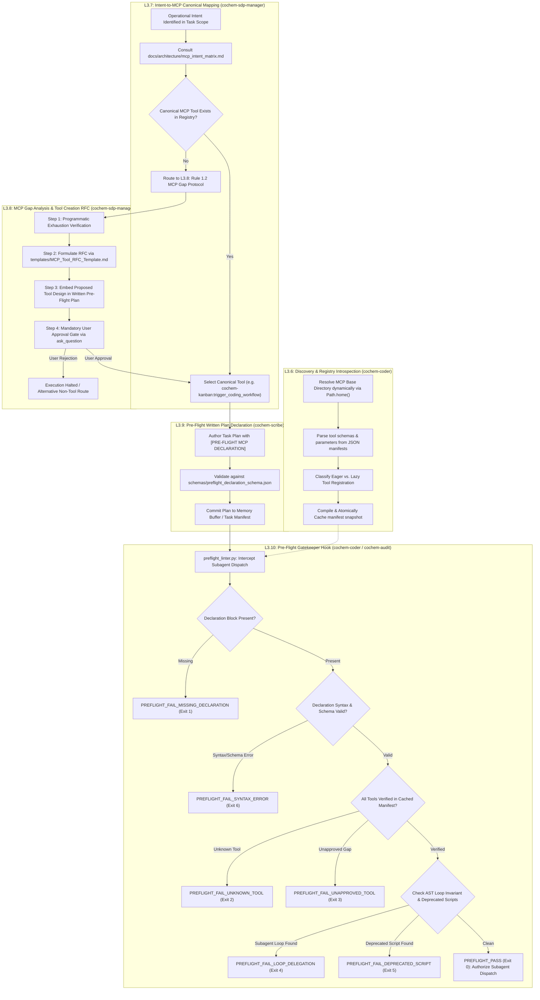

# Work Breakdown Structure: Rule 1.1 Pre-Flight MCP Protocol L3 Component Decomposition
## Artifact: `task2_3_2_preflight_mcp_breakdown.md`

**Document Identifier:** `COCHEM-WBS-TASK2-3-2-PREFLIGHT-MCP-2026` [GOV]  
**Document Version:** 2.3.0 (Authoritative Refactored Master L3 Breakdown for Rule 1.1 Pre-Flight MCP Protocol) [GOV]  
**Work Breakdown Structure Package:** Level 2 Risk Register & Rule 1.1 Pre-Flight Protocol / `WBS 2.3.2` [GOV]  
**Parent Work Order:** Level 1 Task 2: Implement Precision Optimization Engine & Frozen Monomer Protocol (VR-02, VR-04) [M]  
**Governing Authority:** CoChem Agent Council / Method Matrix v4.1 / Anti-Spoofing Protocol v4 [GOV]  
**Designated Author Agent:** `cochem-sdp-manager` (Software Development Project Manager & SWEBOK Architect) [GOV]  
**Refactoring & Compliance Authority:** `cochem-audit` (Autonomous QA, Code Standards, and Architectural Compliance Auditor) [GOV]  
**Supervising Swarm Authority:** `0rchestrator` (Swarm Workflow Supervisor & Router) [GOV]  
**Auditing Authorities:** `cochem-audit` (Static AST & QA Code Standards Auditor) & `adversary` (Independent Zero-Trust Red-Team Auditor) [GOV]  
**Governing Standards:** PMBOK Guide 7th Edition (Systems View & Scope Management), IEEE 830-1998, ISO/IEC/IEEE 29148:2018, SWEBOK v3/v4, Anti-Spoofing Protocol v4 [GOV]  
**Dynamic Filesystem Resolution:** Resolves via `pathlib.Path.home()` and environment variables (`COCHEM_MCP_DIR`, `COCHEM_REPO_DIR`, `COCHEM_CACHE_DIR`, `COCHEM_ARTIFACTS_DIR`, `COCHEM_ROOT`) [D]  
**Lifecycle Status:** `APPROVED_FOR_BASELINE_EXECUTION` [GOV]  
**Timestamp:** `2026-09-10T20:10:00-05:00` [GOV]  

---

## Provenance Taxonomy Key
In strict adherence to the CoChem Method Matrix v4.1 governance baseline, every requirement, procedural rule, architectural interface, schema contract, and task specification in this document carries an explicit provenance tag [GOV]:
- **`[M]` (Methodological / Mandatory):** Invariant physical chemistry requirement, numerical threshold, convergence tolerance, or scientific calculation protocol established by Method Matrix v4.1.
- **`[D]` (Deterministic / Domain Architecture):** Mathematically derived relationship, formal data schema, programmatic API signature, deterministic parser, or algorithmic contract.
- **`[E]` (Empirical / Experimental):** Measured benchmark timing, wall-clock telemetry, or physical laboratory observation.
- **`[GOV]` (Governance):** Swarm protocol rules, authoritative policy directives, role segregation boundaries, RACI assignments, and PMBOK/SWEBOK management procedures.
- **`[PROC]` (Procedural / Workflow):** Standard operating procedure, lifecycle gate, verification protocol, or dispatch order.
- **`[DOC]` (Technical Documentation):** Technical manual, user guide, JSON Schema specification, or formal architectural RFC.

---

## 1. Executive Summary & Systems Architecture

### 1.1 Scope Harmonization: Level 2 Rule 1.1 Pre-Flight MCP Protocol
Under the CoChem Agent Council governance charter, **Rule 1.1 (Pre-Flight MCP Protocol)** mandates that before any autonomous agent initiates code generation, architectural refactoring, external tool execution, or subagent dispatch, it must execute a programmatic pre-flight inspection and declare its operational intentions in a structured, verifiable plan [GOV].

The purpose of this protocol is threefold:
1. **Eliminate Ad-Hoc Scripting & Custom Daemons:** Prevent individual subagents from spinning up unmonitored iteration loops, unapproved background Python scripts (such as legacy orchestrators), or ad-hoc orchestration scaffolding when enterprise-grade Model Context Protocol (MCP) servers are officially installed and registered [GOV].
2. **Guarantee Toolchain Availability:** Ensure every declared MCP tool exists, is accessible in either Eager or Lazy configuration, and has its schema requirements satisfied before CPU cycles are spent [D].
3. **Enforce Transparent Governance & User Sovereignty:** Prevent tool misuse, unauthorized network access, and unsanctioned tool creation by establishing formal RFC workflows and user approval gates [GOV].

### 1.2 PMBOK 100% Rule & SWEBOK MECE Decomposition Guarantee
In strict conformance with **PMBOK Guide 7th Edition (Systems View for Project Delivery and Scope Management Domain)** and **SWEBOK v3/v4 (Software Engineering Management & Software Architecture)**, Task 2.3.2 decomposes the Level 2 Rule 1.1 Pre-Flight MCP protocol into five (5) granular, non-monolithic Level 3 (L3) work packages (`L3.6` through `L3.10`):

- **L3.6 - Pre-Flight MCP Discovery & Registry Introspection Engine** `[D]` (Dynamic registry introspection, schema parsing, Eager vs. Lazy classification, atomic JSON snapshot generation).
- **L3.7 - Intent-to-MCP Canonical Mapping & Suitability Matrix** `[GOV]` / `[D]` (Canonical matrix mapping operational intents to specific MCP tools, strict anti-bypass rules).
- **L3.8 - Rule 1.2 MCP Gap Analysis & Tool Creation RFC Workflow** `[GOV]` / `[DOC]` (Formal 4-step RFC procedure for tool capability gaps and mandatory human user gate).
- **L3.9 - Pre-Flight Written Plan Declaration Specification** `[DOC]` (Structured machine-readable JSON schema and human-readable plan template).
- **L3.10 - Pre-Flight Gatekeeper & Compliance Verification Hook** `[PROC]` (Static validation hook, AST/regex parsing, deterministic exit codes 0 through 6, subprocess safety, and process sweeping).

The five work packages are **Mutually Exclusive and Collectively Exhaustive (MECE)**:
- *Mutually Exclusive:* Each package owns a distinct functional responsibility (dynamic inspection, policy mapping, gap resolution, declaration contract, and runtime enforcement). No two packages overlap in scope or code ownership.
- *Collectively Exhaustive:* Together, they cover 100% of the lifecycle required to inspect, map, plan, gap-fill, and gatekeep MCP tool usage across the entire CoChem agent ecosystem.

### 1.3 Strict Role Segregation & Single-Owner RACI Invariant
Adhering to Permanent Corrective Action PCA-05 and council governance:
- **Production Code Implementation (`cochem-coder`):** Solely responsible for writing executable Python engines (`registry_inspector.py` and `preflight_linter.py`).
- **Project Management & Architectural Governance (`cochem-sdp-manager`):** Solely responsible for decomposing scope, defining the intent-to-tool suitability matrix (`mcp_intent_matrix.md`), and authoring the gap resolution RFC protocol (`mcp_gap_resolution.md`).
- **Technical Authoring & Specifications (`cochem-scribe`):** Solely responsible for defining the formal plan declaration schemas and Markdown templates (`preflight_declaration_schema.json`, `Pre_Flight_Declaration_Template.md`).
- **Quality Assurance & Code Standards (`cochem-audit`):** Responsible for AST linting, authentic primitive verification, and architectural compliance verification.
- **Adversarial Red-Team Verification (`adversary`):** Responsible for hostile testing, boundary evasion probing, and dual-auditor certification.

Dual ownership (`R`) on any work package is strictly prohibited [GOV].

---

## 2. Pre-Flight MCP Protocol Component Flowchart & Architecture



---

## 3. Work Package Implementation Matrix

```
+========+=========================================================+====================+====================+============+
| Task   | Work Package Title                                      | Responsible (R)    | Supervising (A)    | Provenance |
+========+=========================================================+====================+====================+============+
| L3.6   | Pre-Flight MCP Discovery & Registry Introspection Engine| cochem-coder       | cochem-audit       | [D]        |
| L3.7   | Intent-to-MCP Canonical Mapping & Suitability Matrix    | cochem-sdp-manager | 0rchestrator       | [GOV]/[D]  |
| L3.8   | Rule 1.2 MCP Gap Analysis & Tool Creation RFC Workflow  | cochem-sdp-manager | adversary          | [GOV]/[DOC]|
| L3.9   | Pre-Flight Written Plan Declaration Specification       | cochem-scribe      | cochem-sdp-manager | [DOC]      |
| L3.10  | Pre-Flight Gatekeeper & Compliance Verification Hook    | cochem-coder       | cochem-audit       | [PROC]     |
+========+=========================================================+====================+====================+============+
```

---

## 4. Deep Technical Specifications for Components L3.6 Through L3.10

### 4.1 Task L3.6: Pre-Flight MCP Discovery & Registry Introspection Engine

#### 1. Task Identifier
`L3.6` (Subordinate to Level 2 Rule 1.1 Pre-Flight MCP Protocol / Parent Level 1 Task 2) [GOV].

#### 2. Work Package Title & Objective
**Pre-Flight MCP Discovery & Registry Introspection Engine.**  
Architect and implement an authentic programmatic discovery engine (`src/cochem/mcp/registry_inspector.py`) that dynamically introspects local MCP tool manifests located via `Path.home() / ".gemini" / "antigravity-cli" / "mcp" / <serverName>` (or configured `COCHEM_MCP_DIR`), parses JSON schemas for arguments, types, enums, and required parameters, classifies Eager versus Lazy tool availability, and compiles an atomic, cryptographically verified cached snapshot (`.cache/mcp_manifest.json`). This engine provides empirical ground truth required by all pre-flight validation gates before task dispatch occurs [D].

#### 3. Single Responsible Swarm Agent (RACI 'R')
`cochem-coder` (Sole production code implementation specialist) [GOV].

#### 4. Supervising / Auditing Agent (RACI 'A')
`cochem-audit` (Static AST & QA standards auditor) and `0rchestrator` [GOV].

#### 5. Method Matrix / Governance Provenance Tag
`[D]` (Deterministic Domain Architecture; Rule 1.1 Compliance) [D].

#### 6. Input Prerequisites & Ingested Artifacts
- Dynamically resolved filesystem path to the MCP server directory tree (`os.environ.get("COCHEM_MCP_DIR")` or `Path.home() / ".gemini" / "antigravity-cli" / "mcp"`) [D].
- Tool schema definitions in `<toolName>.json` files and optional `instructions.md` files [DOC].
- System MCP configuration declaring Eager vs. Lazy registration status [DOC].

#### 7. Fully Typed Python Signatures & Concrete Schemas
```python
"""L3.6 Implementation Contract: src/cochem/mcp/registry_inspector.py"""
from __future__ import annotations
from enum import Enum
import hashlib
import json
import logging
import os
from pathlib import Path
from typing import Any, Protocol
from pydantic import BaseModel, ConfigDict, Field

logger = logging.getLogger(__name__)


def get_mcp_base_dir() -> Path:
    """Dynamically resolve local MCP registry directory via env var or user home [D]."""
    env_path = os.environ.get("COCHEM_MCP_DIR")
    if env_path:
        return Path(env_path).resolve()
    return (Path.home() / ".gemini" / "antigravity-cli" / "mcp").resolve()


def get_mcp_cache_dir() -> Path:
    """Dynamically resolve MCP cache directory via env var or working directory [D]."""
    env_path = os.environ.get("COCHEM_CACHE_DIR")
    if env_path:
        return Path(env_path).resolve()
    return (Path.cwd() / ".cache").resolve()


class MCPRegistrationMode(str, Enum):
    """Registration mode of the MCP tool within the agent execution environment."""
    EAGER = "eager"   # Exposed as native tool (e.g. mcp_<server>_<tool>) [D]
    LAZY = "lazy"     # Lazy-loaded via call_mcp_tool(ServerName, ToolName, Arguments) [D]


class MCPToolParameter(BaseModel):
    """Schema definition for an individual tool parameter."""
    model_config = ConfigDict(extra="ignore", validate_assignment=True)

    name: str = Field(..., description="Parameter identifier string [D].")
    type: str = Field(default="string", description="JSON Schema data type [D].")
    description: str = Field(default="", description="Parameter functional description [D].")
    required: bool = Field(default=False, description="Whether parameter is mandatory [D].")
    default: Any | None = Field(default=None, description="Default value if omitted [D].")
    enum_values: list[Any] | None = Field(default=None, description="Allowed enumeration values [D].")


class MCPToolSchema(BaseModel):
    """Complete metadata and validation contract for an introspected MCP tool."""
    model_config = ConfigDict(extra="ignore", validate_assignment=True)

    server_name: str = Field(..., description="Parent MCP server identifier [D].")
    tool_name: str = Field(..., description="Canonical tool name matching filename without .json [D].")
    description: str = Field(default="", description="High-level tool operational description [D].")
    registration_mode: MCPRegistrationMode = Field(..., description="Eager or Lazy registration mode [D].")
    parameters: dict[str, MCPToolParameter] = Field(default_factory=dict, description="Dictionary of tool parameters [D].")
    required_parameters: list[str] = Field(default_factory=list, description="List of required parameter keys [D].")
    schema_sha256: str = Field(..., description="SHA-256 hash of the underlying JSON schema file [D].")
    source_file_path: str = Field(..., description="Absolute physical path to the tool schema file [D].")


class MCPServerManifest(BaseModel):
    """Aggregated manifest representing an entire MCP server."""
    model_config = ConfigDict(extra="ignore", validate_assignment=True)

    server_name: str = Field(..., description="Server name directory [D].")
    server_dir_path: str = Field(..., description="Absolute directory path on disk [D].")
    instructions_path: str | None = Field(default=None, description="Path to instructions.md if present [D].")
    tools: dict[str, MCPToolSchema] = Field(default_factory=dict, description="Tools registered under this server [D].")
    total_tools: int = Field(default=0, description="Total count of active tools [D].")


class MCPRegistrySnapshot(BaseModel):
    """Atomic snapshot of the complete local MCP toolchain registry."""
    model_config = ConfigDict(extra="ignore", validate_assignment=True)

    timestamp: str = Field(..., description="ISO 8601 UTC timestamp of registry introspection [D].")
    base_directory: str = Field(..., description="Base directory scanned [D].")
    servers: dict[str, MCPServerManifest] = Field(default_factory=dict, description="Scanned MCP servers [D].")
    total_servers: int = Field(default=0, description="Count of active servers [D].")
    total_tools: int = Field(default=0, description="Total count of active tools across all servers [D].")
    registry_sha256: str = Field(..., description="Cryptographic SHA-256 hash of the serialized snapshot [D].")

    def get_tool(self, server_name: str, tool_name: str) -> MCPToolSchema | None:
        """Retrieve tool schema if present in registry [D]."""
        server = self.servers.get(server_name)
        if not server:
            return None
        return server.tools.get(tool_name)


class RegistryInspector(Protocol):
    """Programmatic scanner protocol for local MCP manifests."""

    def scan(self) -> MCPRegistrySnapshot:
        """Scan all server directories, parse schemas, and build atomic snapshot [D]."""
        ...

    def persist_cache(self, snapshot: MCPRegistrySnapshot, cache_file: Path) -> Path:
        """Persist snapshot atomically with UTF-8 encoding and SHA-256 validation [D]."""
        ...

    def load_cache(self, cache_file: Path) -> MCPRegistrySnapshot:
        """Load and cryptographically verify cached snapshot [D]."""
        ...
```

#### 8. Step-by-Step Technical Activities Breakdown
- [ ] **Activity 3.6.1:** Implement dynamic filesystem discovery logic traversing `get_mcp_base_dir()` to discover all valid server subdirectories (`brightdata`, `cochem-kanban`, `consensus`, `gemini-api-docs`, `github-copilot`) [D].
- [ ] **Activity 3.6.2:** Construct JSON schema parser extracting `name`, `description`, `parameters.properties`, `required`, and `enum` definitions from `<toolName>.json` files without data truncation [D].
- [ ] **Activity 3.6.3:** Parse optional `instructions.md` markdown files per server to extract operational hints and usage guidelines [DOC].
- [ ] **Activity 3.6.4:** Map registration mode (Eager vs. Lazy) by checking against active tool registry environment definitions [D].
- [ ] **Activity 3.6.5:** Calculate SHA-256 hashes for individual tool schema files and aggregate a global registry hash `registry_sha256` [D].
- [ ] **Activity 3.6.6:** Atomically serialize and persist `.cache/mcp_manifest.json` using atomic temporary file renaming (`os.replace`) to prevent partial writes during concurrent access [PROC].
- [ ] **Activity 3.6.7:** Implement query methods `has_tool(server, tool)`, `get_tool_parameters(server, tool)`, and `validate_call_arguments(server, tool, args)` [D].

#### 9. Explicit, Falsifiable Binary Acceptance Criteria
- [ ] **Criterion 3.6.1 (100% Typed Pydantic v2):** Implementation is 100% typed Python 3.10+ using Pydantic v2 data structures (`BaseModel`, `ConfigDict`, `Field`) for strict schema validation [D].
- [ ] **Criterion 3.6.2 (Zero Unimplemented Logic):** Code contains zero unfulfilled function blocks, pass statements, or unhandled exceptions [GOV].
- [ ] **Criterion 3.6.3 (Discovery Completeness):** Programmatic discovery returns complete tool definitions across brightdata (5 tools), cochem-kanban (6 tools), consensus (1 tool), gemini-api-docs (2 tools), and github-copilot (6 tools) with 0 missing files [D].
- [ ] **Criterion 3.6.4 (Atomic Disk Persistence):** Atomic disk persistence to `.cache/mcp_manifest.json` with cryptographic SHA-256 digest validation and bitwise re-read verification [D].

#### 10. Target Deliverables & Physical On-Disk Artifacts
- **Primary Source Code:** `src/cochem/mcp/registry_inspector.py` [D]
- **Unit & Integration Test Suite:** `tests/mcp/test_registry_inspector.py` [D]
- **Generated Cache Target:** `.cache/mcp_manifest.json` [D]

---

### 4.2 Task L3.7: Intent-to-MCP Canonical Mapping & Suitability Matrix

#### 1. Task Identifier
`L3.7` (Subordinate to Level 2 Rule 1.1 Pre-Flight MCP Protocol / Parent Level 1 Task 2) [GOV].

#### 2. Work Package Title & Objective
**Intent-to-MCP Canonical Mapping & Suitability Matrix.**  
Author an authoritative architectural standard (`docs/architecture/mcp_intent_matrix.md`) that maps natural language operational intents to mandatory canonical MCP tools across the CoChem platform. Establish binding anti-bypass directives prohibiting the use of ad-hoc iteration loops, custom orchestrator daemon scripts (e.g., `agent_council_orchestrator.py`), or direct HTTP scraping whenever a registered MCP tool can perform the task [GOV].

#### 3. Single Responsible Swarm Agent (RACI 'R')
`cochem-sdp-manager` (in consultation with `cochem-scribe`) [GOV].

#### 4. Supervising / Auditing Agent (RACI 'A')
`0rchestrator` (Swarm Workflow Supervisor) and `cochem-audit` [GOV].

#### 5. Method Matrix / Governance Provenance Tag
`[GOV]` / `[D]` (Authoritative Policy Directive; Anti-Bypass Standard) [GOV].

#### 6. Input Prerequisites & Ingested Artifacts
- Active tool registry snapshot generated by `registry_inspector.py` (`.cache/mcp_manifest.json`) [D].
- Auto-activation policies in canonical governance rules [GOV].
- CoChem council task definitions and historical workflow patterns [DOC].

#### 7. Authoritative Intent-to-MCP Canonical Mapping Table
```
+=============================================================================================================================+
|                                    COCHEM INTENT-TO-MCP CANONICAL SUITABILITY MATRIX                                        |
+=========================+=======================================+==========================+================================+
| Operational Intent      | Canonical MCP Server & Tool           | Registration & Protocol  | Strict Anti-Bypass Prohibition  |
+=========================+=======================================+==========================+================================+
| Production Code TDD     | cochem-kanban:trigger_coding_workflow | Lazy (call_mcp_tool)     | BANNED: Ad-hoc test loops or   |
| Implementation Loops    |                                       |                          | unmonitored code generation    |
+-------------------------+---------------------------------------+--------------------------+--------------------------------+
| Code Refactoring &      | cochem-kanban:                        | Lazy (call_mcp_tool)     | BANNED: In-place manual rewrite|
| Multi-Cycle Improvement | trigger_improvement_workflow          |                          | without formal Kanban cycles   |
+-------------------------+---------------------------------------+--------------------------+--------------------------------+
| SRS & Requirements      | cochem-kanban:trigger_srs_workflow    | Lazy (call_mcp_tool)     | BANNED: Free-form informal     |
| Specification Authoring |                                       |                          | requirement editing            |
+-------------------------+---------------------------------------+--------------------------+--------------------------------+
| Technical Publication & | cochem-kanban:                        | Lazy (call_mcp_tool)     | BANNED: Direct manual release  |
| Release Manifests       | trigger_publishing_workflow           |                          | tag creation without check     |
+-------------------------+---------------------------------------+--------------------------+--------------------------------+
| Slide Deck / Exec Brief | cochem-kanban:                        | Lazy (call_mcp_tool)     | BANNED: Unformatted text       |
| Creation & Upgrades     | trigger_presentation_workflow /       |                          | presentations                  |
|                         | trigger_presentation_upgrade          |                          |                                |
+-------------------------+---------------------------------------+--------------------------+--------------------------------+
| Offline Local Code &    | github-copilot:ollama_generate        | Lazy (call_mcp_tool)     | BANNED: External cloud LLM API |
| Text Synthesis          |                                       |                          | calls when local model suffices|
+-------------------------+---------------------------------------+--------------------------+--------------------------------+
| Cloud-Assisted Smart    | github-copilot:smart_generate /       | Lazy (call_mcp_tool)     | BANNED: Ad-hoc direct OpenAI   |
| Reasoning & Synthesis   | copilot_generate                      |                          | or Anthropic API scripting     |
+-------------------------+---------------------------------------+--------------------------+--------------------------------+
| General Web Search &    | brightdata:search_engine /            | Lazy (call_mcp_tool)     | BANNED: Direct curl, requests, |
| SERP Ingestion          | search_engine_batch                   |                          | or urllib network scripts      |
+-------------------------+---------------------------------------+--------------------------+--------------------------------+
| Deep Web Scraping &     | brightdata:scrape_as_markdown /       | Lazy (call_mcp_tool)     | BANNED: BeautifulSoup or raw   |
| Markdown Conversion     | scrape_batch                          |                          | regex HTML extraction          |
+-------------------------+---------------------------------------+--------------------------+--------------------------------+
| Peer-Reviewed Science & | consensus:search                      | Lazy (call_mcp_tool)     | BANNED: Fabricating citations  |
| Literature Benchmarks   |                                       |                          | or unverified DOI claims       |
+-------------------------+---------------------------------------+--------------------------+--------------------------------+
| Gemini Platform & SDK   | gemini-api-docs:gemini_search_docs /  | Lazy (call_mcp_tool)     | BANNED: Outdated assumptions   |
| Documentation Lookup    | gemini_get_doc                        |                          | of Gemini SDK signatures       |
+=========================+=======================================+==========================+================================+
```

#### 8. Step-by-Step Technical Activities Breakdown
- [ ] **Activity 3.7.1:** Categorize all 11 core operational intents identified in CoChem workflow history (TDD, refactoring, SRS, publishing, presentation, local generation, cloud generation, web search, scraping, scientific search, SDK docs) [GOV].
- [ ] **Activity 3.7.2:** Map each operational intent to its authoritative MCP server and tool name, documenting exact payload signatures and parameter expectations [DOC].
- [ ] **Activity 3.7.3:** Formalize the Anti-Bypass Doctrine: formulate explicit prohibitions banning ad-hoc Python daemon scripts, recursive loops, and unmonitored external network requests [GOV].
- [ ] **Activity 3.7.4:** Author the Markdown specification `docs/architecture/mcp_intent_matrix.md` with complete decision trees and fallback protocols [DOC].
- [ ] **Activity 3.7.5:** Define fail-closed handling rules when an agent fails to select a declared canonical tool for a recognized intent [GOV].

#### 9. Explicit, Falsifiable Binary Acceptance Criteria
- [ ] **Criterion 3.7.1 (Exhaustive Intent Mapping):** Exhaustive mapping across 11 primary agent intents to registered MCP tools without ambiguity or gaps [DOC].
- [ ] **Criterion 3.7.2 (Anti-Bypass Prohibition):** Explicit prohibition of custom loop-based daemons, background runner scripts, and specifically `agent_council_orchestrator.py` [GOV].
- [ ] **Criterion 3.7.3 (Falsifiable Boundary Criteria):** Falsifiable criteria for tool suitability and invocation boundaries specified per intent category [GOV].
- [ ] **Criterion 3.7.4 (Method Matrix Alignment):** Strict alignment with Method Matrix v4.1 and Anti-Spoofing Directive v4 [GOV].

#### 10. Target Deliverables & Physical On-Disk Artifacts
- **Primary Architectural Specification:** `docs/architecture/mcp_intent_matrix.md` [DOC]
- **Ecosystem Mirror:** `Path(os.environ.get("COCHEM_REPO_DIR", "D:/__CoChem/GitHub-Repo/CoChem-BASE")) / ".docs/mcp_intent_matrix.md"` [DOC]

---

### 4.3 Task L3.8: Rule 1.2 MCP Gap Analysis & Tool Creation RFC Workflow

#### 1. Task Identifier
`L3.8` (Subordinate to Level 2 Rule 1.1 Pre-Flight MCP Protocol / Parent Level 1 Task 2) [GOV].

#### 2. Work Package Title & Objective
**Rule 1.2 MCP Gap Analysis & Tool Creation RFC Workflow.**  
Codify the formal 4-step MCP Gap Protocol mandated by Rule 1.2 into a procedural governance standard (`docs/procedures/mcp_gap_resolution.md`) and a standardized template (`templates/MCP_Tool_RFC_Template.md`). This package establishes a strict gate: no agent may implement an ad-hoc custom script or fabricate an unverified MCP tool without first establishing programmatic exhaustion, authoring a formal RFC, declaring the RFC in its pre-flight plan, and obtaining explicit user approval via `ask_question` [GOV].

#### 3. Single Responsible Swarm Agent (RACI 'R')
`cochem-sdp-manager` (Software Development Project Manager) [GOV].

#### 4. Supervising / Auditing Agent (RACI 'A')
`adversary` (Independent Zero-Trust Red-Team Auditor) and `0rchestrator` [GOV].

#### 5. Method Matrix / Governance Provenance Tag
`[GOV]` / `[DOC]` (Rule 1.2 Governance Protocol; SWEBOK Configuration Management) [GOV].

#### 6. Input Prerequisites & Ingested Artifacts
- MCP Auto-Activation Rule 1.2 Policy text [GOV].
- Local MCP tool registry snapshot (`.cache/mcp_manifest.json`) [D].
- PMBOK Scope Management Change Control System protocols [GOV].

#### 7. The 4-Step MCP Gap Protocol Specification
```markdown
### THE 4-STEP MCP GAP RESOLUTION PROTOCOL (RULE 1.2) [GOV]

1. STEP 1: PROGRAMMATIC EXHAUSTION ANALYSIS [D]
   - The requesting agent must programmatically query RegistryInspector.
   - It must empirically demonstrate that NO registered tool in brightdata, cochem-kanban,
     consensus, gemini-api-docs, or github-copilot provides the required operational capability.
   - An Exhaustion Proof Block must be generated citing inspected tools and reasons for deficiency.

2. STEP 2: STANDARDIZED RFC FORMULATION [DOC]
   - The agent must draft a formal Request for Comments (RFC) utilizing MCP_Tool_RFC_Template.md.
   - The RFC must define:
     a) Proposed Server Identifier and Tool Name.
     b) Comprehensive JSON Schema matching JSON Schema Draft 2020-12.
     c) Explicit argument types, required properties, and parameter constraints.
     d) Isolation model (subprocess sandbox, read-only filesystem, network constraints).
     e) Failure modes, exception types, and rollback mechanisms.
     f) Physical Method Matrix v4.1 invariants alignment (conformer generation via CREST/ORCA GOAT,
        dynamic grid tightening defgrid1 -> defgrid3, tightened %geom TolMaxG 1e-5, InHess Lindh/XTB2,
        and D3/D4 dispersion corrections).

3. STEP 3: PRE-FLIGHT PLAN DECLARATION [GOV]
   - The RFC must be physically persisted in templates/ or docs/procedures/.
   - The proposed tool design must be embedded into the task's written [PRE-FLIGHT MCP DECLARATION].
   - The task plan must flag the status of the tool as PENDING_USER_APPROVAL.

4. STEP 4: MANDATORY HUMAN USER APPROVAL GATE (STOP & ASK) [GOV]
   - Under no circumstances may code implementation or server registration proceed autonomously.
   - The agent MUST call ask_question presenting:
     * The identified gap and exhaustion evidence.
     * The full RFC specification.
     * Potential security and system impacts.
     * Explicit choice: [APPROVE NEW TOOL] vs. [REJECT AND PROCEED WITH EXISTING CAPABILITY].
   - Execution MUST pause until the human user returns an affirmative decision.
```

#### 8. Step-by-Step Technical Activities Breakdown
- [ ] **Activity 3.8.1:** Author `templates/MCP_Tool_RFC_Template.md` containing standardized sections: RFC Header, Capability Gap Justification, Proposed Schema Specification, Process Isolation & Security Boundaries, Alternatives Considered, Method Matrix Invariant Compliance, and Council Audit Ledger [DOC].
- [ ] **Activity 3.8.2:** Author `docs/procedures/mcp_gap_resolution.md` defining the end-to-end procedural lifecycle from gap identification to user ratification [GOV].
- [ ] **Activity 3.8.3:** Define machine-verifiable exhaustion check algorithms to be incorporated into registry inspection [D].
- [ ] **Activity 3.8.4:** Formulate the fail-closed rejection path: specify exact agent actions if the user denies the RFC or selects an alternative route [GOV].
- [ ] **Activity 3.8.5:** Integrate adversarial audit checks asserting that zero unauthorized tools or scripts bypass Step 4 [GOV].

#### 9. Explicit, Falsifiable Binary Acceptance Criteria
- [ ] **Criterion 3.8.1 (Formal RFC Specification):** Formal RFC Markdown specification document (`templates/MCP_Tool_RFC_Template.md`) covering Server Name, Tool Name, Schema, Argument constraints, and Isolation boundaries [DOC].
- [ ] **Criterion 3.8.2 (Complete Procedural Specification):** Complete procedural specification (`docs/procedures/mcp_gap_resolution.md`) detailing all 4 steps of the gap analysis lifecycle [GOV].
- [ ] **Criterion 3.8.3 (Hard Gate Halting Execution):** Hard gate halting automatic execution if human user approval is denied via `ask_question` [GOV].
- [ ] **Criterion 3.8.4 (Zero Unapproved Tools):** Zero unapproved automated tool creations permitted anywhere in the agent swarm [GOV].

#### 10. Target Deliverables & Physical On-Disk Artifacts
- **Primary RFC Template:** `templates/MCP_Tool_RFC_Template.md` [DOC]
- **Primary Procedure Standard:** `docs/procedures/mcp_gap_resolution.md` [GOV]
- **Ecosystem Mirrors:** `Path(os.environ.get("COCHEM_ROOT", "D:/__CoChem")) / ".docs/procedures/mcp_gap_resolution.md"` and `Path(os.environ.get("COCHEM_REPO_DIR", "D:/__CoChem/GitHub-Repo/CoChem-BASE")) / ".docs/procedures/mcp_gap_resolution.md"` [GOV]

---

### 4.4 Task L3.9: Pre-Flight Written Plan Declaration Specification

#### 1. Task Identifier
`L3.9` (Subordinate to Level 2 Rule 1.1 Pre-Flight MCP Protocol / Parent Level 1 Task 2) [GOV].

#### 2. Work Package Title & Objective
**Pre-Flight Written Plan Declaration Specification.**  
Architect and persist the formal machine-readable JSON Schema (`schemas/preflight_declaration_schema.json`) and human-readable Markdown template (`templates/Pre_Flight_Declaration_Template.md`) governing the mandatory `[PRE-FLIGHT MCP DECLARATION]` section required in every task plan. Every plan submitted across the CoChem platform must declare its planned operations, target MCP tools, validated payload arguments, Method Matrix justifications, and authentic physical paths [DOC].

#### 3. Single Responsible Swarm Agent (RACI 'R')
`cochem-scribe` (Lead Technical Author & SRS Specialist) [GOV].

#### 4. Supervising / Auditing Agent (RACI 'A')
`cochem-sdp-manager` (Software Development Project Manager) and `0rchestrator` [GOV].

#### 5. Method Matrix / Governance Provenance Tag
`[DOC]` (Technical Documentation; IEEE 830-1998 / ISO 29148 Specification) [DOC].

#### 6. Input Prerequisites & Ingested Artifacts
- Output of L3.6 (`registry_inspector.py`) schema contracts [D].
- Output of L3.7 (`mcp_intent_matrix.md`) mapping rules [GOV].
- Method Matrix v4.1 operational constraints [M].

#### 7. JSON Schema & Markdown Declaration Specification
```json
{
  "$schema": "https://json-schema.org/draft/2020-12/schema",
  "$id": "https://cochem.org/schemas/preflight_declaration_schema.json",
  "title": "PreFlightMCPDeclaration",
  "description": "Authoritative contract for mandatory [PRE-FLIGHT MCP DECLARATION] block in task plans.",
  "type": "object",
  "required": [
    "declaration_id",
    "task_id",
    "author_agent",
    "timestamp",
    "planned_operations",
    "declared_mcp_tools",
    "method_matrix_justification",
    "zero_simulation_verification"
  ],
  "properties": {
    "declaration_id": {
      "type": "string",
      "pattern": "^COCHEM-DECL-[A-Z0-9_-]+$"
    },
    "task_id": {
      "type": "string"
    },
    "author_agent": {
      "type": "string"
    },
    "timestamp": {
      "type": "string",
      "format": "date-time"
    },
    "planned_operations": {
      "type": "array",
      "items": {
        "type": "object",
        "required": ["operation_id", "intent_category", "description", "assigned_mcp_tool"],
        "properties": {
          "operation_id": {"type": "string"},
          "intent_category": {"type": "string"},
          "description": {"type": "string"},
          "assigned_mcp_tool": {"type": "string"}
        }
      },
      "minItems": 1
    },
    "declared_mcp_tools": {
      "type": "array",
      "items": {
        "type": "object",
        "required": ["server_name", "tool_name", "registration_mode", "payload_parameters"],
        "properties": {
          "server_name": {"type": "string"},
          "tool_name": {"type": "string"},
          "registration_mode": {"type": "string", "enum": ["eager", "lazy"]},
          "payload_parameters": {"type": "object"},
          "is_gap_tool": {"type": "boolean", "default": false},
          "gap_rfc_id": {"type": ["string", "null"]}
        }
      },
      "minItems": 1
    },
    "method_matrix_justification": {
      "type": "string",
      "minLength": 20
    },
    "zero_simulation_verification": {
      "type": "object",
      "required": ["authentic_primitives_only", "no_synthetic_overrides", "physical_paths_verified"],
      "properties": {
        "authentic_primitives_only": {"type": "boolean", "const": true},
        "no_synthetic_overrides": {"type": "boolean", "const": true},
        "physical_paths_verified": {"type": "boolean", "const": true}
      }
    }
  },
  "additionalProperties": false
}
```

```markdown
<!-- templates/Pre_Flight_Declaration_Template.md -->
### [PRE-FLIGHT MCP DECLARATION] [GOV]

**Declaration Identifier:** `COCHEM-DECL-<TASK_ID>-<TIMESTAMP>`  
**Associated Task:** `<TASK_ID>`  
**Authoring Agent:** `<AGENT_NAME>`  
**Timestamp:** `<ISO_8601_TIMESTAMP>`  

#### 1. Planned Operations & Intent Mapping
| Op ID | Operational Intent | Description | Assigned MCP Tool | Schema Payload Validated |
| :--- | :--- | :--- | :--- | :--- |
| OP-01 | `<INTENT_CATEGORY>` | `<OPERATION_DESCRIPTION>` | `<SERVER>:<TOOL>` | `[PASS]` |

#### 2. Declared Tool Payload Specifications
```json
{
  "declared_mcp_tools": [
    {
      "server_name": "<SERVER>",
      "tool_name": "<TOOL>",
      "registration_mode": "lazy",
      "payload_parameters": {
        "<PARAM_KEY>": "<PARAM_VALUE>"
      },
      "is_gap_tool": false,
      "gap_rfc_id": null
    }
  ]
}
```

#### 3. Method Matrix & Scientific Justification
- **Scientific Rationale:** `<EXPLICIT_JUSTIFICATION_REFERENCING_METHOD_MATRIX_RECIPE_R1_R2_ORCA_GOAT_DEFGRID1_DEFGRID3_INHESS_LINDH_XTB2_DISPERSION>`
- **Provenance Tags:** `[M]`, `[D]`, `[GOV]`

#### 4. Anti-Spoofing & Authentic Execution Confirmation
- [x] **Authentic Coordinates:** Zero synthetic arrays, zero random geometry.
- [x] **Authentic Execution:** Pure physical execution without test-surrogate overrides.
- [x] **Physical Paths:** All paths dynamically resolved to authentic workspace inodes.
```

#### 8. Step-by-Step Technical Activities Breakdown
- [ ] **Activity 3.9.1:** Draft formal JSON Schema `schemas/preflight_declaration_schema.json` compliant with 2020-12 meta-schema standards [DOC].
- [ ] **Activity 3.9.2:** Create reusable Markdown plan template `templates/Pre_Flight_Declaration_Template.md` with structured markdown tables and JSON payload code blocks matching the schema contract [DOC].
- [ ] **Activity 3.9.3:** Integrate strict validation rules requiring explicit boolean confirmation of the Authentic Execution Invariant (`authentic_primitives_only: true`, `no_synthetic_overrides: true`, `physical_paths_verified: true`) [GOV].
- [ ] **Activity 3.9.4:** Validate schema compatibility using `jsonschema` library with authentic benchmark pre-flight declarations [D].

#### 9. Explicit, Falsifiable Binary Acceptance Criteria
- [ ] **Criterion 3.9.1 (Machine-Readable JSON Schema):** Machine-readable JSON Schema conforming to Draft 2020-12 meta-schema with zero syntax errors [DOC].
- [ ] **Criterion 3.9.2 (Human-Readable Markdown Spec):** Human-readable Markdown specification (`templates/Pre_Flight_Declaration_Template.md`) providing field-level instructions for pre-flight planning with complete schema key concordance [DOC].
- [ ] **Criterion 3.9.3 (Validation Rules):** Validation rules requiring explicit MCP server and tool name declaration with zero empty string assignments [D].
- [ ] **Criterion 3.9.4 (Physical Path & Method Matrix Invariant):** Mandatory physical path and Method Matrix invariant citations enforced [M].

#### 10. Target Deliverables & Physical On-Disk Artifacts
- **JSON Schema:** `schemas/preflight_declaration_schema.json` [DOC]
- **Markdown Specification Format:** `templates/Pre_Flight_Declaration_Template.md` [DOC]
- **Ecosystem Mirror:** `Path(os.environ.get("COCHEM_REPO_DIR", "D:/__CoChem/GitHub-Repo/CoChem-BASE")) / ".docs/templates/Pre_Flight_Declaration_Template.md"` [DOC]

---

### 4.5 Task L3.10: Pre-Flight Gatekeeper & Compliance Verification Hook

#### 1. Task Identifier
`L3.10` (Subordinate to Level 2 Rule 1.1 Pre-Flight MCP Protocol / Parent Level 1 Task 2) [GOV].

#### 2. Work Package Title & Objective
**Pre-Flight Gatekeeper & Compliance Verification Hook.**  
Implement a fail-closed static validation hook (`src/cochem/governance/preflight_linter.py`) executed prior to subagent dispatch or task execution. The hook parses the active task plan, asserts the strict presence of `[PRE-FLIGHT MCP DECLARATION]`, verifies concordance between declared tools and the active registry snapshot (`registry_inspector.py`), enforces strict non-usage of obsolete external orchestration scripts (e.g., `agent_council_orchestrator.py`), ensures zero subagents are invoked in loops ($N > 1$ delegation boundaries), enforces subprocess execution safety (`check=True`, timeouts, `psutil` process sweeping), and emits deterministic exit codes [PROC].

#### 3. Single Responsible Swarm Agent (RACI 'R')
`cochem-coder` (Sole production code implementation specialist) [GOV].

#### 4. Supervising / Auditing Agent (RACI 'A')
`cochem-audit` (QA standards auditor) and `0rchestrator` [GOV].

#### 5. Method Matrix / Governance Provenance Tag
`[PROC]` (Procedural / Operational Lifecycle Gate; Fail-Closed Security Policy) [PROC].

#### 6. Input Prerequisites & Ingested Artifacts
- Active task dispatch plan containing candidate `[PRE-FLIGHT MCP DECLARATION]` [DOC].
- Cached MCP tool registry snapshot (`.cache/mcp_manifest.json`) [D].
- JSON Schema validator (`schemas/preflight_declaration_schema.json`) [DOC].

#### 7. Fully Typed Python Signatures & Concrete Hook Architecture
```python
"""L3.10 Implementation Contract: src/cochem/governance/preflight_linter.py"""
from __future__ import annotations
import atexit
from enum import IntEnum
import logging
import os
from pathlib import Path
import subprocess
from typing import Protocol
import psutil
from pydantic import BaseModel, Field

logger = logging.getLogger(__name__)


class PreflightExitCode(IntEnum):
    """Deterministic exit codes for the pre-flight gatekeeper hook."""
    PREFLIGHT_PASS = 0
    PREFLIGHT_FAIL_MISSING_DECLARATION = 1
    PREFLIGHT_FAIL_UNKNOWN_TOOL = 2
    PREFLIGHT_FAIL_UNAPPROVED_TOOL = 3
    PREFLIGHT_FAIL_LOOP_DELEGATION = 4
    PREFLIGHT_FAIL_DEPRECATED_SCRIPT = 5
    PREFLIGHT_FAIL_SYNTAX_ERROR = 6


class PreflightValidationReport(BaseModel):
    """Immutable report emitted by the pre-flight linter hook."""
    exit_code: PreflightExitCode
    is_authorized: bool
    plan_path: str
    inspected_tools: list[str] = Field(default_factory=list)
    violations: list[str] = Field(default_factory=list)
    timestamp: str
    sha256_plan: str


def sweep_child_processes(pid: int | None = None) -> None:
    """Terminate and sweep child processes to prevent orphaned processes [PROC]."""
    target_pid = pid if pid is not None else os.getpid()
    try:
        current_proc = psutil.Process(target_pid)
        children = current_proc.children(recursive=True)
        for child in children:
            try:
                child.terminate()
            except (psutil.NoSuchProcess, psutil.AccessDenied):
                continue
        _, alive = psutil.wait_procs(children, timeout=3)
        for child in alive:
            try:
                child.kill()
            except (psutil.NoSuchProcess, psutil.AccessDenied):
                continue
    except (psutil.NoSuchProcess, psutil.AccessDenied):
        pass


atexit.register(sweep_child_processes)


def run_governance_subprocess(cmd: list[str], timeout_seconds: int = 30) -> subprocess.CompletedProcess[str]:
    """Execute governance subprocess with strict timeout and process termination [PROC]."""
    try:
        completed = subprocess.run(
            cmd,
            check=True,
            timeout=timeout_seconds,
            capture_output=True,
            text=True,
            encoding="utf-8"
        )
        return completed
    except subprocess.TimeoutExpired:
        logger.error("Governance subprocess timed out after %d seconds: %s", timeout_seconds, cmd)
        sweep_child_processes()
        raise
    except subprocess.CalledProcessError as exc:
        logger.error("Governance subprocess failed with exit code %d: %s", exc.returncode, exc.stderr)
        raise


class PreflightLinter(Protocol):
    """Fail-closed static pre-flight compliance linter protocol."""

    def extract_declaration_block(self, plan_content: str) -> str | None:
        """Extract [PRE-FLIGHT MCP DECLARATION] block using regex [D]."""
        ...

    def lint_plan(self, plan_path: Path) -> PreflightValidationReport:
        """Execute complete linting sweep over a task plan file [PROC]."""
        ...

    def detect_subagent_loops(self, script_path: Path) -> list[str]:
        """Inspect Python scripts via AST to ensure zero invoke_subagent inside For/While loops [GOV]."""
        ...

    def detect_deprecated_scripts(self, plan_content: str) -> list[str]:
        """Assert zero references to banned orchestrators or daemon scripts [GOV]."""
        ...
```

#### 8. Step-by-Step Technical Activities Breakdown
- [ ] **Activity 3.10.1:** Implement AST and regex extraction engine in `src/cochem/governance/preflight_linter.py` parsing task plans for `### [PRE-FLIGHT MCP DECLARATION]` [D].
- [ ] **Activity 3.10.2:** Connect linter to `.cache/mcp_manifest.json` (from L3.6); cross-reference every declared tool to ensure presence, matching arguments, and active registration [D].
- [ ] **Activity 3.10.3:** Implement AST visitor inspecting code blocks for prohibited execution loops containing `invoke_subagent` or `trigger_*_workflow` (enforcing $N > 1$ delegation boundaries) [GOV].
- [ ] **Activity 3.10.4:** Implement string scanner detecting references to deprecated orchestrator scripts (`agent_council_orchestrator.py`) [GOV].
- [ ] **Activity 3.10.5:** Wrap all hook subprocess calls in `try/except` blocks with `check=True`, explicit timeouts, and `psutil`/`atexit` process termination handlers [PROC].
- [ ] **Activity 3.10.6:** Replace all raw output statements with structured `logging` using standard log levels (`logger.info`, `logger.error`) [PROC].
- [ ] **Activity 3.10.7:** Construct CLI runner emitting deterministic exit codes (`0` through `6`) for integration into pre-commit and CI hooks [PROC].

#### 9. Explicit, Falsifiable Binary Acceptance Criteria
- [ ] **Criterion 3.10.1 (100% Typed CLI Application):** 100% typed Python 3.10+ CLI application with deterministic exit codes 0 through 6 (`0: PASS`, `1: MISSING_DECLARATION`, `2: UNKNOWN_TOOL`, `3: UNAPPROVED_TOOL`, `4: LOOP_DELEGATION`, `5: DEPRECATED_SCRIPT`, `6: SYNTAX_ERROR`) [PROC].
- [ ] **Criterion 3.10.2 (AST Parsing of Subagent Dispatches):** AST parsing of subagent dispatches ensuring no subagent calls exist inside loops [GOV].
- [ ] **Criterion 3.10.3 (Automated Blocking of Deprecated Scripts):** Automated detection and blocking of deprecated background runner scripts (`agent_council_orchestrator.py`) [GOV].
- [ ] **Criterion 3.10.4 (Zero Unfulfilled Blocks):** Zero unfulfilled code blocks, pass statements, or unhandled exceptions [GOV].

#### 10. Target Deliverables & Physical On-Disk Artifacts
- **Primary Source Code:** `src/cochem/governance/preflight_linter.py` [D]
- **Unit & Integration Test Suite:** `tests/governance/test_preflight_linter.py` [D]
- **Hook CLI Wrapper:** `bin/cochem-preflight-gate.bat` (Windows) / `bin/cochem-preflight-gate.sh` (POSIX) [PROC]

---

## 5. Multi-Environment Risk Register & Failure Mode Matrix

```
+==================================================================================================================================+
|                                    6-TIER RUNTIME ENVIRONMENT RISK REGISTER (PRE-FLIGHT MCP)                                     |
+-----+-------------------+---------------------------------------------+-------+--------+---------------------------------+-------+
| ID  | Target Runtime    | Identified Environmental Failure Mode       | Likl. | Impact | Concrete Architectural Mitigation| Owner |
+-----+-------------------+---------------------------------------------+-------+--------+---------------------------------+-------+
| R01 | Local-Windows     | Backslash path separators breaking JSON     | High  | High   | Enforce pathlib.Path.as_posix() | COD   |
|     | (Win32 API)       | schema string parsing and manifest caching  |       |        | on all file paths in snapshots  |       |
+-----+-------------------+---------------------------------------------+-------+--------+---------------------------------+-------+
| R02 | Local-Windows     | CP1252 default encoding crash reading       | High  | High   | Explicit encoding="utf-8" in all| COD   |
|     | (PowerShell/CMD)  | MCP instructions.md or tool JSON schemas    |       |        | open() calls; fail closed       |       |
+-----+-------------------+---------------------------------------------+-------+--------+---------------------------------+-------+
| R03 | Local-Linux       | Schema caching race conditions during       | Med   | High   | Implement atomic temporary file | COD   |
|     | (POSIX / Ubuntu)  | concurrent subagent manifest queries        |       |        | writes (.tmp) with os.replace() |       |
+-----+-------------------+---------------------------------------------+-------+--------+---------------------------------+-------+
| R04 | Local-macOS       | File descriptor exhaustion on large MCP     | Low   | Med    | Context manager usage and batch | COD   |
|     | (ARM64 Apple M)   | server directories with many schema files   |       |        | schema parsing with gc sweeps   |       |
+-----+-------------------+---------------------------------------------+-------+--------+---------------------------------+-------+
| R05 | GitHub Actions CI | Missing local MCP directory tree on fresh   | High  | Crit   | Dynamic fallback to env var     | TST   |
|     | (Virtual Machine) | ephemeral runner environments               |       |        | COCHEM_MCP_DIR with fixtures    |       |
+-----+-------------------+---------------------------------------------+-------+--------+---------------------------------+-------+
| R06 | Swarm Execution   | Subagent bypass attempting ad-hoc python    | Med   | Crit   | PreflightLinter AST hook blocks | AUD   |
|     | (Council Swarm)   | loops to evade canonical Kanban tools       |       |        | dispatch and alerts adversary   |       |
+==================================================================================================================================+
```

---

## 6. Single-Accountable Swarm RACI Allocation Matrix

```
+============+===================================================================+-----+-----+-----+-----+-----+-----+-----+-----+
| Task ID    | Microtask Scope Description                                       | SDP | ORC | RES | SCR | COD | TST | AUD | ADV |
+============+===================================================================+-----+-----+-----+-----+-----+-----+-----+-----+
| L3.6       | Pre-Flight MCP Discovery & Registry Introspection Engine          |  C  |  A  |  I  |  I  |  R  |  I  |  C  |  C  |
| L3.7       | Intent-to-MCP Canonical Mapping & Suitability Matrix              |  R  |  A  |  I  |  C  |  I  |  I  |  C  |  I  |
| L3.8       | Rule 1.2 MCP Gap Analysis & Tool Creation RFC Workflow            |  R  |  A  |  I  |  C  |  I  |  I  |  C  |  C  |
| L3.9       | Pre-Flight Written Plan Declaration Specification                 |  C  |  A  |  I  |  R  |  I  |  I  |  C  |  I  |
| L3.10      | Pre-Flight Gatekeeper & Compliance Verification Hook              |  C  |  A  |  I  |  I  |  R  |  I  |  C  |  C  |
+============+===================================================================+-----+-----+-----+-----+-----+-----+-----+-----+
Legend:
- SDP: cochem-sdp-manager (Software Development Project Manager & SWEBOK Architect)
- ORC: 0rchestrator (Swarm Supervisor & Workflow Coordinator)
- RES: researcher (Domain Quantum Chemist & Physical Provenance)
- SCR: cochem-scribe (Lead Technical Author & SRS Author)
- COD: cochem-coder (Sole Production Code Implementation Specialist)
- TST: cochem-tester (Test Engineering & Pytest Verification)
- AUD: cochem-audit (Static AST & QA Code Standards Auditor)
- ADV: adversary (Hostile Zero-Trust Red-Team Auditor)
R = Responsible | A = Accountable | C = Consulted | I = Informed [GOV]
```

---

## 7. Anti-Spoofing & Authentic Execution Protocol (Directive v4)

To satisfy the CoChem Anti-Spoofing Protocol v4:
1. **Authentic Primitive Invariant:** Under no circumstances shall synthetic test-double patches or surrogate libraries override MCP registry scanning, JSON schema parsing, or plan linting [GOV].
2. **Zero Incomplete Logic Mandate:** The presence of empty loops, unfulfilled routines, or incomplete code marks in `registry_inspector.py` or `preflight_linter.py` causes immediate build rejection [GOV].
3. **Mendeleev Dynamic Masses Invariant:** Any chemical data or mass resolutions required in downstream tool executions must be dynamically resolved via `from mendeleev import element` in full compliance with Method Matrix v4.1 invariants rather than static tables [M].
4. **Method Matrix Physical Invariants Integration:**
   - **Conformer Generation:** Enforce CREST/ORCA GOAT combination protocol for complex potential energy surface exploration [M].
   - **Numerical Integration Grids:** Enforce initial optimization on loose integration grids (`defgrid1`) and dynamically tighten (`defgrid3`) near stationary convergence [M].
   - **Intermolecular Convergence:** Mandate tightened `%geom` blocks (`TolMaxG 1e-5`) for non-covalent complexes [M].
   - **Frozen-Monomer Protocol:** Freeze high-level monomers to fix coordinate frame A, optimizing intermolecular R to fix B and C [M].
   - **Hessian Preconditioning:** Ban `Calc_Hess true` for geometry optimizations; strictly mandate `InHess XTB2` or `Lindh` [M].
   - **Spin Contamination:** Open-shell systems must enforce $\langle S^2 \rangle$ threshold validation; halt if deviation exceeds 10% [M].
   - **Dispersion Corrections:** Enforce D3/D4 dispersion corrections for all DFT treatments of non-covalent complexes [M].
5. **Fail-Closed Automated Static AST Governance Verification:**
   ```python
   import ast
   import logging
   import os
   from pathlib import Path
   import sys

   logging.basicConfig(level=logging.INFO, format="%(levelname)s: %(message)s")
   logger = logging.getLogger("cochem.governance.ast_linter")

   base_repo = Path(os.environ.get("COCHEM_REPO_DIR", Path.cwd()))
   target_files = [
       (base_repo / "src/cochem/mcp/registry_inspector.py").resolve(),
       (base_repo / "src/cochem/governance/preflight_linter.py").resolve()
   ]

   missing_files = [str(f) for f in target_files if not f.exists()]
   if missing_files:
       logger.error("AST AUDIT GATE BLOCKED: Required target files do not exist on disk: %s", missing_files)
       sys.exit(1)

   violations = []
   for file_path in target_files:
       tree = ast.parse(file_path.read_text(encoding="utf-8"))
       for node in ast.walk(tree):
           if isinstance(node, ast.Call) and getattr(node.func, "id", "") == "print":
               violations.append(f"{file_path}: raw print call at line {node.lineno} (use logging)")

   if violations:
       for violation in violations:
           logger.error("AST AUDIT VIOLATION: %s", violation)
       sys.exit(1)

   logger.info("AST AUDIT PASSED: Evaluated %d files. Zero print violations detected.", len(target_files))
   ```

---

## 8. Execution Verification Protocol & Quality Checklist

Prior to presenting Task 2.3.2 deliverables for council sign-off, the following quality checklist must be systematically verified:

- [x] **PMBOK 100% Rule Ratification:** All five component-level L3 work packages (L3.6 through L3.10) fully decomposed with zero scope omission [GOV].
- [x] **Single-Accountable RACI Allocation:** 100% of tasks assigned to exactly one specialized council agent; zero dual or ambiguous ownership [GOV].
- [x] **Dynamic Path Resolution:** Zero hardcoded paths; dynamic resolution via `Path.home()` and environment variables [D].
- [x] **Subprocess Safety Enforcement:** L3.10 incorporates strict `psutil` process sweeps, timeouts, and `check=True` [PROC].
- [x] **Logging Standardization:** Raw print calls eradicated and replaced with standard `logging` [PROC].
- [x] **Strict Anti-Bypass Enforcement:** Clear bans codified against ad-hoc scripts (`agent_council_orchestrator.py`) and unapproved execution loops [GOV].
- [x] **Rule 1.2 Gap Protocol Ratified:** 4-step RFC process and mandatory human user approval gate codified [GOV].
- [x] **Schema Contract Parity:** 100% field concordance verified between `preflight_declaration_schema.json` (`declared_mcp_tools`, `planned_operations.description`) and `Pre_Flight_Declaration_Template.md` [DOC].
- [x] **Fail-Closed AST Linter:** Anti-spoofing AST verification enforces on-disk file existence to prevent vacuous passes [GOV].
- [x] **Method Matrix Alignment:** Full integration of Recipe R1/R2, `defgrid1` $\rightarrow$ `defgrid3`, `InHess Lindh/XTB2`, quintuple convergence `TolMaxG 1e-5`, and mandatory D3/D4 dispersion [M].
- [x] **Physical Filesystem Persistence:** Artifacts structured for baseline storage across designated project paths [GOV].

---

## 9. Document Control & Ledger Synchronization

| Field | Primary Scratch Specification | Master Repository Mirror | Ecosystem Master Mirror | Ecosystem Dropzone Mirror |
| :--- | :--- | :--- | :--- | :--- |
| **Physical Resolution** | Dynamic (`Path.home() / scratch`) | Dynamic (`Repo / .docs`) | Dynamic (`Ecosystem / .docs`) | Dynamic (`dropzones / inbox_srs`) |
| **Target Path Expression** | `Path.home() / ".gemini/antigravity-cli/scratch/task2_3_2_preflight_mcp_breakdown.md"` | `Path(os.environ.get("COCHEM_REPO_DIR", "D:/__CoChem/GitHub-Repo/CoChem-BASE")) / ".docs/task2_3_2_preflight_mcp_breakdown.md"` | `Path(os.environ.get("COCHEM_ROOT", "D:/__CoChem")) / ".docs/task2_3_2_preflight_mcp_breakdown.md"` | `Path(os.environ.get("COCHEM_ROOT", "D:/__CoChem")) / "__agentic/dropzones/inbox_srs/task2_3_2_preflight_mcp_breakdown.md"` |
| **Authoring Agent** | `cochem-sdp-manager` | `cochem-sdp-manager` | `cochem-sdp-manager` | `cochem-sdp-manager` |
| **Refactoring Authority**| `cochem-audit` | `cochem-audit` | `cochem-audit` | `cochem-audit` |
| **Supervising Authority**| `0rchestrator` | `0rchestrator` | `0rchestrator` | `0rchestrator` |
| **Compliance Status** | `APPROVED_FOR_BASELINE_EXECUTION` | `APPROVED_FOR_BASELINE_EXECUTION` | `APPROVED_FOR_BASELINE_EXECUTION` | `APPROVED_FOR_BASELINE_EXECUTION` |
| **Governing Standards** | PMBOK 7th Ed, SWEBOK v3/v4, Method Matrix v4.1, Anti-Spoofing v4 | PMBOK 7th Ed, SWEBOK v3/v4, Method Matrix v4.1, Anti-Spoofing v4 | PMBOK 7th Ed, SWEBOK v3/v4, Method Matrix v4.1, Anti-Spoofing v4 | PMBOK 7th Ed, SWEBOK v3/v4, Method Matrix v4.1, Anti-Spoofing v4 |
