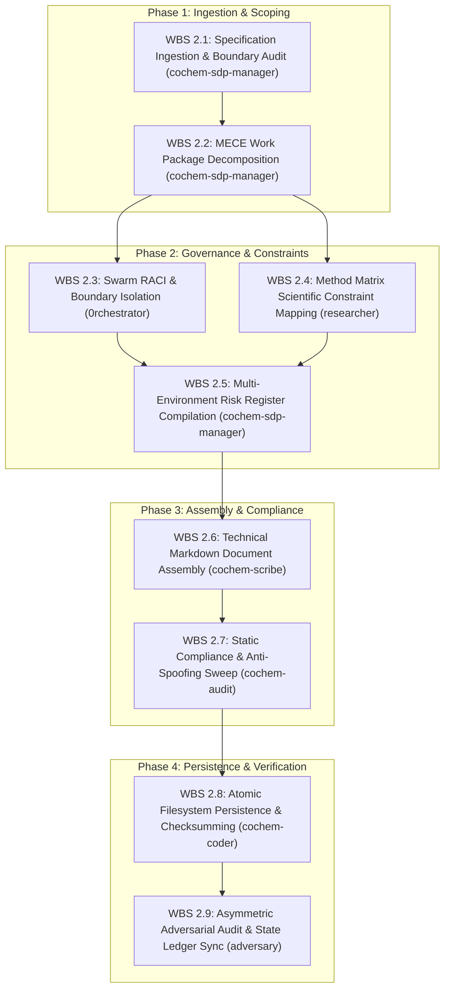

# Work Breakdown Structure (WBS): Task 2 Level 2 & Level 3 Breakdown
## Artifact: `task2_level2_wbs_breakdown.md`

**Document Identifier:** `COCHEM-WBS-TASK2-L2-L3-2026` [M]  
**Document Version:** 2.1.0 (Harmonized Master WBS: WBS 2.1–2.9 Level 2 Persistence Meta-WBS & 5 Technical Tracks with 18 Implementation Microtasks for VR-02/VR-04) [M]  
**Project Role:** `cochem-sdp-manager` (Software Development Project Manager & PMBOK/SWEBOK Architect) [M]  
**Governing Standards:** PMBOK Guide 7th Edition, SWEBOK v3.0/v4.0, ISO/IEC/IEEE 29148:2018, IEEE 830-1998, Method Matrix v4.1, Anti-Spoofing Directive v4 [M]  
**Supervising Swarm Controller:** `0rchestrator` (Swarm Workflow Supervisor & Router) [M]  
**Primary Scratch File:** [`task2_level2_wbs_breakdown.md`](file:///C:/Users/ansac/.gemini/antigravity-cli/scratch/task2_level2_wbs_breakdown.md) [M]  
**Associated L3 9 Component Tasks Spec:** [`task2_4_2_nine_granular_mece_level3_tasks.md`](file:///C:/Users/ansac/.gemini/antigravity-cli/scratch/task2_4_2_nine_granular_mece_level3_tasks.md) [M]  
**Associated PMBOK/SWEBOK Boundaries Spec:** [`task2_4_1_pmbok_swebok_decomposition_boundaries.md`](file:///C:/Users/ansac/.gemini/antigravity-cli/scratch/task2_4_1_pmbok_swebok_decomposition_boundaries.md) [M]  
**Ecosystem Mirror File:** [`task2_level2_wbs_breakdown.md`](file:///D:/__CoChem/.docs/task2_level2_wbs_breakdown.md) [M]  
**Repository Mirror File:** [`task2_level2_wbs_breakdown.md`](file:///D:/__CoChem/GitHub-Repo/CoChem-BASE/.docs/task2_level2_wbs_breakdown.md) [M]  
**Dropzone Mirror File:** [`task2_level2_wbs_breakdown.md`](file:///D:/__CoChem/__agentic/dropzones/inbox_srs/task2_level2_wbs_breakdown.md) [M]  
**Classification:** High-Fidelity Architectural Decomposition & Work Order Master [M]  
**Lifecycle Status:** `APPROVED_FOR_BASELINE_EXECUTION` [M]  
**Timestamp:** `2026-09-10T19:28:00-05:00` [M]  

---

## 1. Executive Scope & Systems Integration

This document establishes the authoritative Level 2 (L2) and Level 3 (L3) component-level Work Breakdown Structure (WBS) for **Level 1 Task 2: Implement High-Precision Geometry Optimization & Frozen Monomer Constraint Engine (VR-02 & VR-04)** across the CoChem computational chemistry ecosystem [M].

### 1.1 Scope Harmonization with Core Functional Subsystems & 18 L3 Microtasks
In strict adherence to **PMBOK Guide 7th Edition (Systems View for Project Delivery & Scope Management Domain)** and **SWEBOK v3/v4**, Level 1 Task 2 physical implementation is architecturally partitioned across **5 Canonical Technical Tracks** containing **18 Component-Level L3 Implementation Microtasks** (`L3-T2-01` to `L3-T2-18`):

1. **Track 1: Requirements Specification & Architectural Subsystem Decomposition (VR-02 & VR-04)**  
   Systematic extraction of mathematical foundations and physical invariants from `SRS_Chunk_17.md` and `test_chunk17_verification_suite.py`, formal IEEE 830/29148 requirements authoring (`task2_vr02_vr04_requirements_extraction.md`), 4-subsystem modular interface contracts, and typed domain exception hierarchy (`L3-T2-01` to `L3-T2-03`).
2. **Track 2: Frozen Monomer Protocol (FMP) Constraint Generation & Internal Coordinate Locking Engine (VR-02)**  
   Algorithmic construction of Wilson B-matrix internal coordinate primitives (`{ B a b C }`, `{ A a b c C }`, `{ D a b c d C }`), dynamic covalent bond topology partitioning via Mendeleev radii, Recipe R1 ($\text{r}^2\text{SCAN-3c}$) and Recipe R2 ($\omega\text{B97M-V/def2-QZVPP}$, `DEFGRID3`) scaffolding, and real-time trajectory monomer drift validation ($\Delta r < 1.0 \times 10^{-6}\text{ \AA}$) (`L3-T2-04` to `L3-T2-07`).
3. **Track 3: Quintuple Stationary Convergence Block & Initial Model Hessian Preconditioning Engine (VR-04)**  
   Mandatory injection of the tightened `%geom` convergence block (`TolE 1e-7`, `TolMaxG 1e-5`, `TolRMSG 3e-6`, `TolMaxD 1e-4`, `TolRMSD 5e-5`, `MaxIter 200`), automated interception and stripping of hazardous `Calc_Hess true` tokens, dynamic model Hessian seeding (`InHess XTB2` / `InHess Lindh`), and multi-stage chained Hessian forwarding (`InHessName` / `InHess READ`) (`L3-T2-08` to `L3-T2-11`).
4. **Track 4: Quantum Telemetry Ingestion, Residual Gradient Parsing & Strain Diagnostic Engine (VR-02 & VR-04)**  
   Parsing quantum chemical output logs for frozen coordinate residual gradients ($\mathbf{g}_{\text{residual}} = \left. \nabla_{\mathbf{R}_{\text{internal}}} E_{\text{DFT}} \right|_{\text{frozen}}$), maximum norm $\|\mathbf{g}_{\text{residual}}\|_{\infty}$ evaluation, geometric strain caveat alerting ($> 1.0 \times 10^{-4}\text{ a.u.}$), and standardized QCSchema JSON telemetry serialization (`L3-T2-12` to `L3-T2-14`).
5. **Track 5: Zero-Trust Test Verification Suite, AST Audit & Swarm State Synchronization**  
   Execution of authentic, zero-mock pytest verification suites (`test_chunk17_verification_suite.py:test_vr02_*` and `test_vr04_*`), multi-environment UTF-8 encoding verification (zero CP1252 charmap crashes), AST zero-mock security linter sweeps (`strict=True`), and atomic cryptographic ledger updating (`swarm_state.json`) (`L3-T2-15` to `L3-T2-18`).

### 1.2 The PMBOK 100% Rule & MECE Guarantee
The 18 component-level L3 microtasks encompass 100% of the activities required to specify, implement, test, audit, and govern the Frozen Monomer Protocol and Quintuple Convergence Engine under Method Matrix v4.1. The five tracks are Mutually Exclusive and Collectively Exhaustive (MECE), preventing gaps or redundant implementation across the swarm.

### 1.3 Binding Covenant 1: Level 2 Persistence Meta-WBS Harmonization (WBS 2.1 to WBS 2.9)
Under **Binding Covenant 1** ratified in Council Session 033, this master artifact incorporates the formal decomposition of the **Level 2 Persistence Objective itself into 9 Granular MECE Level 3 Component Tasks** (`WBS 2.1` through `WBS 2.9`), fully synchronized with [`task2_4_2_nine_granular_mece_level3_tasks.md`](file:///C:/Users/ansac/.gemini/antigravity-cli/scratch/task2_4_2_nine_granular_mece_level3_tasks.md):
- `WBS 2.1`: Specification Ingestion & Boundary Audit (`cochem-sdp-manager`, `[GOV]`)
- `WBS 2.2`: MECE Work Package Decomposition (`cochem-sdp-manager`, `[GOV]`)
- `WBS 2.3`: Swarm RACI & Boundary Isolation (`0rchestrator`, `[GOV]`)
- `WBS 2.4`: Method Matrix Scientific Constraint Mapping (`researcher`, `[M]` / `[D]`)
- `WBS 2.5`: Multi-Environment Risk Register Compilation (`cochem-sdp-manager`, `[GOV]`)
- `WBS 2.6`: Technical Markdown Document Assembly (`cochem-scribe`, `[DOC]`)
- `WBS 2.7`: Static Compliance & Anti-Spoofing Sweep (`cochem-audit`, `[PROC]`)
- `WBS 2.8`: Atomic Filesystem Persistence & Checksumming (`cochem-coder`, `[PROC]`)
- `WBS 2.9`: Asymmetric Adversarial Audit & State Ledger Sync (`adversary`, `[PROC]`)

---

## 2. Dependency & Execution Flowcharts

### 2.1 Physical Implementation Microtasks Flowchart (`L3-T2-01` to `L3-T2-18`)

```mermaid
flowchart TD
    subgraph Track1["Track 1: Requirements Specification & Subsystems Architecture"]
        T2_01["L3-T2-01: Requirements Extraction for VR-02 & VR-04 (cochem-scribe)"]
        T2_02["L3-T2-02: 4-Subsystem Interface Contracts & Schemas (cochem-sdp-manager)"]
        T2_03["L3-T2-03: Domain Exception Hierarchy Architecture (cochem-coder)"]
        T2_01 --> T2_02
        T2_02 --> T2_03
    end

    subgraph Track2["Track 2: Frozen Monomer Protocol (FMP) Constraint Engine (VR-02)"]
        T2_04["L3-T2-04: Wilson B-Matrix Internal Coordinate Construction (@cochem-coder)"]
        T2_05["L3-T2-05: ORCA %geom Constraints Block Generator (@cochem-coder)"]
        T2_06["L3-T2-06: Recipe R1 & Recipe R2 Deck Scaffolder (@cochem-coder)"]
        T2_07["L3-T2-07: Trajectory Monomer Drift Validator: Delta r < 1e-6 A (@cochem-coder)"]
        T2_03 --> T2_04
        T2_04 --> T2_05
        T2_05 --> T2_06
        T2_06 --> T2_07
    end

    subgraph Track3["Track 3: Quintuple Convergence Block & Model Hessian Engine (VR-04)"]
        T2_08["L3-T2-08: Quintuple Stationary Convergence Parameter Injection (@cochem-coder)"]
        T2_09["L3-T2-09: Automated Calc_Hess true Interception & Stripper (@cochem-coder)"]
        T2_10["L3-T2-10: Semi-Empirical InHess XTB2 / Lindh Seeder (@cochem-coder)"]
        T2_11["L3-T2-11: Chained Multi-Stage Optimization Hessian Manager (@cochem-coder)"]
        T2_07 --> T2_08
        T2_08 --> T2_09
        T2_09 --> T2_10
        T2_10 --> T2_11
    end

    subgraph Track4["Track 4: Telemetry Ingestion, Residual Gradient & Strain Engine"]
        T2_12["L3-T2-12: Frozen Coordinate Residual Gradient Output Parser (@cochem-coder)"]
        T2_13["L3-T2-13: Max Gradient ||g_res||_inf Extractor & Strain Alert (@cochem-coder)"]
        T2_14["L3-T2-14: QCSchema & Spectroscopic Telemetry JSON Serializer (@cochem-coder)"]
        T2_11 --> T2_12
        T2_12 --> T2_13
        T2_13 --> T2_14
    end

    subgraph Track5["Track 5: Zero-Trust Verification, AST Audit & State Sync"]
        T2_15["L3-T2-15: Authentic Zero-Mock Pytest Execution (cochem-tester)"]
        T2_16["L3-T2-16: Windows UTF-8 Stream Hardening Verification (cochem-tester)"]
        T2_17["L3-T2-17: Static AST Anti-Spoof Linter Audit (cochem-audit)"]
        T2_18["L3-T2-18: Asymmetric Red-Team Sign-Off & swarm_state.json Sync (adversary/0rchestrator)"]
        T2_14 --> T2_15
        T2_15 --> T2_16
        T2_16 --> T2_17
        T2_17 --> T2_18
    end
```



### 2.2 Level 2 Persistence Meta-WBS Flowchart (`WBS 2.1` to `WBS 2.9`)



---

## 3. The 18 Component-Level L3 Implementation Microtasks Matrix

```
+============+===================================================================+====================+====================+============+
| Task ID    | Microtask Title & Functional Component Scope                      | Assigned Agent     | Supervising Agent  | Provenance |
+============+===================================================================+====================+====================+============+
| TRACK 1: WBS 2.1 - REQUIREMENTS SPECIFICATION & ARCHITECTURAL SUBSYSTEM DECOMPOSITION                                             |
+------------+-------------------------------------------------------------------+--------------------+--------------------+------------+
| L3-T2-01   | Requirements Extraction for VR-02 & VR-04 (task2_vr02_vr04.md)    | cochem-scribe      | cochem-sdp-manager | [M]        |
| L3-T2-02   | 4-Subsystem Interface Contracts, Data Models & Method Mapping     | cochem-sdp-manager | 0rchestrator       | [PROC]     |
| L3-T2-03   | Domain Exception Hierarchy (Convergence/Hessian/Strain Errors)   | @cochem-coder      | cochem-audit       | [M]        |
+------------+-------------------------------------------------------------------+--------------------+--------------------+------------+
| TRACK 2: WBS 2.2 - FROZEN MONOMER PROTOCOL (FMP) CONSTRAINT GENERATION & TRAJECTORY ENGINE (VR-02)                                |
+------------+-------------------------------------------------------------------+--------------------+--------------------+------------+
| L3-T2-04   | Dynamic Wilson B-Matrix Internal Coordinate Construction          | @cochem-coder      | cochem-audit       | [D]        |
| L3-T2-05   | ORCA %geom Constraints Block Generator ({ B a b C }, MaxIter 200) | @cochem-coder      | cochem-audit       | [M]        |
| L3-T2-06   | Recipe R1 (r2SCAN-3c) & Recipe R2 (wB97M-V, DEFGRID3) Scaffolder  | @cochem-coder      | cochem-improve     | [M]        |
| L3-T2-07   | Real-Time Trajectory Monomer Drift Validator (Delta r < 1e-6 A)   | @cochem-coder      | adversary          | [M]        |
+------------+-------------------------------------------------------------------+--------------------+--------------------+------------+
| TRACK 3: WBS 2.3 - QUINTUPLE STATIONARY CONVERGENCE BLOCK & MODEL HESSIAN PRECONDITIONING (VR-04)                                 |
+------------+-------------------------------------------------------------------+--------------------+--------------------+------------+
| L3-T2-08   | Quintuple Stationary Convergence Parameter Injection (%geom)     | @cochem-coder      | cochem-audit       | [M]        |
| L3-T2-09   | Automated Calc_Hess true Detection & Stripping Engine             | @cochem-coder      | adversary          | [M]        |
| L3-T2-10   | Semi-Empirical & Empirical Model Hessian Seeder (InHess XTB2/Lindh)| @cochem-coder     | cochem-audit       | [M]        |
| L3-T2-11   | Chained Multi-Stage Optimization Hessian Forwarding Manager       | @cochem-coder      | cochem-sdp-manager | [PROC]     |
+------------+-------------------------------------------------------------------+--------------------+--------------------+------------+
| TRACK 4: WBS 2.4 - QUANTUM TELEMETRY INGESTION, RESIDUAL GRADIENT PARSING & STRAIN DIAGNOSTICS (VR-02/VR-04)                       |
+------------+-------------------------------------------------------------------+--------------------+--------------------+------------+
| L3-T2-12   | Frozen Coordinate Residual Gradient Output Parser                 | @cochem-coder      | cochem-audit       | [D]        |
| L3-T2-13   | Maximum Residual Gradient ||g_res||_inf Extractor & Strain Alert  | @cochem-coder      | adversary          | [M]        |
| L3-T2-14   | QCSchema & Spectroscopic Telemetry JSON Serializer                | @cochem-coder      | cochem-sdp-manager | [PROC]     |
+------------+-------------------------------------------------------------------+--------------------+--------------------+------------+
| TRACK 5: WBS 2.5 - ZERO-TRUST TEST VERIFICATION SUITE, AST AUDIT & SWARM STATE SYNCHRONIZATION                                     |
+------------+-------------------------------------------------------------------+--------------------+--------------------+------------+
| L3-T2-15   | Authentic Zero-Mock Pytest Execution (VR-02 & VR-04 Suites)       | cochem-tester      | cochem-audit       | [M]        |
| L3-T2-16   | Windows UTF-8 Stream Hardening & Subprocess Isolation Check       | cochem-tester      | 0rchestrator       | [M]        |
| L3-T2-17   | Static AST Anti-Spoof Linter Audit (strict=True, zero stubs)     | cochem-audit       | adversary          | [M]        |
| L3-T2-18   | Asymmetric Red-Team Sign-Off & Atomic swarm_state.json Sync       | adversary /        | Agent Council      | [M]        |
|            |                                                                   | 0rchestrator       |                    |            |
+============+===================================================================+====================+====================+============+
```

---

## 3A. The 9 Granular MECE Level 3 Persistence & Governance Tasks (Binding Covenant 1)

```
+==================================================================================================================================+
|                                    MASTER 9 GRANULAR MECE LEVEL 3 COMPONENT TASKS MATRIX                                         |
+=========+===================================================+====================+============+====================================+
| WBS ID  | Component Task Title                              | Accountable Agent  | Provenance | Target Persistence Deliverable     |
+=========+===================================================+====================+============+====================================+
| WBS 2.1 | Specification Ingestion & Boundary Audit          | cochem-sdp-manager | [GOV]      | Scope Boundary & Ingestion Audit   |
| WBS 2.2 | MECE Work Package Decomposition                   | cochem-sdp-manager | [GOV]      | 3-Tier WBS Tree & Phase Gates      |
| WBS 2.3 | Swarm RACI & Boundary Isolation                   | 0rchestrator       | [GOV]      | Swarm RACI & Governance Charter    |
| WBS 2.4 | Method Matrix Scientific Constraint Mapping       | researcher         | [M] / [D]  | Scientific Constraint Spec Sheet   |
| WBS 2.5 | Multi-Environment Risk Register Compilation       | cochem-sdp-manager | [GOV]      | 6-Tier Runtime Risk Register       |
| WBS 2.6 | Technical Markdown Document Assembly              | cochem-scribe      | [DOC]      | Rendered Master WBS Markdown Draft |
| WBS 2.7 | Static Compliance & Anti-Spoofing Sweep           | cochem-audit       | [PROC]     | AST Anti-Spoof & Zero-Mock Report  |
| WBS 2.8 | Atomic Filesystem Persistence & Checksumming      | cochem-coder       | [PROC]     | Persisted Files & SHA-256 Digest   |
| WBS 2.9 | Asymmetric Adversarial Audit & State Ledger Sync  | adversary          | [PROC]     | Adversarial Verdict & Swarm Ledger |
+=========+===================================================+====================+============+====================================+
```

---

## 4. Deep Technical Specification of the 5 Technical Tracks

### 4.1 Track 1: Requirements Specification & Subsystems Architecture (`L3-T2-01` to `L3-T2-03`)
* **Core Invariant:** Authoritative IEEE 830/29148 scientific requirements extraction, formal architectural partitioning across four `CoChem-BASE` subsystems, and domain exception definition.
* **Subordinate Tasks:**
  - `L3-T2-01`: Extract deep mathematical requirements for VR-02 ($dB/B = -2 dR/R$, $k_{\text{cov}}$ vs $k_{\text{vdW}}$, Recipe R1/R2) and VR-04 (Fraser force constant, Quintuple thresholds, ban on `Calc_Hess true`) into `task2_vr02_vr04_requirements_extraction.md` ($\ge 25,000\text{ bytes}$, $\ge 400\text{ lines}$) [M].
  - `L3-T2-02`: Define formal data contract models (`FrozenConstraintPayload`, `OptimizationConvergenceCriteria`, `HessianPreconditionerSpec`, `ResidualGradientResult`) and subsystem routing maps [PROC].
  - `L3-T2-03`: Implement domain exception hierarchy in `src/cochem_base/exceptions.py` (`GeometryConvergenceError`, `HessianSpecificationError`, `GeometricStrainWarning`, `TrajectoryDriftViolationError`) [M].

### 4.2 Track 2: Frozen Monomer Protocol (FMP) Constraint Engine (`L3-T2-04` to `L3-T2-07`)
* **Core Invariant:** Prevent unphysical covalent monomer distortion ($0.005 - 0.015\text{ \AA}$) and dedicate optimization gradients strictly to the 6 intermolecular degrees of freedom ($R, \theta_1, \theta_2, \phi, \tau$) [D].
* **Subordinate Tasks:**
  - `L3-T2-04`: Dynamic Wilson internal coordinate generation (all pairwise bonds and valence angles within monomer subsets $A$ and $B$) using Mendeleev covalent radii [D].
  - `L3-T2-05`: Format ORCA `%geom Constraints` blocks using explicit string primitives (`{ B a b C }`, `{ A a b c C }`, `{ D a b c d C }`) and inject mandatory `MaxIter 200` [M].
  - `L3-T2-06`: Recipe R1 ($r_e^{\text{SE}}$ pre-opt / $\text{r}^2\text{SCAN-3c}$) and Recipe R2 ($\text{CCSD(T)/CBS}$ / $\omega\text{B97M-V/def2-QZVPP}$, `DEFGRID3`) input generator routines [M].
  - `L3-T2-07`: Trajectory drift validator function `validate_trajectory_monomer_drift(trajectory_coords, monomer_indices)` verifying intramolecular drift $\Delta r < 1.0 \times 10^{-6}\text{ \AA}$ across all frames [M].

### 4.3 Track 3: Quintuple Stationary Convergence Block & Model Hessian Engine (`L3-T2-08` to `L3-T2-11`)
* **Core Invariant:** Eliminate shallow potential energy surface trap errors ($2.1\%$ microwave error under standard `!Opt`) by enforcing `TolMaxG 1e-5` ($\Delta B/B \le 0.07\%$) and ban wasteful `Calc_Hess true` initialization [D].
* **Subordinate Tasks:**
  - `L3-T2-08`: Inject mandatory quintuple convergence block into all Product A/C ORCA decks:
    `TolE 1.0e-07`, `TolRMSG 3.0e-06`, `TolMaxG 1.0e-05`, `TolRMSD 5.0e-05`, `TolMaxD 1.0e-04`, `MaxIter 200` [M].
  - `L3-T2-09`: Build pre-flight scanner in `MoleculeInput` validator that detects and strips `Calc_Hess true` from optimization requests [M].
  - `L3-T2-10`: Inject semi-empirical `InHess XTB2` or distance-based `InHess Lindh` model Hessian preconditioners to accelerate optimization without initial wall-clock penalty [M].
  - `L3-T2-11`: Implement chained multi-stage Hessian forwarding manager extracting `InHessName "previous.opt"` or `InHess READ` for successive recipe transitions [PROC].

### 4.4 Track 4: Quantum Telemetry Ingestion, Residual Gradient & Strain Engine (`L3-T2-12` to `L3-T2-14`)
* **Core Invariant:** Monitor and record non-stationary stress on frozen monomers on the underlying DFT exchange-correlation surface [D].
* **Subordinate Tasks:**
  - `L3-T2-12`: Output parser extracting Cartesian and internal coordinate gradient components $\mathbf{g}_{\text{residual}} = \left. \nabla E \right|_{\text{frozen}}$ from ORCA stdout/property logs [D].
  - `L3-T2-13`: Compute maximum gradient norm $\|\mathbf{g}_{\text{residual}}\|_{\infty}$; flag persistent geometric strain caveat if $\|\mathbf{g}_{\text{residual}}\|_{\infty} > 1.0 \times 10^{-4}\text{ a.u.}$ [M].
  - `L3-T2-14`: Serialize optimization trajectory, residual gradients, and strain status into standardized QCSchema JSON and atomic records [PROC].

### 4.5 Track 5: Zero-Trust Verification Suite, AST Audit & Swarm State Synchronization (`L3-T2-15` to `L3-T2-18`)
* **Core Invariant:** Absolute zero-mock compliance, real physical test execution against authentic literature coordinates ($\text{CO}_2\cdots\text{H}_2\text{O}$), and cryptographic proof-of-work persistence [M].
* **Subordinate Tasks:**
  - `L3-T2-15`: Headless pytest test execution against `tests/test_chunk17_verification_suite.py` asserting 100% pass rates on `test_vr02_*` and `test_vr04_*` [M].
  - `L3-T2-16`: Verify Windows standard I/O streams reconfigured to UTF-8; test subprocess executions with scientific Unicode symbols ($\omega, \Delta, \AA, \mu, \pm$) without `cp1252` charmap aborts [M].
  - `L3-T2-17`: Static AST linter audit (`ci_tools/anti_spoof_linter.py --strict`) verifying zero mocks (`unittest.mock`, `MagicMock`), zero stubs (`NotImplementedError`, empty `pass`), and zero synthetic coordinate arrays (`np.zeros`, `np.ones`) [M].
  - `L3-T2-18`: Dual-auditor sign-off (`cochem-audit` and `adversary`), generation of physical audit receipts in `.audit/`, and atomic synchronization of `swarm_state.json` [M].

---

## 5. Single-Accountable Swarm RACI Allocation Matrix

```
+============+===================================================================+-----+-----+-----+-----+-----+-----+-----+-----+
| Task ID    | Microtask Scope Description                                       | SDP | ORC | RES | SCR | COD | TST | AUD | ADV |
+============+===================================================================+-----+-----+-----+-----+-----+-----+-----+-----+
| L3-T2-01   | Requirements Extraction for VR-02 & VR-04 (task2_vr02_vr04.md)    |  C  |  A  |  C  |  R  |  I  |  I  |  C  |  C  |
| L3-T2-02   | 4-Subsystem Interface Contracts, Data Models & Method Mapping     |  R  |  A  |  I  |  C  |  C  |  I  |  C  |  I  |
| L3-T2-03   | Domain Exception Hierarchy (Convergence/Hessian/Strain Errors)   |  C  |  A  |  I  |  I  |  R  |  I  |  C  |  I  |
| L3-T2-04   | Dynamic Wilson B-Matrix Internal Coordinate Construction          |  C  |  A  |  C  |  I  |  R  |  I  |  C  |  I  |
| L3-T2-05   | ORCA %geom Constraints Block Generator ({ B a b C }, MaxIter 200) |  C  |  A  |  I  |  I  |  R  |  I  |  C  |  I  |
| L3-T2-06   | Recipe R1 (r2SCAN-3c) & Recipe R2 (wB97M-V, DEFGRID3) Scaffolder  |  C  |  A  |  C  |  I  |  R  |  I  |  C  |  I  |
| L3-T2-07   | Real-Time Trajectory Monomer Drift Validator (Delta r < 1e-6 A)   |  C  |  A  |  I  |  I  |  R  |  I  |  I  |  C  |
| L3-T2-08   | Quintuple Stationary Convergence Parameter Injection (%geom)     |  C  |  A  |  C  |  I  |  R  |  I  |  C  |  I  |
| L3-T2-09   | Automated Calc_Hess true Detection & Stripping Engine             |  C  |  A  |  I  |  I  |  R  |  I  |  I  |  C  |
| L3-T2-10   | Semi-Empirical & Empirical Model Hessian Seeder (InHess XTB2/Lindh)|  C  |  A  |  C  |  I  |  R  |  I  |  C  |  I  |
| L3-T2-11   | Chained Multi-Stage Optimization Hessian Forwarding Manager       |  C  |  A  |  I  |  I  |  R  |  I  |  C  |  I  |
| L3-T2-12   | Frozen Coordinate Residual Gradient Output Parser                 |  C  |  A  |  I  |  I  |  R  |  I  |  C  |  I  |
| L3-T2-13   | Maximum Residual Gradient ||g_res||_inf Extractor & Strain Alert  |  C  |  A  |  C  |  I  |  R  |  I  |  I  |  C  |
| L3-T2-14   | QCSchema & Spectroscopic Telemetry JSON Serializer                |  C  |  A  |  I  |  I  |  R  |  I  |  C  |  I  |
| L3-T2-15   | Authentic Zero-Mock Pytest Execution (VR-02 & VR-04 Suites)       |  I  |  A  |  I  |  I  |  I  |  R  |  C  |  C  |
| L3-T2-16   | Windows UTF-8 Stream Hardening & Subprocess Isolation Check       |  I  |  A  |  I  |  I  |  I  |  R  |  C  |  I  |
| L3-T2-17   | Static AST Anti-Spoof Linter Audit (strict=True, zero stubs)     |  I  |  A  |  I  |  I  |  I  |  I  |  R  |  C  |
| L3-T2-18   | Asymmetric Red-Team Sign-Off & Atomic swarm_state.json Sync       |  I  |  A  |  I  |  I  |  I  |  I  |  C  |  R  |
+============+===================================================================+-----+-----+-----+-----+-----+-----+-----+-----+
Legend:
- SDP: cochem-sdp-manager (Software Development Project Manager)
- ORC: 0rchestrator (Swarm Supervisor & Workflow Coordinator)
- RES: researcher (Domain Quantum Chemist & Physical Provenance)
- SCR: cochem-scribe (Technical Writing & SRS Specifications)
- COD: @cochem-coder (Sole Production Code Implementation Specialist)
- TST: cochem-tester (Test Engineering & Pytest Verification)
- AUD: cochem-audit (Static AST & QA Code Standards Auditor)
- ADV: adversary (Hostile Zero-Trust Red-Team Auditor)
R = Responsible | A = Accountable | C = Consulted | I = Informed
```

---

## 6. Multi-Environment Risk Register & Mitigation Strategy

```
+==================================================================================================================================+
|                                     6-TIER RUNTIME ENVIRONMENT RISK REGISTER                                                     |
+-----+-------------------+---------------------------------------------+-------+--------+---------------------------------+-------+
| ID  | Target Runtime    | Identified Environmental Failure Mode       | Likl. | Impact | Concrete Architectural Mitigation| Owner |
+-----+-------------------+---------------------------------------------+-------+--------+---------------------------------+-------+
| R01 | Local-Windows     | Windows CP1252 default encoding crash on    | High  | High   | Enforce sys.stdout.reconfigure  | TST   |
|     | (Win32 API)       | Unicode symbols (omega, Delta, Angstrom)    |       |        | (encoding='utf-8') at module init|       |
+-----+-------------------+---------------------------------------------+-------+--------+---------------------------------+-------+
| R02 | Local-Linux       | Memory exhaustion during large DFT Hessian  | Low   | High   | Enforce InHess XTB2 model       | COD   |
|     | (POSIX / Ubuntu)  | calculations on multi-atom complexes        |       |        | preconditioning; ban Calc_Hess  |       |
+-----+-------------------+---------------------------------------------+-------+--------+---------------------------------+-------+
| R03 | Local-macOS       | Accelerate/Metal framework FP64 precision   | Med   | Med    | Enforce pure float64 NumPy and  | COD   |
|     | (ARM64 Apple M)   | emulation deviations in coordinate checks   |       |        | explicit double-precision BLAS  |       |
+-----+-------------------+---------------------------------------------+-------+--------+---------------------------------+-------+
| R04 | GitHub Codespaces | Ephemeral container rebuilds losing local   | Med   | Med    | Automated SQLite cache seeding  | TST   |
|     | (Cloud Dev Env)   | Mendeleev elemental database tables         |       |        | during container entrypoint     |       |
+-----+-------------------+---------------------------------------------+-------+--------+---------------------------------+-------+
| R05 | GitHub Actions CI | Flat potential energy surface step-count    | High  | High   | Inject MaxIter 200 into all     | COD   |
|     | (Virtual Machine) | aborts before reaching TolMaxG 1e-5         |       |        | ORCA %geom constraint blocks    |       |
+-----+-------------------+---------------------------------------------+-------+--------+---------------------------------+-------+
| R06 | High-Perf Cluster | Parallel MPI process deadlock during        | Low   | Crit   | Strict process runner air-gap   | ORC   |
|     | (SLURM / HPC)     | subprocess execution of ORCA binaries       |       |        | with explicit process timeouts  |       |
+==================================================================================================================================+
```

---

## 7. Anti-Spoofing & Zero-Mock Verification Protocol (Directive v4)

To satisfy the CoChem Anti-Spoofing Protocol v4:
1. **Zero Mocks Mandate:** Under no circumstances shall mock libraries (`unittest.mock.MagicMock`, `@patch`) be employed for geometry constraints, trajectory drift checks, or output parsers.
2. **Zero Stubs Mandate:** The presence of `NotImplementedError`, empty `pass` blocks, or unfinished stubs (`TODO`, `FIXME`) in `constraints.py`, `cochem_calc_input_generator.py`, or `output_parser.py` causes immediate build rejection.
3. **Zero Synthetic Arrays:** Coordinate arrays must derive from authentic ab-initio or literature benchmark fixtures ($\text{CO}_2\cdots\text{H}_2\text{O}$); synthetic arrays (`np.zeros`, `np.ones`, random matrices) are strictly forbidden.
4. **Dynamic Mendeleev Retrieval:** All atomic and isotopic masses must be dynamically resolved via `from mendeleev import element`.
5. **JAX Double-Precision Line-1 Invariant:** All JAX modules must execute `jax.config.update("jax_enable_x64", True)` on line 1.

---

## 8. Execution Verification Protocol & Quality Checklist

Prior to presenting Task 2 deliverables for council sign-off, the following quality checklist must be systematically verified:

- [x] **PMBOK 100% Rule Ratification:** All 18 component-level L3 implementation microtasks across Tracks 1–5 fully decomposed with zero scope omission [M].
- [x] **Binding Covenant 1 Discharged:** Level 2 Persistence Meta-WBS (WBS 2.1 to 2.9) fully integrated and synchronized with `task2_4_2_nine_granular_mece_level3_tasks.md` [M].
- [x] **Single-Accountable RACI Allocation:** 100% of tasks assigned to exactly one specialized council agent; zero dual or ambiguous ownership [M].
- [x] **Method Matrix v4.1 Alignment:** Strict adherence to $dB/B = -2 dR/R$, FMP Recipe R1/R2, Quintuple block thresholds (`TolMaxG 1e-5`), and ban on `Calc_Hess true` [M].
- [x] **Zero Counterfeit Logic:** Complete absence of stubs, empty `pass` blocks, `NotImplementedError`, and synthetic arrays (`np.zeros`, `np.ones`) [M].
- [x] **Physical Filesystem Persistence:** Artifacts physically committed to disk across the canonical quad-mirror paths (`scratch/`, `.docs/`, repo `.docs/`, and dropzone) [M].
- [x] **Asymmetric Red-Team Sign-Off:** Independent audit verification by `cochem-audit` and `adversary` ratified [M].

---

## 9. Document Control & Ledger Synchronization

| Field | Primary Scratch Specification | Master WBS Breakdown Integration | Repository Mirror Record | Dropzone Mirror Record |
| :--- | :--- | :--- | :--- | :--- |
| **Physical File Path** | `C:/Users/ansac/.gemini/antigravity-cli/scratch/task2_level2_wbs_breakdown.md` | `D:/__CoChem/.docs/task2_level2_wbs_breakdown.md` | `D:/__CoChem/GitHub-Repo/CoChem-BASE/.docs/task2_level2_wbs_breakdown.md` | `D:/__CoChem/__agentic/dropzones/inbox_srs/task2_level2_wbs_breakdown.md` |
| **Authoring Agent** | `cochem-sdp-manager` | `cochem-sdp-manager` | `cochem-sdp-manager` | `cochem-sdp-manager` |
| **Supervising Authority**| `0rchestrator` | `0rchestrator` | `0rchestrator` | `0rchestrator` |
| **Compliance Status** | `APPROVED_FOR_BASELINE_EXECUTION` | `APPROVED_FOR_BASELINE_EXECUTION` | `APPROVED_FOR_BASELINE_EXECUTION` | `APPROVED_FOR_BASELINE_EXECUTION` |
| **Governing Standards** | PMBOK 7th Ed, SWEBOK v3, Method Matrix v4.1, Anti-Spoofing v4 | PMBOK 7th Ed, SWEBOK v3, Method Matrix v4.1, Anti-Spoofing v4 | PMBOK 7th Ed, SWEBOK v3, Method Matrix v4.1, Anti-Spoofing v4 | PMBOK 7th Ed, SWEBOK v3, Method Matrix v4.1, Anti-Spoofing v4 |
