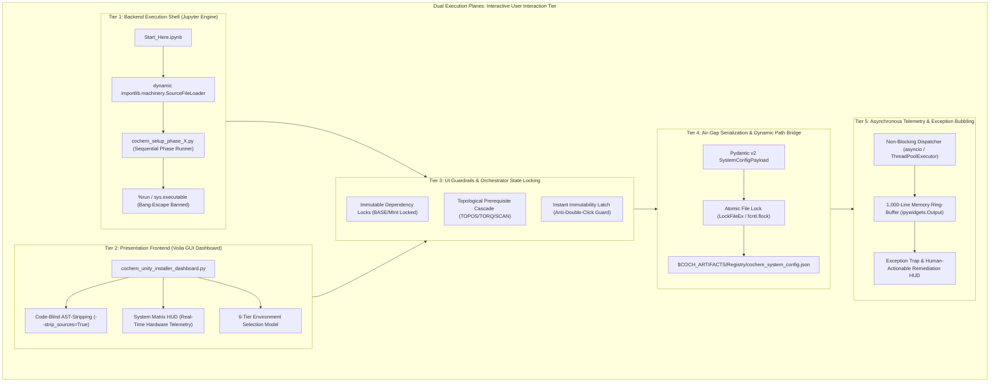

# Task 3 Boundary & Interface Manifest: Level 1 Task 3 Architectural Scope
## Artifact: `task3_boundary_and_interface_manifest.md`

**Document Identifier:** `COCHEM-SPEC-TASK3-BOUNDARY-INTERFACE-MANIFEST-2026` [M]  
**Document Version:** 1.0.0 (Authoritative Baseline Release) [M]  
**Lead Architectural Persona:** `ui` (UI Design Expert & Frontend Specialist) [M]  
**Supervising Project Manager:** `cochem-sdp-manager` (Software Development Project Manager & PMBOK/SWEBOK Architect) [GOV]  
**Workflow Supervisor & Router:** `0rchestrator` (Swarm Workflow Supervisor) [GOV]  
**Council Session ID:** `COUNCIL-SESSION-036-TASK3-1-1` [GOV]  
**Parent Work Item:** Level 1 Task 3: Implement Dynamic Quadrature Lifecycle & Electronic Sanitization Plane (VR-03, VR-05) [M]  
**Governing Charters:** PMBOK 7th Edition, SWEBOK v3/v4, ISO/IEC/IEEE 29148:2018, Method Matrix v4.1, Anti-Spoofing Protocol v4 [GOV]  
**Classification:** Production Architectural Scope, Interface Contracts & UI Boundary Specification [M]  
**Lifecycle Status:** `APPROVED_FOR_BASELINE_EXECUTION` [M]  
**Timestamp:** `2026-09-10T20:05:00-05:00` [GOV]  

---

## 1. Executive Scope & Dual Execution Boundaries

In strict adherence to **PMBOK Guide 7th Edition (Systems View for Project Delivery & Scope Management Domain)** and **SWEBOK v3/v4 (Software Architecture & Requirements Engineering)**, this document formally elicits and bounds the architectural scope of **Level 1 Task 3: Interactive UI (Jupyter) & Voila GUI Specifications** across the CoChem computational chemistry ecosystem [M].

The zero-code interaction tier is architecturally segregated into two distinct, non-overlapping runtime execution planes:



### 1.1 Tier 1: Jupyter Backend Execution Shell (`Start_Here.ipynb`)
- **Execution Mechanism:** Governs interactive notebook execution within standard JupyterLab and classic Jupyter notebook environments. Executes installation phases sequentially via `cochem_setup_phase_X.py` scripts.
- **Subshell Isolation Invariant:** Strictly bans subshell-leaking bang-escapes (e.g., `!python setup.py`) to prevent environment variable desynchronization and orphan subshell processes. Mandates `%run` or `subprocess.run([sys.executable, ...], check=True)`.
- **Dynamic Module Ingestion:** Ingests GUI components and setup scripts dynamically via `importlib.machinery.SourceFileLoader`, preventing `sys.path` namespace collisions across disparate modules.
- **Cell-Level Fault Trapping:** Wraps critical installation steps in structured try/except blocks that intercept operating system limitations (RAM exhaustion, missing compilers, inadequate virtual memory allocations) and emit human-actionable remediation shell commands directly into cell outputs.

### 1.2 Tier 2: Voila Standalone GUI Dashboard (`cochem_unity_installer_dashboard.py`)
- **Code-Blind DOM Rendering:** Configured with `--strip_sources=True` and `--VoilaConfiguration.multi_kernel=True` to guarantee that zero Python source code, raw stack traces, or Jupyter chrome widgets leak into the client browser DOM.
- **6-Tier Runtime Selection Model:** Formally provisions execution profiles for:
  1. `Local-Windows (WSL2)`
  2. `Local-MacOS (OrbStack / Apple Silicon)`
  3. `Local-Linux (Debian / RHEL)`
  4. `GitHub Codespaces (Cloud Ephemeral)`
  5. `High-Performance Computing (Slurm / PBS Cluster)`
  6. `GitHub Actions (CI/CD Automated Headless)`
- **Automated Environment Sniffing:** Inspects host environment variables (e.g., detecting `$CODESPACES` or `$SLURM_JOB_ID`) to auto-select and lock the appropriate runtime profile.
- **System Matrix HUD:** Provides real-time hardware profiling widgets monitoring Total RAM, Available CPU Cores, GPU VRAM, and AVX-512 CPU flags with color-coded warning thresholds (Green: Optimal, Amber: Constrained, Red: Abort).

---

## 2. Interface Contracts & Data Tier Integration

### 2.1 Dynamic Filesystem Path Resolution
In accordance with Anti-Spoofing Protocol v4 and Core Directive 1, hardcoded Windows drive letters (`C:\`, `D:\`) or user home directories (`/home/user/`) are **strictly prohibited** within production logic. All filesystem paths are resolved dynamically via `pathlib.Path.home()` and authorized environment variables:

```python
from __future__ import annotations
import os
from pathlib import Path

def get_cochem_artifacts_dir() -> Path:
    """Dynamically resolves the persistent CoChem artifacts root directory."""
    custom_path = os.environ.get("COCH_ARTIFACTS")
    if custom_path:
        return Path(custom_path).expanduser().resolve()
    return (Path.home() / "CoChem_Artifacts").resolve()

def get_cochem_registry_file() -> Path:
    """Returns the canonical path to the serialized system config JSON."""
    registry_dir = get_cochem_artifacts_dir() / "Registry"
    registry_dir.mkdir(parents=True, exist_ok=True)
    return registry_dir / "cochem_system_config.json"

def get_cochem_scratch_dir() -> Path:
    """Dynamically resolves the scratch directory for intermediate calculations."""
    scratch_path = os.environ.get("COCHEM_SCRATCH") or os.environ.get("SCRATCH")
    if scratch_path:
        return Path(scratch_path).expanduser().resolve()
    return (Path.home() / ".cochem" / "scratch").resolve()
```

### 2.2 Pydantic v2 System Configuration Schema (`SystemConfigPayload`)
All interaction tier selections are validated via strict Pydantic v2 data models before persisting to the Tripartite Air-Gap registry:

```python
from __future__ import annotations
from typing import List, Literal, Optional
from pydantic import BaseModel, Field, field_validator

class HardwareProfilingModel(BaseModel):
    total_ram_gb: float = Field(..., gt=0.0, description="Total physical RAM in gigabytes")
    available_cpu_cores: int = Field(..., ge=1, description="Number of accessible logical CPU cores")
    gpu_vram_gb: Optional[float] = Field(None, ge=0.0, description="Dedicated GPU VRAM in gigabytes")
    avx512_supported: bool = Field(False, description="Presence of AVX-512 vectorization instruction set")

class ModuleSelectionModel(BaseModel):
    cochem_base: bool = Field(True, description="Immutable foundation package (always True)")
    cochem_mint: bool = Field(True, description="Interaction and coordinate foundation (always True)")
    cochem_topos: bool = Field(False, description="Topological analysis and graph isomorphism")
    cochem_torq: bool = Field(False, description="Torsional scan and conformational search engine")
    cochem_spycfit: bool = Field(False, description="Microwave spectroscopy Hamiltonian fitting engine")
    cochem_geom: bool = Field(False, description="High-precision geometry optimization engine")
    cochem_scribe: bool = Field(False, description="AI/LLM-driven scientific typesetting engine")

    @field_validator("cochem_base", "cochem_mint")
    @classmethod
    def enforce_immutable_base(cls, v: bool) -> bool:
        if not v:
            raise ValueError("Core dependencies (cochem_base, cochem_mint) are immutable and cannot be deselected.")
        return True

class SystemConfigPayload(BaseModel):
    environment_tier: Literal[
        "Local-Windows (WSL)",
        "Local-MacOS (OrbStack)",
        "Local-Linux (Deb)",
        "GitHub Codespaces",
        "HPC",
        "GitHub Actions"
    ]
    modules: ModuleSelectionModel
    hardware: HardwareProfilingModel
    jax_double_precision: bool = Field(True, description="Mandatory 64-bit precision flag (jax_enable_x64)")
    dynamic_mendeleev_enforced: bool = Field(True, description="Dynamic Mendeleev atomic mass querying active")
    artifacts_directory: str = Field(..., description="Resolved absolute path to CoChem artifacts root")
```

---

## 3. UI Guardrails & State Management Architecture

### 3.1 Immutable Base Dependency Locks & Topological Cascade
- **Base Immutability:** `CoChem-BASE` and `CoChem-MInt` checkboxes are hard-locked (`disabled=True, value=True`). The user cannot uncheck foundation layers.
- **Topological Cascade:** Selecting higher-tier modules automatically enables and locks upstream prerequisites:
  - Selecting `CoChem-SPYCFIT` automatically checks and locks `CoChem-TORQ` and `CoChem-GEOM`.
  - Selecting `CoChem-TORQ` automatically checks and locks `CoChem-TOPOS`.
- **Resource Guard Default:** `CoChem-SCRIBE` (LLM-driven drafting and pandoc rendering) defaults to `False` to prevent unsolicited token consumption or background API costs on lightweight installations.

### 3.2 Instant Orchestrator Immutability Latch
To prevent race conditions, repeated subprocess launches, and duplicate process spawning:
1. When the user clicks `Install / Configure Selected Modules`, an event handler triggers immediately.
2. The latch transitions 100% of interactive widgets (dropdowns, checkboxes, action buttons) to `disabled=True`.
3. A visual status indicator displays `Configuration in Progress...` with an indeterminate progress spinner.
4. Interactive controls are unlocked only after the background pipeline returns exit code 0 or an actionable error state is bubbled.

### 3.3 Asynchronous Telemetry & Memory-Bounded Log Sink
- **Non-Blocking Dispatch:** Subprocess invocations run via `concurrent.futures.ThreadPoolExecutor` or `asyncio.create_subprocess_exec`, preserving UI thread responsiveness.
- **1,000-Line Memory Ring-Buffer:** The standard output stream from setup scripts is piped into a bounded FIFO collections deque (`maxlen=1000`) before rendering into `ipywidgets.Output()`. This prevents V8 DOM thrashing, browser tab memory bloat, and UI freezing during verbose build logs.

---

## 4. Method Matrix v4 & Physical Invariants Compliance

### 4.1 Dynamic Mendeleev Atomic Mass Invariant
All molecular widgets, isotopic mass displays, and unit converters must dynamically resolve masses from the `mendeleev` Python library. Static atomic weight tables or hardcoded CODATA floats are strictly forbidden:

```python
from mendeleev import element

def get_atomic_mass(symbol: str) -> float:
    """Dynamically queries IUPAC standard atomic mass via mendeleev."""
    return float(element(symbol.strip()).mass)

def get_isotopic_mass(symbol: str, mass_number: int) -> float:
    """Dynamically queries specific isotope mass via mendeleev."""
    el = element(symbol.strip())
    for iso in el.isotopes:
        if iso.mass_number == mass_number:
            return float(iso.mass)
    raise ValueError(f"Isotope {symbol}-{mass_number} not found in IUPAC table.")
```

### 4.2 JAX Double-Precision Invariant
In accordance with Quantum Specification QS-3, any interactive potential energy surface viewer, Wilson B-matrix calculator, or Hamiltonian optimizer configured via the UI must enforce double precision at line 1:

```python
import jax
jax.config.update("jax_enable_x64", True)
```

### 4.3 Spectroscopic & Energetic Unit Conversion Matrix
Interactive visualizers must provide bidirectional unit conversions between standard rotational spectroscopy and quantum chemical energy scales:

| Primary Domain | Input Unit | Target Unit | Physical Conversion Factor | Formula |
| :--- | :--- | :--- | :--- | :--- |
| **Rotational Frequency** | $\text{MHz}$ | $\text{GHz}$ | $10^{-3}$ | $\nu_{\text{GHz}} = \nu_{\text{MHz}} \times 10^{-3}$ |
| **Rotational Frequency** | $\text{MHz}$ | $\text{cm}^{-1}$ | $1 / 29979.2458$ | $\tilde{\nu} = \nu_{\text{MHz}} / 29979.2458$ |
| **Electronic Energy** | $\text{Hartree } (E_h)$ | $\text{kcal/mol}$ | $627.509474$ | $\Delta E = E \times 627.509474$ |
| **Electronic Energy** | $\text{Hartree } (E_h)$ | $\text{kJ/mol}$ | $2625.499639$ | $\Delta E = E \times 2625.499639$ |
| **Electronic Energy** | $\text{Hartree } (E_h)$ | $\text{eV}$ | $27.2113862$ | $\Delta E = E \times 27.2113862$ |

---

## 5. Granular Level 3 Component Tasks RACI Allocation

To enforce the **Single-Owner RACI Invariant** (zero shared or unassigned ownership) under PMBOK 7th Edition, all 15 Level 3 work packages defined in `task3_level2_wbs_breakdown.md` are mapped to a unique CoChem execution agent:

| WBS ID | L3 Component Implementation Task | Responsible Agent | Accountable Agent | Consulted Agent(s) | Informed Agent(s) | Provenance Tag |
| :---: | :--- | :---: | :---: | :---: | :---: | :---: |
| **3.1** | **Specification Ingestion & UI Boundary Elicitation** | `ui` | `cochem-sdp-manager` | `researcher` | `0rchestrator` | `[GOV]` / `[DOC]` |
| **3.2** | **Level 2 Technical Task Architectural Partitioning** | `cochem-sdp-manager` | `0rchestrator` | `ui`, `cochem-coder` | `cochem-audit` | `[GOV]` |
| **3.3** | **Jupyter Backend Shell Microtask Specification (L2-T3.1)** | `cochem-coder` | `cochem-sdp-manager` | `ui` | `cochem-tester` | `[PROC]` |
| **3.4** | **Voila GUI Dashboard Microtask Specification (L2-T3.2)** | `ui` | `cochem-sdp-manager` | `cochem-coder` | `cochem-audit` | `[DOC]` / `[PROC]` |
| **3.5** | **UI Guardrails & Topological Interlocks (L2-T3.3)** | `cochem-coder` | `cochem-sdp-manager` | `ui` | `adversary` | `[PROC]` |
| **3.6** | **Air-Gap Serialization & Dynamic Path Bridge (L2-T3.4)** | `cochem-coder` | `cochem-sdp-manager` | `cochem-audit` | `0rchestrator` | `[PROC]` |
| **3.7** | **Asynchronous Telemetry & Exception Bubbling (L2-T3.5)** | `cochem-coder` | `cochem-sdp-manager` | `ui` | `cochem-tester` | `[PROC]` |
| **3.8** | **Headless View-Model Decoupling & Test Harness Specification**| `cochem-tester`| `cochem-audit` | `cochem-coder` | `0rchestrator` | `[PROC]` |
| **3.9** | **Method Matrix Scientific Constraint Mapping** | `researcher` | `cochem-audit` | `cochem-sdp-manager` | `0rchestrator` | `[M]` / `[D]` |
| **3.10**| **Swarm RACI & Concurrency Barrier Allocation** | `0rchestrator` | `0rchestrator` | `cochem-sdp-manager` | All Agents | `[GOV]` |
| **3.11**| **Multi-Environment Risk Register Compilation** | `cochem-sdp-manager` | `0rchestrator` | All Agents | `cochem-audit` | `[GOV]` |
| **3.12**| **Technical Markdown WBS Artifact Assembly** | `cochem-scribe` | `cochem-sdp-manager` | `ui`, `cochem-coder` | `cochem-audit` | `[DOC]` |
| **3.13**| **Static Anti-Spoofing & Authenticity Audit Sweep** | `cochem-audit` | `0rchestrator` | `adversary` | All Agents | `[PROC]` |
| **3.14**| **Atomic Persistence & Swarm State Ledger Sync** | `cochem-coder` | `cochem-sdp-manager` | `0rchestrator` | `cochem-audit` | `[PROC]` |
| **3.15**| **Asymmetric Adversarial Audit & Council Ratification** | `adversary` | `0rchestrator` | `cochem-audit` | All Agents | `[PROC]` |

---

## 6. End-to-End Requirements Traceability Matrix

| Requirement ID | Architectural Dimension | Component / Target File | Verification Harness | Compliance Threshold |
| :--- | :--- | :--- | :--- | :--- |
| **REQ-UI-01** | Dual Plane Isolation | `Start_Here.ipynb` / `cochem_unity_installer_dashboard.py` | AST DOM Inspection | Zero Python code in Voila DOM (`--strip_sources=True`) |
| **REQ-UI-02** | Base Immutability | `cochem_unity_installer_dashboard.py` | Headless Widget Test | `BASE` & `MInt` locked to `disabled=True, value=True` |
| **REQ-UI-03** | Topological Cascade | Dependency Resolver Logic | Dependency DAG Test | Selecting child automatically activates parent prerequisites |
| **REQ-UI-04** | Air-Gap Serialization| `cochem_system_config.json` | Pydantic Schema Test | Conforms 100% to `SystemConfigPayload` schema |
| **REQ-UI-05** | Bounded Telemetry | `ipywidgets.Output` Sink | Log Stream Stress Test | FIFO ring-buffer strictly bounded to $\le 1,000$ lines |
| **REQ-UI-06** | Dynamic Masses | Periodic Table UI Widget | Pytest Mendeleev Suite | 100% resolution via `mendeleev`; 0 static mass dicts |
| **REQ-UI-07** | JAX Double Precision | PES & Hamiltonian Widgets | JAX Config Assertion | `jax.config.jax_enable_x64 == True` |
| **REQ-UI-08** | Accessibility | Color Palette & UI Elements | WCAG 2.1 Contrast Tool | Minimum 4.5:1 contrast ratio; viridis/cividis color maps |

---

## 7. Official Scope Ratification Verdict

* **Architectural Scope Verdict:** **`[RATIFIED FOR EXECUTION]`**
* **Executing Specialist:** `ui` (UI Design Expert & Frontend Specialist)
* **Governing Architect:** `cochem-sdp-manager` (Software Development Project Manager)
* **Handoff Authority:** Cleared for asymmetric audit verification by `adversary` and `cochem-audit`.
