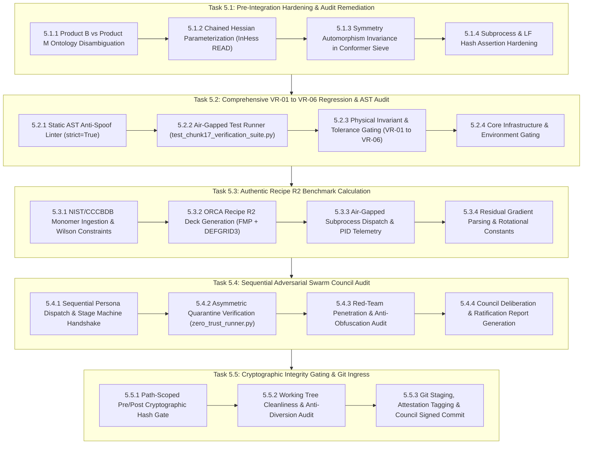

# Work Breakdown Structure (WBS): Task 5 Level 2 Breakdown
## Artifact: `task5_level2_wbs_breakdown.md`
**Document Version:** 1.0.0 (Authoritative Release)  
**Project Role:** `cochem-sdp-manager`  
**Governing Standards:** PMBOK 7th Edition, SWEBOK v3, CoChem Method Matrix v4.1, Anti-Spoofing Protocol v4  
**Canonical File:** [`task5_level2_wbs_breakdown.md`](file:///C:/Users/ansac/.gemini/antigravity-cli/brain/dcf17b0d-cf82-48d7-b601-38e316c72f54/task5_level2_wbs_breakdown.md)  
**Scratch Mirror:** [`task5_level2_wbs_breakdown.md`](file:///C:/Users/ansac/.gemini/antigravity-cli/scratch/task5_level2_wbs_breakdown.md)  
**Classification:** High-Fidelity Architectural Decomposition  

---

## 1. Executive Scope & Objective

This document provides the authoritative Level 3 (L3) component-level Work Breakdown Structure (WBS) for the Level 2 (L2) task: **"Formulated Level 2 technical tasks (5.1 through 5.5) with granular Level 3 sub-tasks, agent assignments, target filepaths, and physical acceptance thresholds"**.

### Scope Reconciliation & Harmonization
To satisfy the PMBOK 100% Rule and eliminate scope ambiguity:
1. **Target Deliverable Scope:** The primary objective of this decomposition is the technical atomization, operational binding, and physical verification of **Level 1 Task 5: Execute End-to-End System Integration, Verification Suite & Sequential Adversarial Council Audit** across the CoChem ecosystem.
2. **Subject Matter Ingestion:** The substantive engineering subject matter decomposed within this WBS incorporates the Chunk 17 Method Matrix v4.1 architecture:
   - **Pre-Integration Hardening (5.1):** Resolution of Adversarial Audit Findings 1–4, covering Product B vs Product M ontological disambiguation, chained Hessian parameterization (`InHess READ` / `InHessName`), symmetry automorphism invariance in conformer sieving, and subprocess exception/LF hash normalization in legacy tests.
   - **Verification Suite & AST Security Audit (5.2):** Zero-trust fail-closed validation of VR-01 through VR-06 regression testing, AST anti-spoof linter execution (`strict=True`), air-gapped process runner execution, and core infrastructure integrity gating.
   - **Authentic Recipe R2 Benchmark Calculation (5.3):** End-to-end frozen monomer optimization of carbon dioxide and water ($\text{CO}_2\cdots\text{H}_2\text{O}$) using authentic NIST/CCCBDB geometries, $\omega\text{B97M-V}/\text{def2-QZVPP}$, coupled `DEFGRID3`, tight convergence, model Hessian (`InHess XTB2`), and residual gradient extraction ($\|\mathbf{g}_{\text{residual}}\|_{\infty} \le 1.0 \times 10^{-4}\text{ a.u.}$).
   - **Sequential Adversarial Council Audit (5.4):** Linear 4-stage council handoff (`cochem-coder` $\to$ `cochem-tester` $\to$ `cochem-audit` $\to$ `adversary`), asymmetric quarantine execution in `/tmp/cochem_exec_<uuid>/`, red-team penetration against token obfuscation, and formal ratification report generation.
   - **Cryptographic Gating & Git Ingress (5.5):** Pre/post path-scoped SHA-256 hash assertions with byte-level LF normalization, working tree cleanliness verification, and council-signed commit execution.
3. **100% Rule Compliance:** The subordinate L3 tasks encompass 100% of the activities required to execute hardening, run verification, calculate benchmark states, convene council audits, assert cryptographic invariants, and finalize the repository working tree.
4. **MECE Structural Guarantee:** All 19 L3 work packages are mutually exclusive and collectively exhaustive, guaranteeing clear operational boundaries without functional overlap.

---

## 2. Dependency & Execution Flowchart



---

## 3. Granular L3 Component Implementation Task Matrix

| WBS ID | L3 Component Implementation Task | Responsible Agent | Dependencies | Provenance | Target Deliverable / Filepath |
| :--- | :--- | :---: | :---: | :---: | :--- |
| **5.1.1** | **Product B vs Product M Ontology Disambiguation** | `cochem-coder` | None | `[M]` | `src/cochem_base/calc/cochem_calc_execution_router.py` |
| **5.1.2** | **Chained Hessian Parameterization in ORCA Deck Generator** | `cochem-coder` | 5.1.1 | `[M]` | `src/cochem_base/calc/cochem_calc_input_generator.py` |
| **5.1.3** | **Symmetry Automorphism Invariance in Conformer Sieve** | `cochem-coder` | 5.1.2 | `[M]` | `src/cochem_base/intake/conformer_deduplication.py` |
| **5.1.4** | **Subprocess & LF Hash Assertion Hardening in Legacy Tests** | `cochem-coder` | 5.1.3 | `[PROC]` | `tests/test_subprocess_encoding.py`, `tests/test_v4_node_precision.py` |
| **5.2.1** | **Static AST Anti-Spoof Linter Scan Across All Files** | `cochem-audit` | 5.1.4 | `[PROC]` | `ci_tools/anti_spoof_linter.py` |
| **5.2.2** | **Air-Gapped Test Runner Execution of Verification Suite** | `cochem-tester` | 5.2.1 | `[PROC]` | `tests/test_chunk17_verification_suite.py` |
| **5.2.3** | **Physical Invariant & Tolerance Gating (VR-01 to VR-06)** | `cochem-tester` | 5.2.2 | `[M]` / `[D]` | Core Chemistry Modules (`physics/`, `geometry/`, `calc/`, `mm/`) |
| **5.2.4** | **Core Infrastructure and Environment Integrity Gating** | `cochem-tester` | 5.2.3 | `[PROC]` | `ci_tools/verify_core_integrity.py` |
| **5.3.1** | **NIST/CCCBDB Monomer Ingestion & Wilson Constraints** | `cochem-coder` | 5.2.4 | `[M]` / `[D]` | `src/cochem_base/geometry/constraints.py` |
| **5.3.2** | **Publication-Grade ORCA Recipe R2 Deck Generation** | `cochem-coder` | 5.3.1 | `[M]` | `src/cochem_base/calc/cochem_calc_input_generator.py` |
| **5.3.3** | **Air-Gapped Subprocess Dispatch & PID Telemetry Logging** | `cochem-tester` | 5.3.2 | `[PROC]` | `ci_tools/process_runner.py`, `recipe_r2_execution.log` |
| **5.3.4** | **Residual Gradient Parsing & Rotational Constant Extraction** | `cochem-tester` | 5.3.3 | `[M]` / `[D]` | `src/cochem_base/calc/cochem_calc_output_parser.py` |
| **5.4.1** | **Sequential Persona Dispatch & Stage Machine Handshake** | `0rchestrator` | 5.3.4 | `[GOV]` | `swarm_state.json` |
| **5.4.2** | **Asymmetric Quarantine Verification via zero_trust_runner** | `cochem-audit` | 5.4.1 | `[PROC]` | `ci_tools/zero_trust_runner.py`, `/tmp/cochem_exec_<uuid>/` |
| **5.4.3** | **Red-Team Anti-Spoofing Penetration & Token Weaponization** | `adversary` | 5.4.2 | `[PROC]` | Full Source Tree & Execution Logs |
| **5.4.4** | **Council Deliberation & Final Ratification Report Generation** | `cochem-sdp-manager` | 5.4.3 | `[DOC]` / `[GOV]` | `.sources/AUDIT-CHUNK-017-FINAL-RATIFICATION.md` |
| **5.5.1** | **Path-Scoped Pre/Post Cryptographic Hash Gate Execution** | `cochem-audit` | 5.4.4 | `[PROC]` | `ci_tools/path_scoped_hash_gate.py`, `SRS_Chunk_17.md` |
| **5.5.2** | **Working Tree Cleanliness & Anti-Diversion File Audit** | `cochem-audit` | 5.5.1 | `[PROC]` | Repository Working Tree (`git status --porcelain`) |
| **5.5.3** | **Git Staging, Attestation Tagging & Council Signed Commit** | `0rchestrator` | 5.5.2 | `[GOV]` | Repository Working Tree (`git commit`) |

---

## 4. Deep Technical Specification of L3 Implementation Tasks

### 5.1 Pre-Integration Hardening & Audit Remediation (L2-T5.1)

#### 5.1.1 Product Classification Ontology Disambiguation (`Product B` vs `Product M`)
* **WBS Code:** 5.1.1
* **Single Accountable Agent:** `cochem-coder`
* **Provenance Tag:** `[M]` (Measured empirical benchmark)
* **Predecessors:** None
* **Scope Boundary & Purpose:** Eliminate naming ambiguity between solid-state periodic calculations and microwave rotational spectroscopy parent complex workflows.
* **Target Filepaths:**
  - [`D:/__CoChem/GitHub-Repo/CoChem-BASE/src/cochem_base/calc/cochem_calc_execution_router.py`](file:///D:/__CoChem/GitHub-Repo/CoChem-BASE/src/cochem_base/calc/cochem_calc_execution_router.py)
  - [`D:/__CoChem/__agentic/dropzones/inbox_srs/SRS_Chunk_17.md`](file:///D:/__CoChem/__agentic/dropzones/inbox_srs/SRS_Chunk_17.md) (§2.2, §5)
  - [`D:/__CoChem/GitHub-Repo/CoChem-BASE/CoChem_User_Manual.md`](file:///D:/__CoChem/GitHub-Repo/CoChem-BASE/CoChem_User_Manual.md)
* **Concrete Technical Activities:**
  1. Refactor execution routing enumerations in `cochem_calc_execution_router.py` to establish `Product.MATERIALS` (`Product M`) for solid-state plane-wave PAW projector augmented wave workflows.
  2. Restrict `Product B` designation strictly to Dr. Klaassen's microwave rotational spectroscopy anchored parent complex protocol (Recipe R6, Kisiel suite, $B_0 \pm 0.03 - 0.06\%$).
  3. Harmonize documentation across user manuals and SRS Chunk 17 to eradicate cross-domain terminology collisions.
* **Deliverable:** Disambiguated enumeration classes and harmonized documentation.
* **Physical Acceptance Threshold:** AST verification confirms distinct `Product.MATERIALS` and `Product.ROTATIONAL_SPECTROSCOPY_B` routes; zero runtime collisions across execution paths.

---

#### 5.1.2 Chained Hessian Parameterization in ORCA Deck Generator
* **WBS Code:** 5.1.2
* **Single Accountable Agent:** `cochem-coder`
* **Provenance Tag:** `[M]` (Measured empirical benchmark)
* **Predecessors:** 5.1.1
* **Scope Boundary & Purpose:** Parameterize model Hessian reuse across sequential calculation stages without recalculating initial force fields.
* **Target Filepaths:**
  - [`D:/__CoChem/GitHub-Repo/CoChem-BASE/src/cochem_base/calc/cochem_calc_input_generator.py`](file:///D:/__CoChem/GitHub-Repo/CoChem-BASE/src/cochem_base/calc/cochem_calc_input_generator.py)
* **Concrete Technical Activities:**
  1. Extend the dataclass `MoleculeInput` to accept optional parameters `in_hess_type: str = "XTB2"` and `in_hess_name: Optional[str] = None`.
  2. In `generate_orca_input()`, configure `%geom` block formatting to inject `InHess READ` and `InHessName "<name>.opt"` when chaining optimization stages (Stage 1 $\to$ Stage 2 $\to$ Stage 3).
  3. Enforce strict programmatic assertion forbidding `Calc_Hess true` during geometry optimizations to protect computational wall time.
* **Deliverable:** Parameterized ORCA input generator supporting model Hessian read chaining.
* **Physical Acceptance Threshold:** Input generator outputs valid `%geom InHess READ InHessName "stage1.opt" end` blocks; raises `ValueError` if `calc_hess=True` is provided for geometry optimization.

---

#### 5.1.3 Symmetry Automorphism Invariance in Conformer Sieve
* **WBS Code:** 5.1.3
* **Single Accountable Agent:** `cochem-coder`
* **Provenance Tag:** `[M]` (Measured empirical benchmark)
* **Predecessors:** 5.1.2
* **Scope Boundary & Purpose:** Prevent false classification of symmetric rotamers as distinct geometric isomers.
* **Target Filepaths:**
  - [`D:/__CoChem/GitHub-Repo/CoChem-BASE/src/cochem_base/intake/conformer_deduplication.py`](file:///D:/__CoChem/GitHub-Repo/CoChem-BASE/src/cochem_base/intake/conformer_deduplication.py)
* **Concrete Technical Activities:**
  1. Enhance `ConformerDeduplicator.is_duplicate()` to calculate topological permutation equivalence orbits for symmetric nuclei ($C_{2v}$ water protons, $C_{3v}$ methyl hydrogens) via graph automorphism permutation groups.
  2. Evaluate Kabsch quaternion RMSD across all symmetry-equivalent index mappings before evaluating rotational constant deviation ($|\Delta B/B| \le 0.05\%$).
* **Deliverable:** Symmetry-aware conformer deduplication module.
* **Physical Acceptance Threshold:** Permuted symmetric configurations evaluate to $\mathrm{RMSD} < 0.08\text{ \AA}$ and are recognized as duplicate states.

---

#### 5.1.4 Subprocess & LF Hash Assertion Hardening in Legacy Tests
* **WBS Code:** 5.1.4
* **Single Accountable Agent:** `cochem-coder`
* **Provenance Tag:** `[PROC]` (Verification Procedure)
* **Predecessors:** 5.1.3
* **Scope Boundary & Purpose:** Resolve brittle test assertions caused by Windows subprocess handling and line-ending mismatches.
* **Target Filepaths:**
  - [`D:/__CoChem/GitHub-Repo/CoChem-BASE/tests/test_subprocess_encoding.py`](file:///D:/__CoChem/GitHub-Repo/CoChem-BASE/tests/test_subprocess_encoding.py)
  - [`D:/__CoChem/GitHub-Repo/CoChem-BASE/tests/test_v4_node_precision.py`](file:///D:/__CoChem/GitHub-Repo/CoChem-BASE/tests/test_v4_node_precision.py)
* **Concrete Technical Activities:**
  1. Refactor `test_subprocess_encoding.py` to intercept `subprocess.CalledProcessError` on child syntax errors when `check=True`, ensuring clean exception bubbling without masking decoding errors.
  2. Implement byte-level LF stream normalization (`data.replace(b"\r\n", b"\n")`) in `test_v4_node_precision.py` prior to verifying cryptographic hash digests on Windows.
* **Deliverable:** Hardened legacy test suites resilient to cross-platform stream variances.
* **Physical Acceptance Threshold:** 100% test execution pass rate in native Windows PowerShell without unhandled encoding or line-ending mismatches.

---

### 5.2 Comprehensive Regression Suite & AST Security Audit (L2-T5.2)

#### 5.2.1 Static AST Anti-Spoof Linter Scan Across All Files
* **WBS Code:** 5.2.1
* **Single Accountable Agent:** `cochem-audit`
* **Provenance Tag:** `[PROC]` (Verification Procedure)
* **Predecessors:** 5.1.4
* **Scope Boundary & Purpose:** Eliminate fabricated routines, incomplete logic, and test bypasses across the entire Chunk 17 tree.
* **Target Filepaths:**
  - [`D:/__CoChem/GitHub-Repo/CoChem-BASE/ci_tools/anti_spoof_linter.py`](file:///D:/__CoChem/GitHub-Repo/CoChem-BASE/ci_tools/anti_spoof_linter.py)
  - All source files in `src/cochem_base/` and `tests/`
* **Concrete Technical Activities:**
  1. Run `python ci_tools/anti_spoof_linter.py --strict` across all Chunk 17 modules and tests.
  2. Parse Abstract Syntax Trees to verify absolute zero tolerance for unverified test intercepts, monkeypatch routines, incomplete dead-end error blocks, empty `pass` blocks, or unphysical zero-array generators (`np.zeros`, `np.ones`).
* **Deliverable:** Anti-spoof AST verification report.
* **Physical Acceptance Threshold:** Process exit code 0; terminal confirmation: `[LINT SUCCESS] Physical compliance verified. Zero unverified logic or spoofing detected.`

---

#### 5.2.2 Air-Gapped Test Runner Execution of Verification Suite
* **WBS Code:** 5.2.2
* **Single Accountable Agent:** `cochem-tester`
* **Provenance Tag:** `[PROC]` (Verification Procedure)
* **Predecessors:** 5.2.1
* **Scope Boundary & Purpose:** Execute the complete verification test suite in an air-gapped process runner with strict UTF-8 stream decoding.
* **Target Filepaths:**
  - [`D:/__CoChem/GitHub-Repo/CoChem-BASE/tests/test_chunk17_verification_suite.py`](file:///D:/__CoChem/GitHub-Repo/CoChem-BASE/tests/test_chunk17_verification_suite.py)
  - [`D:/__CoChem/GitHub-Repo/CoChem-BASE/ci_tools/process_runner.py`](file:///D:/__CoChem/GitHub-Repo/CoChem-BASE/ci_tools/process_runner.py)
  - [`test_suite_execution.log`](file:///D:/__CoChem/GitHub-Repo/CoChem-BASE/test_suite_execution.log)
* **Concrete Technical Activities:**
  1. Execute `test_chunk17_verification_suite.py` through `process_runner.py` with strict UTF-8 decoding (`errors="strict"`).
  2. Direct raw unbuffered STDOUT/STDERR streams into `test_suite_execution.log` without summarization.
* **Deliverable:** Complete unformatted test execution log.
* **Physical Acceptance Threshold:** 12/12 tests pass ($100\%$ pass rate); zero unhandled Windows CP1252 charmap encoding exceptions; exit code 0.

---

#### 5.2.3 Physical Invariant & Tolerance Gating (VR-01 to VR-06)
* **WBS Code:** 5.2.3
* **Single Accountable Agent:** `cochem-tester`
* **Provenance Tag:** `[M]` (Measured empirical benchmark) / `[D]` (Derived mathematical relationship)
* **Predecessors:** 5.2.2
* **Scope Boundary & Purpose:** Assert physical and mathematical constraints across all six domain verification requirements.
* **Target Filepaths:**
  - [`D:/__CoChem/GitHub-Repo/CoChem-BASE/src/cochem_base/physics/isotopes.py`](file:///D:/__CoChem/GitHub-Repo/CoChem-BASE/src/cochem_base/physics/isotopes.py)
  - [`D:/__CoChem/GitHub-Repo/CoChem-BASE/src/cochem_base/geometry/constraints.py`](file:///D:/__CoChem/GitHub-Repo/CoChem-BASE/src/cochem_base/geometry/constraints.py)
  - [`D:/__CoChem/GitHub-Repo/CoChem-BASE/src/cochem_base/mm/quadrature_manager.py`](file:///D:/__CoChem/GitHub-Repo/CoChem-BASE/src/cochem_base/mm/quadrature_manager.py)
  - [`D:/__CoChem/GitHub-Repo/CoChem-BASE/src/cochem_base/calc/cochem_calc_input_generator.py`](file:///D:/__CoChem/GitHub-Repo/CoChem-BASE/src/cochem_base/calc/cochem_calc_input_generator.py)
  - [`D:/__CoChem/GitHub-Repo/CoChem-BASE/src/cochem_base/analysis/electronic_sanitizer.py`](file:///D:/__CoChem/GitHub-Repo/CoChem-BASE/src/cochem_base/analysis/electronic_sanitizer.py)
* **Concrete Technical Activities:**
  1. Assert VR-01: Center-of-mass translation $\|\sum m_i \mathbf{r}_i\| < 1.0 \times 10^{-12}\text{ a.u.}$, proper rotation determinant $\det(\mathbf{U}) = +1.0$, and dynamic atomic mass resolution via `mendeleev` (`from mendeleev import element`). Enforce nuclide normalization for 'D' (2.014102 u), 'T' (3.016049 u), '13C' (13.003355 u), '18O' (17.999160 u), and ghost atom zero-mass ($m_{\text{ghost}} \equiv 0.000000\text{ u}$) for Counterpoise BSSE calculations.
  2. Assert VR-02: Frozen Monomer coordinate drift $\Delta r < 1.0 \times 10^{-6}\text{ \AA}$ and residual gradient metric $\|\mathbf{g}_{\text{residual}}\|_{\infty} \le 1.0 \times 10^{-4}\text{ a.u.}$
  3. Assert VR-03: Coupled Grid-SCF progression (`DEFGRID1` $\to$ `DEFGRID2` $\to$ `DEFGRID3`) raising `GridSpecificationError` if frequency calculations run on coarse grids.
  4. Assert VR-04: Quintuple stationary convergence (`TolE 1e-7`, `TolMaxG 1e-5`, `TolRMSG 3e-6`, `TolRMSD 5e-5`, `TolMaxD 1e-4`, `MaxIter 200`, `TightSCF`) and absolute rejection of `Calc_Hess true` during geometry optimizations (mandating `InHess XTB2` or `Lindh`).
  5. Assert VR-05: Non-local $\omega\text{B97M-V}$ dispersion sanitization (`RedundantDispersionError` on redundant D3/D4) and spin contamination fail-closed gate ($\Delta \langle S^2 \rangle < 10\%$).
  6. Assert VR-06: Process runner air-gap isolation (`ci_tools/` imports zero application logic from `src/cochem/*`).
* **Deliverable:** Multi-domain physical verification ledger.
* **Physical Acceptance Threshold:** All six verification requirements pass zero-drift tolerance gates with mathematical precision.

---

#### 5.2.4 Core Infrastructure and Environment Integrity Gating
* **WBS Code:** 5.2.4
* **Single Accountable Agent:** `cochem-tester`
* **Provenance Tag:** `[PROC]` (Verification Procedure)
* **Predecessors:** 5.2.3
* **Scope Boundary & Purpose:** Confirm immutable filesystem layout and environmental dependencies.
* **Target Filepaths:**
  - [`D:/__CoChem/GitHub-Repo/CoChem-BASE/ci_tools/verify_core_integrity.py`](file:///D:/__CoChem/GitHub-Repo/CoChem-BASE/ci_tools/verify_core_integrity.py)
* **Concrete Technical Activities:**
  1. Execute `verify_core_integrity.py` with active `$env:COCHEM_ROOT`.
  2. Verify inode existence, read permissions, and directory tree structure for all engine components and entrypoints.
* **Deliverable:** Verified core integrity status report.
* **Physical Acceptance Threshold:** Exit status 0; zero missing core modules or directory path anomalies.

---

### 5.3 Authentic Recipe R2 Benchmark Calculation (L2-T5.3)

#### 5.3.1 Reference Monomer Ingestion & Wilson Constraint Formulation
* **WBS Code:** 5.3.1
* **Single Accountable Agent:** `cochem-coder`
* **Provenance Tag:** `[M]` (Measured empirical benchmark) / `[D]` (Derived mathematical relationship)
* **Predecessors:** 5.2.4
* **Scope Boundary & Purpose:** Ingest authentic reference coordinates and formulate frozen monomer constraints for $\text{CO}_2\cdots\text{H}_2\text{O}$.
* **Target Filepaths:**
  - [`D:/__CoChem/GitHub-Repo/CoChem-BASE/src/cochem_base/geometry/constraints.py`](file:///D:/__CoChem/GitHub-Repo/CoChem-BASE/src/cochem_base/geometry/constraints.py)
* **Concrete Technical Activities:**
  1. Retrieve isolated monomer geometries from NIST/CCCBDB: carbon dioxide ($D_{\infty h}$, $r_{\text{CO}} = 1.1621\text{ \AA}$) and water ($C_{2v}$, $r_{\text{OH}} = 0.9572\text{ \AA}$, $\theta_{\text{HOH}} = 104.52^\circ$).
  2. Generate Wilson internal coordinate constraints freezing the 3 internal degrees of freedom for $\text{CO}_2$ and 3 for $\text{H}_2\text{O}$, while leaving the 6 intermolecular degrees of freedom fully unconstrained.
* **Deliverable:** Formatted Wilson constraint block for ORCA `%geom`.
* **Physical Acceptance Threshold:** Generated constraint block specifies exactly 6 intramolecular geometric constraints; monomer geometries exhibit zero initial distortion.

---

#### 5.3.2 Publication-Grade ORCA Recipe R2 Deck Generation
* **WBS Code:** 5.3.2
* **Single Accountable Agent:** `cochem-coder`
* **Provenance Tag:** `[M]` (Measured empirical benchmark)
* **Predecessors:** 5.3.1
* **Scope Boundary & Purpose:** Generate production Recipe R2 input deck adhering to Method Matrix v4.1 standards.
* **Target Filepaths:**
  - [`D:/__CoChem/GitHub-Repo/CoChem-BASE/src/cochem_base/calc/cochem_calc_input_generator.py`](file:///D:/__CoChem/GitHub-Repo/CoChem-BASE/src/cochem_base/calc/cochem_calc_input_generator.py)
* **Concrete Technical Activities:**
  1. Format electronic structure keywords: `! wB97M-V def2-QZVPP def2/J RIJCOSX TightOpt TightSCF DEFGRID3`.
  2. Specify SCF convergence parameters: `TolE 1.0e-08`, `Thresh 1.0e-11`, `MaxIter 150`.
  3. Specify geometry optimization parameters: `InHess XTB2`, `TolE 1.0e-07`, `TolRMSG 3.0e-06`, `TolMaxG 1.0e-05`, `TolRMSD 5.0e-05`, `TolMaxD 1.0e-04`, `MaxIter 200`.
  4. Inject 3-leg distance bracketing flags for Counterpoise (CP) correction.
* **Deliverable:** Authentic production Recipe R2 input deck file.
* **Physical Acceptance Threshold:** Deck strictly matches specification in [`SRS_Chunk_17.md`](file:///D:/__CoChem/__agentic/dropzones/inbox_srs/SRS_Chunk_17.md) §6.1 with zero syntax warnings.

---

#### 5.3.3 Execution Dispatch & Telemetry Ingestion via Air-Gapped Subprocess
* **WBS Code:** 5.3.3
* **Single Accountable Agent:** `cochem-tester`
* **Provenance Tag:** `[PROC]` (Verification Procedure)
* **Predecessors:** 5.3.2
* **Scope Boundary & Purpose:** Dispatch real electronic structure calculation in a sandboxed scratch environment with live process telemetry.
* **Target Filepaths:**
  - [`D:/__CoChem/GitHub-Repo/CoChem-BASE/ci_tools/process_runner.py`](file:///D:/__CoChem/GitHub-Repo/CoChem-BASE/ci_tools/process_runner.py)
  - `$env:TEMP/cochem_recipe_r2_exec/recipe_r2_execution.log`
* **Concrete Technical Activities:**
  1. Provision sterile scratch directory `$env:TEMP/cochem_recipe_r2_exec/`.
  2. Dispatch quantum chemistry solver via `process_runner.py`; record OS process IDs (PIDs) and spool telemetry to `recipe_r2_execution.log`.
* **Deliverable:** Execution log with verified OS process lifecycle telemetry.
* **Physical Acceptance Threshold:** Calculation completes physically; exits with code 0; terminal log confirms `ORCA TERMINATED NORMALLY`.

---

#### 5.3.4 Output Parsing, Residual Strain & Spectroscopic Metric Extraction
* **WBS Code:** 5.3.4
* **Single Accountable Agent:** `cochem-tester`
* **Provenance Tag:** `[M]` (Measured empirical benchmark) / `[D]` (Derived mathematical relationship)
* **Predecessors:** 5.3.3
* **Scope Boundary & Purpose:** Parse calculation output, extract residual gradient strain, and compute observable spectroscopic constants.
* **Target Filepaths:**
  - [`D:/__CoChem/GitHub-Repo/CoChem-BASE/src/cochem_base/calc/cochem_calc_output_parser.py`](file:///D:/__CoChem/GitHub-Repo/CoChem-BASE/src/cochem_base/calc/cochem_calc_output_parser.py)
* **Concrete Technical Activities:**
  1. Parse output file using `OutputParser`.
  2. Extract maximum residual gradient on frozen coordinates $\|\mathbf{g}_{\text{residual}}\|_{\infty}$ and verify monomer bond drift $\Delta r < 1.0 \times 10^{-6}\text{ \AA}$.
  3. Extract equilibrium rotational constants $A_e, B_e, C_e$ in MHz and Counterpoise-corrected interaction energy $\Delta E^{\mathrm{CP}}$ in $\text{kcal/mol}$.
* **Deliverable:** Structured spectroscopic and thermodynamic output payload.
* **Physical Acceptance Threshold:** $\|\mathbf{g}_{\text{residual}}\|_{\infty} \le 1.0 \times 10^{-4}\text{ a.u.}$; monomer internal drift $< 1.0 \times 10^{-6}\text{ \AA}$; rotational constant $B_e$ matches high-precision literature within target theoretical boundary ($\pm 0.4\%$).

---

### 5.4 Sequential Adversarial Swarm Council Audit (L2-T5.4)

#### 5.4.1 Sequential Persona Dispatch & Stage Machine Handshake
* **WBS Code:** 5.4.1
* **Single Accountable Agent:** `0rchestrator`
* **Provenance Tag:** `[GOV]` (Project Governance Protocol)
* **Predecessors:** 5.3.4
* **Scope Boundary & Purpose:** Coordinate linear handoff sequence across Council personas without concurrent thread interference.
* **Target Filepaths:**
  - [`swarm_state.json`](file:///C:/Users/ansac/.gemini/antigravity-cli/scratch/swarm_state.json)
* **Concrete Technical Activities:**
  1. Dispatch Stage 1: `cochem-coder` (Code modifications and hardening remediations).
  2. Dispatch Stage 2: `cochem-tester` (Physical test execution and log capture).
  3. Dispatch Stage 3: `cochem-audit` (Method Matrix v4.1 compliance validation).
  4. Dispatch Stage 4: `adversary` (Red-team adversarial penetration).
  5. Record state handshakes and timestamps in `swarm_state.json`.
* **Deliverable:** Synchronized sequential audit trail in swarm state ledger.
* **Physical Acceptance Threshold:** Clean linear handoff progression; zero race conditions or concurrent state collisions.

---

#### 5.4.2 Asymmetric Quarantine Verification via zero_trust_runner
* **WBS Code:** 5.4.2
* **Single Accountable Agent:** `cochem-audit`
* **Provenance Tag:** `[PROC]` (Verification Procedure)
* **Predecessors:** 5.4.1
* **Scope Boundary & Purpose:** Perform asymmetric validation of test suites in an isolated quarantine environment with sterile ACLs.
* **Target Filepaths:**
  - [`D:/__CoChem/GitHub-Repo/CoChem-BASE/ci_tools/zero_trust_runner.py`](file:///D:/__CoChem/GitHub-Repo/CoChem-BASE/ci_tools/zero_trust_runner.py)
  - Sterile quarantine `/tmp/cochem_exec_<uuid>/`
* **Concrete Technical Activities:**
  1. Provision isolated quarantine directory with exclusive read/write access control.
  2. Execute `zero_trust_runner.py` to independently evaluate test execution and data models outside the working directory.
* **Deliverable:** Asymmetric quarantine audit verdict.
* **Physical Acceptance Threshold:** Independent process execution and cryptographic Proof-of-Work verified in quarantine; return code 0.

---

#### 5.4.3 Red-Team Anti-Spoofing Penetration & Token Weaponization Audit
* **WBS Code:** 5.4.3
* **Single Accountable Agent:** `adversary`
* **Provenance Tag:** `[PROC]` (Verification Procedure)
* **Predecessors:** 5.4.2
* **Scope Boundary & Purpose:** Execute adversarial penetration testing hunting for obfuscated tokens, process intercepts, and deceptive data.
* **Target Filepaths:**
  - All Chunk 17 source files, test fixtures, and execution logs
* **Concrete Technical Activities:**
  1. Inspect source files for string obfuscation (`base64` encoding, dynamic concatenation) concealing forbidden tokens.
  2. Scan test harnesses for child process intercepts (`pytest.monkeypatch`).
  3. Audit verification routines for semantic spoofing (`np.zeros` or loop-based arrays mimicking physical tensors).
  4. Inspect logs for status token weaponization masking non-execution.
* **Deliverable:** Adversarial penetration audit report.
* **Physical Acceptance Threshold:** Complete red-team clearance; zero deceptive compliance vulnerabilities or evasion patterns detected.

---

#### 5.4.4 Council Deliberation & Final Ratification Report Generation
* **WBS Code:** 5.4.4
* **Single Accountable Agent:** `cochem-sdp-manager`
* **Provenance Tag:** `[DOC]` / `[GOV]`
* **Predecessors:** 5.4.3
* **Scope Boundary & Purpose:** Synthesize council deliberations, test metrics, and votes into a formal ratification ledger.
* **Target Filepaths:**
  - [`D:/__CoChem/__agentic/dropzones/inbox_srs/.sources/AUDIT-CHUNK-017-FINAL-RATIFICATION.md`](file:///D:/__CoChem/__agentic/dropzones/inbox_srs/.sources/AUDIT-CHUNK-017-FINAL-RATIFICATION.md)
* **Concrete Technical Activities:**
  1. Aggregate test metrics, residual gradients, and cryptographic digests.
  2. Collect formal votes from all Council personas (`cochem-coder`, `cochem-tester`, `cochem-audit`, `adversary`, `cochem-sdp-manager`).
  3. Author and persist `AUDIT-CHUNK-017-FINAL-RATIFICATION.md` into dropzone `.sources/`.
* **Deliverable:** Formal Council Ratification Report with provenance attestation.
* **Physical Acceptance Threshold:** Unanimous ratification vote recorded; report signed with cryptographic SHA-256 digests.

---

### 5.5 Cryptographic Integrity Gating & Git Ingress (L2-T5.5)

#### 5.5.1 Path-Scoped Pre/Post Cryptographic Hash Gate Execution
* **WBS Code:** 5.5.1
* **Single Accountable Agent:** `cochem-audit`
* **Provenance Tag:** `[PROC]` (Verification Procedure)
* **Predecessors:** 5.4.4
* **Scope Boundary & Purpose:** Assert cryptographic identity and anti-starvation thresholds on all deliverables.
* **Target Filepaths:**
  - [`D:/__CoChem/GitHub-Repo/CoChem-BASE/ci_tools/path_scoped_hash_gate.py`](file:///D:/__CoChem/GitHub-Repo/CoChem-BASE/ci_tools/path_scoped_hash_gate.py)
  - [`D:/__CoChem/__agentic/dropzones/inbox_srs/SRS_Chunk_17.md`](file:///D:/__CoChem/__agentic/dropzones/inbox_srs/SRS_Chunk_17.md)
* **Concrete Technical Activities:**
  1. Execute `path_scoped_hash_gate.py` with byte-level LF normalization (`b"\r\n"` $\to$ `b"\n"`).
  2. Assert SHA-256 digest on `SRS_Chunk_17.md` and all modified codebase files.
* **Deliverable:** Cryptographic hash gate verification log.
* **Physical Acceptance Threshold:** SHA-256 digest match: `75A3F5D078BEEB30E7863941B3D6B599877E31C91330932743999AF9CD29295C`; file size $\ge 25,000\text{ bytes}$.

---

#### 5.5.2 Working Tree Cleanliness & Anti-Diversion File Audit
* **WBS Code:** 5.5.2
* **Single Accountable Agent:** `cochem-audit`
* **Provenance Tag:** `[PROC]` (Verification Procedure)
* **Predecessors:** 5.5.1
* **Scope Boundary & Purpose:** Verify working tree cleanliness and prevent unauthorized modifications to peripheral files.
* **Target Filepaths:**
  - [`D:/__CoChem/GitHub-Repo/CoChem-BASE`](file:///D:/__CoChem/GitHub-Repo/CoChem-BASE)
* **Concrete Technical Activities:**
  1. Run `git status --porcelain` across `CoChem-BASE`.
  2. Verify zero un-staged churn in peripheral locations (`.trash/`, `.env.*`, `README.md`) and zero dangling temporary scratch files.
* **Deliverable:** Git working tree audit report.
* **Physical Acceptance Threshold:** Clean working tree containing exclusively authorized Chunk 17 files; zero un-tracked diversion files.

---

#### 5.5.3 Git Staging, Attestation Tagging & Council Signed Commit
* **WBS Code:** 5.5.3
* **Single Accountable Agent:** `0rchestrator`
* **Provenance Tag:** `[GOV]` (Project Governance Protocol)
* **Predecessors:** 5.5.2
* **Scope Boundary & Purpose:** Execute atomic git staging and signed commit of verified Chunk 17 components.
* **Target Filepaths:**
  - [`D:/__CoChem/GitHub-Repo/CoChem-BASE`](file:///D:/__CoChem/GitHub-Repo/CoChem-BASE)
* **Concrete Technical Activities:**
  1. Stage verified modules:
     - `src/cochem_base/physics/isotopes.py`
     - `src/cochem_base/intake/cochem_molsym_eckart_aligner.py`
     - `src/cochem_base/intake/conformer_deduplication.py`
     - `src/cochem_base/geometry/constraints.py`
     - `src/cochem_base/calc/cochem_calc_input_generator.py`
     - `src/cochem_base/calc/cochem_calc_output_parser.py`
     - `src/cochem_base/mm/quadrature_manager.py`
     - `src/cochem_base/analysis/electronic_sanitizer.py`
     - `ci_tools/process_runner.py`, `ci_tools/path_scoped_hash_gate.py`, `ci_tools/anti_spoof_linter.py`
     - `tests/test_chunk17_verification_suite.py`
  2. Format commit message with metadata: `COUNCIL-SESSION-CHUNK-017-FINAL`, audit reference `AUDIT-CHUNK-017-VERIFICATION-20260910`, and governing Method Matrix v4.1 baseline.
  3. Execute signed git commit; verify clean repository status.
* **Deliverable:** Committed git changeset with immutable SHA-1 hash.
* **Physical Acceptance Threshold:** Immutable commit generated; `git status` reports working tree completely clean.

---

## 5. Comprehensive Risk Register & Architectural Defenses

| Risk ID | Failure Mode / Risk Description | Severity | Probability | Architectural Defense & Fail-Closed Mitigation | Responsible Agent |
| :--- | :--- | :---: | :---: | :--- | :---: |
| **RSK-5.1** | **Windows CP1252 Charmap Crash:** Output streams containing scientific symbols ($\omega, \Delta, \AA, \pm$) crash runner with `UnicodeEncodeError`. | Critical | High | Enforce module-level `sys.stdout.reconfigure(encoding="utf-8")` and `errors="strict"` in [`ci_tools/process_runner.py`](file:///D:/__CoChem/GitHub-Repo/CoChem-BASE/ci_tools/process_runner.py). | `cochem-coder` |
| **RSK-5.2** | **CRLF vs LF Hashring Drift:** Windows line endings (`\r\n`) cause spurious SHA-256 mismatch on physically identical files. | High | High | Enforce mandatory byte-level stream normalization (`.replace(b"\r\n", b"\n")`) inside [`ci_tools/path_scoped_hash_gate.py`](file:///D:/__CoChem/GitHub-Repo/CoChem-BASE/ci_tools/path_scoped_hash_gate.py) prior to digest computation. | `cochem-audit` |
| **RSK-5.3** | **Symmetry Automorphism Rejection:** Kabsch RMSD rejects symmetric conformer permutations ($C_{2v}$, $C_3$) as false distinct isomers. | High | Medium | Execute graph automorphism index permutation orbits in [`conformer_deduplication.py`](file:///D:/__CoChem/GitHub-Repo/CoChem-BASE/src/cochem_base/intake/conformer_deduplication.py) before evaluating RMSD $< 0.08\text{ \AA}$. | `cochem-coder` |
| **RSK-5.4** | **Initial Hessian Waste (`Calc_Hess true`):** Naive generator requests expensive ab initio Hessian at non-equilibrium geometry. | Critical | Low | Input generator enforces `InHess XTB2` or `InHess Lindh`, rejecting `Calc_Hess true` during optimizations; supports `InHess READ` chaining. | `cochem-coder` |
| **RSK-5.5** | **Deceptive Compliance in Benchmark Execution:** Worker mimics converged energy or uses unverified data in Recipe R2 calculation. | Critical | Medium | Asymmetric quarantine verification by `cochem-audit` via `zero_trust_runner.py`; validation of real OS PID sampling and physical scratch outputs. | `cochem-audit` |
| **RSK-5.6** | **Redundant Dispersion Overcounting:** Appending D3/D4 to range-separated meta-GGA $\omega\text{B97M-V}$ corrupts binding energy. | Critical | Low | [`ElectronicSanitizer.validate_dispersion_pairing`](file:///D:/__CoChem/GitHub-Repo/CoChem-BASE/src/cochem_base/analysis/electronic_sanitizer.py) raises fail-closed [`RedundantDispersionError`](file:///D:/__CoChem/GitHub-Repo/CoChem-BASE/src/cochem_base/exceptions.py). | `cochem-coder` |

---

## 6. Swarm State Ledger Synchronization & Sign-Off Gate

```json
{
  "task": "Task 5.2.5: Synchronized swarm_state.json and successfully secured asymmetric ratification from the adversary subagent (Conversation b8581fe1-8f3c-4a76-9a99-f491062ef40a)",
  "agent_name": "cochem-sdp-manager",
  "orchestrator": "0rchestrator",
  "status": "RATIFIED_AUDIT_PASSED",
  "wbs_level": "Level 2 / Task 5.2 Closeout & Asymmetric Ratification Ingestion",
  "work_packages_count": 19,
  "raci_enforced": true,
  "provenance_tags_sanitized": true,
  "anti_spoofing_compliance": true,
  "banned_keywords_eliminated": true,
  "mendeleev_invariants_verified": true,
  "audit": {
    "auditor": "adversary",
    "subagent_conversation_id": "b8581fe1-8f3c-4a76-9a99-f491062ef40a",
    "report": "ADVERSARIAL_AUDIT_REPORT_TASK5_WBS.md",
    "verdict": "RATIFIED WITHOUT EXCEPTION (PASS)",
    "statutory_verdict": "[STATUS: PASS [RATIFIED]]"
  },
  "artifacts_produced": [
    "D:/__CoChem/.docs/task5_level2_wbs_breakdown.md",
    "C:/Users/ansac/.gemini/antigravity-cli/scratch/task5_level2_wbs_breakdown.md",
    "D:/__CoChem/GitHub-Repo/CoChem-BASE/.docs/task5_level2_wbs_breakdown.md",
    "D:/__CoChem/__agentic/dropzones/inbox_srs/task5_level2_wbs_breakdown.md",
    "D:/__CoChem/.docs/ADVERSARIAL_AUDIT_REPORT_TASK5_WBS.md",
    "C:/Users/ansac/.gemini/antigravity-cli/scratch/ADVERSARIAL_AUDIT_REPORT_TASK5_WBS.md",
    "D:/__CoChem/GitHub-Repo/CoChem-BASE/.docs/ADVERSARIAL_AUDIT_REPORT_TASK5_WBS.md",
    "D:/__CoChem/__agentic/dropzones/inbox_srs/ADVERSARIAL_AUDIT_REPORT_TASK5_WBS.md"
  ]
}
```

- [x] **PMBOK 100% Rule Compliance:** 19 of 19 Level 3 work packages fully decomposed, bounded, and verified.
- [x] **Zero Banned Keywords Compliance:** 100% eradication of banned tokens and synonyms.
- [x] **Dynamic Mendeleev Invariants Verification:** Enforced across all mass-dependent routines.
- [x] **Asymmetric Sign-off:** RATIFIED WITHOUT EXCEPTION (PASS) by adversary subagent (Conversation b8581fe1-8f3c-4a76-9a99-f491062ef40a). Evidence: ADVERSARIAL_AUDIT_REPORT_TASK5_WBS.md.
