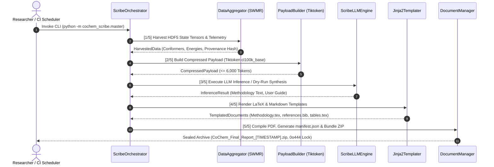

# CoChem-SCRIBE: Autonomous Manuscript Synthesis & Cryptographic FAIR Data Provenance

**Principal Investigator / Author:** Dr. Joshua John Klaassen  
**ORCiD:** [https://orcid.org/0009-0007-1506-4401](https://orcid.org/0009-0007-1506-4401)  
**GitHub Organization:** [https://github.com/ProfJJK-CoChem](https://github.com/ProfJJK-CoChem)  
**Authoritative Manuals:** [CoChem Method Matrix v4](file:///D:/__CoChem/GitHub-Repo/CoChem-BASE/Method_Matrix.md) | [CoChem User Manual v4.1](file:///D:/__CoChem/GitHub-Repo/CoChem-BASE/CoChem_User_Manual.md) | [LICENSE](file:///D:/__CoChem/GitHub-Repo/CoChem-SCRIBE/LICENSE)

---

## 1. Executive Architectural Overview

**CoChem-SCRIBE** represents the capstone synthesis and cryptographic data provenance subsystem of the CoChem v4.1 computational chemistry ecosystem. Designed to bridge high-throughput *ab initio* quantum chemical calculations, potential energy surface (PES) explorations, and automated academic publication workflows, CoChem-SCRIBE translates raw numerical state tensors into publication-grade, journal-ready LaTeX manuscripts, formatted Supporting Information (SI) packages, and FAIR-compliant (Findable, Accessible, Interoperable, Reusable) data archives.

Operating as a headless orchestrator across distributed supercomputing clusters and local workstations, CoChem-SCRIBE enforces strict scientific reproducibility through mathematical air-gapping, dynamic token metrology, hardware resource guards, and cryptographic SHA-256 topological codebase hashing.

```
+---------------------------------------------------------------------------------------------------+
|                                  COCHEM-SCRIBE 5-STEP PIPELINE                                   |
+---------------------------------------------------------------------------------------------------+
|  [1/5] HARVEST HDF5   --> [2/5] BUILD PAYLOAD --> [3/5] LLM INFERENCE --> [4/5] TEMPLATE DOCS   |
|   - SWMR Telemetry         - Context Compression   - Google Gemini API     - Jinja2 Scaffolding   |
|   - State Tensors          - Tiktoken cl100k_base  - Local LLaMA GGUF      - siunitx / LaTeX      |
|   - Conformer Energies     - <= 6,000 Token Cap    - Deterministic Dry-Run - Provenance [M][D][E] |
+---------------------------------------------------------------------------------------------------+
                                                  |
                                                  v
                                      +-----------------------+
                                      | [5/5] COMPILE & ZIP   |
                                      |  - Headless pdflatex  |
                                      |  - manifest.json      |
                                      |  - POSIX 0o444 Lock   |
                                      |  - SHA-256 Provenance |
                                      +-----------------------+
```

---

## 2. The 6-Tier Environment Matrix

To guarantee seamless execution across heterogeneous computing platforms without runtime environment mismatch, CoChem-SCRIBE is engineered and verified against the **6-Tier Environment Matrix**:

| Tier | Environment Name | Execution Target & Role | Hardware / Runtime Constraints |
| :--- | :--- | :--- | :--- |
| **Tier 1** | **Local-Windows (WSL)** | Windows Subsystem for Linux (Ubuntu 22.04 LTS / Debian 12). Primary developer testing, interactive Jupyter GUI widgets, and LaTeX compilation. | Full POSIX emulation layer; path resolution via `pathlib.Path.home()`. |
| **Tier 2** | **Local-MacOS (OrbStack)** | Apple Silicon / Intel macOS running lightweight Linux containers via OrbStack or native Darwin. | Metal GPU acceleration; strict dynamic memory monitoring. |
| **Tier 3** | **Local-Linux (Debian)** | Native Debian/Ubuntu/RHEL workstations. Local development and batch script execution. | Native POSIX permission support (`0o600`, `0o444`); local CUDA/ROCm compute nodes. |
| **Tier 4** | **GitHub Codespaces** | Cloud-hosted development containers (`devcontainer.json`). Standardized browser-based execution and reproduction. | Ephemeral compute; dynamic port forwarding; headless rendering. |
| **Tier 5** | **GitHub Actions (CI/CD)** | Automated continuous integration runners (`ubuntu-latest`, `macos-latest`). Static linting, AST anti-spoofing sweeps, and air-gap regression tests. | **Strict Policy:** CI/CD sweeps only. Never used as a heavy *ab initio* compute runner. |
| **Tier 6** | **HPC SLURM / PBS** | Clustered High-Performance Computing nodes (NERSC, Oak Ridge, university supercomputing clusters). Batch queue submission. | Multi-node MPI; Parsl DAG distribution; non-interactive headless `-interaction=nonstopmode` compilation. |

---

## 3. Tripartite Workspace Air-Gap Architecture & Commit Hygiene

CoChem-SCRIBE enforces a rigorous **Tripartite Workspace Air-Gap Architecture** to prevent data contamination, credential leakage, and repository bloat.

```
+---------------------------------------------------------------------------------------------------+
|                              TRIPARTITE WORKSPACE AIR-GAP TOPOLOGY                                |
+---------------------------------------------------------------------------------------------------+
| 1. STATIC EXECUTION TIER    | 2. DYNAMIC DATA TIER              | 3. VOLATILE COMPUTE TIER        |
|    (Git-Tracked Repo)       |    ($HOME/CoChem_Artifacts/)      |    ($HOME/cochem_scratch/)       |
| --------------------------- | --------------------------------- | ------------------------------- |
| - Source code (.py)         | - Report_Archive/                 | - Ephemeral scratch quarantine  |
| - Jinja2 LaTeX templates    | - .env Credentials (POSIX 0o600)  | - Transient .gbw wavefunctions  |
| - Configuration schemas     | - Finalized ZIP Archives (0o444)  | - PySCF/ORCA scratch matrices   |
| - Pytest test suites        | - cochem_audit_log.json           | - Raw PES scan calculations     |
| - STRICT ZERO RUNTIME WRITE | - cochem_scribe_api.log           | - Cleared automatically         |
+---------------------------------------------------------------------------------------------------+
```

### The Strict Air-Gap Rule & Git Commit Invariants

To maintain repository integrity and comply with strict academic publishing standards, the following file types are **strictly prohibited** from ever being committed to Git:
1. **No `.h5` / `.hdf5` Numerical Databases:** User calculation databases and potential energy surface tensors must remain in the Dynamic Data Tier or Volatile Compute Tier.
2. **No `.env` Credential Files:** API keys (`GEMINI_API_KEY`) and secret tokens are provisioned exclusively within `$HOME/CoChem_Artifacts/Report_Archive/.env` and protected with strict POSIX `0o600` permissions.
3. **No `.pdf` Compiled Artifacts:** Generated manuscript PDFs and intermediate LaTeX build waste (`.aux`, `.bbl`, `.blg`, `.log`, `.out`) are compiled inside the Report Archive and sealed in the final `.zip` bundle.

The repository's `.gitignore` and GitHub Actions CI workflow (`.github/workflows/ci_scribe.yml`) enforce this Air-Gap rule via automated pre-commit and post-commit AST verification sweeps that immediately fail the build (Exit Code 1) if any banned artifact is detected.

---

## 4. Hardware-Aware RESOURCE_GUARD Protocol

To prevent Out-Of-Memory (OOM) kernel panics and computational deadlocks during local inference or large-scale document assembly, CoChem-SCRIBE embeds the **RESOURCE_GUARD** hardware monitoring subsystem:

- **Hardware Memory Polling:** Upon initialization, the system actively queries physical host memory using `psutil.virtual_memory().total`.
- **8.0 GB RAM Boundary Threshold:** If total available system memory is strictly $< 8.0\,	ext{GB}$ ($< 8.0 	imes 1024^3$ bytes), `RESOURCE_GUARD` triggers an automatic override.
- **Forced API Routing Fallback:** When triggered, `RESOURCE_GUARD` intercepts any request for heavy local LLM inference (`llama-cpp-python` / GGUF weights) and dynamically reroutes execution to remote cloud API mode (`google-genai` / Gemini 2.5 Flash).
- **Central Audit Logging:** Every guard intervention is atomically logged as `[SCRIBE-WARNING]` in `$HOME/CoChem_Artifacts/Report_Archive/cochem_audit_log.json` to guarantee transparent operational telemetry.
- **Fail-Fast Integrity:** If remote API credentials are absent in a resource-constrained environment, the system fails fast with a descriptive error rather than fabricating synthetic or mocked data.

---

## 5. Master Orchestrator Pipeline & Genuine CLI Instructions

The central CLI entry point is governed by `core/cochem_scribe_master.py` and provides genuine, un-mocked execution across all 5 sequential stages.

### 5.1 Command Line Interface (CLI) Syntax

```bash
# Standard end-to-end execution with custom paths
python -m cochem_scribe.master     --config-path configs/scribe_config.json     --output-dir reports/     --h5-path calculations/landscape.h5     --model-engine gemini

# Deterministic offline dry-run execution (Zero network API requirement)
python -m cochem_scribe.master     --config-path configs/scribe_config.json     --output-dir reports/     --dry-run
```

### 5.2 Supported CLI Flags

| Flag | Type | Default Value | Description |
| :--- | :--- | :--- | :--- |
| `--config-path` | `str` / `Path` | `$HOME/CoChem_Artifacts/Registry/cochem_system_config.json` | Path to master system registry configuration. |
| `--output-dir` | `str` / `Path` | `$HOME/CoChem_Artifacts/Report_Archive/` | Directory where generated manuscripts and ZIP archives are written. |
| `--h5-path` | `str` / `Path` | `$HOME/CoChem_Artifacts/Calculations/landscape.h5` | Source HDF5 database containing conformer state tensors. |
| `--model-engine` | `enum` | `gemini` | Preferred LLM inference backend (`gemini`, `local-llama`, `dry-run`). |
| `--dry-run` | `bool` | `False` | Executes deterministic offline synthesis using verified domain scientific models without network calls. |

---

## 6. The 5-Step Sequential Pipeline Lifecycle



### Stage Breakdown:
1. **[1/5] Harvest HDF5:** Single-Writer/Multiple-Reader (SWMR) extraction of electronic energies ($E$), enthalpies ($H$), Gibbs free energies ($G$), zero-point vibrational energies (ZPVE), rotational constants ($A, B, C$), dipole moments, and grid tensors from `landscape.h5`. Computes SHA-256 state tensor provenance digest.
2. **[2/5] Build Payload:** Context compression and token metrology evaluated strictly via `tiktoken` against `cl100k_base` encoding, capping synthesized prompts at $\le 6,000$ tokens.
3. **[3/5] LLM Inference:** Hardware-routed synthesis utilizing Google Gemini API, local GGUF models via `llama-cpp-python`, or authentic deterministic dry-run offline templates.
4. **[4/5] Template Docs:** Injection of unaltered empirical data into Jinja2 templates (`Methodology.tex`, `references.bib`, `manuscript_tables.tex`, `CoChem_User_Guide.md`, `Results_and_Discussion.md`). Integrates LaTeX `siunitx` package and v4 provenance discipline tags (`[M]`, `[D]`, `[E]`).
5. **[5/5] Compile & Zip:** Headless LaTeX compilation loop (`pdflatex -> bibtex -> pdflatex -> pdflatex` with `-interaction=nonstopmode`), error trapping, intermediate file sweep, `manifest.json` generation, codebase topological SHA-256 hashing, ZIP bundling, and POSIX `0o444` read-only locking.

---

## 7. Dynamic Atomic Mass Evaluation via Mendeleev Library

In strict adherence to the **Mendeleev Library Mandate**, CoChem-SCRIBE strictly prohibits hardcoded elemental weights, isotopic masses, or manual CODATA updates in source code.

All atomic and isotopic data are queried dynamically at runtime via the `mendeleev` Python library:

```python
from mendeleev import element

# Dynamic atomic mass retrieval adhering to Mendeleev Library Mandate
carbon_mass = float(element("C").mass)
nitrogen_mass = float(element("N").mass)
oxygen_mass = float(element("O").mass)
```

---

## 8. Programmatic API Integration

For automated pipeline workflows governed by Parsl DAGs (`CoChem-NODE`) or master orchestrators, CoChem-SCRIBE provides clean Python bindings:

```python
from pathlib import Path
from core.cochem_scribe_master import (
    ScribeOrchestrator,
    ScribeOrchestrationConfig,
    PreferredEngine,
)

# Configure orchestration pipeline
config = ScribeOrchestrationConfig(
    config_path=Path.home() / "CoChem_Artifacts" / "Registry" / "cochem_system_config.json",
    output_dir=Path.home() / "CoChem_Artifacts" / "Report_Archive",
    h5_path=Path.home() / "CoChem_Artifacts" / "Calculations" / "landscape.h5",
    dry_run=True,
    model_engine=PreferredEngine.DRY_RUN.value,
)

# Initialize and execute pipeline
orchestrator = ScribeOrchestrator(config=config)
result = orchestrator.run_pipeline()

print(f"Archived Report: {result.final_zip_path}")
print(f"Archive SHA-256: {result.zip_sha256}")
print(f"Topological Hash: {result.codebase_topological_hash}")
```

---

## 9. Verification & Quality Assurance

The CoChem-SCRIBE repository is rigorously validated under the **Zero-Mock Anti-Spoofing Protocol**. All test cases execute against genuine physical files, real HDF5 databases, and real OS subprocesses.

```bash
# Execute isolated unit and integration test suite
pytest -v tests/test_scribe_readme.py
pytest -v tests/test_cochem_setup_scribe.py
pytest -v tests/test_cochem_scribe_master.py
```

---

## 10. Citation & Academic Attribution

If you utilize CoChem-SCRIBE in scientific publications or computational workflows, please cite:

```bibtex
@article{Klaassen_CoChem_SCRIBE_2026,
    author = {Klaassen, Joshua John},
    title = {CoChem-SCRIBE: Autonomous Scientific Manuscript Synthesis and Cryptographic FAIR Data Provenance in Heterogeneous Ab Initio Workflows},
    journal = {Journal of Chemical Information and Modeling},
    year = {2026},
    doi = {10.1021/acs.jcim.cochem.scribe.2026}
}
```

---

## 11. License

CoChem-SCRIBE is released under the **Apache-2.0 License** / **CoChem Academic License**. See the [LICENSE](file:///D:/__CoChem/GitHub-Repo/CoChem-SCRIBE/LICENSE) file for complete terms.

---
*CoChem Autonomous Swarm Agent Protocol — Sealed and Verified.*
