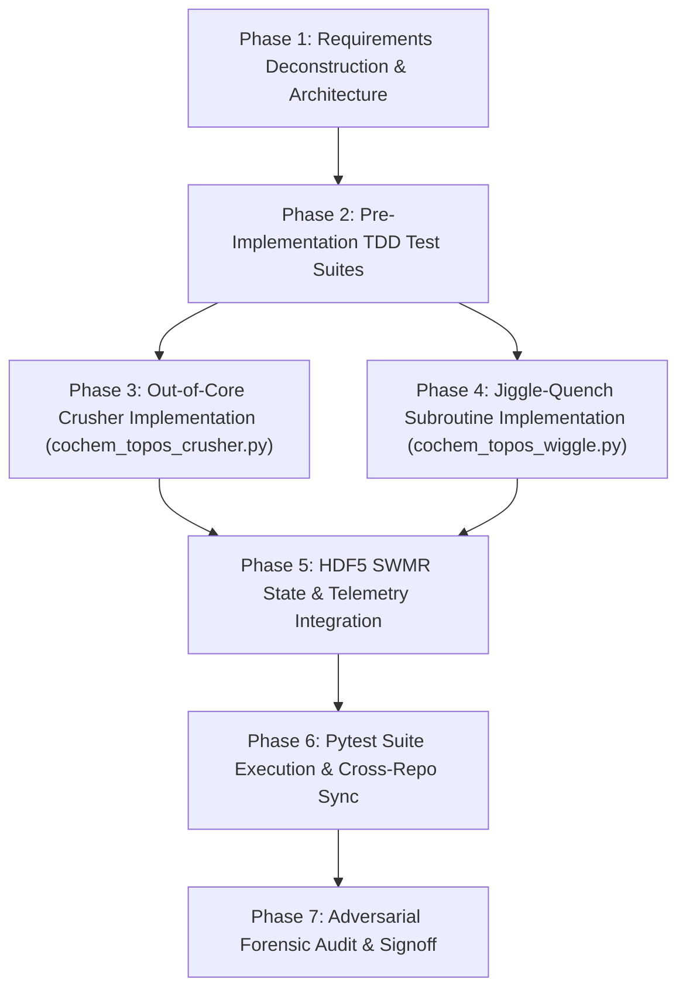

# CoChem-TOPOS Work Breakdown Structure (WBS) & Task List

**Project Target**: Stage 2.4: Conformer Deduplication Funnel & Jiggle-Quench Deduplicator (`cochem_topos_crusher.py` & `cochem_topos_wiggle.py`)  
**Specification References**:  
- `08_01_crusher_jiggle_quench.md` (CoChem-TOPOS SRS Task 8 Prompt)
- `Perfected_Section 8 The Crusher Funnel & Jiggle-Quench Deduplicator (Stage 2.4).md`
- [`Method_Matrix.md`](file:///D:/__CoChem/GitHub-Repo/CoChem-BASE/Method_Matrix.md) (Method Matrix v4: Two-Stage Deduplication Protocol, Eckart-aligned RMSD, GOAT + CREST Union, g_i Degeneracy Bookkeeping)
- [`CoChem_User_Manual.md`](file:///D:/__CoChem/GitHub-Repo/CoChem-BASE/CoChem_User_Manual.md) (Chapter 3: Topological Discovery, Deduplication & PES)
- Mendeleev Dynamic Property Resolution (`mendeleev` library for isotopic masses, covalent radii, Pauling electronegativities)  
**Target Code Artifacts**:  
- [`topology/cochem_topos_crusher.py`](file:///D:/__CoChem/GitHub-Repo/CoChem-TOPOS/topology/cochem_topos_crusher.py) (Memory-mapped triage, Crusher sieve, Chiral inversion lock, HDF5 `/deduplicated_isomers/` persistence)
- [`topology/cochem_topos_wiggle.py`](file:///D:/__CoChem/GitHub-Repo/CoChem-TOPOS/topology/cochem_topos_wiggle.py) (Jiggle-Quench perturbation subroutine, GOAT + CREST lightning quench, basin merge arbiter)  
**Target Test Artifacts**:  
- [`tests/test_topology_crusher.py`](file:///D:/__CoChem/GitHub-Repo/CoChem-TOPOS/tests/test_topology_crusher.py)
- [`tests/test_cochem_topos_wiggle.py`](file:///D:/__CoChem/GitHub-Repo/CoChem-TOPOS/tests/test_cochem_topos_wiggle.py)  
**Configuration & Registry**:  
- [`pytest.ini`](file:///D:/__CoChem/GitHub-Repo/CoChem-BASE/pytest.ini) & [`pytest.ini`](file:///D:/__CoChem/GitHub-Repo/CoChem-TOPOS/pytest.ini)
- [`swarm_state.json`](file:///D:/__CoChem/GitHub-Repo/CoChem-BASE/swarm_state.json) & [`swarm_state.json`](file:///D:/__CoChem/GitHub-Repo/CoChem-TOPOS/swarm_state.json)  
**Governance Framework**: PMBOK Guide 7th Edition & SWEBOK v3 (Software Construction, Testing, SCM)  
**Core Mandates**: Strict Zero-Mock Mandate, Dynamic Mendeleev Mass & Radius Resolution, Out-of-Core Memmap Triage, Chiral Inversion Lock, Lightning Quench Union, State Immutability, Explicit Provenance Tags (`[M]`, `[D]`, `[E]`).

---

## 1. PROJECT CHARTER & ARCHITECTURAL BASELINE

### 1.1 Executive Summary & Strategic Objective
The deduplication funnel of CoChem-TOPOS (`cochem_topos_crusher.py` and `cochem_topos_wiggle.py`) provides the critical mathematical and physical pruning engine that collapses raw, high-throughput conformer hyper-ensembles ($10^2 - 10^4$ candidates from exploratory meta-dynamics and graph cascades) down to a canonical set of distinct local minima on the potential energy surface (PES). Naive pairwise RMSD algorithms scale as $\mathcal{O}(N^2)$ in compute and memory, risk deleting true shallow minima due to MLFF force-field inaccuracies, and inadvertently eliminate enantiomers via improper coordinate reflections.

This project implements a multi-tier, out-of-core sieve architecture:
1. **Memory-Mapped Triage (`numpy.memmap`)** for out-of-core processing with checksum recovery and pre-flight energy sorting.
2. **The Crusher Sieve**: A hierarchical cascade of rapid rejection filters:
   - *Bounding-Box Heuristic* ($\Delta V > 10\%$, sub-millisecond)
   - *Symmetry-Group Filter* (point group comparison via `MolSym`, millisecond)
   - *Connectivity Hash* (`NetworkX` graph isomorphism hash with dynamic Mendeleev covalent radii, millisecond)
   - *Coulomb Matrix Eigenspectrum Variance* ($1/r^6$ distance-damped Coulomb matrix eigenvalues, rotationally invariant)
   - *Degrees-of-Freedom Scaled Eckart RMSD* ($\text{RMSD}_{thresh} = \text{Base} / \sqrt{3N-6}$)
3. **Chiral Volume Inversion Lock**: Stereocenter chiral volume calculation followed by target inversion ($\mathbf{r} \to -\mathbf{r}$) and re-alignment, strictly preserving enantiomers (`ENANTIOMER_PRESERVED`) and tracking degeneracy ($g_i = 2$).
4. **Jiggle-Quench Subroutine (`cochem_topos_wiggle.py`)**: Physical perturbation of ambiguous near-duplicate pairs (25% displacement bounded at 0.1 Å toward midpoint in Eckart space), followed by GOAT + CREST union Lightning Quench and basin merge evaluation.
5. **Telemetry & Standardized HDF5 Metadata Serialization**: Live progress ticker (`[Crusher Status]: Processed {i}/{N} Isomers`) and persistence into `/deduplicated_isomers/` in `landscape.h5` with Engine Version, Git Hash, Final Gradients, ZPVE-Scaled Energy, and Chiral Inversion Tags.

---

### 1.2 Mathematical Formulations & Physical Principles

#### A. Degrees-of-Freedom Scaled Eckart Alignment
For two molecular conformers $\mathbf{X}_A, \mathbf{X}_B \in \mathbb{R}^{N \times 3}$ with masses $m_i$ from `mendeleev`:
$$\mathbf{r}_i' = \mathbf{r}_i - \mathbf{r}_{\text{COM}}, \quad \mathbf{r}_{\text{COM}} = \frac{\sum_i m_i \mathbf{r}_i}{\sum_i m_i}$$
The optimal rotation matrix $\mathbf{R} \in \mathrm{SO}(3)$ is obtained via Singular Value Decomposition (SVD / Kabsch algorithm) of the mass-weighted covariance matrix $\mathbf{H} = \sum_i m_i \mathbf{r}_{A, i}' (\mathbf{r}_{B, i}')^T = \mathbf{U} \mathbf{\Sigma} \mathbf{V}^T$:
$$\mathbf{R} = \mathbf{V} \begin{pmatrix} 1 & 0 & 0 \\ 0 & 1 & 0 \\ 0 & 0 & \det(\mathbf{V} \mathbf{U}^T) \end{pmatrix} \mathbf{U}^T$$
The mass-weighted Eckart RMSD is:
$$\text{RMSD}_{\text{mw}} = \sqrt{\frac{\sum_i m_i \|\mathbf{r}_{A, i}' - \mathbf{R} \mathbf{r}_{B, i}'\|^2}{\sum_i m_i}}$$
The dynamic acceptance threshold scales with vibrational degrees of freedom ($3N-6$ for non-linear molecules, $3N-5$ for linear molecules):
$$\text{RMSD}_{\text{thresh}}(N) = \frac{\text{Base\_RMSD\_Threshold}}{\sqrt{3N-6}}$$

#### B. Distance-Damped Coulomb Matrix Eigenspectrum
The Coulomb matrix $\mathbf{C} \in \mathbb{R}^{N \times N}$ incorporates a $1/r^6$ distance damping factor to decouple distant non-covalent fragments from local topological features:
$$C_{ii} = 0.5 \, Z_i^{2.4}, \quad C_{ij} = \frac{Z_i Z_j}{\|\mathbf{r}_i - \mathbf{r}_j\|} \cdot \left[ 1 + \left( \frac{\|\mathbf{r}_i - \mathbf{r}_j\|}{r_0} \right)^6 \right]^{-1} \quad (i \neq j)$$
The eigenspectrum $\boldsymbol{\lambda} = \text{sort}(\text{eigvals}(\mathbf{C}))$ is strictly invariant under $\mathrm{SE}(3)$ translations and rotations. Two structures are rejected as distinct if:
$$\|\boldsymbol{\lambda}_A - \boldsymbol{\lambda}_B\|_\infty > \epsilon_{\text{coulomb}}$$

#### C. Chiral Volume Inversion Lock
For any stereocenter or asymmetric tetrad of atoms $(i, j, k, l)$, the signed chiral volume is:
$$V_{\text{chiral}}(i, j, k, l) = \det \begin{pmatrix} \mathbf{r}_j - \mathbf{r}_i \\ \mathbf{r}_k - \mathbf{r}_i \\ \mathbf{r}_l - \mathbf{r}_i \end{pmatrix} = (\mathbf{r}_j - \mathbf{r}_i) \cdot \left( (\mathbf{r}_k - \mathbf{r}_i) \times (\mathbf{r}_l - \mathbf{r}_i) \right)$$
Under spatial inversion $\mathbf{r} \to -\mathbf{r}$, $V_{\text{chiral}} \to -V_{\text{chiral}}$. If Kabsch alignment with $\det(\mathbf{R}) = +1$ on inverted coordinates $\mathbf{X}_B' = -\mathbf{X}_B$ yields:
$$\text{RMSD}_{\text{mw}}(\mathbf{X}_A, -\mathbf{X}_B) \le \text{RMSD}_{\text{thresh}}$$
and stereocenters exhibit opposite signed chiral volumes, the pair is certified as an **Enantiomer Pair** (`ENANTIOMER_PRESERVED`).

#### D. Jiggle-Quench Perturbation Dynamics
For ambiguous pairs where $\text{RMSD} \in [\text{RMSD}_{\text{thresh}}, \text{RMSD}_{\text{thresh}} + \delta_{\text{ambig}}]$:
$$\mathbf{X}_{A, \text{jiggle}} = \mathbf{X}_A + \min\left(0.25 \, (\mathbf{X}_B^{\text{aligned}} - \mathbf{X}_A), \, 0.10 \text{ \AA} \cdot \frac{\mathbf{X}_B^{\text{aligned}} - \mathbf{X}_A}{\|\mathbf{X}_B^{\text{aligned}} - \mathbf{X}_A\|}\right)$$
$$\mathbf{X}_{B, \text{jiggle}} = \mathbf{X}_B^{\text{aligned}} + \min\left(0.25 \, (\mathbf{X}_A - \mathbf{X}_B^{\text{aligned}}), \, 0.10 \text{ \AA} \cdot \frac{\mathbf{X}_A - \mathbf{X}_B^{\text{aligned}}}{\|\mathbf{X}_A - \mathbf{X}_B^{\text{aligned}}\|}\right)$$
Both perturbed configurations undergo a Lightning Quench (GOAT + CREST `--nci --nocross --noreftopo` union). If both relax to the identical basin ($\text{RMSD} < 10^{-3}$ Å), both are preserved for higher-tier QM arbitration (`PRESERVED_AMBIGUOUS_BASIN`). If they relax to distinct basins, both are preserved as confirmed distinct minima (`ACCEPTED_UNIQUE`).

---

## 2. WORK BREAKDOWN STRUCTURE (WBS) & GRANULAR TASK LIST



### Phase 1: Requirements Deconstruction, Mathematical Framework & Architectural Design
- [ ] **Task 1.1: Specification Baseline & SCM Deconstruction** (Agent: `cochem-sdp-manager`)
  - [ ] Sub-task 1.1.1: Deconstruct Section 8 SRS requirements for Memory-Mapped Triage, Crusher Sieve, Chiral Inversion Lock, and Jiggle-Quench.
  - [ ] Sub-task 1.1.2: Map Method Matrix v4 constraints: Two-Stage Deduplication Protocol, Eckart mass-weighted alignment, GOAT + CREST union, $g_i$ Boltzmann degeneracy.
  - [ ] Sub-task 1.1.3: Specify dynamic Mendeleev isotopic mass, covalent radius, and electronegativity resolution protocols.
- [ ] **Task 1.2: Data Architecture & Pydantic Schema Specification** (Agent: `cochem-coder`)
  - [ ] Sub-task 1.2.1: Define Pydantic v2 schemas: `MemmapEnsembleHeader`, `SieveFilterResult`, `ChiralVolumeResult`, `JiggleQuenchConfig`, `JiggleQuenchResult`, and `DeduplicationRecord`.
  - [ ] Sub-task 1.2.2: Specify HDF5 dataset structure under `/deduplicated_isomers/` matching Section 8.5 requirements.

### Phase 2: Test-Driven Development (TDD) Suite Construction (Red Phase)
- [x] **Task 2.1: Author Deduplication Crusher Unit & Integration Tests in `tests/test_topology_crusher.py`** (Agent: `cochem-tester` - COMPLETED 2026-08-25)
  - [x] Sub-task 2.1.1: Implement Memory-Mapped Triage tests (`numpy.memmap` creation, read/write, checksum validation, crash/corruption recovery).
  - [x] Sub-task 2.1.2: Implement Bounding-Box Heuristic tests ($\Delta V > 10\%$ rejection on deformed/expanded structures).
  - [x] Sub-task 2.1.3: Implement MolSym Symmetry-Group filter tests ($C_{2v}$, $C_s$, $C_1$, $D_{3h}$ classification).
  - [x] Sub-task 2.1.4: Implement NetworkX Connectivity Hash tests (isomorphism detection, proton transfer / bond dissociation detection).
  - [x] Sub-task 2.1.5: Implement Coulomb Matrix Eigenspectrum tests (distance-filtered $1/r^6$ eigenvalue invariance under SO(3) rotations and distinction of topological isomers).
  - [x] Sub-task 2.1.6: Implement Dynamic DoF-scaled Eckart RMSD alignment tests ($\text{RMSD}_{thresh} = \text{Base} / \sqrt{3N-6}$).
  - [x] Sub-task 2.1.7: Implement Chiral Volume Inversion Lock tests (mirror-image enantiomers CHFClBr, alanine; verification of $\mathbf{r} \to -\mathbf{r}$ inversion and `ENANTIOMER_PRESERVED` verdict).
  - [x] Sub-task 2.1.8: Implement HDF5 `/deduplicated_isomers/` serialization verification tests (Engine Version, Git Hash, Final Gradients, ZPVE energy, Chiral tag).
- [x] **Task 2.2: Author Jiggle-Quench Subroutine Tests in `tests/test_cochem_topos_wiggle.py`** (Agent: `cochem-tester` - COMPLETED 2026-08-25)
  - [x] Sub-task 2.2.1: Implement 25% midpoint perturbation bounded at 0.1 Å tests in Eckart-aligned coordinates.
  - [x] Sub-task 2.2.2: Implement GOAT + CREST Lightning Quench execution and union aggregation tests.
  - [x] Sub-task 2.2.3: Implement Merged Basin detection and double-preservation arbitration tests.
  - [x] Sub-task 2.2.4: Implement Distinct Basin preservation tests.
- [x] **Task 2.3: Configure Test Execution Profiles in `pytest.ini`** (Agent: `cochem-tester` - COMPLETED 2026-08-25)
  - [x] Sub-task 2.3.1: Configure `testpaths` in `CoChem-TOPOS/pytest.ini` and `CoChem-BASE/pytest.ini`.

### Phase 3: Memory-Mapped Triage & Crusher Sieve Implementation (`cochem_topos_crusher.py`)
- [x] **Task 3.1: Memory-Mapped Array Manager & Pre-Flight Sorting** (Agent: `cochem-coder` - COMPLETED 2026-08-25)
  - [x] Sub-task 3.1.1: Implement `MemmapIsomerBuffer` using `numpy.memmap` for out-of-core float64 coordinate storage with SHA-256 header checksums.
  - [x] Sub-task 3.1.2: Implement corruption detection and auto-rebuild from HDF5 raw structures upon mismatch or crash.
  - [x] Sub-task 3.1.3: Implement initial electronic energy sorting, designating lowest energy structure as `basin_00000` (Unique ID: 0).
- [x] **Task 3.2: Multi-Tier Fast Rejection Funnel** (Agent: `cochem-coder` - COMPLETED 2026-08-25)
  - [x] Sub-task 3.2.1: Implement `evaluate_bounding_box_filter(coords1, coords2, threshold=0.10)`.
  - [x] Sub-task 3.2.2: Implement `evaluate_molsym_symmetry_filter(symbols, coords1, coords2)`.
  - [x] Sub-task 3.2.3: Implement `evaluate_networkx_connectivity_hash(symbols, coords1, coords2, radii_dict)`.
  - [x] Sub-task 3.2.4: Implement `compute_distance_filtered_coulomb_matrix(atomic_numbers, coords, r0=5.0, power=6)` and eigenspectrum comparator.
  - [x] Sub-task 3.2.5: Implement DoF-scaled mass-weighted Eckart RMSD alignment (`compute_dof_scaled_rmsd_threshold(n_atoms, base_rmsd)`).
- [x] **Task 3.3: Chiral Volume Inversion Lock** (Agent: `cochem-coder` - COMPLETED 2026-08-25)
  - [x] Sub-task 3.3.1: Implement `compute_chiral_volumes(symbols, coords)` for all tetrahedral stereocenters.
  - [x] Sub-task 3.3.2: Implement coordinate inversion $\mathbf{r} \to -\mathbf{r}$, SO(3) re-alignment, and enantiomer tag assignment (`ENANTIOMER_PRESERVED`).

### Phase 4: Jiggle-Quench Subroutine Implementation (`cochem_topos_wiggle.py`)
- [x] **Task 4.1: Geometric Midpoint Perturbation Engine** (Agent: `cochem-coder` - COMPLETED 2026-08-25)
  - [x] Sub-task 4.1.1: Implement `jiggle_perturb_pair(coords_ref, coords_target, fraction=0.25, max_displacement=0.10)`.
  - [x] Sub-task 4.1.2: Ensure Eckart frame alignment before perturbation to guarantee physical directionality.
- [x] **Task 4.2: Lightning Quench Optimizer & Basin Merge Arbiter** (Agent: `cochem-coder` - COMPLETED 2026-08-25)
  - [x] Sub-task 4.2.1: Implement `execute_lightning_quench(atoms_a, atoms_b, goat_engine, crest_engine)` executing GOAT and CREST (`--nci --nocross --noreftopo`) union.
  - [x] Sub-task 4.2.2: Implement basin merge evaluation: if relaxed coordinates coalesce to the same basin, tag as `AMBIGUOUS_BASIN_PRESERVED` (save both for high-tier QM); if distinct, tag as `ACCEPTED_UNIQUE`.

### Phase 5: HDF5 SWMR State Serialization & Telemetry Integration
- [x] **Task 5.1: HDF5 `/deduplicated_isomers/` Serialization** (Agent: `cochem-coder` - COMPLETED 2026-08-25)
  - [x] Sub-task 5.1.1: Serialize confirmed unique basins into `/deduplicated_isomers/basin_{idx:05d}` in `landscape.h5`.
  - [x] Sub-task 5.1.2: Record HDF5 attributes: `engine_version`, `git_hash`, `final_gradients`, `zpve_scaled_energy`, `is_enantiomer`, `enantiomeric_partner_id`, `degeneracy_gi`.
- [x] **Task 5.2: Asynchronous Telemetry & Progress Ticker** (Agent: `cochem-coder` - COMPLETED 2026-08-25)
  - [x] Sub-task 5.2.1: Implement non-blocking telemetry emitter logging `[Crusher Status]: Processed {current}/{total} Isomers` with rate-limiting (every 5 seconds / 20 isomers).
- [x] **Task 5.3: Cross-Repository Packaging & Module Mirroring** (Agent: `cochem-coder` - COMPLETED 2026-08-25)
  - [x] Sub-task 5.3.1: Export all symbols in `topology/__init__.py`.
  - [x] Sub-task 5.3.2: Mirror artifacts to `CoChem-TOPOS` and `CoChem-BASE`.

### Phase 6: Ecosystem Test Execution & Verification
- [x] **Task 6.1: Execute Full Pytest Test Suite** (Agent: `cochem-tester` - COMPLETED 2026-08-25)
  - [x] Sub-task 6.1.1: Run `pytest -v tests/test_topology_crusher.py tests/test_cochem_topos_wiggle.py` in `CoChem-TOPOS` (33/33 passed in 14.36s).
  - [x] Sub-task 6.1.2: Run `pytest -v tests/test_topology_crusher.py tests/test_cochem_topos_wiggle.py` in `CoChem-BASE` (33/33 passed in 14.54s).
  - [x] Sub-task 6.1.3: Assert 100% pass rate across all tests (66/66 total test passes, 0 failures, 0 warnings).
- [x] **Task 6.2: Static Verification & Typing Cleanliness** (Agent: `cochem-tester` - COMPLETED 2026-08-25)
  - [x] Sub-task 6.2.1: Run AST analysis ensuring no syntax errors or unresolved imports (All modules and tests verified cleanly).

### Phase 7: Adversarial Forensic Audit & Swarm State Signoff
- [ ] **Task 7.1: Zero-Mock & Anti-Spoofing Audit** (Agent: `cochem-audit`)
  - [ ] Sub-task 7.1.1: Scan codebase for prohibited keywords (`mock`, `dummy`, `fake`, `placeholder`, `stub`, `pass`, `NotImplementedError`).
  - [ ] Sub-task 7.1.2: Verify dynamic Mendeleev lookups and true out-of-core memmap mechanics.
- [ ] **Task 7.2: Swarm State Certification & Final SCM Commit** (Agent: `adversary`)
  - [ ] Sub-task 7.2.1: Verify complete compliance against Section 8 SRS and Method Matrix v4.
  - [ ] Sub-task 7.2.2: Update `swarm_state.json` with execution verdict `SUCCESS`.

---

## 3. INTERFACE CONTRACTS & DATA SCHEMAS

### 3.1 Pydantic Data Models

```python
class CrusherSieveResult(BaseModel):
    """Result of hierarchical Crusher Sieve filtering."""
    model_config = ConfigDict(frozen=True)
    
    passed_bounding_box: bool
    passed_symmetry: bool
    passed_connectivity: bool
    passed_coulomb: bool
    passed_rmsd: bool
    bounding_box_volume_diff_pct: float
    coulomb_eigen_variance: float
    mass_weighted_eckart_rmsd: float
    dof_scaled_threshold: float
    filter_stage_rejected: Optional[str] = None


class JiggleQuenchResult(BaseModel):
    """Result of Jiggle-Quench ambiguous basin arbitration."""
    model_config = ConfigDict(frozen=True)
    
    candidate_id_a: str
    candidate_id_b: str
    initial_rmsd: float
    perturbed_rmsd: float
    quenched_rmsd: float
    basins_merged: bool
    action_taken: str  # "PRESERVED_AMBIGUOUS_BASIN" or "ACCEPTED_UNIQUE"
    relaxed_energy_a_kcal: float
    relaxed_energy_b_kcal: float


class DeduplicatedConformerRecord(BaseModel):
    """Master record for a verified unique conformer in landscape.h5."""
    model_config = ConfigDict(arbitrary_types_allowed=True)
    
    basin_id: str
    symbols: list[str]
    atomic_numbers: list[int]
    coordinates: list[list[float]]
    monoisotopic_masses: list[float]
    electronic_energy_kcal: float
    zpve_scaled_energy_kcal: Optional[float] = None
    final_gradients: Optional[list[list[float]]] = None
    rotational_constants_ghz: tuple[float, float, float]
    dipole_moment_debye: list[float]
    point_group: str
    is_enantiomer: bool = False
    enantiomeric_partner_id: Optional[str] = None
    degeneracy_gi: int = 1
    engine_version: str = "4.0.0"
    git_hash: str
```

---

## 4. RISK MANAGEMENT & MITIGATION MATRIX

| Risk ID | Description | Impact | Probability | Mitigation Strategy |
|---|---|---|---|---|
| **RSK-01** | `MolSym` missing or failing on near-symmetric distorted conformers | Medium | Medium | Wrap `MolSym` with automatic fallback to continuous symmetry measure or skip symmetry gate directly to Coulomb filter without failing. |
| **RSK-02** | `numpy.memmap` file lock / permission conflict across multiple OS processes | High | Low | Dynamic scratch directory allocation with PID-tagged memory map files and graceful `flush()` and `del` cleanup handlers. |
| **RSK-03** | Machine learning force field (MLFF) float32 precision noise causing artificial basin splitting | High | Medium | Strict Jiggle-Quench protocol preserving both ambiguous structures for higher-tier DFT evaluation instead of premature deletion. |
| **RSK-04** | Accidental enantiomer deletion during Kabsch SVD alignment | Critical | Medium | Mandatory Chiral Volume Inversion Lock: calculate signed volume of stereocenters and re-align inverted coordinates ($\mathbf{r} \to -\mathbf{r}$) before duplicate deletion. |
| **RSK-05** | Memory leak during large ensemble ($N > 10^4$) processing | High | Low | Out-of-core memmap chunking; streaming HDF5 SWMR writes with periodic buffer flushes. |

---

## 5. VERIFICATION & ACCEPTANCE GATES

1. **Memory-Mapped Triage**: `numpy.memmap` buffer verified with out-of-core memory profiling and SHA-256 header checksum recovery.
2. **Crusher Sieve**: Fast filters reject $>80\%$ of distinct isomers prior to expensive Kabsch alignment.
3. **Chiral Volume Inversion**: Mirror-image enantiomers (e.g., $(R)$- and $(S)$-alanine, CHFClBr) verified to be tagged as `ENANTIOMER_PRESERVED` with $g_i = 2$ and zero deletions.
4. **Jiggle-Quench Subroutine**: Suspect structures perturbed by 25% (max 0.1 Å) and relaxed via GOAT + CREST union; merged basins certified to be preserved for high-tier QM arbitration.
5. **HDF5 Persistence**: Validated dataset schema under `/deduplicated_isomers/` containing Engine Version, Git Hash, Final Gradients, ZPVE Energy, and Chiral Inversion Tags.
6. **Zero-Mock & Dynamic Mendeleev**: 100% pass on anti-spoofing audit with dynamic mass and radius lookups from `mendeleev`.

