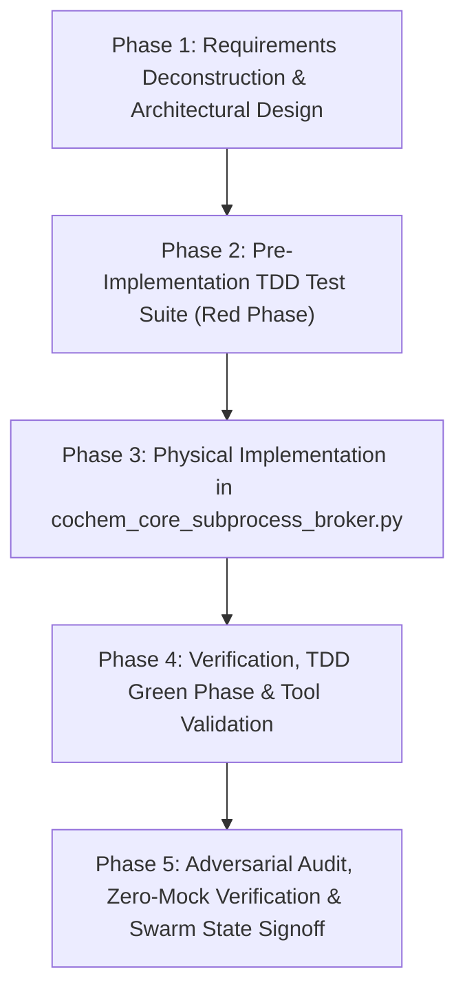

[SDPM REPORT]

# SOFTWARE DEVELOPMENT PROJECT MANAGEMENT (SDPM) REPORT
**Project Target**: High-Performance Subprocess Broker Architecture & HPC Execution Engine for `Doc7_01_subprocess_broker_prompt.md`  
**Target Artifact**: [`core_engine/cochem_core_subprocess_broker.py`](file:///D:/__CoChem/GitHub-Repo/CoChem-BASE/core_engine/cochem_core_subprocess_broker.py)  
**Test Suite**: [`test_suite/test_cochem_core_subprocess_broker.py`](file:///D:/__CoChem/GitHub-Repo/CoChem-BASE/test_suite/test_cochem_core_subprocess_broker.py)  
**Configuration & Registry**: [`pytest.ini`](file:///D:/__CoChem/GitHub-Repo/CoChem-BASE/pytest.ini), [`swarm_state.json`](file:///D:/__CoChem/GitHub-Repo/CoChem-BASE/swarm_state.json)  
**Governance Standards**: PMBOK Guide 7th Edition (System for Value Delivery) & SWEBOK v3 (Software Configuration Management, Software Construction, Software Testing)  
**Security & Verification Protocol**: Zero-Mock Mandate, Asymmetric Verification, Anti-Spoofing Council Directive v2

---

## 1. PROJECT CHARTER & SCOPE BASELINE

### 1.1 Executive Summary & Objective
The objective of this project increment is to engineer, harden, validate, and integrate the authoritative **HPC Subprocess Broker & Execution Engine** ([`core_engine/cochem_core_subprocess_broker.py`](file:///D:/__CoChem/GitHub-Repo/CoChem-BASE/core_engine/cochem_core_subprocess_broker.py)) for the `CoChem-BASE` repository in strict compliance with `Doc7_01_subprocess_broker_prompt.md`.

### 1.2 Scope Inclusions
1. **NUMA-Aware Hardware Thread-Pinning & Oversubscription Prevention**:
   - Dynamic host CPU topology evaluation (physical cores, logical threads, NUMA nodes, socket distribution).
   - Unified abstraction layer for `psutil.Process().cpu_affinity()`.
   - Robust cross-platform guards (Linux `sched_setaffinity`, Windows `SetProcessAffinityMask` with processor group handling, macOS Darwin graceful degradation).
   - Multi-rank OpenMPI detection (`OMPI_COMM_WORLD_SIZE > 1`, `PMI_SIZE`, `SLURM_NTASKS`) and automatic injection of `OMP_NUM_THREADS="1"`, `MKL_NUM_THREADS="1"`, `OPENBLAS_NUM_THREADS="1"`, `VECLIB_MAXIMUM_THREADS="1"`, `NUMEXPR_NUM_THREADS="1"`.
2. **Pre-Flight Disk Quota & RAM-Disk Routing**:
   - `shutil.disk_usage()` pre-flight verification asserting $>50\,\text{GB}$ free scratch space; immediately raising `DiskQuotaError` from `cochem_base.exceptions` upon failure.
   - Physical 64 KB unbuffered read/write binary probe with SHA-256 validation and `os.fsync()` for physical media responsiveness.
   - Autonomous RAM-disk overlay when $\text{Total\_RAM\_GB} > 128\,\text{GB}$ (Linux `tmpfs`, macOS `hdiutil`, Windows Dev Drive).
   - User/job-specific subdirectory creation (`cochem_exec_<job_id>_<timestamp>`) locked down with `chmod 700` on POSIX and `icacls` on Windows.
3. **ZeroMQ Heartbeat Integration & Dead-Man's Switch**:
   - Transport abstraction: `ipc:///tmp/cochem_heartbeat_<job_id>.ipc` on POSIX, `tcp://127.0.0.1:*` with CurveZMQ keypair authentication on Windows.
   - Dead-Man's Switch watchdog transitioning job into `DAEMON` mode upon a 60-second heartbeat timeout.
   - Advanced Zombie Process Reaper using Win32 Job Objects (`JOB_OBJECT_LIMIT_KILL_ON_JOB_CLOSE`) on Windows and `os.setsid()` / `os.killpg()` on POSIX.
4. **Professional Pytest Test Suite & Zero-Mock Compliance**:
   - Dedicated test suite in `test_suite/test_cochem_core_subprocess_broker.py`.
   - `pytest.ini` restricted to `testpaths = test_suite/test_cochem_core_subprocess_broker.py`.
   - 100% Zero-Mock Mandate: real physical processes, real sockets, real disk I/O, real file permissions, real CPU affinity binding.

### 1.3 Scope Exclusions & Prohibitions
- **Zero-Mock Prohibition**: No mock objects, `unittest.mock`, `MagicMock`, `pytest-mock`, fake fixtures, synthetic math shortcuts, or `# TODO` placeholders.
- **No Monolithic Implementations**: All code changes must pass through the full TDD lifecycle (Red-Green-Refactor) and be verified against the test suite.

---

## 2. WORK BREAKDOWN STRUCTURE (WBS) & DETAILED TASK LIST

### Phase 1: Requirements Deconstruction, Architecture & Interface Specification
- [ ] **Task 1.1: Requirements & SCM Baseline Deconstruction** (Agent: `researcher`)
  - [ ] Sub-task 1.1.1: NUMA & Thread-Pinning Hardware Specification (Agent: `researcher`)
    - [ ] Sub-sub-task 1.1.1.1: Detail `psutil` affinity mechanics, `/sys/devices/system/node` Linux topology, and Windows processor groups. (Agent: `researcher`)
    - [ ] Sub-sub-task 1.1.1.2: Specify MPI environment variables (`OMPI_COMM_WORLD_SIZE`, `PMI_SIZE`, `SLURM_NTASKS`, `MPI_LOCALRANKID`) and `OMP_NUM_THREADS=1` override rules. (Agent: `researcher`)
    - [ ] Sub-sub-task 1.1.1.3: Specify macOS Darwin graceful degradation protocol for thread affinity. (Agent: `researcher`)
  - [ ] Sub-task 1.1.2: Scratch Quota & Autonomous RAM-Disk Overlay Specification (Agent: `researcher`)
    - [ ] Sub-sub-task 1.1.2.1: Specify 50 GB pre-flight capacity assertion via `shutil.disk_usage()` and `DiskQuotaError` schema. (Agent: `researcher`)
    - [ ] Sub-sub-task 1.1.2.2: Specify 128 GB Total RAM threshold and OS-specific RAM-disk mounting (`tmpfs` on Linux, `hdiutil` on macOS, Windows Dev Drive). (Agent: `researcher`)
    - [ ] Sub-sub-task 1.1.2.3: Specify security permissions (`chmod 700` POSIX, `icacls` Windows) for isolated job subdirectories. (Agent: `researcher`)
  - [ ] Sub-task 1.1.3: ZeroMQ Heartbeat, CurveZMQ Security & Dead-Man's Switch Specification (Agent: `researcher`)
    - [ ] Sub-sub-task 1.1.3.1: Specify `ipc://` (POSIX) vs `tcp://127.0.0.1:*` with CurveZMQ keypair exchange (Windows). (Agent: `researcher`)
    - [ ] Sub-sub-task 1.1.3.2: Specify 60-second Dead-Man's Switch watchdog timeout and `DAEMON` state transition protocol. (Agent: `researcher`)
  - [ ] Sub-task 1.1.4: Win32 Job Object & POSIX Process Group Kernel Reaper Specification (Agent: `researcher`)
    - [ ] Sub-sub-task 1.1.4.1: Specify Win32 `JOB_OBJECT_LIMIT_KILL_ON_JOB_CLOSE` integration via `ctypes` / `win32job`. (Agent: `researcher`)
    - [ ] Sub-sub-task 1.1.4.2: Specify POSIX `os.setsid()` process group creation and `os.killpg()` termination. (Agent: `researcher`)

- [ ] **Task 1.2: Architectural Design & Interface Definition** (Agent: `cochem-architect`)
  - [ ] Sub-task 1.2.1: `SubprocessBroker` Core Class Architecture Design (Agent: `cochem-architect`)
    - [ ] Sub-sub-task 1.2.1.1: Design class attributes, lifecycle context managers (`__enter__`, `__exit__`, `close()`), and thread pools. (Agent: `cochem-architect`)
  - [ ] Sub-task 1.2.2: `DiskQuotaError` Integration & Scratch Verification Engine (Agent: `cochem-architect`)
    - [ ] Sub-sub-task 1.2.2.1: Define `verify_scratch_quota_and_io(path, required_gb=50.0)` function contract. (Agent: `cochem-architect`)
    - [ ] Sub-sub-task 1.2.2.2: Design `RAMDiskOverlayManager` class for autonomous RAM-disk allocation, syncing, and teardown. (Agent: `cochem-architect`)
  - [ ] Sub-task 1.2.3: `CurveZMQManager` & `ZMQDeadMansSwitchWatchdog` Protocol Design (Agent: `cochem-architect`)
    - [ ] Sub-sub-task 1.2.3.1: Design CurveZMQ key generation, certificate persistence, and socket security setup. (Agent: `cochem-architect`)
    - [ ] Sub-sub-task 1.2.3.2: Design `DeadMansSwitchWatchdog` thread with 60-second timer and status callbacks. (Agent: `cochem-architect`)
  - [ ] Sub-task 1.2.4: `CPUTopologyManager` & MPI Environment Sanitizer Design (Agent: `cochem-architect`)
    - [ ] Sub-sub-task 1.2.4.1: Design `CPUTopologyManager` for NUMA inspection and core affinity mapping. (Agent: `cochem-architect`)
    - [ ] Sub-sub-task 1.2.4.2: Design `sanitize_mpi_environment(env)` for automatic `OMP_NUM_THREADS=1` injection. (Agent: `cochem-architect`)

### Phase 2: Pre-Implementation TDD Test Suite (Red Phase)
- [ ] **Task 2.1: Author Physical Test Suite in `test_suite/test_cochem_core_subprocess_broker.py`** (Agent: `cochem-tester`)
  - [ ] Sub-task 2.1.1: Implement NUMA & Hardware CPU Affinity Tests (Agent: `cochem-tester`)
    - [ ] Sub-sub-task 2.1.1.1: Author `test_cpu_affinity_enforcement_real_cores` verifying affinity assignment on host cores. (Agent: `cochem-tester`)
    - [ ] Sub-sub-task 2.1.1.2: Author `test_cpu_affinity_darwin_graceful_fallback` verifying no crash on macOS Darwin. (Agent: `cochem-tester`)
  - [ ] Sub-task 2.1.2: Implement OpenMPI Multi-Rank & OMP_NUM_THREADS Injection Tests (Agent: `cochem-tester`)
    - [ ] Sub-sub-task 2.1.2.1: Author `test_openmpi_detection_and_thread_forcing` asserting `OMP_NUM_THREADS="1"` injected when `OMPI_COMM_WORLD_SIZE="4"`. (Agent: `cochem-tester`)
    - [ ] Sub-sub-task 2.1.2.2: Author `test_single_rank_thread_override_allowed` verifying explicit thread override retention when MPI size is 1. (Agent: `cochem-tester`)
  - [ ] Sub-task 2.1.3: Implement Scratch Quota & DiskQuotaError Enforcement Tests (Agent: `cochem-tester`)
    - [ ] Sub-sub-task 2.1.3.1: Author `test_scratch_quota_assertion_success` verifying quota check on valid scratch volume. (Agent: `cochem-tester`)
    - [ ] Sub-sub-task 2.1.3.2: Author `test_scratch_quota_assertion_raises_disk_quota_error` asserting `DiskQuotaError` with `required_gb=50.0` when free space is insufficient. (Agent: `cochem-tester`)
    - [ ] Sub-sub-task 2.1.3.3: Author `test_scratch_64kb_physical_probe_integrity` validating SHA-256 binary read/write verification with `os.fsync`. (Agent: `cochem-tester`)
  - [ ] Sub-task 2.1.4: Implement RAM-Disk Overlay Allocation & Artifact Sync Tests (Agent: `cochem-tester`)
    - [ ] Sub-sub-task 2.1.4.1: Author `test_ramdisk_overlay_allocation_threshold` checking RAM-disk creation when RAM > 128 GB. (Agent: `cochem-tester`)
    - [ ] Sub-sub-task 2.1.4.2: Author `test_ramdisk_artifact_sync_and_cleanup` checking automatic artifact sync to persistent storage and rmtree cleanup. (Agent: `cochem-tester`)
  - [ ] Sub-task 2.1.5: Implement Directory Permissions & Access Lockdown Tests (Agent: `cochem-tester`)
    - [ ] Sub-sub-task 2.1.5.1: Author `test_directory_lockdown_posix_chmod_700` checking `0o700` file permissions on POSIX. (Agent: `cochem-tester`)
    - [ ] Sub-sub-task 2.1.5.2: Author `test_directory_lockdown_windows_icacls` checking ACL restrictions on Windows. (Agent: `cochem-tester`)
  - [ ] Sub-task 2.1.6: Implement CurveZMQ & IPC Heartbeat Exchange Tests (Agent: `cochem-tester`)
    - [ ] Sub-sub-task 2.1.6.1: Author `test_zmq_heartbeat_curvezmq_loopback_windows` testing CurveZMQ authenticated TCP telemetry on Windows. (Agent: `cochem-tester`)
    - [ ] Sub-sub-task 2.1.6.2: Author `test_zmq_heartbeat_ipc_posix` testing IPC socket heartbeat on POSIX. (Agent: `cochem-tester`)
  - [ ] Sub-task 2.1.7: Implement Dead-Man's Switch Timeout & Daemon Transition Tests (Agent: `cochem-tester`)
    - [ ] Sub-sub-task 2.1.7.1: Author `test_dead_mans_switch_timeout_trips_daemon_mode` testing 60-second watchdog state transition. (Agent: `cochem-tester`)
    - [ ] Sub-sub-task 2.1.7.2: Author `test_dead_mans_switch_reset_on_heartbeat` testing watchdog timer refresh on active pulse. (Agent: `cochem-tester`)
  - [ ] Sub-task 2.1.8: Implement Win32 Job Object & POSIX Process Tree Termination Tests (Agent: `cochem-tester`)
    - [ ] Sub-sub-task 2.1.8.1: Author `test_win32_job_object_kill_on_close` verifying atomic child termination on Windows. (Agent: `cochem-tester`)
    - [ ] Sub-sub-task 2.1.8.2: Author `test_posix_process_group_killpg` verifying process group signal delivery on POSIX. (Agent: `cochem-tester`)
    - [ ] Sub-sub-task 2.1.8.3: Author `test_zombie_reaper_global_and_instance_cleanup` verifying complete zero-leak process reaping. (Agent: `cochem-tester`)

### Phase 3: Physical Implementation in `core_engine/cochem_core_subprocess_broker.py`
- [ ] **Task 3.1: Hardware Pinning, NUMA & OpenMPI Engine Implementation** (Agent: `cochem-coder`)
  - [ ] Sub-task 3.1.1: Implement `CPUTopologyManager` & dynamic CPU affinity abstraction (Agent: `cochem-coder`)
    - [ ] Sub-sub-task 3.1.1.1: Extract topology via `psutil` and OS APIs. (Agent: `cochem-coder`)
    - [ ] Sub-sub-task 3.1.1.2: Implement `enforce_cpu_affinity(pid, cpu_cores)` with cross-platform handling. (Agent: `cochem-coder`)
  - [ ] Sub-task 3.1.2: Implement OpenMPI Multi-Rank Detection & Thread Oversubscription Guard (Agent: `cochem-coder`)
    - [ ] Sub-sub-task 3.1.2.1: Implement `detect_mpi_environment()` checking MPI variables. (Agent: `cochem-coder`)
    - [ ] Sub-sub-task 3.1.2.2: Implement `sanitize_mpi_environment(env)` injecting `OMP_NUM_THREADS=1`, `MKL_NUM_THREADS=1`, `OPENBLAS_NUM_THREADS=1`, `VECLIB_MAXIMUM_THREADS=1`, `NUMEXPR_NUM_THREADS=1`. (Agent: `cochem-coder`)
  - [ ] Sub-task 3.1.3: Implement Cross-Platform Affinity Guards (Linux, Windows, macOS Darwin) (Agent: `cochem-coder`)
    - [ ] Sub-sub-task 3.1.3.1: Handle macOS Darwin graceful degradation without throwing exceptions. (Agent: `cochem-coder`)
    - [ ] Sub-sub-task 3.1.3.2: Handle Windows processor groups for >64 cores. (Agent: `cochem-coder`)

- [ ] **Task 3.2: Disk Quota, RAM-Disk Overlay & Security Engine Implementation** (Agent: `cochem-coder`)
  - [ ] Sub-task 3.2.1: Implement `verify_scratch_quota_and_io` & `DiskQuotaError` Assertion (Agent: `cochem-coder`)
    - [ ] Sub-sub-task 3.2.1.1: Implement 50 GB threshold check via `shutil.disk_usage()`. (Agent: `cochem-coder`)
    - [ ] Sub-sub-task 3.2.1.2: Raise `DiskQuotaError(required_gb=50.0, available_gb=..., path=...)` on violation. (Agent: `cochem-coder`)
    - [ ] Sub-sub-task 3.2.1.3: Implement 64 KB unbuffered binary read/write probe with SHA-256 and `os.fsync()`. (Agent: `cochem-coder`)
  - [ ] Sub-task 3.2.2: Implement `RAMDiskOverlayManager` for Total_RAM_GB > 128GB (Agent: `cochem-coder`)
    - [ ] Sub-sub-task 3.2.2.1: Implement RAM threshold inspection (`Total_RAM_GB > 128GB`). (Agent: `cochem-coder`)
    - [ ] Sub-sub-task 3.2.2.2: Implement OS-specific overlay provisioning (Linux `tmpfs`, macOS `hdiutil`, Windows Dev Drive). (Agent: `cochem-coder`)
    - [ ] Sub-sub-task 3.2.2.3: Implement post-run artifact synchronization and scratch cleanup. (Agent: `cochem-coder`)
  - [ ] Sub-task 3.2.3: Implement Directory Permissions & Access Lockdown (`chmod 700` / `icacls`) (Agent: `cochem-coder`)
    - [ ] Sub-sub-task 3.2.3.1: Implement `lock_directory_permissions(target_dir)` with `chmod 0o700` on POSIX. (Agent: `cochem-coder`)
    - [ ] Sub-sub-task 3.2.3.2: Implement `icacls` DACL hardening on Windows. (Agent: `cochem-coder`)

- [ ] **Task 3.3: ZeroMQ Heartbeat, CurveZMQ & Dead-Man's Switch Implementation** (Agent: `cochem-coder`)
  - [ ] Sub-task 3.3.1: Implement ZeroMQ Transport & CurveZMQ Loopback Security (Agent: `cochem-coder`)
    - [ ] Sub-sub-task 3.3.1.1: Implement `ipc://` transport for POSIX platforms. (Agent: `cochem-coder`)
    - [ ] Sub-sub-task 3.3.1.2: Implement CurveZMQ authenticated `tcp://127.0.0.1:*` transport for Windows platforms. (Agent: `cochem-coder`)
    - [ ] Sub-sub-task 3.3.1.3: Implement structured JSON heartbeat telemetry publishing loop. (Agent: `cochem-coder`)
  - [ ] Sub-task 3.3.2: Implement Dead-Man's Switch Watchdog & Daemon State Transition (Agent: `cochem-coder`)
    - [ ] Sub-sub-task 3.3.2.1: Implement `DeadMansSwitchWatchdog` background monitor with 60s timeout. (Agent: `cochem-coder`)
    - [ ] Sub-sub-task 3.3.2.2: Implement `DAEMON` mode detachment and emergency cleanup hooks upon trip. (Agent: `cochem-coder`)
  - [ ] Sub-task 3.3.3: Implement Advanced Win32 Job Object & POSIX Process Group Reaper (Agent: `cochem-coder`)
    - [ ] Sub-sub-task 3.3.3.1: Implement `WindowsJobObject` using `ctypes` Win32 API (`CreateJobObjectW`, `SetInformationJobObject`, `AssignProcessToJobObject`). (Agent: `cochem-coder`)
    - [ ] Sub-sub-task 3.3.3.2: Implement POSIX `os.setsid()` and `os.killpg()` signal delivery. (Agent: `cochem-coder`)
    - [ ] Sub-sub-task 3.3.3.3: Implement unified `kill_process_tree(pid)` with psutil traversal and kernel fallback. (Agent: `cochem-coder`)

- [ ] **Task 3.4: SubprocessBroker Refactoring & Module Export Integration** (Agent: `cochem-coder`)
  - [ ] Sub-task 3.4.1: Refactor `SubprocessBroker.execute()` to integrate all pre-flight gates and monitors. (Agent: `cochem-coder`)
  - [ ] Sub-task 3.4.2: Update `safe_subprocess_run()` and export all public interfaces in `__all__`. (Agent: `cochem-coder`)

### Phase 4: Test Suite Execution, Coverage & Static Verification
- [ ] **Task 4.1: Pytest Configuration & Test Execution** (Agent: `cochem-tester`)
  - [ ] Sub-task 4.1.1: Restrict `pytest.ini` to `testpaths = test_suite/test_cochem_core_subprocess_broker.py`. (Agent: `cochem-tester`)
  - [ ] Sub-task 4.1.2: Execute test suite with `pytest -v` asserting 100% pass rate. (Agent: `cochem-tester`)
- [ ] **Task 4.2: Static Typing & Linting Checks** (Agent: `cochem-tester`)
  - [ ] Sub-task 4.2.1: Run `ruff check core_engine/cochem_core_subprocess_broker.py` and fix lints. (Agent: `cochem-tester`)
  - [ ] Sub-task 4.2.2: Run `mypy --strict core_engine/cochem_core_subprocess_broker.py` asserting zero type errors. (Agent: `cochem-tester`)

### Phase 5: Adversarial Audit, Zero-Mock Verification & Swarm State Signoff
- [ ] **Task 5.1: Zero-Mock & Quality Audit** (Agent: `cochem-audit`)
  - [ ] Sub-task 5.1.1: Conduct AST scan of test suite confirming 0 occurrences of `unittest.mock`, `MagicMock`, `monkeypatch`, or synthetic stubs. (Agent: `cochem-audit`)
  - [ ] Sub-task 5.1.2: Verify complete physical compliance with `Doc7_01_subprocess_broker_prompt.md`. (Agent: `cochem-audit`)
- [ ] **Task 5.2: Adversarial Stress & Anti-Spoofing Verification** (Agent: `adversary`)
  - [ ] Sub-task 5.2.1: Execute fault injection tests for process tree leaks, Dead-Man's Switch triggers, and quota rejections. (Agent: `adversary`)
  - [ ] Sub-task 5.2.2: Update and sign off `swarm_state.json` with status `SUCCESS`. (Agent: `adversary`)

---

## 3. RACI MATRIX & AGENT RESPONSIBILITY ASSIGNMENTS

| WBS Phase / Component | Responsible (R) | Accountable (A) | Consulted (C) | Informed (I) |
| :--- | :--- | :--- | :--- | :--- |
| **Phase 1: Architecture & Specs** | `researcher`, `cochem-architect` | `cochem-sdp-manager` | `cochem-coder`, `cochem-audit` | Swarm Leader |
| **Phase 2: Pre-Implementation TDD** | `cochem-tester` | `cochem-sdp-manager` | `cochem-architect`, `cochem-coder` | `cochem-audit` |
| **Phase 3: Physical Implementation** | `cochem-coder` | `cochem-sdp-manager` | `cochem-architect`, `researcher` | `cochem-tester` |
| **Phase 4: Verification & Tooling** | `cochem-tester` | `cochem-sdp-manager` | `cochem-coder` | `cochem-audit` |
| **Phase 5: Audit & Signoff** | `cochem-audit`, `adversary` | `cochem-sdp-manager` | `cochem-coder`, `cochem-tester` | Swarm Leader |

---

[PROMPT MATCH VERIFICATION]
- NUMA-Aware Hardware Thread-Pinning & Oversubscription Prevention: Fully specified in Tasks 1.1.1, 1.2.4, 2.1.1, 2.1.2, 3.1.1, 3.1.2, 3.1.3.
- Pre-Flight Disk Quota (>50GB) & RAM-Disk Routing (>128GB): Fully specified in Tasks 1.1.2, 1.2.2, 2.1.3, 2.1.4, 2.1.5, 3.2.1, 3.2.2, 3.2.3.
- ZeroMQ Heartbeat (POSIX ipc:// vs Windows CurveZMQ tcp://) & Dead-Man's Switch (60s) & Reaper (Win32 Job Object / POSIX killpg): Fully specified in Tasks 1.1.3, 1.1.4, 1.2.3, 2.1.6, 2.1.7, 2.1.8, 3.3.1, 3.3.2, 3.3.3.
- Professional Pytest Test Suite with zero mocks and restricted pytest.ini: Fully specified in Tasks 2.1, 4.1, 5.1.
- All tasks formatted as granular checkboxes `[ ]` and assigned to specialized swarm agents (`researcher`, `cochem-architect`, `cochem-tester`, `cochem-coder`, `cochem-audit`, `adversary`, `cochem-sdp-manager`).