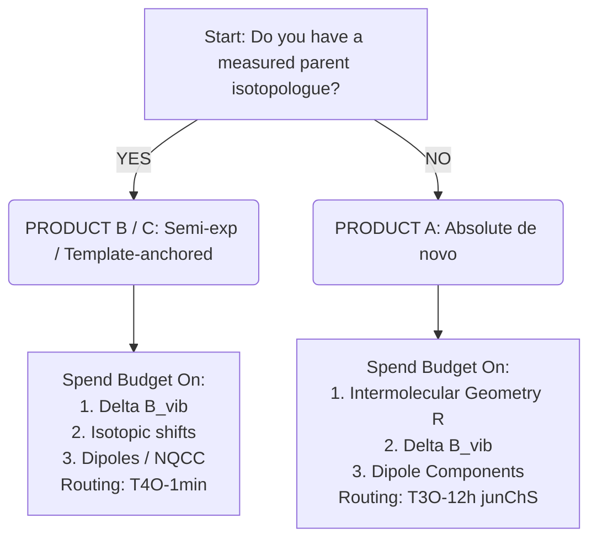

# CoChem v4 Master User Manual
**Version 2026.4.1 — Method Matrix v4 Architecture & High-Resolution Spectroscopic Guidelines**

> **Principal Investigator / Developer:** Dr. Joshua John Klaassen  
> **ORCiD:** [https://orcid.org/0009-0007-1506-4401](https://orcid.org/0009-0007-1506-4401)  
> **GitHub CoChem Organization:** [ProfJJK-CoChem](https://github.com/ProfJJK-CoChem)  
> **GitHub Repositories List:** [Repositories](https://github.com/orgs/ProfJJK-CoChem/repositories)  

---

## Table of Contents

- [Preface: The Method Matrix v4 Discipline](#preface-the-method-matrix-v4-discipline)
  - [Foreword & Ecosystem Philosophy](#foreword--ecosystem-philosophy)
  - [Detailed Catalog of the 15 Core Modules](#detailed-catalog-of-the-15-core-modules)
  - [Inter-Module Data Flow & QCSchema Specification](#inter-module-data-flow--qcschema-specification)
  - [The Method Matrix v4 Standards & Provenance Discipline](#the-method-matrix-v4-standards--provenance-discipline)
  - [How to Cite CoChem & Automated Citation Generation](#how-to-cite-cochem--automated-citation-generation)
- [Chapter 1: Quickstart, Method Matrix Tiering & System Architecture](#chapter-1-quickstart-method-matrix-tiering--system-architecture)
  - [1.1 The v4 Tier-Based Routing System & Wall-Clock Budgets](#11-the-v4-tier-based-routing-system--wall-clock-budgets)
  - [1.2 Product Classes A, B, C & Target Accuracy Definitions](#12-product-classes-a-b-c--target-accuracy-definitions)
  - [1.3 Method Matrix Routing Decision Tree](#13-method-matrix-routing-decision-tree)
  - [1.4 Hardware Routing & Modern GPU Acceleration Reality](#14-hardware-routing--modern-gpu-acceleration-reality)
  - [1.5 System Deployment Models, Licensing & Cloud Limits](#15-system-deployment-models-licensing--cloud-limits)
  - [1.6 CoChem-DOCK: Telemetry, WebSockets & Decimated Array Streaming](#16-cochem-dock-telemetry-websockets--decimated-array-streaming)
  - [1.7 OS Agnosticism & Pathlib Routing](#17-os-agnosticism--pathlib-routing)
- [Chapter 2: Molecular Ingestion, Triage & Provenance (CoChem-MInt)](#chapter-2-molecular-ingestion-triage--provenance-cochem-mint)
  - [2.1 The Unified Ingestion Dashboard & Input Parsing](#21-the-unified-ingestion-dashboard--input-parsing)
  - [2.2 Rigid vs. Weak Complex Branching Logic](#22-rigid-vs-weak-complex-branching-logic)
  - [2.3 Sandboxed Fast Triage & The Eckart Coordinate Frame](#23-sandboxed-fast-triage--the-eckart-coordinate-frame)
  - [2.4 Physics Variable Setup & Spend Priority Hierarchy](#24-physics-variable-setup--spend-priority-hierarchy)
  - [2.5 Provenance Initialization & Semantic Audit Ledger](#25-provenance-initialization--semantic-audit-ledger)
- [Chapter 3: Topological Discovery, Deduplication & PES (TOPOS, SCAN, TORQ)](#chapter-3-topological-discovery-deduplication--pes-topos-scan-torq)
  - [3.1 Conformer & Isomer Exploration (T1 Routing)](#31-conformer--isomer-exploration-t1-routing)
  - [3.2 Two-Stage Deduplication Protocol: GOAT Primary + CREST Cross-Check](#32-two-stage-deduplication-protocol-goat-primary--crest-cross-check)
  - [3.3 MLFF-GOAT Integration Recipe & Boundary Constraints](#33-mlff-goat-integration-recipe--boundary-constraints)
  - [3.4 Geometry Optimization Preconditioning & Initial Hessians](#34-geometry-optimization-preconditioning--initial-hessians)
  - [3.5 Torsional Discovery & Internal Rotor Mechanics (TORQ)](#35-torsional-discovery--internal-rotor-mechanics-torq)
  - [3.6 Persistent HDF5 Potential Energy Surface Store (PESStore)](#36-persistent-hdf5-potential-energy-surface-store-pesstore)
  - [3.7 Active Learning, Dynamic PES Refinement & Lanczos/Davidson Solvers](#37-active-learning-dynamic-pes-refinement--lanczosdavidson-solvers)
- [Chapter 4: High-Precision Ab Initio Refinement (BENCH & CROWN)](#chapter-4-high-precision-ab-initio-refinement-bench--crown)
  - [4.1 Equilibrium ($B_e$) vs Ground-State ($B_0$) Rotational Constants](#41-equilibrium-b_e-vs-ground-state-b_0-rotational-constants)
  - [4.2 Intermolecular Geometry Convergence & Corrected %geom Block](#42-intermolecular-geometry-convergence--corrected-geom-block)
  - [4.3 Frozen-Monomer Composite Protocol](#43-frozen-monomer-composite-protocol)
  - [4.4 Focal-Point Gradient Acceleration](#44-focal-point-gradient-acceleration)
  - [4.5 Basis Set Superposition Error (BSSE) Geometry Corrections](#45-basis-set-superposition-error-bsse-geometry-corrections)
  - [4.6 Frozen-Core Bias & Core-Valence Electron Correlation](#46-frozen-core-bias--core-valence-electron-correlation)
  - [4.7 Quantum Engine Track Division: ORCA vs CFOUR](#47-quantum-engine-track-division-orca-vs-cfour)
  - [4.8 Multireference Diagnostics & Macroscopic Thermal Ensembles](#48-multireference-diagnostics--macroscopic-thermal-ensembles)
- [Chapter 5: Vibrational Averaging, Secondary Observables & Fitting (SpycFit & MUSE)](#chapter-5-vibrational-averaging-secondary-observables--fitting-spycfit--muse)
  - [5.1 Quantum Vibrational Averaging & Jensen's Inequality](#51-quantum-vibrational-averaging--jensens-inequality)
  - [5.2 Corrected Anharmonic VPT2 Displacement Counts](#52-corrected-anharmonic-vpt2-displacement-counts)
  - [5.3 Force-Field Recycling & The Ubbelohde Effect Safeguard](#53-force-field-recycling--the-ubbelohde-effect-safeguard)
  - [5.4 Secondary Spectroscopic Observables](#54-secondary-spectroscopic-observables)
  - [5.5 Permutation-Inversion Molecular Symmetry Groups](#55-permutation-inversion-molecular-symmetry-groups)
  - [5.6 Modern JAX Spectroscopy Fitting Engine & Pickett Interoperability](#56-modern-jax-spectroscopy-fitting-engine--pickett-interoperability)
  - [5.7 Human-in-the-Loop (HITL) Auto-Propose Assistant](#57-human-in-the-loop-hitl-auto-propose-assistant)
- [Chapter 6: Concurrency, State-Chaining, Telemetry & Dispatch (TORQ, NODE, SCRIBE, ORACLE)](#chapter-6-concurrency-state-chaining-telemetry--dispatch-torq-node-scribe-oracle)
  - [6.1 Heterogeneous Concurrency & Scout-and-Anchor Pipeline](#61-heterogeneous-concurrency--scout-and-anchor-pipeline)
  - [6.2 State Reuse & Canonical 11-Arrow Chaining Pipeline](#62-state-reuse--canonical-11-arrow-chaining-pipeline)
  - [6.3 Remote SLURM Cluster Dispatch (CoChem-NODE)](#63-remote-slurm-cluster-dispatch-cochem-node)
  - [6.4 Localized Retrieval-Augmented RAG Diagnostics (CoChem-ORACLE)](#64-localized-retrieval-augmented-rag-diagnostics-cochem-oracle)
  - [6.5 Cryptographic FAIR Data Synthesis & QCSchema Logging (CoChem-SCRIBE)](#65-cryptographic-fair-data-synthesis--qcschema-logging-cochem-scribe)
- [Chapter 7: Educational & Pedagogical Implementations](#chapter-7-educational--pedagogical-implementations)
  - [7.1 Foundational Concept Training (CoChem-PLAY1 & PLAY2)](#71-foundational-concept-training-cochem-play1--play2)
  - [7.2 The Gamified Curriculum (Academic Elo Tiers)](#72-the-gamified-curriculum-academic-elo-tiers)
  - [7.3 Undergraduate Curriculum Mapping (CoChem-CURE)](#73-undergraduate-curriculum-mapping-cochem-cure)
  - [7.4 Educational & Didactic Sandboxing (Strict Fencing)](#74-educational--didactic-sandboxing-strict-fencing)
  - [7.5 Capstone Grading & Telemetry (CoChem-LABS & EVAL)](#75-capstone-grading--telemetry-cochem-labs--eval)
  - [7.6 The Principal Investigator (PI) Draft Board](#76-the-principal-investigator-pi-draft-board)
  - [7.7 Teaching Tier Infrastructure Limits & Deployment](#77-teaching-tier-infrastructure-limits--deployment)

---

# Preface: The Method Matrix v4 Discipline

## Foreword & Ecosystem Philosophy
Welcome to CoChem Version 2026.4.1.

High-resolution molecular spectroscopy demands an unprecedented level of computational precision. Assigning a complex broadband rotational spectrum obtained via Chirped-Pulse Fourier Transform Microwave (CP-FTMW) spectroscopy requires predicting rotational constants ($A_0, B_0, C_0$) to within fractions of a percent, accurately forecasting dipole moment components ($\mu_a, \mu_b, \mu_c$), and calculating nuclear quadrupole coupling tensors ($\chi_{\alpha\beta}$) or centrifugal distortion parameters.

Historically, computational chemistry pipelines have suffered from an arbitrary selection of theoretical methods—often mixing electronic structure algorithms, basis sets, and convergence thresholds without rigorous quantitative error propagation. A user might run a default geometry optimization using Density Functional Theory (DFT) with loose criteria, invert the resulting moments of inertia, and wonder why the predicted spectrum is offset by hundreds of megahertz from experimental lines.

The **CoChem Ecosystem** unifies molecular ingestion, topological discovery, high-level *ab initio* refinement, vibrational averaging, and spectroscopic line-fitting into a hardware-aware, mathematically validated framework. CoChem v4 incorporates the **20260809 Method Matrix Specification**, establishing an uncompromising standard of scientific defensibility over heuristic convenience.

> **The Prime Directive of CoChem v4**: *Scientific Defensibility over Heuristic Convenience.* Where legacy pipelines silently deleted structural isomers using arbitrary spatial cutoffs, CoChem deploys two-stage deduplication (`GOAT` + `CREST`). Where standard scripts crashed near 180° linear angle singularities, CoChem deploys Cartesian projection protections. Every assumption is tagged with provenance metadata, and every deliverable is formatted for FAIR-compliant publication.

## Detailed Catalog of the 15 Core Modules
The CoChem v4 suite is composed of 15 decoupled, interoperable modules spanning ingestion, exploration, refinement, fitting, and telemetry:

| #  | Module Name   | Primary Domain / Responsibility   | Core Technology / Engine |
|----|---------------|-----------------------------------|--------------------------|
| 1  | **CoChem-UNITY**  | Installation & GUI Dashboard      | React / FastAPI          |
| 2  | **CoChem-MInt**   | Ingestion, Sanitization & Triage  | RDKit / GFN2-xTB / UFF   |
| 3  | **CoChem-TOPOS**  | Global Conformer Discovery        | ORCA GOAT / CREST NCI    |
| 4  | **CoChem-TORQ**   | Hindered Internal Rotation        | 1D Relaxed Scans / Pitzer|
| 5  | **CoChem-SCAN**   | PES Mapping & Active Learning     | MACE-OFF / QBC Sampling  |
| 6  | **CoChem-BENCH**  | Ab Initio Thermochemical Limit    | junChS / DLPNO-CCSD(T)   |
| 7  | **CoChem-CROWN**  | Non-Covalent Dimer Composites     | Frozen-Monomer Protocol  |
| 8  | **CoChem-SpycFit**| Spectroscopic Fitting & Autodiff  | JAX / Pickett pyckett    |
| 9  | **CoChem-MUSE**   | Automated Mass Substitution       | Kraitchman / Costain r_m |
| 10 | **CoChem-LUMOS**  | Photophysics & Radical Cleavage   | EOM-CCSD / Spin Contam   |
| 11 | **CoChem-KINETIC**| Master Equation & VTST Rates      | Variational TST / LZ Hop |
| 12 | **CoChem-PULSE**  | Non-Adiabatic Dynamics            | Surface Hopping / Wigner |
| 13 | **CoChem-NODE**   | Remote HPC Workload Scheduling    | SLURM / OpenMPI          |
| 14 | **CoChem-ORACLE** | LLM Retrieval-Augmented RAG       | llama.cpp / ChromaDB     |
| 15 | **CoChem-SCRIBE** | Provenance & FAIR Export          | QCSchema / Jinja2 LaTeX  |

Each module maintains a dedicated execution scope and API contract, ensuring modularity, OS-agnostic pathing (`pathlib`), and strict JSON-RPC data serialization.

## Inter-Module Data Flow & QCSchema Specification
The 15 modules communicate through explicit JSON-RPC and REST endpoints managed by the FastAPI server in UNITY. Inter-module data flow strictly follows the standard format (`qcjson`). When BENCH finishes a calculation, it emits an `AtomicResult` object containing the total electronic energy, gradient array, and wave-function diagnostic scalars. SCRIBE listens on the event bus, writing `AtomicResult` objects directly into the active HDF5 store (`PESStore`).

```json
{
  "schema_name": "qcschema_output",
  "schema_version": 1,
  "molecule": {
    "geometry": [0.0, 0.0, 0.0, 0.0, 0.0, 1.8],
    "symbols": ["O", "H"],
    "molecular_charge": 0,
    "molecular_multiplicity": 2
  },
  "driver": "energy",
  "model": {"method": "DLPNO-CCSD(T)", "basis": "def2-TZVPP"},
  "return_result": -75.38219482104,
  "success": true
}
```

## The Method Matrix v4 Standards & Provenance Discipline
To ensure absolute scientific rigor and eliminate unverified claims, CoChem v4 mandates a strict **Provenance Discipline**. Every quantitative value, error bound, benchmark accuracy, scaling metric, or hardware speedup cited within this manual and logged by the software engines must carry an explicit provenance tag:

1. **`[M]` — Measured**: Direct experimental measurement or authoritative benchmark dataset published in peer-reviewed literature.
2. **`[D]` — Derived**: Result obtained through exact mathematical deduction, closed-form equation, or formal scaling law.
3. **`[E]` — Estimated**: Expert estimate, heuristic extrapolation, or empirical rule-of-thumb based on domain knowledge.

> **Mandatory Provenance Enforcement Rule (Rule 7)**: *No `[D]` (derived) or `[E]` (estimated) value may serve as the sole justification for a hardware exclusion rule, an architectural routing gate, or an accuracy guarantee.* Where a `[D]` or `[E]` tag is assigned, local measurement `[M]` is required before gating production execution.

## How to Cite CoChem & Automated Citation Generation
CoChem orchestrates multiple theoretical chemistry packages (including ORCA, CFOUR, PySCF, Psi4, xtb, MACE-OFF, AIMNet2, Libint, and JAX). Proper attribution to the underlying theoretical methods and software packages is mandatory.

* **ORCA:** [DOI: 10.1002/wcms.1462](https://doi.org/10.1002/wcms.1462)
* **CFOUR:** [DOI: 10.1063/5.0004837](https://doi.org/10.1063/5.0004837)
* **MPQC:** [DOI: 10.1016/j.cpc.2020.107415](https://doi.org/10.1016/j.cpc.2020.107415)
* **Libint:** [DOI: 10.1002/wcms.1504](https://doi.org/10.1002/wcms.1504)

During execution, CoChem's telemetry module (`CoChem-SCRIBE`) automatically generates a BibTeX file (`cochem_references.bib`) customized to the exact execution path and algorithms invoked during your calculation.

---

# Chapter 1: Quickstart, Method Matrix Tiering & System Architecture

## 1.1 The v4 Tier-Based Routing System & Wall-Clock Budgets
CoChem v4 replaces legacy unstructured pipelines with a 10-tier wall-clock budget matrix. Rather than specifying arbitrary computational flags, workflows are routed based on an explicit target wall-clock time limit across ten standard tiers:

$$\text{Budgets} \in \{ \mathbf{10s},\, \mathbf{1min},\, \mathbf{30min},\, \mathbf{1h},\, \mathbf{3h},\, \mathbf{12h},\, \mathbf{1d},\, \mathbf{3d},\, \mathbf{1w},\, \mathbf{1mo} \}$$

These govern distinct operational tiers ($T1$ through $T10$):
- **T1**: Conformer & Isomer Search
- **T2**: Intermolecular Potential Surfaces & Active Learning
- **T3**: Equilibrium Geometry & $B_e$
- **T4**: Vibrational Averaging & Ground-State $B_0$
- **T5**: Interaction Energies
- **T6**: Secondary Spectroscopic Observables
- **T7**: Internal Rotation & Tunnelling
- **T8**: Vibrational Spectra (IR/THz)
- **T9**: Raman Spectra
- **T10**: NMR, UV-Vis & MS

## 1.2 Product Classes A, B, C & Target Accuracy Definitions

| Product Class | Prerequisite | Achievable $B_0$ Accuracy |
|---|---|---|
| **Class A (de novo)** | Zero experimental data | +/- 0.3 - 0.5% [D] (semi-rigid) <br> +/- 1.0 - 2.0% [D] (floppy) |
| **Class B (Template)** | 1 measured parent isotopologue | <= 0.1% (typically 0.03% to 0.06% [M]) |
| **Class C (Diffs)** | Measured reference state | 0.02% - 0.1% [M] |

> **Fundamental Rule**: *No quantum chemistry protocol can claim sub-0.1% de novo accuracy for absolute ground-state rotational constants $B_0$ of floppy van der Waals complexes.*

## 1.3 Method Matrix Routing Decision Tree



## 1.4 Hardware Routing & Modern GPU Acceleration Reality
Legacy guidelines frequently contained an incorrect exclusion: claiming GPUs had "no legitimate role" in electronic structure calculations due to double-precision (FP64) performance limits. CoChem v4 completely overturns this exclusion based on quantitative hardware measurements.

The evaluation of two-electron Repulsion Integrals (ERIs) in modern quantum chemistry software is **memory-bandwidth, register-file, and thread-occupancy bound**, rather than bound by raw FP64 FLOPS. Modern NVIDIA GPUs feature massive memory bandwidth (>3.0 TB/s [M]) and execute in full double precision with zero loss of numerical precision against CPU calculations.

### System Size Crossover Analysis
GPU acceleration exhibits a distinct system-size crossover point driven by hardware occupancy.
- **Crossover Gate**: The GPU crossover threshold is quantitatively verified at **$N \approx 150\text{ to } 170$ basis functions against 32 CPU cores [M]**.
- **Routing Rule**: Workflows default to CPU execution for small systems ($N < 150$ basis functions) unless local measured benchmark data [M] demonstrates GPU speedup on the target hardware.

### Multi-Process Service (MPS)
When executing high-throughput conformer searches, running a single GPU job leaves >80% of GPU CUDA cores idle. CoChem v4 mandates the deployment of NVIDIA MPS.
- **Optimal MPS Worker Ceiling**: 2 to 4 workers per GPU, backed by 1 dedicated CPU P-core per GPU worker.

## 1.5 System Deployment Models, Licensing & Cloud Limits
CoChem v4 supports three primary hardware deployment models backing the Valeev Stack (MPQC, TiledArray, MADNESS, Libint):

1. **Model A (GitHub Codespaces / Cloud CI/CD)**: Lightweight cloud container environment. Maximum job execution time of 6 hours, 20 concurrent jobs. Integrates with **ChemCompute** for free university access to NSF-funded supercomputing.
2. **Model B (Local Workstation)**: Dedicated workstation equipped with an NVIDIA GPU and CPU core pinning (e.g., `KMP_HW_SUBSET=8c:intel_core,1t`).
3. **Model C (HPC Cluster)**: Multi-node SLURM cluster running parallel jobs across Infiniband interconnects.

**Licensing Restrictions**: ORCA binary redistribution in shared cloud containers or public Docker images is strictly forbidden. Public teaching containers must deploy open-source alternatives.

## 1.6 CoChem-DOCK: Telemetry, WebSockets & Decimated Array Streaming
High-throughput quantum chemistry calculations generate massive streams of stdout logging and dense numerical arrays. `CoChem-DOCK` decouples job execution from the user interface by spinning up a localized FastAPI WebSocket server.

**Largest-Triangle-Three-Buckets (LTTB) Decimation**:
Rendering $10^7$ coordinate pairs in browser WebGL canvases triggers instant OOM crashes. `CoChem-DOCK` mathematically downsamples $10^7$ points to exactly 5,000 points while preserving peak maxima, absorption line shapes, and baseline noise features.

$$\text{Area} = \frac{1}{2} \left| A_x (B_y - C_y) + B_x (C_y - A_y) + C_x (A_y - B_y) \right|$$

## 1.7 OS Agnosticism & Pathlib Routing
All internal file generation, I/O routing, and directory scaffolding must use Python's `pathlib.Path()` to guarantee seamless interoperability across Windows, macOS, and Linux HPC environments by dynamically resolving forward and backslashes.

---

# Chapter 2: Molecular Ingestion, Triage & Provenance (CoChem-MInt)

## 2.1 The Unified Ingestion Dashboard & Input Parsing
The **CoChem-MInt** (Molecular Ingestion & Triage) module acts as the strict entry gatekeeper for all chemical structures. MInt accepts input from SMILES strings, IUPAC names, PubChem CIDs, or Coordinate File Uploads (`.xyz`, `.pdb`, etc.).

## 2.2 Rigid vs. Weak Complex Branching Logic
Certain high-efficiency heuristics fail catastrophically on floppy van der Waals complexes. The ingestion module will tag molecules as `[Rigid]` or `[Weak_Complex]`, enabling selective algorithmic offerings based on the underlying physics.
* **[Rigid]**: Enabled for advanced heuristic scaling (e.g., Template-Scaled Semi-Experimental Shifts, Focal-Point Gradient Acceleration).
* **[Weak_Complex]**: Strict standard physics optimization workflows; heuristics are blocked and hidden from the UI to prevent unphysical distortions driven by dispersion errors.

## 2.3 Sandboxed Fast Triage & The Eckart Coordinate Frame
Before invoking expensive quantum mechanical solvers, incoming geometries undergo structural sanitization.
1. The origin of the Cartesian coordinate system is shifted strictly to the molecular Center of Mass (COM).
2. Geometries are aligned to the standard **Eckart Frame**, ensuring that spatial RMSD checks during conformer deduplication are invariant to translational and rotational shifts.

$$\sum_{i=1}^N m_i \left( \mathbf{r}_i^0 \times \mathbf{r}_i \right) = \mathbf{0}$$

## 2.4 Physics Variable Setup & Spend Priority Hierarchy
CoChem v4 enforces a strict **Spend Priority Hierarchy** to optimize computational expenditure.
> **Key Rule**: *Compute budget must be expended on intermolecular geometry optimization and vibrational corrections BEFORE attempting high-level calculations of interaction energies ($D_0$) or hyper-fine coupling.* Intermolecular geometry errors dominate rotational constants.

## 2.5 Provenance Initialization & Semantic Audit Ledger
At the conclusion of ingestion, MInt generates `fit_provenance.json`. This JSON ledger records SHA-256 cryptographic hashes of all input coordinates, active software versions, and mandatory `[M]`, `[D]`, and `[E]` provenance tags assigned to baseline assumptions.

---

# Chapter 3: Topological Discovery, Deduplication & PES (TOPOS, SCAN, TORQ)

## 3.1 Conformer & Isomer Exploration (T1 Routing)
The **CoChem-TOPOS** module conducts global conformational searching across potential energy surfaces. Workflows are routed according to target wall-clock budgets, dynamically orchestrating execution among engines like GOAT, CREST, and MLFFs.

## 3.2 Two-Stage Deduplication Protocol: GOAT Primary + CREST Cross-Check
Legacy conformer search pipelines frequently relied on a single search engine (such as CREST alone). CoChem v4 incorporates a mandatory **Two-Stage Deduplication Protocol**:
1. **Primary Exploration**: Stochastic uphill potential pushing using ORCA GOAT.
2. **Secondary Cross-Check**: Executing `crest --nci --nocross --noreftopo`.
   * *Rationale*: The `--noreftopo` flag is required because standard CREST assumes fixed covalent topology. For hydrogen-bonded complexes, rearrangement changes topological connectivity graphs.

## 3.3 MLFF-GOAT Integration Recipe & Boundary Constraints
CoChem v4 enables high-speed Machine Learning Force Field (MLFF) conformer discovery via ORCA's external optimizer interface (`!ExtOpt GOAT`).

> **CRITICAL WARNING**: *When bridging ASE calculators to ORCA, failure to invert the gradient sign ($\mathbf{g} = -\mathbf{F}$) causes the ORCA optimizer to interpret forces as positive gradients, driving the molecular structure UPHILL toward high-energy explosive dissociation.*

**MLFF Accuracy Boundary**: Foundation MLFFs (MACE-OFF23, AIMNet2) exhibit interaction energy errors of 3.5 to 7.3 kcal/mol on non-covalent benchmark sets [M]. They must act strictly as high-speed topology ENUMERATORS, never as final judges.

## 3.4 Geometry Optimization Preconditioning & Initial Hessians
Legacy user manuals recommended setting `Calc_Hess` in ORCA optimization blocks to compute an exact initial Hessian at step 0. CoChem v4 **strictly forbids `Calc_Hess`** for geometry optimizations due to extreme cost with zero effective acceleration on convergence steps. Initial Hessians should be generated using low-cost model approximations (`InHess XTB2`).

## 3.5 Torsional Discovery & Internal Rotor Mechanics (TORQ)
`CoChem-TORQ` isolates flexible torsions, evaluates internal rotor reduced moments $F(\phi)$, and outputs 1D potential curves for barrier fitting. Theoretical calculations of 3-fold internal rotation barriers ($V_3$) using DFT carry an intrinsic accuracy cap of **$\pm 14\%$ [M]** against experimental splittings.

## 3.6 Persistent HDF5 Potential Energy Surface Store (PESStore)
CoChem v4 replaces temporary output text parsing with a persistent, centralized **HDF5 Potential Energy Surface Store**. The HDF5 `scaleoffset` lossy filter is **strictly forbidden** for energy fields, as truncating energy mantissas introduces artificial noise into gradient numerical differentiation.

## 3.7 Active Learning, Dynamic PES Refinement & Lanczos/Davidson Solvers
For high-dimensional potential surface mapping, running uniform grid sampling is computationally intractable. `CoChem-SCAN` deploys active learning via Query-By-Committee (QBC) uncertainty sampling.
For 3D/6D Discrete Variable Representation (DVR) grids, CoChem mandates the use of **Matrix-Free Lanczos/Davidson Diagonalization**. Matrices are computed "on-the-fly" ($\mathbf{H}\vec{v}$) rather than stored in memory, dropping RAM overhead from 33+ GB down to megabytes.

---

# Chapter 4: High-Precision Ab Initio Refinement (BENCH & CROWN)

## 4.1 Equilibrium ($B_e$) vs Ground-State ($B_0$) Rotational Constants
- **$B_e$**: Equilibrium structural minimum with no zero-point motion.
- **$B_0$**: Vibrationally averaged state measured experimentally. 

Vibrational contributions $\Delta B_{\text{vib}}$ account for **$0.1\%$ to $0.7\%$ of the total rotational constant magnitude**, and up to 2.0% for soft van der Waals modes.

## 4.2 Intermolecular Geometry Convergence & Corrected %geom Block
Default geometry optimization thresholds (`!Opt`) are engineered for rigid covalent bonds and are inadequate for non-covalent complexes. To restrict geometry-induced rotational errors below $0.05\%$, CoChem v4 mandates tightening gradient and displacement thresholds by a factor of 30 relative to default `!Opt`.

## 4.3 Frozen-Monomer Composite Protocol
When calculating non-covalent complexes, high-level composite methods can be extremely expensive. Covalent monomer geometry error dominates the $A$ rotational constant, while intermolecular distance $R$ dominates $B$ and $C$.
The **Frozen-Monomer Composite Protocol** optimizes isolated monomers at high ab initio levels, then freezes internal geometry and selectively optimizes only the 6 intermolecular degrees of freedom. This is designated as the **Strongly Recommended Default** (pre-checked in UI), but the user maintains full authority to execute a fully relaxed intermolecular optimization.

## 4.4 Focal-Point Gradient Acceleration
Offered as a high-speed CCSD(T)/Large-Basis approximation option *only* for systems flagged as `[Rigid]`. Blocked for `[Weak_Complex]` systems, as small basis set gradients lack diffuse functions necessary for dispersion and are highly susceptible to BSSE contamination.

## 4.5 Basis Set Superposition Error (BSSE) Geometry Corrections
Counterpoise-corrected geometry optimization (`! CP`) or explicit CP-corrected composite schemes are mandatory when using non-augmented triple-zeta basis sets to prevent BSSE from unphysically shortening intermolecular distances.

## 4.6 Frozen-Core Bias & Core-Valence Electron Correlation
Valence-only frozen-core calculations (`fc-CCSD(T)`) ignore the correlation energy of deep 1s core electrons, yielding a systematic bias. No workflow may claim $\le 0.5\%$ accuracy in $B_e$ without explicit core-valence corrections.

## 4.7 Quantum Engine Track Division: ORCA vs CFOUR
* **CFOUR Track**: Owns all coupled-cluster anharmonic force fields (VPT2), sextic centrifugal distortion, and analytic analytical Hessians.
* **ORCA Track**: Owns conformer searching, DLPNO single points, and DFT-level VPT2.

## 4.8 Multireference Diagnostics & Macroscopic Thermal Ensembles
Single-reference coupled-cluster calculations parse the $T_1$ diagnostic. If $T_1 > 0.02$ (closed-shell), the calculation triggers a fallback warning to multireference solvers. Thermodynamic corrections feed Boltzmann ensemble calculations to predict macroscopic spectral distributions.

---

# Chapter 5: Vibrational Averaging, Secondary Observables & Fitting (SpycFit & MUSE)

## 5.1 Quantum Vibrational Averaging & Jensen's Inequality
Vibrational averaging must compute the expectation value of the inverse moment of inertia tensor $\mathbf{I}^{-1}$ over the ground-state vibrational wavefunction. A frequent mathematical error is averaging the moments of inertia $I$ first and then inverting. By **Jensen's Inequality**, inverting after averaging systematically **underestimates the true rotational constant**, causing severe multi-MHz frequency drift.
* **Rule**: Vibrational averaging MUST evaluate the element-wise inverse inertia tensor expectation value $\left\langle \mathbf{I}^{-1} \right\rangle$ prior to scalar conversion.

## 5.2 Corrected Anharmonic VPT2 Displacement Counts
For a non-linear molecule with $N$ atoms, the exact number of Hessian evaluations required for semi-diagonal cubic force field evaluation is **$6N - 11$**.

## 5.3 Force-Field Recycling & The Ubbelohde Effect Safeguard
A single force field can be recycled across all isotopologues at zero electronic-structure cost using mass-weighted transformation, yielding up to a 15x compute savings. 
> **HITL Constraint (Ubbelohde Effect Guard)**: The `orca_vib` Hessian recycling is approved for Heavy-Atom Substitutions only. If the pipeline detects a Hydrogen $\rightarrow$ Deuterium substitution, execution pauses to warn the user of the Ubbelohde Effect (geometric contraction due to lowered zero-point energy). The user must manually approve the shortcut.

## 5.4 Secondary Spectroscopic Observables
Dipole moments must be evaluated in the Principal Axis System (PAS) with explicit signs retained. Quadrupole coupling constants require core-polarized basis sets with uncontracted diffuse functions.

## 5.5 Permutation-Inversion Molecular Symmetry Groups
For non-rigid molecules exhibiting internal rotation or tunnelling, CoChem deploys Longuet-Higgins Molecular Symmetry (MS) Groups. Point-group symmetry tools are restricted for these topologies.

## 5.6 Modern JAX Spectroscopy Fitting Engine & Pickett Interoperability
`CoChem-SpycFit` ports Watson A- and S-reduced centrifugally distorted Hamiltonians into JAX. Autodiff computes analytical Jacobians, accelerating Levenberg-Marquardt fitting without finite-difference gradient noise. It exports validated `.par`, `.int`, and `.cat` files fully compatible with Pickett conventions.

## 5.7 Human-in-the-Loop (HITL) Auto-Propose Assistant
The pipeline deploys a Bipartite Peak Matching (Hungarian Algorithm) engine exclusively as an **Auto-Propose Assistant**. 
> **Constraint**: Zero automatic fitting is permitted. The GUI will draw dashed lines proposing theoretical-to-experimental assignments. The spectroscopist must drag, drop, modify, or ignore proposed peaks and explicitly click "Approve" before the JAX fitter executes.

---

# Chapter 6: Concurrency, State-Chaining, Telemetry & Dispatch (TORQ, NODE, SCRIBE, ORACLE)

## 6.1 Heterogeneous Concurrency & Scout-and-Anchor Pipeline
High-throughput workflows often suffer from resource contention. The Scout-and-Anchor Pipeline resolves this via isolated thread pools:
* **Scout Stream (GPU-Bound)**: MLFFs scanning and rapidly generating advisory topologies.
* **Anchor Stream (CPU-Bound)**: Dedicated CPU ranks validating minima using precise *ab initio* gradients.

## 6.2 State Reuse & Canonical 11-Arrow Chaining Pipeline
The single most valuable computational asset in a spectroscopic pipeline is a converged geometry. Reusing a converged geometry saves massive computational overhead. Strict state transfer protection rules govern all data handoffs between quantum programs.

## 6.3 Remote SLURM Cluster Dispatch (CoChem-NODE)
`CoChem-NODE` acts as the translation layer generating SLURM `.sbatch` job directives. It features a **Registry Healer** daemon that automatically adopts orphaned asynchronous SLURM jobs upon client reconnect.

## 6.4 Localized Retrieval-Augmented RAG Diagnostics (CoChem-ORACLE)
When quantum calculations fail, `CoChem-ORACLE` provides localized error diagnostics using a `llama.cpp` LLM engine. ORACLE queries an offline ChromaDB SQLite vector store containing CoChem manual chunks to eliminate hallucinated diagnostic suggestions.

## 6.5 Cryptographic FAIR Data Synthesis & QCSchema Logging (CoChem-SCRIBE)
Generates SHA-256 environment hashes locking dependencies and CODATA constants. Serializes outputs into standardized JSON QCSchema files and automated peer-review-ready LaTeX tables (`siunitx`, `booktabs`).

---

# Chapter 7: Educational & Pedagogical Implementations

## 7.1 Foundational Concept Training (CoChem-PLAY1 & PLAY2)
* **PLAY1**: Uses WebAssembly (WASM) and RDKit to mathematically validate student molecule drawing against strict VSEPR rules, intercepting physically impossible geometries (e.g., a "Texas Carbon").
* **PLAY2**: Places 3D molecules into a "Macroscopic Arena" to visualize dipole vectors and electrostatic forces dynamically.

## 7.2 The Gamified Curriculum (Academic Elo Tiers)
**CoChem-PLAY** implements an Academic Elo Tier System progressively scaling from Tier 1 (Novice diatomic) up to Tier 5 (Expert fluxional topologies).

## 7.3 Undergraduate Curriculum Mapping (CoChem-CURE)
For upper-level physical chemistry courses, the pipeline implements Course-Based Undergraduate Research Experiences, such as High-Energy Photolysis modeling.
* **Abstract Syntax Tree (AST) Evasion Auditing**: Mathematically parses Python execution structures to prevent students from hardcoding answers, flagging evasions instantly.

## 7.4 Educational & Didactic Sandboxing (Strict Fencing)
To preserve the integrity of the research pipeline, pedagogical features are strictly segregated into the **SEED, PLAY, CURE, EVAL, and LABS** environments. 
**Integrated Pedagogical Safeguards**: Automated Plagiarism Traps, Dual-Registry Gradebook Firewall, Temporal Collusion Detection (flagging identically complex topological pushes within 15 seconds), Individual Contribution Index (ICI) scoring, and Authentic Experimental Noise Training.
*(Canvas Token Secure Vaulting and Socratic Logarithmic Decay Scoring are permanently redacted from implementation.)*

## 7.5 Capstone Grading & Telemetry (CoChem-LABS & EVAL)
Automated cryptographic payloads (`.cochem_submission.sha256`) prevent tampering between local student machines and LMS systems. 

## 7.6 The Principal Investigator (PI) Draft Board
Provides a ranked DataFrame identifying students with high Research Potential Index (RPI) based on problem recovery and 3D interaction telemetry, aiding in data-driven academic recruitment.

## 7.7 Teaching Tier Infrastructure Limits & Deployment
Educational module configurations must strictly comply with GitHub Actions 6-hour runner caps and ORCA OS licensing restrictions. Student labs must rely on local PySCF/Psi4 engines or safely route computations through **ChemCompute** for supercomputing infrastructure.
