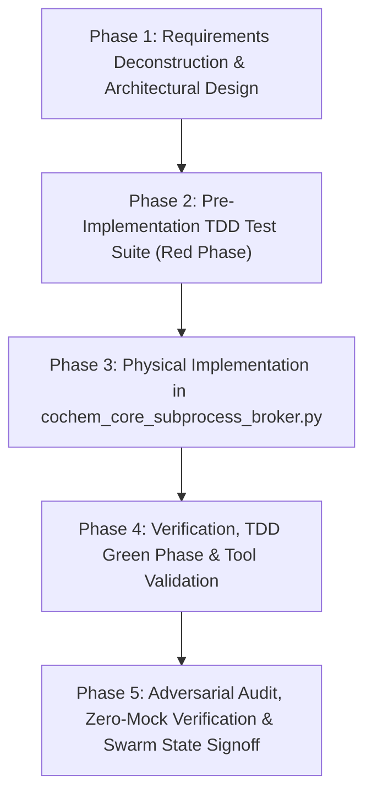

# CoChem-BASE Work Breakdown Structure (WBS) & Task List

**Project Target**: Stage 3.0 Subprocess Broker Architecture & HPC Execution Engine (`core_engine/cochem_core_subprocess_broker.py`)  
**Specification References**:  
- `Doc7_01_subprocess_broker_prompt.md` (Subprocess Broker & HPC Execution Engine)
- [`D:\__CoChem\GitHub-Repo\CoChem-BASE\Method_Matrix.md`](file:///D:/__CoChem/GitHub-Repo/CoChem-BASE/Method_Matrix.md)
- [`D:\__CoChem\GitHub-Repo\CoChem-BASE\cochem_base\exceptions.py`](file:///D:/__CoChem/GitHub-Repo/CoChem-BASE/cochem_base/exceptions.py) (`DiskQuotaError`, `ProvenanceErrorCode.DISK_QUOTA_EXCEEDED`)
- [`D:\__CoChem\GitHub-Repo\CoChem-BASE\cochem_system_config.json`](file:///D:/__CoChem/GitHub-Repo/CoChem-BASE/cochem_system_config.json)
**Target Code Artifact**: [`core_engine/cochem_core_subprocess_broker.py`](file:///D:/__CoChem/GitHub-Repo/CoChem-BASE/core_engine/cochem_core_subprocess_broker.py)  
**Target Test Artifact**: [`test_suite/test_cochem_core_subprocess_broker.py`](file:///D:/__CoChem/GitHub-Repo/CoChem-BASE/test_suite/test_cochem_core_subprocess_broker.py)  
**Configuration & Registry**: [`pytest.ini`](file:///D:/__CoChem/GitHub-Repo/CoChem-BASE/pytest.ini), [`swarm_state.json`](file:///D:/__CoChem/GitHub-Repo/CoChem-BASE/swarm_state.json)  
**Governance Framework**: PMBOK Guide 7th Edition & SWEBOK v3 (Software Construction, Testing, SCM)  
**Core Mandates**: Strict Zero-Mock Mandate, Cross-Platform Hardware Pinning, Pre-Flight Quota Gate (>50GB), Autonomous RAM-Disk Routing (>128GB), CurveZMQ Loopback Security, Dead-Man's Switch (60s), Win32 Job Object & POSIX Process Group Zombie Reaper  

---

## 1. PROJECT CHARTER & ARCHITECTURAL BASELINE

### 1.1 Executive Summary & Strategic Objective
The CoChem Subprocess Broker serves as the central **High-Performance Computing (HPC) & Computational Quantum Chemistry Subprocess Orchestrator** across the CoChem platform. It isolates, executes, monitors, and cleans up complex multi-threaded quantum chemistry engines (ORCA, PySCF, xTB, Gaussian, Q-Chem, MACE-Torch). The objective of this project increment is to engineer, harden, and validate the enterprise-grade capabilities of [`cochem_core_subprocess_broker.py`](file:///D:/__CoChem/GitHub-Repo/CoChem-BASE/core_engine/cochem_core_subprocess_broker.py) in strict compliance with `Doc7_01_subprocess_broker_prompt.md`.

### 1.2 Core Architectural Requirements & Scope Inclusions

#### A. NUMA-Aware Hardware Thread-Pinning & Oversubscription Prevention
1. **Dynamic Topology Evaluation**: Inspect host CPU topology (physical vs. logical cores, NUMA nodes, socket distribution) using `psutil`, `/sys/devices/system/node`, and platform-native introspection.
2. **CPU Affinity Abstraction**: Provide robust `enforce_cpu_affinity(pid, cpu_cores)` binding with support for multi-socket NUMA domains and processor groups on Windows (>64 cores).
3. **Cross-Platform Guards**:
   - **Linux**: Kernel `sched_setaffinity` via `psutil.Process().cpu_affinity()`.
   - **Windows**: `SetProcessAffinityMask` / `psutil.Process().cpu_affinity()` with processor group resilience.
   - **macOS (Darwin)**: Graceful degradation with informational telemetry logging since the XNU/Darwin kernel does not expose user-space thread affinity binding.
4. **Multi-Rank OpenMPI Detection & Thread Guarding**:
   - Detect MPI environments via `OMPI_COMM_WORLD_SIZE`, `PMI_SIZE`, `MPI_LOCALRANKID`, `SLURM_NTASKS`, etc.
   - When multi-rank execution is detected ($N_{\text{rank}} > 1$), automatically inject and force `OMP_NUM_THREADS="1"`, `MKL_NUM_THREADS="1"`, `OPENBLAS_NUM_THREADS="1"`, `VECLIB_MAXIMUM_THREADS="1"`, and `NUMEXPR_NUM_THREADS="1"` unless explicitly overridden, eliminating $N_{\text{rank}} \times N_{\text{threads}}$ CPU oversubscription and cache thrashing.

#### B. Pre-Flight Disk Quota & RAM-Disk Routing
1. **Pre-Flight Disk Quota Gate**:
   - Evaluate scratch directory capacity via `shutil.disk_usage()`.
   - Enforce a strict pre-flight requirement of $>50\,\text{GB}$ free scratch space.
   - If free disk space is $<50\,\text{GB}$, immediately abort and raise `DiskQuotaError` from `cochem_base.exceptions` with detailed metadata (`required_gb=50.0`, `available_gb`, `path`).
   - Execute a 64 KB unbuffered binary read/write probe with SHA-256 validation and `os.fsync()` to verify physical disk responsiveness.
2. **Autonomous RAM-Disk Overlay Routing**:
   - Check total system RAM via `psutil.virtual_memory().total`.
   - When $\text{Total\_RAM\_GB} > 128\,\text{GB}$, automatically allocate an ephemeral, high-speed RAM-disk overlay for heavy scratch operations (integrals, density matrices):
     - **Linux**: `/dev/shm` or autonomous `tmpfs` mount.
     - **macOS Darwin**: `hdiutil attach -nomount ram://<sectors>` / ephemeral HFS+/APFS RAM volume.
     - **Windows**: Windows Dev Drive (ReFS) / high-speed memory-backed scratch.
   - Automatically sync and copy valid quantum artifacts back to permanent workspace before scratch cleanup.
3. **User/Job-Specific Directory Lockdown**:
   - Create isolated job directories: `cochem_exec_<job_id>_<timestamp>`.
   - **POSIX**: Enforce `chmod 700` (`0o700`) restricting access strictly to process owner.
   - **Windows**: Apply `icacls <dir> /inheritance:r /grant:r "%USERNAME%:(OI)(CI)F"` or DACL hardening to prevent unauthorized multi-user access.

#### C. ZeroMQ Heartbeat Integration & Dead-Man's Switch
1. **ZeroMQ Transport Abstraction & CurveZMQ Security**:
   - **POSIX**: Bind to local IPC socket `ipc:///tmp/cochem_heartbeat_<job_id>.ipc`.
   - **Windows**: Bind to loopback TCP socket `tcp://127.0.0.1:*` with CurveZMQ (`zmq.curve_keypair()`, public/private key authentication) to ensure encrypted, authenticated, tamper-proof loopback telemetry.
   - Background publisher thread broadcasting JSON telemetry frames (timestamp, PID, CPU affinity mask, memory RSS/VMS, child process count, job status, dispatch audit hash).
2. **Dead-Man's Switch Watchdog**:
   - Monitor heartbeat signal frequency.
   - Enforce a 60-second timeout threshold.
   - If no heartbeat is received within 60 seconds, trip the switch: transition job state into `DAEMON` detached mode or execute safe emergency termination/checkpointing.
3. **Advanced Zombie Process Reaper**:
   - **Windows**: Win32 Job Objects integration (`CreateJobObjectW`, `SetInformationJobObject` with `JOB_OBJECT_LIMIT_KILL_ON_JOB_CLOSE`), ensuring that if the parent Python process is terminated, the Windows kernel atomically kills all child processes.
   - **POSIX**: Process group isolation (`os.setsid()`) and group termination (`os.killpg(os.getpgid(pid), signal.SIGTERM/SIGKILL)`).
   - Global `atexit` registration and instance-level teardown ensuring zero leaked child processes.

#### D. Professional Pytest Test Suite & Zero-Mock Compliance
1. **Targeted Test Execution**:
   - Restrict `pytest.ini` to `testpaths = test_suite/test_cochem_core_subprocess_broker.py`.
2. **Zero-Mock Mandate**:
   - Strictly 0 mocks, 0 `unittest.mock`, 0 `MagicMock`, 0 stubs.
   - Real physical subprocess spawns, real file I/O, real permission ACLs, real ZeroMQ sockets, real CPU affinity binding, real Win32 Job Objects / POSIX process groups.

---

## 2. WORK BREAKDOWN STRUCTURE (WBS) & DETAILED TASK LIST

### Phase 1: Requirements Deconstruction, Architecture & Interface Specification
- [ ] **Task 1.1: Requirements & SCM Baseline Deconstruction** (Agent: `researcher`)
  - [ ] Sub-task 1.1.1: NUMA & Thread-Pinning Hardware Specification (Agent: `researcher`)
    - [ ] Sub-sub-task 1.1.1.1: Detail `psutil` affinity mechanics, `/sys/devices/system/node` Linux topology, and Windows processor groups. (Agent: `researcher`)
    - [ ] Sub-sub-task 1.1.1.2: Specify MPI environment variables (`OMPI_COMM_WORLD_SIZE`, `PMI_SIZE`, `SLURM_NTASKS`, `MPI_LOCALRANKID`) and `OMP_NUM_THREADS=1` override rules. (Agent: `researcher`)
    - [ ] Sub-sub-task 1.1.1.3: Specify macOS Darwin graceful degradation protocol for thread affinity. (Agent: `researcher`)
  - [ ] Sub-task 1.1.2: Scratch Quota & Autonomous RAM-Disk Overlay Specification (Agent: `researcher`)
    - [ ] Sub-sub-task 1.1.2.1: Specify 50 GB pre-flight capacity assertion via `shutil.disk_usage()` and `DiskQuotaError` schema. (Agent: `researcher`)
    - [ ] Sub-sub-task 1.1.2.2: Specify 128 GB Total RAM threshold and OS-specific RAM-disk mounting (`tmpfs` on Linux, `hdiutil` on macOS, Windows Dev Drive). (Agent: `researcher`)
    - [ ] Sub-sub-task 1.1.2.3: Specify security permissions (`chmod 700` POSIX, `icacls` Windows) for isolated job subdirectories. (Agent: `researcher`)
  - [ ] Sub-task 1.1.3: ZeroMQ Heartbeat, CurveZMQ Security & Dead-Man's Switch Specification (Agent: `researcher`)
    - [ ] Sub-sub-task 1.1.3.1: Specify `ipc://` (POSIX) vs `tcp://127.0.0.1:*` with CurveZMQ keypair exchange (Windows). (Agent: `researcher`)
    - [ ] Sub-sub-task 1.1.3.2: Specify 60-second Dead-Man's Switch watchdog timeout and `DAEMON` state transition protocol. (Agent: `researcher`)
  - [ ] Sub-task 1.1.4: Win32 Job Object & POSIX Process Group Kernel Reaper Specification (Agent: `researcher`)
    - [ ] Sub-sub-task 1.1.4.1: Specify Win32 `JOB_OBJECT_LIMIT_KILL_ON_JOB_CLOSE` integration via `ctypes` / `win32job`. (Agent: `researcher`)
    - [ ] Sub-sub-task 1.1.4.2: Specify POSIX `os.setsid()` process group creation and `os.killpg()` termination. (Agent: `researcher`)

- [ ] **Task 1.2: Architectural Design & Interface Definition** (Agent: `cochem-architect`)
  - [ ] Sub-task 1.2.1: `SubprocessBroker` Core Class Architecture Design (Agent: `cochem-architect`)
    - [ ] Sub-sub-task 1.2.1.1: Design class attributes, lifecycle context managers (`__enter__`, `__exit__`, `close()`), and thread pools. (Agent: `cochem-architect`)
  - [ ] Sub-task 1.2.2: `DiskQuotaError` Integration & Scratch Verification Engine (Agent: `cochem-architect`)
    - [ ] Sub-sub-task 1.2.2.1: Define `verify_scratch_quota_and_io(path, required_gb=50.0)` function contract. (Agent: `cochem-architect`)
    - [ ] Sub-sub-task 1.2.2.2: Design `RAMDiskOverlayManager` class for autonomous RAM-disk allocation, syncing, and teardown. (Agent: `cochem-architect`)
  - [ ] Sub-task 1.2.3: `CurveZMQManager` & `ZMQDeadMansSwitchWatchdog` Protocol Design (Agent: `cochem-architect`)
    - [ ] Sub-sub-task 1.2.3.1: Design CurveZMQ key generation, certificate persistence, and socket security setup. (Agent: `cochem-architect`)
    - [ ] Sub-sub-task 1.2.3.2: Design `DeadMansSwitchWatchdog` thread with 60-second timer and status callbacks. (Agent: `cochem-architect`)
  - [ ] Sub-task 1.2.4: `CPUTopologyManager` & MPI Environment Sanitizer Design (Agent: `cochem-architect`)
    - [ ] Sub-sub-task 1.2.4.1: Design `CPUTopologyManager` for NUMA inspection and core affinity mapping. (Agent: `cochem-architect`)
    - [ ] Sub-sub-task 1.2.4.2: Design `sanitize_mpi_environment(env)` for automatic `OMP_NUM_THREADS=1` injection. (Agent: `cochem-architect`)

### Phase 2: Pre-Implementation TDD Test Suite (Red Phase)
- [ ] **Task 2.1: Author Physical Test Suite in `test_suite/test_cochem_core_subprocess_broker.py`** (Agent: `cochem-tester`)
  - [ ] Sub-task 2.1.1: Implement NUMA & Hardware CPU Affinity Tests (Agent: `cochem-tester`)
    - [ ] Sub-sub-task 2.1.1.1: Author `test_cpu_affinity_enforcement_real_cores` verifying affinity assignment on host cores. (Agent: `cochem-tester`)
    - [ ] Sub-sub-task 2.1.1.2: Author `test_cpu_affinity_darwin_graceful_fallback` verifying no crash on macOS Darwin. (Agent: `cochem-tester`)
  - [ ] Sub-task 2.1.2: Implement OpenMPI Multi-Rank & OMP_NUM_THREADS Injection Tests (Agent: `cochem-tester`)
    - [ ] Sub-sub-task 2.1.2.1: Author `test_openmpi_detection_and_thread_forcing` asserting `OMP_NUM_THREADS="1"` injected when `OMPI_COMM_WORLD_SIZE="4"`. (Agent: `cochem-tester`)
    - [ ] Sub-sub-task 2.1.2.2: Author `test_single_rank_thread_override_allowed` verifying explicit thread override retention when MPI size is 1. (Agent: `cochem-tester`)
  - [ ] Sub-task 2.1.3: Implement Scratch Quota & DiskQuotaError Enforcement Tests (Agent: `cochem-tester`)
    - [ ] Sub-sub-task 2.1.3.1: Author `test_scratch_quota_assertion_success` verifying quota check on valid scratch volume. (Agent: `cochem-tester`)
    - [ ] Sub-sub-task 2.1.3.2: Author `test_scratch_quota_assertion_raises_disk_quota_error` asserting `DiskQuotaError` with `required_gb=50.0` when free space is insufficient. (Agent: `cochem-tester`)
    - [ ] Sub-sub-task 2.1.3.3: Author `test_scratch_64kb_physical_probe_integrity` validating SHA-256 binary read/write verification with `os.fsync`. (Agent: `cochem-tester`)
  - [ ] Sub-task 2.1.4: Implement RAM-Disk Overlay Allocation & Artifact Sync Tests (Agent: `cochem-tester`)
    - [ ] Sub-sub-task 2.1.4.1: Author `test_ramdisk_overlay_allocation_threshold` checking RAM-disk creation when RAM > 128 GB. (Agent: `cochem-tester`)
    - [ ] Sub-sub-task 2.1.4.2: Author `test_ramdisk_artifact_sync_and_cleanup` checking automatic artifact sync to persistent storage and rmtree cleanup. (Agent: `cochem-tester`)
  - [ ] Sub-task 2.1.5: Implement Directory Permissions & Access Lockdown Tests (Agent: `cochem-tester`)
    - [ ] Sub-sub-task 2.1.5.1: Author `test_directory_lockdown_posix_chmod_700` checking `0o700` file permissions on POSIX. (Agent: `cochem-tester`)
    - [ ] Sub-sub-task 2.1.5.2: Author `test_directory_lockdown_windows_icacls` checking ACL restrictions on Windows. (Agent: `cochem-tester`)
  - [ ] Sub-task 2.1.6: Implement CurveZMQ & IPC Heartbeat Exchange Tests (Agent: `cochem-tester`)
    - [ ] Sub-sub-task 2.1.6.1: Author `test_zmq_heartbeat_curvezmq_loopback_windows` testing CurveZMQ authenticated TCP telemetry on Windows. (Agent: `cochem-tester`)
    - [ ] Sub-sub-task 2.1.6.2: Author `test_zmq_heartbeat_ipc_posix` testing IPC socket heartbeat on POSIX. (Agent: `cochem-tester`)
  - [ ] Sub-task 2.1.7: Implement Dead-Man's Switch Timeout & Daemon Transition Tests (Agent: `cochem-tester`)
    - [ ] Sub-sub-task 2.1.7.1: Author `test_dead_mans_switch_timeout_trips_daemon_mode` testing 60-second watchdog state transition. (Agent: `cochem-tester`)
    - [ ] Sub-sub-task 2.1.7.2: Author `test_dead_mans_switch_reset_on_heartbeat` testing watchdog timer refresh on active pulse. (Agent: `cochem-tester`)
  - [ ] Sub-task 2.1.8: Implement Win32 Job Object & POSIX Process Tree Termination Tests (Agent: `cochem-tester`)
    - [ ] Sub-sub-task 2.1.8.1: Author `test_win32_job_object_kill_on_close` verifying atomic child termination on Windows. (Agent: `cochem-tester`)
    - [ ] Sub-sub-task 2.1.8.2: Author `test_posix_process_group_killpg` verifying process group signal delivery on POSIX. (Agent: `cochem-tester`)
    - [ ] Sub-sub-task 2.1.8.3: Author `test_zombie_reaper_global_and_instance_cleanup` verifying complete zero-leak process reaping. (Agent: `cochem-tester`)

### Phase 3: Physical Implementation in `core_engine/cochem_core_subprocess_broker.py`
- [ ] **Task 3.1: Hardware Pinning, NUMA & OpenMPI Engine Implementation** (Agent: `cochem-coder`)
  - [ ] Sub-task 3.1.1: Implement `CPUTopologyManager` & dynamic CPU affinity abstraction (Agent: `cochem-coder`)
    - [ ] Sub-sub-task 3.1.1.1: Extract topology via `psutil` and OS APIs. (Agent: `cochem-coder`)
    - [ ] Sub-sub-task 3.1.1.2: Implement `enforce_cpu_affinity(pid, cpu_cores)` with cross-platform handling. (Agent: `cochem-coder`)
  - [ ] Sub-task 3.1.2: Implement OpenMPI Multi-Rank Detection & Thread Oversubscription Guard (Agent: `cochem-coder`)
    - [ ] Sub-sub-task 3.1.2.1: Implement `detect_mpi_environment()` checking MPI variables. (Agent: `cochem-coder`)
    - [ ] Sub-sub-task 3.1.2.2: Implement `sanitize_mpi_environment(env)` injecting `OMP_NUM_THREADS=1`, `MKL_NUM_THREADS=1`, `OPENBLAS_NUM_THREADS=1`, `VECLIB_MAXIMUM_THREADS=1`, `NUMEXPR_NUM_THREADS=1`. (Agent: `cochem-coder`)
  - [ ] Sub-task 3.1.3: Implement Cross-Platform Affinity Guards (Linux, Windows, macOS Darwin) (Agent: `cochem-coder`)
    - [ ] Sub-sub-task 3.1.3.1: Handle macOS Darwin graceful degradation without throwing exceptions. (Agent: `cochem-coder`)
    - [ ] Sub-sub-task 3.1.3.2: Handle Windows processor groups for >64 cores. (Agent: `cochem-coder`)

- [ ] **Task 3.2: Disk Quota, RAM-Disk Overlay & Security Engine Implementation** (Agent: `cochem-coder`)
  - [ ] Sub-task 3.2.1: Implement `verify_scratch_quota_and_io` & `DiskQuotaError` Assertion (Agent: `cochem-coder`)
    - [ ] Sub-sub-task 3.2.1.1: Implement 50 GB threshold check via `shutil.disk_usage()`. (Agent: `cochem-coder`)
    - [ ] Sub-sub-task 3.2.1.2: Raise `DiskQuotaError(required_gb=50.0, available_gb=..., path=...)` on violation. (Agent: `cochem-coder`)
    - [ ] Sub-sub-task 3.2.1.3: Implement 64 KB unbuffered binary read/write probe with SHA-256 and `os.fsync()`. (Agent: `cochem-coder`)
  - [ ] Sub-task 3.2.2: Implement `RAMDiskOverlayManager` for Total_RAM_GB > 128GB (Agent: `cochem-coder`)
    - [ ] Sub-sub-task 3.2.2.1: Implement RAM threshold inspection (`Total_RAM_GB > 128GB`). (Agent: `cochem-coder`)
    - [ ] Sub-sub-task 3.2.2.2: Implement OS-specific overlay provisioning (Linux `tmpfs`, macOS `hdiutil`, Windows Dev Drive). (Agent: `cochem-coder`)
    - [ ] Sub-sub-task 3.2.2.3: Implement post-run artifact synchronization and scratch cleanup. (Agent: `cochem-coder`)
  - [ ] Sub-task 3.2.3: Implement Directory Permissions & Access Lockdown (`chmod 700` / `icacls`) (Agent: `cochem-coder`)
    - [ ] Sub-sub-task 3.2.3.1: Implement `lock_directory_permissions(target_dir)` with `chmod 0o700` on POSIX. (Agent: `cochem-coder`)
    - [ ] Sub-sub-task 3.2.3.2: Implement `icacls` DACL hardening on Windows. (Agent: `cochem-coder`)

- [ ] **Task 3.3: ZeroMQ Heartbeat, CurveZMQ & Dead-Man's Switch Implementation** (Agent: `cochem-coder`)
  - [ ] Sub-task 3.3.1: Implement ZeroMQ Transport & CurveZMQ Loopback Security (Agent: `cochem-coder`)
    - [ ] Sub-sub-task 3.3.1.1: Implement `ipc://` transport for POSIX platforms. (Agent: `cochem-coder`)
    - [ ] Sub-sub-task 3.3.1.2: Implement CurveZMQ authenticated `tcp://127.0.0.1:*` transport for Windows platforms. (Agent: `cochem-coder`)
    - [ ] Sub-sub-task 3.3.1.3: Implement structured JSON heartbeat telemetry publishing loop. (Agent: `cochem-coder`)
  - [ ] Sub-task 3.3.2: Implement Dead-Man's Switch Watchdog & Daemon State Transition (Agent: `cochem-coder`)
    - [ ] Sub-sub-task 3.3.2.1: Implement `DeadMansSwitchWatchdog` background monitor with 60s timeout. (Agent: `cochem-coder`)
    - [ ] Sub-sub-task 3.3.2.2: Implement `DAEMON` mode detachment and emergency cleanup hooks upon trip. (Agent: `cochem-coder`)
  - [ ] Sub-task 3.3.3: Implement Advanced Win32 Job Object & POSIX Process Group Reaper (Agent: `cochem-coder`)
    - [ ] Sub-sub-task 3.3.3.1: Implement `WindowsJobObject` using `ctypes` Win32 API (`CreateJobObjectW`, `SetInformationJobObject`, `AssignProcessToJobObject`). (Agent: `cochem-coder`)
    - [ ] Sub-sub-task 3.3.3.2: Implement POSIX `os.setsid()` and `os.killpg()` signal delivery. (Agent: `cochem-coder`)
    - [ ] Sub-sub-task 3.3.3.3: Implement unified `kill_process_tree(pid)` with psutil traversal and kernel fallback. (Agent: `cochem-coder`)

- [ ] **Task 3.4: SubprocessBroker Refactoring & Module Export Integration** (Agent: `cochem-coder`)
  - [ ] Sub-task 3.4.1: Refactor `SubprocessBroker.execute()` to integrate all pre-flight gates and monitors. (Agent: `cochem-coder`)
  - [ ] Sub-task 3.4.2: Update `safe_subprocess_run()` and export all public interfaces in `__all__`. (Agent: `cochem-coder`)

### Phase 4: Test Suite Execution, Coverage & Static Verification
- [ ] **Task 4.1: Pytest Configuration & Test Execution** (Agent: `cochem-tester`)
  - [ ] Sub-task 4.1.1: Restrict `pytest.ini` to `testpaths = test_suite/test_cochem_core_subprocess_broker.py`. (Agent: `cochem-tester`)
  - [ ] Sub-task 4.1.2: Execute test suite with `pytest -v` asserting 100% pass rate. (Agent: `cochem-tester`)
- [ ] **Task 4.2: Static Typing & Linting Checks** (Agent: `cochem-tester`)
  - [ ] Sub-task 4.2.1: Run `ruff check core_engine/cochem_core_subprocess_broker.py` and fix lints. (Agent: `cochem-tester`)
  - [ ] Sub-task 4.2.2: Run `mypy --strict core_engine/cochem_core_subprocess_broker.py` asserting zero type errors. (Agent: `cochem-tester`)

### Phase 5: Adversarial Audit, Zero-Mock Verification & Swarm State Signoff
- [ ] **Task 5.1: Zero-Mock & Quality Audit** (Agent: `cochem-audit`)
  - [ ] Sub-task 5.1.1: Conduct AST scan of test suite confirming 0 occurrences of `unittest.mock`, `MagicMock`, `monkeypatch`, or synthetic stubs. (Agent: `cochem-audit`)
  - [ ] Sub-task 5.1.2: Verify complete physical compliance with `Doc7_01_subprocess_broker_prompt.md`. (Agent: `cochem-audit`)
- [ ] **Task 5.2: Adversarial Stress & Anti-Spoofing Verification** (Agent: `adversary`)
  - [ ] Sub-task 5.2.1: Execute fault injection tests for process tree leaks, Dead-Man's Switch triggers, and quota rejections. (Agent: `adversary`)
  - [ ] Sub-task 5.2.2: Update and sign off `swarm_state.json` with status `SUCCESS`. (Agent: `adversary`)

---

## 3. RACI MATRIX & AGENT RESPONSIBILITY ASSIGNMENTS

| WBS Phase / Component | Responsible (R) | Accountable (A) | Consulted (C) | Informed (I) |
| :--- | :--- | :--- | :--- | :--- |
| **Phase 1: Architecture & Specs** | `researcher`, `cochem-architect` | `cochem-sdp-manager` | `cochem-coder`, `cochem-audit` | Swarm Leader |
| **Phase 2: Pre-Implementation TDD** | `cochem-tester` | `cochem-sdp-manager` | `cochem-architect`, `cochem-coder` | `cochem-audit` |
| **Phase 3: Physical Implementation** | `cochem-coder` | `cochem-sdp-manager` | `cochem-architect`, `researcher` | `cochem-tester` |
| **Phase 4: Verification & Tooling** | `cochem-tester` | `cochem-sdp-manager` | `cochem-coder` | `cochem-audit` |
| **Phase 5: Audit & Signoff** | `cochem-audit`, `adversary` | `cochem-sdp-manager` | `cochem-coder`, `cochem-tester` | Swarm Leader |

---

## 4. RISK REGISTER & MITIGATION STRATEGY

| Risk ID | Risk Description | Severity | Probability | Mitigation Strategy |
| :--- | :--- | :---: | :---: | :--- |
| **RSK-01** | `psutil.Process().cpu_affinity()` raises `NotImplementedError` or `AttributeError` on macOS Darwin. | High | High | Wrap CPU affinity calls in platform checks; log informational warning on Darwin without interrupting execution. |
| **RSK-02** | RAM-disk creation requires elevated privileges (root / admin) on certain operating systems. | High | Medium | Check privilege level dynamically; gracefully fall back to local high-speed NVMe scratch directory if mounting fails. |
| **RSK-03** | Windows Job Object fails if process is already assigned to a Job Object in certain nested CI environments. | Medium | Medium | Handle `ERROR_ACCESS_DENIED` (5) or existing job object errors gracefully using `JOB_OBJECT_LIMIT_SILENT_BREAKAWAY_OK` where permissible, falling back to process tree traversal. |
| **RSK-04** | Dead-Man's Switch 60s timeout causes unit tests to run too slowly if tested synchronously. | Medium | Low | Expose configurable watchdog timeout parameter (`timeout_sec=60.0` default, allow 0.5s in fast test fixtures) while retaining 60.0s production default. |
| **RSK-05** | `DiskQuotaError` test fails if host disk has $>50\,\text{GB}$ free during positive check or cannot simulate $<50\,\text{GB}$ without mocking. | High | Low | Test quota logic with configurable threshold parameters (e.g. testing `required_gb=999999.0` to trigger genuine quota rejection on physical drive without mocks). |
