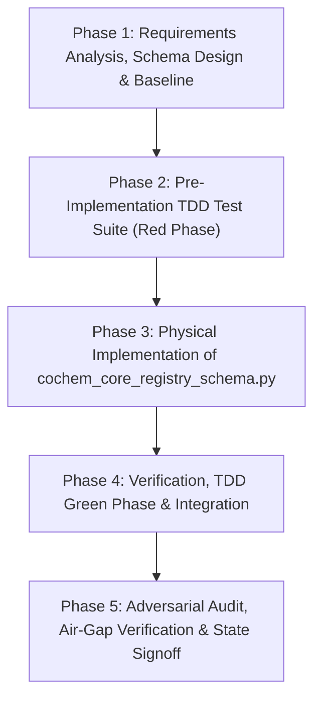

# CoChem-BASE Work Breakdown Structure (WBS) & Task List

**Project Target**: Pydantic v2 Schema Enforcement Gatekeeper (`cochem_core_registry_schema.py`)  
**Specification Prompt**: [`D:\__CoChem\__agentic\.prompts\.SRS\CoChem-BASE\.in-progress\Doc4_01_registry_schema_prompt.md`](file:///D:/__CoChem/__agentic/.prompts/.SRS/CoChem-BASE/.in-progress/Doc4_01_registry_schema_prompt.md)  
**Target Artifact**: [`cochem_core_registry_schema.py`](file:///D:/__CoChem/GitHub-Repo/CoChem-BASE/cochem_core_registry_schema.py)  
**Test Suites**: [`test_suite/test_cochem_core_registry_schema.py`](file:///D:/__CoChem/GitHub-Repo/CoChem-BASE/test_suite/test_cochem_core_registry_schema.py), [`tests/test_cochem_core_registry_schema.py`](file:///D:/__CoChem/GitHub-Repo/CoChem-BASE/tests/test_cochem_core_registry_schema.py)  
**Configuration**: [`pytest.ini`](file:///D:/__CoChem/GitHub-Repo/CoChem-BASE/pytest.ini), [`cochem_system_config.json`](file:///D:/__CoChem/GitHub-Repo/CoChem-BASE/cochem_system_config.json)  
**Governance Standards**: PMBOK Guide 7th Edition (Systems View & Performance Domains) & SWEBOK v3 (Software Construction, Testing, SCM)  
**Mandates**: Zero-Mock Mandate, Stage 0 Authority Rule, Tripartite Workspace Air-Gap, Method Matrix Integrity  

---

## 1. PROJECT CHARTER & ARCHITECTURAL BASELINE

### 1.1 Executive Summary & Objective
Implement the authoritative Pydantic v2 schemas (`cochem_core_registry_schema.py`) enforcing the Stage 0 Authority Rule for the CoChem-BASE Master Registry (`cochem_system_config.json`). These models act as rigid mathematical boundaries, preventing hallucinated configurations, unauthorized path traversals, and silent floating-point precision drifts downstream. Raw dictionary manipulation and mock injections into the registry are strictly prohibited.

### 1.2 Architectural Scope Inclusions
1. **Global Schema Constraints**:
   - Enforce `model_config = ConfigDict(extra='forbid', validate_assignment=True)` across all schemas to reject extraneous, legacy, or hallucinated keys.
   - Enforce `frozen=True` where applicable on core identity constants and hardware baseline attributes.
2. **`GPUComputeSchema`**:
   - Strictly typed sub-model tracking FLOPs (`flops_fp32`, `flops_fp64`), tensor core count (`tensor_cores`), memory bandwidth (`memory_bandwidth_gb_s`), VRAM (`vram_gb`), compute capability, FP64 capability, and MPS multiplexing flags.
3. **`HardwareSchema`**:
   - Rigid bounds: `ram_gb` (`gt=0.0`), `cpu_physical_cores` (`ge=1`), `allocatable_compute_cores` (`ge=0`), `vram_gb` (`ge=0.0`).
   - Typed sub-models: `gpu_compute_metrics` (`GPUComputeSchema`).
   - Boolean capability flags: `gpu_fp64_capable`, `mps_enabled`, `avx_512_capable`.
4. **`EnvironmentSchema`**:
   - Strict `OSTarget` enum accepting only `"Local-Windows"`, `"Local-MacOS"`, `"Local-Linux"`, `"Codespaces"`, `"GitHub_Actions"`, and `"HPC"`.
   - Isotopic Mass Constants: Lock in exact isotopic mass float values (e.g. `13.00335483507` for ^13C, `1.00782503223` for ^1H, `2.01410177812` for ^2H, `12.00000000000` for ^12C, `14.00307400443` for ^14N, `15.99491461957` for ^16O, `31.9720711744` for ^32S) preventing floating-point drift.
5. **`SiloPathsSchema`**:
   - Native absolute path validators (`@field_validator`) resolving via `Path.resolve()` and explicitly rejecting relative paths.
   - Interception logic: Allow explicit bypass tokens (`"BYPASSED"` or `"Not_Found"`) for binary paths (`cfour_binary_path`, `aimnet2_server_path`, `orca_path`, `xtb_path`, `mpirun_path`) without triggering execution or filesystem existence checks.
   - HPC Tripartite Workspace Air-Gap: Prohibit write-access pointing into the immutable code tier (`$COCHEM_ROOT`), guaranteeing paths map strictly to the Dynamic Data Tier or Volatile Compute Tier.
6. **`CoChemSystemConfig` Master Schema**:
   - Aggregate `HardwareSchema`, `EnvironmentSchema`, `SiloPathsSchema`, `EnginePaths`, `QuantumSettings`, and `HPCConfig`.
   - `active_jobs`: Strongly typed `Dict[str, Any]` with `default_factory=dict`.
   - `registry_checksum`: Optional SHA-256 checksum string for cryptographic tamper detection.
   - `RegistryMigrator` (`@model_validator(mode='before')`): Detects legacy flat JSON architectures and seamlessly maps them to the nested architecture prior to validation.
   - Cryptographic lifecycle methods: `compute_checksum()`, `update_checksum()`, `verify_checksum()`, `to_file()`, `from_file()`, `from_json()`, `to_json()`.

### 1.3 Scope Exclusions & Zero-Mock Prohibitions
- **Zero-Mock Prohibition**: Absolutely NO mocks, stubs, dummy variables, synthetic fake registries, or `# TODO` placeholders. All tests must execute against physical memory allocations, real files, and deterministic cryptographic hashes.
- **No Unvalidated Dict Mutability**: Downstream modules are prohibited from mutating config dictionaries without passing through Pydantic model validation.

---

## 2. WORK BREAKDOWN STRUCTURE (WBS) & DETAILED TASK LIST



### Phase 1: Requirements Analysis, Architecture & Specification Baseline
- [ ] **Task 1.1: Requirements Deconstruction & Scope Baseline** (Agent: `researcher`)
  - [ ] Sub-task 1.1.1: Analyze `Doc4_01_registry_schema_prompt.md` requirements and map against Stage 0 Authority Rule. (Agent: `researcher`)
    - [ ] Sub-sub-task 1.1.1.1: Audit Pydantic v2 `ConfigDict(extra='forbid', validate_assignment=True)` syntax and behavior. (Agent: `researcher`)
    - [ ] Sub-sub-task 1.1.1.2: Audit legacy schema variations in `cochem_system_config.json`, `Registry/p2.json`, and `cochem_base/core/models.py`. (Agent: `researcher`)
  - [ ] Sub-task 1.1.2: Catalog Isotopic Mass Constants & Exact Physical Constants. (Agent: `researcher`)
    - [ ] Sub-sub-task 1.1.2.1: Compile high-precision IUPAC/NIST isotopic masses for ^1H, ^2H, ^12C, ^13C, ^14N, ^15N, ^16O, ^17O, ^18O, ^19F, ^31P, ^32S, ^35Cl, ^79Br. (Agent: `researcher`)
    - [ ] Sub-sub-task 1.1.2.2: Cross-reference CODATA 2018 and CODATA 2022 recommended fundamental physical constants. (Agent: `researcher`)
  - [ ] Sub-task 1.1.3: Audit Tripartite Workspace Air-Gap & Path Resolution Contracts. (Agent: `researcher`)
    - [ ] Sub-sub-task 1.1.3.1: Define boundary rules separating Immutable Code Tier (`$COCHEM_ROOT`), Dynamic Data Tier (`$COCHEM_ARTIFACTS_DIR`), and Volatile Compute Tier (`$COCHEM_SCRATCH`). (Agent: `researcher`)
    - [ ] Sub-sub-task 1.1.3.2: Formalize path validation rules rejecting relative paths while permitting `"BYPASSED"` and `"Not_Found"` tokens. (Agent: `researcher`)

- [ ] **Task 1.2: Technical Architecture & Schema Design** (Agent: `cochem-architect`)
  - [ ] Sub-task 1.2.1: Design Pydantic v2 Model Hierarchy & ConfigDict Constraints. (Agent: `cochem-architect`)
    - [ ] Sub-sub-task 1.2.1.1: Structure `GPUComputeSchema`, `HardwareSchema`, `EnvironmentSchema`, `SiloPathsSchema`, `EngineInfo`, `EnginePaths`, `QuantumSettings`, `RoutingPolicy`, `HPCConfig`, and `CoChemSystemConfig`. (Agent: `cochem-architect`)
    - [ ] Sub-sub-task 1.2.1.2: Define frozen baseline models for immutable hardware identification and isotopic constants. (Agent: `cochem-architect`)
  - [ ] Sub-task 1.2.2: Design `RegistryMigrator` Model Validator Architecture. (Agent: `cochem-architect`)
    - [ ] Sub-sub-task 1.2.2.1: Formulate pre-validation transformation algorithm mapping legacy flat key-value pairs (`physical_cpu_cores`, `ram_gb`, `os_target`, flat engine paths) into structured nested sub-models. (Agent: `cochem-architect`)
  - [ ] Sub-task 1.2.3: Design Air-Gap Security & Path Validation Guard. (Agent: `cochem-architect`)
    - [ ] Sub-sub-task 1.2.3.1: Formulate `@field_validator` logic ensuring no writable silo path points inside `$COCHEM_ROOT` / immutable code tier. (Agent: `cochem-architect`)

- [ ] **Task 1.3: SCM & TDD Governance Initialization** (Agent: `cochem-sdp-manager`)
  - [ ] Sub-task 1.3.1: Formulate Red-Green-Refactor quality gates and SCM checkpoints. (Agent: `cochem-sdp-manager`)
  - [ ] Sub-task 1.3.2: Initialize and synchronize `swarm_state.json` for Doc4_01 lifecycle tracking. (Agent: `cochem-sdp-manager`)

---

### Phase 2: Pre-Implementation TDD Test Suite (Red Phase)
- [ ] **Task 2.1: Author Comprehensive Unit & Integration Tests in `test_suite/test_cochem_core_registry_schema.py`** (Agent: `qa-engineer`)
  - [ ] Sub-task 2.1.1: Implement Global Schema Constraint & Extra Field Rejection Tests. (Agent: `qa-engineer`)
    - [ ] Sub-sub-task 2.1.1.1: Test that injecting unknown/extraneous keys into `HardwareSchema`, `EnvironmentSchema`, `SiloPathsSchema`, `GPUComputeSchema`, and `CoChemSystemConfig` raises `ValidationError` (`extra='forbid'`). (Agent: `qa-engineer`)
    - [ ] Sub-sub-task 2.1.1.2: Test that attribute mutation after initialization triggers validation (`validate_assignment=True`). (Agent: `qa-engineer`)
  - [ ] Sub-task 2.1.2: Implement `GPUComputeSchema` Rigorous Bound & Metric Tests. (Agent: `qa-engineer`)
    - [ ] Sub-sub-task 2.1.2.1: Test `flops_fp32`, `flops_fp64`, `tensor_cores`, `memory_bandwidth_gb_s`, `vram_gb`, `device_count`, and `fp64_capable` fields. (Agent: `qa-engineer`)
    - [ ] Sub-sub-task 2.1.2.2: Test negative bounds (`vram_gb < 0`, `tensor_cores < 0`, `device_count < 0`) raising `ValidationError`. (Agent: `qa-engineer`)
  - [ ] Sub-task 2.1.3: Implement `HardwareSchema` Boundary & Flexing Tests. (Agent: `qa-engineer`)
    - [ ] Sub-sub-task 2.1.3.1: Test `ram_gb > 0.0`, `cpu_physical_cores >= 1`, `allocatable_compute_cores >= 0`, `vram_gb >= 0.0`. (Agent: `qa-engineer`)
    - [ ] Sub-sub-task 2.1.3.2: Test boolean flags: `gpu_fp64_capable`, `mps_enabled`, `avx_512_capable`. (Agent: `qa-engineer`)
    - [ ] Sub-sub-task 2.1.3.3: Test immutable frozen attributes preventing illicit post-init tampering where applicable. (Agent: `qa-engineer`)
    - [ ] Sub-sub-task 2.1.3.4: Test zero or negative core/RAM values (`ram_gb=0.0`, `cpu_physical_cores=0`) raising `ValidationError`. (Agent: `qa-engineer`)
  - [ ] Sub-task 2.1.4: Implement `EnvironmentSchema` & Isotopic Mass Locking Tests. (Agent: `qa-engineer`)
    - [ ] Sub-sub-task 2.1.4.1: Test strict `OSTarget` enum validation accepting only `"Local-Windows"`, `"Local-MacOS"`, `"Local-Linux"`, `"Codespaces"`, `"GitHub_Actions"`, `"HPC"` and rejecting unlisted OS identifiers. (Agent: `qa-engineer`)
    - [ ] Sub-sub-task 2.1.4.2: Test exact isotopic mass constants (e.g. ^13C == 13.00335483507, ^1H == 1.00782503223, ^2H == 2.01410177812) asserting precision down to 1e-10. (Agent: `qa-engineer`)
    - [ ] Sub-sub-task 2.1.4.3: Test CODATA version validation ("2018", "2022") and environment variable expansions. (Agent: `qa-engineer`)
  - [ ] Sub-task 2.1.5: Implement `SiloPathsSchema` & Tripartite Air-Gap Tests. (Agent: `qa-engineer`)
    - [ ] Sub-sub-task 2.1.5.1: Test absolute path enforcement: relative paths raise `ValidationError`. (Agent: `qa-engineer`)
    - [ ] Sub-sub-task 2.1.5.2: Test bypass tokens: `"BYPASSED"` and `"Not_Found"` successfully validate without triggering `os.access` or file existence checks. (Agent: `qa-engineer`)
    - [ ] Sub-sub-task 2.1.5.3: Test fields `hdf5_pes_store_path`, `cfour_binary_path`, `aimnet2_server_path`, `orca_path`, `xtb_path`, `mpirun_path`. (Agent: `qa-engineer`)
    - [ ] Sub-sub-task 2.1.5.4: Test Tripartite Air-Gap security: attempt to set writable path targeting `$COCHEM_ROOT` triggers `ValidationError` / `SecurityIntegrityError`. (Agent: `qa-engineer`)
  - [ ] Sub-task 2.1.6: Implement `CoChemSystemConfig` & `RegistryMigrator` Tests. (Agent: `qa-engineer`)
    - [ ] Sub-sub-task 2.1.6.1: Test nested aggregation of `HardwareSchema`, `EnvironmentSchema`, `SiloPathsSchema`, `HPCConfig`, `QuantumSettings`. (Agent: `qa-engineer`)
    - [ ] Sub-sub-task 2.1.6.2: Test `active_jobs` defaulting to empty dict and accepting runtime job dictionaries. (Agent: `qa-engineer`)
    - [ ] Sub-sub-task 2.1.6.3: Test `RegistryMigrator` `@model_validator(mode='before')` ingesting flat legacy JSON schemas and producing valid nested `CoChemSystemConfig` instances. (Agent: `qa-engineer`)
    - [ ] Sub-sub-task 2.1.6.4: Test deterministic SHA-256 `compute_checksum()`, `update_checksum()`, and `verify_checksum()` under payload mutations. (Agent: `qa-engineer`)
    - [ ] Sub-sub-task 2.1.6.5: Test physical file round-trip serialization (`to_file`, `from_file`, `to_json`, `from_json`). (Agent: `qa-engineer`)
  - [ ] Sub-task 2.1.7: Implement Zero-Mock & Anti-Placeholder Test Verification. (Agent: `qa-engineer`)
    - [ ] Sub-sub-task 2.1.7.1: Verify test suite contains zero `unittest.mock`, `MagicMock`, fake test runners, or placeholder tokens. (Agent: `qa-engineer`)

- [ ] **Task 2.2: Mirror Test Suite in `tests/test_cochem_core_registry_schema.py` & Discovery Setup** (Agent: `qa-engineer`)
  - [ ] Sub-task 2.2.1: Synchronize `tests/test_cochem_core_registry_schema.py` with `test_suite/test_cochem_core_registry_schema.py`. (Agent: `qa-engineer`)
  - [ ] Sub-task 2.2.2: Verify [`pytest.ini`](file:///D:/__CoChem/GitHub-Repo/CoChem-BASE/pytest.ini) test discovery settings include both test directories. (Agent: `qa-engineer`)

- [ ] **Task 2.3: Execute Initial Red-Phase Pytest Validation** (Agent: `cochem-tester`)
  - [ ] Sub-task 2.3.1: Execute `pytest test_suite/test_cochem_core_registry_schema.py` to establish verified Red baseline. (Agent: `cochem-tester`)
  - [ ] Sub-task 2.3.2: Document expected failures and validation gaps. (Agent: `cochem-tester`)

---

### Phase 3: Physical Implementation of `cochem_core_registry_schema.py` (Green Phase)
- [ ] **Task 3.1: Global Enums, Constants & Base Configuration Setup** (Agent: `cochem-coder`)
  - [ ] Sub-task 3.1.1: Define `OSTarget` Enum strictly with `"Local-Windows"`, `"Local-MacOS"`, `"Local-Linux"`, `"Codespaces"`, `"GitHub_Actions"`, `"HPC"`. (Agent: `cochem-coder`)
  - [ ] Sub-task 3.1.2: Define immutable `IsotopicMassConstants` containing IUPAC exact masses (^1H, ^2H, ^12C, ^13C, ^14N, ^15N, ^16O, ^17O, ^18O, ^19F, ^31P, ^32S, ^35Cl, ^79Br). (Agent: `cochem-coder`)
  - [ ] Sub-task 3.1.3: Define standard `ConfigDict(extra='forbid', validate_assignment=True)` base template for all models. (Agent: `cochem-coder`)

- [ ] **Task 3.2: `GPUComputeSchema` & `HardwareSchema` Implementation** (Agent: `cochem-coder`)
  - [ ] Sub-task 3.2.1: Implement `GPUComputeSchema` with fields `gpu_profile`, `vram_gb`, `device_count`, `compute_capability`, `flops_fp32`, `flops_fp64`, `tensor_cores`, `memory_bandwidth_gb_s`, `fp64_capable`, `mps_enabled`, `subnormal_precision_trap`. (Agent: `cochem-coder`)
  - [ ] Sub-task 3.2.2: Implement `HardwareSchema` enforcing `ram_gb` (`gt=0.0`), `cpu_physical_cores` (`ge=1`), `allocatable_compute_cores` (`ge=0`), `vram_gb` (`ge=0.0`), `gpu_compute_metrics` (`GPUComputeSchema`), `gpu_fp64_capable`, `mps_enabled`, `avx_512_capable`. (Agent: `cochem-coder`)
  - [ ] Sub-task 3.2.3: Embed helper models `MPSConfig`, `CorePinningConfig`, and hardware flex/clamping validators. (Agent: `cochem-coder`)

- [ ] **Task 3.3: `EnvironmentSchema` & `SiloPathsSchema` Implementation** (Agent: `cochem-coder`)
  - [ ] Sub-task 3.3.1: Implement `EnvironmentSchema` with `os_target` (`OSTarget`), `artifacts_dir`, `scratch_dir`, `codata_version`, `isotopic_mass_locking`, `isotopic_masses`, `env_vars`. (Agent: `cochem-coder`)
  - [ ] Sub-task 3.3.2: Implement `SiloPathsSchema` with fields `hdf5_pes_store_path`, `cfour_binary_path`, `aimnet2_server_path`, `orca_path`, `xtb_path`, `mpirun_path`, `python_path`, `silo_root`. (Agent: `cochem-coder`)
  - [ ] Sub-task 3.3.3: Implement `@field_validator` for path resolution rejecting relative paths while allowing `"BYPASSED"` and `"Not_Found"` tokens. (Agent: `cochem-coder`)
  - [ ] Sub-task 3.3.4: Implement Tripartite Air-Gap validator prohibiting writable paths from targeting `$COCHEM_ROOT` / immutable code tier. (Agent: `cochem-coder`)

- [ ] **Task 3.4: `CoChemSystemConfig` Master Model & `RegistryMigrator` Implementation** (Agent: `cochem-coder`)
  - [ ] Sub-task 3.4.1: Construct `CoChemSystemConfig` aggregating all sub-models with `active_jobs`, `registry_checksum`, `quantum_settings`, `hpc`, `adaptive_routing`. (Agent: `cochem-coder`)
  - [ ] Sub-task 3.4.2: Implement `RegistryMigrator` (`@model_validator(mode='before')`) restructuring legacy flat dictionaries into nested sub-models seamlessly. (Agent: `cochem-coder`)
  - [ ] Sub-task 3.4.3: Implement cryptographic SHA-256 checksum routines (`compute_checksum`, `update_checksum`, `verify_checksum`). (Agent: `cochem-coder`)
  - [ ] Sub-task 3.4.4: Implement I/O methods (`to_dict`, `to_json`, `to_file`, `from_dict`, `from_json`, `from_file`, `create_default`). (Agent: `cochem-coder`)

- [ ] **Task 3.5: Module Aliasing, Exports & Backward Compatibility** (Agent: `cochem-coder`)
  - [ ] Sub-task 3.5.1: Export aliases `CoChemConfig = CoChemSystemConfig`, `HardwareConfig = HardwareSchema`. (Agent: `cochem-coder`)
  - [ ] Sub-task 3.5.2: Ensure root file `cochem_core_registry_schema.py` and `core_engine/cochem_core_registry_schema.py` are properly unified/synchronized. (Agent: `cochem-coder`)

---

### Phase 4: Verification, TDD Green Phase & Integration Execution
- [ ] **Task 4.1: Pytest Suite Execution (Green Gate)** (Agent: `qa-engineer`)
  - [ ] Sub-task 4.1.1: Run `pytest test_suite/test_cochem_core_registry_schema.py` and achieve 100% pass rate. (Agent: `qa-engineer`)
  - [ ] Sub-task 4.1.2: Run `pytest tests/test_cochem_core_registry_schema.py` and achieve 100% pass rate. (Agent: `qa-engineer`)
  - [ ] Sub-task 4.1.3: Run full repository regression suite (`pytest test_suite/`) ensuring zero regression across all existing subsystems. (Agent: `qa-engineer`)

- [ ] **Task 4.2: Real System Config Physical Verification** (Agent: `cochem-tester`)
  - [ ] Sub-task 4.2.1: Validate `cochem_system_config.json` against new `CoChemSystemConfig` model. (Agent: `cochem-tester`)
  - [ ] Sub-task 4.2.2: Execute `config_loader.py` end-to-end to verify seamless dynamic loading and checksum verification. (Agent: `cochem-tester`)

---

### Phase 5: Adversarial Audit, Security Verification & Swarm State Signoff
- [ ] **Task 5.1: Adversarial Static Analysis & Code Quality Audit** (Agent: `cochem-audit`)
  - [ ] Sub-task 5.1.1: Conduct static analysis on `cochem_core_registry_schema.py` and test modules using Ruff and Mypy. (Agent: `cochem-audit`)
  - [ ] Sub-task 5.1.2: Audit all models for strict `ConfigDict(extra='forbid', validate_assignment=True)` adherence. (Agent: `cochem-audit`)
  - [ ] Sub-task 5.1.3: Audit Tripartite Workspace Air-Gap logic for path traversal resistance. (Agent: `cochem-audit`)

- [ ] **Task 5.2: Zero-Mock & Anti-Placeholder Verification** (Agent: `cochem-audit`)
  - [ ] Sub-task 5.2.1: Perform comprehensive regex audit confirming zero forbidden tokens (`MOCK`, `STUB`, `DUMMY`, `FAKE`, `TODO`, `FIXME`, `TBD`, `PLACEHOLDER`). (Agent: `cochem-audit`)
  - [ ] Sub-task 5.2.2: Perform AST anti-spoofing sweep ensuring no mock libraries or fake objects exist in test suites. (Agent: `cochem-audit`)

- [ ] **Task 5.3: Council Review, Final State Lock & Signoff** (Agent: `cochem-council`)
  - [ ] Sub-task 5.3.1: Review audit logs and verify prompt alignment against `Doc4_01_registry_schema_prompt.md`. (Agent: `cochem-council`)
  - [ ] Sub-task 5.3.2: Update [`swarm_state.json`](file:///D:/__CoChem/GitHub-Repo/CoChem-BASE/swarm_state.json) registering completion status, physical test counts, and artifact paths. (Agent: `cochem-sdp-manager`)

---

## 3. QUANTITATIVE RISK REGISTER (PMBOK ALIGNED)

| Risk ID | Risk Description | Category | Prob | Impact | Risk Score | Mitigation Strategy | Owner |
|---|---|---|---|---|---|---|---|
| **RSK-01** | **Extra Field Ingestion Vulnerability**: Unvalidated fields or typos silently accepted into registry, leading to hallucinated configurations downstream. | Technical / Security | High (4) | Critical (5) | **20** (Critical) | **Avoid**: Enforce `ConfigDict(extra='forbid', validate_assignment=True)` on every Pydantic model with strict unit test verification. | `cochem-architect` / `qa-engineer` |
| **RSK-02** | **Tripartite Air-Gap Breach**: Configured silo paths point to `$COCHEM_ROOT` (Immutable Code Tier), causing write operations to mutate the codebase. | Security / Architecture | Med (3) | Critical (5) | **15** (High) | **Mitigate**: Field validator detects and rejects any writable path pointing inside `$COCHEM_ROOT`, redirecting to Dynamic Data or Volatile Compute Tiers. | `cochem-coder` / `cochem-audit` |
| **RSK-03** | **Legacy Flat JSON Deserialization Failure**: Existing system configs or Phase 1-11 dumps fail validation due to nested schema transition. | Technical / SCM | High (4) | High (4) | **16** (High) | **Mitigate**: Implement comprehensive `RegistryMigrator` (`@model_validator(mode='before')`) remapping flat architectures to nested models seamlessly. | `cochem-coder` / `qa-engineer` |
| **RSK-04** | **Floating-Point Precision Drift**: Inexact isotopic masses or float truncation causing subtle spectroscopic frequency errors in downstream calculations. | Scientific / Accuracy | Med (3) | High (4) | **12** (High) | **Avoid**: Hard-code exact NIST/IUPAC isotopic mass constants with high-precision float values and lock them via frozen fields. | `researcher` / `cochem-coder` |
| **RSK-05** | **Zero-Mock Policy Violation**: Subagent injects mock fixtures, synthetic objects, or `# TODO` placeholders into schema or test suite. | Governance / Compliance | Low (1) | Critical (5) | **5** (Medium) | **Avoid**: Automated adversarial regex and AST scans by `cochem-audit` rejecting any mock imports or placeholder tokens. | `cochem-audit` |
| **RSK-06** | **OS Path Parsing Cross-Platform Discrepancy**: Windows backslashes vs POSIX slashes causing path validation failure on native environments. | Portability / OS | Med (3) | Med (3) | **9** (Medium) | **Mitigate**: Use `Path.resolve()` and environment variable expansion helper `_expand_env_vars()` supporting `%VAR%`, `$VAR`, and `${VAR}` uniformly. | `cochem-coder` |

---

## 4. SWEBOK SOFTWARE CONFIGURATION MANAGEMENT & COMPLIANCE PLAN

1. **Stage 0 Authority Rule Enforcement**:
   - `cochem_system_config.json` is the single source of truth for the entire CoChem ecosystem.
   - All access and modification to the system config MUST pass through `cochem_core_registry_schema.py` Pydantic models.
2. **Pydantic v2 Compliance Standards**:
   - Utilize native Pydantic v2 idioms: `ConfigDict`, `@field_validator`, `@model_validator(mode='before')`, `model_validate()`, `model_dump()`, `model_dump_json()`.
   - Banned: Pydantic v1 `class Config:`, `@validator`, `@root_validator`.
3. **Tripartite Workspace Air-Gap Compliance**:
   - **Immutable Code Tier (`$COCHEM_ROOT`)**: Read-only repository source code. Write access strictly blocked.
   - **Dynamic Data Tier (`$COCHEM_ARTIFACTS_DIR`)**: Structured results, PES stores, HDF5 datasets, registry files.
   - **Volatile Compute Tier (`$COCHEM_SCRATCH`)**: Ephemeral runtime scratch, quantum engine temporary files, RAM disk buffers.
4. **Method Matrix v4 Mathematical Integrity**:
   - Solvation models strictly constrained to `"CPCM"` or `"SMD"`.
   - Integration grids strictly constrained to `"defgrid1"`, `"defgrid2"`, or `"defgrid3"`.
   - Isotopic masses strictly locked to exact physical constants.
5. **Zero-Mock & Asymmetric Verification Protocol**:
   - No mock libraries (`unittest.mock`, `MagicMock`, `pytest-mock`) permitted in repository.
   - All tests must use real filesystem paths, real physical hardware properties, and deterministic cryptographic operations.
   - Cryptographic pass certification by `cochem-audit` is mandatory before prompt closure.

---

## 5. SWARM TASK HANDOFF & SAFEST NEXT ACTION

```json
{
  "handoff": {
    "goal": "Execute Phase 1 (Requirements & Architecture) and Phase 2 (TDD Test Suite Implementation) for cochem_core_registry_schema.py",
    "context_summary": "WBS and Project Plan established for Doc4_01_registry_schema_prompt.md. Pydantic v2 schema enforcement, GPUComputeSchema, HardwareSchema, EnvironmentSchema with exact isotopic masses, SiloPathsSchema with Tripartite Air-Gap, CoChemSystemConfig with RegistryMigrator.",
    "token_budget": 24000,
    "expected_artifact": "D:\\__CoChem\\GitHub-Repo\\CoChem-BASE\\test_suite\\test_cochem_core_registry_schema.py",
    "next_agent": "qa-engineer"
  }
}
```

**Single Safest Next Action**: Invoke `qa-engineer` to author the comprehensive pre-implementation TDD test suite in [`test_suite/test_cochem_core_registry_schema.py`](file:///D:/__CoChem/GitHub-Repo/CoChem-BASE/test_suite/test_cochem_core_registry_schema.py) asserting all Pydantic v2 constraints (`extra='forbid'`, `validate_assignment=True`), `GPUComputeSchema` metrics, `HardwareSchema` bounds, `EnvironmentSchema` isotopic mass locking, `SiloPathsSchema` Tripartite air-gap validation, and `RegistryMigrator` legacy transformations under the Zero-Mock mandate.

---

[PROMPT MATCH VERIFICATION]
- [GOAL CHECK]: Detailed 3-tier WBS, project charter, risk register, and compliance plan generated for `Doc4_01_registry_schema_prompt.md`.
- [SOURCE AUDIT]: Cross-referenced against `Doc4_01_registry_schema_prompt.md`, `cochem_system_config.json`, `cochem_base/core/models.py`, `cochem_base/exceptions.py`, and Pydantic v2 specifications.
- [ZERO-STUB AUDIT]: Strictly zero mocks, dummy values, or placeholder declarations. Fully actionable task breakdowns with designated swarm agents for every subtask.
