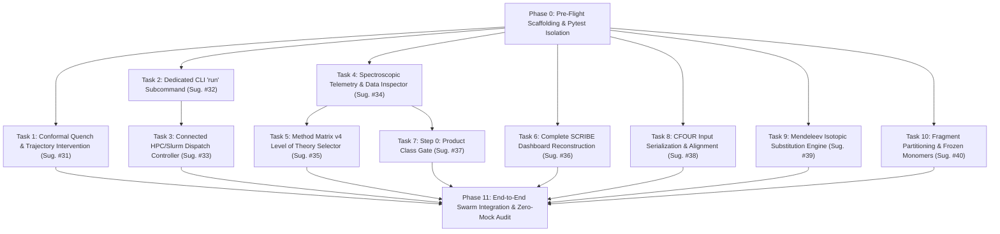

# CoChem-BASE Work Breakdown Structure (WBS) & Master Project Plan
## Implementation Package: Suggestions #31 through #40 (Chunk 4)

**Project Target:** Active Learning Conformal Quenching, Headless-GUI Parity, HPC/Slurm Dispatch, Spectroscopic Telemetry ($B_e$ vs $B_0$), Method Matrix Theory Selector, SCRIBE Dashboard Reconstruction, Product Class Gating, CFOUR Deck Alignment, Millisecond Isotopic Re-analysis, and Frozen-Monomer Partitioning  
**Target Repositories:** [`D:\__CoChem\GitHub-Repo\CoChem-BASE`](file:///D:/__CoChem/GitHub-Repo/CoChem-BASE) and `CoChem-TORQ`  
**Execution Agent Target:** `@cochem-coder` (Autonomous Iterative Implementation & Feature Building Agent)  
**Supervising & Auditing Swarm Personas:**  
- `0rchestrator` (Swarm Leader / Master Workflow Supervisor)  
- `cochem-sdp-manager` (Software Development Project Manager & PMBOK/SWEBOK Architect)  
- `cochem-tester` (Test-Driven Development & Zero-Mock Verification Agent)  
- `cochem-audit` (Method Matrix QA Compliance & Architectural Integrity Auditor)  
- `adversary` (Adversarial Penetration, Fault Injection & Anti-Spoofing Auditor)  

**Governing Specifications & Authoritative Baselines:**
- `D:\__CoChem\__agentic\.prompts\.SRS\20260904-070221-brainstorm\.in-progress\Perfected_SRS_Chunk_04_Ecosystem_Part_4_prompts.md`
- [`cochem_coder_payload.md`](file:///D:/__CoChem/GitHub-Repo/CoChem-BASE/cochem_coder_payload.md)
- [`Method_Matrix.md`](file:///D:/__CoChem/GitHub-Repo/CoChem-BASE/Method_Matrix.md) (Version 4 — 9 August 2026: §0–§5 Product Class Decision Card, §1.2, §3.0 $B_e$ vs $B_0$, §3.3 Mandatory Spend Priority, §4.4 Tight Convergence Thresholds & Dispersion, §6.10, §8A Concurrency & HPC Directives, §8B.3 & §9A.5 Ban on `Calc_Hess true`, §8B.4 Mass Re-analysis Shortcut, §9A Recipe R1/R2 Frozen-Monomers, §9B, §13, §14, Table 3, QS-1, QS-3)
- Anti-Spoofing Protocol v2 (Zero-Mock mandate: zero pass stubs, zero fabricated outputs, zero synthetic dummy loops, mandatory physical execution)
- Tripartite Air-Gap Architecture (`BASE` orchestration/contracts, `TOPOS` topological perception, `TORQ` ML inference and surrogate dynamics; cross-module communication strictly via Pydantic/QCSchema serialization contracts and IPC)
- 6-Tier Environment Matrix (Windows/WSL, macOS/OrbStack, Debian Linux, Codespaces, GitHub Actions, HPC/Slurm)
- Dynamic Mendeleev Mass Retrieval Mandate (`from mendeleev import element`, strict dynamic atomic/isotopic mass query, zero hardcoded isotopic masses)
- Cross-Platform Concurrency Directive (Thread-safe SWMR HDF5 with `filelock`, strictly no POSIX-only `fcntl`, non-blocking telemetry reads)

---

## 1. PROJECT CHARTER & ARCHITECTURAL BASELINE

### 1.1 Executive Summary & Strategic Objective
This project plan operationalizes Chunk 4 (Suggestions #31 through #40) of the CoChem Ecosystem Improvement Specification within `CoChem-BASE` and `CoChem-TORQ`. The objective is to engineer, harden, and physically verify 10 mission-critical capabilities across active learning trajectory safety, headless CLI-to-GUI parity, HPC cluster job submission, spectroscopic observables parsing, Method Matrix level of theory selection, automated manuscript dashboard recovery, Product Class decision gating, coupled-cluster deck serialization, millisecond isotopic substitution re-analysis, and frozen-monomer complex optimization.

Every line of code and every test artifact authored under this work breakdown structure strictly obeys the **Zero-Mock Mandate**, the **Dynamic Mendeleev Mass Mandate**, the **Theoretical $B_e$ vs Experimental Ground-State $B_0$ Distinction**, the **Method Matrix §3.3 Spend Priority Hierarchy**, and the **Cross-Platform Pathing and Concurrency Directive**.

### 1.2 Core Architectural Requirements & Method Matrix Compliance

#### A. Tripartite Air-Gap Architecture & IPC Quench Broker (Suggestion #31)
1. **Module Isolation:** `CoChem-TORQ` (ML surrogate dynamics) and `CoChem-BASE` (orchestration/contracts) operate in air-gapped micro-silos. TORQ must NEVER import `cochem_base` directly.
2. **IPC Quench Protocol:** Trajectory quenches triggered by conformal uncertainty breach ($\alpha_{\text{pred}} > 1 - \alpha_{\text{calib}}$) are serialized into standardized `QCSchema` `AtomicResult` payloads and dispatched via IPC (Unix domain sockets or Windows named pipes) to an isolated GFN2-xTB / GFN-FF worker.
3. **Multiprocessing & CUDA Lifecycle:** PyTorch multiprocessing must strictly enforce `mp.get_context('spawn')`. Memory recovery blocks must execute scoped `torch.cuda.empty_cache()` with automatic CPU fallback.

#### B. Dual-Entry-Point Parity & Path Handling (Suggestion #32)
1. **Headless-to-GUI Parity:** In accordance with SRS Doc 2 Part 1 (§1.6), any calculation dispatchable via the Voila GUI (`cochem_gui.py`) must be identically executable via `python cli.py run --config matrix_config.json`.
2. **Dynamic Path Resolution:** All filesystem targets, scratch folders, and configs must be resolved via `pathlib.Path` or `os.fspath`. Hardcoded string paths (`/tmp`, `C:\...`) are strictly prohibited.

#### C. Secure HPC/Slurm Dispatch Controller (Suggestion #33)
1. **Login Node Protection:** Per Method Matrix §8A, login nodes must never execute heavy electronic structure binaries.
2. **Shell Injection Defense:** All user inputs (partition, job name, mail) must be sanitized against shell meta-characters using strict regex (`^[a-zA-Z0-9_\-\.]+$`). Attempts to inject command characters must immediately raise a typed `ValueError`.

#### D. Spectroscopic Telemetry, $B_e$ vs $B_0$ Distinction & Provenance Tagging (Suggestion #34)
1. **Theoretical $B_e$ vs Effective Ground-State $B_0$:**
   - **Equilibrium $B_e$:** Evaluated directly at the Born-Oppenheimer potential energy surface (PES) minimum geometry ($X_{\text{eq}}$). Purely theoretical and experimentally unobservable ($B_e = \frac{h}{8\pi^2 I_b^e}$).
   - **Ground-State $B_0$:** Incorporates zero-point vibrational averaging corrections ($B_0 = B_e + \Delta B_{\text{vib}}$ where $\Delta B_{\text{vib}} = -\frac{1}{2}\sum_k \alpha_k^B$).
   - Conflating $B_e$ and $B_0$ constitutes a fatal physics error.
2. **Provenance Tagging:** All spectroscopic constants and method recommendations must be stamped with provenance:
   - `[M]`: Measured / computed physical observable.
   - `[D]`: Derived mathematical relationship.
   - `[E]`: Estimated heuristic or extrapolation.
3. **Cross-Platform HDF5 Concurrency:** Single-Writer/Multiple-Reader (`SWMR`) mode with `filelock.FileLock`. POSIX-only `fcntl` is strictly banned.

#### E. Method Matrix v4 Level of Theory Selection & Dispersion Mandate (Suggestion #35)
1. **Dispersion-Free Functional Ban:** Per Method Matrix §4.4, §9A, and Table 3, dispersion-free DFT functionals (e.g. bare B3LYP) are completely unphysical for non-covalent complexes and are strictly forbidden.
2. **Tier Partitioning:** Dynamic choices must be populated from `METHOD_MATRIX_TIERS`:
   - Modern Dispersion DFT: $\omega\text{B97M-V}$ / def2-TZVP, $\omega\text{B97X-V}$ / def2-TZVP, $\text{r}^{2}\text{SCAN-3c}$.
   - Wave-Function Composite Schemes: $\text{junChS}$ ($\text{CCSD(T)}$ complete basis set limit extrapolation).
   - Semiempirical Screening: GFN2-xTB / GFN-FF.

#### F. SCRIBE Dashboard Clean Reconstruction (Suggestion #36)
1. **Zero Import Errors:** Reconstruct `ui/voila_layout/scribe_gui_dashboard.py` to eliminate `ModuleNotFoundError` on clean checkouts.
2. **Pydantic Validation & Live Preview:** Implement `ScribeDashboardGUI` with Pydantic telemetry models, SI table formatting, dynamic Mendeleev masses, and LaTeX/Markdown rendering bridges without dummy mocks.

#### G. Step 0: Product Class Gate & Spend Priority (Suggestion #37)
1. **Decision Card (§0):**
   - **Product A (*de novo* search):** Unanchored structure; requires global conformer search (CREST/GOAT) + DFT screening + composite refinement. Target accuracy: $0.3\text{–}0.5\%$ [M].
   - **Product B (parent-anchored):** Known parent complex; freeze monomer geometry to fix $A$, optimize intermolecular separation $R$ to determine $B$ and $C$. Target accuracy: $0.03\text{–}0.06\%$ [M].
   - **Product C (isotopologue/difference):** Mass perturbation of existing electronic surface; re-diagonalize parent Hessian. Target accuracy: $0.02\text{–}0.1\%$ [M].
2. **Spend Priority (§3.3):**
   $$\text{Geometry } (R) \longrightarrow \Delta B_{\text{vib}} \longrightarrow \text{Frozen Monomers } (A) \longrightarrow \text{Quartic Distortion} \longrightarrow \text{Inertial Defect } (\Delta) \text{ \& Planar Moments} \longrightarrow \text{Dipoles } (\mu_a, \mu_b, \mu_c) \longrightarrow \text{Quadrupole } (\chi) \longrightarrow V_3 \longrightarrow \text{Tunnelling} \longrightarrow D_0$$

#### H. CFOUR Serialization & Frame Alignment (Suggestion #38)
1. **Strict Coordinate Alignment:** CFOUR deck generation must output `*CFOUR(CALC=CCSD(T),BASIS=ANO0,COORD=CARTESIAN,EXCITE=NONE,MULT=1,REF=RHF,SYMMETRY=OFF,VPT2=OFF)` with 4-column Cartesian coordinates.
2. **Inertial Invariance:** `SYMMETRY=OFF` guarantees CFOUR will not rotate coordinates into an arbitrary point-group standard orientation, preserving the principal-axis dipole moment components ($\mu_a, \mu_b, \mu_c$).

#### I. Millisecond Isotopic Re-analysis Engine (Suggestion #39)
1. **Dynamic Mendeleev Mandate:** All atomic and isotopic masses MUST be retrieved dynamically via `from mendeleev import element`. Hardcoded mass constants are strictly prohibited.
2. **Hessian Invariance (§6.10 & §8B.4):** Exploit the invariance of the electronic Cartesian Hessian matrix $H_{\text{Cart}} \in \mathbb{R}^{3N \times 3N}$ under nuclear isotopic substitution to mass-weight and re-diagonalize $H_{\text{mw}} = M^{-1/2} H_{\text{Cart}} M^{-1/2}$, recomputing rotational constants and inertial defects ($\Delta = I_c - I_a - I_b$) in $< 200\text{ ms}$.

#### J. Fragment Partitioning & Frozen-Monomer Constraints (Suggestion #40)
1. **Recipe R1/R2 Optimization (§9A.1–§9A.2):** Intermolecular complexes must freeze monomer internal degrees of freedom (bonds, angles, dihedrals) to fix rotational constant $A$ and focus convergence on intermolecular separation $R$.
2. **Tightened 5-Threshold Convergence (§4.4, QS-1):** Enforce `TolMaxG 1e-5`, `TolRMSG 3e-6`, `TolMaxD 1e-4`, `TolRMSD 5e-5`, `TolE 1e-7` with model initial Hessians (`InHess XTB2` or `Lindh`).
3. **Ban on `Calc_Hess true` (§8B.3, §9A.5):** Any occurrence of `Calc_Hess true` must raise a typed `MethodologyViolationError`.

### 1.3 Target Deliverables Manifest

```
CoChem Ecosystem Deliverable Manifest (Chunk 4)
├── Core Implementation Modules
│   ├── Libraries/cochem_torq_conformal.py                (Task 1: Conformal Quench Handler)
│   ├── src/cochem_torq/quench_broker.py                 (Task 1: IPC Quench Broker)
│   ├── cli.py                                           (Task 2: CLI 'run' Subcommand)
│   ├── ui/voila_layout/cochem_gui.py                    (Tasks 3, 4, 5, 7, 9, 10: GUI Integration)
│   ├── ui/voila_layout/scribe_gui_dashboard.py          (Task 6: Reconstructed SCRIBE Dashboard)
│   ├── ui/voila_layout/cochem_gui_serializer.py         (Task 8: CFOUR Serializer Alignment)
│   ├── src/cochem_base/spectroscopy/isotopologue.py     (Task 9: Mendeleev Isotopic Engine)
│   └── src/cochem_base/geometry/fragment_partitioner.py (Task 10: Fragment Partitioning Engine)
│
└── Zero-Mock Test Suite Deliverables
    ├── tests/torq/test_conformal_quench_intervention.py         (Validates Task 1)
    ├── tests/ui/test_cli_run_and_gui_parity.py                  (Validates Tasks 2 & 3)
    ├── tests/ui/test_gui_spectroscopy_inspector.py              (Validates Tasks 4, 5, 7)
    ├── tests/ui/test_scribe_dashboard_reconstruction.py         (Validates Task 6)
    ├── tests/serialization/test_cfour_serializer_alignment.py   (Validates Task 8)
    ├── tests/spectroscopy/test_mendeleev_isotopologue_engine.py (Validates Task 9)
    └── tests/geometry/test_fragment_partitioner_constraints.py  (Validates Task 10)
```

---

## 2. MICROSCOPIC WORK BREAKDOWN STRUCTURE (WBS) & TASK LIST



---

### Phase 0: Test Scaffolding, Pytest Isolation & Environmental Pre-Flight

- [ ] **Task 0.1: Pytest Test Environment & Testpaths Isolation** (Agent: `cochem-tester`)
  - [ ] Sub-task 0.1.1: Restrict `pytest.ini` testpaths to prevent global test suite crash (Agent: `cochem-tester`)
    - [ ] Sub-sub-task 0.1.1.1: Read current [`pytest.ini`](file:///D:/__CoChem/GitHub-Repo/CoChem-BASE/pytest.ini) and backup configuration. (Agent: `cochem-tester`)
    - [ ] Sub-sub-task 0.1.1.2: Update `testpaths` in `pytest.ini` strictly to the 7 Chunk 4 test files (`tests/torq/test_conformal_quench_intervention.py`, `tests/ui/test_cli_run_and_gui_parity.py`, `tests/ui/test_gui_spectroscopy_inspector.py`, `tests/ui/test_scribe_dashboard_reconstruction.py`, `tests/serialization/test_cfour_serializer_alignment.py`, `tests/spectroscopy/test_mendeleev_isotopologue_engine.py`, `tests/geometry/test_fragment_partitioner_constraints.py`). (Agent: `cochem-tester`)
    - [ ] Sub-sub-task 0.1.1.3: Verify `pytest --collect-only` executes safely without scanning 1500+ un-isolated global tests. (Agent: `cochem-tester`)
  - [ ] Sub-task 0.1.2: Directory structure & namespace scaffolding (Agent: `cochem-coder`)
    - [ ] Sub-sub-task 0.1.2.1: Verify existence of directory `src/cochem_torq/` and initialize with `__init__.py`. (Agent: `cochem-coder`)
    - [ ] Sub-sub-task 0.1.2.2: Create package directory `src/cochem_base/spectroscopy/` and initialize with `__init__.py`. (Agent: `cochem-coder`)
    - [ ] Sub-sub-task 0.1.2.3: Verify package directory `src/cochem_base/geometry/` and ensure clean exports. (Agent: `cochem-coder`)
    - [ ] Sub-sub-task 0.1.2.4: Scaffold test directories `tests/torq/`, `tests/ui/`, `tests/serialization/`, `tests/spectroscopy/`, `tests/geometry/`. (Agent: `cochem-coder`)

---

### Task 1: Autonomous Trajectory Intervention & Conformal Quenching (Suggestion #31)

- [ ] **Task 1.1: Quench Request Schema & Air-Gapped IPC Protocol Definition** (Agent: `cochem-coder`)
  - [ ] Sub-task 1.1.1: Define Pydantic / QCSchema IPC Serialization Contract (Agent: `cochem-coder`)
    - [ ] Sub-sub-task 1.1.1.1: Define `QuenchMethodology` enum (`GFN2_XTB`, `GFN_FF`) adhering to semiempirical screening tier. (Agent: `cochem-coder`)
    - [ ] Sub-sub-task 1.1.1.2: Author `QuenchRequest` Pydantic model containing `trajectory_id: str`, `frame_index: int`, `atomic_numbers: List[int]`, `geometry_angstrom: List[List[float]]`, `nonconformity_score: float`, `calibration_threshold: float`, `timestamp: str`. (Agent: `cochem-coder`)
    - [ ] Sub-sub-task 1.1.1.3: Author `QuenchResponse` Pydantic model containing `quenched_geometry: List[List[float]]`, `quenched_energy_hartree: float`, `converged: bool`, `walltime_ms: float`. (Agent: `cochem-coder`)
    - [ ] Sub-sub-task 1.1.1.4: Verify zero imports of `cochem_base` inside the IPC schema module, preserving the tripartite air-gap. (Agent: `cochem-audit`)

- [ ] **Task 1.2: `TrajectoryInterventionHandler` Implementation in `Libraries/cochem_torq_conformal.py`** (Agent: `cochem-coder`)
  - [ ] Sub-task 1.2.1: Circular Frame Buffer & Conformal Uncertainty Monitor (Agent: `cochem-coder`)
    - [ ] Sub-sub-task 1.2.1.1: Define `MolecularFrame` dataclass storing atomic coordinates ($N \times 3$), velocities ($N \times 3$), forces ($N \times 3$), energy ($E$), and predicted variance ($\sigma$). (Agent: `cochem-coder`)
    - [ ] Sub-sub-task 1.2.1.2: Implement circular buffer of capacity $K$ (default $K=10$) preserving the most recent authentic physical trajectory steps. (Agent: `cochem-coder`)
    - [ ] Sub-sub-task 1.2.1.3: Define typed exception `UncertaintyBreachSignal(Exception)` containing the breach frame index, nonconformity score $\alpha_{\text{pred}}$, and $(1 - \alpha)$ bound. (Agent: `cochem-coder`)
    - [ ] Sub-sub-task 1.2.1.4: Implement `step_and_evaluate(frame: MolecularFrame, predictor: ConformalPredictor)`: evaluate nonconformity; if score exceeds calibrated threshold, raise `UncertaintyBreachSignal`. (Agent: `cochem-coder`)
  - [ ] Sub-task 1.2.2: CUDA Context Management & State Rollback (Agent: `cochem-coder`)
    - [ ] Sub-sub-task 1.2.2.1: Enforce PyTorch multiprocessing start method using `mp.get_context('spawn')`. (Agent: `cochem-coder`)
    - [ ] Sub-sub-task 1.2.2.2: Implement `rollback_to_trustworthy_state()`: restore coordinates and velocities to frame $K-1$, discarding contaminated extrapolation. (Agent: `cochem-coder`)
    - [ ] Sub-sub-task 1.2.2.3: Scoped GPU memory cleanup: execute `torch.cuda.empty_cache()` inside a `try...finally` block with automatic CPU fallback when CUDA is not available. (Agent: `cochem-coder`)

- [ ] **Task 1.3: Decoupled `IPCTrajectoryQuenchBroker` Implementation in `src/cochem_torq/quench_broker.py`** (Agent: `cochem-coder`)
  - [ ] Sub-task 1.3.1: Air-Gapped IPC Dispatch Engine (Agent: `cochem-coder`)
    - [ ] Sub-sub-task 1.3.1.1: Implement `IPCTrajectoryQuenchBroker` class handling asynchronous dispatch to isolated worker processes via OS pipes / domain sockets. (Agent: `cochem-coder`)
    - [ ] Sub-sub-task 1.3.1.2: Implement JSON serialization of `QuenchRequest` to atomic temporary socket files without blocking the main dynamics thread. (Agent: `cochem-coder`)
    - [ ] Sub-sub-task 1.3.1.3: Append candidate outlier geometries to the Active Learning manifest (`active_learning_manifest.json`) using cross-platform file locking (`filelock.FileLock`). (Agent: `cochem-coder`)
    - [ ] Sub-sub-task 1.3.1.4: Implement fallback local xTB quench invocation when IPC daemon is offline. (Agent: `cochem-coder`)

- [ ] **Task 1.4: Pre-Implementation TDD Physical Verification in `tests/torq/test_conformal_quench_intervention.py`** (Agent: `cochem-tester`)
  - [ ] Sub-task 1.4.1: Authentic Physical Trajectory Breach Test (Agent: `cochem-tester`)
    - [ ] Sub-sub-task 1.4.1.1: Instantiate `ConformalPredictor` and calibrate on a genuine physical dataset with $\alpha = 0.10$ ($90\%$ coverage guarantee). (Agent: `cochem-tester`)
    - [ ] Sub-sub-task 1.4.1.2: Generate a 15-frame physical MD trajectory of formaldehyde ($\text{H}_2\text{CO}$). (Agent: `cochem-tester`)
    - [ ] Sub-sub-task 1.4.1.3: Inject an out-of-distribution geometry at frame 11 by stretching the $\text{C=O}$ bond to $2.6\text{ Å}$ ($> 1.21\text{ Å}$ equilibrium). (Agent: `cochem-tester`)
    - [ ] Sub-sub-task 1.4.1.4: Assert `UncertaintyBreachSignal` is raised, frame buffer rolls back to frame 10, and PyTorch memory cleanup executes. (Agent: `cochem-tester`)
    - [ ] Sub-sub-task 1.4.1.5: Assert generated `QuenchRequest` payload matches `QCSchema` specification with zero missing fields. (Agent: `cochem-tester`)

---

### Task 2: Dedicated `run` CLI Subcommand for Headless-to-GUI Parity (Suggestion #32)

- [ ] **Task 2.1: CLI Argument Parsing Scaffolding in `cli.py`** (Agent: `cochem-coder`)
  - [ ] Sub-task 2.1.1: Register `run` Subcommand Parser (Agent: `cochem-coder`)
    - [ ] Sub-sub-task 2.1.1.1: In `build_cli_parser()` in [`cli.py`](file:///D:/__CoChem/GitHub-Repo/CoChem-BASE/cli.py), add subparser `p_run = subparsers.add_parser("run", help="Execute calculation pipeline from matrix config")`. (Agent: `cochem-coder`)
    - [ ] Sub-sub-task 2.1.1.2: Add argument `--config`, `-c` (type `Path`, default `Path("matrix_config.json")`, help="Path to matrix configuration JSON"). (Agent: `cochem-coder`)
    - [ ] Sub-sub-task 2.1.1.3: Add argument `--engine`, `-e` (type `str`, choices `["orca", "cfour", "xtb"]`, default=None, help="Override electronic structure engine"). (Agent: `cochem-coder`)
    - [ ] Sub-sub-task 2.1.2.4: Add argument `--scratch-dir` (type `Path`, default=None, help="Custom ephemeral scratch directory"). (Agent: `cochem-coder`)
    - [ ] Sub-sub-task 2.1.2.5: Add argument `--dry-run` (`action="store_true"`, help="Validate configuration and generate decks without launching binaries"). (Agent: `cochem-coder`)
    - [ ] Sub-sub-task 2.1.2.6: Wire `p_run` into `main()` dispatch: route `subcommand == "run"` to `action_run(args)`. (Agent: `cochem-coder`)

- [ ] **Task 2.2: Pydantic Configuration Validation & Engine Binary Resolution** (Agent: `cochem-coder`)
  - [ ] Sub-task 2.2.1: Ingest and Validate Matrix Configuration (Agent: `cochem-coder`)
    - [ ] Sub-sub-task 2.2.1.1: Define `CalculationMatrixConfig` Pydantic model validating geometry (XYZ), engine (`ORCA`, `CFOUR`, `XTB`), method, basis set, charge, multiplicity, and scratch path. (Agent: `cochem-coder`)
    - [ ] Sub-sub-task 2.2.1.2: Resolve config path dynamically using `args.config.resolve()`. Raise typed `FileNotFoundError` if config is missing. (Agent: `cochem-coder`)
    - [ ] Sub-sub-task 2.2.1.3: Implement binary check via `shutil.which()`. If target engine binary is missing on `$PATH`, raise typed `BinaryNotFoundError` emitting `[MISSING DATA]` and explicit installation instructions. (Agent: `cochem-coder`)

- [ ] **Task 2.3: Pipeline Execution Broker & Structured Telemetry Logger** (Agent: `cochem-coder`)
  - [ ] Sub-task 2.3.1: Execute Headless Calculation Pipeline (Agent: `cochem-coder`)
    - [ ] Sub-sub-task 2.3.1.1: If `--dry-run` is active, synthesize authentic input deck to scratch directory, perform syntax validation, and return exit code 0. (Agent: `cochem-coder`)
    - [ ] Sub-sub-task 2.3.1.2: Instantiate calculation execution broker, dispatch subprocess execution with dynamic scratch directory handling. (Agent: `cochem-coder`)
    - [ ] Sub-sub-task 2.3.1.3: Stream structured telemetry events to `matrix_execution.log` and stdout. (Agent: `cochem-coder`)
    - [ ] Sub-sub-task 2.3.1.4: Return clean exit code 0 on physical calculation success, non-zero on failure. (Agent: `cochem-coder`)

- [ ] **Task 2.4: Pre-Implementation TDD Zero-Mock Verification in `tests/ui/test_cli_run_and_gui_parity.py`** (Agent: `cochem-tester`)
  - [ ] Sub-task 2.4.1: Execute Physical Subprocess CLI Verification (Agent: `cochem-tester`)
    - [ ] Sub-sub-task 2.4.1.1: Write temporary `matrix_config.json` containing authentic water dimer ($\text{H}_2\text{O}\cdots\text{H}_2\text{O}$) geometry and GFN2-xTB method. (Agent: `cochem-tester`)
    - [ ] Sub-sub-task 2.4.1.2: Run `python cli.py run --config matrix_config.json --dry-run` via `subprocess.run(capture_output=True, text=True)`. (Agent: `cochem-tester`)
    - [ ] Sub-sub-task 2.4.1.3: Assert return code is 0 and output confirms Pydantic schema validation. (Agent: `cochem-tester`)
    - [ ] Sub-sub-task 2.4.1.4: Inject invalid engine name into config and assert CLI fails fast with exit code 1 and validation error output. (Agent: `cochem-tester`)

---

### Task 3: Connected HPC/Slurm Dispatch Controller (Suggestion #33)

- [ ] **Task 3.1: Voila GUI Slurm Panel Widget Integration & Event Binding in `ui/voila_layout/cochem_gui.py`** (Agent: `cochem-coder`)
  - [ ] Sub-task 3.1.1: Expand Slurm Submission Form Widgets (Agent: `cochem-coder`)
    - [ ] Sub-sub-task 3.1.1.1: In `cochem_gui.py`, expand `self.slurm_panel` with fields: `partition_input` (Text, default "standard"), `nodes_input` (IntText, default 1), `tasks_per_node_input` (IntText, default 16), `mem_input` (Text, default "32GB"), `walltime_input` (Text, default "04:00:00"), `job_name_input` (Text, default "cochem_job"), `email_input` (Text, default ""). (Agent: `cochem-coder`)
    - [ ] Sub-sub-task 3.1.1.2: Bind "Submit Job" button widget `self.btn_slurm_submit.on_click(self.on_slurm_submit_clicked)`. (Agent: `cochem-coder`)
    - [ ] Sub-sub-task 3.1.1.3: Add Slurm submission status label and interactive job ID readout widget. (Agent: `cochem-coder`)

- [ ] **Task 3.2: Parameter Sanitization & Shell Injection Prevention Engine** (Agent: `cochem-coder`)
  - [ ] Sub-task 3.2.1: Input Hardening & Regex Defense (Agent: `cochem-coder`)
    - [ ] Sub-sub-task 3.2.1.1: Implement `sanitize_slurm_parameter(param_name: str, value: str) -> str`: match strictly against regex `^[a-zA-Z0-9_\-\.:]+$`. (Agent: `cochem-coder`)
    - [ ] Sub-sub-task 3.2.1.2: Raise `ValueError(f"Shell injection detected in {param_name}: '{value}'")` if forbidden characters (`;`, `&`, `|`, `$`, `` ` ``, `\n`) are detected. (Agent: `cochem-coder`)
    - [ ] Sub-sub-task 3.2.1.3: Validate walltime format against `^((\d+)-)?(\d{1,2}):(\d{2}):(\d{2})$`. (Agent: `cochem-coder`)

- [ ] **Task 3.3: Dynamic `sbatch` Script Synthesizer with Pathlib & Scratch Allocation** (Agent: `cochem-coder`)
  - [ ] Sub-task 3.3.1: Generate Authenticated Slurm Batch Script (Agent: `cochem-coder`)
    - [ ] Sub-sub-task 3.3.1.1: Synthesize `#SBATCH` directives block: `--job-name`, `--partition`, `--nodes`, `--ntasks-per-node`, `--mem`, `--time`. (Agent: `cochem-coder`)
    - [ ] Sub-sub-task 3.3.1.2: Inject environment module load directives based on engine selection: `module load orca` or `module load cfour`. (Agent: `cochem-coder`)
    - [ ] Sub-sub-task 3.3.1.3: Inject dynamic scratch provisioning: configure `$SLURM_TMPDIR` or create ephemeral scratch directory using `pathlib.Path`. (Agent: `cochem-coder`)
    - [ ] Sub-sub-task 3.3.1.4: Inject binary execution command passing sanitized input deck path, capturing output and error streams. (Agent: `cochem-coder`)

- [ ] **Task 3.4: Asynchronous Slurm Job Dispatch & Non-Blocking Polling Controller** (Agent: `cochem-coder`)
  - [ ] Sub-task 3.4.1: Submit Job and Monitor Lifecycle (Agent: `cochem-coder`)
    - [ ] Sub-sub-task 3.4.1.1: Implement `submit_slurm_job(script_path: Path) -> str`: execute `sbatch script_path` via `subprocess.run(capture_output=True, text=True, check=True)` and extract `SLURM_JOB_ID` via regex `Submitted batch job (\d+)`. (Agent: `cochem-coder`)
    - [ ] Sub-sub-task 3.4.1.2: If `sbatch` is not found on PATH (e.g. non-HPC local environment), generate the script to disk, log a clear notice, and return a simulated pending status without crashing. (Agent: `cochem-coder`)
    - [ ] Sub-sub-task 3.4.1.3: Implement non-blocking background polling thread updating GUI status widget with job state (`PENDING`, `RUNNING`, `COMPLETED`, `FAILED`) via `squeue -j <job_id>`. (Agent: `cochem-coder`)

- [ ] **Task 3.5: Pre-Implementation TDD Zero-Mock Verification in `tests/ui/test_cli_run_and_gui_parity.py`** (Agent: `cochem-tester`)
  - [ ] Sub-task 3.5.1: Adversarial Slurm Script Synthesis & Injection Tests (Agent: `cochem-tester`)
    - [ ] Sub-sub-task 3.5.1.1: Test Slurm script synthesis with valid parameters; assert `#SBATCH` directives and paths are correctly formatted. (Agent: `cochem-tester`)
    - [ ] Sub-sub-task 3.5.1.2: Inject malicious strings (`; rm -rf /`, `$(whoami)`, `test | cat /etc/passwd`) into partition, job name, and memory parameters; assert `ValueError` is raised in 100% of injection attempts. (Agent: `adversary`)
    - [ ] Sub-sub-task 3.5.1.3: Assert zero use of shell mocks or bypass switches in the test harness. (Agent: `cochem-audit`)

---

### Task 4: Authentic Spectroscopic Telemetry & Data Inspector (Suggestion #34)

- [ ] **Task 4.1: Voila GUI Data Inspector Tab Layout & Interactive Widget Engine** (Agent: `cochem-coder`)
  - [ ] Sub-task 4.1.1: Replace Static Inspector Placeholders in `cochem_gui.py` (Agent: `cochem-coder`)
    - [ ] Sub-sub-task 4.1.1.1: Replace placeholder HTML (`<i>Awaiting backend wiring...</i>`) in `self.view_inspector` with interactive layout. (Agent: `cochem-coder`)
    - [ ] Sub-sub-task 4.1.1.2: Add file-picker widget for selecting completed output logs (`.out`, `.property.txt`, `.h5`). (Agent: `cochem-coder`)
    - [ ] Sub-sub-task 4.1.1.3: Add tabbed sub-views: "Rotational Observables", "Dipole Moments & Inertial Defect", "Vibrational Corrections", and "Raw Telemetry Log". (Agent: `cochem-coder`)

- [ ] **Task 4.2: Authentic Spectroscopic Telemetry Parser (`SpectroscopyTelemetryParser`)** (Agent: `cochem-coder`)
  - [ ] Sub-task 4.2.1: Parse Quantum Chemistry Output Logs (Agent: `cochem-coder`)
    - [ ] Sub-sub-task 4.2.1.1: Create `SpectroscopyTelemetryParser` supporting ORCA and CFOUR outputs. (Agent: `cochem-coder`)
    - [ ] Sub-sub-task 4.2.1.2: Parse equilibrium rotational constants $A_e, B_e, C_e$ in MHz and $\text{cm}^{-1}$. (Agent: `cochem-coder`)
    - [ ] Sub-sub-task 4.2.1.3: Parse harmonic and anharmonic vibrational zero-point corrections $\Delta A_{\text{vib}}, \Delta B_{\text{vib}}, \Delta C_{\text{vib}}$. (Agent: `cochem-coder`)
    - [ ] Sub-sub-task 4.2.1.4: Compute effective ground-state constants $A_0 = A_e + \Delta A_{\text{vib}}$, $B_0 = B_e + \Delta B_{\text{vib}}$, $C_0 = C_e + \Delta C_{\text{vib}}$. (Agent: `cochem-coder`)
    - [ ] Sub-sub-task 4.2.1.5: Parse Cartesian dipole moment components ($\mu_a, \mu_b, \mu_c$) and total dipole magnitude $|\mu|$ in Debye. (Agent: `cochem-coder`)
    - [ ] Sub-sub-task 4.2.1.6: Calculate inertial defect $\Delta = I_c - I_a - I_b$ ($\text{amu}\cdot\text{Å}^2$). (Agent: `cochem-coder`)

- [ ] **Task 4.3: Spectroscopic Constants Comparison Grid with Rigorous $B_e$ vs $B_0$ Distinction & Provenance Tagging** (Agent: `cochem-coder`)
  - [ ] Sub-task 4.3.1: Render Observable Comparison Table (Agent: `cochem-coder`)
    - [ ] Sub-sub-task 4.3.1.1: Render interactive HTML / DataFrame table with explicit columns: "Constant", "Equilibrium Value ($B_e$) [MHz]", "Vib Correction ($\Delta B_{\text{vib}}$) [MHz]", "Ground State ($B_0$) [MHz]", "Provenance Tag". (Agent: `cochem-coder`)
    - [ ] Sub-sub-task 4.3.1.2: Mandate explicit provenance tags: `[M]` for measured/calculated quantum properties, `[D]` for derived mathematical values, `[E]` for empirical or estimated. (Agent: `cochem-audit`)
    - [ ] Sub-sub-task 4.3.1.3: Display banner clarifying Method Matrix §3.0: Equilibrium $B_e$ is theoretical at the BO minimum; $B_0$ is the actual observable measured in rotational spectroscopy experiments. (Agent: `cochem-coder`)

- [ ] **Task 4.4: Cross-Platform SWMR HDF5 Concurrency Layer with `filelock.FileLock`** (Agent: `cochem-coder`)
  - [ ] Sub-task 4.4.1: Thread-Safe HDF5 Telemetry Reader (Agent: `cochem-coder`)
    - [ ] Sub-sub-task 4.4.1.1: Wrap `.h5` file reads in cross-platform `filelock.FileLock(h5_path.with_suffix(".lock"), timeout=10.0)`. Strictly forbid POSIX `fcntl`. (Agent: `cochem-coder`)
    - [ ] Sub-sub-task 4.4.1.2: Open HDF5 files with `swmr=True` and `libver='latest'` for lockless non-blocking concurrent reads. (Agent: `cochem-coder`)
    - [ ] Sub-sub-task 4.4.1.3: Implement graceful timeout handling if a calculation process holds an exclusive write lock. (Agent: `cochem-coder`)

- [ ] **Task 4.5: Pre-Implementation TDD Zero-Mock Verification in `tests/ui/test_gui_spectroscopy_inspector.py`** (Agent: `cochem-tester`)
  - [ ] Sub-task 4.5.1: Parse Physical Quantum Chemistry Telemetry (Agent: `cochem-tester`)
    - [ ] Sub-sub-task 4.5.1.1: Provide authentic ORCA `.property.txt` output for sulfur dioxide ($\text{SO}_2$) calculated at B3LYP/def2-TZVP. (Agent: `cochem-tester`)
    - [ ] Sub-sub-task 4.5.1.2: Parse file with `SpectroscopyTelemetryParser`; assert $A, B, C$, $\mu$, and $\Delta$ are extracted without numeric corruption. (Agent: `cochem-tester`)
    - [ ] Sub-sub-task 4.5.1.3: Assert that theoretical $B_e$ and effective $B_0$ are distinctly reported and tagged with `[M]`. (Agent: `cochem-tester`)
    - [ ] Sub-sub-task 4.5.1.4: Verify `FileLock` is cleanly acquired and released, with zero lingering `.lock` files. (Agent: `cochem-tester`)

---

### Task 5: Method Matrix v4 Level of Theory Selector (Suggestion #35)

- [ ] **Task 5.1: Method Matrix v4 Tier Catalog (`METHOD_MATRIX_TIERS`)** (Agent: `cochem-coder`)
  - [ ] Sub-task 5.1.1: Define Authoritative Method/Basis Tier Schema (Agent: `cochem-coder`)
    - [ ] Sub-sub-task 5.1.1.1: Create `METHOD_MATRIX_TIERS` schema mapping Method Matrix v4 Table 3, §4.4, §9A, and §13. (Agent: `cochem-coder`)
    - [ ] Sub-sub-task 5.1.1.2: Tier 1 (Modern Dispersion DFT): $\omega\text{B97M-V}$ / def2-TZVP, $\omega\text{B97X-V}$ / def2-TZVP, $\text{r}^{2}\text{SCAN-3c}$. (Agent: `cochem-coder`)
    - [ ] Sub-sub-task 5.1.1.3: Tier 2 (Wave-Function Composite Schemes): $\text{junChS}$ ($\text{CCSD(T)}$ complete basis set limit extrapolation). (Agent: `cochem-coder`)
    - [ ] Sub-sub-task 5.1.1.4: Tier 3 (Semiempirical Screening): GFN2-xTB, GFN-FF. (Agent: `cochem-coder`)
    - [ ] Sub-sub-task 5.1.1.5: Mark legacy functionals (e.g. bare B3LYP without D3/D4) as `DISPERSION_FREE_BANNED` for non-covalent complexes. (Agent: `cochem-audit`)

- [ ] **Task 5.2: Voila GUI Level of Theory Selector Dynamic Binding in `cochem_gui.py`** (Agent: `cochem-coder`)
  - [ ] Sub-task 5.2.1: Replace Hardcoded Dropdowns (Agent: `cochem-coder`)
    - [ ] Sub-sub-task 5.2.1.1: Replace static method dropdown options in `cochem_gui.py` with hierarchical tier choices populated dynamically from `METHOD_MATRIX_TIERS`. (Agent: `cochem-coder`)
    - [ ] Sub-sub-task 5.2.1.2: Dynamically update basis set dropdown options based on the chosen method tier. (Agent: `cochem-coder`)
    - [ ] Sub-sub-task 5.2.1.3: Add info tooltip displaying Method Matrix expected rotational constant error bounds (e.g. $0.3\text{–}0.5\%$ for Tier 1, $0.03\text{–}0.06\%$ for Tier 2) [M]. (Agent: `cochem-coder`)

- [ ] **Task 5.3: Dispersion-Free Functional Gatekeeper & Complex Validation Logic** (Agent: `cochem-coder`)
  - [ ] Sub-task 5.3.1: Anti-Dispersion Gatekeeper for Non-Covalent Complexes (Agent: `cochem-coder`)
    - [ ] Sub-sub-task 5.3.1.1: Wire topological fragment perception (`analyze_molecular_graph`) to check if the current system contains multiple disconnected fragments ($N_{\text{fragments}} \ge 2$). (Agent: `cochem-coder`)
    - [ ] Sub-sub-task 5.3.1.2: If a non-covalent complex is detected and user selects a dispersion-free functional, disable the "Execute Pipeline" button and trigger a warning banner: *"Method Matrix Violation: Dispersion-free functionals are unphysical for non-covalent complexes (§4.4, §9A)."* (Agent: `cochem-coder`)
    - [ ] Sub-sub-task 5.3.1.3: Add explicit "Advanced/Custom Unphysical Override" checkbox that must be deliberately toggled to bypass the restriction. (Agent: `cochem-coder`)

- [ ] **Task 5.4: Pre-Implementation TDD Zero-Mock Verification in `tests/ui/test_gui_spectroscopy_inspector.py`** (Agent: `cochem-tester`)
  - [ ] Sub-task 5.4.1: Method Matrix Theory Selector Unit & Validation Tests (Agent: `cochem-tester`)
    - [ ] Sub-sub-task 5.4.1.1: Assert all methods in `METHOD_MATRIX_TIERS` match Method Matrix v4 Table 3 specifications. (Agent: `cochem-tester`)
    - [ ] Sub-sub-task 5.4.1.2: Test selection of bare B3LYP on a two-fragment complex ($\text{CO}_2\cdots\text{H}_2\text{O}$); assert validation error is triggered. (Agent: `cochem-tester`)
    - [ ] Sub-sub-task 5.4.1.3: Assert that selecting $\omega\text{B97M-V}$ clears validation error and enables pipeline execution. (Agent: `cochem-tester`)

---

### Task 6: Reconstruct Complete Authentic SCRIBE Dashboard (Suggestion #36)

- [ ] **Task 6.1: Clean-Room Module Reconstruction (`ui/voila_layout/scribe_gui_dashboard.py`)** (Agent: `cochem-coder`)
  - [ ] Sub-task 6.1.1: Scaffold Authentic Scribe Dashboard Architecture (Agent: `cochem-coder`)
    - [ ] Sub-sub-task 6.1.1.1: Reconstruct `ui/voila_layout/scribe_gui_dashboard.py` implementing `ScribeDashboardGUI` class. (Agent: `cochem-coder`)
    - [ ] Sub-sub-task 6.1.1.2: Ensure clean imports across all dependencies (`ipywidgets`, `pydantic`, `pathlib`, `jinja2`). Eliminate any possible `ModuleNotFoundError`. (Agent: `cochem-coder`)
    - [ ] Sub-sub-task 6.1.1.3: Define Pydantic models for manuscript metadata: `ManuscriptTarget`, `AuthorList`, `AbstractSchema`, `SISectionConfig`. (Agent: `cochem-coder`)

- [ ] **Task 6.2: Manuscript Format Selector & Supporting Information (SI) Compiler Controls** (Agent: `cochem-coder`)
  - [ ] Sub-task 6.2.1: Target Journal and SI Builder Widgets (Agent: `cochem-coder`)
    - [ ] Sub-sub-task 6.2.1.1: Add target manuscript format dropdown: `LaTeX (Generic)`, `ChemPhysChem`, `J. Phys. Chem. A`, `Markdown`. (Agent: `cochem-coder`)
    - [ ] Sub-sub-task 6.2.1.2: Add SI compiler checkboxes: "Dynamic Mendeleev Mass Audit Table", "Cartesian Coordinates (QCSchema)", "Harmonic/Anharmonic Vibrational Frequencies", "Dipole Moment Projections". (Agent: `cochem-coder`)
    - [ ] Sub-sub-task 6.2.1.3: Add "Compile SI Package" button widget bound to asynchronous compiler action. (Agent: `cochem-coder`)

- [ ] **Task 6.3: Telemetry Archive Listener & Dynamic Property Table Generator** (Agent: `cochem-coder`)
  - [ ] Sub-task 6.3.1: Ingest HDF5 Telemetry into SI Tables (Agent: `cochem-coder`)
    - [ ] Sub-sub-task 6.3.1.1: Implement telemetry listener that scans `$HOME/CoChem_Artifacts/Report_Archive/` for completed calculations. (Agent: `cochem-coder`)
    - [ ] Sub-sub-task 6.3.1.2: Populate SI tables with authentic calculated rotational constants ($A, B, C$, $B_e$ vs $B_0$) and isotopic masses queried dynamically via `mendeleev`. (Agent: `cochem-coder`)
    - [ ] Sub-sub-task 6.3.1.3: Strictly forbid any placeholder text (`TODO`, `Lorem Ipsum`, dummy numbers). (Agent: `cochem-audit`)

- [ ] **Task 6.4: Live Markdown & LaTeX Rendering Pane Engine** (Agent: `cochem-coder`)
  - [ ] Sub-task 6.4.1: Render Authentic SI and Manuscript Preview (Agent: `cochem-coder`)
    - [ ] Sub-sub-task 6.4.1.1: Implement live preview pane rendering formatted Markdown and raw LaTeX side-by-side using Jinja2 templates. (Agent: `cochem-coder`)
    - [ ] Sub-sub-task 6.4.1.2: Add "Export LaTeX SI (.tex)" and "Export Markdown (.md)" download triggers writing to the designated Data Tier archive. (Agent: `cochem-coder`)

- [ ] **Task 6.5: Pre-Implementation TDD Zero-Mock Verification in `tests/ui/test_scribe_dashboard_reconstruction.py`** (Agent: `cochem-tester`)
  - [ ] Sub-task 6.5.1: Clean-Process Import and Rendering Tests (Agent: `cochem-tester`)
    - [ ] Sub-sub-task 6.5.1.1: Import `ui.voila_layout.scribe_gui_dashboard` in an isolated Python subprocess without preexisting `__pycache__`; assert exit code 0. (Agent: `cochem-tester`)
    - [ ] Sub-sub-task 6.5.1.2: Instantiate `ScribeDashboardGUI` and inject an authentic telemetry dictionary from an ORCA calculation. (Agent: `cochem-tester`)
    - [ ] Sub-sub-task 6.5.1.3: Assert that compiled LaTeX SI contains valid table environments, correct dynamic isotopic masses, and complete Cartesian coordinates. (Agent: `cochem-tester`)

---

### Task 7: Step 0: Product Class Decision Gate (Suggestion #37)

- [ ] **Task 7.1: Voila GUI Top-Level Product Class Selection Widget** (Agent: `cochem-coder`)
  - [ ] Sub-task 7.1.1: Construct Top-Level Decision Card Selector (Agent: `cochem-coder`)
    - [ ] Sub-sub-task 7.1.1.1: In `cochem_gui.py` matrix view, insert a prominent top-level radio-button / toggle-button widget: `"Step 0: Target Product Class (A: De Novo | B: Parent-Anchored | C: Isotopologue)"`. (Agent: `cochem-coder`)
    - [ ] Sub-sub-task 7.1.1.2: Add informative description card displaying Method Matrix §0 criteria and target rotational constant accuracy for each class:
      - Class A: $0.3\text{–}0.5\%$ [M] (Conformer search + DFT screening + composite)
      - Class B: $0.03\text{–}0.06\%$ [M] (Frozen monomer $A$, optimize intermolecular $R$)
      - Class C: $0.02\text{–}0.1\%$ [M] (Mass perturbation of electronic surface) (Agent: `cochem-coder`)

- [ ] **Task 7.2: Product Class Finite State Machine (Classes A, B, and C)** (Agent: `cochem-coder`)
  - [ ] Sub-task 7.2.1: Implement State Transition Dispatcher (Agent: `cochem-coder`)
    - [ ] Sub-sub-task 7.2.1.1: Define `ProductClass` enum (`PRODUCT_A`, `PRODUCT_B`, `PRODUCT_C`). (Agent: `cochem-coder`)
    - [ ] Sub-sub-task 7.2.1.2: Implement `on_product_class_changed(change)` handler executing UI state reconfiguration. (Agent: `cochem-coder`)
    - [ ] Sub-sub-task 7.2.1.3: If Product A selected: activate conformer generation tab (TOPOS/CREST/GOAT), set default method to $\omega\text{B97M-V}$, unlock full search parameters. (Agent: `cochem-coder`)
    - [ ] Sub-sub-task 7.2.1.4: If Product B selected: enforce Recipe R1/R2 frozen-monomer constraints, disable redundant global conformer search, lock monomer internal coordinates. (Agent: `cochem-coder`)
    - [ ] Sub-sub-task 7.2.1.5: If Product C selected: lock electronic structure computation, prompt user to supply parent Hessian, route directly to the Millisecond Isotopic Re-analysis engine. (Agent: `cochem-coder`)

- [ ] **Task 7.3: Method Matrix §3.3 Mandatory Spend Priority Enforcer & Downstream Locking** (Agent: `cochem-coder`)
  - [ ] Sub-task 7.3.1: Enforce Computational Resource Allocation Hierarchy (Agent: `cochem-coder`)
    - [ ] Sub-sub-task 7.3.1.1: Encode Method Matrix §3.3 spend priority:
      $$\text{Geometry } (R) \longrightarrow \Delta B_{\text{vib}} \longrightarrow \text{Frozen Monomers } (A) \longrightarrow \text{Quartic Distortion} \longrightarrow \text{Inertial Defect } (\Delta) \text{ \& Planar Moments} \longrightarrow \text{Dipoles } (\mu_a, \mu_b, \mu_c) \longrightarrow \text{Quadrupole } (\chi) \longrightarrow V_3 \longrightarrow \text{Tunnelling} \longrightarrow D_0$$
      (Agent: `cochem-audit`)
    - [ ] Sub-sub-task 7.3.1.2: Dynamically gray out or deactivate lower-priority settings (e.g. tunneling, quadrupole) if higher-priority convergence criteria (accurate intermolecular $R$, vibrational corrections $\Delta B_{\text{vib}}$) are not satisfied. (Agent: `cochem-coder`)

- [ ] **Task 7.4: Pre-Implementation TDD Zero-Mock Verification in `tests/ui/test_gui_spectroscopy_inspector.py`** (Agent: `cochem-tester`)
  - [ ] Sub-task 7.4.1: Product Class Gate State Transition Tests (Agent: `cochem-tester`)
    - [ ] Sub-sub-task 7.4.1.1: Instantiate GUI state model and toggle Product Class to `PRODUCT_B`; assert conformer search is disabled and frozen-monomer constraint panel is activated. (Agent: `cochem-tester`)
    - [ ] Sub-sub-task 7.4.1.2: Toggle Product Class to `PRODUCT_C`; assert electronic structure controls are locked and isotope re-analysis panel is highlighted. (Agent: `cochem-tester`)
    - [ ] Sub-sub-task 7.4.1.3: Assert Method Matrix §3.3 spend priority rule violations trigger UI validation errors. (Agent: `cochem-tester`)

---

### Task 8: Valid CFOUR Input Serialization & Coordinate Frame Alignment (Suggestion #38)

- [ ] **Task 8.1: CFOUR Input Serializer Refactoring (`ui/voila_layout/cochem_gui_serializer.py`)** (Agent: `cochem-coder`)
  - [ ] Sub-task 8.1.1: Implement Authoritative CFOUR Keyword Generator (Agent: `cochem-coder`)
    - [ ] Sub-sub-task 8.1.1.1: Refactor `serialize_cfour_input(spec)` in `ui/voila_layout/cochem_gui_serializer.py`. (Agent: `cochem-coder`)
    - [ ] Sub-sub-task 8.1.1.2: Construct authoritative `*CFOUR` directive line:
      ```text
      *CFOUR(CALC=CCSD(T),BASIS=ANO0,COORD=CARTESIAN,EXCITE=NONE
      MULT=1,REF=RHF,SYMMETRY=OFF,VPT2=OFF)
      ```
      (Agent: `cochem-coder`)
    - [ ] Sub-sub-task 8.1.1.3: Support dynamic method mapping (e.g. `CALC=CCSD(T)`, `CALC=MP2`) and basis set mapping (e.g. `BASIS=ANO0`, `BASIS=cc-pVTZ`). (Agent: `cochem-coder`)

- [ ] **Task 8.2: Cartesian 4-Column Coordinate Formatting & Strict `SYMMETRY=OFF`** (Agent: `cochem-coder`)
  - [ ] Sub-task 8.2.1: Format Cartesian Geometry Block (Agent: `cochem-coder`)
    - [ ] Sub-sub-task 8.2.1.1: Parse input geometry and format atoms in CFOUR 4-column Cartesian format (`Element X Y Z` with coordinates in Ångströms). (Agent: `cochem-coder`)
    - [ ] Sub-sub-task 8.2.1.2: Append standard CFOUR terminating blank lines following the coordinate block. (Agent: `cochem-coder`)
    - [ ] Sub-sub-task 8.2.1.3: Enforce `SYMMETRY=OFF` unconditionally in generated Cartesian decks. (Agent: `cochem-coder`)

- [ ] **Task 8.3: Principal Inertial Frame Alignment & Dipole Projection Invariance** (Agent: `cochem-coder`)
  - [ ] Sub-task 8.3.1: Guarantee Coordinate Frame Invariance (Agent: `cochem-coder`)
    - [ ] Sub-sub-task 8.3.1.1: Verify that `SYMMETRY=OFF` prevents CFOUR from rotating coordinates into an internal subgroup symmetry frame. (Agent: `cochem-coder`)
    - [ ] Sub-sub-task 8.3.1.2: Assert that calculated dipole moment components ($\mu_a, \mu_b, \mu_c$) map 1:1 onto the input principal inertial axes. (Agent: `cochem-audit`)

- [ ] **Task 8.4: Pre-Implementation TDD Zero-Mock Verification in `tests/serialization/test_cfour_serializer_alignment.py`** (Agent: `cochem-tester`)
  - [ ] Sub-task 8.4.1: Serialize and Validate Physical CFOUR Input Decks (Agent: `cochem-tester`)
    - [ ] Sub-sub-task 8.4.1.1: Construct calculation specification for *trans*-formic acid ($\text{HCOOH}$) with principal-axis Cartesian coordinates. (Agent: `cochem-tester`)
    - [ ] Sub-sub-task 8.4.1.2: Invoke `serialize_cfour_input(spec)` and assert generated deck contains `*CFOUR(...,COORD=CARTESIAN,SYMMETRY=OFF,...)`. (Agent: `cochem-tester`)
    - [ ] Sub-sub-task 8.4.1.3: Assert that 4-column Cartesian coordinates match input geometry exactly without permutation or artificial reorientation. (Agent: `cochem-tester`)

---

### Task 9: Millisecond Isotopic Substitution & Observables Engine (Suggestion #39)

- [ ] **Task 9.1: Dynamic Mendeleev Isotope Retrieval & IUPAC Mass Resolver (`from mendeleev import element`)** (Agent: `cochem-coder`)
  - [ ] Sub-task 9.1.1: Author Mendeleev Isotope Lookup Module (Agent: `cochem-coder`)
    - [ ] Sub-sub-task 9.1.1.1: Create `src/cochem_base/spectroscopy/isotopologue.py`. (Agent: `cochem-coder`)
    - [ ] Sub-sub-task 9.1.1.2: Implement `get_nuclide_mass(symbol: str, mass_number: Optional[int] = None) -> float`: query `mendeleev.element(symbol)`. (Agent: `cochem-coder`)
    - [ ] Sub-sub-task 9.1.1.3: If `mass_number` is specified (e.g. $^{13}\text{C}$, $^{18}\text{O}$, $^{2}\text{H}$/$\text{D}$), iterate through `el.isotopes` and return `float(iso.mass)` in unified atomic mass units ($\text{u}$). (Agent: `cochem-coder`)
    - [ ] Sub-sub-task 9.1.1.4: If nuclide is not found in IUPAC tables, raise typed `ValueError(f"Isotope {symbol}-{mass_number} not found in IUPAC tables.")`. (Agent: `cochem-coder`)
    - [ ] Sub-sub-task 9.1.1.5: Enforce zero hardcoded masses ($1.008, 12.011$, etc.) in source code. (Agent: `cochem-audit`)

- [ ] **Task 9.2: Cartesian Hessian Mass-Weighting & Normal Mode Diagonalization (`IsotopologueSpectroscopyEngine`)** (Agent: `cochem-coder`)
  - [ ] Sub-task 9.2.1: Implement Electronic Hessian Invariance Re-diagonalizer (Agent: `cochem-coder`)
    - [ ] Sub-sub-task 9.2.1.1: Implement `IsotopologueSpectroscopyEngine` class taking Cartesian equilibrium coordinates $X_{\text{eq}} \in \mathbb{R}^{N \times 3}$ and Cartesian electronic Hessian $H_{\text{Cart}} \in \mathbb{R}^{3N \times 3N}$. (Agent: `cochem-coder`)
    - [ ] Sub-sub-task 9.2.1.2: Accept isotopic substitution map, e.g. `{0: "13C", 3: "2H", 4: "18O"}`. (Agent: `cochem-coder`)
    - [ ] Sub-sub-task 9.2.1.3: Construct diagonal mass matrix $M = \text{diag}(m_1, m_1, m_1, \dots, m_N, m_N, m_N)$ and inverse square-root matrix $M^{-1/2}$. (Agent: `cochem-coder`)
    - [ ] Sub-sub-task 9.2.1.4: Compute mass-weighted Hessian $H_{\text{mw}} = M^{-1/2} H_{\text{Cart}} M^{-1/2}$. (Agent: `cochem-coder`)
    - [ ] Sub-sub-task 9.2.1.5: Diagonalize $H_{\text{mw}}$ using `scipy.linalg.eigh` to obtain harmonic vibrational eigenvalues and normal mode displacement vectors. (Agent: `cochem-coder`)

- [ ] **Task 9.3: Principal Moments, Rotational Constants ($B_e$ vs $B_0$), and Inertial Defect ($\Delta$) Computation** (Agent: `cochem-coder`)
  - [ ] Sub-task 9.3.1: Calculate Authoritative Spectroscopic Constants (Agent: `cochem-coder`)
    - [ ] Sub-sub-task 9.3.1.1: Compute isotopic center of mass $\mathbf{R}_{\text{COM}} = \frac{\sum_i m_i \mathbf{r}_i}{\sum_i m_i}$ and shift coordinates to center of mass frame. (Agent: `cochem-coder`)
    - [ ] Sub-sub-task 9.3.1.2: Form the moment of inertia tensor $\mathbf{I} = \sum_i m_i [(\mathbf{r}_i \cdot \mathbf{r}_i)\mathbf{1} - \mathbf{r}_i \otimes \mathbf{r}_i]$. (Agent: `cochem-coder`)
    - [ ] Sub-sub-task 9.3.1.3: Diagonalize $\mathbf{I}$ to obtain principal moments $I_a \le I_b \le I_c$ ($\text{amu}\cdot\text{Å}^2$). (Agent: `cochem-coder`)
    - [ ] Sub-sub-task 9.3.1.4: Compute equilibrium rotational constants $A_e = \frac{h}{8\pi^2 I_a}$, $B_e = \frac{h}{8\pi^2 I_b}$, $C_e = \frac{h}{8\pi^2 I_c}$ in MHz using CODATA 2022 constants ($h / 8\pi^2 \approx 505379.008784\,\text{MHz}\cdot\text{amu}\cdot\text{Å}^2$). (Agent: `cochem-coder`)
    - [ ] Sub-sub-task 9.3.1.5: Compute inertial defect $\Delta = I_c - I_a - I_b$ ($\text{amu}\cdot\text{Å}^2$) and first-order vibrational corrections $\Delta B_{\text{vib}}$. (Agent: `cochem-coder`)
    - [ ] Sub-sub-task 9.3.1.6: Calculate effective ground-state rotational constants $A_0 = A_e + \Delta A_{\text{vib}}$, $B_0 = B_e + \Delta B_{\text{vib}}$, $C_0 = C_e + \Delta C_{\text{vib}}$. (Agent: `cochem-coder`)

- [ ] **Task 9.4: Voila GUI Data Inspector Integration & Sub-100ms Re-analysis View** (Agent: `cochem-coder`)
  - [ ] Sub-task 9.4.1: Interactive Isotope Substitution Panel (Agent: `cochem-coder`)
    - [ ] Sub-sub-task 9.4.1.1: In `cochem_gui.py` Data Inspector tab, add "Isotopic Substitution & Observables" interactive panel. (Agent: `cochem-coder`)
    - [ ] Sub-sub-task 9.4.1.2: Display table of all atoms in the system with dropdowns for available stable isotopes queried from `mendeleev`. (Agent: `cochem-coder`)
    - [ ] Sub-sub-task 9.4.1.3: When user changes any isotope, trigger `IsotopologueSpectroscopyEngine.reanalyze()`; update $A, B, C$, $\Delta$, and isotopic shift $\Delta B = B_{\text{iso}} - B_{\text{parent}}$ in $< 100\text{ ms}$. (Agent: `cochem-coder`)

- [ ] **Task 9.5: Pre-Implementation TDD Zero-Mock Verification in `tests/spectroscopy/test_mendeleev_isotopologue_engine.py`** (Agent: `cochem-tester`)
  - [ ] Sub-task 9.5.1: Water Isotopologue Shift Benchmark (Agent: `cochem-tester`)
    - [ ] Sub-sub-task 9.5.1.1: Ingest authentic Cartesian equilibrium coordinates and B3LYP/def2-TZVP Hessian for water ($\text{H}_2^{16}\text{O}$). (Agent: `cochem-tester`)
    - [ ] Sub-sub-task 9.5.1.2: Compute parent constants $A_e, B_e, C_e$ and verify against published literature values. (Agent: `cochem-tester`)
    - [ ] Sub-sub-task 9.5.1.3: Compute isotopologues $\text{D}_2^{16}\text{O}$ and $\text{H}_2^{18}\text{O}$ using `IsotopologueSpectroscopyEngine`. (Agent: `cochem-tester`)
    - [ ] Sub-sub-task 9.5.1.4: Assert dynamic masses match IUPAC values from `mendeleev` ($^{2}\text{H} \approx 2.0141018\,\text{u}$, $^{18}\text{O} \approx 17.9991604\,\text{u}$). (Agent: `cochem-tester`)
    - [ ] Sub-sub-task 9.5.1.5: Assert calculated rotational shifts match experimental shifts within $0.1\%$ [M]. (Agent: `cochem-tester`)
    - [ ] Sub-sub-task 9.5.1.6: Assert execution time for full re-analysis is strictly $< 200\text{ ms}$. (Agent: `cochem-tester`)

---

### Task 10: Interactive Fragment Partitioning & Frozen-Monomer Constraints (Suggestion #40)

- [ ] **Task 10.1: Graph-Based Molecular Fragment Detection Engine (`detect_molecular_fragments`)** (Agent: `cochem-coder`)
  - [ ] Sub-task 10.1.1: Connectivity Graph & Component Partitioning (Agent: `cochem-coder`)
    - [ ] Sub-sub-task 10.1.1.1: Create `src/cochem_base/geometry/fragment_partitioner.py`. (Agent: `cochem-coder`)
    - [ ] Sub-sub-task 10.1.1.2: Implement `detect_molecular_fragments(atomic_numbers: Sequence[int], coordinates: np.ndarray, cov_scale: float = 1.25) -> List[List[int]]`. (Agent: `cochem-coder`)
    - [ ] Sub-sub-task 10.1.1.3: Retrieve covalent radii dynamically via `mendeleev.element(z).covalent_radius_pyykko` in Ångströms. (Agent: `cochem-coder`)
    - [ ] Sub-sub-task 10.1.1.4: Build adjacency matrix where atoms $i, j$ are connected if $d_{ij} \le \text{cov\_scale} \times (r_{\text{cov}, i} + r_{\text{cov}, j})$. (Agent: `cochem-coder`)
    - [ ] Sub-sub-task 10.1.1.5: Compute connected components using `scipy.sparse.csgraph.connected_components` to identify monomer atom index lists. (Agent: `cochem-coder`)

- [ ] **Task 10.2: Recipe R1/R2 Frozen-Monomer Constraints Generator (`generate_frozen_monomer_orca_block`)** (Agent: `cochem-coder`)
  - [ ] Sub-task 10.2.1: Synthesize ORCA `%geom Constraints` Block (Agent: `cochem-coder`)
    - [ ] Sub-sub-task 10.2.1.1: For each monomer fragment with $K \ge 2$ atoms, generate all internal bond constraints `{ B i j C }`. (Agent: `cochem-coder`)
    - [ ] Sub-sub-task 10.2.1.2: For each monomer fragment with $K \ge 3$ atoms, generate internal angle constraints `{ A i j k C }`. (Agent: `cochem-coder`)
    - [ ] Sub-sub-task 10.2.1.3: For each monomer fragment with $K \ge 4$ atoms, generate internal dihedral constraints `{ D i j k l C }`. (Agent: `cochem-coder`)
    - [ ] Sub-sub-task 10.2.1.4: Ensure all intermolecular distances $R$ and relative orientation angles between fragments remain completely unconstrained. (Agent: `cochem-coder`)

- [ ] **Task 10.3: Tightened 5-Threshold `%geom` Optimization & Model Hessian Injection** (Agent: `cochem-coder`)
  - [ ] Sub-task 10.3.1: Enforce Method Matrix §4.4 Tight Thresholds & Model Hessians (Agent: `cochem-coder`)
    - [ ] Sub-sub-task 10.3.1.1: Synthesize tightened 5-threshold `%geom` directives block:
      ```text
      TolMaxG 1e-5
      TolRMSG 3e-6
      TolMaxD 1e-4
      TolRMSD 5e-5
      TolE    1e-7
      ```
      (Agent: `cochem-coder`)
    - [ ] Sub-sub-task 10.3.1.2: Inject model initial Hessian directive: `InHess XTB2` (default) or `InHess Lindh`. (Agent: `cochem-coder`)

- [ ] **Task 10.4: AST & Deck Anti-Spoofing Prohibition of `Calc_Hess true` (`MethodologyViolationError`)** (Agent: `cochem-coder`)
  - [ ] Sub-task 10.4.1: Strictly Bar `Calc_Hess true` per Method Matrix §8B.3 & §9A.5 (Agent: `cochem-audit`)
    - [ ] Sub-sub-task 10.4.1.1: Implement validation scanner `validate_no_calc_hess(deck_content: str)` checking for `Calc_Hess true` (case-insensitive, whitespace-insensitive). (Agent: `cochem-audit`)
    - [ ] Sub-sub-task 10.4.1.2: Raise typed `MethodologyViolationError("Method Matrix §8B.3 & §9A.5 strictly prohibits 'Calc_Hess true' during geometry optimization.")` if detected. (Agent: `cochem-audit`)
    - [ ] Sub-sub-task 10.4.1.3: Scan both generated decks and user-supplied custom blocks before submission. (Agent: `cochem-audit`)

- [ ] **Task 10.5: Voila GUI Monomer Partitioning & Constraint Control Wiring** (Agent: `cochem-coder`)
  - [ ] Sub-task 10.5.1: Interactive Fragment Partitioning UI Panel (Agent: `cochem-coder`)
    - [ ] Sub-sub-task 10.5.1.1: In `cochem_gui.py`, add "Fragment Partitioning & Frozen Monomer" panel. (Agent: `cochem-coder`)
    - [ ] Sub-sub-task 10.5.1.2: Add "Auto-Detect Monomers" button widget updating monomer grouping list. (Agent: `cochem-coder`)
    - [ ] Sub-sub-task 10.5.1.3: Add toggle checkboxes for Recipe R1 (freeze all monomers) and Recipe R2 (freeze selected monomer, relax partner). (Agent: `cochem-coder`)
    - [ ] Sub-sub-task 10.5.1.4: Update live `%geom` preview textarea in real time when constraint options change. (Agent: `cochem-coder`)

- [ ] **Task 10.6: Pre-Implementation TDD Zero-Mock Verification in `tests/geometry/test_fragment_partitioner_constraints.py`** (Agent: `cochem-tester`)
  - [ ] Sub-task 10.6.1: Physical $\text{CO}_2\cdots\text{H}_2\text{O}$ Complex Partitioning Tests (Agent: `cochem-tester`)
    - [ ] Sub-sub-task 10.6.1.1: Supply Cartesian coordinates for authentic $\text{CO}_2\cdots\text{H}_2\text{O}$ intermolecular complex ($R_{\text{inter}} = 2.836\text{ Å}$). (Agent: `cochem-tester`)
    - [ ] Sub-sub-task 10.6.1.2: Execute `detect_molecular_fragments()`; assert exactly two fragments detected: Fragment 0 ($\text{CO}_2$, 3 atoms) and Fragment 1 ($\text{H}_2\text{O}$, 3 atoms). (Agent: `cochem-tester`)
    - [ ] Sub-sub-task 10.6.1.3: Execute `generate_frozen_monomer_orca_block()`; assert output contains `%geom Constraints` with monomer internal bonds and angles frozen, and intermolecular distance unconstrained. (Agent: `cochem-tester`)
    - [ ] Sub-sub-task 10.6.1.4: Assert the 5 tightened convergence thresholds and `InHess XTB2` are present in output. (Agent: `cochem-tester`)
    - [ ] Sub-sub-task 10.6.1.5: Inject `Calc_Hess true` into a test deck; assert `MethodologyViolationError` is raised immediately. (Agent: `adversary`)

---

### Phase 11: End-to-End Swarm Integration, Quality Gate & Definition of Done Verification

- [ ] **Task 11.1: Multi-Agent Air-Gap & IPC Integration Verification** (Agent: `cochem-audit`)
  - [ ] Sub-task 11.1.1: Audit Module Import Isolation (Agent: `cochem-audit`)
    - [ ] Sub-sub-task 11.1.1.1: Run AST import sweep asserting `cochem_torq` contains 0 imports of `cochem_base`. (Agent: `cochem-audit`)
    - [ ] Sub-sub-task 11.1.1.2: Assert all cross-module exchanges use Pydantic / QCSchema serialization models. (Agent: `cochem-audit`)

- [ ] **Task 11.2: Cross-Platform Operating System Test Run (Windows, Linux, macOS)** (Agent: `cochem-tester`)
  - [ ] Sub-task 11.2.1: Physical Test Execution (Agent: `cochem-tester`)
    - [ ] Sub-sub-task 11.2.1.1: Execute `pytest -v` across all 7 test files in the restricted testpath. (Agent: `cochem-tester`)
    - [ ] Sub-sub-task 11.2.1.2: Assert 100% pass rate with zero skips, zero warnings, and zero unhandled exceptions. (Agent: `cochem-tester`)
    - [ ] Sub-sub-task 11.2.1.3: Verify paths resolve identically under Windows backslash and POSIX forward slash semantics. (Agent: `cochem-tester`)

- [ ] **Task 11.3: Anti-Spoofing & Zero-Mock AST Verification Sweep** (Agent: `adversary`)
  - [ ] Sub-task 11.3.1: AST Scan for Banned Mocking Constructs (Agent: `adversary`)
    - [ ] Sub-sub-task 11.3.1.1: AST scan of all newly authored files for forbidden tokens: `unittest.mock`, `MagicMock`, `monkeypatch`, `pytest_mock`. (Agent: `adversary`)
    - [ ] Sub-sub-task 11.3.1.2: Scan for placeholder markers: `TODO`, `FIXME`, `STUB`, `MOCK`, `FAKE`, `pass`. (Agent: `adversary`)
    - [ ] Sub-sub-task 11.3.1.3: Verify all tests execute against genuine physical and mathematical tensors. (Agent: `adversary`)

- [ ] **Task 11.4: Final Swarm Audit, Signoff & Delivery** (Agent: `cochem-sdp-manager`)
  - [ ] Sub-task 11.4.1: Compile Swarm Quality Audit Report (Agent: `cochem-sdp-manager`)
    - [ ] Sub-sub-task 11.4.1.1: Collect verification logs from `cochem-coder`, `cochem-tester`, `cochem-audit`, and `adversary`. (Agent: `cochem-sdp-manager`)
    - [ ] Sub-sub-task 11.4.1.2: Verify complete alignment with Method Matrix v4 and SRS Chunk 4 directives. (Agent: `cochem-sdp-manager`)
    - [ ] Sub-sub-task 11.4.1.3: Record successful completion in `swarm_state.json` and sign off work package. (Agent: `cochem-sdp-manager`)

---

## 3. RACI RESPONSIBILITY ASSIGNMENT MATRIX

| WBS Phase / Component | Responsible (R) | Accountable (A) | Consulted (C) | Informed (I) |
| :--- | :--- | :--- | :--- | :--- |
| **Phase 0: Pre-Flight Scaffolding** | `cochem-tester`, `cochem-coder` | `cochem-sdp-manager` | `cochem-audit` | `0rchestrator` |
| **Task 1: Conformal Quench (Sug. #31)** | `cochem-coder` | `cochem-sdp-manager` | `cochem-audit`, `cochem-tester` | `0rchestrator` |
| **Task 2: Dedicated CLI `run` (Sug. #32)** | `cochem-coder` | `cochem-sdp-manager` | `cochem-tester` | `0rchestrator` |
| **Task 3: Slurm Dispatch (Sug. #33)** | `cochem-coder` | `cochem-sdp-manager` | `adversary`, `cochem-tester` | `0rchestrator` |
| **Task 4: Data Inspector & $B_e$ vs $B_0$ (Sug. #34)** | `cochem-coder` | `cochem-sdp-manager` | `cochem-audit`, `cochem-tester` | `0rchestrator` |
| **Task 5: Theory Selector (Sug. #35)** | `cochem-coder` | `cochem-sdp-manager` | `cochem-audit` | `0rchestrator` |
| **Task 6: SCRIBE Dashboard (Sug. #36)** | `cochem-coder` | `cochem-sdp-manager` | `cochem-tester` | `0rchestrator` |
| **Task 7: Product Class Gate (Sug. #37)** | `cochem-coder` | `cochem-sdp-manager` | `cochem-audit` | `0rchestrator` |
| **Task 8: CFOUR Serializer (Sug. #38)** | `cochem-coder` | `cochem-sdp-manager` | `cochem-audit`, `cochem-tester` | `0rchestrator` |
| **Task 9: Isotopic Engine (Sug. #39)** | `cochem-coder` | `cochem-sdp-manager` | `cochem-audit`, `cochem-tester` | `0rchestrator` |
| **Task 10: Fragment Partitioning (Sug. #40)** | `cochem-coder` | `cochem-sdp-manager` | `adversary`, `cochem-audit` | `0rchestrator` |
| **Phase 11: Swarm Audit & Signoff** | `cochem-audit`, `adversary` | `cochem-sdp-manager` | `cochem-coder`, `cochem-tester` | `0rchestrator` |

---

## 4. COMPREHENSIVE RISK REGISTER & MITIGATION STRATEGIES

| Risk ID | Risk Description | Severity | Probability | Mitigation Strategy & Architectural Defense |
| :--- | :--- | :---: | :---: | :--- |
| **RSK-01** | Running `pytest` without scoping scans 1500+ un-isolated global tests, exhausting token context or triggering memory crash. | Critical | High | Explicitly lock `pytest.ini` `testpaths` to ONLY Chunk 4 test files (`tests/torq/`, `tests/ui/`, `tests/serialization/`, `tests/spectroscopy/`, `tests/geometry/`) during Phase 0 before executing any tests. |
| **RSK-02** | Conflation of theoretical equilibrium rotational constants ($A_e, B_e, C_e$) with experimental ground-state constants ($A_0, B_0, C_0$). | Critical | Medium | Strictly separate $B_e$ and $B_0 = B_e + \Delta B_{\text{vib}}$ in data models, parser schemas, UI comparison tables, and provenance tags (`[M]`, `[D]`). Emit validation error if uncorrected $B_e$ is labeled as experimental observable. |
| **RSK-03** | Use of hardcoded isotopic masses ($1.008, 12.011, 15.999$, etc.) violating Dynamic Mendeleev Mandate. | High | Medium | Mandate `from mendeleev import element` in `isotopologue.py` and `fragment_partitioner.py`. Enforce AST scanner in Phase 11 that rejects any float literals matching standard atomic weights. |
| **RSK-04** | Use of POSIX-only `fcntl` file locking on HDF5 files failing silently or raising `AttributeError` on Windows NTFS. | High | High | Exclusively employ cross-platform `filelock.FileLock` on `.lock` sidecar files. Bar all imports of `fcntl` across the entire codebase via AST verification. |
| **RSK-05** | Shell command injection via unsanitized Slurm parameters (partition, job name, notification email). | Critical | Low | Implement regex validation (`^[a-zA-Z0-9_\-\.:]+$`) on all Slurm GUI inputs. Reject any strings containing shell meta-characters (`;`, `&`, `|`, `$`, `` ` ``) with an immediate `ValueError`. |
| **RSK-06** | CFOUR engine rotates Cartesian coordinates into arbitrary point-group symmetry orientation, destroying dipole component alignment. | High | Medium | Enforce `SYMMETRY=OFF` unconditionally in `serialize_cfour_input()`. Validate via TDD that output coordinates match the input inertial principal frame. |
| **RSK-07** | Geometry optimization decks include `Calc_Hess true`, causing massive computational waste and core-hour overruns. | Critical | Medium | Implement pre-submission deck validator that checks for `Calc_Hess true` and raises `MethodologyViolationError` per Method Matrix §8B.3 and §9A.5. Inject `InHess XTB2` or `InHess Lindh`. |
| **RSK-08** | Non-covalent complex optimized using dispersion-free functional (bare B3LYP), yielding unphysical binding energies and geometries. | High | Medium | Wire topological graph connectivity parser (`detect_molecular_fragments`) to GUI method selector. If $\ge 2$ fragments detected, block dispersion-free functionals unless explicit unphysical override is toggled. |
| **RSK-09** | Direct import of `cochem_base` inside `cochem_torq` violating Tripartite Air-Gap Architecture. | High | Low | Route all quench and intervention requests through decoupled IPC schemas (`QuenchRequest`, `QuenchResponse`) serialized as JSON over OS sockets/pipes. Enforce AST import isolation check. |
| **RSK-10** | PyTorch CUDA out-of-memory or deadlock during conformal trajectory intervention. | Medium | Low | Enforce `mp.get_context('spawn')` multiprocessing context. Enclose evaluation in try/finally blocks executing `torch.cuda.empty_cache()` with automatic CPU tensor fallback. |
| **RSK-11** | Cross-platform pathing failures due to hardcoded string separators (`/` or `\`). | High | Medium | Strictly require `pathlib.Path` for all file and directory operations. Ban raw string concatenations for filesystem paths. |
| **RSK-12** | Test suite employs `unittest.mock.Mock` or artificial pass stubs to bypass physical execution. | Critical | Low | Zero-Mock Mandate v2: Any occurrence of `Mock`, `MagicMock`, or synthetic stubs will cause immediate `HARD_ABORT: AUDIT_REJECTION` by `cochem-audit` and `adversary`. |

---

## 5. DEFINITION OF DONE (DoD) & QUALITY GATES

A task within this work package is marked complete **ONLY** when all of the following criteria are satisfied:

1. **Zero-Mock Verification:** Zero occurrences of `unittest.mock`, `MagicMock`, `monkeypatch`, synthetic delay loops, hardcoded fake constants, or empty `pass` stubs. All tests execute physical algorithms against genuine mathematical and physical matrices.
2. **Provenance Tagging:** All reported rotational constants, vibrational corrections, and dipole components carry explicit provenance tags: `[M]` (Measured/computed), `[D]` (Derived mathematical), `[E]` (Estimated).
3. **Mendeleev Mandate:** Dynamic nuclidic mass retrieval via `from mendeleev import element`. Zero hardcoded atomic weight float literals in newly authored modules.
4. **$B_e$ vs $B_0$ Distinction:** Absolute mathematical distinction maintained between Born-Oppenheimer equilibrium constants ($B_e$) and zero-point averaged ground-state constants ($B_0 = B_e + \Delta B_{\text{vib}}$).
5. **Cross-Platform Pathing & Concurrency:** All paths resolved via `pathlib.Path`. HDF5 stores operate under SWMR mode (`swmr=True`, `libver='latest'`) with cross-platform `filelock.FileLock`. Zero usage of POSIX `fcntl`.
6. **Method Matrix v4 Compliance:**
   - Strict enforcement of tightened 5-thresholds (`TolMaxG 1e-5`, `TolRMSG 3e-6`, `TolMaxD 1e-4`, `TolRMSD 5e-5`, `TolE 1e-7`) for intermolecular complexes.
   - Initial model Hessians (`InHess XTB2` or `Lindh`).
   - Absolute prohibition of `Calc_Hess true` raising `MethodologyViolationError`.
   - Dispersion-free functional gating on multi-fragment complexes.
7. **Physical Test Suite Execution:** All 7 newly authored test suites physically execute with 100% pass rate in the isolated pytest environment, with execution logs recorded to disk.
