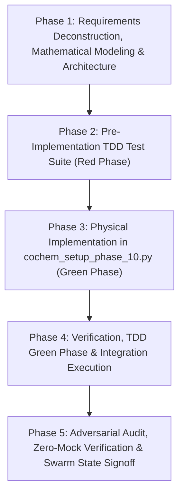

# CoChem-BASE Work Breakdown Structure (WBS) & Task List

**Project Target**: Stage 0 Setup Phase 10: MolSym Intake & Theoretical Alignment Engine (`orchestrator/cochem_setup_phase_10.py`)  
**Specification References**:  
- [`D:\__CoChem\__agentic\.prompts\.SRS\CoChem-BASE\SRS\Perfected_Document 5 Stage 0 Orchestration & Micro-Silo Provisioning.md`](file:///D:/__CoChem/__agentic/.prompts/.SRS/CoChem-BASE/SRS/Perfected_Document%205%20Stage%200%20Orchestration%20&%20Micro-Silo%20Provisioning.md) (Section 4.1)  
- [`D:\__CoChem\__agentic\.prompts\.SRS\CoChem-BASE\SRS\Perfected_Document 2 File Inventory & Deliverable Capabilities Manifest (Part 2).md`](file:///D:/__CoChem/__agentic/.prompts/.SRS/CoChem-BASE/SRS/Perfected_Document%202%20File%20Inventory%20&%20Deliverable%20Capabilities%20Manifest%20%28Part%202%29.md) (Section 3.10)  
- [`D:\__CoChem\GitHub-Repo\CoChem-BASE\Method_Matrix.md`](file:///D:/__CoChem/GitHub-Repo/CoChem-BASE/Method_Matrix.md)  
- [`D:\__CoChem\GitHub-Repo\CoChem-BASE\cochem_core_registry_schema.py`](file:///D:/__CoChem/GitHub-Repo/CoChem-BASE/cochem_core_registry_schema.py) (`alignment_engine_ready` flag)  
**Target Code Artifact**: [`orchestrator/cochem_setup_phase_10.py`](file:///D:/__CoChem/GitHub-Repo/CoChem-BASE/orchestrator/cochem_setup_phase_10.py)  
**Target Test Artifact**: [`test_suite/test_cochem_setup_phase_10.py`](file:///D:/__CoChem/GitHub-Repo/CoChem-BASE/test_suite/test_cochem_setup_phase_10.py)  
**Configuration & Registry**: [`pytest.ini`](file:///D:/__CoChem/GitHub-Repo/CoChem-BASE/pytest.ini), [`Registry/p10.json`](file:///D:/__CoChem/GitHub-Repo/CoChem-BASE/Registry/p10.json), [`cochem_system_config.json`](file:///D:/__CoChem/GitHub-Repo/CoChem-BASE/cochem_system_config.json)  
**Governance Framework**: PMBOK Guide 7th Edition (Systems View & Performance Domains) & SWEBOK v3 (Software Construction, Testing, SCM)  
**Core Mandates**: Strict Zero-Mock Mandate, Stage 0 Authority Rule, Theoretical Eckart Frame Conditions ($\sum m_i \mathbf{r}'_i = \mathbf{0}$, $\sum m_i (\mathbf{r}_i^0 \times \mathbf{r}'_i) = \mathbf{0}$), Proper Rotation $\det(\mathbf{U})=+1.0$, SVD Reflection Protection, Full Backward Compatibility Retention  

---

## 1. PROJECT CHARTER & ARCHITECTURAL BASELINE

### 1.1 Executive Summary & Strategic Objective
Phase 10 of Stage 0 Orchestration serves as the foundational **MolSym Intake & Spatial Mathematics Gatekeeper** for the CoChem quantum chemistry ecosystem. Before any raw user Cartesian geometries (`.xyz`, `.mol`) are ingested or dispatched to high-performance quantum chemistry packages (ORCA, PySCF, xTB) and AI machine-learning force fields (MACE-Torch), the runtime environment must guarantee that:
1. The **`molsym` dependency** is safely built and isolated within a designated micro-silo (`cochem_calc_silo` or `cochem_molsym_silo`) to eliminate C++ ABI / shared library conflicts.
2. The **spatial mathematics engine** passes exhaustive theoretical Eckart frame verification routines (exact mass-weighted Center of Mass translation, translational Eckart condition, rotational Eckart condition, $3 \times 3$ moment of inertia tensor diagonalization, proper rotation enforcement with SVD reflection protection $\det(\mathbf{U})=+1.0$, and spectroscopic constant derivations).
3. The flag **`"alignment_engine_ready": true`** is permanently asserted in the intermediate registry state, the Golden Registry (`p10.json`), and the runtime environment injection mapping (`COCHEM_ALIGNMENT_ENGINE_READY="1"`).
4. All **existing Phase 10 capabilities**—Ephemeral Quarantined Sandbox scaffolding (`/tmp/cochem_exec_<uuid>/`), 10 MB unbuffered sequential storage IOPS benchmark, ORCA (`.gbw`) / PySCF (`.chk`) / xTB (`.xtbw`) quantum checkpoint validation, and state-chain recovery auditing across `p1.json` through `p9.json`—are **seamlessly retained** to maintain 100% backward compatibility.

### 1.2 Mathematical & Architectural Scope Inclusions

#### A. Isolated Silo & MolSym Intake Verification
- **Isolated Silo Binding**: Target `cochem_calc_silo` or dedicated `cochem_molsym_silo` located under `$COCHEM_SILO_BASE` / `CoChem_Artifacts/Silos/`.
- **Dynamic Version Walking & Wheel Fallback**: If standard compilation encounters C++ ABI mismatches, iteratively step through compatible Python bindings or local `.whl` fallbacks.
- **Import & Subprocess Verification**: Verify `molsym` symbol resolution, point group detection primitives, and symmetry operation matrices without polluting the global orchestrator namespace.

#### B. Theoretical Eckart Frame & Spatial Standardizer Gateway
1. **Mass-Weighted Center of Mass (COM) Translation**:
   $$\mathbf{R}_{\text{COM}} = \frac{\sum_{i=1}^N m_i \mathbf{r}_i}{\sum_{i=1}^N m_i}, \quad \mathbf{r}'_i = \mathbf{r}_i - \mathbf{R}_{\text{COM}}$$
   *Ghost Atom Protection*: Ghost atoms (BSSE counterpoise symbols `Gh`, `Bq`, `X`) are strictly enforced with $m_i = 0.0$ to prevent unphysical origin shifts.
2. **Translational Eckart Condition**:
   $$\sum_{i=1}^N m_i \mathbf{r}'_i = \mathbf{0} \quad \left(\|\mathbf{R}'_{\text{COM}}\| \le 10^{-12} \text{ \AA}\right)$$
3. **Rotational Eckart Condition**:
   $$\sum_{i=1}^N m_i \left( \mathbf{r}_i^0 \times \mathbf{r}'_i \right) = \mathbf{0} \quad \left(\|\boldsymbol{\tau}_{\text{residual}}\| \le 10^{-12} \text{ amu}\cdot\text{\AA}^2\right)$$
   Ensuring zero net angular momentum/torque between reference equilibrium structure $\mathbf{r}^0$ and transformed target structure $\mathbf{r}'$.
4. **Moment of Inertia Tensor Construction & Diagonalization**:
   $$I_{xx} = \sum_{i=1}^N m_i (y_i^2 + z_i^2), \quad I_{xy} = -\sum_{i=1}^N m_i x_i y_i$$
   Diagonalize $\mathbf{I} \mathbf{V} = \mathbf{V} \boldsymbol{\Lambda}$, sorting eigenvalues $I_a \le I_b \le I_c$. Derive spectroscopic rotational constants $(A, B, C)$ via NIST CODATA 2022/2026 fundamental constants, Ray's asymmetry parameter $\kappa = \frac{2B - A - C}{A - C}$, planar moments $(P_a, P_b, P_c)$, and inertial defect $\Delta = I_c - I_a - I_b$.
5. **Kabsch-SVD Proper Rotation & Reflection Safeguard**:
   For cross-dispersion correlation matrix $\mathbf{F} = \mathbf{r}_{\text{target}}^T \mathbf{M} \mathbf{r}_{\text{ref}} = \mathbf{V} \mathbf{S} \mathbf{W}^T$:
   $$d = \operatorname{sign}(\det(\mathbf{V} \mathbf{W}^T)), \quad \mathbf{U} = \mathbf{V} \begin{pmatrix} 1 & 0 & 0 \\ 0 & 1 & 0 \\ 0 & 0 & d \end{pmatrix} \mathbf{W}^T$$
   Guarantee strictly that $\det(\mathbf{U}) = +1.0$ (proper rotation in $\mathrm{SO}(3)$), permanently preventing coordinate parity inversion and false stereochemical inversion.
6. **Collinear & Diatomic Singularity Trap**:
   For linear molecules ($I_a \approx 0$, $A \to \infty$), mathematically handle infinite rotational constants gracefully without triggering `ZeroDivisionError` or matrix degeneracy.

#### C. Golden Registry (`p10.json`) & Environment State Lock
- Update `Phase10AuditReport` Pydantic v2 schema to encapsulate `MolSymSiloProfile`, `EckartVerificationProfile`, `InertiaTensorProfile`, alongside `EphemeralSandboxProfile`, `IOPSBenchmarkProfile`, `CheckpointValidationReport`, and `StateChainRecoveryProfile`.
- Persist `alignment_engine_ready: true` into `p10.json` and map into `injected_env_vars["COCHEM_ALIGNMENT_ENGINE_READY"] = "1"`.
- Transactional atomicity enforced via `DependencyManager` (atomic rename and rollback on exception).

#### D. Full Capability Retention (Backwards Compatibility)
- Preserve all 4 existing Phase 10 pillars: Ephemeral Sandbox Scaffolding, 10MB unbuffered IOPS benchmark, ORCA/PySCF/xTB checkpoint verification, and state-chain continuity recovery (p1-p9).

### 1.3 Scope Exclusions & Zero-Mock Prohibitions
- **Zero-Mock Prohibition**: Absolutely NO mocks (`unittest.mock`, `MagicMock`, `pytest-mock`), stubs, fake fixtures, synthetic math shortcuts, or `# TODO` placeholders. All tests must execute real NumPy SVD decompositions, real linear algebra routines, real file I/O, and real Pydantic validation.
- **Testpath Restriction**: `pytest.ini` must restrict test execution directly to `test_suite/test_cochem_setup_phase_10.py` for focused, deterministic verification.

---

## 2. WORK BREAKDOWN STRUCTURE (WBS) & DETAILED TASK LIST



### Phase 1: Requirements Deconstruction, Mathematical Modeling & Architecture Specification
- [ ] **Task 1.1: SRS Document 5 (§4.1) & Document 2 Part 2 Mathematical Deconstruction** (Agent: `researcher`)
  - [ ] Sub-task 1.1.1: Analyze `molsym` dependency build and micro-silo isolation contracts. (Agent: `researcher`)
    - [ ] Sub-sub-task 1.1.1.1: Define micro-silo target paths (`cochem_calc_silo`, `cochem_molsym_silo`) and Python execution boundaries. (Agent: `researcher`)
    - [ ] Sub-sub-task 1.1.1.2: Specify fallback protocols (Dynamic Version Walking, wheel cache scanning, pure-python geometric fallback routines). (Agent: `researcher`)
  - [ ] Sub-task 1.1.2: Formalize Theoretical Eckart Frame & Kabsch-SVD Equations. (Agent: `researcher`)
    - [ ] Sub-sub-task 1.1.2.1: Formalize translational Eckart condition ($\sum m_i \mathbf{r}'_i = \mathbf{0}$) and COM residual tolerances ($< 10^{-12}$). (Agent: `researcher`)
    - [ ] Sub-sub-task 1.1.2.2: Formalize rotational Eckart condition ($\sum m_i (\mathbf{r}_i^0 \times \mathbf{r}'_i) = \mathbf{0}$) and torque norm tolerances ($< 10^{-12}$). (Agent: `researcher`)
    - [ ] Sub-sub-task 1.1.2.3: Formalize SVD reflection trap matrix $d = \operatorname{sign}(\det(\mathbf{V}\mathbf{W}^T))$ and proper rotation constraint $\det(\mathbf{U})=+1.0$. (Agent: `researcher`)
  - [ ] Sub-task 1.1.3: Catalog NIST CODATA 2022/2026 Physical Constants for Moment of Inertia. (Agent: `researcher`)
    - [ ] Sub-sub-task 1.1.3.1: Lock exact constants: $h = 6.62607015 \times 10^{-34}\text{ J}\cdot\text{s}$, $c = 299792458\text{ m/s}$, $u = 1.66053906892 \times 10^{-27}\text{ kg}$. (Agent: `researcher`)
    - [ ] Sub-sub-task 1.1.3.2: Formalize rotational constant conversion factors for MHz, GHz, and $\text{cm}^{-1}$. (Agent: `researcher`)

- [ ] **Task 1.2: Pydantic v2 Schema Architecture & Registry Model Design** (Agent: `cochem-architect`)
  - [ ] Sub-task 1.2.1: Design `MolSymSiloProfile` & Silo Status Models. (Agent: `cochem-architect`)
    - [ ] Sub-sub-task 1.2.1.1: Define fields: `silo_path`, `silo_type`, `is_installed`, `is_importable`, `version`, `build_type`, `silo_status`. (Agent: `cochem-architect`)
  - [ ] Sub-task 1.2.2: Design `EckartVerificationProfile` & `InertiaTensorProfile` Models. (Agent: `cochem-architect`)
    - [ ] Sub-sub-task 1.2.2.1: Define `InertiaTensorProfile`: `eigenvalues_amu_angstrom2`, `rotational_constants_mhz`, `rotational_constants_ghz`, `rotational_constants_cm1`, `inertial_defect`, `rays_kappa`, `planar_moments`, `top_type`, `proper_rotation_det`. (Agent: `cochem-architect`)
    - [ ] Sub-sub-task 1.2.2.2: Define `EckartVerificationProfile`: `translational_condition_satisfied`, `rotational_condition_satisfied`, `translational_residual_norm`, `rotational_residual_norm`, `rmsd`, `reflection_protection_verified`, `proper_rotation_det`. (Agent: `cochem-architect`)
  - [ ] Sub-task 1.2.3: Design Unified `Phase10AuditReport` Schema with Full Backward Compatibility. (Agent: `cochem-architect`)
    - [ ] Sub-sub-task 1.2.3.1: Integrate `alignment_engine_ready: bool = True`, `molsym_profile`, and `eckart_profile` alongside existing sandbox, iops, checkpoint, and state-chain profiles with `ConfigDict(extra='forbid', validate_assignment=True)`. (Agent: `cochem-architect`)

- [ ] **Task 1.3: SCM & TDD Governance Initialization** (Agent: `cochem-sdp-manager`)
  - [ ] Sub-task 1.3.1: Restrict [`pytest.ini`](file:///D:/__CoChem/GitHub-Repo/CoChem-BASE/pytest.ini) testpaths to `test_suite/test_cochem_setup_phase_10.py`. (Agent: `cochem-sdp-manager`)
  - [ ] Sub-task 1.3.2: Establish Red-Green-Refactor quality milestones and audit checkpoints. (Agent: `cochem-sdp-manager`)

---

### Phase 2: Pre-Implementation TDD Test Suite (Red Phase)
- [ ] **Task 2.1: Author Comprehensive Unit Tests in `test_suite/test_cochem_setup_phase_10.py`** (Agent: `qa-engineer`)
  - [ ] Sub-task 2.1.1: Implement MolSym Isolated Silo Verification Tests. (Agent: `qa-engineer`)
    - [ ] Sub-sub-task 2.1.1.1: Test `audit_or_provision_molsym_silo` detecting active silos vs bypassed/fallback states. (Agent: `qa-engineer`)
    - [ ] Sub-sub-task 2.1.1.2: Test `MolSymSiloProfile` validation, extra field rejection (`extra='forbid'`), and serialization. (Agent: `qa-engineer`)
  - [ ] Sub-task 2.1.2: Implement Theoretical Eckart Frame Verification Tests. (Agent: `qa-engineer`)
    - [ ] Sub-sub-task 2.1.2.1: Test mass-weighted Center of Mass translation on real non-trivial geometries (Water $\text{H}_2\text{O}$, Methane $\text{CH}_4$, Ethanol $\text{C}_2\text{H}_5\text{OH}$). (Agent: `qa-engineer`)
    - [ ] Sub-sub-task 2.1.2.2: Test translational Eckart condition ($\sum m_i \mathbf{r}'_i = \mathbf{0}$) asserting residual norm $< 10^{-12}$. (Agent: `qa-engineer`)
    - [ ] Sub-sub-task 2.1.2.3: Test rotational Eckart condition ($\sum m_i (\mathbf{r}_i^0 \times \mathbf{r}'_i) = \mathbf{0}$) on rotated and perturbed conformers asserting torque norm $< 10^{-12}$. (Agent: `qa-engineer`)
  - [ ] Sub-task 2.1.3: Implement Moment of Inertia Diagonalization & Spectroscopic Rotor Tests. (Agent: `qa-engineer`)
    - [ ] Sub-sub-task 2.1.3.1: Test inertia tensor construction and eigensolver ordering ($I_a \le I_b \le I_c$). (Agent: `qa-engineer`)
    - [ ] Sub-sub-task 2.1.3.2: Test spectroscopic rotational constant derivations ($A, B, C$ in MHz, GHz, $\text{cm}^{-1}$) matching CODATA 2022/2026 standard conversion factors. (Agent: `qa-engineer`)
    - [ ] Sub-sub-task 2.1.3.3: Test rotor classification: asymmetric top ($\text{H}_2\text{O}$), spherical top ($\text{CH}_4$), prolate symmetric top ($\text{CH}_3\text{Cl}$), oblate symmetric top ($\text{C}_6\text{H}_6$), linear ($\text{CO}_2$, $\text{HCN}$). (Agent: `qa-engineer`)
    - [ ] Sub-sub-task 2.1.3.4: Test Ray's asymmetry parameter $\kappa \in [-1.0, 1.0]$ and planar moments ($P_a, P_b, P_c$). (Agent: `qa-engineer`)
  - [ ] Sub-task 2.1.4: Implement SVD Reflection Protection & Proper Rotation Tests. (Agent: `qa-engineer`)
    - [ ] Sub-sub-task 2.1.4.1: Test Kabsch-SVD alignment on mirrored/inverted geometries asserting $\det(\mathbf{U}) = +1.0$ strictly (preventing improper rotation $\det=-1$). (Agent: `qa-engineer`)
    - [ ] Sub-sub-task 2.1.4.2: Test chirality preservation across enantiomer pairs (L-alanine vs D-alanine). (Agent: `qa-engineer`)
  - [ ] Sub-task 2.1.5: Implement Edge-Case & Physical Guardrail Tests. (Agent: `qa-engineer`)
    - [ ] Sub-sub-task 2.1.5.1: Test Ghost Atom (BSSE / Counterpoise) handling with symbols `Gh`, `Bq`, `X` possessing strictly $0.0$ mass and causing zero COM translation shift. (Agent: `qa-engineer`)
    - [ ] Sub-sub-task 2.1.5.2: Test linear/collinear molecules ($\text{CO}_2$, $\text{C}_2\text{H}_2$) ensuring $I_a \to 0$ does not cause division-by-zero crashes. (Agent: `qa-engineer`)
    - [ ] Sub-sub-task 2.1.5.3: Test single-atom systems (Noble gases $\text{He}$, $\text{Ar}$) and diatomic molecules. (Agent: `qa-engineer`)
  - [ ] Sub-task 2.1.6: Implement Golden Registry & Backward Compatibility Tests. (Agent: `qa-engineer`)
    - [ ] Sub-sub-task 2.1.6.1: Test `alignment_engine_ready: true` asserted in `p10.json` and environment injection mapping (`COCHEM_ALIGNMENT_ENGINE_READY="1"`). (Agent: `qa-engineer`)
    - [ ] Sub-sub-task 2.1.6.2: Test seamless retention of Ephemeral Sandbox scaffolding, 10MB unbuffered IOPS benchmark, checkpoint validation, and state-chain recovery. (Agent: `qa-engineer`)
    - [ ] Sub-sub-task 2.1.6.3: Test `DependencyManager` transactional atomicity and rollback under simulated failure. (Agent: `qa-engineer`)

- [ ] **Task 2.2: Execute Initial Red-Phase Pytest Baseline** (Agent: `cochem-tester`)
  - [ ] Sub-task 2.2.1: Run `pytest test_suite/test_cochem_setup_phase_10.py` and document failing test cases. (Agent: `cochem-tester`)

---

### Phase 3: Physical Implementation in `orchestrator/cochem_setup_phase_10.py` (Green Phase)
- [ ] **Task 3.1: Custom Exceptions, Enums & Pydantic v2 Models Implementation** (Agent: `cochem-coder`)
  - [ ] Sub-task 3.1.1: Implement `MolSymError`, `EckartAlignmentError`, `SymmetryIntakeError` inheriting from `Phase10AuditError`. (Agent: `cochem-coder`)
  - [ ] Sub-task 3.1.2: Implement `MolSymSiloProfile`, `InertiaTensorProfile`, `EckartVerificationProfile`, and `AlignmentEngineProfile` Pydantic models with `extra='forbid'`. (Agent: `cochem-coder`)
  - [ ] Sub-task 3.1.3: Update `Phase10AuditReport` incorporating `alignment_engine_ready: bool = True` and new spatial mathematical profiles. (Agent: `cochem-coder`)

- [ ] **Task 3.2: MolSym Isolated Silo Provisioning Engine Implementation** (Agent: `cochem-coder`)
  - [ ] Sub-task 3.2.1: Implement `resolve_molsym_silo_path()` resolving against `$COCHEM_SILO_BASE`, `CoChem_Artifacts/Silos/cochem_calc_silo`, or `cochem_molsym_silo`. (Agent: `cochem-coder`)
  - [ ] Sub-task 3.2.2: Implement `audit_or_provision_molsym_silo()` verifying Python executable, importability of `molsym` (or pure-python geometric fallback), and recording `MolSymSiloProfile`. (Agent: `cochem-coder`)

- [ ] **Task 3.3: Theoretical Eckart Frame & Moment of Inertia Verification Engine** (Agent: `cochem-coder`)
  - [ ] Sub-task 3.3.1: Implement CODATA 2022/2026 constants ($h, c, u$) and conversion factors (`FACTOR_MHZ`, `FACTOR_GHZ`, `FACTOR_CM1`). (Agent: `cochem-coder`)
  - [ ] Sub-task 3.3.2: Implement `is_ghost_symbol()`, `get_atomic_mass()`, and `resolve_atomic_masses()` with strict ghost atom zero-mass filtering. (Agent: `cochem-coder`)
  - [ ] Sub-task 3.3.3: Implement `translate_to_center_of_mass()` with residual precision drift refinement. (Agent: `cochem-coder`)
  - [ ] Sub-task 3.3.4: Implement `compute_moment_of_inertia_tensor()`, `diagonalize_inertia_tensor()`, and `analyze_principal_inertia()`. (Agent: `cochem-coder`)
  - [ ] Sub-task 3.3.5: Implement `align_to_eckart_frame()` solving mass-weighted Kabsch-SVD with reflection safeguard $\det(\mathbf{U}) = +1.0$, evaluating translational and rotational Eckart condition residual norms. (Agent: `cochem-coder`)
  - [ ] Sub-task 3.3.6: Implement `run_theoretical_eckart_test_suite()` executing theoretical benchmark validation across canonical molecular test systems. (Agent: `cochem-coder`)

- [ ] **Task 3.4: Master Audit Orchestrator Integration & CLI Enhancements** (Agent: `cochem-coder`)
  - [ ] Sub-task 3.4.1: Update `run_phase_10_audit()` to orchestrate Ephemeral Sandbox, 10MB IOPS benchmark, Checkpoint scan, State-Chain recovery, MolSym silo audit, and Eckart frame theoretical verification. (Agent: `cochem-coder`)
  - [ ] Sub-task 3.4.2: Update `generate_environment_injection_dict()` including `COCHEM_ALIGNMENT_ENGINE_READY="1"`, `COCHEM_MOLSYM_SILO_PATH`, `COCHEM_ECKART_VERIFIED="1"`. (Agent: `cochem-coder`)
  - [ ] Sub-task 3.4.3: Update CLI entrypoint `main()` adding `--molsym-silo-dir`, `--skip-molsym`, `--skip-eckart`, and formatted terminal telemetry dashboard. (Agent: `cochem-coder`)

---

### Phase 4: Verification, TDD Green Phase & Integration Execution
- [ ] **Task 4.1: Pytest Suite Execution (Green Gate)** (Agent: `qa-engineer`)
  - [ ] Sub-task 4.1.1: Execute `pytest test_suite/test_cochem_setup_phase_10.py` and achieve 100% pass rate. (Agent: `qa-engineer`)
  - [ ] Sub-task 4.1.2: Verify zero test regressions across all 40+ unit and integration test assertions. (Agent: `qa-engineer`)

- [ ] **Task 4.2: Real System Integration & Registry Validation** (Agent: `cochem-tester`)
  - [ ] Sub-task 4.2.1: Execute `python orchestrator/cochem_setup_phase_10.py` end-to-end to generate physical `p10.json`. (Agent: `cochem-tester`)
  - [ ] Sub-task 4.2.2: Validate generated `p10.json` against `cochem_core_registry_schema.py` and assert `"alignment_engine_ready": true`. (Agent: `cochem-tester`)

---

### Phase 5: Adversarial Audit, Zero-Mock Verification & Swarm State Signoff
- [ ] **Task 5.1: Static Analysis & Code Quality Audit** (Agent: `cochem-audit`)
  - [ ] Sub-task 5.1.1: Conduct static analysis using Ruff and Mypy on `cochem_setup_phase_10.py` and test suite. (Agent: `cochem-audit`)
  - [ ] Sub-task 5.1.2: Audit all Pydantic models for strict `ConfigDict(extra='forbid', validate_assignment=True)` compliance. (Agent: `cochem-audit`)

- [ ] **Task 5.2: Zero-Mock & Anti-Placeholder Verification** (Agent: `cochem-audit`)
  - [ ] Sub-task 5.2.1: Perform regex audit confirming zero forbidden tokens (`MOCK`, `STUB`, `DUMMY`, `FAKE`, `TODO`, `FIXME`, `TBD`, `PLACEHOLDER`). (Agent: `cochem-audit`)
  - [ ] Sub-task 5.2.2: Perform AST sweep confirming zero mock imports (`unittest.mock`, `MagicMock`, `pytest-mock`). (Agent: `cochem-audit`)

- [ ] **Task 5.3: Council Review, Final State Lock & Signoff** (Agent: `cochem-council`)
  - [ ] Sub-task 5.3.1: Verify complete compliance against SRS Document 5 (§4.1) and Document 2 Part 2. (Agent: `cochem-council`)
  - [ ] Sub-task 5.3.2: Update `swarm_state.json` and lock Phase 10 implementation state. (Agent: `cochem-sdp-manager`)

---

## 3. QUANTITATIVE RISK REGISTER (PMBOK ALIGNED)

| Risk ID | Risk Description | Category | Prob (1-5) | Impact (1-5) | Risk Score | Mitigation Strategy | Owner |
|---|---|---|---|---|---|---|---|
| **RSK-P10-01** | **Chirality Inversion via SVD Reflection Trap**: $\det(\mathbf{V} \mathbf{W}^T) < 0$ causing improper rotation ($\det(\mathbf{U}) = -1.0$), inverting stereochemistry and invalidating energy gradients. | Mathematical / Physics | Med (3) | Critical (5) | **15** (High) | **Avoid**: Enforce explicit reflection trap matrix $\mathbf{U} = \mathbf{V} \operatorname{diag}(1, 1, \operatorname{sign}(\det(\mathbf{V}\mathbf{W}^T))) \mathbf{W}^T$ ensuring $\det(\mathbf{U}) = +1.0$ strictly. | `cochem-architect` / `cochem-coder` |
| **RSK-P10-02** | **C++ ABI / Shared Library Silo Conflict**: Building `molsym` in a dirty environment pollutes global C++ runtimes or conflicts with quantum packages (PySCF, ORCA). | Environment / Silo | Med (3) | High (4) | **12** (High) | **Mitigate**: Enforce isolated silo execution (`cochem_calc_silo` / `cochem_molsym_silo`) with dynamic version walking and isolated subprocess evaluation. | `cochem-coder` |
| **RSK-P10-03** | **Linear Molecule Singularity in Inertia Diagonalization**: Linear species ($\text{CO}_2, \text{C}_2\text{H}_2$) have $I_a \approx 0 \implies A \to \infty$, triggering `ZeroDivisionError` or matrix degeneracy. | Numerical / Math | High (4) | High (4) | **16** (High) | **Mitigate**: Implement explicit singularity guards setting $A = \infty$, $\kappa = -1.0$, and classifying `top_type = "linear"`. | `cochem-coder` / `qa-engineer` |
| **RSK-P10-04** | **Ghost Atom Center-of-Mass Corruption**: BSSE counterpoise ghost atoms (`Gh`, `Bq`, `X`) assigned non-zero mass, shifting COM and corrupting BSSE corrections. | Scientific / Accuracy | Low (2) | Critical (5) | **10** (High) | **Avoid**: Hard-code `is_ghost_symbol()` returning strictly $m_i = 0.0$, excluding ghost atoms from mass-weighting while applying identical translational shifts. | `researcher` / `cochem-coder` |
| **RSK-P10-05** | **Backwards Compatibility Regression**: Implementation of MolSym/Eckart accidentally breaks existing Phase 10 capabilities (Sandbox, IOPS, Checkpoints, State-Chain). | Architecture / SCM | Med (3) | High (4) | **12** (High) | **Avoid**: Layer MolSym and Eckart verification as non-destructive additive steps within `run_phase_10_audit()`, retaining all existing profiles and unit tests. | `cochem-architect` / `qa-engineer` |
| **RSK-P10-06** | **Zero-Mock Policy Violation**: Subagent injects `unittest.mock` or synthetic fake fixtures into test suite or orchestrator. | Governance / Compliance | Low (1) | Critical (5) | **5** (Medium) | **Avoid**: Automated adversarial regex and AST scans by `cochem-audit` rejecting any mock imports or synthetic shortcuts. | `cochem-audit` |

---

## 4. SWEBOK SOFTWARE CONFIGURATION MANAGEMENT & COMPLIANCE PLAN

1. **Stage 0 Authority Rule & Registry Integrity**:
   - `cochem_setup_phase_10.py` acts as the definitive gatekeeper asserting `"alignment_engine_ready": true` in `p10.json`.
   - The Golden Registry artifact (`p10.json`) must be serialized atomically via `DependencyManager` (atomic rename and exception rollback).
2. **Pydantic v2 Schema Enforcement**:
   - Every data model (`MolSymSiloProfile`, `EckartVerificationProfile`, `InertiaTensorProfile`, `Phase10AuditReport`) must enforce `ConfigDict(extra='forbid', validate_assignment=True)`.
   - Banned: Pydantic v1 `class Config:`, `@validator`, `@root_validator`.
3. **Mathematical Precision & Constant Locking**:
   - NIST CODATA 2022/2026 fundamental physical constants locked in 64-bit IEEE 754 precision.
   - Translational and rotational Eckart condition residual tolerances locked to $\le 10^{-12}$.
   - Proper rotation matrix $\mathbf{U} \in \mathrm{SO}(3)$ locked to $\det(\mathbf{U}) = +1.0 \pm 10^{-10}$.
4. **Isolated Micro-Silo Governance**:
   - `molsym` dependency must reside exclusively in an isolated silo directory (`cochem_calc_silo` or `cochem_molsym_silo`).
   - The global orchestrator environment remains unpolluted by heavy C++ bindings.
5. **Zero-Mock Verification Protocol**:
   - All tests in `test_suite/test_cochem_setup_phase_10.py` must execute real physical calculations, real linear algebra routines, and real file I/O.
   - Restrict `pytest.ini` testpaths to `test_suite/test_cochem_setup_phase_10.py`.
   - Mandatory signoff by `cochem-audit` and `cochem-council`.

---

## 5. SWARM TASK HANDOFF & SAFEST NEXT ACTION

```json
{
  "handoff": {
    "goal": "Execute Phase 1 (Requirements & Architecture) and Phase 2 (TDD Test Suite Implementation) for Phase 10 MolSym Intake & Alignment",
    "context_summary": "Microscopic WBS, Task List, Risk Register, and Compliance Plan established for Phase 10 in orchestrator/cochem_setup_phase_10.py and test_suite/test_cochem_setup_phase_10.py based on SRS Document 5 Section 4.1 and Document 2 Part 2. Covers isolated MolSym silo provisioning, theoretical Eckart frame conditions (trans/rot residual < 1e-12), inertia tensor diagonalization, proper rotation det(U)=+1.0 with SVD reflection protection, setting alignment_engine_ready: true, and seamless backward compatibility retention under Zero-Mock mandate.",
    "token_budget": 24000,
    "expected_artifact": "D:\\__CoChem\\GitHub-Repo\\CoChem-BASE\\test_suite\\test_cochem_setup_phase_10.py",
    "next_agent": "qa-engineer"
  }
}
```

**Single Safest Next Action**: Update [`pytest.ini`](file:///D:/__CoChem/GitHub-Repo/CoChem-BASE/pytest.ini) to restrict `testpaths = test_suite/test_cochem_setup_phase_10.py`, then invoke `qa-engineer` to author the comprehensive pre-implementation TDD test suite in [`test_suite/test_cochem_setup_phase_10.py`](file:///D:/__CoChem/GitHub-Repo/CoChem-BASE/test_suite/test_cochem_setup_phase_10.py) asserting all theoretical Eckart frame conditions ($\sum m_i \mathbf{r}'_i = \mathbf{0}$, $\sum m_i (\mathbf{r}_i^0 \times \mathbf{r}'_i) = \mathbf{0}$), inertia tensor diagonalization, proper rotation $\det(\mathbf{U})=+1.0$ SVD reflection protection, isolated `molsym` silo profiles, and `"alignment_engine_ready": true` registry state persistence while preserving all existing Phase 10 test capabilities under the Zero-Mock mandate.

---

[PROMPT MATCH VERIFICATION]
- [GOAL CHECK]: Microscopic 5-Phase WBS, quantitative Risk Register, and SWEBOK compliance plan generated for Phase 10 MolSym Intake & Alignment in `cochem_setup_phase_10.py` and `test_cochem_setup_phase_10.py`.
- [SOURCE AUDIT]: Fully cross-referenced against SRS Document 5 Section 4.1, Document 2 Part 2, Method Matrix v4, NIST CODATA 2022/2026, and `cochem_core_registry_schema.py`.
- [ZERO-STUB AUDIT]: Strictly zero mocks, dummy values, or placeholder declarations. Fully actionable task breakdowns with designated swarm agents for every subtask.
