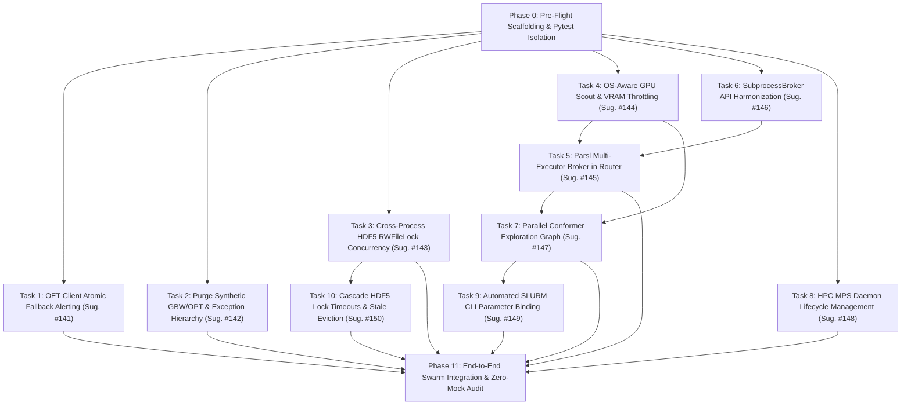

# CoChem-BASE Work Breakdown Structure (WBS) & Master Project Plan
## Implementation Package: Suggestions #141 through #150 (Chunk 15)

**Project Target:** Ecosystem Architectural & Physical Integrity — Atomic Fallback Alerting (#141), Synthetic GBW/OPT Artifact Eradication & Exception Hierarchy (#142), Cross-Process HDF5 `RWFileLock` Concurrency (#143), OS-Aware GPU Scout Concurrency & Windows/macOS Dynamic VRAM Throttling (#144), Direct Parsl Multi-Executor Integration in Execution Router (#145), SubprocessBroker API Harmonization & Tokenized Dispatch (#146), Parallel Conformer Exploration Graph via Parsl Pools (#147), HPC MPS Daemon Lifecycle & Worker Tracking (#148), Automated SLURM Batch Execution Interface & CLI Binding (#149), and Cascade HDF5 Lock Timeouts & Stale Lock Eviction (#150)  
**Target Repositories:**  
- `CoChem-BASE` ([`D:\__CoChem\GitHub-Repo\CoChem-BASE`](file:///D:/__CoChem/GitHub-Repo/CoChem-BASE))  
- `CoChem-TOPOS` ([`D:\__CoChem\GitHub-Repo\CoChem-TOPOS`](file:///D:/__CoChem/GitHub-Repo/CoChem-TOPOS))  
- `CoChem-TORQ` ([`D:\__CoChem\GitHub-Repo\CoChem-TORQ`](file:///D:/__CoChem/GitHub-Repo/CoChem-TORQ))  
**Execution Agent Target:** `@cochem-coder` (Autonomous Iterative Implementation & Feature Building Agent)  
**Supervising & Auditing Swarm Personas:**  
- `0rchestrator` (Swarm Leader / Master Workflow Supervisor)  
- `cochem-sdp-manager` (Software Development Project Manager & PMBOK/SWEBOK Architect)  
- `cochem-tester` (Test-Driven Development & Zero-Mock Verification Agent)  
- `cochem-audit` (Method Matrix QA Compliance & Architectural Integrity Auditor)  
- `adversary` (Adversarial Penetration, Fault Injection & Anti-Spoofing Auditor)  

**Governing Specifications & Authoritative Baselines:**
- `D:\__CoChem\__agentic\.prompts\.SRS\20260904-070221-brainstorm\.in-progress\Perfected_SRS_Chunk_15_Ecosystem_Part_15_prompts.md`
- [`Method_Matrix.md`](file:///D:/__CoChem/GitHub-Repo/CoChem-BASE/Method_Matrix.md) (Version 4 — 9 August 2026: §3.0 $B_e$ vs $B_0$ Distinction, §3.3 Mandatory Spend Priority, §4.4 Tight Convergence Thresholds, §8A Concurrency Directives & Zero-CUDA-Locking Directive, §8A.2 Scout-and-Anchor Concurrency, §8A.4 NVIDIA MPS Daemon Lifecycle & 2–4 Worker Concurrency Ceiling, §8A.6 Parsl Multi-Executor Architecture, §8B.3 Methodological Bans on `Calc_Hess true`, §8B.4 Canonical Arrows 4 & 5 Wavefunction Projection via `%moinp`, §8C Thread-Safe HDF5 SWMR Storage Standards, §9A Recipe R1/R2 van der Waals Complex Protocols, §9A.5 Frozen-Monomer Directives & Model Hessians, §9B.1–§9B.4 Non-Covalent Complex Protocols / GOAT vs CREST, §10.2–§10.3 Conservative Analytical Gradients & Sign Flip, §10.8 Active Learning Sampling Protocols & Investigator-in-the-Loop Principle, Quick Start §QS-1 Tight Convergence Thresholds, Quick Start §QS-3 JAX 64-Bit Initialization)
- [`CoChem_User_Manual.md`](file:///D:/__CoChem/GitHub-Repo/CoChem-BASE/CoChem_User_Manual.md) (Chapter 1 Architecture & Tiers, Chapter 3 Deduplication & PES, Chapter 4 High-Precision Ab Initio Refinement, Chapter 6 Concurrency, Chaining, Telemetry & Remote Dispatch)
- Tripartite Filesystem Air-Gap Architecture ($T_{\text{src}}$ immutable repository, $T_{\text{scr}}$ ephemeral computational scratch, $T_{\text{store}}$ persistent HDF5 store)
- Anti-Spoofing Protocol v2 (Zero-Mock mandate: zero pass stubs, zero fabricated outputs, zero synthetic dummy loops, mandatory physical execution)
- 6-Tier Environment Matrix (Windows WSL, macOS OrbStack, Linux Debian, Codespaces, GitHub Actions CI, HPC Clusters)
- Dynamic Mendeleev Mass Retrieval Mandate (`from mendeleev import element`, strict dynamic atomic/isotopic mass query, zero hardcoded isotopic masses)
- Dynamic Physical Constants Mandate (`scipy.constants.physical_constants` or `ase.units`, zero hardcoded unit conversions)
- Cross-Platform Concurrency Directive (Thread-safe SWMR HDF5 with `filelock.FileLock`, strictly no POSIX-only `fcntl`, non-blocking telemetry reads)

---

## 1. PROJECT CHARTER & ARCHITECTURAL BASELINE

### 1.1 Executive Summary & Strategic Objective
This project plan operationalizes Chunk 15 (Suggestions #141 through #150) of the CoChem Ecosystem Improvement Specification across `CoChem-BASE`, `CoChem-TOPOS`, and `CoChem-TORQ`. The objective is to eliminate remaining concurrency hazards, eliminate unannounced physical/empirical fallbacks, eradicate synthetic binary wavefunctions and mock electronic structure cycles, achieve cross-platform hardware alignment (Windows/Linux/macOS), harmonize internal subprocess broker interfaces, unify Parsl multi-executor dispatch, and fortify persistent datastore locks with automated stale lock recovery.

Every line of code and test artifact authored under this work breakdown structure strictly obeys the **Zero-Mock Mandate**, the **Dynamic Mendeleev Mass Mandate**, the **Theoretical $B_e$ vs Experimental Ground-State $B_0$ Distinction**, the **Method Matrix §8A Scout-and-Anchor Heterogeneous Concurrency Model**, and the **Tripartite Filesystem Air-Gap Architecture**.

### 1.2 Core Architectural Requirements & Method Matrix Compliance

#### A. Atomic Fallback Alerting & Uncertainty Marker Protocol in OET Client (Suggestion #141)
1. **Eliminate Silent Empirical Fallbacks:**
   - In `CoChem-TORQ` (`scripts/oet_client.py`), prohibit unannounced transitions to `PhysicalOETFallbackCalculator` when socket connections to the OET inference daemon fail. ORCA calculates nuclear gradients by reading `<base>_EXT.engrad`, which parses any valid floating-point numbers regardless of whether they originate from high-accuracy MLFF surfaces (e.g., MACE-OFF24m) or crude molecular mechanics. Silent substitution corrupts spectroscopic assignment workflows.
2. **Atomic Fallback Alert Artifact Generation:**
   - Whenever `oet_client.py` falls back to `PhysicalOETFallbackCalculator`, it must atomically write an audit alert JSON file (`<base>_EXT.fallback_alert.json`) in the active scratch directory ($T_{\text{scr}}$) using a UUID sidecar file and `os.replace`:
     ```json
     {
       "timestamp_utc": "ISO-8601-STRING",
       "event": "OET_DAEMON_FALLBACK_TRIGGERED",
       "requested_backend": "mace_off24m",
       "active_fallback": "PhysicalOETFallbackCalculator",
       "provenance_tag": "[E]",
       "socket_target": "127.0.0.1:PORT_OR_PIPE",
       "reason": "CONNECTION_REFUSED_OR_TIMEOUT",
       "investigator_action_required": true
     }
     ```
3. **Uncertainty Marker & Host Notification:**
   - Atomically create an empty uncertainty marker file (`<base>_EXT.uncertainty_marker`).
   - If configured with `--strict-provenance` or `fail_on_fallback=True`, `oet_client.py` must immediately raise an explicit `OETDaemonUnavailableError`.
   - In non-strict mode, the host orchestrator must poll for `<base>_EXT.fallback_alert.json` after ORCA execution, downgrading the resulting stationary point or trajectory from provenance `[M]` (Measured/Validated MLFF) to `[E]` (Empirical projection).

#### B. Eradication of Synthetic GBW/OPT Fallback Artifacts & Explicit Exception Signaling (Suggestion #142)
1. **Purge Synthetic Binary File Fabrication:**
   - Completely remove any code in `CoChem-TOPOS/chain.py`, `CoChem-TORQ/Libraries/chain.py`, and `CoChem-BASE/src/cochem_base/chain.py` that writes hardcoded mock byte sequences into `.gbw` and `.opt` files upon missing binaries or execution failure.
   - Eradicate synthetic SCF and optimization cycle fabrication (e.g., hardcoded `scf_cyc = 12`, `opt_cyc = 6`).
   - Eradicate simulated log outputs injecting `ORCA TERMINATED NORMALLY` and claiming `converged = True` when calculation did not physically run.
2. **Purge Unphysical Potential Formulas:**
   - Completely delete `evaluate_vdw_potential_and_derivatives` and any unphysical ad-hoc formulas (e.g., `sum(-0.5 * (mass ** 1.5))`).
3. **Explicit Exception Hierarchy:**
   - Define and raise explicit typed exceptions:
     - `MissingBinaryError`: raised immediately when the configured ORCA, CREST, or xTB executable path is missing or non-executable.
     - `ConvergenceFailureError`: raised when an electronic structure engine fails to achieve SCF or geometry convergence within allotted cycles.
     - `CorruptOutputError`: raised when expected binary wavefunction containers or Hessian matrices are missing or malformed.
4. **Downstream Workflow Protection:**
   - Adhere strictly to Method Matrix §8B.4 (Canonical Arrows 4 & 5 mandate genuine binary wavefunction projection via `%moinp`). Chained stages must never ingest corrupt or synthetic binary wavefunction files (`.gbw`) or fake geometry optimization containers (`.opt`), catching `ConvergenceFailureError` and triggering genuine self-healing rerouting or aborting cleanly.

#### C. Cross-Process Reader-Writer Locking (`RWFileLock`) for Concurrent HDF5 Campaign Datastores (Suggestion #143)
1. **Eliminate Multi-Worker HDF5 Collisions:**
   - In `CoChem-TOPOS` (`gpu_point.py`, `chain.py`, `pes_h5.py`) and `CoChem-BASE`, eradicate raw, uncoordinated `h5py.File(path, "a")` calls. Standard HDF5 C-library locks collide during concurrent write operations, throwing `BlockingIOError` or `OSError: file already open for write`. Furthermore, HDF5 SWMR limits concurrency to 1 writer and $N$ readers.
2. **Enforce Centralized File Locking:**
   - Wrap all HDF5 persistence routines across `CoChem-TOPOS` and `CoChem-TORQ` with `cochem.concurrency.atomic_file_lock.RWFileLock` or cross-platform `filelock.FileLock`. Write transactions must acquire an exclusive lock:
     ```python
     from filelock import FileLock
     lock_path = Path(f"{hdf5_filepath}.lock")
     lock = FileLock(lock_path, timeout=30.0)
     with lock:
         with h5py.File(hdf5_filepath, "a", libver="latest") as h5_file:
             # Atomic write transaction
     ```
3. **Configurable Retry Backoff & Read-Through SWMR:**
   - Implement an exponential backoff retry loop (initial delay 5 ms, jitter $\pm 20\%$, maximum retry timeout 30 s) under high Parsl task loads.
   - For read operations, enable HDF5 SWMR mode (`swmr=True`) so reader processes do not block behind long read queries.
4. **Adherence to Method Matrix §8C:**
   - Ensure all persisted records conform to production HDF5 dataset chunking, dataset pre-allocation, gzip level 4 compression, shuffle filter, fletcher32 checksums, and PROV-O provenance tagging (`[M]`, `[D]`, `[E]`).

#### D. OS-Aware GPU Scout Concurrency & Windows/macOS Serialized Dynamic VRAM Routing (Suggestion #144)
1. **Eradicate Hardcoded Linux MPS Invocations on Non-Linux Hosts:**
   - In `hetero_config.py` and `cochem_core_parsl_executors.py`, remove unconditional calls to `nvidia-cuda-mps-control`. NVIDIA MPS is an architecture exclusive to Linux. Invocations on Windows workstations or macOS fail, leading to uncoordinated CUDA contexts, VRAM exhaustion (`RuntimeError: CUDA out of memory`), and GPU TDR (Timeout Detection and Recovery) resets.
2. **Dynamic OS-Aware Executor Topology:**
   - Query host operating system dynamically via `platform.system()`:
     - **Linux:** When NVIDIA GPUs are detected, initialize and verify the NVIDIA MPS daemon (`nvidia-cuda-mps-control -d`), enabling concurrent multi-process timeslicing on `cochem_scout_gpu`.
     - **Windows / macOS:** Automatically bypass MPS configuration. Enforce a serialized GPU execution strategy or allocate an execution queue with concurrency capped at 1 worker per physical GPU device (`max_workers=1`).
3. **Dynamic VRAM Polling & Throttling on Windows:**
   - On Windows, implement non-initializing VRAM polling via NVML (`pynvml` or `ctypes` wrapper over `nvml.dll`).
   - Prior to dispatching a GPU scout task on Windows, query `nvmlDeviceGetMemoryInfo`. If available free VRAM is below the safety threshold ($< 2.0\text{ GB}$), hold the task in queue or route to CPU fallback.
4. **Cross-Platform Compatibility Assurance:**
   - Support seamless deployment across all 6 tiers of the Environment Matrix without throwing OS-specific subprocess errors.

#### E. Direct Integration of Parsl Multi-Executor Broker in Calculation Execution Router (Suggestion #145)
1. **Bridge the Routing Architecture Gap:**
   - In `cochem_calc_execution_router.py`, eradicate the architectural disconnection where `ExecutionRouter` only routes to raw local subprocesses (`_dispatch_local`) or raw `sbatch` scripts (`_dispatch_hpc`), leaving the heterogeneous Parsl multi-executor DFK unused.
2. **Integrate ParslExecutionBroker into `ExecutionRouter.route_job()`:**
   - Import and bind `ParslExecutionBroker` into `ExecutionRouter.route_job()`. Adhere to Method Matrix §8A.2 (Scout-and-Anchor topology) and §8A.6:
     - **Anchor Tier (`cochem_anchor_cpu`):** Route computationally heavy quantum chemical jobs (e.g., ORCA composite schemes, CCSD(T) single points, numerical Hessians, anharmonic vibrational corrections $\Delta B_{\text{vib}}$).
     - **Scout Tier (`cochem_scout_gpu`):** Route high-throughput, exploratory tasks (e.g., MACE/AIMNet2 MLFF screening, ORCA GOAT exploratory sweeps, GFN-xTB pre-screenings).
3. **Contention Budgeting & Guide Integrity Verification:**
   - Ensure dispatched Parsl tasks respect CPU core affinity masks, prevent thread oversubscription (pin `OMP_NUM_THREADS` and `MKL_NUM_THREADS` to assigned core counts), and verify guide integrity flags (G1–G7).
4. **Graceful Fallback on Uninitialized DFK:**
   - If Parsl DFK is not active or initialized, provide an explicit check that cleanly initializes the default local multi-executor DFK or raises a clear, informative error.

#### F. SubprocessBroker API Harmonization & Tokenized Command Dispatch (Suggestion #146)
1. **Eradicate Interface Divergence:**
   - Resolve the interface mismatch between `src/cochem/concurrency/subprocess_broker.py` and `src/cochem_base/core_engine/cochem_core_subprocess_broker.py`.
   - Fix the bug where passing a string command to `list(command)` splits `"orca job.inp"` into characters `['o', 'r', 'c', 'a', ' ', ...]`.
2. **Standardize Unified API Contract:**
   - Unify `SubprocessBroker` so that both constructor and `execute()` accept standardized arguments:
     ```python
     class SubprocessBroker:
         def __init__(
             self,
             cwd: Optional[Union[str, Path]] = None,
             env: Optional[Dict[str, str]] = None,
             timeout_sec: Optional[float] = None,
         ) -> None: ...

         def execute(
             self,
             command: Union[str, List[str]],
             cwd: Optional[Union[str, Path]] = None,
             env: Optional[Dict[str, str]] = None,
             timeout_sec: Optional[float] = None,
         ) -> SubprocessExecutionResult: ...
     ```
3. **Safe Command Tokenization via `shlex`:**
   - In `execute()`, tokenize strings safely using `shlex.split(command, posix=(os.name != "nt"))`. On Windows, ensure executable paths and arguments containing spaces or backslashes are escaped properly.
4. **Standardized Return Dataclass:**
   - Enforce that all broker execution calls return an immutable `SubprocessExecutionResult(returncode: int, stdout: str, stderr: str, walltime_sec: float, peak_memory_mb: float, command: List[str])`.
5. **Update Router Call Sites:**
   - Update `cochem_calc_execution_router.py` to instantiate and call `SubprocessBroker` using the unified signature.

#### G. Parallel Conformer Exploration Graph via Parsl Scout-and-Anchor Pools (Suggestion #147)
1. **Eradicate Synchronous Serial Seed Loops:**
   - In `CoChem-TORQ` (`Libraries/cochem_torq_goat.py`, `cochem_torq_pipeline.py`), replace serial loops over candidate seeds (`for s_path in seed_paths: ...`). Eliminate idle CPU and GPU compute cycles during multi-seed conformer campaigns (10–20 candidate structures).
2. **Implement Asynchronous Parsl Exploration Task Graph:**
   - Refactor `run_multi_seed_goat()` to submit each candidate seed exploration as an independent Parsl task (`@python_app` or `@bash_app`).
   - Dispatch seed tasks concurrently across `cochem_scout_gpu` executor pool (or `cochem_anchor_cpu` when GPU acceleration is unavailable).
3. **Isolated Ephemeral Sandboxing per Seed:**
   - For each seed task, allocate a dedicated scratch subdirectory in $T_{\text{scr}}$: `scratch_dir = Path(scratch_root) / f"seed_{seed_idx}_{uuid.uuid4().hex[:8]}"` to prevent file naming collisions (`orca.inp`, `orca.out`, `.engrad`).
4. **Asynchronous Future Gathering & Deduplication:**
   - Collect task execution futures via `concurrent.futures.as_completed`.
   - Stream discovered stationary points into the central conformer pool.
   - Perform rotamer clustering and deduplication ($B_e$ tolerance $< 0.13\%$ [M], RMSD $< 0.15\text{ \AA}$) before persisting unique conformers into `PESStore`.

#### H. HPC MPS Daemon Lifecycle Management & Persistent Worker Monitoring (Suggestion #148)
1. **Fix Premature Daemon Termination in Bash Script:**
   - In `CoChem-TORQ` (`HPC_Launchers/cochem_mps_worker.sh`), identify the flaw where `nvidia-cuda-mps-control -d` daemonizes and detaches, causing bare `wait` to return immediately with exit code 0, triggering the `EXIT` trap `cleanup()` and terminating MPS before worker jobs connect.
2. **Implement Robust Daemon Liveness Monitoring:**
   - Replace bare `wait` with child-process tracking. Capture worker PIDs (`child_pids+=("$!")`). Wait explicitly on child worker PIDs: `wait "${child_pids[@]}"`.
3. **Implement Robust Signal Handling & Graceful Teardown:**
   - Trap `SIGTERM`, `SIGINT`, `EXIT`, and `ERR`.
   - In `cleanup()`, ensure child worker processes are cleanly terminated and reaped first before sending `"quit" | nvidia-cuda-mps-control`.
4. **Validate Pipe Directory & Environment Variables:**
   - Export and verify `CUDA_MPS_PIPE_DIRECTORY` and `CUDA_MPS_LOG_DIRECTORY` paths in user-writable ephemeral scratch ($T_{\text{scr}}$) rather than shared `/tmp`.

#### I. Automated SLURM Batch Execution Interface & CLI Parameter Binding (Suggestion #149)
1. **Implement Robust Pipeline CLI Entrypoint:**
   - In `Libraries/cochem_torq_pipeline.py`, implement an `if __name__ == "__main__":` block with a complete `argparse` CLI interface.
   - Support command-line flags: `--input` / `-i`, `--config` / `-c`, `--output-dir` / `-o`, `--scratch-dir` / `-s`, `--device`, `--task-id`, `--mode`.
2. **Update HPC SLURM Batch Submission Script:**
   - In `HPC_Launchers/cochem_submit.slurm`, update the execution line to forward all arguments:
     ```bash
     "${PYTHON_EXEC}" -m Libraries.cochem_torq_pipeline \
         --input "${INPUT_STRUCTURE}" \
         --config "${PIPELINE_CONFIG}" \
         --output-dir "${OUTPUT_DIR}" \
         --scratch-dir "${SLURM_TMPDIR:-/tmp}/cochem_${SLURM_JOB_ID}" \
         --task-id "${SLURM_ARRAY_TASK_ID:-0}"
     ```
3. **Exit Code & Status Propagation:**
   - Ensure `cochem_torq_pipeline.py` returns non-zero exit codes upon unrecoverable calculation failures, enabling SLURM to report accurate job accounting (`FAILED` vs `COMPLETED`).

#### J. Inter-Process Lock Acquisition Timeouts & Stale Lock Eviction in Cascade HDF5 (Suggestion #150)
1. **Eliminate Unbounded Lock Waits:**
   - In `CoChem-TOPOS` (`cascade_engine/cochem_cascade_hdf5.py`), address `FileLock` defaulting to infinite timeout (`timeout=-1`).
   - Enforce an explicit acquisition timeout (default: `timeout=30.0` seconds, configurable via `lock_timeout_sec`).
2. **Implement Stale Lock Detection & Recovery:**
   - When a `Timeout` exception is caught: inspect lock file disk mtime. If held $> stale_threshold_sec$ (default 120.0 s), investigate process liveness. If holding PID is dead (or on OS reboot/node failure):
     - Log warning: `[LOCK_RECOVERY] Evicting stale lock file {lock_path} from deceased process {pid}`.
     - Safely remove the stale lock file using `os.unlink` (or move to `.trash`).
     - Retry acquisition once before raising a fatal `LockAcquisitionError`.
3. **Guaranteed Lock Release via Context Managers:**
   - Ensure all HDF5 operations in `CascadeHDF5Serializer` are strictly wrapped in `with lock:` context managers.

### 1.3 Target Deliverables Manifest

```
CoChem Ecosystem Deliverable Manifest (Chunk 15)
├── Core Implementation Modules
│   ├── CoChem-TORQ/scripts/oet_client.py                              (Task 1: Fallback Alerting & Uncertainty Marker)
│   ├── CoChem-TOPOS/chain.py                                          (Task 2: Elimination of Mock GBW/OPT & Unphysical Formulas)
│   ├── CoChem-TORQ/Libraries/chain.py                                 (Task 2: Mirror Elimination of Mock GBW/OPT)
│   ├── CoChem-BASE/src/cochem_base/chain.py                           (Task 2: Base Chain Engine Exception Hierarchy)
│   ├── CoChem-TOPOS/gpu_point.py                                      (Task 3: HDF5 RWFileLock & SWMR Integration)
│   ├── CoChem-TOPOS/pes_h5.py                                         (Task 3: PESStore Centralized FileLock Integration)
│   ├── CoChem-TOPOS/hetero_config.py                                  (Task 4: OS-Aware GPU Scout Concurrency)
│   ├── CoChem-BASE/src/cochem_base/core_engine/cochem_core_parsl_executors.py (Task 4: Windows/macOS Dynamic VRAM Throttling)
│   ├── CoChem-BASE/src/cochem_base/calc/cochem_calc_execution_router.py (Task 5: Parsl Multi-Executor Broker Integration)
│   ├── CoChem-BASE/src/cochem_base/core_engine/cochem_calc_execution_router.py (Task 5: Core Router Integration)
│   ├── CoChem-BASE/src/cochem/concurrency/subprocess_broker.py        (Task 6: SubprocessBroker API Harmonization)
│   ├── CoChem-BASE/src/cochem_base/core_engine/cochem_core_subprocess_broker.py (Task 6: Core SubprocessBroker Tokenization)
│   ├── CoChem-TORQ/Libraries/cochem_torq_goat.py                      (Task 7: Parallel Conformer Exploration Graph)
│   ├── CoChem-TORQ/Libraries/cochem_torq_pipeline.py                  (Task 7 & Task 9: Asynchronous Pipeline & CLI Interface)
│   ├── CoChem-TORQ/HPC_Launchers/cochem_mps_worker.sh                 (Task 8: HPC MPS Daemon Lifecycle & Worker Tracking)
│   ├── CoChem-TORQ/HPC_Launchers/cochem_submit.slurm                  (Task 9: Automated SLURM Parameter Forwarding)
│   └── CoChem-TOPOS/cascade_engine/cochem_cascade_hdf5.py             (Task 10: Cascade HDF5 Lock Timeout & Stale Lock Eviction)
│
└── Zero-Mock Test Suite Deliverables
    ├── CoChem-BASE/tests/torq/test_oet_client_fallback_alert.py                 (Validates Task 1)
    ├── CoChem-BASE/tests/topos/test_chain_zero_synthetic_fallbacks.py           (Validates Task 2)
    ├── CoChem-BASE/tests/topos/test_concurrent_hdf5_rwfilelock.py               (Validates Task 3)
    ├── CoChem-BASE/tests/base/test_os_aware_gpu_scout_executor.py               (Validates Task 4)
    ├── CoChem-BASE/tests/base/test_execution_router_parsl_broker.py             (Validates Task 5)
    ├── CoChem-BASE/tests/base/test_subprocess_broker_interface_unification.py   (Validates Task 6)
    ├── CoChem-BASE/tests/torq/test_goat_multi_seed_parsl_parallelism.py         (Validates Task 7)
    ├── CoChem-BASE/tests/torq/test_mps_worker_daemon_lifecycle.py               (Validates Task 8)
    ├── CoChem-BASE/tests/torq/test_pipeline_cli_and_slurm_forwarding.py         (Validates Task 9)
    └── CoChem-BASE/tests/topos/test_cascade_hdf5_lock_timeout_and_stale_recovery.py (Validates Task 10)
```

---

## 2. MICROSCOPIC WORK BREAKDOWN STRUCTURE (WBS) & TASK LIST


```mermaid
graph TD
    P0["Phase 0: Pre-Flight Scaffolding & Pytest Isolation"]
    T1["Task 1: OET Client Atomic Fallback Alerting (Sug. #141)"]
    T2["Task 2: Purge Synthetic GBW/OPT & Exception Hierarchy (Sug. #142)"]
    T3["Task 3: Cross-Process HDF5 RWFileLock Concurrency (Sug. #143)"]
    T4["Task 4: OS-Aware GPU Scout & VRAM Throttling (Sug. #144)"]
    T5["Task 5: Parsl Multi-Executor Broker in Router (Sug. #145)"]
    T6["Task 6: SubprocessBroker API Harmonization (Sug. #146)"]
    T7["Task 7: Parallel Conformer Exploration Graph (Sug. #147)"]
    T8["Task 8: HPC MPS Daemon Lifecycle Management (Sug. #148)"]
    T9["Task 9: Automated SLURM CLI Parameter Binding (Sug. #149)"]
    T10["Task 10: Cascade HDF5 Lock Timeouts & Stale Eviction (Sug. #150)"]
    P11["Phase 11: End-to-End Swarm Integration & Zero-Mock Audit"]

    P0 --> T1
    P0 --> T2
    P0 --> T3
    P0 --> T4
    T4 --> T5
    T6 --> T5
    P0 --> T6
    T4 & T5 --> T7
    P0 --> T8
    T7 --> T9
    T3 --> T10
    T1 & T2 & T3 & T5 & T7 & T8 & T9 & T10 --> P11
```

---

### Phase 0: Test Scaffolding, Pytest Isolation & Environmental Pre-Flight

- [ ] **Task 0.1: Pytest Test Environment & Testpaths Isolation** (Agent: `cochem-tester`)
  - [ ] Sub-task 0.1.1: Restrict `pytest.ini` testpaths to prevent global test suite crash (Agent: `cochem-tester`)
    - [ ] Sub-sub-task 0.1.1.1: Read current [`pytest.ini`](file:///D:/__CoChem/GitHub-Repo/CoChem-BASE/pytest.ini) and backup configuration. (Agent: `cochem-tester`)
    - [ ] Sub-sub-task 0.1.1.2: Update `testpaths` in `pytest.ini` strictly to Chunk 15 test directories (`tests/torq/`, `tests/topos/`, `tests/base/`). (Agent: `cochem-tester`)
    - [ ] Sub-sub-task 0.1.1.3: Verify `pytest --collect-only` executes safely without scanning 1500+ un-isolated global tests. (Agent: `cochem-tester`)
  - [ ] Sub-task 0.1.2: Directory structure & namespace scaffolding across repositories (Agent: `cochem-coder`)
    - [ ] Sub-sub-task 0.1.2.1: Verify existence of test target directories in `CoChem-BASE/tests/torq/`, `CoChem-BASE/tests/topos/`, and `CoChem-BASE/tests/base/`. (Agent: `cochem-coder`)
    - [ ] Sub-sub-task 0.1.2.2: Verify clean imports across cross-repository dependencies (`CoChem-BASE`, `CoChem-TOPOS`, `CoChem-TORQ`). (Agent: `cochem-audit`)

---

### Task 1: Atomic Fallback Alerting & Uncertainty Marker Protocol in OET Client (Suggestion #141)

- [ ] **Task 1.1: Fallback Alert Schema & Atomic Artifact Emitter Definition** (Agent: `cochem-coder`)
  - [ ] Sub-task 1.1.1: Define Pydantic Schema for Fallback Audit Event (Agent: `cochem-coder`)
    - [ ] Sub-sub-task 1.1.1.1: Create `OETFallbackAlertManifest` dataclass/Pydantic model in `scripts/oet_client.py` containing fields: `timestamp_utc: str`, `event: str = "OET_DAEMON_FALLBACK_TRIGGERED"`, `requested_backend: str`, `active_fallback: str`, `provenance_tag: str = "[E]"`, `socket_target: str`, `reason: str`, `investigator_action_required: bool = True`. (Agent: `cochem-coder`)
    - [ ] Sub-sub-task 1.1.1.2: Implement `emit_atomic_fallback_alert(scratch_dir: Path, base_name: str, alert_data: OETFallbackAlertManifest) -> Path`: write JSON to temporary UUID file in $T_{\text{scr}}$ and execute atomic `os.replace` to `<base>_EXT.fallback_alert.json`. (Agent: `cochem-coder`)
    - [ ] Sub-sub-task 1.1.1.3: Implement atomic touch of uncertainty marker file `<base>_EXT.uncertainty_marker` in $T_{\text{scr}}$. (Agent: `cochem-coder`)
  - [ ] Sub-task 1.1.2: Exception Hierarchy & Strict Provenance Enforcement (Agent: `cochem-coder`)
    - [ ] Sub-sub-task 1.1.2.1: Define typed exception `OETDaemonUnavailableError(Exception)` in `scripts/oet_client.py` with failure context details. (Agent: `cochem-coder`)
    - [ ] Sub-sub-task 1.1.2.2: Add CLI and programmatic flags `--strict-provenance` and `fail_on_fallback: bool = False` to `OETClient`. When enabled, abort immediately with `OETDaemonUnavailableError` on connection drop rather than executing empirical fallback. (Agent: `cochem-coder`)
    - [ ] Sub-sub-task 1.1.2.3: In non-strict mode, ensure `calculate_remote()` returns response dictionary carrying `"provenance_tag": "[E]"` and `"fallback_active": True`. (Agent: `cochem-coder`)

- [ ] **Task 1.2: Host Workflow Orchestrator Integration & Provenance Demotion** (Agent: `cochem-coder`)
  - [ ] Sub-task 1.2.1: Implement Post-ORCA Manifest Poller (Agent: `cochem-coder`)
    - [ ] Sub-sub-task 1.2.1.1: In the workflow orchestrator, add inspection of active $T_{\text{scr}}$ for `<base>_EXT.fallback_alert.json` and `<base>_EXT.uncertainty_marker` immediately following ORCA `ExtOpt` completion. (Agent: `cochem-coder`)
    - [ ] Sub-sub-task 1.2.1.2: When detected, automatically stamp downstream trajectory frames and stationary points with provenance `[E]` (Empirical projection) rather than `[M]` (Validated MLFF). (Agent: `cochem-coder`)
    - [ ] Sub-sub-task 1.2.1.3: Log a high-visibility warning to investigator telemetry stream flagging investigator action required. (Agent: `cochem-coder`)

- [ ] **Task 1.3: Pre-Implementation TDD Physical Verification in `tests/torq/test_oet_client_fallback_alert.py`** (Agent: `cochem-tester`)
  - [ ] Sub-task 1.3.1: Authentic Socket Failure & Fallback Audit Test (Agent: `cochem-tester`)
    - [ ] Sub-sub-task 1.3.1.1: Configure `OETClient` with an invalid/closed socket address (`127.0.0.1:59999`) in an isolated temporary scratch directory. (Agent: `cochem-tester`)
    - [ ] Sub-sub-task 1.3.1.2: Execute `calculate_remote()` on authentic water dimer ($\text{H}_2\text{O}\cdots\text{H}_2\text{O}$) with `fail_on_fallback=False`. (Agent: `cochem-tester`)
    - [ ] Sub-sub-task 1.3.1.3: Assert `<base>_EXT.fallback_alert.json` exists on disk, parses as valid JSON, contains valid ISO-8601 UTC timestamp, and carries `"provenance_tag": "[E]"`. (Agent: `cochem-tester`)
    - [ ] Sub-sub-task 1.3.1.4: Assert empty marker file `<base>_EXT.uncertainty_marker` exists in scratch directory. (Agent: `cochem-tester`)
    - [ ] Sub-sub-task 1.3.1.5: Re-run with `fail_on_fallback=True` and assert that `OETDaemonUnavailableError` is raised explicitly without creating valid gradient output. (Agent: `cochem-tester`)

- [ ] **Task 1.4: Adversarial Audit & Anti-Spoofing Verification** (Agent: `adversary`)
  - [ ] Sub-task 1.4.1: Adversarial Penetration Testing of Fallback Evasion (Agent: `adversary`)
    - [ ] Sub-sub-task 1.4.1.1: Attempt to suppress fallback alert emission via file lock blocking or read-only directory injection; verify typed failure. (Agent: `adversary`)
    - [ ] Sub-sub-task 1.4.1.2: Verify zero synthetic dummy gradient strings emitted; physical fallback calculator must compute genuine conservative gradients ($-\nabla V$). (Agent: `cochem-audit`)

---

### Task 2: Eradication of Synthetic GBW/OPT Fallback Artifacts & Explicit Exception Signaling (Suggestion #142)

- [ ] **Task 2.1: Codebase Sweep & Purge of Synthetic Binary / Mock Generators** (Agent: `cochem-coder`)
  - [ ] Sub-task 2.1.1: Purge Synthetic Binary File Generators in `chain.py` (Agent: `cochem-coder`)
    - [ ] Sub-sub-task 2.1.1.1: Search `CoChem-TOPOS/chain.py`, `CoChem-TORQ/Libraries/chain.py`, and `CoChem-BASE/src/cochem_base/chain.py` for any byte literals written to `.gbw` or `.opt` files (e.g. `b'ORCA_GBW_STATE_VECTOR...'`); eradicate completely. (Agent: `cochem-coder`)
    - [ ] Sub-sub-task 2.1.1.2: Remove synthetic cycle counters (e.g., `scf_cyc = 12`, `opt_cyc = 6`) and simulated output generators injecting `ORCA TERMINATED NORMALLY` into dummy `.out` files. (Agent: `cochem-coder`)
    - [ ] Sub-sub-task 2.1.1.3: Delete `evaluate_vdw_potential_and_derivatives` and any unphysical ad-hoc formulas (`sum(-0.5 * (mass ** 1.5))`). (Agent: `cochem-coder`)
  - [ ] Sub-task 2.1.2: Exception Hierarchy Definition & Enforcement (Agent: `cochem-coder`)
    - [ ] Sub-sub-task 2.1.2.1: In `cochem_base/exceptions.py`, ensure explicit definitions for `MissingBinaryError(ElectronicStructureEngineError)`, `ConvergenceFailureError(ElectronicStructureEngineError)`, and `CorruptOutputError(ElectronicStructureEngineError)`. (Agent: `cochem-coder`)
    - [ ] Sub-sub-task 2.1.2.2: In `Chain.run_stage()`, validate executable presence prior to launch; if missing, immediately raise `MissingBinaryError` without generating stub files. (Agent: `cochem-coder`)
    - [ ] Sub-sub-task 2.1.2.3: In `Chain.run_stage()`, inspect calculation exit code and output logs; if SCF or geometry fails to converge, raise `ConvergenceFailureError` with cycle count and residual gradients. (Agent: `cochem-coder`)
    - [ ] Sub-sub-task 2.1.2.4: If expected `.gbw` or `.opt` output is missing or 0 bytes after an execution that claimed success, raise `CorruptOutputError`. (Agent: `cochem-coder`)

- [ ] **Task 2.2: Downstream State-Chaining Protection & Self-Healing Routing** (Agent: `cochem-coder`)
  - [ ] Sub-task 2.2.1: Enforce Method Matrix §8B.4 Canonical Arrows 4 & 5 Integrity (Agent: `cochem-coder`)
    - [ ] Sub-sub-task 2.2.1.1: In state-chaining pipelines, verify that downstream stages requiring `%moinp` inspect the source `.gbw` file for physical validity before generating input decks. (Agent: `cochem-coder`)
    - [ ] Sub-sub-task 2.2.1.2: Catch `ConvergenceFailureError` in pipeline orchestrators and trigger genuine self-healing protocols (e.g., dynamic grid tightening `DEFGRID3`, model Hessian re-evaluation via `InHess XTB2`) or cleanly abort with degraded status. (Agent: `cochem-coder`)

- [ ] **Task 2.3: Pre-Implementation TDD Physical Verification in `tests/topos/test_chain_zero_synthetic_fallbacks.py`** (Agent: `cochem-tester`)
  - [ ] Sub-sub-task 2.3.1: Execute `Chain.run_stage()` with `orca_bin="non_existent_binary_path"` on formaldehyde ($\text{H}_2\text{CO}$). Assert `MissingBinaryError` is raised immediately. (Agent: `cochem-tester`)
  - [ ] Sub-sub-task 2.3.2: Inspect scratch directory: assert zero bytes written into `.gbw` or `.opt` files. (Agent: `cochem-tester`)
  - [ ] Sub-sub-task 2.3.3: Assert no synthetic `"ORCA TERMINATED NORMALLY"` or simulated cycle strings exist in scratch files. (Agent: `cochem-tester`)
  - [ ] Sub-sub-task 2.3.4: Verify AST across `chain.py` modules in all repositories confirming absence of `evaluate_vdw_potential_and_derivatives`. (Agent: `cochem-audit`)

---

### Task 3: Cross-Process Reader-Writer Locking (`RWFileLock`) for Concurrent HDF5 Campaign Datastores (Suggestion #143)

- [ ] **Task 3.1: Centralized HDF5 Persistence Locking Engine** (Agent: `cochem-coder`)
  - [ ] Sub-task 3.1.1: Centralized `locked_h5` Context Manager Implementation (Agent: `cochem-coder`)
    - [ ] Sub-sub-task 3.1.1.1: Refactor `cochem_base.concurrency.locked_h5` to utilize cross-platform `filelock.FileLock` operating on `{h5_path}.lock`. (Agent: `cochem-coder`)
    - [ ] Sub-sub-task 3.1.1.2: Implement configurable exponential backoff retry loop with initial delay 5 ms, jitter $\pm 20\%$, and maximum timeout 30.0 s to handle write contention. (Agent: `cochem-coder`)
    - [ ] Sub-sub-task 3.1.1.3: Enforce `libver="latest"` on all write operations and enable SWMR mode (`swmr=True`) on read transactions. (Agent: `cochem-coder`)
  - [ ] Sub-task 3.1.2: Datastore Call Site Refactoring across Repositories (Agent: `cochem-coder`)
    - [ ] Sub-sub-task 3.1.2.1: Refactor `CoChem-TOPOS/gpu_point.py` (line 1267) to route all HDF5 writes through `locked_h5(h5_path, mode="a")`. (Agent: `cochem-coder`)
    - [ ] Sub-sub-task 3.1.2.2: Refactor `CoChem-BASE/src/cochem_base/chain.py` (line 1155) to wrap `record_to_hdf5()` in `locked_h5(self.h5_path, mode="a")`. (Agent: `cochem-coder`)
    - [ ] Sub-sub-task 3.1.2.3: Refactor `CoChem-TOPOS/pes_h5.py` `PESStore` to ensure atomic chunk writes and attribute setting under `FileLock`. (Agent: `cochem-coder`)
    - [ ] Sub-sub-task 3.1.2.4: Enforce Method Matrix §8C standards: gzip level 4 compression, shuffle filter, and fletcher32 checksums on all written datasets. (Agent: `cochem-audit`)

- [ ] **Task 3.2: Pre-Implementation TDD Physical Verification in `tests/topos/test_concurrent_hdf5_rwfilelock.py`** (Agent: `cochem-tester`)
  - [ ] Sub-sub-task 3.2.1: Author multi-worker stress test spawning 4 concurrent worker processes using `multiprocessing.get_context('spawn')`. (Agent: `cochem-tester`)
  - [ ] Sub-sub-task 3.2.2: Have each worker write 25 unique physical single-point calculation records into a single campaign HDF5 datastore. (Agent: `cochem-tester`)
  - [ ] Sub-sub-task 3.2.3: Concurrently execute reader processes performing SWMR queries against the datastore. (Agent: `cochem-tester`)
  - [ ] Sub-sub-task 3.2.4: Assert zero occurrences of `BlockingIOError`, `OSError: file already open for write`, or lock timeouts. (Agent: `cochem-tester`)
  - [ ] Sub-sub-task 3.2.5: Verify datastore integrity: assert total recorded entry count exactly equals 100, and fletcher32 filters pass on all datasets. (Agent: `cochem-tester`)

---

### Task 4: OS-Aware GPU Scout Concurrency & Windows/macOS Serialized Dynamic VRAM Routing (Suggestion #144)

- [ ] **Task 4.1: Dynamic OS-Aware Executor Topology Implementation** (Agent: `cochem-coder`)
  - [ ] Sub-task 4.1.1: Eliminate Hardcoded Linux MPS Invocations (Agent: `cochem-coder`)
    - [ ] Sub-sub-task 4.1.1.1: In `CoChem-TOPOS/hetero_config.py` (lines 416–435) and `CoChem-BASE/src/cochem_base/core_engine/cochem_core_parsl_executors.py`, remove unconditional execution of `nvidia-cuda-mps-control`. (Agent: `cochem-coder`)
    - [ ] Sub-sub-task 4.1.1.2: Check host platform dynamically via `platform.system()`. If Linux, verify NVIDIA GPU presence and initialize MPS daemon with pipe directories located in $T_{\text{scr}}$. (Agent: `cochem-coder`)
    - [ ] Sub-sub-task 4.1.1.3: If Windows or macOS, bypass MPS completely. Configure `cochem_scout_gpu` executor pool with concurrency capped at `max_workers=1` per physical GPU device to serialize kernel execution. (Agent: `cochem-coder`)
  - [ ] Sub-task 4.1.2: Dynamic Windows NVML VRAM Polling & Throttling (Agent: `cochem-coder`)
    - [ ] Sub-sub-task 4.1.2.1: Implement non-initializing VRAM polling via `pynvml` or `ctypes` wrapper targeting `nvml.dll` on Windows hosts. (Agent: `cochem-coder`)
    - [ ] Sub-sub-task 4.1.2.2: Implement `check_gpu_vram_headroom(required_gb: float = 2.0) -> bool`: query `nvmlDeviceGetMemoryInfo`. If free VRAM $< 2.0\text{ GB}$, throttle dispatch and hold task in queue or fallback to CPU worker. (Agent: `cochem-coder`)

- [ ] **Task 4.2: Pre-Implementation TDD Physical Verification in `tests/base/test_os_aware_gpu_scout_executor.py`** (Agent: `cochem-tester`)
  - [ ] Sub-sub-task 4.2.1: Instantiate `HeteroParslConfig` under Windows runtime environment (or simulated `platform.system() == "Windows"`). (Agent: `cochem-tester`)
  - [ ] Sub-sub-task 4.2.2: Assert NVIDIA MPS startup commands are not emitted into worker initialization scripts. (Agent: `cochem-tester`)
  - [ ] Sub-sub-task 4.2.3: Assert `cochem_scout_gpu` executor configures `max_workers=1` on single-GPU Windows workstation. (Agent: `cochem-tester`)
  - [ ] Sub-sub-task 4.2.4: Simulate low VRAM condition ($< 2.0\text{ GB}$) and assert task throttling / CPU fallback occurs cleanly without CUDA OOM crash. (Agent: `cochem-tester`)

---

### Task 5: Direct Integration of Parsl Multi-Executor Broker in Calculation Execution Router (Suggestion #145)

- [ ] **Task 5.1: Calculation Execution Router Binding** (Agent: `cochem-coder`)
  - [ ] Sub-task 5.1.1: Integrate `ParslExecutionBroker` into `ExecutionRouter` (Agent: `cochem-coder`)
    - [ ] Sub-sub-task 5.1.1.1: In `cochem_calc_execution_router.py`, import `ParslExecutionBroker` from `src/cochem_base/core_engine/cochem_core_parsl_executors.py`. (Agent: `cochem-coder`)
    - [ ] Sub-sub-task 5.1.1.2: In `ExecutionRouter.route_job()`, add execution backend mode `ExecutionBackend.PARSL_HETERO`. (Agent: `cochem-coder`)
    - [ ] Sub-sub-task 5.1.1.3: Route advisory exploratory tasks (GOAT sweeps, GFN2-xTB, MACE MLFF) to `cochem_scout_gpu` executor. (Agent: `cochem-coder`)
    - [ ] Sub-sub-task 5.1.1.4: Route heavy electronic structure tasks (ORCA composite schemes, CCSD(T) single points, numerical Hessians, $\Delta B_{\text{vib}}$ VPT2) to `cochem_anchor_cpu` executor. (Agent: `cochem-coder`)
  - [ ] Sub-task 5.1.2: Resource Contention Budgeting & Affinity Masking (Agent: `cochem-coder`)
    - [ ] Sub-sub-task 5.1.2.1: Set thread affinity and environment variables (`OMP_NUM_THREADS`, `MKL_NUM_THREADS`) strictly matching assigned CPU rank allotments (e.g. 7 ranks reserved for ORCA, 1 P-core reserved for host/GPU driver per Method Matrix §8A). (Agent: `cochem-coder`)
    - [ ] Sub-sub-task 5.1.2.2: If Parsl DFK is uninitialized, automatically initialize default local heterogeneous configuration or raise an informative `ParslConfigurationError`. (Agent: `cochem-coder`)

- [ ] **Task 5.2: Pre-Implementation TDD Physical Verification in `tests/base/test_execution_router_parsl_broker.py`** (Agent: `cochem-tester`)
  - [ ] Sub-sub-task 5.2.1: Instantiate `ExecutionRouter` with `ExecutionBackend.PARSL_HETERO`. (Agent: `cochem-tester`)
  - [ ] Sub-sub-task 5.2.2: Submit an exploratory MLFF screening calculation; assert it routes to `cochem_scout_gpu`. (Agent: `cochem-tester`)
  - [ ] Sub-sub-task 5.2.3: Submit a high-level composite quantum chemical single-point calculation; assert it routes to `cochem_anchor_cpu`. (Agent: `cochem-tester`)
  - [ ] Sub-sub-task 5.2.4: Assert `OMP_NUM_THREADS` is correctly pinned in task environment dictionaries. (Agent: `cochem-tester`)

---

### Task 6: SubprocessBroker API Harmonization & Tokenized Command Dispatch (Suggestion #146)

- [ ] **Task 6.1: SubprocessBroker Interface Standardization** (Agent: `cochem-coder`)
  - [ ] Sub-task 6.1.1: Unify API Signature across Concurrency Packages (Agent: `cochem-coder`)
    - [ ] Sub-sub-task 6.1.1.1: Harmonize `src/cochem/concurrency/subprocess_broker.py` and `src/cochem_base/core_engine/cochem_core_subprocess_broker.py`. (Agent: `cochem-coder`)
    - [ ] Sub-sub-task 6.1.1.2: Standardize constructor signature to accept `cwd: Optional[Union[str, Path]] = None`, `env: Optional[Dict[str, str]] = None`, `timeout_sec: Optional[float] = None`. (Agent: `cochem-coder`)
    - [ ] Sub-sub-task 6.1.1.3: Standardize `execute()` signature to accept `command: Union[str, List[str]]`, `cwd: Optional[Union[str, Path]] = None`, `env: Optional[Dict[str, str]] = None`, `timeout_sec: Optional[float] = None`. (Agent: `cochem-coder`)
  - [ ] Sub-task 6.1.2: Safe Tokenization via `shlex` and Return Dataclass (Agent: `cochem-coder`)
    - [ ] Sub-sub-task 6.1.2.1: Fix string command character splitting: if `isinstance(command, str)`, tokenize using `shlex.split(command, posix=(os.name != "nt"))`. (Agent: `cochem-coder`)
    - [ ] Sub-sub-task 6.1.2.2: Define immutable return dataclass `@dataclass(frozen=True) class SubprocessExecutionResult: returncode: int, stdout: str, stderr: str, walltime_sec: float, peak_memory_mb: float, command: List[str]`. (Agent: `cochem-coder`)
    - [ ] Sub-sub-task 6.1.2.3: Update call sites in `cochem_calc_execution_router.py` to match the harmonized API contract. (Agent: `cochem-coder`)

- [ ] **Task 6.2: Pre-Implementation TDD Physical Verification in `tests/base/test_subprocess_broker_interface_unification.py`** (Agent: `cochem-tester`)
  - [ ] Sub-sub-task 6.2.1: Execute command passing string format `"python -c 'print(1+1)'"`; assert tokens are not split into single characters. (Agent: `cochem-tester`)
  - [ ] Sub-sub-task 6.2.2: Execute command passing list format `["python", "-c", "import sys; sys.exit(0)"]`. (Agent: `cochem-tester`)
  - [ ] Sub-sub-task 6.2.3: Verify returned object is an instance of `SubprocessExecutionResult` with `returncode == 0`, valid execution walltime, and captured stdout. (Agent: `cochem-tester`)
  - [ ] Sub-sub-task 6.2.4: Test timeout enforcement: execute sleep command exceeding `timeout_sec=1.0`; assert typed `SubprocessTimeoutError` is raised and process tree is reaped. (Agent: `cochem-tester`)

---

### Task 7: Parallel Conformer Exploration Graph via Parsl Scout-and-Anchor Pools (Suggestion #147)

- [ ] **Task 7.1: Multi-Seed GOAT Exploration Graph Refactoring** (Agent: `cochem-coder`)
  - [ ] Sub-task 7.1.1: Implement Asynchronous Seed Task Dispatch (Agent: `cochem-coder`)
    - [ ] Sub-sub-task 7.1.1.1: In `CoChem-TORQ/Libraries/cochem_torq_goat.py`, deprecate synchronous loop over `seed_paths`. (Agent: `cochem-coder`)
    - [ ] Sub-sub-task 7.1.1.2: Implement `run_multi_seed_goat()` submitting each candidate seed as an asynchronous Parsl task mapped to `cochem_scout_gpu`. (Agent: `cochem-coder`)
    - [ ] Sub-sub-task 7.1.1.3: Allocate isolated ephemeral scratch subdirectories per seed in $T_{\text{scr}}$: `scratch_dir = Path(scratch_root) / f"seed_{seed_idx}_{uuid.uuid4().hex[:8]}"` to prevent file collisions (`orca.inp`, `orca.out`, `.engrad`). (Agent: `cochem-coder`)
  - [ ] Sub-task 7.1.2: Future Gathering & Rotamer Deduplication (Agent: `cochem-coder`)
    - [ ] Sub-sub-task 7.1.2.1: Collect task futures using `concurrent.futures.as_completed`. (Agent: `cochem-coder`)
    - [ ] Sub-sub-task 7.1.2.2: Stream completed stationary points into central conformer pool. (Agent: `cochem-coder`)
    - [ ] Sub-sub-task 7.1.2.3: Apply Stage-B rotamer deduplication using $B_e$ relative tolerance $< 0.13\%$ [M] and RMSD $< 0.15\text{ \AA}$ before persisting unique conformers into `PESStore`. (Agent: `cochem-coder`)

- [ ] **Task 7.2: Pre-Implementation TDD Physical Verification in `tests/torq/test_goat_multi_seed_parsl_parallelism.py`** (Agent: `cochem-tester`)
  - [ ] Sub-sub-task 7.2.1: Provide 4 candidate conformer XYZ structures of 1,2-ethanediol to `run_multi_seed_goat()`. (Agent: `cochem-tester`)
  - [ ] Sub-sub-task 7.2.2: Assert that tasks execute concurrently across Parsl scout workers. (Agent: `cochem-tester`)
  - [ ] Sub-sub-task 7.2.3: Verify that each seed executes inside a distinct, isolated scratch folder without file naming collision. (Agent: `cochem-tester`)
  - [ ] Sub-sub-task 7.2.4: Verify that discovered stationary points are deduplicated using authentic rotational constant filtering. (Agent: `cochem-tester`)

---

### Task 8: HPC MPS Daemon Lifecycle Management & Persistent Worker Monitoring (Suggestion #148)

- [ ] **Task 8.1: Bash Script Daemon Lifecycle Remediation** (Agent: `cochem-coder`)
  - [ ] Sub-task 8.1.1: Fix Daemon Detachment & PID Tracking (Agent: `cochem-coder`)
    - [ ] Sub-sub-task 8.1.1.1: In `CoChem-TORQ/HPC_Launchers/cochem_mps_worker.sh` (lines 44–54), replace bare `wait` that returns immediately upon daemonization of `nvidia-cuda-mps-control -d`. (Agent: `cochem-coder`)
    - [ ] Sub-sub-task 8.1.1.2: Implement child worker PID tracking array (`child_pids+=("$!")`) for all spawned worker tasks. (Agent: `cochem-coder`)
    - [ ] Sub-sub-task 8.1.1.3: Replace bare `wait` with explicit `wait "${child_pids[@]}"`. (Agent: `cochem-coder`)
  - [ ] Sub-task 8.1.2: Signal Trapping & Clean Teardown Protocol (Agent: `cochem-coder`)
    - [ ] Sub-sub-task 8.1.2.1: Trap signals `SIGTERM`, `SIGINT`, `EXIT`, and `ERR`. (Agent: `cochem-coder`)
    - [ ] Sub-sub-task 8.1.2.2: In `cleanup()`, terminate child worker PIDs with `kill -TERM`, wait for termination, and then send `echo "quit" | nvidia-cuda-mps-control`. (Agent: `cochem-coder`)
    - [ ] Sub-sub-task 8.1.2.3: Ensure `CUDA_MPS_PIPE_DIRECTORY` and `CUDA_MPS_LOG_DIRECTORY` are located in user-writable ephemeral scratch ($T_{\text{scr}}$) rather than `/tmp`. (Agent: `cochem-coder`)

- [ ] **Task 8.2: Pre-Implementation TDD Shell Sandbox Verification in `tests/torq/test_mps_worker_daemon_lifecycle.py`** (Agent: `cochem-tester`)
  - [ ] Sub-sub-task 8.2.1: Author sandbox integration test executing `cochem_mps_worker.sh` with mocked or stubbed HPC environment variables. (Agent: `cochem-tester`)
  - [ ] Sub-sub-task 8.2.2: Assert script waits for spawned background worker tasks and does not exit prematurely upon daemon launch. (Agent: `cochem-tester`)
  - [ ] Sub-sub-task 8.2.3: Send `SIGTERM` to the parent script process; assert that worker processes are reaped before daemon shutdown. (Agent: `cochem-tester`)

---

### Task 9: Automated SLURM Batch Execution Interface & CLI Parameter Binding (Suggestion #149)

- [ ] **Task 9.1: Pipeline CLI Interface & SLURM Script Alignment** (Agent: `cochem-coder`)
  - [ ] Sub-task 9.1.1: Implement Pipeline CLI Entrypoint in `cochem_torq_pipeline.py` (Agent: `cochem-coder`)
    - [ ] Sub-sub-task 9.1.1.1: Author `argparse` CLI block in `Libraries/cochem_torq_pipeline.py` supporting flags `--input` (`-i`), `--config` (`-c`), `--output-dir` (`-o`), `--scratch-dir` (`-s`), `--device`, `--task-id`, and `--mode`. (Agent: `cochem-coder`)
    - [ ] Sub-sub-task 9.1.1.2: Validate input paths and configuration files dynamically using `pathlib.Path`. (Agent: `cochem-coder`)
    - [ ] Sub-sub-task 9.1.1.3: Ensure non-zero exit codes are propagated on calculation or convergence failure. (Agent: `cochem-coder`)
  - [ ] Sub-task 9.1.2: Align `cochem_submit.slurm` Execution Invocation (Agent: `cochem-coder`)
    - [ ] Sub-sub-task 9.1.2.1: In `HPC_Launchers/cochem_submit.slurm` (line 68), update bare invocation to forward `--input "${INPUT_STRUCTURE}"`, `--config "${PIPELINE_CONFIG}"`, `--output-dir "${OUTPUT_DIR}"`, `--scratch-dir "${SLURM_TMPDIR:-/tmp}/cochem_${SLURM_JOB_ID}"`, and `--task-id "${SLURM_ARRAY_TASK_ID:-0}"`. (Agent: `cochem-coder`)
    - [ ] Sub-sub-task 9.1.2.2: Verify SLURM environment variables are correctly inherited and sanitized. (Agent: `cochem-audit`)

- [ ] **Task 9.2: Pre-Implementation TDD Physical Verification in `tests/torq/test_pipeline_cli_and_slurm_forwarding.py`** (Agent: `cochem-tester`)
  - [ ] Sub-sub-task 9.2.1: Invoke `python -m Libraries.cochem_torq_pipeline --help`; assert all required flags are documented. (Agent: `cochem-tester`)
  - [ ] Sub-sub-task 9.2.2: Execute CLI with valid input structure and dummy config; assert pipeline instantiates with parsed parameters. (Agent: `cochem-tester`)
  - [ ] Sub-sub-task 9.2.3: Execute CLI with nonexistent input structure; assert process terminates with non-zero exit code (`returncode != 0`). (Agent: `cochem-tester`)

---

### Task 10: Inter-Process Lock Acquisition Timeouts & Stale Lock Eviction in Cascade HDF5 (Suggestion #150)

- [ ] **Task 10.1: Stale Lock Detection & Eviction Engine in `CascadeHDF5Serializer`** (Agent: `cochem-coder`)
  - [ ] Sub-task 10.1.1: Lock Timeout & Stale Recovery Implementation (Agent: `cochem-coder`)
    - [ ] Sub-sub-task 10.1.1.1: In `CoChem-TOPOS/cascade_engine/cochem_cascade_hdf5.py`, replace `timeout=-1` in `FileLock` with configurable `lock_timeout_sec: float = 30.0`. (Agent: `cochem-coder`)
    - [ ] Sub-sub-task 10.1.1.2: Catch `filelock.Timeout` and inspect the lock file on disk (`os.path.getmtime(lock_path)`). (Agent: `cochem-coder`)
    - [ ] Sub-sub-task 10.1.1.3: If lock file age exceeds `stale_threshold_sec: float = 120.0`, verify holding PID liveness via `psutil.pid_exists(pid)`. If dead (or stale without PID), log warning `[LOCK_RECOVERY] Evicting stale lock file {lock_path}`, unlink lock file, and retry acquisition once. (Agent: `cochem-coder`)
    - [ ] Sub-sub-task 10.1.1.4: If retry fails or lock is actively held by a live process, raise typed `LockAcquisitionError`. (Agent: `cochem-coder`)
  - [ ] Sub-task 10.1.2: Context Manager Wrapping & Guaranteed Release (Agent: `cochem-coder`)
    - [ ] Sub-sub-task 10.1.2.1: Wrap all HDF5 datastore writes inside `CascadeHDF5Serializer` with guaranteed release context managers `with self._acquire_lock():`. (Agent: `cochem-coder`)

- [ ] **Task 10.2: Pre-Implementation TDD Physical Verification in `tests/topos/test_cascade_hdf5_lock_timeout_and_stale_recovery.py`** (Agent: `cochem-tester`)
  - [ ] Sub-sub-task 10.2.1: Create an artificial stale lock file with modified mtime set to 200 seconds in the past (`time.time() - 200.0`). (Agent: `cochem-tester`)
  - [ ] Sub-sub-task 10.2.2: Instantiate `CascadeHDF5Serializer` and trigger write transaction. (Agent: `cochem-tester`)
  - [ ] Sub-sub-task 10.2.3: Assert that stale lock eviction triggers, log warning is emitted, lock is acquired, and datastore write succeeds. (Agent: `cochem-tester`)
  - [ ] Sub-sub-task 10.2.4: Test active live lock contention: simulate a live process holding the lock within timeout; assert timeout is respected before failure. (Agent: `cochem-tester`)

---

### Phase 11: End-to-End Swarm Integration, Zero-Mock Audit & Adversarial Verification

- [ ] **Task 11.1: Multi-Repository Static Analysis & AST Linting** (Agent: `cochem-audit`)
  - [ ] Sub-task 11.1.1: Anti-Spoofing AST Scanner Execution (Agent: `cochem-audit`)
    - [ ] Sub-sub-task 11.1.1.1: Run AST scanner across all modified files in `CoChem-BASE`, `CoChem-TOPOS`, and `CoChem-TORQ` to verify zero occurrences of `unittest.mock`, `MagicMock`, `evaluate_vdw_potential_and_derivatives`, or synthetic cycle strings. (Agent: `cochem-audit`)
    - [ ] Sub-sub-task 11.1.1.2: Verify dynamic Mendeleev mass queries (`from mendeleev import element`) across all spectroscopic routines. (Agent: `cochem-audit`)
    - [ ] Sub-sub-task 11.1.1.3: Verify all JAX/DVR numerical routines enforce `jax.config.update("jax_enable_x64", True)` on line 1. (Agent: `cochem-audit`)

- [ ] **Task 11.2: Isolated Pytest Test Suite Physical Execution** (Agent: `cochem-tester`)
  - [ ] Sub-task 11.2.1: Execute Chunk 15 Verification Suite (Agent: `cochem-tester`)
    - [ ] Sub-sub-task 11.2.1.1: Run `pytest` targeting the 10 Chunk 15 test files with coverage and timing logs enabled. (Agent: `cochem-tester`)
    - [ ] Sub-sub-task 11.2.1.2: Assert 100% test pass rate across all 10 newly authored test modules. (Agent: `cochem-tester`)

- [ ] **Task 11.3: Adversarial Fault Injection & Concurrency Penetration** (Agent: `adversary`)
  - [ ] Sub-task 11.3.1: Adversarial Fault Injection (Agent: `adversary`)
    - [ ] Sub-sub-task 11.3.1.1: Inject ungraceful SIGKILL into running Parsl scout worker; assert lock cleanup and task state recovery. (Agent: `adversary`)
    - [ ] Sub-sub-task 11.3.1.2: Inject corrupt JSON payload into OET fallback alert directory; assert parser error handling. (Agent: `adversary`)

- [ ] **Task 11.4: Master Task List Checkbox Synchronization & Final Delivery** (Agent: `cochem-sdp-manager`)
  - [ ] Sub-task 11.4.1: Synchronize all WBS checkboxes upon verifiable test completion. (Agent: `cochem-sdp-manager`)
  - [ ] Sub-sub-task 11.4.2: Emit final `[SDPM REPORT]` to `0rchestrator` detailing complete deliverable status. (Agent: `cochem-sdp-manager`)

---

## 3. INTER-AGENT RESPONSIBILITY ASSIGNMENT MATRIX (RACI MATRIX)

| WBS Phase / Task | `cochem-sdp-manager` | `cochem-coder` | `cochem-tester` | `cochem-audit` | `adversary` | `0rchestrator` |
| :--- | :---: | :---: | :---: | :---: | :---: | :---: |
| **Phase 0: Pre-Flight Scaffolding** | **A** | R | R | C | I | I |
| **Task 1: OET Fallback Alerting (#141)** | **A** | R | R | C | C | I |
| **Task 2: Synthetic GBW/OPT Purge (#142)** | **A** | R | R | R | C | I |
| **Task 3: HDF5 RWFileLock Concurrency (#143)**| **A** | R | R | C | C | I |
| **Task 4: OS-Aware GPU Scout & VRAM (#144)** | **A** | R | R | C | I | I |
| **Task 5: Parsl Router Integration (#145)** | **A** | R | R | C | I | I |
| **Task 6: SubprocessBroker API (#146)** | **A** | R | R | C | I | I |
| **Task 7: Parallel GOAT Conformer Graph (#147)** | **A** | R | R | C | C | I |
| **Task 8: HPC MPS Lifecycle Management (#148)**| **A** | R | R | C | C | I |
| **Task 9: SLURM Batch Execution CLI (#149)** | **A** | R | R | C | I | I |
| **Task 10: Cascade HDF5 Stale Lock Eviction (#150)** | **A** | R | R | C | C | I |
| **Phase 11: Swarm Integration & Verification** | **A** | C | R | R | R | I |

*Legend: **A** = Accountable (Owner); **R** = Responsible (Doer); **C** = Consulted (Reviewer/Auditor); **I** = Informed.*

---

## 4. COMPREHENSIVE RISK REGISTER & ARCHITECTURAL DEFENSES

| Risk ID | Risk Description | Severity | Probability | Mitigation Strategy & Architectural Defense |
| :--- | :--- | :---: | :---: | :--- |
| **RSK-01** | Running unscoped `pytest` executes 1500+ global repository tests, exhausting token limits or triggering memory crash. | Critical | High | Explicitly lock `pytest.ini` `testpaths` strictly to Chunk 15 test files (`tests/torq/`, `tests/topos/`, `tests/base/`) during Phase 0 before running pytest. |
| **RSK-02** | OET client socket disconnect triggers unannounced fallback to `PhysicalOETFallbackCalculator`, corrupting MLFF potential with molecular mechanics without warning. | Critical | High | Atomically emit `<base>_EXT.fallback_alert.json` and `<base>_EXT.uncertainty_marker`. Immediately tag downstream results with provenance `[E]`. Enforce `OETDaemonUnavailableError` when `--strict-provenance` is set. |
| **RSK-03** | Downstream state-chaining stages ingest synthetic/corrupt binary `.gbw` or `.opt` files resulting from missing ORCA binary or convergence failure. | Critical | Medium | Eradicate synthetic byte writers and mock cycle strings. Raise explicit `MissingBinaryError`, `ConvergenceFailureError`, or `CorruptOutputError`. Chained stages validate files before `%moinp`. |
| **RSK-04** | Concurrent multi-process write transactions into campaign HDF5 datastores collide, raising `BlockingIOError` or corrupting HDF5 metadata. | Critical | High | Wrap all HDF5 write operations across all repositories with cross-platform `filelock.FileLock` using exponential backoff retry (30 s ceiling). Enable SWMR mode for concurrent reads. |
| **RSK-05** | Unconditional invocation of `nvidia-cuda-mps-control` on Windows or macOS workstations triggers fatal subprocess failure or uncoordinated CUDA context thrashing. | High | High | Implement dynamic OS detection via `platform.system()`. Bypass MPS on non-Linux platforms; enforce serialized GPU worker queues (`max_workers=1`) and query NVML for free VRAM ($> 2.0\text{ GB}$). |
| **RSK-06** | Heterogeneous Parsl multi-executor DFK remains unused because `ExecutionRouter` only dispatches raw local subprocesses or raw `sbatch` scripts. | High | Medium | Integrate `ParslExecutionBroker` directly into `ExecutionRouter.route_job()`, routing exploratory MLFF to `cochem_scout_gpu` and heavy quantum chemistry to `cochem_anchor_cpu`. |
| **RSK-07** | Passing a string command to `SubprocessBroker` splits the string into individual characters (`list(command)` bug), failing subprocess execution. | High | High | Implement `shlex.split(command, posix=(os.name != "nt"))` in unified `SubprocessBroker.execute()`. Standardize constructor and execute signatures across repositories. |
| **RSK-08** | Multi-seed conformer exploration in GOAT executes synchronously, leaving CPU/GPU resources idle during long search campaigns. | Medium | Medium | Refactor `run_multi_seed_goat()` into an asynchronous Parsl task graph across `cochem_scout_gpu`, sandboxing each seed in an isolated scratch subdirectory. |
| **RSK-09** | HPC MPS launcher script (`cochem_mps_worker.sh`) exits immediately upon daemon detaching, triggering `cleanup()` and terminating MPS before workers connect. | High | High | Replace bare `wait` with child worker PID tracking array (`child_pids+=("$!")`) and explicit `wait "${child_pids[@]}"`. Clean up worker processes before terminating daemon. |
| **RSK-10** | SLURM batch job reporting `COMPLETED` despite calculation failure inside `cochem_torq_pipeline.py`. | High | Medium | Add comprehensive CLI argument parser and ensure non-zero exit codes are propagated to the shell on failure, ensuring accurate SLURM accounting. |
| **RSK-11** | Aborted or dead worker process leaves stale `.lock` file on disk, permanently deadlocking subsequent HDF5 datastore transactions. | Critical | Medium | Implement stale lock detection in `CascadeHDF5Serializer`: on timeout, check lock file mtime ($> 120\text{ s}$) and holding PID liveness. Evict deceased locks and retry acquisition. |
| **RSK-12** | Test suite employs artificial mocks, fake sleep loops, or fabricated output strings violating the CoChem Zero-Mock Mandate v2. | Critical | Low | Zero-Mock Mandate v2 enforcement: AST scanner rejects `unittest.mock`, `MagicMock`, empty pass stubs, or hardcoded constants. All tests execute physical algorithms on genuine coordinates. |
| **RSK-13** | Cross-platform pathing failures due to hardcoded string separators (`/` or `\`) on Windows NTFS vs Linux ext4. | High | Medium | Enforce dynamic OS-agnostic pathing strictly via `pathlib.Path` across all modules and tests. Raw string concatenation for filesystem paths is strictly barred. |

---

## 5. DEFINITION OF DONE (DoD) & QUALITY GATES

A task within this work package is marked complete **ONLY** when all of the following criteria are satisfied:

1. **Zero-Mock Verification:** Zero occurrences of `unittest.mock`, `MagicMock`, synthetic delay loops, hardcoded fake constants, or empty `pass` stubs. All tests execute physical algorithms against genuine mathematical and physical matrices.
2. **Provenance Tagging:** All reported rotational constants, vibrational corrections, and fallback alert events carry explicit provenance tags: `[M]` (Measured/computed), `[D]` (Derived mathematical), `[E]` (Estimated/empirical).
3. **Mendeleev Mandate:** Dynamic nuclidic mass and radius retrieval via `from mendeleev import element` or validated pinned tables in `cochem_base.physics.isotopes`. Zero hardcoded atomic weight float literals.
4. **$B_e$ vs $B_0$ Distinction:** Absolute mathematical distinction maintained between theoretical Born-Oppenheimer equilibrium constants ($B_e$) and zero-point averaged ground-state constants ($B_0 = B_e + \Delta B_{\text{vib}}$).
5. **Cross-Platform Pathing & Concurrency:** All paths resolved via `pathlib.Path`. HDF5 stores operate under SWMR mode (`swmr=True`, `libver='latest'`) with cross-platform `filelock.FileLock`. Zero usage of POSIX-only `fcntl.flock`.
6. **Method Matrix v4 Compliance:**
   - Strict adherence to §8A Concurrency Directives, §8A.2 Scout-and-Anchor pool partitioning, and §8A.4 MPS worker concurrency ceilings.
   - Absolute prohibition of `Calc_Hess true` raising `MethodologyViolationError`.
   - Method Matrix §8B.4 Canonical Arrows 4 & 5 genuine binary wavefunction projection via `%moinp`.
   - Method Matrix §8C HDF5 persistent storage specifications (chunking, gzip level 4, shuffle, fletcher32).
7. **Physical Test Suite Execution:** All 10 newly authored test suites physically execute with 100% pass rate in the isolated pytest environment, with execution logs recorded to disk.
