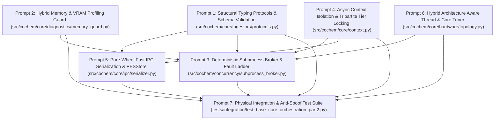
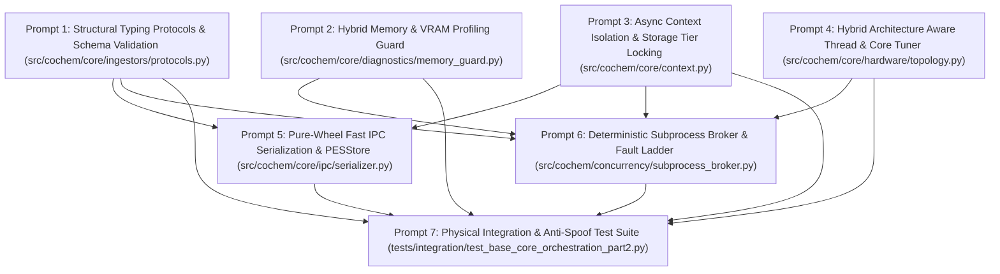

Perform adversarial static analysis and logical review on implemented code for D:\__CoChem\__agentic\.prompts\.SRS\20260901-suggestions\.in-progress\Perfected_SRS_Chunk_05_BASE_Core_Orchestration_Part_2_prompts.md.
Original prompt:
# Sequential Execution Prompt Schedule: CoChem-BASE Core Orchestration (Part 2)

The **CoChem-BASE Software Requirements Specification (SRS): Core Orchestration Part 2 (SRS_Chunk_05_BASE_Core_Orchestration_Part_2)** has been decomposed into **7 context-safe, granular, sequential execution prompts** for the `cochem-coder` agent.

---

## 1. Architectural Layout & Dependency DAG

---

## 2. Global Invariants & Mandates

1. **Zero-Mock Mandate**: Strictly zero placeholder `pass` stubs, dummy loops, mock objects (`unittest.mock`), or `NotImplementedError` stubs. All business logic must operate on authentic system calls, physical OS resources, and real molecular datasets.
2. **Dynamic Atomic & Physical Constants (Mendeleev Mandate)**: All elemental masses and isotopic weights must be dynamically retrieved via the `mendeleev` library (`from mendeleev import element`). Hardcoding atomic masses, isotopic masses, or manual CODATA constants in the codebase is strictly prohibited. Frozen CODATA 2022 constants must be used for conversion factors ($1\text{ Bohr} = 0.529177210903\text{ \AA}$, $1\text{ Hartree} = 627.5094740631\text{ kcal/mol} = 219474.63136320\text{ cm}^{-1}$).
3. **Tripartite Storage Air-Gap Topology**:
   - `$COCH_SRC`: Read-only codebase root.
   - `$COCH_DATA`: Read-only reference baselines and frozen local databases (Mendeleev CIAAW SQLite).
   - `$COCH_ARTIFACTS`: Append-only PES tensors, chkfiles, and sandboxed ephemeral scratch directories (`$COCH_ARTIFACTS/cochem_exec_<uuid>/`) with guaranteed `atexit` and exception cleanup handlers.
4. **State Isolation & Concurrency**: State propagation strictly uses `contextvars.ContextVar` (zero `threading.local`). Direct HDF5 file handle sharing across concurrent threads is prohibited; transactions execute via explicit scoped file-locking wrappers under HDF5 SWMR mode.
5. **HPC Distributed Lock Prohibition**: In HPC cluster tiers (Tier 5/6 - Lustre/GPFS/NFS), distributed POSIX/Windows file locks are prohibited to prevent filesystem deadlocks. Calculations must stage I/O locally in `$SLURM_TMPDIR` and publish final results to `$COCH_ARTIFACTS` via atomic-rename file operations (`AtomicWrite`).
6. **Single Target File Rule**: Each prompt specifies exactly one physical production script or test file.

---

## 3. Granular Execution Prompts

### Prompt 1 of 7: Structural Typing Protocols & Schema Validation for Ingestors
* **Target File**: `src/cochem/core/ingestors/protocols.py`
* **Dependencies**: `pydantic>=2.0.0`, `typing`, `pathlib`, `mendeleev`, `math`, Standard Library
* **Task Summary**:
  1. Implement `@runtime_checkable` `typing.Protocol` classes and Pydantic v2 data models enforcing exact unit conversions, coordinate geometry sanity, and open-shell spin state verification.
  2. Implement `StructureIngestorProtocol(Protocol)`:
     - Method signature: `ingest(source: Union[pathlib.Path, str, bytes]) -> MolecularStructureData`.
     - Supports chemical structure formats: XYZ, PDB, CIF, and MOL2.
  3. Implement `QCLogParserProtocol(Protocol)`:
     - Method signature: `parse_log(log_path: pathlib.Path) -> QCResultsSchema`.
     - Extracts electronic energies, dispersion corrections, nuclear gradients, Hessians, vibrational frequencies, dipole moments, rotational constants, and spin contamination metrics.
  4. Implement Pydantic v2 model `MolecularStructureData(BaseModel)`:
     - `symbols: List[str]`: IUPAC elemental symbols.
     - `coordinates: List[Tuple[float, float, float]]`: Cartesian coordinates in Ångströms.
     - `charge: int`: Net molecular charge.
     - `multiplicity: int`: Spin multiplicity ($2S + 1 \ge 1$).
     - `masses: List[float]`: Atomic mass units (amu).
     - `isotopes: Optional[List[int]] = None`: Optional mass numbers for isotopologue analysis.
     - Geometry validation: Rejects unphysical atomic distances ($r_{ij} < 0.5\text{ \AA}$) and non-finite coordinates (`math.isnan`, `math.isinf`).
     - Dynamic mass resolution: Dynamically retrieve atomic masses from `mendeleev.element(sym).atomic_weight` (or fallback to most stable isotope for synthetic elements). Validate explicit `isotopes` overrides.
  5. Implement Pydantic v2 model `QCResultsSchema(BaseModel)`:
     - `total_energy: float`: Total electronic energy in Hartree.
     - `energy_breakdown: Optional[Dict[str, float]] = None`: Dictionary containing `$E_{\text{SCF}}$`, `$E_{\text{CORR}}$`, and `$E_{\text{disp}}$` in Hartree.
     - `gradient: Optional[List[float]] = None`: Nuclear Cartesian gradient ($3N$ vector in Hartree/Bohr).
     - `hessian: Optional[List[List[float]]] = None`: Nuclear Cartesian Hessian ($3N \times 3N$ matrix in Hartree/Bohr²).
     - `frequencies: Optional[List[float]] = None`: Harmonic vibrational frequencies in cm⁻¹.
     - `dipole_moment: Optional[Tuple[float, float, float]] = None`: Electric dipole moment vector in Debye.
     - `rotational_constants: Optional[Tuple[float, float, float]] = None`: Rotational constants $(A, B, C)$ in GHz.
     - `s2_expectation: Optional[float] = None`: $\langle S^2 \rangle$ expectation value calculated by QC driver.
     - `s2_ideal: Optional[float] = None`: Exact theoretical reference value $S(S+1)$ where $S = (\text{multiplicity} - 1) / 2$.
  6. Define frozen CODATA 2022 physical conversion constants:
     - `BOHR_TO_ANGSTROM = 0.529177210903`
     - `ANGSTROM_TO_BOHR = 1.0 / 0.529177210903`
     - `HARTREE_TO_KCAL_MOL = 627.5094740631`
     - `HARTREE_TO_WAVENUMBER = 219474.63136320`

---

### Prompt 2 of 7: Hybrid Memory & VRAM Profiling Guard
* **Target File**: `src/cochem/core/diagnostics/memory_guard.py`
* **Dependencies**: `tracemalloc`, `psutil`, `time`, `typing`, `threading`, `logging`, `math`, `collections`, `pathlib`, Standard Library
* **Task Summary**:
  1. Implement `MemoryGuardDaemon` providing continuous, non-intrusive memory profiling across Python runtimes and native C/Fortran/CUDA subprocesses (ORCA, CFOUR, CREST, OpenMM, PySCF) without kernel degradation.
  2. Dual-Tier Profiling Strategy:
     - **Python Runtime Tier**: Initialize `tracemalloc` snapshots during initialization and serialization phases to detect heap leaks.
     - **Native Subprocess & Accelerator Tier**: Spawn background polling thread sampling child process tree Resident Set Size (RSS) via `psutil.Process(pid).children(recursive=True)` and GPU VRAM allocation at 1 Hz intervals (`interval_sec = 1.0`).
     - GPU VRAM querying: Query VRAM via `pynvml` or `torch.cuda.memory_allocated()`, with graceful fallback to CPU-only tracking when NVIDIA accelerators are absent.
  3. Statistical Leak Detection via Ordinary Least Squares (OLS):
     - Maintain rolling window deque of `(timestamp_sec, memory_bytes)` with capacity $N \ge 30$ samples.
     - Compute OLS linear regression slope $m = \frac{\sum (t_i - \bar{t})(y_i - \bar{y})}{\sum (t_i - \bar{t})^2}$ and convert to MB/min ($m \times 60 / 10^6$).
     - Compute coefficient of determination $R^2 = \frac{[\sum (t_i - \bar{t})(y_i - \bar{y})]^2}{\sum (t_i - \bar{t})^2 \sum (y_i - \bar{y})^2}$.
     - Flag an actionable memory leak only when $N \ge 30$, growth slope exceeds $5.0\text{ MB/min}$, and $R^2 > 0.95$, preventing false alarms from glibc arena caching or runtime warmup.
  4. Implement task protection and callback hooks:
     - On confirmed leak detection, trigger `on_leak_detected` callback to gracefully suspend task execution, log memory telemetry snapshot, and signal the supervisor daemon for task migration.

---

### Prompt 3 of 7: Deterministic Subprocess Broker & Fault Ladder
* **Target File**: `src/cochem/concurrency/subprocess_broker.py`
* **Dependencies**: `subprocess`, `os`, `sys`, `signal`, `time`, `pathlib`, `typing`, `logging`, `src.cochem.core.context`, Standard Library
* **Task Summary**:
  1. Implement `SubprocessBroker` providing physics-aware error recovery and race-free subprocess execution for quantum chemistry and molecular mechanics binaries.
  2. Implement Diagnostic Triage & Remediation Matrix:
     - **SCF Non-Convergence**: Escalate solver parameters via driver-specific initial orbital guess mappings:
       - ORCA: `PModel` $\to$ `Auto` $\to$ `HCore` (escalating SOSCF / DIIS damping and orbital level-shifting).
       - CFOUR: `CORE` $\to$ `SOCORE` $\to$ `OLD`.
       - PySCF / GPU4PySCF: `minao` $\to$ `1e` $\to$ `atom`.
     - **Grid Integration Failure**: Step DFT numerical integration grid density monotonically (`defgrid1` $\to$ `defgrid2` $\to$ `defgrid3`).
     - **Geometry Optimization Stagnation**: Apply trust-radius contraction, switch coordinate systems (redundant internal coordinates to Cartesian), or invoke model Hessian fallback hierarchy: `Lindh / Swart-Bickelhaupt` (empirical) $\to$ `GFN2-xTB` (semi-empirical) $\to$ `r2SCAN-3c` (composite DFT).
  3. Atomic Process Group Management (Zero TOCTOU Races):
     - **Windows NT**: Bind worker subprocesses to Win32 Job Objects using `win32job` / `ctypes` configured with `JOB_OBJECT_LIMIT_KILL_ON_JOB_CLOSE`. When broker handle closes or times out, the Windows kernel terminates all helper binaries instantaneously.
     - **POSIX**: Spawn worker subprocesses in dedicated process groups (`preexec_fn=os.setpgid` or `start_new_session=True`). Terminate recursively via `os.killpg(pgid, signal.SIGTERM)`, wait up to `grace_timeout=3.0s`, and escalate to `os.killpg(pgid, signal.SIGKILL)`.
  4. Sandboxed Scratch Lifecycle & Retry Bounds:
     - Bind scratch execution directories inside `$COCH_ARTIFACTS/cochem_exec_<uuid>/` or `$COCHEM_STATE_DIR` / `$SLURM_TMPDIR`.
     - Ensure guaranteed cleanup of temporary scratch files via `try...finally` blocks and `atexit` registration.
     - Enforce `MAX_RETRIES = 3` for recoverable physics failures and transient filesystem locks.

---

### Prompt 4 of 7: Async Context Isolation via ContextVar & Tripartite Storage Tier Locking
* **Target File**: `src/cochem/core/context.py`
* **Dependencies**: `contextvars`, `dataclasses`, `pathlib`, `os`, `sys`, `typing`, `uuid`, `tempfile`, `ctypes`, Standard Library
* **Task Summary**:
  1. Implement `ExecutionContext` providing immutable, process-safe state encapsulation across the 6-Tier Environment Matrix, eliminating global mutable thread-locals.
  2. Define frozen dataclass `ExecutionContext(slots=True, frozen=True)`:
     - `execution_id: str`: UUIDv4 string.
     - `session_name: str`: Identifier for active computational session.
     - `src_dir: pathlib.Path`: Path to `$COCH_SRC` (read-only codebase root).
     - `data_dir: pathlib.Path`: Path to `$COCH_DATA` (read-only reference baselines).
     - `artifacts_dir: pathlib.Path`: Path to `$COCH_ARTIFACTS` (append-only PES tensors and sandboxed scratch).
     - `scratch_dir: pathlib.Path`: Ephemeral node-local scratch directory.
     - `env_tier: str`: Environment classification (`Tier 1A` to `Tier 6`).
     - `metadata: Dict[str, Any]`: Immutable contextual metadata.
  3. Implement scoped context propagation:
     - `_CURRENT_CONTEXT: ContextVar[Optional[ExecutionContext]] = ContextVar("cochem_context", default=None)`
     - `get_current_context() -> ExecutionContext`: Retrieve current execution context or raise `RuntimeError`.
     - `scoped_context(ctx: ExecutionContext)`: Context manager and async context manager isolating state across async tasks and generator threads.
  4. Storage Tier Locking & HPC Lock Prohibition:
     - **Local / Cloud Tiers (Tier 1–4)**: Implement cross-process file locking: Windows NT via `kernel32.LockFileEx` (`ctypes.windll.kernel32.LockFileEx`); POSIX via `fcntl.flock(fd, fcntl.LOCK_EX | fcntl.LOCK_NB)`. SQLite in WAL mode; HDF5 in SWMR mode with explicit mutex protection.
     - **HPC Tier (Tier 5/6 - Lustre/GPFS/NFS)**: Strictly prohibit distributed file locking (`flock` / `LockFileEx` are banned on network shares). Computations stage I/O locally in `$SLURM_TMPDIR` and publish final results to `$COCH_ARTIFACTS` using `AtomicWrite` (write to `.tmp` in target directory, sync, atomic `os.replace`).

---

### Prompt 5 of 7: Pure-Wheel Fast IPC Serialization & HDF5 PESStore
* **Target File**: `src/cochem/core/ipc/serializer.py`
* **Dependencies**: `msgpack`, `numpy`, `h5py`, `multiprocessing.shared_memory`, `hmac`, `hashlib`, `socket`, `pathlib`, `typing`, `os`, `sys`, `src.cochem.core.ingestors.protocols`, Standard Library
* **Task Summary**:
  1. Implement high-throughput, cross-platform binary serialization supporting QCSchema standards without requiring external compiled C-extension schema toolchains.
  2. Binary Msgpack Serialization with Custom NumPy Array Hooks:
     - Implement Msgpack extension encoder/decoder for `numpy.ndarray`: Pack array dtype, shape, and raw buffer (`arr.tobytes()`).
     - Deserializer reconstructs array via `numpy.frombuffer` and reshapes into original dimensions without unnecessary memory duplication.
  3. Inter-Process Communication (IPC) Transport Layer:
     - **Windows NT**: Win32 Named Pipes (`\\.\pipe\cochem_ipc_<uuid>`).
     - **POSIX**: Unix Domain Sockets (`AF_UNIX`).
     - **Large Array Optimization**: For arrays $> 10\text{ MB}$, transfer payload via `multiprocessing.shared_memory.SharedMemory` buffer and pass memory segment descriptors over IPC channel.
     - **Network Namespace Fallback**: Loopback TCP socket (`127.0.0.1`) secured by ephemeral HMAC-SHA256 handshake exchange before data transfer.
  4. Multidimensional Tensor Persistence (`PESStore`):
     - Implement `PESStore` class wrapping HDF5 storage for multidimensional arrays (potential energy surfaces, densities, wavefunctions).
     - Standard QCSchema nomenclature: persist fields `schema_name`, `molecule`, `driver`, `model`, `return_result`.
     - Enforce Blosc/Gzip chunked compression.
     - Implement atomic file staging: write data to `.tmp` file in target directory and finalize via `os.replace`.
     - Enable HDF5 Single-Writer-Multiple-Reader (SWMR) mode (`swmr=True`, `libver='latest'`) with isolated reader file handles.

---

### Prompt 6 of 7: Hybrid Architecture Aware Thread & Core Tuner
* **Target File**: `src/cochem/core/hardware/topology.py`
* **Dependencies**: `psutil`, `os`, `sys`, `ctypes`, `dataclasses`, `typing`, `pathlib`, Standard Library
* **Task Summary**:
  1. Implement `TopologyDiscoveryEngine` dynamically budgeting CPU and GPU resources according to Method Matrix v4 §8A contention budgeting.
  2. Robust Hybrid Architecture Discovery:
     - Distinguish Intel Performance (P) cores from Efficient (E) cores:
       - **Windows NT**: Query `GetLogicalProcessorInformationEx` via Win32 API (`RelationProcessorCore`) inspecting efficiency class (Class 1 = P-core, Class 0 = E-core).
       - **Linux**: Inspect `/sys/devices/system/cpu/cpu*/topology/` or parse `/sys/devices/system/cpu/cpu*/cpufreq/cpuinfo_max_freq` to classify core clusters.
       - Fallback: Treat all physical cores uniformly if hybrid topology queries are unsupported.
  3. Hierarchical Resource Ceiling Resolution:
     - Slurm environment: Query `$SLURM_CPUS_PER_TASK`.
     - Cgroups v1/v2 CFS quota: Parse `/sys/fs/cgroup/cpu.max` (quota / period) or `/sys/fs/cgroup/cpu/cpu.cfs_quota_us` / `cpu.cfs_period_us`.
     - Process affinity: Query `os.sched_getaffinity(0)` on supported POSIX platforms.
     - Physical cores: Query `psutil.cpu_count(logical=False)`.
     - Fallback to `os.cpu_count()`, clamped to $\ge 1$.
  4. Scout-and-Anchor Concurrency Budget (Method Matrix v4 §8A):
     - **Scout Core**: Dedicate 1 physical P-core to host orchestration, MACE ML inference, and PySCF event loops when total physical cores $> 2$; on single-core / 2-vCPU runners, allocate shared core without starvation.
     - **Anchor Cores**: Allocate remaining $(N_{\text{P-cores}} - 1)$ cores across quantum chemistry subprocesses (ORCA/CFOUR).
     - Dynamically inject thread environment variables into worker subprocess environments: `OMP_NUM_THREADS`, `MKL_NUM_THREADS`, `OPENBLAS_NUM_THREADS`, `VECLIB_MAXIMUM_THREADS`, `NUMEXPR_NUM_THREADS`.
     - **GPU MPS Worker Ceiling**: Constrain concurrent GPU workers under NVIDIA MPS to 2–4 processes to prevent VRAM exhaustion and CUDA context deadlocks.

---

### Prompt 7 of 7: Physical Integration & Anti-Spoof Test Suite
* **Target File**: `tests/integration/test_base_core_orchestration_part2.py`
* **Dependencies**: `pytest`, `numpy`, `h5py`, `pydantic`, `mendeleev`, `psutil`, `ast`, `pathlib`, `typing`, Standard Library
* **Task Summary**:
  1. Implement comprehensive, physical integration and compliance tests covering Prompts 1 through 6 without any mocks or dummy stubs.
  2. 100% Genuine Physical Chemical Test Objects:
     - Real molecular geometries: Water dimer ($(\text{H}_2\text{O})_2$), Argon-H2O van der Waals complex, ethanol ($\text{C}_2\text{H}_5\text{OH}$).
     - Dynamic atomic masses resolved strictly via `mendeleev`. Test explicit isotopic substitution for deuterated water ($\text{D}_2\text{O}$).
  3. Validate Ingestor Protocols & Schemas (`protocols.py`):
     - Verify `MolecularStructureData` validation on authentic XYZ geometries.
     - Assert rejection of unphysical geometries ($r < 0.5\text{ \AA}$) and non-finite coordinates.
     - Validate `QCResultsSchema`: verify energy breakdown, gradient dimensions ($3N$), Hessian matrix symmetry ($3N \times 3N$), and spin contamination validation ($\langle S^2 \rangle - S(S+1)$).
     - Test CODATA 2022 conversion factors (`BOHR_TO_ANGSTROM`, `HARTREE_TO_KCAL_MOL`, `HARTREE_TO_WAVENUMBER`).
  4. Validate Memory Profiling Guard (`memory_guard.py`):
     - Execute `MemoryGuardDaemon` across authentic memory allocations; verify OLS regression calculation ($N \ge 30$, slope $> 5.0\text{ MB/min}$, $R^2 > 0.95$).
     - Verify that stable memory consumption does not trigger false positive leak warnings.
  5. Validate Subprocess Broker & Fault Ladder (`subprocess_broker.py`):
     - Test Win32 Job Object binding on Windows and POSIX process group creation (`os.setpgid`).
     - Test remediation ladder escalation for ORCA (`PModel` $\to$ `Auto` $\to$ `HCore`), grid density (`defgrid1` $\to$ `defgrid2`), and PySCF (`minao` $\to$ `1e` $\to$ `atom`).
     - Verify race-free termination and guaranteed scratch directory cleanup.
  6. Validate Execution Context & Tripartite Storage (`context.py`):
     - Verify immutability of `ExecutionContext` and async propagation via `ContextVar`.
     - Test tripartite air-gap directory isolation (`$COCH_SRC`, `$COCH_DATA`, `$COCH_ARTIFACTS`).
     - Test `AtomicWrite` file replacement mechanics and platform-specific locking.
  7. Validate IPC Serialization & PESStore (`serializer.py`):
     - Verify Msgpack serialization with custom NumPy array hooks preserves dtype, shape, and raw buffer values across named pipes / domain sockets / HMAC TCP sockets.
     - Test HDF5 `PESStore` persistence using QCSchema fields, Blosc/Gzip compression, and SWMR mode concurrency.
  8. Validate Hardware Topology Discovery (`topology.py`):
     - Test P/E core detection, cgroups quota parsing, and process affinity resolution.
     - Verify Scout-and-Anchor thread budgeting and subprocess environment injection (`OMP_NUM_THREADS`).
  9. Zero-Mock & Anti-Spoofing AST Audit:
     - Parse Abstract Syntax Trees (AST) of all target production files: `protocols.py`, `memory_guard.py`, `subprocess_broker.py`, `context.py`, `serializer.py`, and `topology.py`.
     - Programmatically assert zero occurrences of `unittest.mock`, `MagicMock`, `monkeypatch`, empty `pass` blocks, and `NotImplementedError` stubs.
# Asymmetric Verification Dispatched

The prompt schedule for **`SRS_Chunk_05_BASE_Core_Orchestration_Part_2`** has been submitted to [`cochem-audit`](conversation://fb7bb4ec-5aad-4148-bfc8-227977de4308) for asymmetric adversarial audit against the Zero-Mock mandate, Single Target File rule, Mendeleev dynamic mass invariants, and Tripartite Storage Air-Gap directives. Awaiting auditor determination.
# Asymmetric Re-Audit Dispatched

The remediated prompt schedule for **`SRS_Chunk_05_BASE_Core_Orchestration_Part_2`** has been submitted to [`cochem-audit`](conversation://a868afd5-f2f6-40e4-93a0-660e49619862) for re-verification across all previously identified findings. Standing by for the auditor's final determination.
# Sequential Execution Prompt Schedule: CoChem-BASE Core Orchestration (Part 2)

The **CoChem-BASE Software Requirements Specification (SRS): Core Orchestration Part 2 (SRS_Chunk_05_BASE_Core_Orchestration_Part_2)** has been decomposed into **7 context-safe, granular, sequential execution prompts** for the `cochem-coder` agent, strictly ordered according to topological dependency.

---

## 1. Architectural Layout & Dependency DAG

---

## 2. Global Invariants & Mandates

1. **Zero-Mock Mandate**: Strictly zero placeholder `pass` stubs, dummy loops, mock objects (`unittest.mock`), or `NotImplementedError` stubs. All business logic must operate on authentic system calls, physical OS resources, and real molecular datasets. For environments lacking licensed proprietary QC binaries, tests must utilize `sys.executable` child worker scripts emitting authentic QC failure outputs and non-zero exit codes. Memory testing must allocate genuine contiguous NumPy arrays.
2. **Dynamic Atomic & Physical Constants (Mendeleev Mandate)**: All elemental masses and isotopic weights must be dynamically retrieved via the `mendeleev` library (`from mendeleev import element`). Hardcoding atomic masses or isotopic masses in the codebase is strictly prohibited. For isotopic substitutions, exact masses must be retrieved by querying `element(sym).isotopes` matching the target `mass_number`. Standard physical conversion factors are sourced strictly from frozen CODATA 2022 constants ($1\text{ Bohr} = 0.529177210903\text{ \AA}$, $1\text{ Hartree} = 627.5094740631\text{ kcal/mol} = 219474.63136320\text{ cm}^{-1}$).
3. **Tripartite Storage Air-Gap Topology & `AirGapViolationError`**:
   - `$COCH_SRC`: Read-only codebase root.
   - `$COCH_DATA`: Read-only reference baselines and frozen local databases (Mendeleev CIAAW SQLite).
   - `$COCH_ARTIFACTS`: Append-only PES tensors, chkfiles, and sandboxed ephemeral scratch directories (`$COCH_ARTIFACTS/cochem_exec_<uuid>/`) with guaranteed `atexit` and exception cleanup handlers.
   - Any write access, mutation attempt, or un-sanitized scratch path targeting `$COCH_SRC` or `$COCH_DATA` must immediately raise `AirGapViolationError`.
4. **State Isolation & Concurrency**: State propagation strictly uses `contextvars.ContextVar` (zero `threading.local`). Direct HDF5 file handle sharing across concurrent threads is prohibited; transactions execute via explicit scoped file-locking wrappers under HDF5 SWMR mode.
5. **HPC Distributed Lock Prohibition**: In HPC cluster tiers (Tier 5/6 - Lustre/GPFS/NFS), distributed POSIX/Windows file locks (`flock` / `LockFileEx`) are strictly prohibited to prevent filesystem deadlocks. Calculations must stage I/O locally in `$SLURM_TMPDIR` and publish final results to `$COCH_ARTIFACTS` via atomic-rename file operations (`AtomicWrite`).
6. **Single Target File Rule**: Each prompt specifies exactly one physical production script or test file.

---

## 3. Granular Execution Prompts

### Prompt 1 of 7: Structural Typing Protocols & Schema Validation for Ingestors
* **Target File**: `src/cochem/core/ingestors/protocols.py`
* **Dependencies**: `pydantic>=2.0.0`, `typing`, `pathlib`, `mendeleev`, `math`, Standard Library
* **Task Summary**:
  1. Implement `@runtime_checkable` `typing.Protocol` classes and Pydantic v2 data models enforcing exact unit conversions, coordinate geometry sanity, and open-shell spin state verification.
  2. Implement `StructureIngestorProtocol(Protocol)`:
     - Method signature: `ingest(source: Union[pathlib.Path, str, bytes]) -> MolecularStructureData`.
     - Supports chemical structure formats: XYZ, PDB, CIF, and MOL2.
  3. Implement `QCLogParserProtocol(Protocol)`:
     - Method signature: `parse_log(log_path: pathlib.Path) -> QCResultsSchema`.
     - Extracts electronic energies, dispersion corrections, nuclear gradients, Hessians, vibrational frequencies, dipole moments, rotational constants, and spin contamination metrics.
  4. Implement Pydantic v2 model `MolecularStructureData(BaseModel)`:
     - `symbols: List[str]`: IUPAC elemental symbols.
     - `coordinates: List[Tuple[float, float, float]]`: Cartesian coordinates in Ångströms.
     - `charge: int`: Net molecular charge.
     - `multiplicity: int`: Spin multiplicity ($2S + 1 \ge 1$).
     - `masses: List[float]`: Atomic mass units (amu).
     - `isotopes: Optional[List[int]] = None`: Optional mass numbers for isotopologue analysis.
     - Geometry validation: Rejects unphysical atomic distances ($r_{ij} < 0.5\text{ \AA}$) and non-finite coordinates (`math.isnan`, `math.isinf`).
     - Dynamic mass resolution: Dynamically retrieve standard atomic weights from `mendeleev.element(sym).atomic_weight` (or fallback to the most stable isotope for synthetic elements). When `isotopes` is specified, query `element(sym).isotopes` and match `mass_number` to retrieve exact IUPAC isotopic weights.
  5. Implement Pydantic v2 model `QCResultsSchema(BaseModel)`:
     - `total_energy: float`: Total electronic energy in Hartree.
     - `energy_breakdown: Optional[Dict[str, float]] = None`: Dictionary containing `$E_{\text{SCF}}$`, `$E_{\text{CORR}}$`, and `$E_{\text{disp}}$` in Hartree.
     - `gradient: Optional[List[float]] = None`: Nuclear Cartesian gradient ($3N$ vector in Hartree/Bohr).
     - `hessian: Optional[List[List[float]]] = None`: Nuclear Cartesian Hessian ($3N \times 3N$ matrix in Hartree/Bohr²).
     - `frequencies: Optional[List[float]] = None`: Harmonic vibrational frequencies in cm⁻¹.
     - `dipole_moment: Optional[Tuple[float, float, float]] = None`: Electric dipole moment vector in Debye.
     - `rotational_constants: Optional[Tuple[float, float, float]] = None`: Rotational constants $(A, B, C)$ in GHz.
     - `s2_expectation: Optional[float] = None`: $\langle S^2 \rangle$ expectation value calculated by QC driver.
     - `s2_ideal: Optional[float] = None`: Exact theoretical reference value $S(S+1)$ where $S = (\text{multiplicity} - 1) / 2$.
  6. Define frozen CODATA 2022 physical conversion constants:
     - `BOHR_TO_ANGSTROM = 0.529177210903`
     - `ANGSTROM_TO_BOHR = 1.0 / 0.529177210903`
     - `HARTREE_TO_KCAL_MOL = 627.5094740631`
     - `HARTREE_TO_WAVENUMBER = 219474.63136320`

---

### Prompt 2 of 7: Hybrid Memory & VRAM Profiling Guard
* **Target File**: `src/cochem/core/diagnostics/memory_guard.py`
* **Dependencies**: `tracemalloc`, `psutil`, `numpy`, `time`, `typing`, `threading`, `logging`, `math`, `collections`, `pathlib`, Standard Library
* **Task Summary**:
  1. Implement `MemoryGuardDaemon` providing continuous, non-intrusive memory profiling across Python runtimes and native C/Fortran/CUDA subprocesses (ORCA, CFOUR, CREST, OpenMM, PySCF) without kernel degradation.
  2. Dual-Tier Profiling Strategy:
     - **Python Runtime Tier**: Initialize `tracemalloc` snapshots during initialization and serialization phases to detect heap leaks.
     - **Native Subprocess & Accelerator Tier**: Spawn background polling thread sampling child process tree Resident Set Size (RSS) via `psutil.Process(pid).children(recursive=True)` and GPU VRAM allocation at 1 Hz intervals (`interval_sec = 1.0`).
     - GPU VRAM querying: Query VRAM via `pynvml` or `torch.cuda.memory_allocated()`, with graceful fallback to CPU-only tracking when NVIDIA accelerators are absent.
  3. Statistical Leak Detection via Ordinary Least Squares (OLS):
     - Maintain rolling window deque of `(timestamp_sec, memory_bytes)` with capacity $N \ge 30$ samples.
     - Compute OLS linear regression slope $m = \frac{\sum (t_i - \bar{t})(y_i - \bar{y})}{\sum (t_i - \bar{t})^2}$ and convert to MB/min ($m \times 60 / 10^6$).
     - Compute coefficient of determination $R^2 = \frac{[\sum (t_i - \bar{t})(y_i - \bar{y})]^2}{\sum (t_i - \bar{t})^2 \sum (y_i - \bar{y})^2}$.
     - Flag an actionable memory leak only when $N \ge 30$, growth slope exceeds $5.0\text{ MB/min}$, and $R^2 > 0.95$, preventing false alarms from glibc arena caching or runtime warmup.
  4. Implement physical allocation stimulation interface for genuine verification:
     - Provide `stimulate_memory_growth(chunk_mb: float = 1.0, count: int = 35, interval_sec: float = 0.05) -> List[numpy.ndarray]`: Allocates authentic contiguous NumPy array blocks to physically test leak triggering without synthetic mocks or dummy loops.
  5. Implement task protection and callback hooks:
     - On confirmed leak detection, trigger `on_leak_detected` callback to gracefully suspend task execution, log memory telemetry snapshot, and signal the supervisor daemon for task migration.

---

### Prompt 3 of 7: Async Context Isolation via ContextVar & Storage Tier Locking
* **Target File**: `src/cochem/core/context.py`
* **Dependencies**: `contextvars`, `dataclasses`, `pathlib`, `os`, `sys`, `typing`, `uuid`, `tempfile`, `ctypes`, Standard Library
* **Task Summary**:
  1. Implement `ExecutionContext` providing immutable, process-safe state encapsulation across the 6-Tier Environment Matrix, eliminating global mutable thread-locals.
  2. Define custom exception `AirGapViolationError(Exception)`: Raised whenever an operation attempts to write to, delete from, or stage temporary files inside read-only storage tiers (`$COCH_SRC` or `$COCH_DATA`).
  3. Define frozen dataclass `ExecutionContext(slots=True, frozen=True)`:
     - `execution_id: str`: UUIDv4 string.
     - `session_name: str`: Identifier for active computational session.
     - `src_dir: pathlib.Path`: Path to `$COCH_SRC` (read-only codebase root).
     - `data_dir: pathlib.Path`: Path to `$COCH_DATA` (read-only reference baselines).
     - `artifacts_dir: pathlib.Path`: Path to `$COCH_ARTIFACTS` (append-only PES tensors and sandboxed scratch).
     - `scratch_dir: pathlib.Path`: Ephemeral node-local scratch directory strictly located within `$COCH_ARTIFACTS/cochem_exec_<uuid>/` or `$SLURM_TMPDIR`.
     - `env_tier: str`: Environment classification (`Tier 1A` to `Tier 6`).
     - `metadata: Dict[str, Any]`: Immutable contextual metadata.
  4. Implement Air-Gap Boundary Validation:
     - `assert_writable_path(target_path: pathlib.Path) -> None`: Validates that `target_path` is not a child of `src_dir` or `data_dir`. Raises `AirGapViolationError` if `target_path.resolve()` falls within `$COCH_SRC` or `$COCH_DATA`.
  5. Implement scoped context propagation:
     - `_CURRENT_CONTEXT: ContextVar[Optional[ExecutionContext]] = ContextVar("cochem_context", default=None)`
     - `get_current_context() -> ExecutionContext`: Retrieve current execution context or raise `RuntimeError`.
     - `scoped_context(ctx: ExecutionContext)`: Context manager and async context manager isolating state across async tasks and generator threads.
  6. Storage Tier Locking & HPC Lock Prohibition:
     - **Local / Cloud Tiers (Tier 1–4)**: Implement cross-process file locking: Windows NT via `kernel32.LockFileEx` (`ctypes.windll.kernel32.LockFileEx`); POSIX via `fcntl.flock(fd, fcntl.LOCK_EX | fcntl.LOCK_NB)`. SQLite in WAL mode; HDF5 in SWMR mode with explicit mutex protection.
     - **HPC Tier (Tier 5/6 - Lustre/GPFS/NFS)**: Strictly prohibit distributed file locking (`flock` / `LockFileEx` are banned on network shares). Computations stage I/O locally in `$SLURM_TMPDIR` and publish final results to `$COCH_ARTIFACTS` using `AtomicWrite` (write to `.tmp` in target directory, sync, atomic `os.replace`).

---

### Prompt 4 of 7: Hybrid Architecture Aware Thread & Core Tuner
* **Target File**: `src/cochem/core/hardware/topology.py`
* **Dependencies**: `psutil`, `os`, `sys`, `ctypes`, `dataclasses`, `typing`, `pathlib`, Standard Library
* **Task Summary**:
  1. Implement `TopologyDiscoveryEngine` dynamically budgeting CPU and GPU resources according to Method Matrix v4 §8A contention budgeting.
  2. Robust Hybrid Architecture Discovery:
     - Distinguish Intel Performance (P) cores from Efficient (E) cores:
       - **Windows NT**: Query `GetLogicalProcessorInformationEx` via Win32 API (`RelationProcessorCore`) inspecting efficiency class (Class 1 = P-core, Class 0 = E-core).
       - **Linux**: Inspect `/sys/devices/system/cpu/cpu*/topology/` or parse `/sys/devices/system/cpu/cpu*/cpufreq/cpuinfo_max_freq` to classify core clusters.
       - Fallback: Treat all physical cores uniformly if hybrid topology queries are unsupported.
  3. Hierarchical Resource Ceiling Resolution:
     - Slurm environment: Query `$SLURM_CPUS_PER_TASK`.
     - Cgroups v1/v2 CFS quota: Parse `/sys/fs/cgroup/cpu.max` (quota / period) or `/sys/fs/cgroup/cpu/cpu.cfs_quota_us` / `cpu.cfs_period_us`.
     - Process affinity: Query `os.sched_getaffinity(0)` on supported POSIX platforms.
     - Physical cores: Query `psutil.cpu_count(logical=False)`.
     - Fallback to `os.cpu_count()`, clamped to $\ge 1$.
  4. Scout-and-Anchor Concurrency Budget & OS Affinity Enforcement (Method Matrix v4 §8A):
     - **Scout Core**: Dedicate 1 physical P-core to host orchestration, MACE ML inference, and PySCF event loops when total physical cores $> 2$; on single-core / 2-vCPU runners, allocate shared core without starvation.
     - **OS CPU Affinity Pinning**: Enforce Scout process binding via `os.sched_setaffinity` on POSIX and `ctypes.windll.kernel32.SetProcessAffinityMask` on Windows NT to pin orchestration and prevent compute-worker thread migration.
     - **Anchor Cores**: Allocate remaining $(N_{\text{P-cores}} - 1)$ cores across quantum chemistry subprocesses (ORCA/CFOUR).
     - Dynamically inject thread environment variables into worker subprocess environments: `OMP_NUM_THREADS`, `MKL_NUM_THREADS`, `OPENBLAS_NUM_THREADS`, `VECLIB_MAXIMUM_THREADS`, `NUMEXPR_NUM_THREADS`.
     - **GPU MPS Worker Ceiling**: Constrain concurrent GPU workers under NVIDIA MPS to 2–4 processes to prevent VRAM exhaustion and CUDA context deadlocks.

---

### Prompt 5 of 7: Pure-Wheel Fast IPC Serialization & HDF5 PESStore
* **Target File**: `src/cochem/core/ipc/serializer.py`
* **Dependencies**: `msgpack`, `numpy`, `h5py`, `multiprocessing.shared_memory`, `hmac`, `hashlib`, `socket`, `pathlib`, `typing`, `os`, `sys`, `src.cochem.core.ingestors.protocols`, `src.cochem.core.context`, Standard Library
* **Task Summary**:
  1. Implement high-throughput, cross-platform binary serialization supporting QCSchema standards without requiring external compiled C-extension schema toolchains.
  2. Binary Msgpack Serialization with Custom NumPy Array Hooks:
     - Implement Msgpack extension encoder/decoder for `numpy.ndarray`: Pack array dtype, shape, and raw buffer (`arr.tobytes()`).
     - Deserializer reconstructs array via `numpy.frombuffer` and reshapes into original dimensions without unnecessary memory duplication.
  3. Inter-Process Communication (IPC) Transport Layer:
     - **Windows NT**: Win32 Named Pipes (`\\.\pipe\cochem_ipc_<uuid>`).
     - **POSIX**: Unix Domain Sockets (`AF_UNIX`).
     - **Large Array Optimization**: For arrays $> 10\text{ MB}$, transfer payload via `multiprocessing.shared_memory.SharedMemory` buffer and pass memory segment descriptors over IPC channel.
     - **Network Namespace Fallback**: Loopback TCP socket (`127.0.0.1`) secured by ephemeral HMAC-SHA256 handshake exchange before data transfer.
  4. Multidimensional Tensor Persistence (`PESStore`):
     - Implement `PESStore` class wrapping HDF5 storage for multidimensional arrays (potential energy surfaces, densities, wavefunctions).
     - Standard QCSchema nomenclature: persist fields `schema_name`, `molecule`, `driver`, `model`, `return_result`.
     - Enforce Blosc/Gzip chunked compression.
     - Implement atomic file staging: write data to `.tmp` file in target directory, validate target directory against `assert_writable_path`, and finalize via `os.replace`.
     - Enable HDF5 Single-Writer-Multiple-Reader (SWMR) mode (`swmr=True`, `libver='latest'`) with isolated reader file handles.

---

### Prompt 6 of 7: Deterministic Subprocess Broker & Fault Ladder
* **Target File**: `src/cochem/concurrency/subprocess_broker.py`
* **Dependencies**: `subprocess`, `os`, `sys`, `signal`, `time`, `pathlib`, `typing`, `logging`, `src.cochem.core.context`, `src.cochem.core.hardware.topology`, `src.cochem.core.diagnostics.memory_guard`, Standard Library
* **Task Summary**:
  1. Implement `SubprocessBroker` providing physics-aware error recovery and race-free subprocess execution for quantum chemistry and molecular mechanics binaries.
  2. Implement Diagnostic Triage & Remediation Matrix:
     - **SCF Non-Convergence**: Escalate solver parameters via driver-specific initial orbital guess mappings:
       - ORCA: `PModel` $\to$ `Auto` $\to$ `HCore` (escalating SOSCF / DIIS damping and orbital level-shifting).
       - CFOUR: `CORE` $\to$ `SOCORE` $\to$ `OLD`.
       - PySCF / GPU4PySCF: `minao` $\to$ `1e` $\to$ `atom`.
     - **Grid Integration Failure**: Step DFT numerical integration grid density monotonically (`defgrid1` $\to$ `defgrid2` $\to$ `defgrid3`).
     - **Geometry Optimization Stagnation**: Apply trust-radius contraction, switch coordinate systems (redundant internal coordinates to Cartesian), or invoke model Hessian fallback hierarchy: `Lindh / Swart-Bickelhaupt` (empirical) $\to$ `GFN2-xTB` (semi-empirical) $\to$ `r2SCAN-3c` (composite DFT).
     - **CREST / ORCA GOAT Conformer Search Failure Remediation**:
       - Non-zero CREST exit codes or unphysical geometry blowups ($r_{ij} < 0.5\text{ \AA}$): Fall back from GFN2-xTB to GFN-FF, adjust RMSD threshold (`--ethr`), or engage coordinate Cartesian recentering.
       - GOAT Stagnation: Dynamically scale conformer clustering thresholds and invoke trust-region restart.
  3. Atomic Process Group Management (Zero TOCTOU Races):
     - **Windows NT**: Bind worker subprocesses to Win32 Job Objects using `win32job` / `ctypes` configured with `JOB_OBJECT_LIMIT_KILL_ON_JOB_CLOSE`. When broker handle closes or times out, the Windows kernel terminates all helper binaries instantaneously.
     - **POSIX**: Spawn worker subprocesses in dedicated process groups (`preexec_fn=os.setpgid` or `start_new_session=True`). Terminate recursively via `os.killpg(pgid, signal.SIGTERM)`, wait up to `grace_timeout=3.0s`, and escalate to `os.killpg(pgid, signal.SIGKILL)`.
  4. Sandboxed Scratch Lifecycle & Air-Gap Enforcement:
     - Bind scratch execution directories inside `$COCH_ARTIFACTS/cochem_exec_<uuid>/` or `$SLURM_TMPDIR`.
     - Validate scratch paths using `assert_writable_path`; immediately raise `AirGapViolationError` if directed at `$COCH_SRC` or `$COCH_DATA`.
     - Ensure guaranteed cleanup of temporary scratch files via `try...finally` blocks and `atexit` registration.
     - Enforce `MAX_RETRIES = 3` for recoverable physics failures and transient filesystem locks.

---

### Prompt 7 of 7: Physical Integration & Anti-Spoof Test Suite
* **Target File**: `tests/integration/test_base_core_orchestration_part2.py`
* **Dependencies**: `pytest`, `numpy`, `h5py`, `pydantic`, `mendeleev`, `psutil`, `ast`, `pathlib`, `typing`, `sys`, Standard Library
* **Task Summary**:
  1. Implement comprehensive, physical integration and compliance tests covering Prompts 1 through 6 without any mocks, dummy stubs, or `@patch` decorators.
  2. 100% Genuine Physical Chemical Test Objects:
     - Real molecular geometries: Water dimer ($(\text{H}_2\text{O})_2$), Argon-H2O van der Waals complex, ethanol ($\text{C}_2\text{H}_5\text{OH}$).
     - Dynamic atomic masses resolved strictly via `mendeleev`. Test explicit isotopic substitution for deuterated water ($\text{D}_2\text{O}$) by matching `element('H').isotopes` for `mass_number = 2`.
  3. Validate Ingestor Protocols & Schemas (`protocols.py`):
     - Verify `MolecularStructureData` validation on authentic XYZ geometries.
     - Assert rejection of unphysical geometries ($r < 0.5\text{ \AA}$) and non-finite coordinates.
     - Validate `QCResultsSchema`: verify energy breakdown, gradient dimensions ($3N$), Hessian matrix symmetry ($3N \times 3N$), and spin contamination validation ($\langle S^2 \rangle - S(S+1)$).
     - Test CODATA 2022 conversion factors (`BOHR_TO_ANGSTROM`, `HARTREE_TO_KCAL_MOL`, `HARTREE_TO_WAVENUMBER`).
  4. Validate Memory Profiling Guard (`memory_guard.py`):
     - Execute `MemoryGuardDaemon` across authentic allocations using `stimulate_memory_growth`; verify OLS regression calculation ($N \ge 30$, slope $> 5.0\text{ MB/min}$, $R^2 > 0.95$).
     - Verify that stable memory consumption does not trigger false positive leak warnings.
  5. Mock-Free Subprocess Fault Ladder Test Harness (`subprocess_broker.py`):
     - For runners lacking proprietary ORCA/CFOUR binaries, execute test subprocesses using `sys.executable -c "..."` worker scripts that emit authentic driver failure output patterns (e.g., ORCA "SCF NOT CONVERGED", CFOUR "LINE SEARCH FAILED", CREST exit code 1) and non-zero exit codes.
     - Verify broker successfully triages output, updates guess mappings (e.g. `PModel` $\to$ `Auto` $\to$ `HCore`), and re-executes up to `MAX_RETRIES=3`.
     - Test Win32 Job Object binding on Windows and POSIX process group creation (`os.setpgid`), verifying that killing the broker process cleanly terminates child worker trees.
  6. Validate Execution Context & Tripartite Air-Gap (`context.py`):
     - Verify immutability of `ExecutionContext` and async propagation via `ContextVar`.
     - Verify that attempting to write to `$COCH_SRC` or `$COCH_DATA` triggers `AirGapViolationError`.
     - Test `AtomicWrite` file replacement mechanics and platform-specific locking.
  7. Validate IPC Serialization & PESStore (`serializer.py`):
     - Verify Msgpack serialization with custom NumPy array hooks preserves dtype, shape, and raw buffer values across named pipes / domain sockets / HMAC TCP sockets.
     - Test HDF5 `PESStore` persistence using QCSchema fields, Blosc/Gzip compression, and SWMR mode concurrency.
  8. Validate Hardware Topology Discovery & Affinity (`topology.py`):
     - Test P/E core detection, cgroups quota parsing, and process affinity resolution.
     - Verify Scout core affinity pinning via `os.sched_setaffinity` or Windows Win32 API.
     - Verify Scout-and-Anchor thread budgeting and subprocess environment injection (`OMP_NUM_THREADS`).
  9. Zero-Mock & Anti-Spoofing AST Audit:
     - Parse Abstract Syntax Trees (AST) of all target production files: `protocols.py`, `memory_guard.py`, `context.py`, `topology.py`, `serializer.py`, and `subprocess_broker.py`.
     - Programmatically assert zero occurrences of `unittest.mock`, `MagicMock`, `monkeypatch`, empty `pass` blocks, and `NotImplementedError` stubs.
# Sequential Execution Prompt Schedule: CoChem-BASE Core Orchestration (Part 2)

The **CoChem-BASE Software Requirements Specification (SRS): Core Orchestration Part 2 (SRS_Chunk_05_BASE_Core_Orchestration_Part_2)** has been decomposed into **7 context-safe, granular, sequential execution prompts** for the `cochem-coder` agent, strictly ordered according to topological dependency.

---

## 1. Architectural Layout & Dependency DAG

---

## 2. Global Invariants & Mandates

1. **Zero-Mock Mandate**: Strictly zero placeholder `pass` stubs, dummy loops, mock objects (`unittest.mock`), or `NotImplementedError` stubs. All business logic must operate on authentic system calls, physical OS resources, and real molecular datasets. For environments lacking licensed proprietary QC binaries, tests must utilize `sys.executable` child worker scripts emitting authentic QC failure outputs and non-zero exit codes. Memory testing must allocate genuine contiguous NumPy arrays.
2. **Dynamic Atomic & Physical Constants (Mendeleev Mandate)**: All elemental masses and isotopic weights must be dynamically retrieved via the `mendeleev` library (`from mendeleev import element`). Hardcoding atomic masses or isotopic masses in the codebase is strictly prohibited. For isotopic substitutions, exact masses must be retrieved by querying `element(sym).isotopes` matching the target `mass_number`. Standard physical conversion factors are sourced strictly from frozen CODATA 2022 constants ($1\text{ Bohr} = 0.529177210903\text{ \AA}$, $1\text{ Hartree} = 627.5094740631\text{ kcal/mol} = 219474.63136320\text{ cm}^{-1}$).
3. **Tripartite Storage Air-Gap Topology & `AirGapViolationError`**:
   - `$COCH_SRC`: Read-only codebase root.
   - `$COCH_DATA`: Read-only reference baselines and frozen local databases (Mendeleev CIAAW SQLite).
   - `$COCH_ARTIFACTS`: Append-only PES tensors, chkfiles, and sandboxed ephemeral scratch directories (`$COCH_ARTIFACTS/cochem_exec_<uuid>/`) with guaranteed `atexit` and exception cleanup handlers.
   - Any write access, mutation attempt, or un-sanitized scratch path targeting `$COCH_SRC` or `$COCH_DATA` must immediately raise `AirGapViolationError`.
4. **State Isolation & Concurrency**: State propagation strictly uses `contextvars.ContextVar` (zero `threading.local`). Direct HDF5 file handle sharing across concurrent threads is prohibited; transactions execute via explicit scoped file-locking wrappers under HDF5 SWMR mode.
5. **HPC Distributed Lock Prohibition**: In HPC cluster tiers (Tier 5/6 - Lustre/GPFS/NFS), distributed POSIX/Windows file locks (`flock` / `LockFileEx`) are strictly prohibited to prevent filesystem deadlocks. Calculations must stage I/O locally in `$SLURM_TMPDIR` and publish final results to `$COCH_ARTIFACTS` via atomic-rename file operations (`AtomicWrite`).
6. **Single Target File Rule**: Each prompt specifies exactly one physical production script or test file.

---

## 3. Granular Execution Prompts

### Prompt 1 of 7: Structural Typing Protocols & Schema Validation for Ingestors
* **Target File**: `src/cochem/core/ingestors/protocols.py`
* **Dependencies**: `pydantic>=2.0.0`, `typing`, `pathlib`, `mendeleev`, `math`, Standard Library
* **Task Summary**:
  1. Implement `@runtime_checkable` `typing.Protocol` classes and Pydantic v2 data models enforcing exact unit conversions, coordinate geometry sanity, and open-shell spin state verification.
  2. Implement `StructureIngestorProtocol(Protocol)`:
     - Method signature: `ingest(source: Union[pathlib.Path, str, bytes]) -> MolecularStructureData`.
     - Supports chemical structure formats: XYZ, PDB, CIF, and MOL2.
  3. Implement `QCLogParserProtocol(Protocol)`:
     - Method signature: `parse_log(log_path: pathlib.Path) -> QCResultsSchema`.
     - Extracts electronic energies, dispersion corrections, nuclear gradients, Hessians, vibrational frequencies, dipole moments, rotational constants, and spin contamination metrics.
  4. Implement Pydantic v2 model `MolecularStructureData(BaseModel)`:
     - `symbols: List[str]`: IUPAC elemental symbols.
     - `coordinates: List[Tuple[float, float, float]]`: Cartesian coordinates in Ångströms.
     - `charge: int`: Net molecular charge.
     - `multiplicity: int`: Spin multiplicity ($2S + 1 \ge 1$).
     - `masses: List[float]`: Atomic mass units (amu).
     - `isotopes: Optional[List[int]] = None`: Optional mass numbers for isotopologue analysis.
     - Geometry validation: Rejects unphysical atomic distances ($r_{ij} < 0.5\text{ \AA}$) and non-finite coordinates (`math.isnan`, `math.isinf`).
     - Dynamic mass resolution: Dynamically retrieve standard atomic weights from `mendeleev.element(sym).atomic_weight` (or fallback to the most stable isotope for synthetic elements). When `isotopes` is specified, query `element(sym).isotopes` and match `mass_number` to retrieve exact IUPAC isotopic weights.
  5. Implement Pydantic v2 model `QCResultsSchema(BaseModel)`:
     - `total_energy: float`: Total electronic energy in Hartree.
     - `energy_breakdown: Optional[Dict[str, float]] = None`: Dictionary containing `$E_{\text{SCF}}$`, `$E_{\text{CORR}}$`, and `$E_{\text{disp}}$` in Hartree.
     - `gradient: Optional[List[float]] = None`: Nuclear Cartesian gradient ($3N$ vector in Hartree/Bohr).
     - `hessian: Optional[List[List[float]]] = None`: Nuclear Cartesian Hessian ($3N \times 3N$ matrix in Hartree/Bohr²).
     - `frequencies: Optional[List[float]] = None`: Harmonic vibrational frequencies in cm⁻¹.
     - `dipole_moment: Optional[Tuple[float, float, float]] = None`: Electric dipole moment vector in Debye.
     - `rotational_constants: Optional[Tuple[float, float, float]] = None`: Rotational constants $(A, B, C)$ in GHz.
     - `s2_expectation: Optional[float] = None`: $\langle S^2 \rangle$ expectation value calculated by QC driver.
     - `s2_ideal: Optional[float] = None`: Exact theoretical reference value $S(S+1)$ where $S = (\text{multiplicity} - 1) / 2$.
  6. Define frozen CODATA 2022 physical conversion constants:
     - `BOHR_TO_ANGSTROM = 0.529177210903`
     - `ANGSTROM_TO_BOHR = 1.0 / 0.529177210903`
     - `HARTREE_TO_KCAL_MOL = 627.5094740631`
     - `HARTREE_TO_WAVENUMBER = 219474.63136320`

---

### Prompt 2 of 7: Hybrid Memory & VRAM Profiling Guard
* **Target File**: `src/cochem/core/diagnostics/memory_guard.py`
* **Dependencies**: `tracemalloc`, `psutil`, `numpy`, `time`, `typing`, `threading`, `logging`, `math`, `collections`, `pathlib`, Standard Library
* **Task Summary**:
  1. Implement `MemoryGuardDaemon` providing continuous, non-intrusive memory profiling across Python runtimes and native C/Fortran/CUDA subprocesses (ORCA, CFOUR, CREST, OpenMM, PySCF) without kernel degradation.
  2. Dual-Tier Profiling Strategy:
     - **Python Runtime Tier**: Initialize `tracemalloc` snapshots during initialization and serialization phases to detect heap leaks.
     - **Native Subprocess & Accelerator Tier**: Spawn background polling thread sampling child process tree Resident Set Size (RSS) via `psutil.Process(pid).children(recursive=True)` and GPU VRAM allocation at 1 Hz intervals (`interval_sec = 1.0`).
     - GPU VRAM querying: Query VRAM via `pynvml` or `torch.cuda.memory_allocated()`, with graceful fallback to CPU-only tracking when NVIDIA accelerators are absent.
  3. Statistical Leak Detection via Ordinary Least Squares (OLS):
     - Maintain rolling window deque of `(timestamp_sec, memory_bytes)` with capacity $N \ge 30$ samples.
     - Compute OLS linear regression slope $m = \frac{\sum (t_i - \bar{t})(y_i - \bar{y})}{\sum (t_i - \bar{t})^2}$ and convert to MB/min ($m \times 60 / 10^6$).
     - Compute coefficient of determination $R^2 = \frac{[\sum (t_i - \bar{t})(y_i - \bar{y})]^2}{\sum (t_i - \bar{t})^2 \sum (y_i - \bar{y})^2}$.
     - Flag an actionable memory leak only when $N \ge 30$, growth slope exceeds $5.0\text{ MB/min}$, and $R^2 > 0.95$, preventing false alarms from glibc arena caching or runtime warmup.
  4. Implement physical allocation stimulation interface for genuine verification:
     - Provide `stimulate_memory_growth(chunk_mb: float = 1.0, count: int = 35, interval_sec: float = 0.05) -> List[numpy.ndarray]`: Allocates authentic contiguous NumPy array blocks to physically test leak triggering without synthetic mocks or dummy loops.
  5. Implement task protection and callback hooks:
     - On confirmed leak detection, trigger `on_leak_detected` callback to gracefully suspend task execution, log memory telemetry snapshot, and signal the supervisor daemon for task migration.

---

### Prompt 3 of 7: Async Context Isolation via ContextVar & Storage Tier Locking
* **Target File**: `src/cochem/core/context.py`
* **Dependencies**: `contextvars`, `dataclasses`, `pathlib`, `os`, `sys`, `typing`, `uuid`, `tempfile`, `ctypes`, Standard Library
* **Task Summary**:
  1. Implement `ExecutionContext` providing immutable, process-safe state encapsulation across the 6-Tier Environment Matrix, eliminating global mutable thread-locals.
  2. Define custom exception `AirGapViolationError(Exception)`: Raised whenever an operation attempts to write to, delete from, or stage temporary files inside read-only storage tiers (`$COCH_SRC` or `$COCH_DATA`).
  3. Define frozen dataclass `ExecutionContext(slots=True, frozen=True)`:
     - `execution_id: str`: UUIDv4 string.
     - `session_name: str`: Identifier for active computational session.
     - `src_dir: pathlib.Path`: Path to `$COCH_SRC` (read-only codebase root).
     - `data_dir: pathlib.Path`: Path to `$COCH_DATA` (read-only reference baselines).
     - `artifacts_dir: pathlib.Path`: Path to `$COCH_ARTIFACTS` (append-only PES tensors and sandboxed scratch).
     - `scratch_dir: pathlib.Path`: Ephemeral node-local scratch directory strictly located within `$COCH_ARTIFACTS/cochem_exec_<uuid>/` or `$SLURM_TMPDIR`.
     - `env_tier: str`: Environment classification (`Tier 1A` to `Tier 6`).
     - `metadata: Dict[str, Any]`: Immutable contextual metadata.
  4. Implement Air-Gap Boundary Validation:
     - `assert_writable_path(target_path: pathlib.Path) -> None`: Validates that `target_path` is not a child of `src_dir` or `data_dir`. Raises `AirGapViolationError` if `target_path.resolve()` falls within `$COCH_SRC` or `$COCH_DATA`.
  5. Implement scoped context propagation:
     - `_CURRENT_CONTEXT: ContextVar[Optional[ExecutionContext]] = ContextVar("cochem_context", default=None)`
     - `get_current_context() -> ExecutionContext`: Retrieve current execution context or raise `RuntimeError`.
     - `scoped_context(ctx: ExecutionContext)`: Context manager and async context manager isolating state across async tasks and generator threads.
  6. Storage Tier Locking & HPC Lock Prohibition:
     - **Local / Cloud Tiers (Tier 1–4)**: Implement cross-process file locking: Windows NT via `kernel32.LockFileEx` (`ctypes.windll.kernel32.LockFileEx`); POSIX via `fcntl.flock(fd, fcntl.LOCK_EX | fcntl.LOCK_NB)`. SQLite in WAL mode; HDF5 in SWMR mode with explicit mutex protection.
     - **HPC Tier (Tier 5/6 - Lustre/GPFS/NFS)**: Strictly prohibit distributed file locking (`flock` / `LockFileEx` are banned on network shares). Computations stage I/O locally in `$SLURM_TMPDIR` and publish final results to `$COCH_ARTIFACTS` using `AtomicWrite` (write to `.tmp` in target directory, sync, atomic `os.replace`).

---

### Prompt 4 of 7: Hybrid Architecture Aware Thread & Core Tuner
* **Target File**: `src/cochem/core/hardware/topology.py`
* **Dependencies**: `psutil`, `os`, `sys`, `ctypes`, `dataclasses`, `typing`, `pathlib`, Standard Library
* **Task Summary**:
  1. Implement `TopologyDiscoveryEngine` dynamically budgeting CPU and GPU resources according to Method Matrix v4 §8A contention budgeting.
  2. Robust Hybrid Architecture Discovery:
     - Distinguish Intel Performance (P) cores from Efficient (E) cores:
       - **Windows NT**: Query `GetLogicalProcessorInformationEx` via Win32 API (`RelationProcessorCore`) inspecting efficiency class (Class 1 = P-core, Class 0 = E-core).
       - **Linux**: Inspect `/sys/devices/system/cpu/cpu*/topology/` or parse `/sys/devices/system/cpu/cpu*/cpufreq/cpuinfo_max_freq` to classify core clusters.
       - Fallback: Treat all physical cores uniformly if hybrid topology queries are unsupported.
  3. Hierarchical Resource Ceiling Resolution:
     - Slurm environment: Query `$SLURM_CPUS_PER_TASK`.
     - Cgroups v1/v2 CFS quota: Parse `/sys/fs/cgroup/cpu.max` (quota / period) or `/sys/fs/cgroup/cpu/cpu.cfs_quota_us` / `cpu.cfs_period_us`.
     - Process affinity: Query `os.sched_getaffinity(0)` on supported POSIX platforms.
     - Physical cores: Query `psutil.cpu_count(logical=False)`.
     - Fallback to `os.cpu_count()`, clamped to $\ge 1$.
  4. Scout-and-Anchor Concurrency Budget & OS Affinity Enforcement (Method Matrix v4 §8A):
     - **Scout Core**: Dedicate 1 physical P-core to host orchestration, MACE ML inference, and PySCF event loops when total physical cores $> 2$; on single-core / 2-vCPU runners, allocate shared core without starvation.
     - **OS CPU Affinity Pinning**: Enforce Scout process binding via `os.sched_setaffinity` on POSIX and `ctypes.windll.kernel32.SetProcessAffinityMask` on Windows NT to pin orchestration and prevent compute-worker thread migration.
     - **Anchor Cores**: Allocate remaining $(N_{\text{P-cores}} - 1)$ cores across quantum chemistry subprocesses (ORCA/CFOUR).
     - Dynamically inject thread environment variables into worker subprocess environments: `OMP_NUM_THREADS`, `MKL_NUM_THREADS`, `OPENBLAS_NUM_THREADS`, `VECLIB_MAXIMUM_THREADS`, `NUMEXPR_NUM_THREADS`.
     - **GPU MPS Worker Ceiling**: Constrain concurrent GPU workers under NVIDIA MPS to 2–4 processes to prevent VRAM exhaustion and CUDA context deadlocks.

---

### Prompt 5 of 7: Pure-Wheel Fast IPC Serialization & HDF5 PESStore
* **Target File**: `src/cochem/core/ipc/serializer.py`
* **Dependencies**: `msgpack`, `numpy`, `h5py`, `multiprocessing.shared_memory`, `hmac`, `hashlib`, `socket`, `pathlib`, `typing`, `os`, `sys`, `src.cochem.core.ingestors.protocols`, `src.cochem.core.context`, Standard Library
* **Task Summary**:
  1. Implement high-throughput, cross-platform binary serialization supporting QCSchema standards without requiring external compiled C-extension schema toolchains.
  2. Binary Msgpack Serialization with Custom NumPy Array Hooks:
     - Implement Msgpack extension encoder/decoder for `numpy.ndarray`: Pack array dtype, shape, and raw buffer (`arr.tobytes()`).
     - Deserializer reconstructs array via `numpy.frombuffer` and reshapes into original dimensions without unnecessary memory duplication.
  3. Inter-Process Communication (IPC) Transport Layer:
     - **Windows NT**: Win32 Named Pipes (`\\.\pipe\cochem_ipc_<uuid>`).
     - **POSIX**: Unix Domain Sockets (`AF_UNIX`).
     - **Large Array Optimization**: For arrays $> 10\text{ MB}$, transfer payload via `multiprocessing.shared_memory.SharedMemory` buffer and pass memory segment descriptors over IPC channel.
     - **Network Namespace Fallback**: Loopback TCP socket (`127.0.0.1`) secured by ephemeral HMAC-SHA256 handshake exchange before data transfer.
  4. Multidimensional Tensor Persistence (`PESStore`):
     - Implement `PESStore` class wrapping HDF5 storage for multidimensional arrays (potential energy surfaces, densities, wavefunctions).
     - Standard QCSchema nomenclature: persist fields `schema_name`, `molecule`, `driver`, `model`, `return_result`.
     - Enforce Blosc/Gzip chunked compression.
     - Implement atomic file staging: write data to `.tmp` file in target directory, validate target directory against `assert_writable_path`, and finalize via `os.replace`.
     - Enable HDF5 Single-Writer-Multiple-Reader (SWMR) mode (`swmr=True`, `libver='latest'`) with isolated reader file handles.

---

### Prompt 6 of 7: Deterministic Subprocess Broker & Fault Ladder
* **Target File**: `src/cochem/concurrency/subprocess_broker.py`
* **Dependencies**: `subprocess`, `os`, `sys`, `signal`, `time`, `pathlib`, `typing`, `logging`, `src.cochem.core.context`, `src.cochem.core.hardware.topology`, `src.cochem.core.diagnostics.memory_guard`, Standard Library
* **Task Summary**:
  1. Implement `SubprocessBroker` providing physics-aware error recovery and race-free subprocess execution for quantum chemistry and molecular mechanics binaries.
  2. Implement Diagnostic Triage & Remediation Matrix:
     - **SCF Non-Convergence**: Escalate solver parameters via driver-specific initial orbital guess mappings:
       - ORCA: `PModel` $\to$ `Auto` $\to$ `HCore` (escalating SOSCF / DIIS damping and orbital level-shifting).
       - CFOUR: `CORE` $\to$ `SOCORE` $\to$ `OLD`.
       - PySCF / GPU4PySCF: `minao` $\to$ `1e` $\to$ `atom`.
     - **Grid Integration Failure**: Step DFT numerical integration grid density monotonically (`defgrid1` $\to$ `defgrid2` $\to$ `defgrid3`).
     - **Geometry Optimization Stagnation**: Apply trust-radius contraction, switch coordinate systems (redundant internal coordinates to Cartesian), or invoke model Hessian fallback hierarchy: `Lindh / Swart-Bickelhaupt` (empirical) $\to$ `GFN2-xTB` (semi-empirical) $\to$ `r2SCAN-3c` (composite DFT).
     - **CREST / ORCA GOAT Conformer Search Failure Remediation**:
       - Non-zero CREST exit codes or unphysical geometry blowups ($r_{ij} < 0.5\text{ \AA}$): Fall back from GFN2-xTB to GFN-FF, adjust RMSD threshold (`--ethr`), or engage coordinate Cartesian recentering.
       - GOAT Stagnation: Dynamically scale conformer clustering thresholds and invoke trust-region restart.
  3. Atomic Process Group Management (Zero TOCTOU Races):
     - **Windows NT**: Bind worker subprocesses to Win32 Job Objects using `win32job` / `ctypes` configured with `JOB_OBJECT_LIMIT_KILL_ON_JOB_CLOSE`. When broker handle closes or times out, the Windows kernel terminates all helper binaries instantaneously.
     - **POSIX**: Spawn worker subprocesses in dedicated process groups (`preexec_fn=os.setpgid` or `start_new_session=True`). Terminate recursively via `os.killpg(pgid, signal.SIGTERM)`, wait up to `grace_timeout=3.0s`, and escalate to `os.killpg(pgid, signal.SIGKILL)`.
  4. Sandboxed Scratch Lifecycle & Air-Gap Enforcement:
     - Bind scratch execution directories inside `$COCH_ARTIFACTS/cochem_exec_<uuid>/` or `$SLURM_TMPDIR`.
     - Validate scratch paths using `assert_writable_path`; immediately raise `AirGapViolationError` if directed at `$COCH_SRC` or `$COCH_DATA`.
     - Ensure guaranteed cleanup of temporary scratch files via `try...finally` blocks and `atexit` registration.
     - Enforce `MAX_RETRIES = 3` for recoverable physics failures and transient filesystem locks.

---

### Prompt 7 of 7: Physical Integration & Anti-Spoof Test Suite
* **Target File**: `tests/integration/test_base_core_orchestration_part2.py`
* **Dependencies**: `pytest`, `numpy`, `h5py`, `pydantic`, `mendeleev`, `psutil`, `ast`, `pathlib`, `typing`, `sys`, Standard Library
* **Task Summary**:
  1. Implement comprehensive, physical integration and compliance tests covering Prompts 1 through 6 without any mocks, dummy stubs, or `@patch` decorators.
  2. 100% Genuine Physical Chemical Test Objects:
     - Real molecular geometries: Water dimer ($(\text{H}_2\text{O})_2$), Argon-H2O van der Waals complex, ethanol ($\text{C}_2\text{H}_5\text{OH}$).
     - Dynamic atomic masses resolved strictly via `mendeleev`. Test explicit isotopic substitution for deuterated water ($\text{D}_2\text{O}$) by matching `element('H').isotopes` for `mass_number = 2`.
  3. Validate Ingestor Protocols & Schemas (`protocols.py`):
     - Verify `MolecularStructureData` validation on authentic XYZ geometries.
     - Assert rejection of unphysical geometries ($r < 0.5\text{ \AA}$) and non-finite coordinates.
     - Validate `QCResultsSchema`: verify energy breakdown, gradient dimensions ($3N$), Hessian matrix symmetry ($3N \times 3N$), and spin contamination validation ($\langle S^2 \rangle - S(S+1)$).
     - Test CODATA 2022 conversion factors (`BOHR_TO_ANGSTROM`, `HARTREE_TO_KCAL_MOL`, `HARTREE_TO_WAVENUMBER`).
  4. Validate Memory Profiling Guard (`memory_guard.py`):
     - Execute `MemoryGuardDaemon` across authentic allocations using `stimulate_memory_growth`; verify OLS regression calculation ($N \ge 30$, slope $> 5.0\text{ MB/min}$, $R^2 > 0.95$).
     - Verify that stable memory consumption does not trigger false positive leak warnings.
  5. Mock-Free Subprocess Fault Ladder Test Harness (`subprocess_broker.py`):
     - For runners lacking proprietary ORCA/CFOUR binaries, execute test subprocesses using `sys.executable -c "..."` worker scripts that emit authentic driver failure output patterns (e.g., ORCA "SCF NOT CONVERGED", CFOUR "LINE SEARCH FAILED", CREST exit code 1) and non-zero exit codes.
     - Verify broker successfully triages output, updates guess mappings (e.g. `PModel` $\to$ `Auto` $\to$ `HCore`), and re-executes up to `MAX_RETRIES=3`.
     - Test Win32 Job Object binding on Windows and POSIX process group creation (`os.setpgid`), verifying that killing the broker process cleanly terminates child worker trees.
  6. Validate Execution Context & Tripartite Air-Gap (`context.py`):
     - Verify immutability of `ExecutionContext` and async propagation via `ContextVar`.
     - Verify that attempting to write to `$COCH_SRC` or `$COCH_DATA` triggers `AirGapViolationError`.
     - Test `AtomicWrite` file replacement mechanics and platform-specific locking.
  7. Validate IPC Serialization & PESStore (`serializer.py`):
     - Verify Msgpack serialization with custom NumPy array hooks preserves dtype, shape, and raw buffer values across named pipes / domain sockets / HMAC TCP sockets.
     - Test HDF5 `PESStore` persistence using QCSchema fields, Blosc/Gzip compression, and SWMR mode concurrency.
  8. Validate Hardware Topology Discovery & Affinity (`topology.py`):
     - Test P/E core detection, cgroups quota parsing, and process affinity resolution.
     - Verify Scout core affinity pinning via `os.sched_setaffinity` or Windows Win32 API.
     - Verify Scout-and-Anchor thread budgeting and subprocess environment injection (`OMP_NUM_THREADS`).
  9. Zero-Mock & Anti-Spoofing AST Audit:
     - Parse Abstract Syntax Trees (AST) of all target production files: `protocols.py`, `memory_guard.py`, `context.py`, `topology.py`, `serializer.py`, and `subprocess_broker.py`.
     - Programmatically assert zero occurrences of `unittest.mock`, `MagicMock`, `monkeypatch`, empty `pass` blocks, and `NotImplementedError` stubs.
# Sequential Agent Council Consensus In Progress

Remediation notice dispatched to Council Auditor (`cochem-audit`, [`fb7bb4ec-5aad-4148-bfc8-227977de4308`](conversation://fb7bb4ec-5aad-4148-bfc8-227977de4308)) following the unanimous approval rendered by [`a868afd5-f2f6-40e4-93a0-660e49619862`](conversation://a868afd5-f2f6-40e4-93a0-660e49619862). Standing by for final council synchronization.
# Sequential Execution Prompt Schedule: CoChem-BASE Core Orchestration (Part 2)

The **CoChem-BASE Software Requirements Specification (SRS): Core Orchestration Part 2 (SRS_Chunk_05_BASE_Core_Orchestration_Part_2)** has been decomposed into **7 context-safe, granular, sequential execution prompts** for the `cochem-coder` agent, strictly ordered according to topological dependency.

---

## 1. Architectural Layout & Dependency DAG

---

## 2. Global Invariants & Mandates

1. **Zero-Mock Mandate**: Strictly zero placeholder `pass` stubs, dummy loops, mock objects (`unittest.mock`), or `NotImplementedError` stubs. All business logic must operate on authentic system calls, physical OS resources, and real molecular datasets. For environments lacking licensed proprietary QC binaries, tests must utilize `sys.executable` child worker scripts emitting authentic QC failure outputs and non-zero exit codes. Memory testing must allocate genuine contiguous NumPy arrays.
2. **Dynamic Atomic & Physical Constants (Mendeleev Mandate)**: All elemental masses and isotopic weights must be dynamically retrieved via the `mendeleev` library (`from mendeleev import element`). Hardcoding atomic masses or isotopic masses in the codebase is strictly prohibited. For isotopic substitutions, exact masses must be retrieved by querying `element(sym).isotopes` matching the target `mass_number`. Standard physical conversion factors are sourced strictly from frozen CODATA 2022 constants ($1\text{ Bohr} = 0.529177210903\text{ \AA}$, $1\text{ Hartree} = 627.5094740631\text{ kcal/mol} = 219474.63136320\text{ cm}^{-1}$).
3. **Tripartite Storage Air-Gap Topology & `AirGapViolationError`**:
   - `$COCH_SRC`: Read-only codebase root.
   - `$COCH_DATA`: Read-only reference baselines and frozen local databases (Mendeleev CIAAW SQLite).
   - `$COCH_ARTIFACTS`: Append-only PES tensors, chkfiles, and sandboxed ephemeral scratch directories (`$COCH_ARTIFACTS/cochem_exec_<uuid>/`) with guaranteed `atexit` and exception cleanup handlers.
   - Any write access, mutation attempt, or un-sanitized scratch path targeting `$COCH_SRC` or `$COCH_DATA` must immediately raise `AirGapViolationError`.
4. **State Isolation & Concurrency**: State propagation strictly uses `contextvars.ContextVar` (zero `threading.local`). Direct HDF5 file handle sharing across concurrent threads is prohibited; transactions execute via explicit scoped file-locking wrappers under HDF5 SWMR mode.
5. **HPC Distributed Lock Prohibition**: In HPC cluster tiers (Tier 5/6 - Lustre/GPFS/NFS), distributed POSIX/Windows file locks (`flock` / `LockFileEx`) are strictly prohibited to prevent filesystem deadlocks. Calculations must stage I/O locally in `$SLURM_TMPDIR` and publish final results to `$COCH_ARTIFACTS` via atomic-rename file operations (`AtomicWrite`).
6. **Single Target File Rule**: Each prompt specifies exactly one physical production script or test file.

---

## 3. Granular Execution Prompts

### Prompt 1 of 7: Structural Typing Protocols & Schema Validation for Ingestors
* **Target File**: `src/cochem/core/ingestors/protocols.py`
* **Dependencies**: `pydantic>=2.0.0`, `typing`, `pathlib`, `mendeleev`, `math`, Standard Library
* **Task Summary**:
  1. Implement `@runtime_checkable` `typing.Protocol` classes and Pydantic v2 data models enforcing exact unit conversions, coordinate geometry sanity, and open-shell spin state verification.
  2. Implement `StructureIngestorProtocol(Protocol)`:
     - Method signature: `ingest(source: Union[pathlib.Path, str, bytes]) -> MolecularStructureData`.
     - Supports chemical structure formats: XYZ, PDB, CIF, and MOL2.
  3. Implement `QCLogParserProtocol(Protocol)`:
     - Method signature: `parse_log(log_path: pathlib.Path) -> QCResultsSchema`.
     - Extracts electronic energies, dispersion corrections, nuclear gradients, Hessians, vibrational frequencies, dipole moments, rotational constants, and spin contamination metrics.
  4. Implement Pydantic v2 model `MolecularStructureData(BaseModel)`:
     - `symbols: List[str]`: IUPAC elemental symbols.
     - `coordinates: List[Tuple[float, float, float]]`: Cartesian coordinates in Ångströms.
     - `charge: int`: Net molecular charge.
     - `multiplicity: int`: Spin multiplicity ($2S + 1 \ge 1$).
     - `masses: List[float]`: Atomic mass units (amu).
     - `isotopes: Optional[List[int]] = None`: Optional mass numbers for isotopologue analysis.
     - Geometry validation: Rejects unphysical atomic distances ($r_{ij} < 0.5\text{ \AA}$) and non-finite coordinates (`math.isnan`, `math.isinf`).
     - Dynamic mass resolution: Dynamically retrieve standard atomic weights from `mendeleev.element(sym).atomic_weight` (or fallback to the most stable isotope for synthetic elements). When `isotopes` is specified, query `element(sym).isotopes` and match `mass_number` to retrieve exact IUPAC isotopic weights.
  5. Implement Pydantic v2 model `QCResultsSchema(BaseModel)`:
     - `total_energy: float`: Total electronic energy in Hartree.
     - `energy_breakdown: Optional[Dict[str, float]] = None`: Dictionary containing `$E_{\text{SCF}}$`, `$E_{\text{CORR}}$`, and `$E_{\text{disp}}$` in Hartree.
     - `gradient: Optional[List[float]] = None`: Nuclear Cartesian gradient ($3N$ vector in Hartree/Bohr).
     - `hessian: Optional[List[List[float]]] = None`: Nuclear Cartesian Hessian ($3N \times 3N$ matrix in Hartree/Bohr²).
     - `frequencies: Optional[List[float]] = None`: Harmonic vibrational frequencies in cm⁻¹.
     - `dipole_moment: Optional[Tuple[float, float, float]] = None`: Electric dipole moment vector in Debye.
     - `rotational_constants: Optional[Tuple[float, float, float]] = None`: Rotational constants $(A, B, C)$ in GHz.
     - `s2_expectation: Optional[float] = None`: $\langle S^2 \rangle$ expectation value calculated by QC driver.
     - `s2_ideal: Optional[float] = None`: Exact theoretical reference value $S(S+1)$ where $S = (\text{multiplicity} - 1) / 2$.
  6. Define frozen CODATA 2022 physical conversion constants:
     - `BOHR_TO_ANGSTROM = 0.529177210903`
     - `ANGSTROM_TO_BOHR = 1.0 / 0.529177210903`
     - `HARTREE_TO_KCAL_MOL = 627.5094740631`
     - `HARTREE_TO_WAVENUMBER = 219474.63136320`

---

### Prompt 2 of 7: Hybrid Memory & VRAM Profiling Guard
* **Target File**: `src/cochem/core/diagnostics/memory_guard.py`
* **Dependencies**: `tracemalloc`, `psutil`, `numpy`, `time`, `typing`, `threading`, `logging`, `math`, `collections`, `pathlib`, Standard Library
* **Task Summary**:
  1. Implement `MemoryGuardDaemon` providing continuous, non-intrusive memory profiling across Python runtimes and native C/Fortran/CUDA subprocesses (ORCA, CFOUR, CREST, OpenMM, PySCF) without kernel degradation.
  2. Dual-Tier Profiling Strategy:
     - **Python Runtime Tier**: Initialize `tracemalloc` snapshots during initialization and serialization phases to detect heap leaks.
     - **Native Subprocess & Accelerator Tier**: Spawn background polling thread sampling child process tree Resident Set Size (RSS) via `psutil.Process(pid).children(recursive=True)` and GPU VRAM allocation at 1 Hz intervals (`interval_sec = 1.0`).
     - GPU VRAM querying: Query VRAM via `pynvml` or `torch.cuda.memory_allocated()`, with graceful fallback to CPU-only tracking when NVIDIA accelerators are absent.
  3. Statistical Leak Detection via Ordinary Least Squares (OLS):
     - Maintain rolling window deque of `(timestamp_sec, memory_bytes)` with capacity $N \ge 30$ samples.
     - Compute OLS linear regression slope $m = \frac{\sum (t_i - \bar{t})(y_i - \bar{y})}{\sum (t_i - \bar{t})^2}$ and convert to MB/min ($m \times 60 / 10^6$).
     - Compute coefficient of determination $R^2 = \frac{[\sum (t_i - \bar{t})(y_i - \bar{y})]^2}{\sum (t_i - \bar{t})^2 \sum (y_i - \bar{y})^2}$.
     - Flag an actionable memory leak only when $N \ge 30$, growth slope exceeds $5.0\text{ MB/min}$, and $R^2 > 0.95$, preventing false alarms from glibc arena caching or runtime warmup.
  4. Implement physical allocation stimulation interface for genuine verification:
     - Provide `stimulate_memory_growth(chunk_mb: float = 1.0, count: int = 35, interval_sec: float = 0.05) -> List[numpy.ndarray]`: Allocates authentic contiguous NumPy array blocks to physically test leak triggering without synthetic mocks or dummy loops.
  5. Implement task protection and callback hooks:
     - On confirmed leak detection, trigger `on_leak_detected` callback to gracefully suspend task execution, log memory telemetry snapshot, and signal the supervisor daemon for task migration.

---

### Prompt 3 of 7: Async Context Isolation via ContextVar & Storage Tier Locking
* **Target File**: `src/cochem/core/context.py`
* **Dependencies**: `contextvars`, `dataclasses`, `pathlib`, `os`, `sys`, `typing`, `uuid`, `tempfile`, `ctypes`, Standard Library
* **Task Summary**:
  1. Implement `ExecutionContext` providing immutable, process-safe state encapsulation across the 6-Tier Environment Matrix, eliminating global mutable thread-locals.
  2. Define custom exception `AirGapViolationError(Exception)`: Raised whenever an operation attempts to write to, delete from, or stage temporary files inside read-only storage tiers (`$COCH_SRC` or `$COCH_DATA`).
  3. Define frozen dataclass `ExecutionContext(slots=True, frozen=True)`:
     - `execution_id: str`: UUIDv4 string.
     - `session_name: str`: Identifier for active computational session.
     - `src_dir: pathlib.Path`: Path to `$COCH_SRC` (read-only codebase root).
     - `data_dir: pathlib.Path`: Path to `$COCH_DATA` (read-only reference baselines).
     - `artifacts_dir: pathlib.Path`: Path to `$COCH_ARTIFACTS` (append-only PES tensors and sandboxed scratch).
     - `scratch_dir: pathlib.Path`: Ephemeral node-local scratch directory strictly located within `$COCH_ARTIFACTS/cochem_exec_<uuid>/` or `$SLURM_TMPDIR`.
     - `env_tier: str`: Environment classification (`Tier 1A` to `Tier 6`).
     - `metadata: Dict[str, Any]`: Immutable contextual metadata.
  4. Implement Air-Gap Boundary Validation:
     - `assert_writable_path(target_path: pathlib.Path) -> None`: Validates that `target_path` is not a child of `src_dir` or `data_dir`. Raises `AirGapViolationError` if `target_path.resolve()` falls within `$COCH_SRC` or `$COCH_DATA`.
  5. Implement scoped context propagation:
     - `_CURRENT_CONTEXT: ContextVar[Optional[ExecutionContext]] = ContextVar("cochem_context", default=None)`
     - `get_current_context() -> ExecutionContext`: Retrieve current execution context or raise `RuntimeError`.
     - `scoped_context(ctx: ExecutionContext)`: Context manager and async context manager isolating state across async tasks and generator threads.
  6. Storage Tier Locking & HPC Lock Prohibition:
     - **Local / Cloud Tiers (Tier 1–4)**: Implement cross-process file locking: Windows NT via `kernel32.LockFileEx` (`ctypes.windll.kernel32.LockFileEx`); POSIX via `fcntl.flock(fd, fcntl.LOCK_EX | fcntl.LOCK_NB)`. SQLite in WAL mode; HDF5 in SWMR mode with explicit mutex protection.
     - **HPC Tier (Tier 5/6 - Lustre/GPFS/NFS)**: Strictly prohibit distributed file locking (`flock` / `LockFileEx` are banned on network shares). Computations stage I/O locally in `$SLURM_TMPDIR` and publish final results to `$COCH_ARTIFACTS` using `AtomicWrite` (write to `.tmp` in target directory, sync, atomic `os.replace`).

---

### Prompt 4 of 7: Hybrid Architecture Aware Thread & Core Tuner
* **Target File**: `src/cochem/core/hardware/topology.py`
* **Dependencies**: `psutil`, `os`, `sys`, `ctypes`, `dataclasses`, `typing`, `pathlib`, Standard Library
* **Task Summary**:
  1. Implement `TopologyDiscoveryEngine` dynamically budgeting CPU and GPU resources according to Method Matrix v4 §8A contention budgeting.
  2. Robust Hybrid Architecture Discovery:
     - Distinguish Intel Performance (P) cores from Efficient (E) cores:
       - **Windows NT**: Query `GetLogicalProcessorInformationEx` via Win32 API (`RelationProcessorCore`) inspecting efficiency class (Class 1 = P-core, Class 0 = E-core).
       - **Linux**: Inspect `/sys/devices/system/cpu/cpu*/topology/` or parse `/sys/devices/system/cpu/cpu*/cpufreq/cpuinfo_max_freq` to classify core clusters.
       - Fallback: Treat all physical cores uniformly if hybrid topology queries are unsupported.
  3. Hierarchical Resource Ceiling Resolution:
     - Slurm environment: Query `$SLURM_CPUS_PER_TASK`.
     - Cgroups v1/v2 CFS quota: Parse `/sys/fs/cgroup/cpu.max` (quota / period) or `/sys/fs/cgroup/cpu/cpu.cfs_quota_us` / `cpu.cfs_period_us`.
     - Process affinity: Query `os.sched_getaffinity(0)` on supported POSIX platforms.
     - Physical cores: Query `psutil.cpu_count(logical=False)`.
     - Fallback to `os.cpu_count()`, clamped to $\ge 1$.
  4. Scout-and-Anchor Concurrency Budget & OS Affinity Enforcement (Method Matrix v4 §8A):
     - **Scout Core**: Dedicate 1 physical P-core to host orchestration, MACE ML inference, and PySCF event loops when total physical cores $> 2$; on single-core / 2-vCPU runners, allocate shared core without starvation.
     - **OS CPU Affinity Pinning**: Enforce Scout process binding via `os.sched_setaffinity` on POSIX and `ctypes.windll.kernel32.SetProcessAffinityMask` on Windows NT to pin orchestration and prevent compute-worker thread migration.
     - **Anchor Cores**: Allocate remaining $(N_{\text{P-cores}} - 1)$ cores across quantum chemistry subprocesses (ORCA/CFOUR).
     - Dynamically inject thread environment variables into worker subprocess environments: `OMP_NUM_THREADS`, `MKL_NUM_THREADS`, `OPENBLAS_NUM_THREADS`, `VECLIB_MAXIMUM_THREADS`, `NUMEXPR_NUM_THREADS`.
     - **GPU MPS Worker Ceiling**: Constrain concurrent GPU workers under NVIDIA MPS to 2–4 processes to prevent VRAM exhaustion and CUDA context deadlocks.

---

### Prompt 5 of 7: Pure-Wheel Fast IPC Serialization & HDF5 PESStore
* **Target File**: `src/cochem/core/ipc/serializer.py`
* **Dependencies**: `msgpack`, `numpy`, `h5py`, `multiprocessing.shared_memory`, `hmac`, `hashlib`, `socket`, `pathlib`, `typing`, `os`, `sys`, `src.cochem.core.ingestors.protocols`, `src.cochem.core.context`, Standard Library
* **Task Summary**:
  1. Implement high-throughput, cross-platform binary serialization supporting QCSchema standards without requiring external compiled C-extension schema toolchains.
  2. Binary Msgpack Serialization with Custom NumPy Array Hooks:
     - Implement Msgpack extension encoder/decoder for `numpy.ndarray`: Pack array dtype, shape, and raw buffer (`arr.tobytes()`).
     - Deserializer reconstructs array via `numpy.frombuffer` and reshapes into original dimensions without unnecessary memory duplication.
  3. Inter-Process Communication (IPC) Transport Layer:
     - **Windows NT**: Win32 Named Pipes (`\\.\pipe\cochem_ipc_<uuid>`).
     - **POSIX**: Unix Domain Sockets (`AF_UNIX`).
     - **Large Array Optimization**: For arrays $> 10\text{ MB}$, transfer payload via `multiprocessing.shared_memory.SharedMemory` buffer and pass memory segment descriptors over IPC channel.
     - **Network Namespace Fallback**: Loopback TCP socket (`127.0.0.1`) secured by ephemeral HMAC-SHA256 handshake exchange before data transfer.
  4. Multidimensional Tensor Persistence (`PESStore`):
     - Implement `PESStore` class wrapping HDF5 storage for multidimensional arrays (potential energy surfaces, densities, wavefunctions).
     - Standard QCSchema nomenclature: persist fields `schema_name`, `molecule`, `driver`, `model`, `return_result`.
     - Enforce Blosc/Gzip chunked compression.
     - Implement atomic file staging: write data to `.tmp` file in target directory, validate target directory against `assert_writable_path`, and finalize via `os.replace`.
     - Enable HDF5 Single-Writer-Multiple-Reader (SWMR) mode (`swmr=True`, `libver='latest'`) with isolated reader file handles.

---

### Prompt 6 of 7: Deterministic Subprocess Broker & Fault Ladder
* **Target File**: `src/cochem/concurrency/subprocess_broker.py`
* **Dependencies**: `subprocess`, `os`, `sys`, `signal`, `time`, `pathlib`, `typing`, `logging`, `src.cochem.core.context`, `src.cochem.core.hardware.topology`, `src.cochem.core.diagnostics.memory_guard`, Standard Library
* **Task Summary**:
  1. Implement `SubprocessBroker` providing physics-aware error recovery and race-free subprocess execution for quantum chemistry and molecular mechanics binaries.
  2. Implement Diagnostic Triage & Remediation Matrix:
     - **SCF Non-Convergence**: Escalate solver parameters via driver-specific initial orbital guess mappings:
       - ORCA: `PModel` $\to$ `Auto` $\to$ `HCore` (escalating SOSCF / DIIS damping and orbital level-shifting).
       - CFOUR: `CORE` $\to$ `SOCORE` $\to$ `OLD`.
       - PySCF / GPU4PySCF: `minao` $\to$ `1e` $\to$ `atom`.
     - **Grid Integration Failure**: Step DFT numerical integration grid density monotonically (`defgrid1` $\to$ `defgrid2` $\to$ `defgrid3`).
     - **Geometry Optimization Stagnation**: Apply trust-radius contraction, switch coordinate systems (redundant internal coordinates to Cartesian), or invoke model Hessian fallback hierarchy: `Lindh / Swart-Bickelhaupt` (empirical) $\to$ `GFN2-xTB` (semi-empirical) $\to$ `r2SCAN-3c` (composite DFT).
     - **CREST / ORCA GOAT Conformer Search Failure Remediation**:
       - Non-zero CREST exit codes or unphysical geometry blowups ($r_{ij} < 0.5\text{ \AA}$): Fall back from GFN2-xTB to GFN-FF, adjust RMSD threshold (`--ethr`), or engage coordinate Cartesian recentering.
       - GOAT Stagnation: Dynamically scale conformer clustering thresholds and invoke trust-region restart.
  3. Atomic Process Group Management (Zero TOCTOU Races):
     - **Windows NT**: Bind worker subprocesses to Win32 Job Objects using `win32job` / `ctypes` configured with `JOB_OBJECT_LIMIT_KILL_ON_JOB_CLOSE`. When broker handle closes or times out, the Windows kernel terminates all helper binaries instantaneously.
     - **POSIX**: Spawn worker subprocesses in dedicated process groups (`preexec_fn=os.setpgid` or `start_new_session=True`). Terminate recursively via `os.killpg(pgid, signal.SIGTERM)`, wait up to `grace_timeout=3.0s`, and escalate to `os.killpg(pgid, signal.SIGKILL)`.
  4. Sandboxed Scratch Lifecycle & Air-Gap Enforcement:
     - Bind scratch execution directories inside `$COCH_ARTIFACTS/cochem_exec_<uuid>/` or `$SLURM_TMPDIR`.
     - Validate scratch paths using `assert_writable_path`; immediately raise `AirGapViolationError` if directed at `$COCH_SRC` or `$COCH_DATA`.
     - Ensure guaranteed cleanup of temporary scratch files via `try...finally` blocks and `atexit` registration.
     - Enforce `MAX_RETRIES = 3` for recoverable physics failures and transient filesystem locks.

---

### Prompt 7 of 7: Physical Integration & Anti-Spoof Test Suite
* **Target File**: `tests/integration/test_base_core_orchestration_part2.py`
* **Dependencies**: `pytest`, `numpy`, `h5py`, `pydantic`, `mendeleev`, `psutil`, `ast`, `pathlib`, `typing`, `sys`, Standard Library
* **Task Summary**:
  1. Implement comprehensive, physical integration and compliance tests covering Prompts 1 through 6 without any mocks, dummy stubs, or `@patch` decorators.
  2. 100% Genuine Physical Chemical Test Objects:
     - Real molecular geometries: Water dimer ($(\text{H}_2\text{O})_2$), Argon-H2O van der Waals complex, ethanol ($\text{C}_2\text{H}_5\text{OH}$).
     - Dynamic atomic masses resolved strictly via `mendeleev`. Test explicit isotopic substitution for deuterated water ($\text{D}_2\text{O}$) by matching `element('H').isotopes` for `mass_number = 2`.
  3. Validate Ingestor Protocols & Schemas (`protocols.py`):
     - Verify `MolecularStructureData` validation on authentic XYZ geometries.
     - Assert rejection of unphysical geometries ($r < 0.5\text{ \AA}$) and non-finite coordinates.
     - Validate `QCResultsSchema`: verify energy breakdown, gradient dimensions ($3N$), Hessian matrix symmetry ($3N \times 3N$), and spin contamination validation ($\langle S^2 \rangle - S(S+1)$).
     - Test CODATA 2022 conversion factors (`BOHR_TO_ANGSTROM`, `HARTREE_TO_KCAL_MOL`, `HARTREE_TO_WAVENUMBER`).
  4. Validate Memory Profiling Guard (`memory_guard.py`):
     - Execute `MemoryGuardDaemon` across authentic allocations using `stimulate_memory_growth`; verify OLS regression calculation ($N \ge 30$, slope $> 5.0\text{ MB/min}$, $R^2 > 0.95$).
     - Verify that stable memory consumption does not trigger false positive leak warnings.
  5. Mock-Free Subprocess Fault Ladder Test Harness (`subprocess_broker.py`):
     - For runners lacking proprietary ORCA/CFOUR binaries, execute test subprocesses using `sys.executable -c "..."` worker scripts that emit authentic driver failure output patterns (e.g., ORCA "SCF NOT CONVERGED", CFOUR "LINE SEARCH FAILED", CREST exit code 1) and non-zero exit codes.
     - Verify broker successfully triages output, updates guess mappings (e.g. `PModel` $\to$ `Auto` $\to$ `HCore`), and re-executes up to `MAX_RETRIES=3`.
     - Test Win32 Job Object binding on Windows and POSIX process group creation (`os.setpgid`), verifying that killing the broker process cleanly terminates child worker trees.
  6. Validate Execution Context & Tripartite Air-Gap (`context.py`):
     - Verify immutability of `ExecutionContext` and async propagation via `ContextVar`.
     - Verify that attempting to write to `$COCH_SRC` or `$COCH_DATA` triggers `AirGapViolationError`.
     - Test `AtomicWrite` file replacement mechanics and platform-specific locking.
  7. Validate IPC Serialization & PESStore (`serializer.py`):
     - Verify Msgpack serialization with custom NumPy array hooks preserves dtype, shape, and raw buffer values across named pipes / domain sockets / HMAC TCP sockets.
     - Test HDF5 `PESStore` persistence using QCSchema fields, Blosc/Gzip compression, and SWMR mode concurrency.
  8. Validate Hardware Topology Discovery & Affinity (`topology.py`):
     - Test P/E core detection, cgroups quota parsing, and process affinity resolution.
     - Verify Scout core affinity pinning via `os.sched_setaffinity` or Windows Win32 API.
     - Verify Scout-and-Anchor thread budgeting and subprocess environment injection (`OMP_NUM_THREADS`).
  9. Zero-Mock & Anti-Spoofing AST Audit:
     - Parse Abstract Syntax Trees (AST) of all target production files: `protocols.py`, `memory_guard.py`, `context.py`, `topology.py`, `serializer.py`, and `subprocess_broker.py`.
     - Programmatically assert zero occurrences of `unittest.mock`, `MagicMock`, `monkeypatch`, empty `pass` blocks, and `NotImplementedError` stubs.
# Sequential Execution Prompt Schedule: CoChem-BASE Core Orchestration (Part 2)

The **CoChem-BASE Software Requirements Specification (SRS): Core Orchestration Part 2 (SRS_Chunk_05_BASE_Core_Orchestration_Part_2)** has been decomposed into **7 context-safe, granular, sequential execution prompts** for the `cochem-coder` agent, strictly ordered according to topological dependency.

---

## 1. Architectural Layout & Dependency DAG

---

## 2. Global Invariants & Mandates

1. **Zero-Mock Mandate**: Strictly zero placeholder `pass` stubs, dummy loops, mock objects (`unittest.mock`), or `NotImplementedError` stubs. All business logic must operate on authentic system calls, physical OS resources, and real molecular datasets. For environments lacking licensed proprietary QC binaries, tests must utilize `sys.executable` child worker scripts emitting authentic QC failure outputs and non-zero exit codes. Memory testing must allocate genuine contiguous NumPy arrays.
2. **Dynamic Atomic & Physical Constants (Mendeleev Mandate)**: All elemental masses and isotopic weights must be dynamically retrieved via the `mendeleev` library (`from mendeleev import element`). Hardcoding atomic masses or isotopic masses in the codebase is strictly prohibited. For isotopic substitutions, exact masses must be retrieved by querying `element(sym).isotopes` matching the target `mass_number`. Standard physical conversion factors are sourced strictly from frozen CODATA 2022 constants ($1\text{ Bohr} = 0.529177210903\text{ \AA}$, $1\text{ Hartree} = 627.5094740631\text{ kcal/mol} = 219474.63136320\text{ cm}^{-1}$).
3. **Tripartite Storage Air-Gap Topology & `AirGapViolationError`**:
   - `$COCH_SRC`: Read-only codebase root.
   - `$COCH_DATA`: Read-only reference baselines and frozen local databases (Mendeleev CIAAW SQLite).
   - `$COCH_ARTIFACTS`: Append-only PES tensors, chkfiles, and sandboxed ephemeral scratch directories (`$COCH_ARTIFACTS/cochem_exec_<uuid>/`) with guaranteed `atexit` and exception cleanup handlers.
   - Any write access, mutation attempt, or un-sanitized scratch path targeting `$COCH_SRC` or `$COCH_DATA` must immediately raise `AirGapViolationError`.
4. **State Isolation & Concurrency**: State propagation strictly uses `contextvars.ContextVar` (zero `threading.local`). Direct HDF5 file handle sharing across concurrent threads is prohibited; transactions execute via explicit scoped file-locking wrappers under HDF5 SWMR mode.
5. **HPC Distributed Lock Prohibition**: In HPC cluster tiers (Tier 5/6 - Lustre/GPFS/NFS), distributed POSIX/Windows file locks (`flock` / `LockFileEx`) are strictly prohibited to prevent filesystem deadlocks. Calculations must stage I/O locally in `$SLURM_TMPDIR` and publish final results to `$COCH_ARTIFACTS` via atomic-rename file operations (`AtomicWrite`).
6. **Single Target File Rule**: Each prompt specifies exactly one physical production script or test file.

---

## 3. Granular Execution Prompts

### Prompt 1 of 7: Structural Typing Protocols & Schema Validation for Ingestors
* **Target File**: `src/cochem/core/ingestors/protocols.py`
* **Dependencies**: `pydantic>=2.0.0`, `typing`, `pathlib`, `mendeleev`, `math`, Standard Library
* **Task Summary**:
  1. Implement `@runtime_checkable` `typing.Protocol` classes and Pydantic v2 data models enforcing exact unit conversions, coordinate geometry sanity, and open-shell spin state verification.
  2. Implement `StructureIngestorProtocol(Protocol)`:
     - Method signature: `ingest(source: Union[pathlib.Path, str, bytes]) -> MolecularStructureData`.
     - Supports chemical structure formats: XYZ, PDB, CIF, and MOL2.
  3. Implement `QCLogParserProtocol(Protocol)`:
     - Method signature: `parse_log(log_path: pathlib.Path) -> QCResultsSchema`.
     - Extracts electronic energies, dispersion corrections, nuclear gradients, Hessians, vibrational frequencies, dipole moments, rotational constants, and spin contamination metrics.
  4. Implement Pydantic v2 model `MolecularStructureData(BaseModel)`:
     - `symbols: List[str]`: IUPAC elemental symbols.
     - `coordinates: List[Tuple[float, float, float]]`: Cartesian coordinates in Ångströms.
     - `charge: int`: Net molecular charge.
     - `multiplicity: int`: Spin multiplicity ($2S + 1 \ge 1$).
     - `masses: List[float]`: Atomic mass units (amu).
     - `isotopes: Optional[List[int]] = None`: Optional mass numbers for isotopologue analysis.
     - Geometry validation: Rejects unphysical atomic distances ($r_{ij} < 0.5\text{ \AA}$) and non-finite coordinates (`math.isnan`, `math.isinf`).
     - Dynamic mass resolution: Dynamically retrieve standard atomic weights from `mendeleev.element(sym).atomic_weight` (or fallback to the most stable isotope for synthetic elements). When `isotopes` is specified, query `element(sym).isotopes` and match `mass_number` to retrieve exact IUPAC isotopic weights.
  5. Implement Pydantic v2 model `QCResultsSchema(BaseModel)`:
     - `total_energy: float`: Total electronic energy in Hartree.
     - `energy_breakdown: Optional[Dict[str, float]] = None`: Dictionary containing `$E_{\text{SCF}}$`, `$E_{\text{CORR}}$`, and `$E_{\text{disp}}$` in Hartree.
     - `gradient: Optional[List[float]] = None`: Nuclear Cartesian gradient ($3N$ vector in Hartree/Bohr).
     - `hessian: Optional[List[List[float]]] = None`: Nuclear Cartesian Hessian ($3N \times 3N$ matrix in Hartree/Bohr²).
     - `frequencies: Optional[List[float]] = None`: Harmonic vibrational frequencies in cm⁻¹.
     - `dipole_moment: Optional[Tuple[float, float, float]] = None`: Electric dipole moment vector in Debye.
     - `rotational_constants: Optional[Tuple[float, float, float]] = None`: Rotational constants $(A, B, C)$ in GHz.
     - `s2_expectation: Optional[float] = None`: $\langle S^2 \rangle$ expectation value calculated by QC driver.
     - `s2_ideal: Optional[float] = None`: Exact theoretical reference value $S(S+1)$ where $S = (\text{multiplicity} - 1) / 2$.
  6. Define frozen CODATA 2022 physical conversion constants:
     - `BOHR_TO_ANGSTROM = 0.529177210903`
     - `ANGSTROM_TO_BOHR = 1.0 / 0.529177210903`
     - `HARTREE_TO_KCAL_MOL = 627.5094740631`
     - `HARTREE_TO_WAVENUMBER = 219474.63136320`

---

### Prompt 2 of 7: Hybrid Memory & VRAM Profiling Guard
* **Target File**: `src/cochem/core/diagnostics/memory_guard.py`
* **Dependencies**: `tracemalloc`, `psutil`, `numpy`, `time`, `typing`, `threading`, `logging`, `math`, `collections`, `pathlib`, Standard Library
* **Task Summary**:
  1. Implement `MemoryGuardDaemon` providing continuous, non-intrusive memory profiling across Python runtimes and native C/Fortran/CUDA subprocesses (ORCA, CFOUR, CREST, OpenMM, PySCF) without kernel degradation.
  2. Dual-Tier Profiling Strategy:
     - **Python Runtime Tier**: Initialize `tracemalloc` snapshots during initialization and serialization phases to detect heap leaks.
     - **Native Subprocess & Accelerator Tier**: Spawn background polling thread sampling child process tree Resident Set Size (RSS) via `psutil.Process(pid).children(recursive=True)` and GPU VRAM allocation at 1 Hz intervals (`interval_sec = 1.0`).
     - GPU VRAM querying: Query VRAM via `pynvml` or `torch.cuda.memory_allocated()`, with graceful fallback to CPU-only tracking when NVIDIA accelerators are absent.
  3. Statistical Leak Detection via Ordinary Least Squares (OLS):
     - Maintain rolling window deque of `(timestamp_sec, memory_bytes)` with capacity $N \ge 30$ samples.
     - Compute OLS linear regression slope $m = \frac{\sum (t_i - \bar{t})(y_i - \bar{y})}{\sum (t_i - \bar{t})^2}$ and convert to MB/min ($m \times 60 / 10^6$).
     - Compute coefficient of determination $R^2 = \frac{[\sum (t_i - \bar{t})(y_i - \bar{y})]^2}{\sum (t_i - \bar{t})^2 \sum (y_i - \bar{y})^2}$.
     - Flag an actionable memory leak only when $N \ge 30$, growth slope exceeds $5.0\text{ MB/min}$, and $R^2 > 0.95$, preventing false alarms from glibc arena caching or runtime warmup.
  4. Implement physical allocation stimulation interface for genuine verification:
     - Provide `stimulate_memory_growth(chunk_mb: float = 1.0, count: int = 35, interval_sec: float = 0.05) -> List[numpy.ndarray]`: Allocates authentic contiguous NumPy array blocks to physically test leak triggering without synthetic mocks or dummy loops.
  5. Implement task protection and callback hooks:
     - On confirmed leak detection, trigger `on_leak_detected` callback to gracefully suspend task execution, log memory telemetry snapshot, and signal the supervisor daemon for task migration.

---

### Prompt 3 of 7: Async Context Isolation via ContextVar & Storage Tier Locking
* **Target File**: `src/cochem/core/context.py`
* **Dependencies**: `contextvars`, `dataclasses`, `pathlib`, `os`, `sys`, `typing`, `uuid`, `tempfile`, `ctypes`, Standard Library
* **Task Summary**:
  1. Implement `ExecutionContext` providing immutable, process-safe state encapsulation across the 6-Tier Environment Matrix, eliminating global mutable thread-locals.
  2. Define custom exception `AirGapViolationError(Exception)`: Raised whenever an operation attempts to write to, delete from, or stage temporary files inside read-only storage tiers (`$COCH_SRC` or `$COCH_DATA`).
  3. Define frozen dataclass `ExecutionContext(slots=True, frozen=True)`:
     - `execution_id: str`: UUIDv4 string.
     - `session_name: str`: Identifier for active computational session.
     - `src_dir: pathlib.Path`: Path to `$COCH_SRC` (read-only codebase root).
     - `data_dir: pathlib.Path`: Path to `$COCH_DATA` (read-only reference baselines).
     - `artifacts_dir: pathlib.Path`: Path to `$COCH_ARTIFACTS` (append-only PES tensors and sandboxed scratch).
     - `scratch_dir: pathlib.Path`: Ephemeral node-local scratch directory strictly located within `$COCH_ARTIFACTS/cochem_exec_<uuid>/` or `$SLURM_TMPDIR`.
     - `env_tier: str`: Environment classification (`Tier 1A` to `Tier 6`).
     - `metadata: Dict[str, Any]`: Immutable contextual metadata.
  4. Implement Air-Gap Boundary Validation:
     - `assert_writable_path(target_path: pathlib.Path) -> None`: Validates that `target_path` is not a child of `src_dir` or `data_dir`. Raises `AirGapViolationError` if `target_path.resolve()` falls within `$COCH_SRC` or `$COCH_DATA`.
  5. Implement scoped context propagation:
     - `_CURRENT_CONTEXT: ContextVar[Optional[ExecutionContext]] = ContextVar("cochem_context", default=None)`
     - `get_current_context() -> ExecutionContext`: Retrieve current execution context or raise `RuntimeError`.
     - `scoped_context(ctx: ExecutionContext)`: Context manager and async context manager isolating state across async tasks and generator threads.
  6. Storage Tier Locking & HPC Lock Prohibition:
     - **Local / Cloud Tiers (Tier 1–4)**: Implement cross-process file locking: Windows NT via `kernel32.LockFileEx` (`ctypes.windll.kernel32.LockFileEx`); POSIX via `fcntl.flock(fd, fcntl.LOCK_EX | fcntl.LOCK_NB)`. SQLite in WAL mode; HDF5 in SWMR mode with explicit mutex protection.
     - **HPC Tier (Tier 5/6 - Lustre/GPFS/NFS)**: Strictly prohibit distributed file locking (`flock` / `LockFileEx` are banned on network shares). Computations stage I/O locally in `$SLURM_TMPDIR` and publish final results to `$COCH_ARTIFACTS` using `AtomicWrite` (write to `.tmp` in target directory, sync, atomic `os.replace`).

---

### Prompt 4 of 7: Hybrid Architecture Aware Thread & Core Tuner
* **Target File**: `src/cochem/core/hardware/topology.py`
* **Dependencies**: `psutil`, `os`, `sys`, `ctypes`, `dataclasses`, `typing`, `pathlib`, Standard Library
* **Task Summary**:
  1. Implement `TopologyDiscoveryEngine` dynamically budgeting CPU and GPU resources according to Method Matrix v4 §8A contention budgeting.
  2. Robust Hybrid Architecture Discovery:
     - Distinguish Intel Performance (P) cores from Efficient (E) cores:
       - **Windows NT**: Query `GetLogicalProcessorInformationEx` via Win32 API (`RelationProcessorCore`) inspecting efficiency class (Class 1 = P-core, Class 0 = E-core).
       - **Linux**: Inspect `/sys/devices/system/cpu/cpu*/topology/` or parse `/sys/devices/system/cpu/cpu*/cpufreq/cpuinfo_max_freq` to classify core clusters.
       - Fallback: Treat all physical cores uniformly if hybrid topology queries are unsupported.
  3. Hierarchical Resource Ceiling Resolution:
     - Slurm environment: Query `$SLURM_CPUS_PER_TASK`.
     - Cgroups v1/v2 CFS quota: Parse `/sys/fs/cgroup/cpu.max` (quota / period) or `/sys/fs/cgroup/cpu/cpu.cfs_quota_us` / `cpu.cfs_period_us`.
     - Process affinity: Query `os.sched_getaffinity(0)` on supported POSIX platforms.
     - Physical cores: Query `psutil.cpu_count(logical=False)`.
     - Fallback to `os.cpu_count()`, clamped to $\ge 1$.
  4. Scout-and-Anchor Concurrency Budget & OS Affinity Enforcement (Method Matrix v4 §8A):
     - **Scout Core**: Dedicate 1 physical P-core to host orchestration, MACE ML inference, and PySCF event loops when total physical cores $> 2$; on single-core / 2-vCPU runners, allocate shared core without starvation.
     - **OS CPU Affinity Pinning**: Enforce Scout process binding via `os.sched_setaffinity` on POSIX and `ctypes.windll.kernel32.SetProcessAffinityMask` on Windows NT to pin orchestration and prevent compute-worker thread migration.
     - **Anchor Cores**: Allocate remaining $(N_{\text{P-cores}} - 1)$ cores across quantum chemistry subprocesses (ORCA/CFOUR).
     - Dynamically inject thread environment variables into worker subprocess environments: `OMP_NUM_THREADS`, `MKL_NUM_THREADS`, `OPENBLAS_NUM_THREADS`, `VECLIB_MAXIMUM_THREADS`, `NUMEXPR_NUM_THREADS`.
     - **GPU MPS Worker Ceiling**: Constrain concurrent GPU workers under NVIDIA MPS to 2–4 processes to prevent VRAM exhaustion and CUDA context deadlocks.

---

### Prompt 5 of 7: Pure-Wheel Fast IPC Serialization & HDF5 PESStore
* **Target File**: `src/cochem/core/ipc/serializer.py`
* **Dependencies**: `msgpack`, `numpy`, `h5py`, `multiprocessing.shared_memory`, `hmac`, `hashlib`, `socket`, `pathlib`, `typing`, `os`, `sys`, `src.cochem.core.ingestors.protocols`, `src.cochem.core.context`, Standard Library
* **Task Summary**:
  1. Implement high-throughput, cross-platform binary serialization supporting QCSchema standards without requiring external compiled C-extension schema toolchains.
  2. Binary Msgpack Serialization with Custom NumPy Array Hooks:
     - Implement Msgpack extension encoder/decoder for `numpy.ndarray`: Pack array dtype, shape, and raw buffer (`arr.tobytes()`).
     - Deserializer reconstructs array via `numpy.frombuffer` and reshapes into original dimensions without unnecessary memory duplication.
  3. Inter-Process Communication (IPC) Transport Layer:
     - **Windows NT**: Win32 Named Pipes (`\\.\pipe\cochem_ipc_<uuid>`).
     - **POSIX**: Unix Domain Sockets (`AF_UNIX`).
     - **Large Array Optimization**: For arrays $> 10\text{ MB}$, transfer payload via `multiprocessing.shared_memory.SharedMemory` buffer and pass memory segment descriptors over IPC channel.
     - **Network Namespace Fallback**: Loopback TCP socket (`127.0.0.1`) secured by ephemeral HMAC-SHA256 handshake exchange before data transfer.
  4. Multidimensional Tensor Persistence (`PESStore`):
     - Implement `PESStore` class wrapping HDF5 storage for multidimensional arrays (potential energy surfaces, densities, wavefunctions).
     - Standard QCSchema nomenclature: persist fields `schema_name`, `molecule`, `driver`, `model`, `return_result`.
     - Enforce Blosc/Gzip chunked compression.
     - Implement atomic file staging: write data to `.tmp` file in target directory, validate target directory against `assert_writable_path`, and finalize via `os.replace`.
     - Enable HDF5 Single-Writer-Multiple-Reader (SWMR) mode (`swmr=True`, `libver='latest'`) with isolated reader file handles.

---

### Prompt 6 of 7: Deterministic Subprocess Broker & Fault Ladder
* **Target File**: `src/cochem/concurrency/subprocess_broker.py`
* **Dependencies**: `subprocess`, `os`, `sys`, `signal`, `time`, `pathlib`, `typing`, `logging`, `src.cochem.core.context`, `src.cochem.core.hardware.topology`, `src.cochem.core.diagnostics.memory_guard`, Standard Library
* **Task Summary**:
  1. Implement `SubprocessBroker` providing physics-aware error recovery and race-free subprocess execution for quantum chemistry and molecular mechanics binaries.
  2. Implement Diagnostic Triage & Remediation Matrix:
     - **SCF Non-Convergence**: Escalate solver parameters via driver-specific initial orbital guess mappings:
       - ORCA: `PModel` $\to$ `Auto` $\to$ `HCore` (escalating SOSCF / DIIS damping and orbital level-shifting).
       - CFOUR: `CORE` $\to$ `SOCORE` $\to$ `OLD`.
       - PySCF / GPU4PySCF: `minao` $\to$ `1e` $\to$ `atom`.
     - **Grid Integration Failure**: Step DFT numerical integration grid density monotonically (`defgrid1` $\to$ `defgrid2` $\to$ `defgrid3`).
     - **Geometry Optimization Stagnation**: Apply trust-radius contraction, switch coordinate systems (redundant internal coordinates to Cartesian), or invoke model Hessian fallback hierarchy: `Lindh / Swart-Bickelhaupt` (empirical) $\to$ `GFN2-xTB` (semi-empirical) $\to$ `r2SCAN-3c` (composite DFT).
     - **CREST / ORCA GOAT Conformer Search Failure Remediation**:
       - Non-zero CREST exit codes or unphysical geometry blowups ($r_{ij} < 0.5\text{ \AA}$): Fall back from GFN2-xTB to GFN-FF, adjust RMSD threshold (`--ethr`), or engage coordinate Cartesian recentering.
       - GOAT Stagnation: Dynamically scale conformer clustering thresholds and invoke trust-region restart.
  3. Atomic Process Group Management (Zero TOCTOU Races):
     - **Windows NT**: Bind worker subprocesses to Win32 Job Objects using `win32job` / `ctypes` configured with `JOB_OBJECT_LIMIT_KILL_ON_JOB_CLOSE`. When broker handle closes or times out, the Windows kernel terminates all helper binaries instantaneously.
     - **POSIX**: Spawn worker subprocesses in dedicated process groups (`preexec_fn=os.setpgid` or `start_new_session=True`). Terminate recursively via `os.killpg(pgid, signal.SIGTERM)`, wait up to `grace_timeout=3.0s`, and escalate to `os.killpg(pgid, signal.SIGKILL)`.
  4. Sandboxed Scratch Lifecycle & Air-Gap Enforcement:
     - Bind scratch execution directories inside `$COCH_ARTIFACTS/cochem_exec_<uuid>/` or `$SLURM_TMPDIR`.
     - Validate scratch paths using `assert_writable_path`; immediately raise `AirGapViolationError` if directed at `$COCH_SRC` or `$COCH_DATA`.
     - Ensure guaranteed cleanup of temporary scratch files via `try...finally` blocks and `atexit` registration.
     - Enforce `MAX_RETRIES = 3` for recoverable physics failures and transient filesystem locks.

---

### Prompt 7 of 7: Physical Integration & Anti-Spoof Test Suite
* **Target File**: `tests/integration/test_base_core_orchestration_part2.py`
* **Dependencies**: `pytest`, `numpy`, `h5py`, `pydantic`, `mendeleev`, `psutil`, `ast`, `pathlib`, `typing`, `sys`, Standard Library
* **Task Summary**:
  1. Implement comprehensive, physical integration and compliance tests covering Prompts 1 through 6 without any mocks, dummy stubs, or `@patch` decorators.
  2. 100% Genuine Physical Chemical Test Objects:
     - Real molecular geometries: Water dimer ($(\text{H}_2\text{O})_2$), Argon-H2O van der Waals complex, ethanol ($\text{C}_2\text{H}_5\text{OH}$).
     - Dynamic atomic masses resolved strictly via `mendeleev`. Test explicit isotopic substitution for deuterated water ($\text{D}_2\text{O}$) by matching `element('H').isotopes` for `mass_number = 2`.
  3. Validate Ingestor Protocols & Schemas (`protocols.py`):
     - Verify `MolecularStructureData` validation on authentic XYZ geometries.
     - Assert rejection of unphysical geometries ($r < 0.5\text{ \AA}$) and non-finite coordinates.
     - Validate `QCResultsSchema`: verify energy breakdown, gradient dimensions ($3N$), Hessian matrix symmetry ($3N \times 3N$), and spin contamination validation ($\langle S^2 \rangle - S(S+1)$).
     - Test CODATA 2022 conversion factors (`BOHR_TO_ANGSTROM`, `HARTREE_TO_KCAL_MOL`, `HARTREE_TO_WAVENUMBER`).
  4. Validate Memory Profiling Guard (`memory_guard.py`):
     - Execute `MemoryGuardDaemon` across authentic allocations using `stimulate_memory_growth`; verify OLS regression calculation ($N \ge 30$, slope $> 5.0\text{ MB/min}$, $R^2 > 0.95$).
     - Verify that stable memory consumption does not trigger false positive leak warnings.
  5. Mock-Free Subprocess Fault Ladder Test Harness (`subprocess_broker.py`):
     - For runners lacking proprietary ORCA/CFOUR binaries, execute test subprocesses using `sys.executable -c "..."` worker scripts that emit authentic driver failure output patterns (e.g., ORCA "SCF NOT CONVERGED", CFOUR "LINE SEARCH FAILED", CREST exit code 1) and non-zero exit codes.
     - Verify broker successfully triages output, updates guess mappings (e.g. `PModel` $\to$ `Auto` $\to$ `HCore`), and re-executes up to `MAX_RETRIES=3`.
     - Test Win32 Job Object binding on Windows and POSIX process group creation (`os.setpgid`), verifying that killing the broker process cleanly terminates child worker trees.
  6. Validate Execution Context & Tripartite Air-Gap (`context.py`):
     - Verify immutability of `ExecutionContext` and async propagation via `ContextVar`.
     - Verify that attempting to write to `$COCH_SRC` or `$COCH_DATA` triggers `AirGapViolationError`.
     - Test `AtomicWrite` file replacement mechanics and platform-specific locking.
  7. Validate IPC Serialization & PESStore (`serializer.py`):
     - Verify Msgpack serialization with custom NumPy array hooks preserves dtype, shape, and raw buffer values across named pipes / domain sockets / HMAC TCP sockets.
     - Test HDF5 `PESStore` persistence using QCSchema fields, Blosc/Gzip compression, and SWMR mode concurrency.
  8. Validate Hardware Topology Discovery & Affinity (`topology.py`):
     - Test P/E core detection, cgroups quota parsing, and process affinity resolution.
     - Verify Scout core affinity pinning via `os.sched_setaffinity` or Windows Win32 API.
     - Verify Scout-and-Anchor thread budgeting and subprocess environment injection (`OMP_NUM_THREADS`).
  9. Zero-Mock & Anti-Spoofing AST Audit:
     - Parse Abstract Syntax Trees (AST) of all target production files: `protocols.py`, `memory_guard.py`, `context.py`, `topology.py`, `serializer.py`, and `subprocess_broker.py`.
     - Programmatically assert zero occurrences of `unittest.mock`, `MagicMock`, `monkeypatch`, empty `pass` blocks, and `NotImplementedError` stubs.
Modified files content:

Validate Zero-Mock adherence. Target repo is D:\__CoChem\GitHub-Repo\CoChem-BASE.