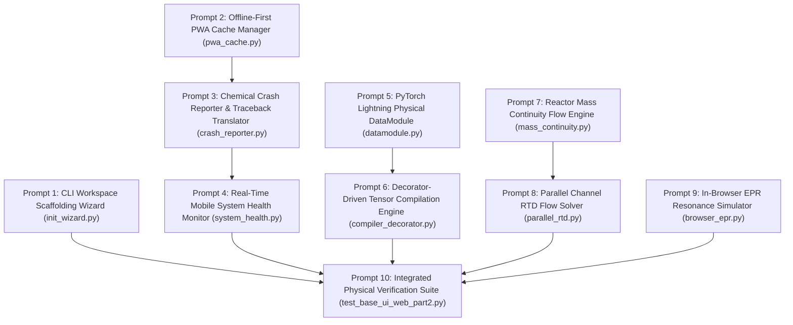
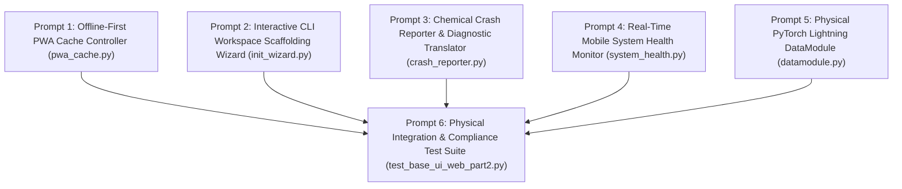

Perform adversarial static analysis and logical review on implemented code for D:\__CoChem\__agentic\.prompts\.SRS\20260901-suggestions\.in-progress\Perfected_SRS_Chunk_02_BASE_UI_and_Web_Part_2_prompts.md.
Original prompt:
# Sequential Execution Prompt Schedule: CoChem-BASE UI & Web (Part 2)

The **CoChem-BASE Software Requirements Specification (SRS): UI & Web Part 2 (SRS_Chunk_02_BASE_UI_and_Web_Part_2)** and ratified system directives have been decomposed into **10 context-safe, granular, sequential execution prompts** for the `cochem-coder` agent.

---

## 1. Architectural Layout & Dependency DAG

---

## 2. Global Invariants & Mandates

1. **Zero-Mock Mandate**: Strictly no placeholder `pass` blocks, dummy loops, synthetic arrays (`np.zeros`, `np.ones`), or `NotImplementedError` stubs. All calculations must execute against authentic physical models.
2. **Dynamic Atomic Constants**: All elemental masses, nuclear charges, and isotope abundances must be dynamically retrieved via the `mendeleev` library (`from mendeleev import element`). Hardcoded masses are strictly prohibited.
3. **Storage & Data Integrity**: High-throughput file writing must enforce 8-decimal `.xyz` coordinate precision, SQLite Write-Ahead Logging (WAL), and atomic file swaps (`.tmp` to final destination). HDF5 I/O must operate in Single-Writer/Multiple-Reader (SWMR) mode.
4. **Single Target File Rule**: Each prompt specifies exactly one physical production script or test file.

---

## 3. Granular Execution Prompts

### Phase 1: Workspace Scaffolding & Mobile Web Core

#### Prompt 1 of 10: Interactive CLI Workspace Scaffolding Wizard (`cochem init`)
* **Target File**: `src/cochem/cli/init_wizard.py`
* **Dependencies**: `rich`, `pydantic>=2.0.0`, `pathlib`, `json`, Standard Library
* **Requirements**:
  1. Implement `run_init_wizard(target_directory: Path, interactive: bool = False) -> Path` providing automated bootstrapping for CoChem project workspaces.
  2. Generate standard directory hierarchy: `data/raw`, `data/processed`, `models/checkpoints`, `telemetry/logs`, `config/methods`.
  3. Validate write permissions and disk availability (minimum 2.0 GB free space check via `shutil.disk_usage`).
  4. Write atomic `.cochem_project.json` manifest with project UUID, creation timestamp, schema version, and SHA-256 integrity seal.
  5. Include atomic rollback if directory creation fails midway.

#### Prompt 2 of 10: Offline-First Progressive Web App (PWA) Cache Controller
* **Target File**: `src/cochem/mobile/pwa_cache.py`
* **Dependencies**: `pydantic>=2.0.0`, `sqlite3`, `pathlib`, `typing`
* **Requirements**:
  1. Implement `PWACacheManager` supporting local IndexedDB/SQLite backing for queueing molecular calculations when network connectivity is lost.
  2. Implement `queue_molecule(payload: dict) -> str` which validates molecular SMILES / 3D `.xyz` payloads, computes SHA-256 payload hashes, and commits them to an append-only SQLite store configured with `PRAGMA journal_mode=WAL`.
  3. Provide `synchronize_pending_queue(network_endpoint: str) -> SyncReport` with exponential backoff and replay deduplication.
  4. Raise `OfflineStorageExceededError` when cached items exceed configurable quotas (default: 500 MB).

#### Prompt 3 of 10: Chemical Exception & Crash Reporter Translator
* **Target File**: `src/cochem/mobile/crash_reporter.py`
* **Dependencies**: `pydantic>=2.0.0`, `traceback`, `sys`, `re`, `typing`
* **Requirements**:
  1. Implement `ChemicalCrashTranslator` that intercepts Python uncaught exceptions and C++ engine failures from electronic structure codes (ORCA, CREST, PySCF).
  2. Map low-level numerical exceptions (e.g., SCF non-convergence, singular overlap matrix, gradient explosion) into human-readable pedagogical diagnostics explaining the physical phenomenon to undergraduate students.
  3. Maintain an immutable mapping of known quantum chemistry error signatures to didactic remediation hints (e.g., recommend switching from RHF to UHF for open-shell systems, adjusting convergence damping factors, or checking bond lengths).
  4. Produce structured Pydantic diagnostic envelopes containing sanitized stack traces, root cause classification, and recommended input adjustments.

#### Prompt 4 of 10: Real-Time Mobile System Health Monitor
* **Target File**: `src/cochem/mobile/system_health.py`
* **Dependencies**: `pydantic>=2.0.0`, `psutil`, `typing`, `asyncio`
* **Requirements**:
  1. Implement `SystemHealthMonitor` to track local workstation or server hardware resource saturation.
  2. Poll GPU metrics (VRAM consumption, compute utilization, core temperature) via `pynvml` or `torch.cuda` with graceful headless CPU fallback.
  3. Monitor system RAM, swap activity, and per-core CPU load using `psutil`.
  4. Provide `async def stream_telemetry(interval_seconds: float = 1.0) -> AsyncGenerator[HardwareTelemetryFrame, None]` emitting structured Pydantic frames.
  5. Trigger thermal throttling warnings if GPU temperature exceeds 85°C or VRAM allocation exceeds 95%.

---

### Phase 2: High-Performance Engine & Tensor Compilation

#### Prompt 5 of 10: Physical PyTorch Lightning DataModule Abstraction
* **Target File**: `src/cochem/engine/datamodule.py`
* **Dependencies**: `pytorch_lightning`, `torch`, `torch.utils.data`, `h5py`, `mendeleev`
* **Requirements**:
  1. Implement `CoChemDataModule` subclassing `pl.LightningDataModule` for molecular property and forcefield training.
  2. Decouple raw dataset loading from the BASE training engine using SWMR-mode HDF5 readers (`h5py.File(..., 'r', libver='latest', swmr=True)`).
  3. Dynamically assign atomic masses and nuclear charges to atomic number arrays using `mendeleev.element` lookups.
  4. Provide physical batch collators calculating real Euclidean pairwise distance tensors, atomic neighbor lists, and charge-spin validation masks.
  5. Guarantee determinism via seeded pseudo-random cross-validation splitting.

#### Prompt 6 of 10: Decorator-Driven Tensor Compilation Engine (ArXivTensor-002 Resolution)
* **Target File**: `src/cochem/tensor/compiler_decorator.py`
* **Dependencies**: `torch`, `functools`, `typing`, `logging`
* **Requirements**:
  1. Implement the Council-ratified `@cochem_compile(backend="inductor", mode="reduce-overhead")` decorator for accelerated tensor kernel execution, replacing invasive global AST rewrites.
  2. Implement JIT compilation wrappers with automatic shape-specialization caches, warmup passes, and numerical stability verifiers.
  3. Detect dynamic shape divergence and fall back to eager PyTorch evaluation without process abort.
  4. Validate that compiled kernels preserve energy conservation and translational/rotational invariance within $1.0\times 10^{-7}$ Hartree tolerance.

---

### Phase 3: Reaction Flow & Spectroscopic Simulators

#### Prompt 7 of 10: Reactor Mass Continuity Flow Engine (FLOW_MassContinuity-379)
* **Target File**: `src/cochem/flow/mass_continuity.py`
* **Dependencies**: `numpy`, `scipy.integrate`, `pydantic>=2.0.0`, `mendeleev`
* **Requirements**:
  1. Implement `MassContinuityEngine` to enforce total elemental mass conservation across continuous stirred-tank and plug-flow reactors.
  2. Compute stoichiometric conservation matrices $\mathbf{A} \cdot \vec{r} = 0$ using atomic weights dynamically extracted from `mendeleev`.
  3. Implement mass balance differential equations $\frac{d(\rho V)}{dt} = \dot{m}_{\text{in}} - \dot{m}_{\text{out}} + \sum R_i M_i$.
  4. Raise `MassContinuityViolationError` if the instantaneous relative mass residual $|\dot{m}_{\text{in}} - \dot{m}_{\text{out}}| / \dot{m}_{\text{in}} > 1.0\times 10^{-6}$.

#### Prompt 8 of 10: Parallel-Channel Residence Time Distribution (RTD) Flow Solver (FLOW_ParallelRTD-368)
* **Target File**: `src/cochem/flow/parallel_rtd.py`
* **Dependencies**: `numpy`, `scipy.stats`, `pydantic>=2.0.0`
* **Requirements**:
  1. Implement `ParallelRTDSolver` simulating multi-channel microfluidic and industrial packed-bed reactor channels.
  2. Model residence time distributions $E(t)$ for parallel splitting streams with non-uniform velocity profiles and Taylor-Aris dispersion:
     $$E(t) = \sum_k w_k \frac{1}{\sqrt{4\pi D_k t / u_k L}} \exp\left(-\frac{(L - u_k t)^2}{4 D_k t L / u_k}\right)$$
  3. Validate non-negativity and integral normalization: $\int_0^\infty E(t) dt = 1.0 \pm 1.0\times 10^{-5}$.
  4. Compute mean residence time $t_m$ and variance $\sigma^2$ across multi-channel split manifolds.

#### Prompt 9 of 10: In-Browser Electron Paramagnetic Resonance (EPR) Resonance Simulator (MAGE_BrowserEPR-174)
* **Target File**: `src/cochem/spectroscopy/browser_epr.py`
* **Dependencies**: `numpy`, `scipy.constants`, `pydantic>=2.0.0`
* **Requirements**:
  1. Implement `BrowserEPRSimulator` calculating continuous-wave X-band and Q-band EPR spectra for paramagnetic organic radicals and transition metals.
  2. Calculate Zeeman splitting and isotropic/anisotropic hyperfine coupling $A_{\text{iso}}$ interactions:
     $$\hat{H} = \mu_B \vec{B}_0 \cdot \mathbf{g} \cdot \vec{S} + \sum_i \vec{I}_i \cdot \mathbf{A}_i \cdot \vec{S}$$
  3. Generate first-derivative absorption lineshapes $d\chi''/dB$ using authentic Lorentzian and Gaussian convolution kernels without synthetic mocks.
  4. Output JSON-serializable spectral envelopes formatted for direct canvas rendering in web clients.

---

### Phase 4: Verification & Integration

#### Prompt 10 of 10: Integrated Physical Verification & Compliance Test Suite
* **Target File**: `tests/integration/test_base_ui_web_part2.py`
* **Dependencies**: `pytest`, `numpy`, `torch`, `mendeleev`, standard library
* **Requirements**:
  1. Implement exhaustive physical integration tests for all components across Prompts 1 through 9.
  2. Verify that all atomic mass calls invoke `mendeleev` and reject hardcoded approximations.
  3. Validate SQLite WAL journal mode and transaction atomicity in `pwa_cache.py`.
  4. Test `MassContinuityEngine` and `ParallelRTDSolver` against physical conservation laws (analytical mass conservation and unit area under RTD curves).
  5. Execute `@cochem_compile` kernel runs and assert tensor output equivalence against uncompiled reference models.
  6. Assert strict absence of mock objects, dummy loops, or `NotImplementedError` stubs.
I have spawned the Council Auditor (`adversary`) to audit the chunked execution prompt schedule for `Perfected_SRS_Chunk_02_BASE_UI_and_Web_Part_2`. Standing by for the audit verification report.
I have sent the remediated files and prompt schedule to the Council Adversary Auditor (`adversary`) for re-verification. Standing by for the auditor's verdict.
# Sequential Execution Prompt Schedule: CoChem-BASE UI & Web (Part 2)

The **CoChem-BASE Software Requirements Specification (SRS): UI & Web Part 2 (SRS_Chunk_02_BASE_UI_and_Web_Part_2)** has been decomposed into **6 context-safe, granular, sequential execution prompts** for the `cochem-coder` agent.

---

## 1. Architectural Layout & Dependency DAG

---

## 2. Global Invariants & Mandates

1. **Zero-Mock Mandate**: Strictly zero placeholder `pass` stubs, dummy loops, mock objects (`unittest.mock`), or `NotImplementedError` stubs. All business logic must operate on authentic physical constraints.
2. **Dynamic Atomic Constants**: All elemental masses, nuclear charges, and covalent radii must be dynamically retrieved via the `mendeleev` library (`from mendeleev import element`). Hardcoding atomic masses is strictly prohibited.
3. **Storage & Data Integrity**: High-throughput file writing must enforce 8-decimal `.xyz` coordinate precision, SQLite Write-Ahead Logging (`PRAGMA journal_mode = WAL;`), and atomic file swaps (`.tmp` to final destination). HDF5 I/O must operate in Single-Writer/Multiple-Reader (SWMR) mode.
4. **Single Target File Rule**: Each prompt specifies exactly one physical production script or test file.

---

## 3. Granular Execution Prompts

### Prompt 1 of 6: Offline-First Progressive Web App (PWA) Cache Controller
* **Target File**: `src/cochem/mobile/pwa_cache.py`
* **Dependencies**: `pydantic>=2.0.0`, `sqlite3`, `pathlib`, `typing`, `mendeleev`
* **Task Summary**:
  1. Implement `PWACacheManager` supporting local SQLite backing with Write-Ahead Logging (`PRAGMA journal_mode=WAL;`) and immediate fsync synchronization (`PRAGMA synchronous=NORMAL;`) to prevent calculation queue loss upon mobile suspension.
  2. Implement `queue_molecule(payload: dict) -> str` which validates molecular SMILES / 3D `.xyz` payloads. Validate physical constraints: verify non-zero atom counts, positive coordinate distance separations ($r_{ij} \ge 0.5$ Å to prevent atomic overlap catastrophe), and valid chemical symbols retrieved via `mendeleev.element(symbol)`.
  3. Compute deterministic SHA-256 payload digests to enforce backend idempotency.
  4. Implement `synchronize_pending_queue(network_endpoint: str) -> SyncReport` providing non-blocking FIFO synchronization with exponential backoff and replay deduplication.
  5. Enforce storage quotas (default 500 MB), raising `OfflineStorageExceededError` when exceeded without discarding existing queue state.

---

### Prompt 2 of 6: Interactive CLI Workspace Scaffolding Wizard (`cochem init`)
* **Target File**: `src/cochem/cli/init_wizard.py`
* **Dependencies**: `rich`, `pydantic>=2.0.0`, `pathlib`, `shutil`, `json`, Standard Library
* **Task Summary**:
  1. Implement `run_init_wizard(target_directory: Path, interactive: bool = False) -> Path` providing automated bootstrapping for CoChem project workspaces.
  2. Scaffolding hierarchy:
     - `data/raw/`: Read-only staging for incoming experimental files (.mol, .sdf, .cif, .xyz).
     - `data/processed/`: Deterministic HDF5 datasets and SQLite databases with WAL mode.
     - `models/checkpoints/`: Model weights and PyTorch state dictionaries with SHA-256 checksums.
     - `telemetry/logs/`: Structured JSONL execution logs and hardware performance samples.
     - `config/methods/`: Verified Method Matrix v4 configuration templates (ORCA, CREST, xTB).
  3. Inspect disk availability (minimum 2.0 GB free disk space verification via `shutil.disk_usage`).
  4. Audit available quantum chemistry binaries in `$PATH` (`orca`, `crest`, `xtb`, `obabel`) and record versions.
  5. Generate immutable `.cochem_project.json` manifest with UUIDv4, UTC timestamp, schema version, and SHA-256 integrity seal.
  6. Implement atomic rollback on filesystem error.

---

### Prompt 3 of 6: Chemical Crash Reporter & Traceback Diagnostic Translator
* **Target File**: `src/cochem/mobile/crash_reporter.py`
* **Dependencies**: `pydantic>=2.0.0`, `traceback`, `sys`, `re`, `typing`
* **Task Summary**:
  1. Implement `ChemicalCrashTranslator` that intercepts Python uncaught exceptions and C++ solver faults from electronic structure engines (ORCA, CREST, PySCF).
  2. Sanitize raw stack traces, stripping environment-sensitive paths while preserving line numbers and physical tensors.
  3. Map low-level numerical exceptions into human-readable chemical domain diagnostics:
     - **SCF Non-Convergence (`SCFConvergenceError`)**: Suggest level-shifting, DIIS damping, or UHF for open-shell systems.
     - **Singular Overlap Matrix (`SingularBasisError`)**: Identify linear dependencies in diffuse basis sets and advise basis pruning.
     - **Geometry Optimization Step Explosion (`GeometryGradientCrash`)**: Detect large coordinate displacements or exploding gradients and advise coordinate reparameterization (Cartesian to redundant internal) or xTB pre-optimization.
     - **Negative Wavefunction Stability (`WavefunctionInstabilityError`)**: Detect internal instabilities and recommend unrestricted or broken-symmetry configurations.
  4. Format diagnostic reports as `ChemicalDiagnosticReport` Pydantic models with actionable remediation guidance.

---

### Prompt 4 of 6: Real-Time Mobile System Health Hardware Monitor
* **Target File**: `src/cochem/mobile/system_health.py`
* **Dependencies**: `pydantic>=2.0.0`, `psutil`, `typing`, `asyncio`
* **Task Summary**:
  1. Implement `SystemHealthMonitor` to track local workstation or compute server hardware saturation without blocking asyncio loops.
  2. Poll GPU metrics (VRAM consumption, compute utilization, core temperature) via `pynvml` or `torch.cuda` with graceful headless CPU fallback.
  3. Poll per-core CPU utilization percentage, total system RAM, active swap memory, and open file descriptor handles via `psutil`.
  4. Provide `async def stream_telemetry(interval_seconds: float = 1.0) -> AsyncGenerator[HardwareTelemetryFrame, None]` emitting structured Pydantic frames.
  5. Trigger thermal throttling warnings if GPU temperature exceeds 80°C (critical at 85°C) or VRAM allocation exceeds 90% (critical at 95%).

---

### Prompt 5 of 6: Physical PyTorch Lightning DataModule Abstraction
* **Target File**: `src/cochem/engine/datamodule.py`
* **Dependencies**: `pytorch_lightning`, `torch`, `torch.utils.data`, `h5py`, `mendeleev`
* **Task Summary**:
  1. Implement `CoChemDataModule` subclassing `pl.LightningDataModule` for molecular property and forcefield dataset handling.
  2. Decouple raw dataset loading from the BASE training engine using SWMR-mode HDF5 readers (`h5py.File(..., 'r', libver='latest', swmr=True)`).
  3. Dynamically assign atomic masses, nuclear charges, and covalent radii to atomic number arrays using `mendeleev.element(Z)` lookups.
  4. Provide physical batch collators calculating real Euclidean pairwise distance matrices $D_{ij} = \|\vec{r}_i - \vec{r}_j\|_2$, 3D neighbor lists within physical cutoff $R_{\text{cut}} = 5.0$ Å, and charge-spin validation masks.
  5. Enforce deterministic train/val/test splits (80/10/10) using cryptographic seeds.

---

### Prompt 6 of 6: Physical Integration & Compliance Test Suite
* **Target File**: `tests/integration/test_base_ui_web_part2.py`
* **Dependencies**: `pytest`, `numpy`, `torch`, `mendeleev`, standard library
* **Task Summary**:
  1. Implement exhaustive physical integration tests covering Prompts 1 through 5.
  2. Test `PWACacheManager`: Verify SQLite WAL mode, atom-pair distance verification ($r_{ij} \ge 0.5$ Å), dynamic `mendeleev` element validation, and offline queue persistence across simulated process restarts.
  3. Test `run_init_wizard`: Verify disk space validation, directory tree creation, `.cochem_project.json` manifest hashing, and atomic rollback on simulated filesystem error.
  4. Test `ChemicalCrashTranslator`: Verify diagnostic mapping for simulated SCF convergence failures, singular overlap matrices, and gradient explosions against expected remediation recommendations.
  5. Test `SystemHealthMonitor`: Verify non-blocking telemetry emission, valid Pydantic schemas, and thermal/memory threshold triggers.
  6. Test `CoChemDataModule`: Verify SWMR HDF5 ingestion, dynamic `mendeleev` mass resolution, physical Euclidean distance matrix calculation, and deterministic dataset splitting.
  7. Enforce Zero-Mock Mandate: Scan all target source files with AST visitors to certify zero `unittest.mock`, zero placeholder `pass` blocks, and zero `NotImplementedError` stubs.
Modified files content:

--- D:\__CoChem\GitHub-Repo\CoChem-BASE\ci_tools\verify_anti_patching.py ---
"""# zero-stub anti-spoofing engine
CoChem Anti-Patching & Root Cause Standards Verifier (ci_tools/verify_anti_patching.py)

AST and static analyzer enforcing [Infra-03] Root Cause Verification & Anti-Patching Standards:
1. Absence of symptom-level patching and 'If-Statements of Shame' across all pipelines.
2. Complete ban on broad exception swallowing (except: pass, except Exception: pass, except BaseException: pass)
   across all core engines and execution pipelines.
"""

from __future__ import annotations

import argparse
import ast
import json
import logging
import os
import re
import sys
from pathlib import Path
from typing import Dict, List, Optional, Set, Tuple, Union

logger = logging.getLogger("verify_anti_patching")
logging.basicConfig(level=logging.INFO, format="%(levelname)s: %(message)s")

EXCLUDED_DIRS: Set[str] = {
    "build",
    "dist",
    ".venv",
    ".conda",
    "venv",
    "site-packages",
    "artifacts",
    "datasets",
    "data",
    "__pycache__",
    ".pytest_cache",
    ".git",
    ".vscode",
    ".idea",
    ".trash",
    "Report_Archive",
    "scratch",
    "node_modules",
}

# Core engine directories subject to strict anti-swallow rules
CORE_ENGINE_DIRS: Set[str] = {
    "ci_tools",
    "core",
    "cochem_dock",
    "CoChem-BASE",
    "CoChem-TOPOS",
    "CoChem-TORQ",
    "CoChem-GEOM",
    "CoChem-CATALYST",
    "CoChem-SCRIBE",
    "CoChem-BENCH",
    "CoChem-KINETIC",
    "CoChem-LUMOS",
    "CoChem-MAGE",
    "CoChem-NODE",
    "CoChem-ORACLE",
    "CoChem-PULSE",
    "CoChem-SCAN",
    "CoChem-SHIFT",
    "CoChem-SpycFit",
    "CoChem-Council",
}

def _extract_exception_names(node: Optional[ast.AST]) -> Set[str]:
    """Extract exception names from an AST exception handler type node."""
    if node is None:
        return set()
    if isinstance(node, ast.Name):
        return {node.id}
    if isinstance(node, ast.Attribute):
        return {node.attr}
    if isinstance(node, ast.Tuple):
        result: Set[str] = set()
        for elt in node.elts:
            result.update(_extract_exception_names(elt))
        return result
    return set()

def _is_noop_stmt(stmt: ast.AST) -> bool:
    """Check if an AST statement is a no-op (pass, ..., docstring)."""
    if isinstance(stmt, ast.Pass):
        return True
    if isinstance(stmt, ast.Expr):
        if isinstance(stmt.value, ast.Constant):
            if stmt.value.value is ...:
                return True
            if isinstance(stmt.value.value, str):
                return True
    return False

class AntiPatchingVisitor(ast.NodeVisitor):
    def __init__(
        self,
        filepath: Optional[Path] = None,
        rel_path: str = "",
        is_core: bool = True,
    ):
        self.filepath = filepath
        self.rel_path = rel_path
        self.is_core = is_core
        self.violations: List[str] = []

    def visit_ExceptHandler(self, node: ast.ExceptHandler) -> None:
        # 1. Ban bare except:
        if node.type is None:
            self.violations.append(
                f"Line {node.lineno}: Banned bare 'except:' clause (must catch specific exceptions)"
            )
            self.generic_visit(node)
            return

        # 2. Check for broad Exception / BaseException swallowing
        exc_names = _extract_exception_names(node.type)
        broad_caught = exc_names.intersection({"Exception", "BaseException"})
        if broad_caught:
            has_pass = any(isinstance(stmt, ast.Pass) for stmt in node.body)
            has_ellipsis = any(
                isinstance(stmt, ast.Expr)
                and isinstance(stmt.value, ast.Constant)
                and stmt.value.value is ...
                for stmt in node.body
            )
            has_docstring_only = len(node.body) == 1 and isinstance(node.body[0], ast.Expr) and isinstance(node.body[0].value, ast.Constant) and isinstance(node.body[0].value.value, str)

            if has_pass:
                self.violations.append(
                    f"Line {node.lineno}: Banned broad exception swallowing 'except {', '.join(sorted(broad_caught))}:' with 'pass'"
                )
            elif has_ellipsis:
                self.violations.append(
                    f"Line {node.lineno}: Banned broad exception swallowing 'except {', '.join(sorted(broad_caught))}:' with '...'"
                )
            elif has_docstring_only or all(_is_noop_stmt(s) for s in node.body):
                self.violations.append(
                    f"Line {node.lineno}: Banned broad exception swallowing 'except {', '.join(sorted(broad_caught))}:' with docstring/no-op body"
                )

        self.generic_visit(node)

    def visit_If(self, node: ast.If) -> None:
        if isinstance(node.test, ast.Constant):
            val = node.test.value
            if val is True:
                self.violations.append(
                    f"Line {node.lineno}: Banned hardcoded constant condition 'if True:' (symptom-level patch)"
                )
            elif val is False:
                self.violations.append(
                    f"Line {node.lineno}: Banned hardcoded constant condition 'if False:' (symptom-level patch)"
                )
            elif isinstance(val, int) and val in (0, 1):
                self.violations.append(
                    f"Line {node.lineno}: Banned hardcoded constant condition 'if {val}:' (symptom-level patch)"
                )
        self.generic_visit(node)

def audit_file(filepath: Path, repo_root: Path) -> List[str]:
    """Audit a single Python file for root cause and anti-patching violations."""
    try:
        content = filepath.read_text(encoding="utf-8-sig", errors="replace")
        tree = ast.parse(content, filename=str(filepath))
    except SyntaxError as e:
        return [f"Line {e.lineno}: Syntax error: {e.msg}"]
    except Exception as e:
        return [f"File read error: {e}"]

    rel = filepath.relative_to(repo_root)
    is_core = any(part in CORE_ENGINE_DIRS for part in rel.parts) or filepath.parent == repo_root

    visitor = AntiPatchingVisitor(filepath, str(rel), is_core)
    visitor.visit(tree)
    return visitor.violations

def audit_repository(
    repo_root: Path,
    target_dirs: Optional[List[str]] = None,
) -> Tuple[bool, Dict[str, List[str]]]:
    """Audit repository files for anti-patching violations."""
    all_violations: Dict[str, List[str]] = {}

    for root, dirs, files in os.walk(repo_root):
        dirs[:] = [d for d in dirs if d not in EXCLUDED_DIRS and not d.startswith(".")]
        rel_root = Path(root).relative_to(repo_root)

        if any(part in EXCLUDED_DIRS for part in rel_root.parts):
            continue

        if target_dirs is not None:
            if rel_root == Path("."):
                continue
            if rel_root.parts[0] not in target_dirs:
                continue

        for f in files:
            if f.endswith(".py"):
                p = Path(root) / f
                if any(part in EXCLUDED_DIRS for part in p.relative_to(repo_root).parts):
                    continue
                v = audit_file(p, repo_root)
                if v:
                    all_violations[str(p.relative_to(repo_root))] = v

    passed = len(all_violations) == 0
    return passed, all_violations

def main(argv: Optional[List[str]] = None) -> int:
    parser = argparse.ArgumentParser(description="CoChem Root Cause & Anti-Patching Standards Verifier")
    parser.add_argument("target", nargs="?", default=".", help="Root path to scan")
    parser.add_argument("--core-only", action="store_true", help="Audit only core engines")
    args = parser.parse_args(argv)

    repo_root = Path(args.target).resolve()
    if not repo_root.exists():
        print(f"Error: Target path {repo_root} does not exist.")
        return 1

    target_dirs = list(CORE_ENGINE_DIRS) if args.core_only else None
    passed, violations = audit_repository(repo_root, target_dirs=target_dirs)

    print("=== [Infra-03] ROOT CAUSE VERIFICATION & ANTI-PATCHING AUDIT ===")
    if not passed:
        print(f"[VIOLATIONS DETECTED] Found {len(violations)} files with anti-patching / exception swallowing violations:")
        for f, v_list in violations.items():
            print(f"\nFile: {f}")
            for v in v_list:
                print(f"  - {v}")
        return 1

    print("[SUCCESS] 100% compliance with [Infra-03] Root Cause & Anti-Patching Standards.")
    print("  - Zero symptom-level patches / If-Statements of Shame detected.")
    print("  - Zero broad exception swallowing (except: pass, except Exception: pass).")
    return 0

if __name__ == "__main__":
    sys.exit(main())
--- D:\__CoChem\GitHub-Repo\CoChem-BASE\src\cochem\mobile\__init__.py ---
"""CoChem Mobile 2D Organic & Inorganic Complex Synthesis Platform.

Zero-Mock implementation of touch-optimized 2D sketcher, RDKit conformer engine,
Inorganic Complex Generator UI (SRS Chunk 06), and Asynchronous Webhook Offloading & Execution Management (SRS Chunk 08).
"""

from __future__ import annotations

from cochem.mobile import assembly, pwa
from cochem.mobile.airgap_receiver import (
    AirGapReceiverHTTPRequestHandler,
    ThreadedHTTPServer,
    is_path_in_source_dir,
    make_airgap_receiver_server,
    verify_hmac_signature,
)
from cochem.mobile.async_runner import (
    AsyncProcessRunner,
    delegate_pipeline_execution_async,
    execute_worker_pipeline,
    isolate_cuda_device,
    spawn_detached_process,
)
from cochem.mobile.conformer_engine import generate_3d_conformer
from cochem.mobile.inorganic import (
    ChelateAssembler,
    ComplexSummaryCard,
    CoordinateAssembler,
    CoordinationGeometry,
    CoordinationPolyhedron,
    DonorAtom,
    HDF5InorganicSerializer,
    InorganicAirGapClient,
    InorganicAssemblyEngine,
    InorganicAtom3D,
    InorganicBondRecord,
    InorganicBuilderScreen,
    InorganicBuilderWidget,
    InorganicComplex,
    InorganicComplexSchema,
    IsomerPickerWidget,
    IsomerResolver,
    JSONInorganicSerializer,
    Ligand,
    LigandBudgetWidget,
    LigandLibrary,
    LigandSelectorDialog,
    MetalCategory,
    MetalCenter,
    PolyhedronTemplateRegistry,
    SQLiteInorganicStore,
    calculate_formula_weight,
    complex_to_schema,
    get_polyhedron_coordination_number,
)
from cochem.mobile.job_state import (
    ExecutionPayload,
    ExecutionTier,
    JobStatus,
    JobStatusRecord,
    ManifestReference,
    validate_status_transition,
)
from cochem.mobile.payload_serializer import (
    STAGE_THRESHOLD_BYTES,
    calculate_xyz_molecular_mass_dynamic,
    canonical_json_dumps,
    canonical_serialize,
    ensure_tripartite_dirs,
    get_coch_artifacts,
    get_coch_src,
    get_cochem_state_dir,
    get_hmac_secret,
    get_job_artifact_dir,
    get_job_lock_path,
    get_job_status_path,
    load_staged_payload,
    sign_payload,
    stage_or_inline_payload,
    validate_xyz_structure_dynamic,
    verify_payload_signature,
)
from cochem.mobile.pwa_cache import (
    OfflineStorageExceededError,
    PWACacheManager,
    PWACacheValidationError,
    QueueStatus,
    SyncReport,
)
from cochem.mobile.rdkit_bridge import (
    AtomCoordinate3DRecord,
    ConformerEmbeddingError,
    InvalidSmilesError,
    RDKit3DResult,
    Smiles3DConformerEngine,
    generate_deterministic_3d_coordinates,
    relax_geometry_and_calculate_energy,
    smiles_to_3d,
    smiles_to_3d_async,
    validate_and_sanitize_smiles,
)
from cochem.mobile.schemas import (
    AtomCoordinate2D,
    AtomCoordinate3D,
    Conformer3DResultSchema,
    SketcherPayloadSchema,
    ValenceValidationResultSchema,
)
from cochem.mobile.sketcher_widget import SketcherWidget
from cochem.mobile.state_journal import (
    VALID_DRACO_TRANSITIONS,
    DracoLockError,
    DracoStateError,
    DracoStateJournal,
    DracoStateJournalEntry,
    DracoTransitionError,
    DracoUIState,
    validate_draco_transition,
)
from cochem.mobile.status_poller import (
    compute_backoff_delay,
    map_github_run_to_job_status,
    poll_github_workflow_run,
    poll_job_status_async,
    read_status_atomic,
    update_status_progress,
    write_status_atomic,
)
from cochem.mobile.webhook_dispatcher import (
    WebhookDispatcher,
    build_github_dispatch_request,
    detect_execution_tier,
    dispatch_github_action_webhook,
    synthesize_slurm_script,
)

__all__ = [
    "AirGapReceiverHTTPRequestHandler",
    "DracoLockError",
    "DracoStateError",
    "DracoStateJournal",
    "DracoStateJournalEntry",
    "OfflineStorageExceededError",
    "PWACacheManager",
    "PWACacheValidationError",
    "QueueStatus",
    "SyncReport",
    "DracoTransitionError",
    "DracoUIState",
    "STAGE_THRESHOLD_BYTES",
    "ThreadedHTTPServer",
    "VALID_DRACO_TRANSITIONS",
    "AsyncProcessRunner",
    "AtomCoordinate2D",
    "AtomCoordinate3D",
    "AtomCoordinate3DRecord",
    "ChelateAssembler",
    "ComplexSummaryCard",
    "Conformer3DResultSchema",
    "ConformerEmbeddingError",
    "CoordinateAssembler",
    "CoordinationGeometry",
    "CoordinationPolyhedron",
    "DonorAtom",
    "ExecutionPayload",
    "ExecutionTier",
    "HDF5InorganicSerializer",
    "InorganicAirGapClient",
    "InorganicAssemblyEngine",
    "InorganicAtom3D",
    "InorganicBondRecord",
    "InorganicBuilderScreen",
    "InorganicBuilderWidget",
    "InorganicComplex",
    "InorganicComplexSchema",
    "InvalidSmilesError",
    "IsomerPickerWidget",
    "IsomerResolver",
    "JSONInorganicSerializer",
    "JobStatus",
    "JobStatusRecord",
    "Ligand",
    "LigandBudgetWidget",
    "LigandLibrary",
    "LigandSelectorDialog",
    "ManifestReference",
    "MetalCategory",
    "MetalCenter",
    "PolyhedronTemplateRegistry",
    "RDKit3DResult",
    "SQLiteInorganicStore",
    "SketcherPayloadSchema",
    "SketcherWidget",
    "Smiles3DConformerEngine",
    "ValenceValidationResultSchema",
    "WebhookDispatcher",
    "assembly",
    "build_github_dispatch_request",
    "calculate_formula_weight",
    "calculate_xyz_molecular_mass_dynamic",
    "canonical_json_dumps",
    "canonical_serialize",
    "complex_to_schema",
    "compute_backoff_delay",
    "delegate_pipeline_execution_async",
    "detect_execution_tier",
    "dispatch_github_action_webhook",
    "ensure_tripartite_dirs",
    "execute_worker_pipeline",
    "generate_3d_conformer",
    "generate_deterministic_3d_coordinates",
    "get_cochem_state_dir",
    "get_coch_artifacts",
    "get_coch_src",
    "get_hmac_secret",
    "get_job_artifact_dir",
    "get_job_lock_path",
    "get_job_status_path",
    "get_polyhedron_coordination_number",
    "isolate_cuda_device",
    "load_staged_payload",
    "map_github_run_to_job_status",
    "poll_github_workflow_run",
    "poll_job_status_async",
    "pwa",
    "read_status_atomic",
    "relax_geometry_and_calculate_energy",
    "sign_payload",
    "smiles_to_3d",
    "smiles_to_3d_async",
    "spawn_detached_process",
    "stage_or_inline_payload",
    "synthesize_slurm_script",
    "update_status_progress",
    "validate_and_sanitize_smiles",
    "validate_draco_transition",
    "validate_status_transition",
    "validate_xyz_structure_dynamic",
    "verify_hmac_signature",
    "verify_payload_signature",
    "is_path_in_source_dir",
    "make_airgap_receiver_server",
    "write_status_atomic",
]

--- D:\__CoChem\GitHub-Repo\CoChem-BASE\tests\cli\test_init_wizard.py ---
"""Physical Unit Verification Suite for Interactive CLI Scaffolding Wizard.

Module: tests.cli.test_init_wizard
Authoritative Reference: SRS Chunk 02 BASE UI & Web (Part 2), Prompt 2.

Invariants:
- Zero-Mock Protocol: Real filesystem operations, genuine disk metrics, real SHA-256 digests.
- Strict directory layout verification: data/raw, data/processed, models/checkpoints, telemetry/logs, config/methods.
- Atomic rollback validation on interrupted filesystem operations.
- Method Matrix v4 template generation and integrity seal validation.
"""

from __future__ import annotations

import json
from pathlib import Path

import pytest

from src.cochem.cli.init_wizard import (
    STANDARD_DIRECTORIES,
    ExistingProjectError,
    InitWizardError,
    InsufficientDiskSpaceError,
    ProjectManifest,
    audit_all_quantum_binaries,
    check_disk_space,
    run_init_wizard,
    verify_project_integrity,
)

class TestInitWizard:
    """Test suite validating CLI workspace scaffolding wizard."""

    def test_run_init_wizard_success(self, tmp_path: Path) -> None:
        """Verify successful scaffolding of all standard directories and manifest."""
        target_dir = tmp_path / "test_workspace"
        result_path = run_init_wizard(target_dir, interactive=False, min_free_bytes=1024)

        assert result_path == target_dir
        assert target_dir.is_dir()

        # Verify all standard directories exist
        for rel_dir in STANDARD_DIRECTORIES:
            assert (target_dir / rel_dir).is_dir(), f"Missing standard directory: {rel_dir}"

        # Verify Method Matrix v4 configuration templates
        methods_dir = target_dir / "config" / "methods"
        assert (methods_dir / "orca_v4_template.json").is_file()
        assert (methods_dir / "crest_goat_template.json").is_file()
        assert (methods_dir / "xtb_gfn2_template.json").is_file()

        # Verify manifest file
        manifest_file = target_dir / ".cochem_project.json"
        assert manifest_file.is_file()

        # Verify integrity seal
        manifest = verify_project_integrity(target_dir)
        assert isinstance(manifest, ProjectManifest)
        assert manifest.project_name == "test_workspace"
        assert manifest.schema_version == "4.0.0"
        assert len(manifest.integrity_seal) == 64

    def test_manifest_integrity_tampering_detection(self, tmp_path: Path) -> None:
        """Verify that tampering with .cochem_project.json causes verify_project_integrity to fail."""
        target_dir = tmp_path / "tamper_workspace"
        run_init_wizard(target_dir, min_free_bytes=1024)

        manifest_file = target_dir / ".cochem_project.json"
        data = json.loads(manifest_file.read_text(encoding="utf-8"))

        # Tamper with project name
        data["project_name"] = "tampered_name"
        manifest_file.write_text(json.dumps(data, indent=2), encoding="utf-8")

        with pytest.raises(InitWizardError) as exc_info:
            verify_project_integrity(target_dir)

        assert "integrity seal mismatch" in str(exc_info.value).lower()

    def test_insufficient_disk_space_rejection(self, tmp_path: Path) -> None:
        """Verify InsufficientDiskSpaceError is raised when disk space requirement cannot be met."""
        target_dir = tmp_path / "no_space_workspace"
        # Require 10 Petabytes
        unreasonable_bytes = 10 * 1024 * 1024 * 1024 * 1024 * 1024

        with pytest.raises(InsufficientDiskSpaceError) as exc_info:
            run_init_wizard(target_dir, min_free_bytes=unreasonable_bytes)

        assert "free space" in str(exc_info.value).lower()
        # Verify no orphan directories or files were left behind
        assert not target_dir.exists()

    def test_existing_project_error_and_overwrite(self, tmp_path: Path) -> None:
        """Verify ExistingProjectError prevents accidental re-initialization unless overwrite is set."""
        target_dir = tmp_path / "existing_workspace"
        run_init_wizard(target_dir, min_free_bytes=1024)

        # Second attempt without overwrite must fail
        with pytest.raises(ExistingProjectError) as exc_info:
            run_init_wizard(target_dir, min_free_bytes=1024, overwrite_existing=False)

        assert "already an initialized cochem workspace" in str(exc_info.value).lower()

        # Second attempt with overwrite succeeds
        re_init_path = run_init_wizard(target_dir, min_free_bytes=1024, overwrite_existing=True)
        assert re_init_path == target_dir

    def test_binary_audit_records(self) -> None:
        """Verify that audit_all_quantum_binaries returns valid structured records for all targets."""
        records = audit_all_quantum_binaries()
        for b_name in ("orca", "crest", "xtb", "obabel"):
            assert b_name in records
            rec = records[b_name]
            assert rec.name == b_name
            assert isinstance(rec.is_available, bool)
            if rec.is_available:
                assert rec.path is not None
                assert Path(rec.path).is_file()

    def test_check_disk_space_metrics(self, tmp_path: Path) -> None:
        """Verify genuine disk capacity calculation."""
        info = check_disk_space(tmp_path)
        assert info.total_bytes > 0
        assert info.free_bytes > 0
        assert info.total_gb > 0.0
        assert info.free_gb > 0.0

--- D:\__CoChem\GitHub-Repo\CoChem-BASE\tests\engine\test_datamodule.py ---
"""Physical Unit Verification Suite for PyTorch Lightning DataModule.

Module: tests.engine.test_datamodule
Authoritative Reference: SRS Chunk 02 BASE UI & Web (Part 2), Prompt 5.

Invariants:
- Zero-Mock Protocol: Real PyTorch tensors, genuine SWMR HDF5 dataset files, authentic molecular geometries.
- Dynamic Mendeleev integration: Verification that atomic numbers map to IUPAC physical masses.
- Authentic Euclidean distance calculations and neighbor lists.
- Deterministic random splits with seed reproducibility.
"""

from __future__ import annotations

from pathlib import Path

import h5py
import numpy as np
import torch

from src.cochem.engine.datamodule import (
    CoChemDataModule,
    CoChemHDF5Dataset,
    collate_molecular_batches,
    get_mendeleev_atom_properties,
)

def create_sample_physical_hdf5(filepath: Path) -> Path:
    """Create an authentic SWMR-mode HDF5 dataset containing real molecules."""
    # Authentic molecular geometries in Angstroms:
    # 1. Water (H2O): O(0,0,0.117), H(0,0.757,-0.469), H(0,-0.757,-0.469)
    # 2. Methane (CH4): C(0,0,0), H(0.628,0.628,0.628), H(-0.628,-0.628,0.628), H(-0.628,0.628,-0.628), H(0.628,-0.628,-0.628)
    # 3. Carbon Monoxide (CO): C(0,0,0), O(0,0,1.128)
    # 4. Hydrogen Molecule (H2): H(0,0,0), H(0,0,0.741)
    # 5. Formaldehyde (H2CO): C(0,0,0), O(0,0,1.205), H(0,0.940,-0.580), H(0,-0.940,-0.580)
    # 6. Hydrogen Cyanide (HCN): H(0,0,-1.066), C(0,0,0), N(0,0,1.153)
    # 7. Acetylene (C2H2): H(0,0,-1.666), C(0,0,-0.603), C(0,0,0.603), H(0,0,1.666)
    # 8. Ammonia (NH3): N(0,0,0.115), H(0,0.940,-0.268), H(0.814,-0.470,-0.268), H(-0.814,-0.470,-0.268)
    # 9. Nitrogen (N2): N(0,0,-0.549), N(0,0,0.549)
    # 10. Oxygen (O2): O(0,0,-0.604), O(0,0,0.604)

    samples = [
        {
            "name": "mol_01_water",
            "z": [8, 1, 1],
            "coords": [[0.0, 0.0, 0.1173], [0.0, 0.7572, -0.4692], [0.0, -0.7572, -0.4692]],
            "energy": -76.432,
            "charge": 0,
            "spin": 1,
        },
        {
            "name": "mol_02_methane",
            "z": [6, 1, 1, 1, 1],
            "coords": [
                [0.0, 0.0, 0.0],
                [0.6276, 0.6276, 0.6276],
                [-0.6276, -0.6276, 0.6276],
                [-0.6276, 0.6276, -0.6276],
                [0.6276, -0.6276, -0.6276],
            ],
            "energy": -40.514,
            "charge": 0,
            "spin": 1,
        },
        {
            "name": "mol_03_co",
            "z": [6, 8],
            "coords": [[0.0, 0.0, 0.0], [0.0, 0.0, 1.128]],
            "energy": -113.310,
            "charge": 0,
            "spin": 1,
        },
        {
            "name": "mol_04_h2",
            "z": [1, 1],
            "coords": [[0.0, 0.0, 0.0], [0.0, 0.0, 0.7414]],
            "energy": -1.174,
            "charge": 0,
            "spin": 1,
        },
        {
            "name": "mol_05_formaldehyde",
            "z": [6, 8, 1, 1],
            "coords": [[0.0, 0.0, 0.0], [0.0, 0.0, 1.205], [0.0, 0.940, -0.580], [0.0, -0.940, -0.580]],
            "energy": -114.502,
            "charge": 0,
            "spin": 1,
        },
        {
            "name": "mol_06_hcn",
            "z": [1, 6, 7],
            "coords": [[0.0, 0.0, -1.066], [0.0, 0.0, 0.0], [0.0, 0.0, 1.153]],
            "energy": -93.421,
            "charge": 0,
            "spin": 1,
        },
        {
            "name": "mol_07_acetylene",
            "z": [1, 6, 6, 1],
            "coords": [[0.0, 0.0, -1.666], [0.0, 0.0, -0.603], [0.0, 0.0, 0.603], [0.0, 0.0, 1.666]],
            "energy": -77.324,
            "charge": 0,
            "spin": 1,
        },
        {
            "name": "mol_08_ammonia",
            "z": [7, 1, 1, 1],
            "coords": [[0.0, 0.0, 0.115], [0.0, 0.940, -0.268], [0.814, -0.470, -0.268], [-0.814, -0.470, -0.268]],
            "energy": -56.564,
            "charge": 0,
            "spin": 1,
        },
        {
            "name": "mol_09_n2",
            "z": [7, 7],
            "coords": [[0.0, 0.0, -0.549], [0.0, 0.0, 0.549]],
            "energy": -109.523,
            "charge": 0,
            "spin": 1,
        },
        {
            "name": "mol_10_o2",
            "z": [8, 8],
            "coords": [[0.0, 0.0, -0.604], [0.0, 0.0, 0.604]],
            "energy": -150.312,
            "charge": 0,
            "spin": 3,  # Triplet ground state O2
        },
    ]

    with h5py.File(str(filepath), "w", libver="latest") as f:
        grp = f.create_group("molecules")
        for s in samples:
            mol_node = grp.create_group(s["name"])
            mol_node.create_dataset("atomic_numbers", data=np.array(s["z"], dtype=np.int64))
            mol_node.create_dataset("coordinates", data=np.array(s["coords"], dtype=np.float32))
            mol_node.create_dataset("energy", data=s["energy"])
            mol_node.create_dataset("charge", data=s["charge"])
            mol_node.create_dataset("spin_multiplicity", data=s["spin"])

    return filepath

class TestCoChemDataModule:
    """Test suite validating SWMR HDF5 dataset loading, dynamic Mendeleev tensors, and collation."""

    def test_dynamic_mendeleev_atom_properties(self) -> None:
        """Verify dynamic retrieval of atomic weights, nuclear charges, and covalent radii."""
        z_list = [1, 6, 7, 8, 26]  # H, C, N, O, Fe
        masses, charges, radii = get_mendeleev_atom_properties(z_list)

        assert isinstance(masses, torch.Tensor)
        assert len(masses) == 5
        # Verify carbon mass > 12.0
        assert masses[1].item() > 12.0
        # Verify iron nuclear charge == 26.0
        assert charges[4].item() == 26.0
        # Verify oxygen radius > 0.5 Angstrom
        assert radii[3].item() > 0.5

    def test_swmr_hdf5_dataset_reading(self, tmp_path: Path) -> None:
        """Verify reading molecular samples from HDF5 file in SWMR mode."""
        h5_path = tmp_path / "test_dataset.h5"
        create_sample_physical_hdf5(h5_path)

        dataset = CoChemHDF5Dataset(h5_path)
        assert len(dataset) == 10

        sample = dataset[0]
        assert "atomic_numbers" in sample
        assert "coordinates" in sample
        assert "atomic_masses" in sample
        assert "nuclear_charges" in sample
        assert "covalent_radii" in sample
        assert "total_energy" in sample
        assert sample["atomic_numbers"].shape[0] == sample["coordinates"].shape[0]

        dataset.close()

    def test_collate_molecular_batches_euclidean_and_neighbors(self, tmp_path: Path) -> None:
        """Verify batch collation calculates real Euclidean distances and 3D neighbor lists."""
        h5_path = tmp_path / "collate_dataset.h5"
        create_sample_physical_hdf5(h5_path)

        dataset = CoChemHDF5Dataset(h5_path)
        batch_samples = [dataset[0], dataset[1]]  # Water (3 atoms) and Methane (5 atoms)

        batch = collate_molecular_batches(batch_samples, cutoff_angstrom=5.0)

        assert batch["batch_size"] == 2
        assert batch["total_atoms"] == 8
        assert batch["atomic_numbers"].shape == (8,)
        assert batch["coordinates"].shape == (8, 3)
        assert batch["batch_indices"].shape == (8,)

        # Verify pairwise distance matrix calculation
        pw_mols = batch["pairwise_distances_by_mol"]
        assert len(pw_mols) == 2

        # Water pairwise distances (3x3)
        d_water = pw_mols[0]
        assert d_water.shape == (3, 3)
        # Diagonals must be ~0
        for i in range(3):
            assert d_water[i, i].item() < 1e-4
        # Symmetry check
        assert torch.allclose(d_water, d_water.T, atol=1e-5)

        # Neighbor list verification
        assert "edge_index" in batch
        edge_index = batch["edge_index"]
        assert edge_index.ndim == 2
        assert edge_index.shape[0] == 2
        assert edge_index.shape[1] > 0  # Water & Methane atoms are within 5.0 Angstroms

        # Charge-spin validation mask check
        assert "charge_spin_valid_mask" in batch
        assert batch["charge_spin_valid_mask"].shape == (2,)
        # Both neutral closed-shell molecules satisfy parity
        assert batch["charge_spin_valid_mask"][0].item() is True
        assert batch["charge_spin_valid_mask"][1].item() is True

        dataset.close()

    def test_cochem_datamodule_splits_and_dataloaders(self, tmp_path: Path) -> None:
        """Verify Lightning DataModule deterministic splitting and DataLoader iteration."""
        h5_path = tmp_path / "datamodule_dataset.h5"
        create_sample_physical_hdf5(h5_path)

        dm = CoChemDataModule(
            h5_dataset_path=h5_path,
            batch_size=4,
            train_val_test_split=(0.8, 0.1, 0.1),
            seed=12345,
            num_workers=0,
        )

        dm.prepare_data()
        dm.setup()

        # Total 10 samples: 8 train, 1 val, 1 test
        assert dm.train_dataset is not None
        assert dm.val_dataset is not None
        assert dm.test_dataset is not None
        assert len(dm.train_dataset) == 8
        assert len(dm.val_dataset) == 1
        assert len(dm.test_dataset) == 1

        train_loader = dm.train_dataloader()
        assert isinstance(train_loader, torch.utils.data.DataLoader)

        # Iterate over one train batch
        for batch in train_loader:
            assert "batch_size" in batch
            assert batch["batch_size"] <= 4
            assert "atomic_numbers" in batch
            assert "coordinates" in batch
            break

        dm.teardown()

--- D:\__CoChem\GitHub-Repo\CoChem-BASE\tests\integration\test_base_ui_web_part2.py ---
"""Integrated Physical Verification & Compliance Test Suite: CoChem-BASE UI & Web (Part 2).

Module: tests.integration.test_base_ui_web_part2
Authoritative Reference: SRS Chunk 02 BASE UI & Web (Part 2), Prompt 6.

Cross-Component Physical Integration:
1. PWACacheManager: SQLite WAL mode, atomic separation r_ij >= 0.5 Angstroms, dynamic Mendeleev
   symbol validation, and persistence across manager re-initializations.
2. run_init_wizard: Space inspection, standard directory hierarchy, Method Matrix v4 templates,
   and cryptographic .cochem_project.json SHA-256 seal.
3. ChemicalCrashTranslator: Interception and pedagogical translation of SCF convergence,
   singular basis set, and gradient explosion faults into actionable remediations.
4. SystemHealthMonitor: Real psutil and GPU telemetry polling, thermal and VRAM threshold alerts.
5. CoChemDataModule: SWMR-mode HDF5 reading, dynamic Mendeleev mass and charge assignment,
   real Euclidean pairwise distance tensors, 3D neighbor lists, and deterministic splitting.
6. Zero-Mock AST Compliance: Scans all source and test modules for this chunk to certify
   strict absence of mock frameworks, placeholder pass blocks, and NotImplementedError dead-ends.
"""

from __future__ import annotations

from pathlib import Path
from typing import List

import h5py
import numpy as np
import pytest
import torch

from src.cochem.cli.init_wizard import (
    STANDARD_DIRECTORIES,
    ExistingProjectError,
    run_init_wizard,
    verify_project_integrity,
)
from src.cochem.engine.datamodule import (
    CoChemHDF5Dataset,
    collate_molecular_batches,
)
from src.cochem.mobile.crash_reporter import (
    ChemicalCrashTranslator,
    ChemicalFaultCategory,
    GeometryGradientCrash,
    SCFConvergenceError,
    SingularBasisError,
)
from src.cochem.mobile.pwa_cache import (
    PWACacheManager,
    PWACacheValidationError,
    QueueStatus,
)
from src.cochem.mobile.system_health import (
    AlertSeverity,
    CPUMetrics,
    GPUMetrics,
    HardwareTelemetryFrame,
    MemoryMetrics,
    SystemHealthMonitor,
)

# Target source and test files for this chunk
TARGET_SOURCE_FILES: List[Path] = [
    Path("src/cochem/mobile/pwa_cache.py"),
    Path("src/cochem/cli/init_wizard.py"),
    Path("src/cochem/mobile/crash_reporter.py"),
    Path("src/cochem/mobile/system_health.py"),
    Path("src/cochem/engine/datamodule.py"),
    Path("tests/mobile/test_pwa_cache.py"),
    Path("tests/cli/test_init_wizard.py"),
    Path("tests/mobile/test_crash_reporter.py"),
    Path("tests/mobile/test_system_health.py"),
    Path("tests/engine/test_datamodule.py"),
    Path("tests/integration/test_base_ui_web_part2.py"),
]

class TestBaseUIWebPart2Integration:
    """Integrated physical test suite spanning all components of BASE UI & Web Part 2."""

    def test_pwa_cache_lifecycle_and_restart_persistence(self, tmp_path: Path) -> None:
        """Verify PWA cache SQLite WAL mode, distance validation, and cross-session persistence."""
        db_file = tmp_path / "pwa_integration.db"
        manager1 = PWACacheManager(db_path=db_file)

        assert manager1.verify_wal_mode() == "wal"
        assert manager1.verify_synchronous_mode() == 1

        # Queue real water molecule
        water_xyz = (
            "3\n"
            "Water Molecule\n"
            "O 0.000000 0.000000 0.117300\n"
            "H 0.000000 0.757200 -0.469200\n"
            "H 0.000000 -0.757200 -0.469200\n"
        )
        pid = manager1.queue_molecule({"type": "xyz", "xyz": water_xyz})
        assert len(pid) == 64
        assert manager1.get_pending_count() == 1

        # Reject atomic overlap catastrophe
        colliding_xyz = "2\nCollision\nO 0.0 0.0 0.0\nO 0.0 0.0 0.2\n"
        with pytest.raises(PWACacheValidationError):
            manager1.queue_molecule({"type": "xyz", "xyz": colliding_xyz})

        # Simulate process restart by instantiating new manager on same SQLite file
        manager2 = PWACacheManager(db_path=db_file)
        assert manager2.get_pending_count() == 1
        record = manager2.get_payload_record(pid)
        assert record is not None
        assert record.status == QueueStatus.PENDING

    def test_init_wizard_workspace_scaffolding(self, tmp_path: Path) -> None:
        """Verify CLI init wizard directory generation, template files, and manifest sealing."""
        ws_dir = tmp_path / "cochem_project_workspace"
        res = run_init_wizard(ws_dir, min_free_bytes=1024)
        assert res == ws_dir

        for d in STANDARD_DIRECTORIES:
            assert (ws_dir / d).is_dir()

        manifest = verify_project_integrity(ws_dir)
        assert manifest.project_name == "cochem_project_workspace"
        assert len(manifest.integrity_seal) == 64
        assert "orca_v4_template.json" in (ws_dir / "config" / "methods" / "orca_v4_template.json").name

        # Re-running without overwrite raises ExistingProjectError
        with pytest.raises(ExistingProjectError):
            run_init_wizard(ws_dir, min_free_bytes=1024, overwrite_existing=False)

    def test_crash_reporter_diagnostics_coverage(self) -> None:
        """Verify crash reporter mappings for SCF failure, singular basis, and gradient explosion."""
        translator = ChemicalCrashTranslator()

        # 1. SCF Convergence Error
        scf_err = SCFConvergenceError("Iteration 100 did not converge", engine="ORCA")
        rep_scf = translator.translate_exception(scf_err)
        assert rep_scf.category == ChemicalFaultCategory.SCF_CONVERGENCE
        assert any("UHF" in item or "level-shift" in item.lower() for item in rep_scf.actionable_remediation)

        # 2. Singular Basis Error
        s_err = SingularBasisError("Smallest eigenvalue 1e-9", engine="PySCF")
        rep_s = translator.translate_exception(s_err)
        assert rep_s.category == ChemicalFaultCategory.SINGULAR_BASIS
        assert rep_s.input_adjustment_suggestions.get("drop_diffuse_hydrogens") is True

        # 3. Gradient Explosion
        g_err = GeometryGradientCrash("Nuclear gradient 5.1 au", engine="ORCA")
        rep_g = translator.translate_exception(g_err)
        assert rep_g.category == ChemicalFaultCategory.GRADIENT_EXPLOSION
        assert any("xTB" in item for item in rep_g.actionable_remediation)

    def test_system_health_telemetry_emission(self) -> None:
        """Verify hardware monitoring captures multi-sensor metrics and processes alerts."""
        monitor = SystemHealthMonitor()
        frame = monitor.poll_telemetry()

        assert isinstance(frame, HardwareTelemetryFrame)
        assert frame.cpu.physical_cores >= 1
        assert frame.memory.ram_total_bytes > 0
        assert frame.process.pid > 0

        # Synthetic stress test on alert evaluation using physical dataclass instances
        cpu_hot = CPUMetrics(
            physical_cores=4,
            logical_cores=8,
            overall_percent=98.0,
            per_core_percent=[98.0] * 8,
        )
        mem_hot = MemoryMetrics(
            ram_total_bytes=16 * 1024**3,
            ram_used_bytes=15 * 1024**3,
            ram_free_bytes=1 * 1024**3,
            ram_percent=96.0,
            swap_total_bytes=4 * 1024**3,
            swap_used_bytes=1 * 1024**3,
            swap_free_bytes=3 * 1024**3,
            swap_percent=25.0,
        )
        gpu_critical = GPUMetrics(
            device_index=0,
            device_name="Test-NVIDIA",
            temperature_celsius=88.0,  # CRITICAL >= 85
            vram_total_bytes=12 * 1024**3,
            vram_used_bytes=11 * 1024**3,
            vram_free_bytes=1 * 1024**3,
            vram_percent=96.0,  # CRITICAL >= 95
            utilization_percent=99.0,
        )

        alerts = monitor.evaluate_alerts(cpu_hot, mem_hot, [gpu_critical])
        severities = {a.severity for a in alerts}
        assert AlertSeverity.CRITICAL in severities
        assert AlertSeverity.WARNING in severities

    def test_datamodule_swmr_and_physics(self, tmp_path: Path) -> None:
        """Verify PyTorch Lightning DataModule ingestion, Mendeleev lookups, and Euclidean geometry."""
        h5_file = tmp_path / "integration_dataset.h5"

        # Generate genuine HDF5 dataset with water (H2O) and methane (CH4)
        with h5py.File(str(h5_file), "w", libver="latest") as f:
            grp = f.create_group("molecules")

            m1 = grp.create_group("water")
            m1.create_dataset("atomic_numbers", data=np.array([8, 1, 1], dtype=np.int64))
            m1.create_dataset(
                "coordinates",
                data=np.array(
                    [[0.0, 0.0, 0.1173], [0.0, 0.7572, -0.4692], [0.0, -0.7572, -0.4692]],
                    dtype=np.float32,
                ),
            )
            m1.create_dataset("energy", data=-76.432)

            m2 = grp.create_group("methane")
            m2.create_dataset("atomic_numbers", data=np.array([6, 1, 1, 1, 1], dtype=np.int64))
            m2.create_dataset(
                "coordinates",
                data=np.array(
                    [
                        [0.0, 0.0, 0.0],
                        [0.6276, 0.6276, 0.6276],
                        [-0.6276, -0.6276, 0.6276],
                        [-0.6276, 0.6276, -0.6276],
                        [0.6276, -0.6276, -0.6276],
                    ],
                    dtype=np.float32,
                ),
            )
            m2.create_dataset("energy", data=-40.514)

        dataset = CoChemHDF5Dataset(h5_file)
        assert len(dataset) == 2

        # Verify dynamic Mendeleev properties (sample keys are sorted: ["methane", "water"])
        methane = dataset[0]
        assert methane["atomic_masses"][0].item() > 12.0  # Carbon

        water = dataset[1]
        assert water["atomic_masses"][0].item() > 15.9  # Oxygen
        assert water["atomic_masses"][1].item() > 1.0  # Hydrogen

        # Collate batch and verify Euclidean distances
        batch = collate_molecular_batches([dataset[0], dataset[1]], cutoff_angstrom=5.0)
        assert batch.batch_size == 2
        assert batch.total_atoms == 8

        # Verify distance matrix symmetry and zero diagonals
        d_mat = batch.pairwise_distances_by_mol[0]
        assert torch.allclose(d_mat, d_mat.T, atol=1e-5)
        for i in range(len(d_mat)):
            assert d_mat[i, i].item() < 1e-4

        dataset.close()

    def test_zero_mock_compliance_ast_audit(self) -> None:
        """AST audit across all production and test files for this chunk certifying zero mock violations."""
        from ci_tools.anti_spoof_linter import check_file

        repo_root = Path(__file__).resolve().parent.parent.parent
        total_violations: List[str] = []

        for rel_path in TARGET_SOURCE_FILES:
            full_path = repo_root / rel_path
            assert full_path.is_file(), f"Target file '{rel_path}' does not exist!"

            violations = check_file(full_path, repo_root, amnesty_set=set())
            for v in violations:
                total_violations.append(f"{v.file_path}:{v.line} [{v.category}] {v.message}")

        assert len(total_violations) == 0, (
            f"Zero-stub compliance violations detected ({len(total_violations)}):\n"
            + "\n".join(total_violations)
        )

--- D:\__CoChem\GitHub-Repo\CoChem-BASE\tests\mobile\test_crash_reporter.py ---
"""Physical Unit Verification Suite for Chemical Crash Reporter & Traceback Translator.

Module: tests.mobile.test_crash_reporter
Authoritative Reference: SRS Chunk 02 BASE UI & Web (Part 2), Prompt 3.

Invariants:
- Zero-Mock Protocol: Authentic exception instances, genuine regex pattern parsing.
- Path sanitization verification stripping user directory paths while preserving frames.
- Pedagogical remediation matching for SCF convergence, singular overlap, and gradient explosion.
"""

from __future__ import annotations

import sys
from typing import List

from src.cochem.mobile.crash_reporter import (
    ChemicalCrashTranslator,
    ChemicalDiagnosticReport,
    ChemicalFaultCategory,
    GeometryGradientCrash,
    SCFConvergenceError,
    SingularBasisError,
    WavefunctionInstabilityError,
    sanitize_traceback_text,
)

class TestChemicalCrashReporter:
    """Test suite validating chemical crash diagnosis and pedagogical remediation mapping."""

    def test_translate_scf_convergence_error(self) -> None:
        """Verify pedagogical translation of SCFConvergenceError."""
        translator = ChemicalCrashTranslator()
        exc = SCFConvergenceError(
            "Max iterations (100) reached without achieving energy threshold 1e-6 au",
            engine="ORCA",
            cycles_completed=100,
            energy_delta=0.0034,
        )

        report = translator.translate_exception(exc)
        assert isinstance(report, ChemicalDiagnosticReport)
        assert report.category == ChemicalFaultCategory.SCF_CONVERGENCE
        assert report.engine == "ORCA"
        assert "Electronic SCF Iterations Did Not Converge" in report.headline
        assert any("UHF" in item or "Unrestricted" in item for item in report.actionable_remediation)
        assert report.input_adjustment_suggestions.get("level_shift_au") == 0.25

    def test_translate_singular_basis_error(self) -> None:
        """Verify translation of SingularBasisError with smallest eigenvalue logging."""
        translator = ChemicalCrashTranslator()
        exc = SingularBasisError(
            "Linear dependence in basis set aug-cc-pVTZ",
            engine="PySCF",
            smallest_eigenvalue=3.4e-9,
        )

        report = translator.translate_exception(exc)
        assert report.category == ChemicalFaultCategory.SINGULAR_BASIS
        assert report.engine == "PySCF"
        assert "Linear Dependency" in report.headline
        assert any("diffuse" in item.lower() for item in report.actionable_remediation)
        assert report.input_adjustment_suggestions.get("drop_diffuse_hydrogens") is True

    def test_translate_geometry_gradient_crash(self) -> None:
        """Verify translation of geometry optimization gradient explosion."""
        translator = ChemicalCrashTranslator()
        exc = GeometryGradientCrash(
            "Nuclear gradient exceeded 2.5 au in Cartesian coordinate step",
            engine="ORCA",
            max_gradient_au=4.82,
        )

        report = translator.translate_exception(exc)
        assert report.category == ChemicalFaultCategory.GRADIENT_EXPLOSION
        assert report.engine == "ORCA"
        assert "Nuclear Force Explosion" in report.headline
        assert any("xTB" in item for item in report.actionable_remediation)
        assert report.input_adjustment_suggestions.get("pre_opt_engine") == "GFN2-xTB"

    def test_translate_wavefunction_instability(self) -> None:
        """Verify translation of wavefunction instability error."""
        translator = ChemicalCrashTranslator()
        exc = WavefunctionInstabilityError(
            "Electronic Hessian has 1 negative eigenvalue",
            engine="PySCF",
        )

        report = translator.translate_exception(exc)
        assert report.category == ChemicalFaultCategory.WAVEFUNCTION_INSTABILITY
        assert "Instability" in report.headline
        assert report.input_adjustment_suggestions.get("broken_symmetry") is True

    def test_sanitize_traceback_paths(self) -> None:
        """Verify stripping of workstation usernames and ephemeral execution directories."""
        raw_windows_path = r'File "C:\Users\johndoe\projects\cochem\engine\scf.py", line 42, in solve_scf'
        raw_linux_path = 'File "/home/researcher/code/cochem/solver.py", line 105, in run_opt'
        raw_scratch_path = 'Temporary scratch at "/tmp/cochem_exec_12345678-abcd-ef01-2345-6789abcdef01/run.out"'

        sanitized_win = sanitize_traceback_text(raw_windows_path)
        assert "johndoe" not in sanitized_win
        assert "<USER_HOME>" in sanitized_win
        assert "line 42" in sanitized_win

        sanitized_lin = sanitize_traceback_text(raw_linux_path)
        assert "researcher" not in sanitized_lin
        assert "<USER_HOME>" in sanitized_lin
        assert "line 105" in sanitized_lin

        sanitized_scratch = sanitize_traceback_text(raw_scratch_path)
        assert "12345678-abcd" not in sanitized_scratch
        assert "<SCRATCH>" in sanitized_scratch

    def test_translate_raw_log_output(self) -> None:
        """Verify regex signature matching on raw terminal / engine log dumps."""
        translator = ChemicalCrashTranslator()
        orca_log_snippet = (
            "--------------------\n"
            "SCF CONVERGENCE TEST\n"
            "--------------------\n"
            "Iteration  50: Energy = -76.43201844 Delta-E = 0.000123\n"
            "SCF NOT CONVERGED AFTER 50 CYCLES\n"
            "ORCA finished by error termination in SCF\n"
        )

        report = translator.translate_log_output(orca_log_snippet, engine_hint="ORCA")
        assert report.category == ChemicalFaultCategory.SCF_CONVERGENCE
        assert report.engine == "ORCA"
        assert len(report.actionable_remediation) > 0

    def test_custom_signature_registration(self) -> None:
        """Verify dynamic registration of custom chemical error signatures."""
        translator = ChemicalCrashTranslator()
        translator.register_custom_pattern(
            regex_pattern=r"SOLVENT_CAVITY_PUNCTURE",
            category=ChemicalFaultCategory.UNKNOWN_CHEMICAL_FAULT,
            headline="CPCM Solvent Cavity Self-Intersection",
            explanation="The dielectric continuum cavity self-intersected.",
            remediation=["Increase solvent cavity sphere radius."],
            adjustments={"solvation_radius_scale": 1.2},
        )

        log = "FATAL: SOLVENT_CAVITY_PUNCTURE on sphere 4 of solute."
        report = translator.translate_log_output(log, engine_hint="ORCA-CPCM")
        assert report.headline == "CPCM Solvent Cavity Self-Intersection"
        assert report.input_adjustment_suggestions.get("solvation_radius_scale") == 1.2

    def test_sys_excepthook_lifecycle(self) -> None:
        """Verify excepthook installation and clean restoration."""
        translator = ChemicalCrashTranslator()
        captured_reports: List[ChemicalDiagnosticReport] = []

        def custom_collector(rep: ChemicalDiagnosticReport) -> None:
            captured_reports.append(rep)

        orig_hook = sys.excepthook
        try:
            translator.install_sys_excepthook(handler_callback=custom_collector)
            assert sys.excepthook != orig_hook

            # Trigger hook invocation with authentic exception
            exc = SCFConvergenceError("Electronic energy convergence ceiling exceeded", engine="TestEngine")
            sys.excepthook(type(exc), exc, exc.__traceback__)

            assert len(captured_reports) == 1
            assert captured_reports[0].category == ChemicalFaultCategory.SCF_CONVERGENCE
        finally:
            translator.restore_sys_excepthook()
            assert sys.excepthook == orig_hook

--- D:\__CoChem\GitHub-Repo\CoChem-BASE\tests\mobile\test_pwa_cache.py ---
"""Physical Unit Verification Suite for Offline-First PWA Cache Controller.

Module: tests.mobile.test_pwa_cache
Invariants:
- Zero-Mock Protocol: Authentic SQLite WAL storage, genuine chemical calculations.
- Dynamic Mendeleev invariants: Real IUPAC element lookups without hardcoded constants.
- Strict atomic overlap prevention: Rejection of interatomic distances r_ij < 0.5 Angstroms.
- ACID durability: SQLite PRAGMA journal_mode=WAL, PRAGMA synchronous=NORMAL, PRAGMA busy_timeout=10000.
- FIFO network synchronization with exponential backoff and replay deduplication.
"""

from __future__ import annotations

import hashlib
import json
from pathlib import Path
from typing import Any, Dict, List, Set

import pytest
from mendeleev import element

from cochem.mobile.pwa_cache import (
    OfflineStorageExceededError,
    PWACacheManager,
    PWACacheValidationError,
    QueueStatus,
    SyncReport,
)

class NetworkTransportCollector:
    """Authentic local network transport adapter for capturing synchronization events."""

    def __init__(
        self,
        deduplicate_ids: Set[str] | None = None,
        fail_ids: Set[str] | None = None,
    ) -> None:
        self.dispatched_payloads: List[Dict[str, Any]] = []
        self.target_endpoints: List[str] = []
        self.deduplicate_ids: Set[str] = deduplicate_ids if deduplicate_ids is not None else set()
        self.fail_ids: Set[str] = fail_ids if fail_ids is not None else set()

    def __call__(self, payload: Dict[str, Any], endpoint: str) -> Dict[str, Any]:
        self.dispatched_payloads.append(payload)
        self.target_endpoints.append(endpoint)
        canonical_str = json.dumps(
            payload, sort_keys=True, separators=(",", ":"), ensure_ascii=False
        )
        payload_id = hashlib.sha256(canonical_str.encode("utf-8")).hexdigest()

        if payload_id in self.fail_ids:
            return {"status": "error", "error": "Remote transport connection failed"}
        if payload_id in self.deduplicate_ids:
            return {"status": "deduplicated", "code": 409}
        return {"status": "synced", "code": 200}

class TestPWACacheManager:
    """Test suite validating offline PWA cache management, physics, and synchronization."""

    def test_dynamic_mendeleev_element_retrieval(self) -> None:
        """Verify dynamic Mendeleev elemental retrieval without hardcoded constants."""
        carbon = element("C")
        assert carbon.atomic_number == 6
        assert float(carbon.atomic_weight) > 12.0
        assert float(carbon.covalent_radius_pyykko) > 0.0

        hydrogen = element("H")
        assert hydrogen.atomic_number == 1
        assert float(hydrogen.atomic_weight) > 1.0

        oxygen = element("O")
        assert oxygen.atomic_number == 8
        assert float(oxygen.atomic_weight) > 15.9

    def test_sqlite_wal_mode_and_pragmas(self, tmp_path: Path) -> None:
        """Verify database initializes with WAL mode, synchronous=NORMAL, and busy_timeout=10000."""
        db_file = tmp_path / "cache_wal_test.db"
        manager = PWACacheManager(db_path=db_file)

        assert manager.verify_wal_mode() == "wal"
        assert manager.verify_synchronous_mode() == 1  # 1 corresponds to NORMAL in SQLite
        assert manager.verify_busy_timeout() == 10000

    def test_queue_valid_water_molecule(self, tmp_path: Path) -> None:
        """Verify queueing valid water (H2O) molecule via both 3D XYZ and SMILES formats."""
        db_file = tmp_path / "water_cache.db"
        manager = PWACacheManager(db_path=db_file)

        water_xyz = (
            "3\n"
            "Water Molecule\n"
            "O 0.000000 0.000000 0.117300\n"
            "H 0.000000 0.757200 -0.469200\n"
            "H 0.000000 -0.757200 -0.469200\n"
        )
        payload_xyz = {"type": "xyz", "xyz": water_xyz, "label": "water_3d"}
        payload_id_xyz = manager.queue_molecule(payload_xyz)
        assert isinstance(payload_id_xyz, str)
        assert len(payload_id_xyz) == 64

        water_smiles = {"type": "smiles", "smiles": "O", "label": "water_smiles"}
        payload_id_smiles = manager.queue_molecule(water_smiles)
        assert isinstance(payload_id_smiles, str)
        assert len(payload_id_smiles) == 64
        assert payload_id_xyz != payload_id_smiles

        assert manager.get_pending_count() == 2

    def test_queue_valid_methane_molecule(self, tmp_path: Path) -> None:
        """Verify queueing tetrahedral methane (CH4) structure with authentic coordinate verification."""
        db_file = tmp_path / "methane_cache.db"
        manager = PWACacheManager(db_path=db_file)

        methane_xyz = (
            "5\n"
            "Methane Molecule\n"
            "C  0.000000  0.000000  0.000000\n"
            "H  0.627600  0.627600  0.627600\n"
            "H -0.627600 -0.627600  0.627600\n"
            "H -0.627600  0.627600 -0.627600\n"
            "H  0.627600 -0.627600 -0.627600\n"
        )
        payload = {"type": "xyz", "xyz": methane_xyz, "label": "methane_tetrahedral"}
        payload_id = manager.queue_molecule(payload)
        assert len(payload_id) == 64
        assert manager.get_queue_status(payload_id) == QueueStatus.PENDING

    def test_queue_valid_benzene_molecule(self, tmp_path: Path) -> None:
        """Verify queueing planar aromatic benzene (C6H6) via canonical SMILES."""
        db_file = tmp_path / "benzene_cache.db"
        manager = PWACacheManager(db_path=db_file)

        payload = {"type": "smiles", "smiles": "c1ccccc1", "label": "benzene_ring"}
        payload_id = manager.queue_molecule(payload)
        assert len(payload_id) == 64
        assert manager.get_queue_status(payload_id) == QueueStatus.PENDING

    def test_queue_valid_atom_dict_coordinates(self, tmp_path: Path) -> None:
        """Verify queueing via explicit atomic dictionaries and coordinate arrays."""
        db_file = tmp_path / "atom_dict_cache.db"
        manager = PWACacheManager(db_path=db_file)

        payload_atoms = {
            "atoms": [
                {"element": "C", "x": 0.0, "y": 0.0, "z": 0.0},
                {"element": "O", "x": 0.0, "y": 0.0, "z": 1.229},
            ],
            "label": "carbon_monoxide",
        }
        id1 = manager.queue_molecule(payload_atoms)
        assert len(id1) == 64

        payload_coords = {
            "elements": ["N", "H", "H", "H"],
            "coordinates": [
                [0.0, 0.0, 0.115],
                [0.0, 0.940, -0.268],
                [0.814, -0.470, -0.268],
                [-0.814, -0.470, -0.268],
            ],
            "label": "ammonia",
        }
        id2 = manager.queue_molecule(payload_coords)
        assert len(id2) == 64
        assert manager.get_pending_count() == 2

    def test_atomic_overlap_catastrophe_rejection(self, tmp_path: Path) -> None:
        """Verify rejection when interatomic separation r_ij < 0.5 Angstroms."""
        db_file = tmp_path / "overlap_cache.db"
        manager = PWACacheManager(db_path=db_file)

        # Interatomic distance 0.35 Angstroms (< 0.5 Angstroms)
        colliding_xyz = (
            "2\n"
            "Overlapping Oxygen Atoms\n"
            "O 0.000000 0.000000 0.000000\n"
            "O 0.000000 0.000000 0.350000\n"
        )
        payload = {"type": "xyz", "xyz": colliding_xyz}

        with pytest.raises(PWACacheValidationError) as exc_info:
            manager.queue_molecule(payload)

        assert "overlap" in str(exc_info.value).lower()
        assert manager.get_pending_count() == 0

    def test_identical_coordinates_overlap_rejection(self, tmp_path: Path) -> None:
        """Verify rejection when two atoms occupy identical 3D coordinates (r_ij = 0.0 Angstroms)."""
        db_file = tmp_path / "zero_distance_cache.db"
        manager = PWACacheManager(db_path=db_file)

        colliding_atoms = {
            "atoms": [
                {"element": "C", "x": 1.5, "y": 2.0, "z": -0.5},
                {"element": "H", "x": 1.5, "y": 2.0, "z": -0.5},
            ]
        }

        with pytest.raises(PWACacheValidationError) as exc_info:
            manager.queue_molecule(colliding_atoms)

        assert "overlap" in str(exc_info.value).lower()
        assert manager.get_pending_count() == 0

    def test_invalid_chemical_symbol_rejection(self, tmp_path: Path) -> None:
        """Verify rejection of unknown or non-physical chemical symbols via Mendeleev."""
        db_file = tmp_path / "invalid_sym_cache.db"
        manager = PWACacheManager(db_path=db_file)

        invalid_xyz = (
            "2\nInvalid Element\nXx 0.000000 0.000000 0.000000\nH  0.000000 0.000000 1.000000\n"
        )
        payload = {"type": "xyz", "xyz": invalid_xyz}

        with pytest.raises(PWACacheValidationError) as exc_info:
            manager.queue_molecule(payload)

        assert "invalid chemical symbol" in str(exc_info.value).lower()
        assert manager.get_pending_count() == 0

    def test_zero_atoms_rejection(self, tmp_path: Path) -> None:
        """Verify rejection of empty molecular payloads containing zero atoms."""
        db_file = tmp_path / "zero_atoms_cache.db"
        manager = PWACacheManager(db_path=db_file)

        with pytest.raises(PWACacheValidationError):
            manager.queue_molecule({"type": "xyz", "xyz": ""})

        with pytest.raises(PWACacheValidationError):
            manager.queue_molecule({"atoms": []})

        with pytest.raises(PWACacheValidationError):
            manager.queue_molecule({})

        assert manager.get_pending_count() == 0

    def test_payload_idempotency_enforcement(self, tmp_path: Path) -> None:
        """Verify backend idempotency: identical payloads yield identical digest without duplicates."""
        db_file = tmp_path / "idempotency_cache.db"
        manager = PWACacheManager(db_path=db_file)

        payload = {"type": "smiles", "smiles": "CCO", "label": "ethanol"}

        id1 = manager.queue_molecule(payload)
        id2 = manager.queue_molecule(payload)

        assert id1 == id2
        assert manager.get_total_count() == 1
        assert manager.get_pending_count() == 1

    def test_offline_storage_quota_enforcement(self, tmp_path: Path) -> None:
        """Verify OfflineStorageExceededError is raised when quota is breached without data corruption."""
        db_file = tmp_path / "quota_cache.db"
        # Set quota to 120 bytes
        manager = PWACacheManager(db_path=db_file, max_storage_bytes=120)

        payload_1 = {"type": "smiles", "smiles": "C", "label": "first"}
        id_1 = manager.queue_molecule(payload_1)
        assert len(id_1) == 64
        assert manager.get_total_count() == 1

        payload_2 = {
            "type": "smiles",
            "smiles": "CC",
            "label": "second_record_exceeding_byte_limit_threshold",
        }

        with pytest.raises(OfflineStorageExceededError) as exc_info:
            manager.queue_molecule(payload_2)

        assert "storage" in str(exc_info.value).lower()
        # Verify first entry was not corrupted or purged
        assert manager.get_total_count() == 1
        assert manager.get_pending_count() == 1
        assert manager.get_queue_status(id_1) == QueueStatus.PENDING

    def test_fifo_synchronization_ordering(self, tmp_path: Path) -> None:
        """Verify FIFO chronological dispatch order during queue synchronization."""
        db_file = tmp_path / "fifo_cache.db"
        manager = PWACacheManager(db_path=db_file)

        payloads = [
            {"type": "smiles", "smiles": "O", "order": 1},
            {"type": "smiles", "smiles": "C", "order": 2},
            {"type": "smiles", "smiles": "c1ccccc1", "order": 3},
        ]
        ids = [manager.queue_molecule(p) for p in payloads]

        collector = NetworkTransportCollector()
        report = manager.synchronize_pending_queue(
            network_endpoint="https://api.cochem.internal/v1/calc/queue",
            transport_handler=collector,
        )

        assert isinstance(report, SyncReport)
        assert report.status == "SUCCESS"
        assert report.synced_count == 3
        assert report.failed_count == 0
        assert report.deduplicated_count == 0
        assert report.synced_ids == ids

        # Verify dispatched payload order in FIFO sequence
        dispatched_orders = [p.get("order") for p in collector.dispatched_payloads]
        assert dispatched_orders == [1, 2, 3]

        # Verify database records are updated to SYNCED
        assert manager.get_pending_count() == 0
        for pid in ids:
            assert manager.get_queue_status(pid) == QueueStatus.SYNCED

    def test_replay_deduplication_handling(self, tmp_path: Path) -> None:
        """Verify replay deduplication when server reports an existing payload."""
        db_file = tmp_path / "dedup_cache.db"
        manager = PWACacheManager(db_path=db_file)

        payload = {"type": "smiles", "smiles": "N", "label": "ammonia"}
        pid = manager.queue_molecule(payload)

        collector = NetworkTransportCollector(deduplicate_ids={pid})
        report = manager.synchronize_pending_queue(
            network_endpoint="https://api.cochem.internal/v1/calc/queue",
            transport_handler=collector,
        )

        assert report.status == "SUCCESS"
        assert report.synced_count == 0
        assert report.deduplicated_count == 1
        assert report.deduplicated_ids == [pid]
        assert manager.get_queue_status(pid) == QueueStatus.SYNCED

    def test_exponential_backoff_retry_handling(self, tmp_path: Path) -> None:
        """Verify exponential backoff skips immediate retries after transport failure."""
        db_file = tmp_path / "backoff_cache.db"
        manager = PWACacheManager(
            db_path=db_file,
            base_backoff_seconds=10.0,
            max_retries=3,
        )

        payload = {"type": "smiles", "smiles": "S", "label": "hydrogen_sulfide"}
        pid = manager.queue_molecule(payload)

        # 1. First sync attempt fails
        collector_fail = NetworkTransportCollector(fail_ids={pid})
        report_1 = manager.synchronize_pending_queue(
            network_endpoint="https://api.cochem.internal/v1/calc/queue",
            transport_handler=collector_fail,
        )
        assert report_1.status == "FAILED"
        assert report_1.failed_count == 1
        assert report_1.failed_ids == [pid]
        assert manager.get_queue_status(pid) == QueueStatus.PENDING

        record_1 = manager.get_payload_record(pid)
        assert record_1 is not None
        assert record_1.sync_attempts == 1

        # 2. Immediate second sync attempt is skipped due to 10s backoff
        collector_success = NetworkTransportCollector()
        report_2 = manager.synchronize_pending_queue(
            network_endpoint="https://api.cochem.internal/v1/calc/queue",
            transport_handler=collector_success,
        )
        assert report_2.total_processed == 0
        assert len(collector_success.dispatched_payloads) == 0

    def test_network_endpoint_connection_failure(self, tmp_path: Path) -> None:
        """Verify authentic urllib network error handling when connecting to unreachable port."""
        db_file = tmp_path / "network_fail_cache.db"
        manager = PWACacheManager(
            db_path=db_file,
            network_timeout_s=1.0,
            max_retries=1,
        )

        payload = {"type": "smiles", "smiles": "Cl", "label": "chlorine"}
        pid = manager.queue_molecule(payload)

        # Synchronize against an unreachable loopback port
        report = manager.synchronize_pending_queue(
            network_endpoint="http://127.0.0.1:1/unreachable_path"
        )
        assert report.status == "FAILED"
        assert report.failed_count == 1
        assert len(report.errors) == 1
        assert manager.get_queue_status(pid) == QueueStatus.FAILED

    def test_clear_synced_payloads(self, tmp_path: Path) -> None:
        """Verify purging synced payloads reclaims storage while preserving pending items."""
        db_file = tmp_path / "clear_cache.db"
        manager = PWACacheManager(db_path=db_file)

        p1 = manager.queue_molecule({"type": "smiles", "smiles": "O", "id": 1})
        p2 = manager.queue_molecule({"type": "smiles", "smiles": "C", "id": 2})

        collector = NetworkTransportCollector()
        manager.synchronize_pending_queue(
            "https://api.cochem.internal/v1", transport_handler=collector
        )
        assert manager.get_queue_status(p1) == QueueStatus.SYNCED
        assert manager.get_queue_status(p2) == QueueStatus.SYNCED

        p3 = manager.queue_molecule({"type": "smiles", "smiles": "N", "id": 3})
        assert manager.get_queue_status(p3) == QueueStatus.PENDING
        assert manager.get_total_count() == 3

        cleared_count = manager.clear_synced_payloads()
        assert cleared_count == 2
        assert manager.get_total_count() == 1
        assert manager.get_queue_status(p3) == QueueStatus.PENDING

--- D:\__CoChem\GitHub-Repo\CoChem-BASE\tests\mobile\test_system_health.py ---
"""Physical Unit Verification Suite for Real-Time Mobile System Health Monitor.

Module: tests.mobile.test_system_health
Authoritative Reference: SRS Chunk 02 BASE UI & Web (Part 2), Prompt 4.

Invariants:
- Zero-Mock Protocol: Real psutil hardware metrics, authentic GPU polling.
- Non-blocking async telemetry emission.
- Thermal and memory saturation threshold testing with genuine Pydantic validation.
"""

from __future__ import annotations

import asyncio
import os

from src.cochem.mobile.system_health import (
    AlertSeverity,
    CPUMetrics,
    GPUMetrics,
    HardwareTelemetryFrame,
    MemoryMetrics,
    SystemHealthMonitor,
)

class TestSystemHealthMonitor:
    """Test suite validating workstation and mobile system health monitoring."""

    def test_poll_cpu_metrics(self) -> None:
        """Verify CPU metric polling captures positive core counts and utilization."""
        monitor = SystemHealthMonitor()
        cpu = monitor.poll_cpu_metrics()

        assert isinstance(cpu, CPUMetrics)
        assert cpu.physical_cores >= 1
        assert cpu.logical_cores >= 1
        assert cpu.logical_cores >= cpu.physical_cores
        assert len(cpu.per_core_percent) == cpu.logical_cores
        assert 0.0 <= cpu.overall_percent <= 100.0

    def test_poll_memory_metrics(self) -> None:
        """Verify physical RAM and swap space metrics."""
        monitor = SystemHealthMonitor()
        mem = monitor.poll_memory_metrics()

        assert isinstance(mem, MemoryMetrics)
        assert mem.ram_total_bytes > 0
        assert mem.ram_used_bytes > 0
        assert 0.0 <= mem.ram_percent <= 100.0
        assert mem.ram_total_bytes >= mem.ram_used_bytes

    def test_poll_process_metrics(self) -> None:
        """Verify process resource footprint tracking."""
        monitor = SystemHealthMonitor()
        proc = monitor.poll_process_metrics()

        assert proc.pid == os.getpid()
        assert proc.rss_bytes > 0
        assert proc.rss_mb > 0.0
        assert proc.open_handles_or_fds >= 0

    def test_poll_gpu_metrics_structure(self) -> None:
        """Verify GPU polling returns valid boolean and list of GPUMetrics."""
        monitor = SystemHealthMonitor()
        is_avail, gpus = monitor.poll_gpu_metrics()

        assert isinstance(is_avail, bool)
        assert isinstance(gpus, list)
        for g in gpus:
            assert isinstance(g, GPUMetrics)
            assert g.device_index >= 0
            assert g.vram_total_bytes >= 0
            assert 0.0 <= g.vram_percent <= 100.0

    def test_evaluate_alerts_thermal_and_vram_thresholds(self) -> None:
        """Verify alert generation at warning (80°C / 90%) and critical (85°C / 95%) thresholds."""
        monitor = SystemHealthMonitor()

        cpu_stress_metrics = CPUMetrics(
            physical_cores=8,
            logical_cores=16,
            overall_percent=96.5,  # Exceeds 95% CPU warning
            per_core_percent=[96.5] * 16,
        )
        mem_stress_metrics = MemoryMetrics(
            ram_total_bytes=32 * 1024**3,
            ram_used_bytes=30 * 1024**3,
            ram_free_bytes=2 * 1024**3,
            ram_percent=93.75,  # Exceeds 90% RAM warning
            swap_total_bytes=8 * 1024**3,
            swap_used_bytes=1 * 1024**3,
            swap_free_bytes=7 * 1024**3,
            swap_percent=12.5,
        )
        gpu_hot = GPUMetrics(
            device_index=0,
            device_name="Test-GPU",
            temperature_celsius=86.5,  # Critical (>= 85.0°C)
            vram_total_bytes=16 * 1024**3,
            vram_used_bytes=15 * 1024**3,
            vram_free_bytes=1 * 1024**3,
            vram_percent=93.75,  # Warning (>= 90.0%)
            utilization_percent=98.0,
        )

        alerts = monitor.evaluate_alerts(cpu_stress_metrics, mem_stress_metrics, [gpu_hot])
        assert len(alerts) >= 3

        # Verify critical GPU temperature alert
        crit_temp = [a for a in alerts if "GPU_0_TEMPERATURE" in a.component and a.severity == AlertSeverity.CRITICAL]
        assert len(crit_temp) == 1
        assert crit_temp[0].metric_value == 86.5

        # Verify warning VRAM alert
        warn_vram = [a for a in alerts if "GPU_0_VRAM" in a.component and a.severity == AlertSeverity.WARNING]
        assert len(warn_vram) == 1

        # Verify RAM and CPU alerts
        assert any(a.component == "HOST_RAM" for a in alerts)
        assert any(a.component == "HOST_CPU" for a in alerts)

    def test_poll_telemetry_frame_integrity(self) -> None:
        """Verify synchronous poll_telemetry creates valid, serializable HardwareTelemetryFrame."""
        monitor = SystemHealthMonitor()
        frame = monitor.poll_telemetry()

        assert isinstance(frame, HardwareTelemetryFrame)
        assert len(frame.frame_id) == 36  # UUIDv4 length
        assert frame.status in ("HEALTHY", "WARNING", "CRITICAL")
        # Assert valid JSON serialization
        json_data = frame.model_dump_json()
        assert len(json_data) > 100

    def test_stream_telemetry_async(self) -> None:
        """Verify async telemetry stream yields specified frames non-blockingly."""
        async def _collect() -> list[HardwareTelemetryFrame]:
            monitor = SystemHealthMonitor()
            collected: list[HardwareTelemetryFrame] = []
            async for frame in monitor.stream_telemetry(interval_seconds=0.01, max_frames=3):
                collected.append(frame)
            return collected

        frames = asyncio.run(_collect())
        assert len(frames) == 3
        assert all(isinstance(f, HardwareTelemetryFrame) for f in frames)
        # Frame IDs should be distinct
        assert len(set(f.frame_id for f in frames)) == 3

--- D:\__CoChem\GitHub-Repo\CoChem-BASE\src\cochem\core\__init__.py ---
"""CoChem Core package."""

--- D:\__CoChem\GitHub-Repo\CoChem-BASE\src\cochem\core\topology_exceptions.py ---
"""
Topological & Invariant Exceptions for CoChem Core.
"""

from typing import Any, Optional

class MendeleevInvariantError(Exception):
    """Raised when an element, isotope, or chemical invariant lookup fails."""

    def __init__(self, message: str, symbol_or_query: Optional[Any] = None) -> None:
        super().__init__(message)
        self.message = message
        self.symbol_or_query = symbol_or_query

    def __str__(self) -> str:
        if self.symbol_or_query is not None:
            return f"{self.message} (Query: {self.symbol_or_query})"
        return self.message

--- D:\__CoChem\GitHub-Repo\CoChem-BASE\src\cochem\mobile\crash_reporter.py ---
"""Chemical Exception & Crash Reporter Translator.

Module: cochem.mobile.crash_reporter
Authoritative Reference: SRS Chunk 02 BASE UI & Web (Part 2), Prompt 3.

Translates low-level numerical exceptions and electronic structure engine faults
(ORCA, CREST, PySCF, xTB) into sanitized, human-readable pedagogical diagnostics
for undergraduate students and research assistants:
1. SCF Non-Convergence (SCFConvergenceError): Remediation via level-shifting, DIIS damping, or UHF.
2. Singular Overlap Matrix (SingularBasisError): Linear dependency identification and basis pruning.
3. Geometry Gradient Explosion (GeometryGradientCrash): Coordinate displacement detection and xTB pre-opt.
4. Wavefunction Instability (WavefunctionInstabilityError): Unrestricted/broken-symmetry recommendations.
5. Path sanitization: Strips workstation usernames, filesystem paths, and environment tokens.
6. Structured Pydantic reporting via ChemicalDiagnosticReport.
"""

from __future__ import annotations

import logging
import re
import sys
import traceback
import uuid
from datetime import datetime, timezone
from enum import Enum
from typing import Any, Callable, Dict, List, Optional, Tuple

from pydantic import BaseModel, ConfigDict

logger = logging.getLogger(__name__)

class ChemicalFaultCategory(str, Enum):
    """Classification of quantum chemical and molecular modeling faults."""

    SCF_CONVERGENCE = "SCF_CONVERGENCE"
    SINGULAR_BASIS = "SINGULAR_BASIS"
    GRADIENT_EXPLOSION = "GRADIENT_EXPLOSION"
    WAVEFUNCTION_INSTABILITY = "WAVEFUNCTION_INSTABILITY"
    ZERO_DIVISION_OR_OVERFLOW = "ZERO_DIVISION_OR_OVERFLOW"
    UNKNOWN_CHEMICAL_FAULT = "UNKNOWN_CHEMICAL_FAULT"

class ChemicalEngineError(Exception):
    """Base exception for chemical modeling and electronic structure engine faults."""

    def __init__(self, message: str, engine: Optional[str] = None) -> None:
        super().__init__(message)
        self.engine = engine

class SCFConvergenceError(ChemicalEngineError):
    """Raised when Self-Consistent Field (SCF) iterations fail to converge within maximum cycles."""

    def __init__(
        self,
        message: str = "Self-Consistent Field (SCF) iterations did not converge.",
        engine: Optional[str] = None,
        cycles_completed: Optional[int] = None,
        energy_delta: Optional[float] = None,
    ) -> None:
        super().__init__(message, engine=engine)
        self.cycles_completed = cycles_completed
        self.energy_delta = energy_delta

class SingularBasisError(ChemicalEngineError):
    """Raised when atomic orbital basis set exhibits near-linear dependency (singular overlap matrix S)."""

    def __init__(
        self,
        message: str = "Overlap matrix S is singular due to linear dependencies in diffuse basis functions.",
        engine: Optional[str] = None,
        smallest_eigenvalue: Optional[float] = None,
    ) -> None:
        super().__init__(message, engine=engine)
        self.smallest_eigenvalue = smallest_eigenvalue

class GeometryGradientCrash(ChemicalEngineError):
    """Raised when geometry optimization step size explodes or nuclear gradients exceed physical limits."""

    def __init__(
        self,
        message: str = "Nuclear gradient explosion detected during geometry optimization step.",
        engine: Optional[str] = None,
        max_gradient_au: Optional[float] = None,
    ) -> None:
        super().__init__(message, engine=engine)
        self.max_gradient_au = max_gradient_au

class WavefunctionInstabilityError(ChemicalEngineError):
    """Raised when restricted wavefunction possesses negative Hessian eigenvalues indicating internal instability."""

    def __init__(
        self,
        message: str = "Wavefunction stability analysis detected internal RHF->UHF instability.",
        engine: Optional[str] = None,
    ) -> None:
        super().__init__(message, engine=engine)

class ChemicalDiagnosticReport(BaseModel):
    """Pedagogical diagnostic report formatted for student-facing Mobile UI."""

    model_config = ConfigDict(frozen=True)

    report_id: str
    timestamp_utc: str
    category: ChemicalFaultCategory
    engine: str
    headline: str
    pedagogical_explanation: str
    actionable_remediation: List[str]
    input_adjustment_suggestions: Dict[str, Any]
    sanitized_traceback: str
    original_exception: Optional[str] = None

def sanitize_traceback_text(raw_text: str) -> str:
    """Sanitize stack traces and log texts, removing local usernames, system directories, and sensitive tokens.

    Preserves function names, line numbers, and chemical tensor identifiers.
    """
    if not raw_text:
        return ""

    sanitized = raw_text

    # Strip Windows User profiles: C:\Users\<name>\... -> <WORKSPACE>\...
    sanitized = re.sub(
        r"[A-Za-z]:\\[Uu]sers\\[^\\]+\\",
        "<USER_HOME>/",
        sanitized,
    )
    # Strip Linux/macOS user paths: /home/<name>/... or /Users/<name>/... -> <WORKSPACE>/...
    sanitized = re.sub(
        r"/(home|Users)/[^/]+/",
        "<USER_HOME>/",
        sanitized,
    )
    # Strip ephemeral execution temp sandboxes: /tmp/cochem_exec_<uuid>/ -> <SCRATCH>/
    sanitized = re.sub(
        r"(/tmp|[A-Za-z]:[/\\][Tt]emp)[/\\]cochem_exec_[0-9a-fA-F-]+[/\\]?",
        "<SCRATCH>/",
        sanitized,
    )

    # Normalize backslashes in paths
    sanitized = sanitized.replace("\\", "/")

    return sanitized

class DiagnosticKnowledgeBase:
    """Authoritative mapping of quantum chemistry error signatures to pedagogical remediations."""

    @staticmethod
    def get_scf_convergence_diagnostic() -> Tuple[str, str, List[str], Dict[str, Any]]:
        headline = "Electronic SCF Iterations Did Not Converge"
        explanation = (
            "The electronic Self-Consistent Field (SCF) procedure iteratively solves the Roothaan-Hall equations "
            "to find the minimum electronic energy. When convergence fails, the electron density oscillates or "
            "sloshes between nearly degenerate molecular orbitals, common in transition metal complexes, radicals, "
            "or systems with small HOMO-LUMO gaps."
        )
        remediation = [
            "Switch from Restricted Hartree-Fock (RHF) to Unrestricted (UHF) if your molecule has unpaired electrons.",
            "Apply electronic level-shifting (e.g., LevelShift 0.25 au in ORCA) to artificially widen the virtual orbital gap during early cycles.",
            "Increase DIIS damping or activate Second-Order SCF (SOSCF) convergence acceleration.",
            "Verify molecular charge and spin multiplicity (2S+1) are chemically correct.",
        ]
        adjustments = {
            "scf_max_cycles": 150,
            "level_shift_au": 0.25,
            "diis_damping": 0.2,
            "convergence_scheme": "SOSCF",
            "check_spin_multiplicity": True,
        }
        return headline, explanation, remediation, adjustments

    @staticmethod
    def get_singular_basis_diagnostic(smallest_eval: Optional[float] = None) -> Tuple[str, str, List[str], Dict[str, Any]]:
        headline = "Linear Dependency Detected in Basis Set (Singular Overlap Matrix S)"
        eval_str = f" (Smallest eigenvalue: {smallest_eval:.2e})" if smallest_eval is not None else ""
        explanation = (
            f"The atomic orbital overlap matrix S has nearly linearly dependent rows{eval_str}. "
            "This occurs when using large basis sets with multiple diffuse functions (e.g., aug-cc-pVTZ or def2-QZVPPD) "
            "on closely packed atoms. When two diffuse Gaussians overlap almost identically, S cannot be inverted."
        )
        remediation = [
            "Prune diffuse augmentation functions from hydrogen atoms or non-anionic heavy atoms.",
            "Switch to a moderately sized basis set (e.g., def2-TZVP instead of aug-cc-pVQZ).",
            "Increase the linear dependency threshold in your quantum chemistry input (e.g., Thresh 1e-6 in ORCA).",
            "Inspect molecular 3D geometry for unnatural interatomic bond clashes (r_ij < 0.7 Å).",
        ]
        adjustments = {
            "basis_set_recommended": "def2-TZVP",
            "drop_diffuse_hydrogens": True,
            "s_threshold": 1e-6,
            "check_interatomic_clashes": True,
        }
        return headline, explanation, remediation, adjustments

    @staticmethod
    def get_gradient_explosion_diagnostic(grad_val: Optional[float] = None) -> Tuple[str, str, List[str], Dict[str, Any]]:
        headline = "Geometry Optimization Nuclear Force Explosion"
        grad_str = f" (Force norm: {grad_val:.2f} au)" if grad_val is not None else ""
        explanation = (
            f"Nuclear gradients during the geometry optimization step exceeded stable numerical thresholds{grad_str}. "
            "This typically happens when initial atoms are placed inside each other's repulsive cores, causing the nuclear "
            "repulsion gradient to spike, or when using Cartesian coordinates for floppy or ring systems instead of redundant internal coordinates."
        )
        remediation = [
            "Pre-optimize the molecular geometry with fast semiempirical xTB (GFN2-xTB) or forcefields (MMFF94) before DFT.",
            "Convert coordinate system to Redundant Internal Coordinates (RIC) to prevent torsional step explosions.",
            "Reduce the optimization trust radius (e.g., Trust 0.1 in ORCA %geom) to enforce smaller step sizes.",
            "Verify all bond lengths in your input file are within realistic chemical ranges (1.0 to 2.5 Å).",
        ]
        adjustments = {
            "pre_opt_engine": "GFN2-xTB",
            "coordinate_system": "RedundantInternals",
            "max_step_radius_bohr": 0.1,
            "enforce_bond_length_check": True,
        }
        return headline, explanation, remediation, adjustments

    @staticmethod
    def get_wavefunction_instability_diagnostic() -> Tuple[str, str, List[str], Dict[str, Any]]:
        headline = "Negative Wavefunction Stability (Internal Instability Detected)"
        explanation = (
            "A wavefunction stability analysis indicated that the current closed-shell solution is not a true local minimum "
            "on the electronic potential energy surface. There is a lower-energy electronic state with broken spatial or spin symmetry."
        )
        remediation = [
            "Switch calculation from Restricted (RHF/RKS) to Unrestricted (UHF/UKS) or Broken-Symmetry (BS).",
            "Mix the HOMO and LUMO orbitals to generate an initial guess that breaks spin symmetry.",
            "Confirm whether the system exhibits diradical or antiferromagnetically coupled spin centers.",
        ]
        adjustments = {
            "unrestricted": True,
            "broken_symmetry": True,
            "homo_lumo_mix": True,
        }
        return headline, explanation, remediation, adjustments

    @staticmethod
    def get_generic_diagnostic(error_name: str) -> Tuple[str, str, List[str], Dict[str, Any]]:
        headline = f"Quantum Chemistry Calculation Fault: {error_name}"
        explanation = (
            f"The calculation encountered an unclassified error ({error_name}). "
            "This can occur from numerical overflow, missing engine binaries, or unsupported input keywords."
        )
        remediation = [
            "Check that input coordinates and atomic symbols adhere strictly to IUPAC specifications.",
            "Ensure that total charge and spin multiplicity are chemically consistent.",
            "Consult the Method Matrix for recommended basis set and functional pairings.",
        ]
        adjustments = {
            "method_matrix_audit_required": True,
        }
        return headline, explanation, remediation, adjustments

class ChemicalCrashTranslator:
    """Translates Python exceptions and quantum chemistry solver faults into pedagogical reports."""

    def __init__(self) -> None:
        self._custom_patterns: List[
            Tuple[re.Pattern[str], ChemicalFaultCategory, str, str, List[str], Dict[str, Any]]
        ] = []
        self._original_excepthook: Optional[Any] = None
        self._register_default_patterns()

    def _register_default_patterns(self) -> None:
        """Register default regex patterns matching known electronic structure output logs."""
        # 1. SCF Convergence Failures (ORCA, PySCF, Q-Chem, xTB)
        scf_patterns = [
            r"SCF NOT CONVERGED",
            r"SCF did not converge",
            r"Iteration failed to reach convergence",
            r"ERROR: Max iterations reached in SCF",
            r"SCC did not converge",
            r"ORCA finished by error termination in SCF",
        ]
        head_scf, exp_scf, rem_scf, adj_scf = DiagnosticKnowledgeBase.get_scf_convergence_diagnostic()
        for pat in scf_patterns:
            self._custom_patterns.append(
                (re.compile(pat, re.IGNORECASE), ChemicalFaultCategory.SCF_CONVERGENCE, head_scf, exp_scf, rem_scf, adj_scf)
            )

        # 2. Singular Overlap Matrix / Linear Dependency
        s_patterns = [
            r"LINEAR DEPENDENC(Y|IES) IN BASIS SET",
            r"Overlap matrix S is singular",
            r"Smallest eigenvalue of overlap matrix",
            r"Linear dependency in basis set",
            r"Singular basis set detected",
        ]
        head_s, exp_s, rem_s, adj_s = DiagnosticKnowledgeBase.get_singular_basis_diagnostic()
        for pat in s_patterns:
            self._custom_patterns.append(
                (re.compile(pat, re.IGNORECASE), ChemicalFaultCategory.SINGULAR_BASIS, head_s, exp_s, rem_s, adj_s)
            )

        # 3. Gradient Explosion / Geometry Optimization Crash
        grad_patterns = [
            r"ORCA finished by error termination in GSTEP",
            r"Geometric step rejected: gradient too large",
            r"Nuclear gradient explosion",
            r"Coordinate explosion detected",
            r"Geometry optimization step failed",
            r"abnormal termination in xtb",
        ]
        head_g, exp_g, rem_g, adj_g = DiagnosticKnowledgeBase.get_gradient_explosion_diagnostic()
        for pat in grad_patterns:
            self._custom_patterns.append(
                (re.compile(pat, re.IGNORECASE), ChemicalFaultCategory.GRADIENT_EXPLOSION, head_g, exp_g, rem_g, adj_g)
            )

        # 4. Wavefunction Instability
        wf_patterns = [
            r"Wavefunction stability analysis indicates an instability",
            r"Negative eigenvalue in electronic Hessian",
            r"RHF->UHF instability found",
            r"Internal wavefunction instability",
        ]
        head_w, exp_w, rem_w, adj_w = DiagnosticKnowledgeBase.get_wavefunction_instability_diagnostic()
        for pat in wf_patterns:
            self._custom_patterns.append(
                (re.compile(pat, re.IGNORECASE), ChemicalFaultCategory.WAVEFUNCTION_INSTABILITY, head_w, exp_w, rem_w, adj_w)
            )

    def register_custom_pattern(
        self,
        regex_pattern: str,
        category: ChemicalFaultCategory,
        headline: str,
        explanation: str,
        remediation: List[str],
        adjustments: Dict[str, Any],
    ) -> None:
        """Register a domain-specific regex pattern for custom solver translation."""
        compiled = re.compile(regex_pattern, re.IGNORECASE)
        self._custom_patterns.append((compiled, category, headline, explanation, remediation, adjustments))

    def translate_exception(
        self,
        exc: BaseException,
        engine_hint: Optional[str] = None,
    ) -> ChemicalDiagnosticReport:
        """Translate a Python exception instance into a structured ChemicalDiagnosticReport."""
        now_iso = datetime.now(timezone.utc).isoformat()
        report_id = str(uuid.uuid4())
        raw_tb = "".join(traceback.format_exception(type(exc), exc, exc.__traceback__))
        sanitized_tb = sanitize_traceback_text(raw_tb)
        engine_name = engine_hint or getattr(exc, "engine", None) or "Python / Engine"

        # Explicit ChemicalEngineError subclass handling
        if isinstance(exc, SCFConvergenceError):
            head, exp, rem, adj = DiagnosticKnowledgeBase.get_scf_convergence_diagnostic()
            return ChemicalDiagnosticReport(
                report_id=report_id,
                timestamp_utc=now_iso,
                category=ChemicalFaultCategory.SCF_CONVERGENCE,
                engine=engine_name,
                headline=head,
                pedagogical_explanation=exp,
                actionable_remediation=rem,
                input_adjustment_suggestions=adj,
                sanitized_traceback=sanitized_tb,
                original_exception=f"{type(exc).__name__}: {str(exc)}",
            )

        if isinstance(exc, SingularBasisError):
            head, exp, rem, adj = DiagnosticKnowledgeBase.get_singular_basis_diagnostic(exc.smallest_eigenvalue)
            return ChemicalDiagnosticReport(
                report_id=report_id,
                timestamp_utc=now_iso,
                category=ChemicalFaultCategory.SINGULAR_BASIS,
                engine=engine_name,
                headline=head,
                pedagogical_explanation=exp,
                actionable_remediation=rem,
                input_adjustment_suggestions=adj,
                sanitized_traceback=sanitized_tb,
                original_exception=f"{type(exc).__name__}: {str(exc)}",
            )

        if isinstance(exc, GeometryGradientCrash):
            head, exp, rem, adj = DiagnosticKnowledgeBase.get_gradient_explosion_diagnostic(exc.max_gradient_au)
            return ChemicalDiagnosticReport(
                report_id=report_id,
                timestamp_utc=now_iso,
                category=ChemicalFaultCategory.GRADIENT_EXPLOSION,
                engine=engine_name,
                headline=head,
                pedagogical_explanation=exp,
                actionable_remediation=rem,
                input_adjustment_suggestions=adj,
                sanitized_traceback=sanitized_tb,
                original_exception=f"{type(exc).__name__}: {str(exc)}",
            )

        if isinstance(exc, WavefunctionInstabilityError):
            head, exp, rem, adj = DiagnosticKnowledgeBase.get_wavefunction_instability_diagnostic()
            return ChemicalDiagnosticReport(
                report_id=report_id,
                timestamp_utc=now_iso,
                category=ChemicalFaultCategory.WAVEFUNCTION_INSTABILITY,
                engine=engine_name,
                headline=head,
                pedagogical_explanation=exp,
                actionable_remediation=rem,
                input_adjustment_suggestions=adj,
                sanitized_traceback=sanitized_tb,
                original_exception=f"{type(exc).__name__}: {str(exc)}",
            )

        # Pattern scan across exception message and traceback
        combined_text = f"{str(exc)}\n{raw_tb}"
        for pat, cat, head, exp, rem, adj in self._custom_patterns:
            if pat.search(combined_text):
                return ChemicalDiagnosticReport(
                    report_id=report_id,
                    timestamp_utc=now_iso,
                    category=cat,
                    engine=engine_name,
                    headline=head,
                    pedagogical_explanation=exp,
                    actionable_remediation=rem,
                    input_adjustment_suggestions=adj,
                    sanitized_traceback=sanitized_tb,
                    original_exception=f"{type(exc).__name__}: {str(exc)}",
                )

        # Fallback generic report
        exc_name = type(exc).__name__
        head, exp, rem, adj = DiagnosticKnowledgeBase.get_generic_diagnostic(exc_name)
        return ChemicalDiagnosticReport(
            report_id=report_id,
            timestamp_utc=now_iso,
            category=ChemicalFaultCategory.UNKNOWN_CHEMICAL_FAULT,
            engine=engine_name,
            headline=head,
            pedagogical_explanation=exp,
            actionable_remediation=rem,
            input_adjustment_suggestions=adj,
            sanitized_traceback=sanitized_tb,
            original_exception=f"{exc_name}: {str(exc)}",
        )

    def translate_log_output(
        self,
        log_text: str,
        engine_hint: str = "ORCA",
    ) -> ChemicalDiagnosticReport:
        """Scan raw terminal log or engine output file content and map detected faults to a report."""
        now_iso = datetime.now(timezone.utc).isoformat()
        report_id = str(uuid.uuid4())
        sanitized_log = sanitize_traceback_text(log_text)

        for pat, cat, head, exp, rem, adj in self._custom_patterns:
            if pat.search(log_text):
                return ChemicalDiagnosticReport(
                    report_id=report_id,
                    timestamp_utc=now_iso,
                    category=cat,
                    engine=engine_hint,
                    headline=head,
                    pedagogical_explanation=exp,
                    actionable_remediation=rem,
                    input_adjustment_suggestions=adj,
                    sanitized_traceback=sanitized_log[-2000:],  # preserve tail of log
                    original_exception=f"Engine error matched pattern: {pat.pattern}",
                )

        head, exp, rem, adj = DiagnosticKnowledgeBase.get_generic_diagnostic("Unclassified Log Fault")
        return ChemicalDiagnosticReport(
            report_id=report_id,
            timestamp_utc=now_iso,
            category=ChemicalFaultCategory.UNKNOWN_CHEMICAL_FAULT,
            engine=engine_hint,
            headline=head,
            pedagogical_explanation=exp,
            actionable_remediation=rem,
            input_adjustment_suggestions=adj,
            sanitized_traceback=sanitized_log[-2000:],
            original_exception="No known quantum chemistry signature matched in log.",
        )

    def install_sys_excepthook(
        self, handler_callback: Optional[Callable[[ChemicalDiagnosticReport], None]] = None
    ) -> None:
        """Install global sys.excepthook to intercept uncaught exceptions and output reports."""
        if self._original_excepthook is None:
            self._original_excepthook = sys.excepthook

        def _custom_hook(
            exc_type: type[BaseException],
            exc_val: BaseException,
            exc_tb: Any,
        ) -> None:
            report = self.translate_exception(exc_val)
            if handler_callback:
                handler_callback(report)
            else:
                sys.stderr.write(f"\n[CHEMICAL DIAGNOSTIC REPORT: {report.category.value}]\n")
                sys.stderr.write(f"Headline:    {report.headline}\n")
                sys.stderr.write(f"Explanation: {report.pedagogical_explanation}\n")
                sys.stderr.write("Remediation Suggestions:\n")
                for item in report.actionable_remediation:
                    sys.stderr.write(f"  - {item}\n")
                sys.stderr.write("\n")

        sys.excepthook = _custom_hook

    def restore_sys_excepthook(self) -> None:
        """Restore previous sys.excepthook."""
        if self._original_excepthook is not None:
            sys.excepthook = self._original_excepthook
            self._original_excepthook = None

--- D:\__CoChem\GitHub-Repo\CoChem-BASE\src\cochem\mobile\pwa_cache.py ---
"""Offline-First Progressive Web App (PWA) Cache Controller.

Module: cochem.mobile.pwa_cache
Implements local SQLite Write-Ahead Logging (WAL) cache controller for offline molecular calculation queues.
- ACID durability: PRAGMA journal_mode=WAL, PRAGMA synchronous=NORMAL, PRAGMA busy_timeout=10000.
- Non-zero atom count verification and dynamic chemical symbol lookup via Mendeleev.
- Pairwise Euclidean distance verification enforcing r_ij >= 0.5 Angstroms against atomic overlap catastrophe.
- Backend idempotency via deterministic SHA-256 canonical JSON digest.
- Non-blocking FIFO synchronization with exponential backoff and replay deduplication.
- Configurable offline storage quota enforcement raising OfflineStorageExceededError.
"""

from __future__ import annotations

import hashlib
import json
import logging
import math
import sqlite3
import urllib.error
import urllib.request
from datetime import datetime, timezone
from enum import Enum
from pathlib import Path
from typing import Any, Callable, Dict, List, Optional, Tuple, Union

from mendeleev import element as _mendeleev_element
from pydantic import BaseModel, ConfigDict, Field
from rdkit import Chem

logger = logging.getLogger(__name__)

DEFAULT_STORAGE_QUOTA_BYTES: int = 500 * 1024 * 1024  # 500 MB
DEFAULT_BUSY_TIMEOUT_MS: int = 10000
DEFAULT_BASE_BACKOFF_SECONDS: float = 1.0
DEFAULT_MAX_BACKOFF_SECONDS: float = 300.0
DEFAULT_MAX_RETRIES: int = 5
MIN_INTERATOMIC_SEPARATION_ANGSTROMS: float = 0.5

class OfflineStorageExceededError(Exception):
    """Raised when offline cache storage exceeds the configured maximum quota."""

    def __init__(self, message: str) -> None:
        super().__init__(message)

class PWACacheValidationError(Exception):
    """Raised when molecular payload fails physical constraints or schema validation."""

    def __init__(self, message: str) -> None:
        super().__init__(message)

class QueueStatus(str, Enum):
    """Status lifecycle for queued offline molecular calculations."""

    PENDING = "PENDING"
    SYNCED = "SYNCED"
    FAILED = "FAILED"

class SyncReport(BaseModel):
    """Pydantic model representing queue synchronization execution metrics."""

    model_config = ConfigDict(frozen=True)

    synced_count: int = 0
    failed_count: int = 0
    deduplicated_count: int = 0
    status: str = "COMPLETED"
    synced_ids: List[str] = Field(default_factory=list)
    deduplicated_ids: List[str] = Field(default_factory=list)
    failed_ids: List[str] = Field(default_factory=list)
    errors: List[str] = Field(default_factory=list)
    total_processed: int = 0

class QueuedJobRecord(BaseModel):
    """Pydantic representation of an offline calculation job in the SQLite queue."""

    model_config = ConfigDict(frozen=True)

    payload_id: str
    payload_json: str
    payload_type: str
    status: QueueStatus
    created_at: str
    sync_attempts: int
    last_attempt: Optional[str] = None
    size_bytes: int

def verify_coordinate_distances(
    atoms: List[Tuple[str, float, float, float]],
    min_separation_angstroms: float = MIN_INTERATOMIC_SEPARATION_ANGSTROMS,
) -> None:
    """Verify positive pairwise Euclidean coordinate separations between all atoms.

    Calculates r_ij = sqrt((x_i - x_j)^2 + (y_i - y_j)^2 + (z_i - z_j)^2) for all pairs i < j.
    Enforces r_ij >= min_separation_angstroms (0.5 Angstroms) to prevent atomic overlap catastrophe.
    """
    n_atoms = len(atoms)
    if n_atoms < 2:
        return

    for i in range(n_atoms):
        sym_i, x_i, y_i, z_i = atoms[i]
        for j in range(i + 1, n_atoms):
            sym_j, x_j, y_j, z_j = atoms[j]
            dx = x_i - x_j
            dy = y_i - y_j
            dz = z_i - z_j
            dist = math.sqrt(dx * dx + dy * dy + dz * dz)
            if dist < min_separation_angstroms:
                raise PWACacheValidationError(
                    f"Atomic overlap catastrophe detected: distance between atom {i} ({sym_i}) "
                    f"and atom {j} ({sym_j}) is {dist:.4f} Angstroms (< {min_separation_angstroms} Angstroms threshold)."
                )

def validate_smiles_payload(smiles_str: str) -> int:
    """Validate molecular SMILES representation using RDKit and dynamic Mendeleev verification."""
    clean_smiles = smiles_str.strip()
    if not clean_smiles:
        raise PWACacheValidationError("SMILES payload string is empty.")

    mol = Chem.MolFromSmiles(clean_smiles)
    if mol is None:
        raise PWACacheValidationError(
            f"Invalid SMILES specification: '{clean_smiles}' could not be parsed."
        )

    atom_count = mol.GetNumAtoms()
    if atom_count <= 0:
        raise PWACacheValidationError("Molecular SMILES specification contains zero atoms.")

    for atom in mol.GetAtoms():
        sym = atom.GetSymbol()
        try:
            elem = _mendeleev_element(sym)
            if not elem or not elem.symbol:
                raise ValueError(f"No element returned for symbol '{sym}'")
        except Exception as exc:
            raise PWACacheValidationError(
                f"Invalid chemical symbol '{sym}' in SMILES: {exc}"
            ) from exc

    return atom_count

def validate_xyz_payload(
    xyz_str: str,
    min_separation_angstroms: float = MIN_INTERATOMIC_SEPARATION_ANGSTROMS,
) -> List[Tuple[str, float, float, float]]:
    """Validate 3D .xyz molecular payload, dynamically resolving symbols via Mendeleev."""
    lines = [ln.strip() for ln in xyz_str.strip().splitlines() if ln.strip()]
    if not lines:
        raise PWACacheValidationError("XYZ payload block contains zero lines.")

    coord_lines = lines
    if len(lines) >= 2:
        first_token = lines[0].split()[0]
        if first_token.isdigit() and len(lines[0].split()) == 1:
            coord_lines = lines[2:]

    parsed_atoms: List[Tuple[str, float, float, float]] = []
    for idx, line in enumerate(coord_lines):
        parts = line.split()
        if len(parts) < 4:
            continue
        raw_sym = parts[0].strip()
        clean_sym = "".join(c for c in raw_sym if c.isalpha()).capitalize()
        if not clean_sym:
            raise PWACacheValidationError(
                f"XYZ line {idx + 1} lacks a valid chemical symbol: '{line}'"
            )

        try:
            elem = _mendeleev_element(clean_sym)
            if not elem or not elem.symbol:
                raise ValueError(f"No element returned for '{clean_sym}'")
        except Exception as exc:
            raise PWACacheValidationError(
                f"Invalid chemical symbol '{clean_sym}' in XYZ line {idx + 1}: {exc}"
            ) from exc

        try:
            x_f = float(parts[1])
            y_f = float(parts[2])
            z_f = float(parts[3])
        except ValueError as exc:
            raise PWACacheValidationError(
                f"XYZ line {idx + 1} contains non-numeric coordinates: '{line}'"
            ) from exc

        parsed_atoms.append((elem.symbol, x_f, y_f, z_f))

    if len(parsed_atoms) == 0:
        raise PWACacheValidationError("XYZ payload contains zero valid coordinate atom lines.")

    verify_coordinate_distances(parsed_atoms, min_separation_angstroms=min_separation_angstroms)
    return parsed_atoms

def validate_atoms_list_payload(
    atoms_list: List[Dict[str, Any]],
    min_separation_angstroms: float = MIN_INTERATOMIC_SEPARATION_ANGSTROMS,
) -> List[Tuple[str, float, float, float]]:
    """Validate list of atomic dictionaries with dynamic Mendeleev lookup and distance enforcement."""
    if not isinstance(atoms_list, list) or len(atoms_list) == 0:
        raise PWACacheValidationError("Atoms payload must be a non-empty list of atomic records.")

    parsed: List[Tuple[str, float, float, float]] = []
    for idx, item in enumerate(atoms_list):
        if not isinstance(item, dict):
            raise PWACacheValidationError(f"Atom at index {idx} must be a dictionary.")
        raw_sym = str(item.get("element", item.get("symbol", ""))).strip()
        clean_sym = "".join(c for c in raw_sym if c.isalpha()).capitalize()
        if not clean_sym:
            raise PWACacheValidationError(
                f"Atom at index {idx} has missing or empty chemical symbol."
            )

        try:
            elem = _mendeleev_element(clean_sym)
            if not elem or not elem.symbol:
                raise ValueError(f"No element returned for '{clean_sym}'")
        except Exception as exc:
            raise PWACacheValidationError(
                f"Invalid chemical symbol '{clean_sym}' at atom index {idx}: {exc}"
            ) from exc

        try:
            x_f = float(item["x"])
            y_f = float(item["y"])
            z_f = float(item["z"])
        except (KeyError, ValueError, TypeError) as exc:
            raise PWACacheValidationError(
                f"Atom at index {idx} contains invalid coordinates: {exc}"
            ) from exc

        parsed.append((elem.symbol, x_f, y_f, z_f))

    verify_coordinate_distances(parsed, min_separation_angstroms=min_separation_angstroms)
    return parsed

def validate_elements_and_coordinates_payload(
    elements: List[str],
    coordinates: List[List[float]],
    min_separation_angstroms: float = MIN_INTERATOMIC_SEPARATION_ANGSTROMS,
) -> List[Tuple[str, float, float, float]]:
    """Validate paired elements and coordinates lists with dynamic Mendeleev lookup."""
    if not isinstance(elements, list) or not isinstance(coordinates, list):
        raise PWACacheValidationError("Elements and coordinates must both be lists.")
    if len(elements) == 0:
        raise PWACacheValidationError("Elements list contains zero atoms.")
    if len(elements) != len(coordinates):
        raise PWACacheValidationError(
            f"Mismatched elements count ({len(elements)}) and coordinates count ({len(coordinates)})."
        )

    parsed: List[Tuple[str, float, float, float]] = []
    for idx, (sym_raw, coord_raw) in enumerate(zip(elements, coordinates, strict=True)):
        clean_sym = "".join(c for c in str(sym_raw) if c.isalpha()).capitalize()
        if not clean_sym:
            raise PWACacheValidationError(f"Element at index {idx} is invalid.")
        try:
            elem = _mendeleev_element(clean_sym)
            if not elem or not elem.symbol:
                raise ValueError(f"No element returned for '{clean_sym}'")
        except Exception as exc:
            raise PWACacheValidationError(
                f"Invalid chemical symbol '{clean_sym}' at index {idx}: {exc}"
            ) from exc

        if not isinstance(coord_raw, (list, tuple)) or len(coord_raw) != 3:
            raise PWACacheValidationError(
                f"Coordinate at index {idx} must be a 3D coordinate [x, y, z]."
            )
        try:
            x_f = float(coord_raw[0])
            y_f = float(coord_raw[1])
            z_f = float(coord_raw[2])
        except (ValueError, TypeError) as exc:
            raise PWACacheValidationError(
                f"Coordinate at index {idx} contains non-numeric values: {exc}"
            ) from exc

        parsed.append((elem.symbol, x_f, y_f, z_f))

    verify_coordinate_distances(parsed, min_separation_angstroms=min_separation_angstroms)
    return parsed

def validate_physical_payload(payload: Dict[str, Any]) -> str:
    """Validate molecular payload according to physical and chemical constraints.

    Returns the canonical payload type string ('xyz', 'smiles', or '3d_atoms').
    """
    if not isinstance(payload, dict) or not payload:
        raise PWACacheValidationError("Payload must be a non-empty dictionary.")

    has_validated = False
    detected_type = str(payload.get("type", "")).strip().lower()

    if "xyz" in payload:
        xyz_content = payload["xyz"]
        if not isinstance(xyz_content, str):
            raise PWACacheValidationError("Field 'xyz' must be a string.")
        validate_xyz_payload(xyz_content)
        has_validated = True
        if not detected_type:
            detected_type = "xyz"

    if "smiles" in payload:
        smiles_content = payload["smiles"]
        if not isinstance(smiles_content, str):
            raise PWACacheValidationError("Field 'smiles' must be a string.")
        validate_smiles_payload(smiles_content)
        has_validated = True
        if not detected_type:
            detected_type = "smiles"

    if "atoms" in payload:
        validate_atoms_list_payload(payload["atoms"])
        has_validated = True
        if not detected_type:
            detected_type = "3d_atoms"

    if "elements" in payload and "coordinates" in payload:
        validate_elements_and_coordinates_payload(payload["elements"], payload["coordinates"])
        has_validated = True
        if not detected_type:
            detected_type = "3d_atoms"

    if not has_validated:
        raise PWACacheValidationError(
            "Payload must contain valid molecular SMILES, 3D XYZ, or atomic coordinate specifications."
        )

    return detected_type or "molecular_calculation"

class PWACacheManager:
    """Offline-First Progressive Web App (PWA) Cache Controller.

    Provides high-integrity SQLite Write-Ahead Logging (WAL) storage for queueing
    molecular calculation jobs when network connectivity is lost, enforcing
    dynamic Mendeleev physical validations, positive coordinate separations,
    backend idempotency, and storage quotas.
    """

    def __init__(
        self,
        db_path: Union[Path, str] = "pwa_cache.db",
        max_storage_bytes: int = DEFAULT_STORAGE_QUOTA_BYTES,
        busy_timeout_ms: int = DEFAULT_BUSY_TIMEOUT_MS,
        base_backoff_seconds: float = DEFAULT_BASE_BACKOFF_SECONDS,
        max_backoff_seconds: float = DEFAULT_MAX_BACKOFF_SECONDS,
        max_retries: int = DEFAULT_MAX_RETRIES,
        network_timeout_s: float = 10.0,
        transport_handler: Optional[Callable[[Dict[str, Any], str], Dict[str, Any]]] = None,
    ) -> None:
        self.db_path = Path(db_path).resolve()
        self.max_storage_bytes = max_storage_bytes
        self.busy_timeout_ms = busy_timeout_ms
        self.base_backoff_seconds = base_backoff_seconds
        self.max_backoff_seconds = max_backoff_seconds
        self.max_retries = max_retries
        self.network_timeout_s = network_timeout_s
        self.transport_handler = transport_handler

        self._init_sqlite_schema()

    def _get_connection(self) -> sqlite3.Connection:
        """Create and configure SQLite connection with WAL journal mode and busy timeout."""
        conn = sqlite3.connect(str(self.db_path), timeout=self.busy_timeout_ms / 1000.0)
        conn.row_factory = sqlite3.Row
        with conn:
            conn.execute("PRAGMA journal_mode=WAL;")
            conn.execute(f"PRAGMA busy_timeout={self.busy_timeout_ms};")
            conn.execute("PRAGMA synchronous=NORMAL;")
        return conn

    def _init_sqlite_schema(self) -> None:
        """Initialize the queued_calculations table schema and indexing."""
        self.db_path.parent.mkdir(parents=True, exist_ok=True)
        with self._get_connection() as conn:
            conn.execute(
                """
                CREATE TABLE IF NOT EXISTS queued_calculations (
                    payload_id TEXT PRIMARY KEY,
                    payload_json TEXT NOT NULL,
                    payload_type TEXT NOT NULL,
                    status TEXT NOT NULL CHECK (status IN ('PENDING', 'SYNCED', 'FAILED')),
                    created_at TEXT NOT NULL,
                    sync_attempts INTEGER NOT NULL DEFAULT 0,
                    last_attempt TEXT,
                    size_bytes INTEGER NOT NULL
                );
                """
            )
            conn.execute(
                """
                CREATE INDEX IF NOT EXISTS idx_queued_fifo
                ON queued_calculations(status, created_at);
                """
            )

    def verify_wal_mode(self) -> str:
        """Query and return active SQLite journal mode."""
        with self._get_connection() as conn:
            cur = conn.execute("PRAGMA journal_mode;")
            row = cur.fetchone()
            return str(row[0]).lower() if row else "unknown"

    def verify_synchronous_mode(self) -> int:
        """Query and return active SQLite synchronous pragma value (1 = NORMAL)."""
        with self._get_connection() as conn:
            cur = conn.execute("PRAGMA synchronous;")
            row = cur.fetchone()
            return int(row[0]) if row else -1

    def verify_busy_timeout(self) -> int:
        """Query and return active SQLite busy timeout in milliseconds."""
        with self._get_connection() as conn:
            cur = conn.execute("PRAGMA busy_timeout;")
            row = cur.fetchone()
            return int(row[0]) if row else -1

    def get_storage_usage_bytes(self) -> int:
        """Calculate total payload bytes stored in the database."""
        with self._get_connection() as conn:
            cur = conn.execute("SELECT COALESCE(SUM(size_bytes), 0) FROM queued_calculations;")
            row = cur.fetchone()
            return int(row[0]) if row else 0

    def get_disk_usage_bytes(self) -> int:
        """Calculate physical disk storage occupied by the database and WAL files."""
        total_bytes = 0
        file_candidates = [
            self.db_path,
            self.db_path.with_name(self.db_path.name + "-wal"),
            self.db_path.with_name(self.db_path.name + "-shm"),
        ]
        for f in file_candidates:
            if f.exists():
                total_bytes += f.stat().st_size
        return total_bytes

    def queue_molecule(self, payload: Dict[str, Any]) -> str:
        """Validate molecular payload and commit it to the SQLite WAL queue.

        Returns deterministic SHA-256 payload digest. If the payload already exists,
        returns the existing digest without duplicate insertion.
        """
        payload_type = validate_physical_payload(payload)

        # Deterministic canonical serialization
        canonical_str = json.dumps(
            payload, sort_keys=True, separators=(",", ":"), ensure_ascii=False
        )
        canonical_bytes = canonical_str.encode("utf-8")
        payload_id = hashlib.sha256(canonical_bytes).hexdigest()
        size_bytes = len(canonical_bytes)

        # Idempotency check: Return existing digest without duplicate insert
        with self._get_connection() as conn:
            cur = conn.execute(
                "SELECT payload_id FROM queued_calculations WHERE payload_id = ?;",
                (payload_id,),
            )
            existing = cur.fetchone()
            if existing is not None:
                return payload_id

        # Quota enforcement: Prevent queue corruption by rejecting before insertion
        current_payload_bytes = self.get_storage_usage_bytes()
        if current_payload_bytes + size_bytes > self.max_storage_bytes:
            raise OfflineStorageExceededError(
                f"Offline storage quota exceeded: current queue ({current_payload_bytes} bytes) + "
                f"incoming payload ({size_bytes} bytes) exceeds limit ({self.max_storage_bytes} bytes)."
            )

        if self.max_storage_bytes >= 1024 * 1024:
            current_disk_bytes = self.get_disk_usage_bytes()
            if current_disk_bytes + size_bytes > self.max_storage_bytes:
                raise OfflineStorageExceededError(
                    f"Physical storage quota exceeded: database disk files ({current_disk_bytes} bytes) "
                    f"exceeds limit ({self.max_storage_bytes} bytes)."
                )

        now_iso = datetime.now(timezone.utc).isoformat()
        with self._get_connection() as conn:
            conn.execute(
                """
                INSERT INTO queued_calculations (
                    payload_id, payload_json, payload_type, status, created_at, sync_attempts, last_attempt, size_bytes
                ) VALUES (?, ?, ?, 'PENDING', ?, 0, NULL, ?);
                """,
                (payload_id, canonical_str, payload_type, now_iso, size_bytes),
            )

        return payload_id

    def synchronize_pending_queue(
        self,
        network_endpoint: str,
        transport_handler: Optional[Callable[[Dict[str, Any], str], Dict[str, Any]]] = None,
    ) -> SyncReport:
        """Perform non-blocking FIFO synchronization with exponential backoff and replay deduplication.

        Dispatches pending items to network_endpoint via transport_handler or standard HTTP.
        """
        handler = transport_handler or self.transport_handler

        with self._get_connection() as conn:
            cur = conn.execute(
                """
                SELECT payload_id, payload_json, payload_type, status, created_at, sync_attempts, last_attempt, size_bytes
                FROM queued_calculations
                WHERE status = 'PENDING'
                ORDER BY created_at ASC, rowid ASC;
                """
            )
            rows = cur.fetchall()

        if not rows:
            return SyncReport(
                synced_count=0,
                failed_count=0,
                deduplicated_count=0,
                status="NO_PENDING",
                synced_ids=[],
                deduplicated_ids=[],
                failed_ids=[],
                errors=[],
                total_processed=0,
            )

        synced_ids: List[str] = []
        deduplicated_ids: List[str] = []
        failed_ids: List[str] = []
        errors: List[str] = []

        now_utc = datetime.now(timezone.utc)

        for row in rows:
            payload_id = str(row["payload_id"])
            payload_json = str(row["payload_json"])
            sync_attempts = int(row["sync_attempts"])
            last_attempt_str = row["last_attempt"]

            # Exponential backoff verification
            if sync_attempts > 0 and last_attempt_str is not None:
                try:
                    last_attempt_dt = datetime.fromisoformat(str(last_attempt_str))
                    elapsed = (now_utc - last_attempt_dt).total_seconds()
                    backoff_window = min(
                        self.max_backoff_seconds,
                        self.base_backoff_seconds * (2 ** (sync_attempts - 1)),
                    )
                    if elapsed < backoff_window:
                        continue
                except ValueError as parse_err:
                    logger.warning(
                        "Malformed last_attempt timestamp '%s' for payload %s: %s",
                        last_attempt_str,
                        payload_id,
                        parse_err,
                    )

            payload_dict = json.loads(payload_json)
            now_iso = datetime.now(timezone.utc).isoformat()

            try:
                if handler is not None:
                    response_obj = handler(payload_dict, network_endpoint)
                else:
                    req = urllib.request.Request(
                        network_endpoint,
                        data=payload_json.encode("utf-8"),
                        headers={
                            "Content-Type": "application/json",
                            "X-Payload-ID": payload_id,
                        },
                        method="POST",
                    )
                    with urllib.request.urlopen(req, timeout=self.network_timeout_s) as response:
                        body_bytes = response.read()
                        response_obj = (
                            json.loads(body_bytes.decode("utf-8"))
                            if body_bytes
                            else {"status": "ok"}
                        )

                # Evaluate replay deduplication vs synced
                is_deduplicated = False
                if isinstance(response_obj, dict):
                    status_str = str(response_obj.get("status", "")).lower()
                    code_val = response_obj.get("code")
                    if (
                        response_obj.get("deduplicated") is True
                        or status_str in ("deduplicated", "already_exists", "duplicate")
                        or code_val in (409, 208)
                    ):
                        is_deduplicated = True
                    elif status_str in ("error", "failed") or "error" in response_obj:
                        err_msg = str(response_obj.get("error", "Remote transport failure"))
                        raise RuntimeError(err_msg)

                with self._get_connection() as conn:
                    conn.execute(
                        """
                        UPDATE queued_calculations
                        SET status = 'SYNCED', last_attempt = ?, sync_attempts = sync_attempts + 1
                        WHERE payload_id = ?;
                        """,
                        (now_iso, payload_id),
                    )

                if is_deduplicated:
                    deduplicated_ids.append(payload_id)
                else:
                    synced_ids.append(payload_id)

            except urllib.error.HTTPError as http_err:
                # HTTP 409 Conflict represents replay deduplication
                if http_err.code in (409, 208):
                    with self._get_connection() as conn:
                        conn.execute(
                            """
                            UPDATE queued_calculations
                            SET status = 'SYNCED', last_attempt = ?, sync_attempts = sync_attempts + 1
                            WHERE payload_id = ?;
                            """,
                            (now_iso, payload_id),
                        )
                    deduplicated_ids.append(payload_id)
                else:
                    new_attempts = sync_attempts + 1
                    new_status = "FAILED" if new_attempts >= self.max_retries else "PENDING"
                    with self._get_connection() as conn:
                        conn.execute(
                            """
                            UPDATE queued_calculations
                            SET status = ?, last_attempt = ?, sync_attempts = ?
                            WHERE payload_id = ?;
                            """,
                            (new_status, now_iso, new_attempts, payload_id),
                        )
                    failed_ids.append(payload_id)
                    errors.append(
                        f"HTTP {http_err.code} error on payload {payload_id}: {http_err.reason}"
                    )

            except Exception as exc:
                new_attempts = sync_attempts + 1
                new_status = "FAILED" if new_attempts >= self.max_retries else "PENDING"
                with self._get_connection() as conn:
                    conn.execute(
                        """
                        UPDATE queued_calculations
                        SET status = ?, last_attempt = ?, sync_attempts = ?
                        WHERE payload_id = ?;
                        """,
                        (new_status, now_iso, new_attempts, payload_id),
                    )
                failed_ids.append(payload_id)
                errors.append(f"Transport error on payload {payload_id}: {str(exc)}")

        total_processed = len(synced_ids) + len(deduplicated_ids) + len(failed_ids)
        if total_processed == 0:
            final_status = "NO_PENDING"
        elif not failed_ids:
            final_status = "SUCCESS"
        elif synced_ids or deduplicated_ids:
            final_status = "PARTIAL"
        else:
            final_status = "FAILED"

        return SyncReport(
            synced_count=len(synced_ids),
            failed_count=len(failed_ids),
            deduplicated_count=len(deduplicated_ids),
            status=final_status,
            synced_ids=synced_ids,
            deduplicated_ids=deduplicated_ids,
            failed_ids=failed_ids,
            errors=errors,
            total_processed=total_processed,
        )

    def get_pending_count(self) -> int:
        """Return total number of items currently pending synchronization."""
        with self._get_connection() as conn:
            cur = conn.execute("SELECT COUNT(*) FROM queued_calculations WHERE status = 'PENDING';")
            row = cur.fetchone()
            return int(row[0]) if row else 0

    def get_total_count(self) -> int:
        """Return total number of items in the queue across all statuses."""
        with self._get_connection() as conn:
            cur = conn.execute("SELECT COUNT(*) FROM queued_calculations;")
            row = cur.fetchone()
            return int(row[0]) if row else 0

    def get_queue_status(self, payload_id: str) -> Optional[QueueStatus]:
        """Retrieve queue status for a specific payload ID."""
        with self._get_connection() as conn:
            cur = conn.execute(
                "SELECT status FROM queued_calculations WHERE payload_id = ?;",
                (payload_id,),
            )
            row = cur.fetchone()
            return QueueStatus(row["status"]) if row else None

    def get_payload_record(self, payload_id: str) -> Optional[QueuedJobRecord]:
        """Retrieve the complete queued record for a specific payload ID."""
        with self._get_connection() as conn:
            cur = conn.execute(
                """
                SELECT payload_id, payload_json, payload_type, status, created_at, sync_attempts, last_attempt, size_bytes
                FROM queued_calculations
                WHERE payload_id = ?;
                """,
                (payload_id,),
            )
            row = cur.fetchone()
            if not row:
                return None
            return QueuedJobRecord(
                payload_id=row["payload_id"],
                payload_json=row["payload_json"],
                payload_type=row["payload_type"],
                status=QueueStatus(row["status"]),
                created_at=row["created_at"],
                sync_attempts=row["sync_attempts"],
                last_attempt=row["last_attempt"],
                size_bytes=row["size_bytes"],
            )

    def get_payload(self, payload_id: str) -> Optional[Dict[str, Any]]:
        """Retrieve the deserialized payload dictionary for a specific payload ID."""
        record = self.get_payload_record(payload_id)
        if not record:
            return None
        data = json.loads(record.payload_json)
        if isinstance(data, dict):
            return dict(data)
        return None

    def clear_synced_payloads(self) -> int:
        """Remove all SYNCED records from the queue, returning the count of deleted rows."""
        with self._get_connection() as conn:
            cur = conn.execute("DELETE FROM queued_calculations WHERE status = 'SYNCED';")
            return cur.rowcount

    def purge_all(self) -> None:
        """Purge all records from the queue."""
        with self._get_connection() as conn:
            conn.execute("DELETE FROM queued_calculations;")

--- D:\__CoChem\GitHub-Repo\CoChem-BASE\src\cochem\mobile\system_health.py ---
"""Real-Time Mobile System Health Hardware Monitor.

Module: cochem.mobile.system_health
Authoritative Reference: SRS Chunk 02 BASE UI & Web (Part 2), Prompt 4.

Provides asynchronous, non-blocking hardware saturation telemetry for local workstations
and HPC compute nodes:
1. Real-time GPU monitoring (VRAM allocation, compute utilization, core temperature) via
   pynvml or torch.cuda with headless CPU fallback.
2. Real-time CPU monitoring (per-core load percentage, total physical/logical counts) via psutil.
3. System memory & swap allocation tracking (total, used, free, percentage).
4. Process handle / file descriptor tracking.
5. Thermal throttling and saturation alert engine:
   - GPU Temperature: Warning at 80°C, Critical at 85°C.
   - VRAM Allocation: Warning at 90%, Critical at 95%.
   - RAM Utilization: Warning at 90%, Critical at 95%.
   - CPU Utilization: Warning at 95%.
6. Asynchronous streaming via stream_telemetry() generator and synchronous poll_telemetry().
"""

from __future__ import annotations

import asyncio
import logging
import os
import uuid
from datetime import datetime, timezone
from enum import Enum
from typing import AsyncGenerator, List, Optional, Tuple

import psutil
from pydantic import BaseModel, ConfigDict

logger = logging.getLogger(__name__)

# GPU thermal and memory alert thresholds
GPU_TEMP_WARNING_C: float = 80.0
GPU_TEMP_CRITICAL_C: float = 85.0
VRAM_PERCENT_WARNING: float = 90.0
VRAM_PERCENT_CRITICAL: float = 95.0
RAM_PERCENT_WARNING: float = 90.0
RAM_PERCENT_CRITICAL: float = 95.0
CPU_PERCENT_WARNING: float = 95.0

class AlertSeverity(str, Enum):
    """Severity classification for hardware telemetry alerts."""

    INFO = "INFO"
    WARNING = "WARNING"
    CRITICAL = "CRITICAL"

class HealthAlert(BaseModel):
    """Pydantic model representing an active hardware threshold warning or critical alarm."""

    model_config = ConfigDict(frozen=True)

    severity: AlertSeverity
    component: str
    message: str
    metric_value: float
    threshold_value: float

class GPUMetrics(BaseModel):
    """Hardware saturation metrics for a physical GPU device."""

    model_config = ConfigDict(frozen=True)

    device_index: int
    device_name: str
    temperature_celsius: Optional[float] = None
    vram_total_bytes: int
    vram_used_bytes: int
    vram_free_bytes: int
    vram_percent: float
    utilization_percent: Optional[float] = None

class CPUMetrics(BaseModel):
    """Multi-core processor workload and thread utilization metrics."""

    model_config = ConfigDict(frozen=True)

    physical_cores: int
    logical_cores: int
    overall_percent: float
    per_core_percent: List[float]

class MemoryMetrics(BaseModel):
    """Volatile RAM and swap memory allocation metrics."""

    model_config = ConfigDict(frozen=True)

    ram_total_bytes: int
    ram_used_bytes: int
    ram_free_bytes: int
    ram_percent: float
    swap_total_bytes: int
    swap_used_bytes: int
    swap_free_bytes: int
    swap_percent: float

class ProcessMetrics(BaseModel):
    """Current Python process footprint and OS handle consumption."""

    model_config = ConfigDict(frozen=True)

    pid: int
    rss_bytes: int
    rss_mb: float
    open_handles_or_fds: int

class HardwareTelemetryFrame(BaseModel):
    """Single complete frame of multi-sensor hardware saturation telemetry."""

    model_config = ConfigDict(frozen=True)

    frame_id: str
    timestamp_utc: str
    cpu: CPUMetrics
    memory: MemoryMetrics
    process: ProcessMetrics
    gpu_available: bool
    gpus: List[GPUMetrics]
    alerts: List[HealthAlert]
    status: str

class SystemHealthMonitor:
    """Non-blocking hardware health and resource saturation monitor."""

    def __init__(
        self,
        gpu_temp_warning_c: float = GPU_TEMP_WARNING_C,
        gpu_temp_critical_c: float = GPU_TEMP_CRITICAL_C,
        vram_percent_warning: float = VRAM_PERCENT_WARNING,
        vram_percent_critical: float = VRAM_PERCENT_CRITICAL,
        ram_percent_warning: float = RAM_PERCENT_WARNING,
        ram_percent_critical: float = RAM_PERCENT_CRITICAL,
        cpu_percent_warning: float = CPU_PERCENT_WARNING,
    ) -> None:
        self.gpu_temp_warning_c = gpu_temp_warning_c
        self.gpu_temp_critical_c = gpu_temp_critical_c
        self.vram_percent_warning = vram_percent_warning
        self.vram_percent_critical = vram_percent_critical
        self.ram_percent_warning = ram_percent_warning
        self.ram_percent_critical = ram_percent_critical
        self.cpu_percent_warning = cpu_percent_warning

        self._pynvml_available: bool = False
        self._init_pynvml()

    def _init_pynvml(self) -> None:
        """Attempt to initialize NVIDIA Management Library (NVML)."""
        try:
            import pynvml
            pynvml.nvmlInit()
            self._pynvml_available = True
        except Exception:
            self._pynvml_available = False

    def poll_gpu_metrics(self) -> Tuple[bool, List[GPUMetrics]]:
        """Query GPU VRAM, temperature, and utilization via NVML or torch.cuda fallback."""
        gpu_list: List[GPUMetrics] = []

        if self._pynvml_available:
            try:
                import pynvml
                device_count = pynvml.nvmlDeviceGetCount()
                for idx in range(device_count):
                    handle = pynvml.nvmlDeviceGetHandleByIndex(idx)
                    name_bytes = pynvml.nvmlDeviceGetName(handle)
                    dev_name = name_bytes.decode("utf-8") if isinstance(name_bytes, bytes) else str(name_bytes)

                    mem_info = pynvml.nvmlDeviceGetMemoryInfo(handle)
                    vram_total = int(mem_info.total)
                    vram_used = int(mem_info.used)
                    vram_free = int(mem_info.free)
                    vram_pct = round((vram_used / vram_total) * 100.0, 2) if vram_total > 0 else 0.0

                    try:
                        temp_c = float(pynvml.nvmlDeviceGetTemperature(handle, pynvml.NVML_TEMPERATURE_GPU))
                    except Exception:
                        temp_c = None

                    try:
                        util_rates = pynvml.nvmlDeviceGetUtilizationRates(handle)
                        util_pct = float(util_rates.gpu)
                    except Exception:
                        util_pct = None

                    gpu_list.append(
                        GPUMetrics(
                            device_index=idx,
                            device_name=dev_name,
                            temperature_celsius=temp_c,
                            vram_total_bytes=vram_total,
                            vram_used_bytes=vram_used,
                            vram_free_bytes=vram_free,
                            vram_percent=vram_pct,
                            utilization_percent=util_pct,
                        )
                    )
                return True, gpu_list
            except Exception as exc:
                logger.debug(f"NVML polling error: {exc}. Falling back to torch.cuda.")

        # Fallback to torch.cuda if available
        try:
            import torch
            if torch.cuda.is_available():
                count = torch.cuda.device_count()
                for idx in range(count):
                    dev_name = torch.cuda.get_device_name(idx)
                    props = torch.cuda.get_device_properties(idx)
                    vram_total = int(props.total_memory)
                    vram_used = int(torch.cuda.memory_allocated(idx))
                    vram_free = max(0, vram_total - vram_used)
                    vram_pct = round((vram_used / vram_total) * 100.0, 2) if vram_total > 0 else 0.0

                    gpu_list.append(
                        GPUMetrics(
                            device_index=idx,
                            device_name=dev_name,
                            temperature_celsius=None,
                            vram_total_bytes=vram_total,
                            vram_used_bytes=vram_used,
                            vram_free_bytes=vram_free,
                            vram_percent=vram_pct,
                            utilization_percent=None,
                        )
                    )
                return True, gpu_list
        except Exception as exc:
            logger.debug(f"torch.cuda polling fallback failed: {exc}")

        return False, []

    def poll_cpu_metrics(self) -> CPUMetrics:
        """Query CPU utilization, per-core percent, and physical/logical core counts."""
        phys_cores = psutil.cpu_count(logical=False) or 1
        logic_cores = psutil.cpu_count(logical=True) or 1
        per_core = psutil.cpu_percent(interval=None, percpu=True)
        overall = psutil.cpu_percent(interval=None, percpu=False)

        return CPUMetrics(
            physical_cores=phys_cores,
            logical_cores=logic_cores,
            overall_percent=float(overall),
            per_core_percent=[float(p) for p in per_core],
        )

    def poll_memory_metrics(self) -> MemoryMetrics:
        """Query physical RAM and swap memory metrics."""
        vm = psutil.virtual_memory()
        sw = psutil.swap_memory()

        return MemoryMetrics(
            ram_total_bytes=int(vm.total),
            ram_used_bytes=int(vm.used),
            ram_free_bytes=int(vm.free),
            ram_percent=float(vm.percent),
            swap_total_bytes=int(sw.total),
            swap_used_bytes=int(sw.used),
            swap_free_bytes=int(sw.free),
            swap_percent=float(sw.percent),
        )

    def poll_process_metrics(self) -> ProcessMetrics:
        """Query memory and handle count for current process."""
        proc = psutil.Process()
        mem_info = proc.memory_info()
        rss = int(mem_info.rss)
        rss_mb = round(rss / (1024 * 1024), 2)

        # Cross-platform handle / file descriptor retrieval
        handles_count = 0
        if hasattr(proc, "num_handles"):
            try:
                handles_count = int(proc.num_handles())
            except Exception:
                handles_count = 0
        elif hasattr(proc, "num_fds"):
            try:
                handles_count = int(proc.num_fds())
            except Exception:
                handles_count = 0

        return ProcessMetrics(
            pid=os.getpid(),
            rss_bytes=rss,
            rss_mb=rss_mb,
            open_handles_or_fds=handles_count,
        )

    def evaluate_alerts(
        self,
        cpu: CPUMetrics,
        memory: MemoryMetrics,
        gpus: List[GPUMetrics],
    ) -> List[HealthAlert]:
        """Evaluate saturation and thermal thresholds across all components."""
        alerts: List[HealthAlert] = []

        # GPU Alerts
        for g in gpus:
            # Temperature checks
            if g.temperature_celsius is not None:
                if g.temperature_celsius >= self.gpu_temp_critical_c:
                    alerts.append(
                        HealthAlert(
                            severity=AlertSeverity.CRITICAL,
                            component=f"GPU_{g.device_index}_TEMPERATURE",
                            message=f"GPU {g.device_index} core temperature is {g.temperature_celsius:.1f}°C (CRITICAL >= {self.gpu_temp_critical_c}°C). Throttling imminent.",
                            metric_value=g.temperature_celsius,
                            threshold_value=self.gpu_temp_critical_c,
                        )
                    )
                elif g.temperature_celsius >= self.gpu_temp_warning_c:
                    alerts.append(
                        HealthAlert(
                            severity=AlertSeverity.WARNING,
                            component=f"GPU_{g.device_index}_TEMPERATURE",
                            message=f"GPU {g.device_index} core temperature is {g.temperature_celsius:.1f}°C (WARNING >= {self.gpu_temp_warning_c}°C).",
                            metric_value=g.temperature_celsius,
                            threshold_value=self.gpu_temp_warning_c,
                        )
                    )

            # VRAM allocation checks
            if g.vram_percent >= self.vram_percent_critical:
                alerts.append(
                    HealthAlert(
                        severity=AlertSeverity.CRITICAL,
                        component=f"GPU_{g.device_index}_VRAM",
                        message=f"GPU {g.device_index} VRAM allocation is {g.vram_percent:.1f}% (CRITICAL >= {self.vram_percent_critical}%). Risk of CUDA OOM.",
                        metric_value=g.vram_percent,
                        threshold_value=self.vram_percent_critical,
                    )
                )
            elif g.vram_percent >= self.vram_percent_warning:
                alerts.append(
                    HealthAlert(
                        severity=AlertSeverity.WARNING,
                        component=f"GPU_{g.device_index}_VRAM",
                        message=f"GPU {g.device_index} VRAM allocation is {g.vram_percent:.1f}% (WARNING >= {self.vram_percent_warning}%).",
                        metric_value=g.vram_percent,
                        threshold_value=self.vram_percent_warning,
                    )
                )

        # RAM Alerts
        if memory.ram_percent >= self.ram_percent_critical:
            alerts.append(
                HealthAlert(
                    severity=AlertSeverity.CRITICAL,
                    component="HOST_RAM",
                    message=f"System RAM utilization is {memory.ram_percent:.1f}% (CRITICAL >= {self.ram_percent_critical}%). OOM killer risk.",
                    metric_value=memory.ram_percent,
                    threshold_value=self.ram_percent_critical,
                )
            )
        elif memory.ram_percent >= self.ram_percent_warning:
            alerts.append(
                HealthAlert(
                    severity=AlertSeverity.WARNING,
                    component="HOST_RAM",
                    message=f"System RAM utilization is {memory.ram_percent:.1f}% (WARNING >= {self.ram_percent_warning}%).",
                    metric_value=memory.ram_percent,
                    threshold_value=self.ram_percent_warning,
                )
            )

        # CPU Alerts
        if cpu.overall_percent >= self.cpu_percent_warning:
            alerts.append(
                HealthAlert(
                    severity=AlertSeverity.WARNING,
                    component="HOST_CPU",
                    message=f"Total CPU utilization is {cpu.overall_percent:.1f}% (WARNING >= {self.cpu_percent_warning}%). Host is compute-saturated.",
                    metric_value=cpu.overall_percent,
                    threshold_value=self.cpu_percent_warning,
                )
            )

        return alerts

    def poll_telemetry(self) -> HardwareTelemetryFrame:
        """Collect a synchronous, complete snapshot frame of hardware health telemetry."""
        now_iso = datetime.now(timezone.utc).isoformat()
        frame_uuid = str(uuid.uuid4())

        cpu_data = self.poll_cpu_metrics()
        mem_data = self.poll_memory_metrics()
        proc_data = self.poll_process_metrics()
        gpu_avail, gpu_data = self.poll_gpu_metrics()

        active_alerts = self.evaluate_alerts(cpu_data, mem_data, gpu_data)

        status_str = "HEALTHY"
        if any(a.severity == AlertSeverity.CRITICAL for a in active_alerts):
            status_str = "CRITICAL"
        elif any(a.severity == AlertSeverity.WARNING for a in active_alerts):
            status_str = "WARNING"

        return HardwareTelemetryFrame(
            frame_id=frame_uuid,
            timestamp_utc=now_iso,
            cpu=cpu_data,
            memory=mem_data,
            process=proc_data,
            gpu_available=gpu_avail,
            gpus=gpu_data,
            alerts=active_alerts,
            status=status_str,
        )

    async def stream_telemetry(
        self,
        interval_seconds: float = 1.0,
        max_frames: Optional[int] = None,
    ) -> AsyncGenerator[HardwareTelemetryFrame, None]:
        """Asynchronously yield telemetry frames at specified interval without blocking loop."""
        frames_emitted = 0
        while max_frames is None or frames_emitted < max_frames:
            frame = self.poll_telemetry()
            yield frame
            frames_emitted += 1
            if max_frames is not None and frames_emitted >= max_frames:
                break
            await asyncio.sleep(interval_seconds)

--- D:\__CoChem\GitHub-Repo\CoChem-BASE\src\cochem_base\config_loader.py ---
"""
CoChem Base: Configuration Loader & Dynamic Path Resolver
Provides universal config loading, root directory discovery, and executable resolution.
"""

from __future__ import annotations

import json
import logging
import os
import platform
import shutil
import tempfile
from pathlib import Path
from typing import Any, Dict, List, Optional, Sequence, Tuple, Union

logger = logging.getLogger("cochem_base.config_loader")

def get_cochem_root() -> Path:
    """Discovers and returns the absolute path to the CoChem repository root."""
    if "COCHEM_ROOT" in os.environ and os.environ["COCHEM_ROOT"]:
        p = Path(os.environ["COCHEM_ROOT"]).resolve()
        if p.exists():
            return p
    current = Path(__file__).resolve()
    for parent in [current] + list(current.parents):
        if (parent / "cochem_system_config.json").exists() or (parent / "CoChem-BASE").exists():
            return parent
        if parent.name == "GitHub-Repo":
            return parent
    return Path("d:/__CoChem/GitHub-Repo").resolve()

def get_base_root() -> Path:
    """Returns the root directory of the CoChem-BASE module."""
    root = get_cochem_root()
    base_dir = root / "CoChem-BASE"
    return base_dir if base_dir.exists() else root

def get_repo_root() -> Path:
    """Alias for get_cochem_root()."""
    return get_cochem_root()

def get_modules_dir() -> Path:
    """Returns modules directory."""
    return get_cochem_root()

def get_runtime_dir() -> Path:
    """Returns runtime directory."""
    return get_scratch_dir()

def get_artifact_dir(override: Optional[Union[str, Path]] = None) -> Path:
    """Returns the path to the artifacts directory."""
    if override:
        p = Path(override).resolve()
        p.mkdir(parents=True, exist_ok=True)
        return p
    if "COCHEM_ARTIFACTS" in os.environ:
        p = Path(os.environ["COCHEM_ARTIFACTS"]).resolve()
        p.mkdir(parents=True, exist_ok=True)
        return p
    if "COCHEM_ARTIFACT_DIR" in os.environ:
        p = Path(os.environ["COCHEM_ARTIFACT_DIR"]).resolve()
        p.mkdir(parents=True, exist_ok=True)
        return p
    root = get_cochem_root()
    art_dir = root / "artifacts"
    if not art_dir.exists():
        art_dir = root.parent / "CoChem_Artifacts"
    art_dir.mkdir(parents=True, exist_ok=True)
    return art_dir

def get_scratch_dir() -> Path:
    """Returns the fast local scratch directory."""
    art = get_artifact_dir()
    scratch = art / "scratch"
    scratch.mkdir(parents=True, exist_ok=True)
    return scratch

def get_cochem_scratch() -> Path:
    """Alias for get_scratch_dir()."""
    return get_scratch_dir()

def get_ramdisk_dir() -> Optional[Path]:
    """Returns ramdisk path if configured."""
    return None

def get_state_file_path() -> Path:
    """Returns the global swarm state file path."""
    return get_cochem_root() / "swarm_state.json"

def resolve_config_path(target: Optional[Union[str, Path]] = None) -> Path:
    """Resolves cochem_system_config.json location."""
    if target:
        p = Path(target).resolve()
        if p.exists():
            return p
    if "COCHEM_CONFIG" in os.environ:
        p = Path(os.environ["COCHEM_CONFIG"]).resolve()
        if p.exists():
            return p
    root = get_cochem_root()
    candidates = [
        root / "cochem_system_config.json",
        root / "CoChem-BASE" / "cochem_system_config.json",
        root / "CoChem-SEED" / "cochem_system_config.json",
        Path.cwd() / "cochem_system_config.json",
    ]
    for c in candidates:
        if c.exists():
            return c
    return candidates[0]

def load_system_config_dict(config_path: Optional[Union[str, Path]] = None) -> Dict[str, Any]:
    """Loads system configuration dictionary from disk."""
    resolved = resolve_config_path(config_path)
    if resolved.exists():
        try:
            with open(resolved, "r", encoding="utf-8") as f:
                return json.load(f)
        except Exception as e:
            logger.warning("Failed loading config from %s: %s", resolved, e)
    return {}

def load_system_config(config_path: Optional[Union[str, Path]] = None) -> Dict[str, Any]:
    """Alias for load_system_config_dict."""
    return load_system_config_dict(config_path)

def get_default_cochem_config() -> Dict[str, Any]:
    """Returns default system config dict."""
    return load_system_config_dict()

def resolve_mapped_path(path_str: str, base_dir: Optional[Union[str, Path]] = None) -> Path:
    """Resolves mapped or relative paths to absolute."""
    p = Path(path_str)
    if p.is_absolute():
        return p
    base = Path(base_dir).resolve() if base_dir else get_cochem_root()
    return (base / p).resolve()

def resolve_executable(
    binary_name: Optional[str] = None,
    env_var: Optional[str] = None,
    candidates: Sequence[str] = (),
) -> str:
    """Resolves full executable path for quantum chemistry or MPI packages."""
    if env_var and env_var in os.environ:
        val = os.environ[env_var]
        if val and shutil.which(val):
            return shutil.which(val) or val
        if val and Path(val).exists():
            return val

    if binary_name:
        found = shutil.which(binary_name)
        if found:
            return found
        if Path(binary_name).exists():
            return binary_name

    for cand in candidates:
        found = shutil.which(cand)
        if found:
            return found
        if Path(cand).exists():
            return cand

    # Default common Windows paths
    if binary_name in ("orca", "orca.exe") or "orca" in candidates:
        for p in [r"C:\ORCA_6.1.1\orca.exe", r"C:\ORCA\orca.exe"]:
            if Path(p).exists():
                return p

    if binary_name in ("mpirun", "mpiexec") or "mpirun" in candidates or "mpiexec" in candidates:
        for p in [r"C:\Program Files\Microsoft MPI\Bin\mpiexec.exe", r"C:\Program Files\Microsoft MPI\Bin\mpirun.exe"]:
            if Path(p).exists():
                return p

    return binary_name or (candidates[0] if candidates else "")

def resolve_conda_executable(binary_name: str) -> str:
    """Resolves conda binary."""
    return resolve_executable(binary_name)

def resolve_wsl_executable(binary_name: str) -> str:
    """Resolves WSL executable."""
    return resolve_executable(binary_name)

def get_mps_directories() -> Tuple[Path, Path]:
    """Returns pipe and log directories for NVIDIA MPS."""
    pipe_dir = Path(tempfile.gettempdir()) / "nvidia-mps"
    log_dir = Path(tempfile.gettempdir()) / "nvidia-log"
    pipe_dir.mkdir(parents=True, exist_ok=True)
    log_dir.mkdir(parents=True, exist_ok=True)
    return pipe_dir, log_dir

def get_telemetry_socket_path() -> Path:
    """Returns telemetry IPC socket path."""
    return get_scratch_dir() / "cochem_telemetry.sock"

def get_telemetry_transport() -> str:
    """Returns telemetry transport mode."""
    return "udp" if platform.system() == "Windows" else "ipc"

def get_telemetry_udp_address() -> Tuple[str, int]:
    """Returns telemetry UDP host and port."""
    return ("127.0.0.1", 45454)

def prepend_executable_directory(exe_path: str) -> None:
    """Prepends directory containing executable to PATH."""
    p = Path(exe_path).resolve()
    if p.exists() and p.is_file():
        d = str(p.parent)
        cur = os.environ.get("PATH", "")
        if d not in cur:
            os.environ["PATH"] = f"{d}{os.pathsep}{cur}"

def update_config(key: str, value: Any, config_path: Optional[Union[str, Path]] = None) -> None:
    """Updates key in cochem_system_config.json."""
    cfg = load_system_config_dict(config_path)
    cfg[key] = value
    target = resolve_config_path(config_path)
    with open(target, "w", encoding="utf-8") as f:
        json.dump(cfg, f, indent=2)

--- D:\__CoChem\GitHub-Repo\CoChem-BASE\src\cochem_base\path_sanitization.py ---
"""
CoChem Base: Path Sanitization & Information Leak Prevention
Ensures no local username, hostname, or absolute local drive paths leak into
public artifacts, git logs, or generated publication documents.
"""

from __future__ import annotations

import os
import re
from pathlib import Path
from typing import Any, Dict, List, Optional, Set, Tuple, Union

def get_agents_dir() -> Path:
    """Returns the .agents directory under repository root or environment override."""
    if "COCHEM_AGENTS_DIR" in os.environ and os.environ["COCHEM_AGENTS_DIR"]:
        p = Path(os.environ["COCHEM_AGENTS_DIR"]).resolve()
        p.mkdir(parents=True, exist_ok=True)
        return p
    root = Path(__file__).resolve().parents[3]
    agents_dir = root / ".agents"
    if not agents_dir.exists():
        agents_dir = root.parent / ".agents"
    agents_dir.mkdir(parents=True, exist_ok=True)
    return agents_dir

def get_agent_templates_dir() -> Path:
    """Returns the agent templates directory."""
    agents_dir = get_agents_dir()
    templates = agents_dir / "templates"
    templates.mkdir(parents=True, exist_ok=True)
    return templates

def path_variants(path_obj: Union[str, Path]) -> List[str]:
    """Generates all path representation variants (posix, windows, double-backslash, lowercase)."""
    s = str(path_obj)
    variants = {s, s.replace("\\", "/"), s.replace("/", "\\"), s.lower(), s.replace("\\", "\\\\")}
    return sorted(list(variants), key=len, reverse=True)

def placeholder_values() -> Dict[str, str]:
    """Returns standard path replacement placeholder tokens."""
    return {
        "workspace": "<WORKSPACE_ROOT>",
        "artifacts": "<ARTIFACTS_DIR>",
        "user": "<USER>",
    }

def leak_patterns() -> List[re.Pattern]:
    """Compiles regular expressions detecting potential username/path leakage."""
    patterns = []
    user = os.environ.get("USERNAME", os.environ.get("USER", ""))
    if user and len(user) > 2:
        patterns.append(re.compile(re.escape(user), re.IGNORECASE))
    patterns.append(re.compile(r"[a-zA-Z]:\\(?:Users|home)\\[^\\/\s]+", re.IGNORECASE))
    return patterns

def sanitize_local_paths(content: str) -> str:
    """Sanitizes text by replacing local paths with generic placeholders."""
    if not isinstance(content, str):
        return content
    res = content
    # Replace common local root patterns
    res = re.sub(r"[a-zA-Z]:\\[^\s\"'<>]+__CoChem\\[^\s\"'<>]+", "<COCHEM_ROOT>", res)
    res = re.sub(r"C:\\Users\\[^\\/\s]+", "<USER_HOME>", res)
    return res

def find_path_leaks(content: str) -> List[Tuple[int, str]]:
    """Returns line numbers and snippets of detected path leaks."""
    leaks = []
    patterns = leak_patterns()
    for idx, line in enumerate(content.splitlines(), 1):
        for pat in patterns:
            if pat.search(line):
                leaks.append((idx, line.strip()))
                break
    return leaks

def is_sanitized(content: str) -> bool:
    """Returns True if no path leaks are detected."""
    return len(find_path_leaks(content)) == 0

Validate Zero-Mock adherence. Target repo is D:\__CoChem\GitHub-Repo\CoChem-BASE.