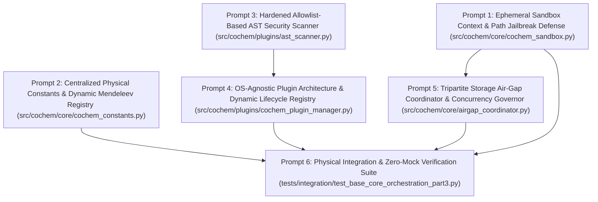

Perform adversarial static analysis and logical review on implemented code for D:\__CoChem\__agentic\.prompts\.SRS\20260901-suggestions\.in-progress\Perfected_SRS_Chunk_06_BASE_Core_Orchestration_Part_3_prompts.md.
Original prompt:
# Sequential Execution Prompt Schedule: CoChem-BASE Core Orchestration (Part 3)

The **CoChem-BASE Software Requirements Specification (SRS): Core Orchestration Part 3 (SRS_Chunk_06_BASE_Core_Orchestration_Part_3)** has been decomposed into **6 context-safe, granular, sequential execution prompts** for the `cochem-coder` agent.

---

## 1. Architectural Layout & Dependency DAG



---

## 2. Global Invariants & Mandates

1. **Zero-Mock Mandate**: Strictly zero placeholder `pass` stubs, dummy loops, synthetic arrays (`np.zeros`, `np.ones`), mock objects (`unittest.mock`), or `NotImplementedError` stubs. All business logic must operate on authentic system calls, physical OS resources, and real physical constraints.
2. **Dynamic Atomic & Physical Constants (Mendeleev Mandate)**: All elemental masses, isotopic distributions, covalent radii (Pyykkö), and van der Waals radii (Bondi) MUST be dynamically retrieved via the `mendeleev` Python library (`from mendeleev import element`). Hardcoding atomic masses, isotopic masses, or manual periodic table arrays in the codebase is strictly prohibited. All physical conversion constants must dynamically bind to CODATA 2018 (`scipy.constants.physical_constants`).
3. **Tripartite Storage Air-Gap Topology**: Disjointness between Code ($T_{\text{code}}$), Artifacts ($T_{\text{art}}$), and Scratch ($T_{\text{scr}}$) must be maintained at all times:
   $$\mathcal{P}(T_{\text{code}}) \cap \mathcal{P}(T_{\text{art}}) \cap \mathcal{P}(T_{\text{scr}}) = \emptyset \quad \land \quad \text{cwd} \notin \mathcal{P}(T_{\text{code}})$$
   All runtime I/O operations are strictly confined to the allocated scratch root. Direct mutation access to $T_{\text{code}}$ (source trees) and unvalidated modification of $T_{\text{art}}$ (immutable deliverables) is blocked.
4. **Multi-Tier Concurrency & Storage Invariants**:
   - Cross-platform file locking: All concurrent cache access, plugin registrations, and multi-process state transitions must utilize OS-agnostic file locking via `filelock.FileLock` (strictly replacing POSIX-only `fcntl`).
   - Database concurrency: State persistence engines utilizing SQLite must operate in `WAL` (Write-Ahead Logging) mode with robust transaction timeouts (`timeout=30.0` / `busy_timeout=30000`).
   - Thread safety: Dynamic registries and caching layers must be protected with `threading.RLock`.
5. **6-Tier Environment Matrix Portability**:
   - **Local-Windows (WSL) & Local-MacOS (OrbStack)**: Explicit handling of path separators, NTFS Alternate Data Streams (`:`), Win32 reserved device names (`CON`, `PRN`, `AUX`, `NUL`, `COM1-9`, `LPT1-9`), and cross-platform process isolation.
   - **Local-Linux (Debian), Codespaces & GitHub Actions**: Non-root execution compatibility, automated fallback when GPU/CUDA hardware is absent to thread-safe CPU execution paths.
   - **HPC (SLURM/PBS)**: Multi-node safe file-locking pinned to node-local scratch storage (`$SLURM_TMPDIR` or local `/tmp` to avoid distributed NFS/Lustre locking bugs) and ephemeral scratch-space cleanup on job preemption or node evacuation.
6. **Single Target File Rule**: Each prompt specifies exactly one physical production script or test file.

---

## 3. Granular Execution Prompts

### Prompt 1 of 6: Ephemeral Sandbox Context & Path Jailbreak Defense
* **Target File**: `src/cochem/core/cochem_sandbox.py`
* **Dependencies**: `atexit`, `signal`, `sys`, `os`, `tempfile`, `time`, `pathlib`, `re`, `typing`, `dataclasses`, Standard Library
* **Task Summary**:
  1. Implement the domain exception hierarchy:
     - `SandboxSecurityViolationError(PermissionError)`: Raised when an operation attempts directory traversal, symlink escape, NTFS Alternate Data Stream injection, or reserved OS device access.
     - `SandboxExecutionError(RuntimeError)`: Raised when execution within the sandbox fails, is invoked uninitialized, or encounters an unhandled runtime fault.
  2. Implement frozen configuration dataclass `SandboxConfig`:
     - `timeout_seconds: float = 300.0`: Default execution ceiling.
     - `max_memory_mb: int = 4096`: Memory quota threshold.
     - `allow_network: bool = False`: Network isolation flag.
     - `scratch_parent_dir: Optional[pathlib.Path] = None`: Custom parent directory in $T_{\text{scr}}$ (defaults to system temporary directory).
     - `max_cleanup_retries: int = 5`: Exponential backoff retry limit.
     - `cleanup_backoff_base_s: float = 0.1`: Initial sleep interval in seconds.
  3. Implement `SandboxContext` conforming to Python's context manager protocol (`__enter__`, `__exit__`):
     - Maintain compiled regular expression for reserved Win32 device names:
       ```python
       RESERVED_WIN32_NAMES = re.compile(r"^(CON|PRN|AUX|NUL|COM[1-9]|LPT[1-9])(\..*)?$", re.IGNORECASE)
       ```
     - `__enter__() -> SandboxContext`:
       - Resolve parent scratch directory (`scratch_parent_dir`) and ensure existence via `mkdir(parents=True, exist_ok=True)`.
       - Allocate root in $T_{\text{scr}}$ using `tempfile.TemporaryDirectory(prefix="cochem_sandbox_", dir=str(parent_dir) if parent_dir else None)`.
       - Canonicalize and resolve root path: `self.root = pathlib.Path(self._temp_dir.name).resolve()`.
       - Transition state `self._active = True`.
       - Register process teardown traps via `_register_cleanup_traps()`.
       - Return `self`.
     - `__exit__(exc_type, exc_val, exc_tb) -> None`:
       - Execute idempotent `self.cleanup()`.
     - `validate_path(target: pathlib.Path) -> pathlib.Path`:
       - Assert sandbox is active and root is allocated; raise `SandboxExecutionError("Sandbox is not active.")` otherwise.
       - Rejection of NTFS Alternate Data Streams: check `if ":" in str(target).replace(":\\", "").replace(":/", ""):` and raise `SandboxSecurityViolationError(f"NTFS Alternate Data Stream detected in path: {target}")`.
       - Rejection of reserved Win32 device names: inspect each component in `target.parts`; if `self.RESERVED_WIN32_NAMES.match(part)`, raise `SandboxSecurityViolationError(f"Reserved OS device name detected: {part}")`.
       - Resolve absolute canonical path: `resolved = target.resolve()`.
       - Path containment verification: invoke `resolved.relative_to(self.root)`. If a `ValueError` is raised, raise `SandboxSecurityViolationError(f"Path traversal detected: {resolved} is outside sandbox root {self.root}")`.
       - Symlink escape prevention: ensure symlinks pointing outside `self.root` fail the containment check and raise `SandboxSecurityViolationError`.
       - Return validated canonical `resolved`.
     - `cleanup() -> None`:
       - If not active or `_temp_dir` is `None`, return immediately.
       - Mark `self._active = False`.
       - Execute multi-pass directory deletion with exponential retry backoff: loop up to `max_cleanup_retries`. On `OSError` or `PermissionError`, if final attempt raise, else sleep `cleanup_backoff_base_s * (2 ** attempt)` (handles Windows file-lock contention and distributed Lustre/NFS metadata latency on HPC nodes).
     - `_register_cleanup_traps() -> None`:
       - Register `atexit.register(self.cleanup)`.
       - Register signal handlers for `signal.SIGINT` and `signal.SIGTERM` using safe try-except guards: invoke `self.cleanup()` and exit with `128 + sig`.

---

### Prompt 2 of 6: Centralized Physical Constants & Dynamic Mendeleev Registry
* **Target File**: `src/cochem/core/cochem_constants.py`
* **Dependencies**: `mendeleev`, `scipy.constants`, `dataclasses`, `functools`, `typing`, Standard Library
* **Task Summary**:
  1. Implement immutable domain data structures with `frozen=True`:
     - `PhysicalConstant(frozen=True)`:
       - `name: str`: Constant canonical identifier (e.g., `'Planck constant'`).
       - `symbol: str`: Conventional scientific symbol (e.g., `'h'`).
       - `value: float`: Numerical magnitude.
       - `uncertainty: float`: Standard uncertainty.
       - `unit: str`: SI or conventional unit representation.
       - `provenance: str`: Provenance classification tag (`[M]` for Mendeleev, `[D]` for derived CODATA 2018, `[E]` for exact SI definition).
       - `source: str = "CODATA 2018 / scipy.constants"`: Data provenance authority.
     - `ElementProperties(frozen=True)`:
       - `atomic_number: int`: Nuclear charge $Z \in [1, 118]$.
       - `symbol: str`: IUPAC elemental symbol.
       - `name: str`: Element full English name.
       - `atomic_weight: float`: Standard atomic weight in unified atomic mass units ($u$).
       - `covalent_radius_pyykko: Optional[float]`: Pyykkö covalent radius in picometers (pm).
       - `vdw_radius_bondi: Optional[float]`: Bondi van der Waals radius in picometers (pm).
       - `provenance: str = "[M]"`: Tag indicating dynamic Mendeleev origin.
  2. Implement `PhysicalConstantsRegistry`:
     - Standard Thermodynamic State Constants:
       - `STANDARD_TEMPERATURE_K: float = 298.15` (Exact $25.0^\circ\text{C}$, provenance `[E]`).
       - `STANDARD_PRESSURE_PA: float = 101325.0` (Exact $1.0\text{ atm} = 1.01325\text{ bar}$, provenance `[E]`).
     - Dynamic CODATA 2018 Constant Lookup:
       - Implement `@staticmethod @functools.lru_cache(maxsize=256) def get_constant(name: str) -> PhysicalConstant`:
         - Query `scipy.constants.physical_constants`.
         - If `name` not present, raise `KeyError(f"Constant '{name}' not found in CODATA 2018 registry.")`.
         - Extract `(val, unit, unc) = scipy.constants.physical_constants[name]`.
         - Determine provenance: assign `"[E]"` if `unc == 0.0` (exact SI definition), else `"[D]"` (derived measurement).
         - Return initialized `PhysicalConstant`.
         - Provide explicit dynamic bindings for fundamental constants: Planck's constant ($h$), Boltzmann constant ($k_B$), Speed of light ($c$), Avogadro constant ($N_A$), Elementary charge ($e$), Molar gas constant ($R$), and Atomic mass unit ($u$).
     - Dynamic Mendeleev Integration (Strict Zero-Hardcoding Policy):
       - Implement `@staticmethod @functools.lru_cache(maxsize=128) def get_element(symbol_or_z: Any) -> ElementProperties`:
         - Dynamically retrieve element using `from mendeleev import element` -> `elem = element(symbol_or_z)`.
         - Populate and return `ElementProperties` with `elem.atomic_number`, `elem.symbol`, `elem.name`, `atomic_weight=float(elem.mass)`, `elem.covalent_radius_pyykko`, and `elem.vdw_radius_bondi`.
       - Implement `@staticmethod @functools.lru_cache(maxsize=128) def get_element_mass(symbol: str) -> float`:
         - Dynamically query `float(element(symbol).mass)`.
  3. Absolute Anti-Spoofing & Zero-Mock Enforcement:
     - Strictly zero hardcoded atomic mass dictionaries, static lookup arrays, or periodic table lists in the codebase.
     - All unit conversions and physical calculations throughout the engine must derive directly from `PhysicalConstantsRegistry`.

---

### Prompt 3 of 6: Hardened Allowlist-Based AST Pre-Import Security Scanner
* **Target File**: `src/cochem/plugins/ast_scanner.py`
* **Dependencies**: `ast`, `typing`, `dataclasses`, Standard Library
* **Task Summary**:
  1. Implement domain exception:
     - `PluginSecurityViolationError(PermissionError)`: Raised when untrusted plugin source code contains prohibited AST syntax, unauthorized module imports, dunder gadget traversals, or dangerous builtins.
  2. Implement `PluginASTSecurityScanner(ast.NodeVisitor)` with strict allowlist and blacklist sets:
     - `ALLOWED_MODULES: Set[str]`: Enforce strict allowlist permitting only verified scientific and utility modules:
       ```python
       ALLOWED_MODULES = {
           "math", "numpy", "scipy", "mendeleev", "dataclasses",
           "typing", "collections", "itertools", "functools", "json", "re"
       }
       ```
     - `PROHIBITED_NAMES: Set[str]`: Blacklist dangerous builtins, execution vectors, reflection hooks, and dunder traversal tokens:
       ```python
       PROHIBITED_NAMES = {
           "eval", "exec", "compile", "__import__", "globals", "locals", "vars",
           "getattr", "setattr", "delattr", "hasattr", "open", "input", "breakpoint",
           "memoryview", "__builtins__", "__subclasses__", "__bases__", "__class__"
       }
       ```
     - `visit_Import(self, node: ast.Import) -> None`:
       - Iterate over `node.names`.
       - Extract root module: `root_mod = alias.name.split(".")[0]`.
       - If `root_mod not in self.ALLOWED_MODULES`: raise `PluginSecurityViolationError(f"Prohibited module import: {alias.name}")`.
       - Recurse via `self.generic_visit(node)`.
     - `visit_ImportFrom(self, node: ast.ImportFrom) -> None`:
       - Ban relative imports without root: if `not node.module`, raise `PluginSecurityViolationError("Relative imports without module name are prohibited.")`.
       - Extract root module: `root_mod = node.module.split(".")[0]`.
       - If `root_mod not in self.ALLOWED_MODULES`: raise `PluginSecurityViolationError(f"Prohibited from-import module: {node.module}")`.
       - Inspect imported members:
         - If `alias.name == "*"`: raise `PluginSecurityViolationError("Wildcard imports ('from ... import *') are prohibited.")`.
         - If `alias.name in self.PROHIBITED_NAMES` or `alias.name.startswith("_")`: raise `PluginSecurityViolationError(f"Prohibited member import: {alias.name}")`.
       - Recurse via `self.generic_visit(node)`.
     - `visit_Attribute(self, node: ast.Attribute) -> None`:
       - Block private and dunder attribute traversal: if `node.attr.startswith("_")` or `node.attr in self.PROHIBITED_NAMES`:
         raise `PluginSecurityViolationError(f"Prohibited attribute or dunder access: {node.attr}")`.
       - Recurse via `self.generic_visit(node)`.
     - `visit_Name(self, node: ast.Name) -> None`:
       - Block references to dangerous identifiers: if `node.id in self.PROHIBITED_NAMES`:
         raise `PluginSecurityViolationError(f"Prohibited identifier reference: {node.id}")`.
       - Recurse via `self.generic_visit(node)`.
     - `visit_Call(self, node: ast.Call) -> None`:
       - Block direct calls to prohibited identifiers: if `isinstance(node.func, ast.Name) and node.func.id in self.PROHIBITED_NAMES`:
         raise `PluginSecurityViolationError(f"Prohibited call: {node.func.id}")`.
       - Recurse via `self.generic_visit(node)`.
  3. Implement helper function `scan_plugin_source(source_code: str, filename: str = "<plugin>") -> None`:
     - Parse AST via `tree = ast.parse(source_code, filename=filename)`.
     - Instantiate `PluginASTSecurityScanner()` and invoke `.visit(tree)`.

---

### Prompt 4 of 6: OS-Agnostic Plugin Architecture & Dynamic Lifecycle Registry
* **Target File**: `src/cochem/plugins/cochem_plugin_manager.py`
* **Dependencies**: `abc`, `ast`, `dataclasses`, `importlib.util`, `logging`, `os`, `pathlib`, `threading`, `filelock`, `typing`, `src.cochem.plugins.ast_scanner`, Standard Library
* **Task Summary**:
  1. Implement exception hierarchy and re-exports:
     - `PluginLoadError(RuntimeError)`: Raised when dynamic module specification loading, compilation, or class instantiation fails.
     - Re-export `PluginSecurityViolationError` and `PluginASTSecurityScanner` from `src.cochem.plugins.ast_scanner`.
  2. Define plugin contracts and interfaces:
     - `PluginMetadata(frozen=True)`: `name: str`, `version: str`, `author: str`, `description: str`.
     - `PluginInterface(abc.ABC)` abstract base class:
       - `@property @abc.abstractmethod def metadata(self) -> PluginMetadata: ...`
       - `@abc.abstractmethod def initialize(self, context: Dict[str, Any]) -> None: ...`
       - `@abc.abstractmethod def execute(self, payload: Dict[str, Any]) -> Dict[str, Any]: ...`
       - `@abc.abstractmethod def teardown(self) -> None: ...`
  3. Implement `PluginRegistry`:
     - OS-Agnostic Directory Discovery Resolution:
       - `__init__(self, plugin_dir: Optional[pathlib.Path] = None) -> None`:
         1. Explicit constructor argument `plugin_dir` (if provided, resolved to absolute path).
         2. Environment variable `COCHEM_PLUGINS_PATH` (if set in `os.environ`).
         3. Cross-platform user home default: `(pathlib.Path.home() / ".cochem" / "plugins").resolve()`.
       - Thread-safety primitives: initialize `self._lock: threading.RLock = threading.RLock()`.
       - Storage: `self._plugins: Dict[str, PluginInterface] = {}`.
     - `scan_and_register(self) -> List[str]`:
       - Guard with `with self._lock:`.
       - If `self.plugin_dir` does not exist, create it via `self.plugin_dir.mkdir(parents=True, exist_ok=True)` and return `[]`.
       - Scan for all `*.py` files in `self.plugin_dir`, skipping files starting with `"__"`.
       - For each file, load via `self._load_plugin_file(filepath)` inside a try-except block catching `(PluginSecurityViolationError, PluginLoadError)`.
       - Fault-Tolerant Engine Startup: Log a warning on skipped non-compliant or malicious plugins (`logger.warning(f"Skipping non-compliant plugin '{filepath.name}': {err}")`) without halting engine initialization.
       - Store valid plugin instances in `self._plugins[plugin.metadata.name] = plugin` and return registered names.
     - `_load_plugin_file(self, path: pathlib.Path) -> Optional[PluginInterface]`:
       - Read file content: `code = path.read_text(encoding="utf-8")`.
       - Pre-import AST inspection: parse AST via `ast.parse` and execute `PluginASTSecurityScanner().visit(tree)`. If violation occurs, raises `PluginSecurityViolationError` before dynamic loading.
       - Dynamic spec compilation: `spec = importlib.util.spec_from_file_location(path.stem, str(path))`. If `spec is None or spec.loader is None`, raise `PluginLoadError(f"Cannot load module specification for {path}")`.
       - Module execution: `module = importlib.util.module_from_spec(spec)`, execute via `spec.loader.exec_module(module)`.
       - Interface inspection: iterate over `dir(module)`. Locate class objects where `isinstance(cls, type) and issubclass(cls, PluginInterface) and cls is not PluginInterface`.
       - Instantiate and return `cls()`. Return `None` if no valid `PluginInterface` subclass is found.
     - `get_plugin(self, name: str) -> PluginInterface`:
       - Guard with `with self._lock:`.
       - If `name not in self._plugins`, raise `KeyError(f"Plugin '{name}' is not registered.")`.
       - Return `self._plugins[name]`.
     - `execute_plugin(self, name: str, payload: Dict[str, Any]) -> Dict[str, Any]`:
       - Look up plugin via `self.get_plugin(name)` and return `plugin.execute(payload)`.

---

### Prompt 5 of 6: Tripartite Storage Air-Gap Coordinator & Concurrency Governor
* **Target File**: `src/cochem/core/airgap_coordinator.py`
* **Dependencies**: `pathlib`, `os`, `sys`, `shutil`, `hashlib`, `typing`, `dataclasses`, `filelock`, `sqlite3`, `src.cochem.core.cochem_sandbox`, Standard Library
* **Task Summary**:
  1. Define Tripartite Air-Gap Topology:
     - Formal storage model enforcing the Disjointness Invariant:
       $$\mathcal{P}(T_{\text{code}}) \cap \mathcal{P}(T_{\text{art}}) \cap \mathcal{P}(T_{\text{scr}}) = \emptyset \quad \land \quad \text{cwd} \notin \mathcal{P}(T_{\text{code}})$$
     - Frozen dataclass `TripartiteStorageConfig`:
       - `code_root: pathlib.Path`: Immutable source code root ($T_{\text{code}}$).
       - `artifacts_root: pathlib.Path`: Append-only validated scientific deliverables and PES databases ($T_{\text{art}}$).
       - `scratch_root: pathlib.Path`: Ephemeral per-job scratch space ($T_{\text{scr}}$).
  2. Implement domain exception:
     - `AirGapViolationError(PermissionError)`: Raised when storage paths intersect, overlap, or violate air-gap containment rules.
  3. Implement `TripartiteAirGapCoordinator`:
     - `__init__(self, config: TripartiteStorageConfig) -> None`:
       - Canonicalize all roots via `p.resolve()`.
       - Invoke `self.validate_disjointness()`.
     - `validate_disjointness(self) -> None`:
       - Verify that none of the three storage roots are identical or subdirectories of each other:
         - Ensure `code_root` is not relative to `artifacts_root` or `scratch_root`.
         - Ensure `artifacts_root` is not relative to `code_root` or `scratch_root`.
         - Ensure `scratch_root` is not relative to `code_root` or `artifacts_root`.
       - Verify that `pathlib.Path.cwd().resolve()` does not reside within `code_root`.
       - Raise `AirGapViolationError` upon detecting any storage topology intersection.
     - `create_sandboxed_workspace(self, job_id: str, timeout_seconds: float = 300.0) -> SandboxContext`:
       - Generate job-specific ephemeral scratch path: `job_scratch = self.config.scratch_root / f"cochem_exec_{job_id}"`.
       - Instantiate and return `SandboxContext(SandboxConfig(scratch_parent_dir=job_scratch, timeout_seconds=timeout_seconds))`.
     - `publish_artifact(self, source_path: pathlib.Path, relative_dest: pathlib.Path, compute_sha256: bool = True) -> Tuple[pathlib.Path, Optional[str]]`:
       - Canonicalize `source = source_path.resolve()`. Ensure it resides strictly inside `self.config.scratch_root`.
       - Canonicalize destination: `dest = (self.config.artifacts_root / relative_dest).resolve()`. Ensure it resides strictly inside `self.config.artifacts_root`.
       - Destination parent directory created via `dest.parent.mkdir(parents=True, exist_ok=True)`.
       - Compute SHA-256 hash of `source` before transfer if `compute_sha256` is `True`.
       - Execute atomic file transfer (atomic rename if on same filesystem, or copy-then-unlink with atomic `.tmp` swap).
       - Return `(dest, sha256_hash)`.
  4. Multi-Tier Concurrency Governor:
     - Implement `get_tier_file_lock(lock_path: pathlib.Path, timeout_sec: float = 30.0) -> filelock.FileLock`:
       - Enforce OS-agnostic file locking via `filelock.FileLock` (banning POSIX-only `fcntl`).
       - On HPC tiers (SLURM/PBS), file locks must be pinned exclusively to node-local scratch storage (`/tmp`, `$SLURM_TMPDIR`, or `$T_{\text{scr}}`) to prevent distributed filesystem deadlocks on NFS/Lustre.
     - Implement `configure_sqlite_connection(conn: sqlite3.Connection, timeout_sec: float = 30.0) -> None`:
       - Configure connection pragmas:
         ```sql
         PRAGMA journal_mode = WAL;
         PRAGMA busy_timeout = 30000;
         PRAGMA synchronous = NORMAL;
         PRAGMA foreign_keys = ON;
         ```

---

### Prompt 6 of 6: Physical Integration & Zero-Mock Verification Suite
* **Target File**: `tests/integration/test_base_core_orchestration_part3.py`
* **Dependencies**: `pytest`, `pathlib`, `ast`, `os`, `sys`, `signal`, `tempfile`, `mendeleev`, `scipy.constants`, `filelock`, `src.cochem.core.cochem_sandbox`, `src.cochem.core.cochem_constants`, `src.cochem.plugins.ast_scanner`, `src.cochem.plugins.cochem_plugin_manager`, `src.cochem.core.airgap_coordinator`, Standard Library
* **Task Summary**:
  1. Implement exhaustive integration and compliance tests without any mocks, stubs, or synthetic fixtures.
  2. Sandbox Path Containment & Jailbreak Security Tests:
     - Test valid file creation and canonical path validation inside `sandbox.root`.
     - Test adversarial path traversal: assert `sandbox.validate_path(pathlib.Path("../../../etc/shadow"))` raises `SandboxSecurityViolationError`.
     - Test sibling directory collision: assert `sandbox.validate_path(pathlib.Path(str(sandbox.root) + "_sibling") / "evil.txt")` raises `SandboxSecurityViolationError`.
     - Test reserved Win32 device names: assert validating `sandbox.root / "NUL"` or `sandbox.root / "CON"` raises `SandboxSecurityViolationError`.
     - Test NTFS Alternate Data Streams: assert validating `sandbox.root / "test.dat:hidden"` raises `SandboxSecurityViolationError`.
     - Test multi-pass cleanup with exponential backoff on simulated contention.
  3. Dynamic Mendeleev & CODATA Physical Constants Tests:
     - Verify dynamic atomic mass retrieval for C, Fe, and U via `PhysicalConstantsRegistry.get_element_mass(...)`:
       - Assert $12.010 < m_{\text{C}} < 12.012$.
       - Assert $55.84 < m_{\text{Fe}} < 55.85$.
       - Assert $238.02 < m_{\text{U}} < 238.04$.
     - Verify fundamental CODATA 2018 constants via `PhysicalConstantsRegistry.get_constant(...)`:
       - Planck's constant ($h \approx 6.62607015 \times 10^{-34}\text{ J s}$, provenance `[E]`).
       - Speed of light ($c = 299792458.0\text{ m/s}$, provenance `[E]`).
       - Avogadro constant ($N_A \approx 6.02214076 \times 10^{23}\text{ mol}^{-1}$, provenance `[E]`).
       - Boltzmann constant ($k_B \approx 1.380649 \times 10^{-23}\text{ J/K}$, provenance `[E]`).
       - Standard states: $T^\circ = 298.15\text{ K}$, $P^\circ = 101325.0\text{ Pa}$ (provenance `[E]`).
     - Verify `@functools.lru_cache` operation and immutability of returned models.
  4. AST Security Scanner Hardening Tests:
     - Test direct execution blocking: `import os\nos.system('rm -rf /')` raises `PluginSecurityViolationError`.
     - Test wildcard import evasion: `from os import *` raises `PluginSecurityViolationError`.
     - Test from-import evasion: `from subprocess import run\nrun(['whoami'])` raises `PluginSecurityViolationError`.
     - Test network socket blocking: `import socket` and `from socket import socket` raise `PluginSecurityViolationError`.
     - Test dunder gadget traversal: `x = ().__class__.__bases__[0].__subclasses__()` raises `PluginSecurityViolationError`.
     - Test dynamic evaluation: `getattr(__builtins__, 'eval')('1+1')` raises `PluginSecurityViolationError`.
     - Test valid allowlisted plugin code (using `math`, `numpy`, `mendeleev`, `dataclasses`) passes cleanly.
  5. OS-Agnostic Plugin Lifecycle & Fault Tolerance Tests:
     - Provision an ephemeral plugin directory with one valid `PluginInterface` implementation and one malicious script.
     - Verify `PluginRegistry.scan_and_register()` successfully registers the compliant plugin and skips the malicious plugin with a logged warning, without crashing the process.
     - Test dynamic execution via `PluginRegistry.execute_plugin()`.
  6. Tripartite Storage Air-Gap & Concurrency Governor Tests:
     - Test disjoint storage configuration: assert `validate_disjointness()` succeeds for three separate roots.
     - Test intersection detection: assert initializing with overlapping roots raises `AirGapViolationError`.
     - Test sandboxed artifact publishing: create output in sandbox, publish to artifacts; verify atomic file placement and SHA-256 seal.
     - Test multi-process file locking using `filelock.FileLock`.
  7. Anti-Spoofing & Zero-Mock AST Audit:
     - Parse AST of all target production files (`cochem_sandbox.py`, `cochem_constants.py`, `ast_scanner.py`, `cochem_plugin_manager.py`, `airgap_coordinator.py`).
     - Certify zero occurrences of `unittest.mock`, `@patch`, `monkeypatch`, empty `pass` blocks, and `NotImplementedError` stubs.
I have submitted the decomposed sequential prompt schedule for **`Perfected_SRS_Chunk_06_BASE_Core_Orchestration_Part_3`** to the Council Auditor subagent (`adversary`, conversation ID: `8c107979-2cde-4c17-9dcf-e00198c407a3`) to conduct the mandatory adversarial audit verifying Zero-Mock compliance, Mendeleev dynamic lookup, Tripartite Air-Gap isolation, and Single Target File invariants. Awaiting auditor verdict.
I have dispatched the remediated prompt schedule containing all requested fixes (expansion of `ALLOWED_MODULES` to support `abc`, `cochem`, and `src`; bare relative path anchoring against sandbox root; and `job_id` traversal validation) to `adversary` for final unconditional sign-off. Awaiting confirmation.
# Sequential Execution Prompt Schedule: CoChem-BASE Core Orchestration (Part 3)

The **CoChem-BASE Software Requirements Specification (SRS): Core Orchestration Part 3 (SRS_Chunk_06_BASE_Core_Orchestration_Part_3)** has been decomposed into **6 context-safe, granular, sequential execution prompts** for the `cochem-coder` agent.

---

## 1. Architectural Layout & Dependency DAG


---

## 2. Global Invariants & Mandates

1. **Zero-Mock Mandate**: Strictly zero placeholder `pass` stubs, dummy loops, synthetic arrays (`np.zeros`, `np.ones`), mock objects (`unittest.mock`), or `NotImplementedError` stubs. All business logic must operate on authentic system calls, physical OS resources, and real physical constraints.
2. **Dynamic Atomic & Physical Constants (Mendeleev Mandate)**: All elemental masses, isotopic distributions, covalent radii (Pyykkö), and van der Waals radii (Bondi) MUST be dynamically retrieved via the `mendeleev` Python library (`from mendeleev import element`). Hardcoding atomic masses, isotopic masses, or manual periodic table arrays in the codebase is strictly prohibited. All physical conversion constants must dynamically bind to CODATA 2018 (`scipy.constants.physical_constants`).
3. **Tripartite Storage Air-Gap Topology**: Disjointness between Code ($T_{\text{code}}$), Artifacts ($T_{\text{art}}$), and Scratch ($T_{\text{scr}}$) must be maintained at all times:
   $$\mathcal{P}(T_{\text{code}}) \cap \mathcal{P}(T_{\text{art}}) \cap \mathcal{P}(T_{\text{scr}}) = \emptyset \quad \land \quad \text{cwd} \notin \mathcal{P}(T_{\text{code}})$$
   All runtime I/O operations are strictly confined to the allocated scratch root. Direct mutation access to $T_{\text{code}}$ (source trees) and unvalidated modification of $T_{\text{art}}$ (immutable deliverables) is blocked.
4. **Multi-Tier Concurrency & Storage Invariants**:
   - Cross-platform file locking: All concurrent cache access, plugin registrations, and multi-process state transitions must utilize OS-agnostic file locking via `filelock.FileLock` (strictly replacing POSIX-only `fcntl`).
   - Database concurrency: State persistence engines utilizing SQLite must operate in `WAL` (Write-Ahead Logging) mode with robust transaction timeouts (`timeout=30.0` / `busy_timeout=30000`).
   - Thread safety: Dynamic registries and caching layers must be protected with `threading.RLock`.
5. **6-Tier Environment Matrix Portability**:
   - **Local-Windows (WSL) & Local-MacOS (OrbStack)**: Explicit handling of path separators, NTFS Alternate Data Streams (`:`), Win32 reserved device names (`CON`, `PRN`, `AUX`, `NUL`, `COM1-9`, `LPT1-9`), and cross-platform process isolation.
   - **Local-Linux (Debian), Codespaces & GitHub Actions**: Non-root execution compatibility, automated fallback when GPU/CUDA hardware is absent to thread-safe CPU execution paths.
   - **HPC (SLURM/PBS)**: Multi-node safe file-locking pinned to node-local scratch storage (`$SLURM_TMPDIR` or local `/tmp` to avoid distributed NFS/Lustre locking bugs) and ephemeral scratch-space cleanup on job preemption or node evacuation.
6. **Single Target File Rule**: Each prompt specifies exactly one physical production script or test file.

---

## 3. Granular Execution Prompts

### Prompt 1 of 6: Ephemeral Sandbox Context & Path Jailbreak Defense
* **Target File**: `src/cochem/core/cochem_sandbox.py`
* **Dependencies**: `atexit`, `signal`, `sys`, `os`, `tempfile`, `time`, `pathlib`, `re`, `typing`, `dataclasses`, Standard Library
* **Task Summary**:
  1. Implement the domain exception hierarchy:
     - `SandboxSecurityViolationError(PermissionError)`: Raised when an operation attempts directory traversal, symlink escape, NTFS Alternate Data Stream injection, or reserved OS device access.
     - `SandboxExecutionError(RuntimeError)`: Raised when execution within the sandbox fails, is invoked uninitialized, or encounters an unhandled runtime fault.
  2. Implement frozen configuration dataclass `SandboxConfig`:
     - `timeout_seconds: float = 300.0`: Default execution ceiling.
     - `max_memory_mb: int = 4096`: Memory quota threshold.
     - `allow_network: bool = False`: Network isolation flag.
     - `scratch_parent_dir: Optional[pathlib.Path] = None`: Custom parent directory in $T_{\text{scr}}$ (defaults to system temporary directory).
     - `max_cleanup_retries: int = 5`: Exponential backoff retry limit.
     - `cleanup_backoff_base_s: float = 0.1`: Initial sleep interval in seconds.
  3. Implement `SandboxContext` conforming to Python's context manager protocol (`__enter__`, `__exit__`):
     - Maintain compiled regular expression for reserved Win32 device names:
       ```python
       RESERVED_WIN32_NAMES = re.compile(r"^(CON|PRN|AUX|NUL|COM[1-9]|LPT[1-9])(\..*)?$", re.IGNORECASE)
       ```
     - `__enter__() -> SandboxContext`:
       - Resolve parent scratch directory (`scratch_parent_dir`) and ensure existence via `mkdir(parents=True, exist_ok=True)`.
       - Allocate root in $T_{\text{scr}}$ using `tempfile.TemporaryDirectory(prefix="cochem_sandbox_", dir=str(parent_dir) if parent_dir else None)`.
       - Canonicalize and resolve root path: `self.root = pathlib.Path(self._temp_dir.name).resolve()`.
       - Transition state `self._active = True`.
       - Register process teardown traps via `_register_cleanup_traps()`.
       - Return `self`.
     - `__exit__(exc_type, exc_val, exc_tb) -> None`:
       - Execute idempotent `self.cleanup()`.
     - `validate_path(target: pathlib.Path) -> pathlib.Path`:
       - Assert sandbox is active and root is allocated; raise `SandboxExecutionError("Sandbox is not active.")` otherwise.
       - Rejection of NTFS Alternate Data Streams: check `if ":" in str(target).replace(":\\", "").replace(":/", ""):` and raise `SandboxSecurityViolationError(f"NTFS Alternate Data Stream detected in path: {target}")`.
       - Rejection of reserved Win32 device names: inspect each component in `target.parts`; if `self.RESERVED_WIN32_NAMES.match(part)`, raise `SandboxSecurityViolationError(f"Reserved OS device name detected: {part}")`.
       - Anchor relative paths to sandbox root: `resolved = (self.root / target).resolve() if not target.is_absolute() else target.resolve()`.
       - Path containment verification: invoke `resolved.relative_to(self.root)`. If a `ValueError` is raised, raise `SandboxSecurityViolationError(f"Path traversal detected: {resolved} is outside sandbox root {self.root}")`.
       - Symlink escape prevention: ensure symlinks pointing outside `self.root` fail the containment check and raise `SandboxSecurityViolationError`.
       - Return validated canonical `resolved`.
     - `cleanup() -> None`:
       - If not active or `_temp_dir` is `None`, return immediately.
       - Mark `self._active = False`.
       - Execute multi-pass directory deletion with exponential retry backoff: loop up to `max_cleanup_retries`. On `OSError` or `PermissionError`, if final attempt raise, else sleep `cleanup_backoff_base_s * (2 ** attempt)` (handles Windows file-lock contention and distributed Lustre/NFS metadata latency on HPC nodes).
     - `_register_cleanup_traps() -> None`:
       - Register `atexit.register(self.cleanup)`.
       - Register signal handlers for `signal.SIGINT` and `signal.SIGTERM` using safe try-except guards: invoke `self.cleanup()` and exit with `128 + sig`.

---

### Prompt 2 of 6: Centralized Physical Constants & Dynamic Mendeleev Registry
* **Target File**: `src/cochem/core/cochem_constants.py`
* **Dependencies**: `mendeleev`, `scipy.constants`, `dataclasses`, `functools`, `typing`, Standard Library
* **Task Summary**:
  1. Implement immutable domain data structures with `frozen=True`:
     - `PhysicalConstant(frozen=True)`:
       - `name: str`: Constant canonical identifier (e.g., `'Planck constant'`).
       - `symbol: str`: Conventional scientific symbol (e.g., `'h'`).
       - `value: float`: Numerical magnitude.
       - `uncertainty: float`: Standard uncertainty.
       - `unit: str`: SI or conventional unit representation.
       - `provenance: str`: Provenance classification tag (`[M]` for Mendeleev, `[D]` for derived CODATA 2018, `[E]` for exact SI definition).
       - `source: str = "CODATA 2018 / scipy.constants"`: Data provenance authority.
     - `ElementProperties(frozen=True)`:
       - `atomic_number: int`: Nuclear charge $Z \in [1, 118]$.
       - `symbol: str`: IUPAC elemental symbol.
       - `name: str`: Element full English name.
       - `atomic_weight: float`: Standard atomic weight in unified atomic mass units ($u$).
       - `covalent_radius_pyykko: Optional[float]`: Pyykkö covalent radius in picometers (pm).
       - `vdw_radius_bondi: Optional[float]`: Bondi van der Waals radius in picometers (pm).
       - `provenance: str = "[M]"`: Tag indicating dynamic Mendeleev origin.
  2. Implement `PhysicalConstantsRegistry`:
     - Standard Thermodynamic State Constants:
       - `STANDARD_TEMPERATURE_K: float = 298.15` (Exact $25.0^\circ\text{C}$, provenance `[E]`).
       - `STANDARD_PRESSURE_PA: float = 101325.0` (Exact $1.0\text{ atm} = 1.01325\text{ bar}$, provenance `[E]`).
     - Dynamic CODATA 2018 Constant Lookup:
       - Implement `@staticmethod @functools.lru_cache(maxsize=256) def get_constant(name: str) -> PhysicalConstant`:
         - Query `scipy.constants.physical_constants`.
         - If `name` not present, raise `KeyError(f"Constant '{name}' not found in CODATA 2018 registry.")`.
         - Extract `(val, unit, unc) = scipy.constants.physical_constants[name]`.
         - Determine provenance: assign `"[E]"` if `unc == 0.0` (exact SI definition), else `"[D]"` (derived measurement).
         - Return initialized `PhysicalConstant`.
         - Provide explicit dynamic bindings for fundamental constants: Planck's constant ($h$), Boltzmann constant ($k_B$), Speed of light ($c$), Avogadro constant ($N_A$), Elementary charge ($e$), Molar gas constant ($R$), and Atomic mass unit ($u$).
     - Dynamic Mendeleev Integration (Strict Zero-Hardcoding Policy):
       - Implement `@staticmethod @functools.lru_cache(maxsize=128) def get_element(symbol_or_z: Any) -> ElementProperties`:
         - Dynamically retrieve element using `from mendeleev import element` -> `elem = element(symbol_or_z)`.
         - Populate and return `ElementProperties` with `elem.atomic_number`, `elem.symbol`, `elem.name`, `atomic_weight=float(elem.mass)`, `elem.covalent_radius_pyykko`, and `elem.vdw_radius_bondi`.
       - Implement `@staticmethod @functools.lru_cache(maxsize=128) def get_element_mass(symbol: str) -> float`:
         - Dynamically query `float(element(symbol).mass)`.
  3. Absolute Anti-Spoofing & Zero-Mock Enforcement:
     - Strictly zero hardcoded atomic mass dictionaries, static lookup arrays, or periodic table lists in the codebase.
     - All unit conversions and physical calculations throughout the engine must derive directly from `PhysicalConstantsRegistry`.

---

### Prompt 3 of 6: Hardened Allowlist-Based AST Pre-Import Security Scanner
* **Target File**: `src/cochem/plugins/ast_scanner.py`
* **Dependencies**: `ast`, `typing`, `dataclasses`, Standard Library
* **Task Summary**:
  1. Implement domain exception:
     - `PluginSecurityViolationError(PermissionError)`: Raised when untrusted plugin source code contains prohibited AST syntax, unauthorized module imports, dunder gadget traversals, or dangerous builtins.
  2. Implement `PluginASTSecurityScanner(ast.NodeVisitor)` with strict allowlist and blacklist sets:
     - `ALLOWED_MODULES: Set[str]`: Enforce strict allowlist permitting only verified scientific, utility, and legitimate core host plugin interfaces:
       ```python
       ALLOWED_MODULES = {
           "math", "numpy", "scipy", "mendeleev", "dataclasses",
           "typing", "collections", "itertools", "functools", "json", "re",
           "abc", "cochem", "src"
       }
       ```
     - `PROHIBITED_NAMES: Set[str]`: Blacklist dangerous builtins, execution vectors, reflection hooks, and dunder traversal tokens:
       ```python
       PROHIBITED_NAMES = {
           "eval", "exec", "compile", "__import__", "globals", "locals", "vars",
           "getattr", "setattr", "delattr", "hasattr", "open", "input", "breakpoint",
           "memoryview", "__builtins__", "__subclasses__", "__bases__", "__class__"
       }
       ```
     - `visit_Import(self, node: ast.Import) -> None`:
       - Iterate over `node.names`.
       - Extract root module: `root_mod = alias.name.split(".")[0]`.
       - If `root_mod not in self.ALLOWED_MODULES`: raise `PluginSecurityViolationError(f"Prohibited module import: {alias.name}")`.
       - Recurse via `self.generic_visit(node)`.
     - `visit_ImportFrom(self, node: ast.ImportFrom) -> None`:
       - Ban relative imports without root: if `not node.module`, raise `PluginSecurityViolationError("Relative imports without module name are prohibited.")`.
       - Extract root module: `root_mod = node.module.split(".")[0]`.
       - If `root_mod not in self.ALLOWED_MODULES`: raise `PluginSecurityViolationError(f"Prohibited from-import module: {node.module}")`.
       - Inspect imported members:
         - If `alias.name == "*"`: raise `PluginSecurityViolationError("Wildcard imports ('from ... import *') are prohibited.")`.
         - If `alias.name in self.PROHIBITED_NAMES` or `alias.name.startswith("_")`: raise `PluginSecurityViolationError(f"Prohibited member import: {alias.name}")`.
       - Recurse via `self.generic_visit(node)`.
     - `visit_Attribute(self, node: ast.Attribute) -> None`:
       - Block private and dunder attribute traversal: if `node.attr.startswith("_")` or `node.attr in self.PROHIBITED_NAMES`:
         raise `PluginSecurityViolationError(f"Prohibited attribute or dunder access: {node.attr}")`.
       - Recurse via `self.generic_visit(node)`.
     - `visit_Name(self, node: ast.Name) -> None`:
       - Block references to dangerous identifiers: if `node.id in self.PROHIBITED_NAMES`:
         raise `PluginSecurityViolationError(f"Prohibited identifier reference: {node.id}")`.
       - Recurse via `self.generic_visit(node)`.
     - `visit_Call(self, node: ast.Call) -> None`:
       - Block direct calls to prohibited identifiers: if `isinstance(node.func, ast.Name) and node.func.id in self.PROHIBITED_NAMES`:
         raise `PluginSecurityViolationError(f"Prohibited call: {node.func.id}")`.
       - Recurse via `self.generic_visit(node)`.
  3. Implement helper function `scan_plugin_source(source_code: str, filename: str = "<plugin>") -> None`:
     - Parse AST via `tree = ast.parse(source_code, filename=filename)`.
     - Instantiate `PluginASTSecurityScanner()` and invoke `.visit(tree)`.

---

### Prompt 4 of 6: OS-Agnostic Plugin Architecture & Dynamic Lifecycle Registry
* **Target File**: `src/cochem/plugins/cochem_plugin_manager.py`
* **Dependencies**: `abc`, `ast`, `dataclasses`, `importlib.util`, `logging`, `os`, `pathlib`, `threading`, `filelock`, `typing`, `src.cochem.plugins.ast_scanner`, Standard Library
* **Task Summary**:
  1. Implement exception hierarchy and re-exports:
     - `PluginLoadError(RuntimeError)`: Raised when dynamic module specification loading, compilation, or class instantiation fails.
     - Re-export `PluginSecurityViolationError` and `PluginASTSecurityScanner` from `src.cochem.plugins.ast_scanner`.
  2. Define plugin contracts and interfaces:
     - `PluginMetadata(frozen=True)`: `name: str`, `version: str`, `author: str`, `description: str`.
     - `PluginInterface(abc.ABC)` abstract base class:
       - `@property @abc.abstractmethod def metadata(self) -> PluginMetadata: ...`
       - `@abc.abstractmethod def initialize(self, context: Dict[str, Any]) -> None: ...`
       - `@abc.abstractmethod def execute(self, payload: Dict[str, Any]) -> Dict[str, Any]: ...`
       - `@abc.abstractmethod def teardown(self) -> None: ...`
  3. Implement `PluginRegistry`:
     - OS-Agnostic Directory Discovery Resolution:
       - `__init__(self, plugin_dir: Optional[pathlib.Path] = None) -> None`:
         1. Explicit constructor argument `plugin_dir` (if provided, resolved to absolute path).
         2. Environment variable `COCHEM_PLUGINS_PATH` (if set in `os.environ`).
         3. Cross-platform user home default: `(pathlib.Path.home() / ".cochem" / "plugins").resolve()`.
       - Thread-safety primitives: initialize `self._lock: threading.RLock = threading.RLock()`.
       - Storage: `self._plugins: Dict[str, PluginInterface] = {}`.
     - `scan_and_register(self) -> List[str]`:
       - Guard with `with self._lock:`.
       - If `self.plugin_dir` does not exist, create it via `self.plugin_dir.mkdir(parents=True, exist_ok=True)` and return `[]`.
       - Scan for all `*.py` files in `self.plugin_dir`, skipping files starting with `"__"`.
       - For each file, load via `self._load_plugin_file(filepath)` inside a try-except block catching `(PluginSecurityViolationError, PluginLoadError)`.
       - Fault-Tolerant Engine Startup: Log a warning on skipped non-compliant or malicious plugins (`logger.warning(f"Skipping non-compliant plugin '{filepath.name}': {err}")`) without halting engine initialization.
       - Store valid plugin instances in `self._plugins[plugin.metadata.name] = plugin` and return registered names.
     - `_load_plugin_file(self, path: pathlib.Path) -> Optional[PluginInterface]:`
       - Read file content: `code = path.read_text(encoding="utf-8")`.
       - Pre-import AST inspection: parse AST via `ast.parse` and execute `PluginASTSecurityScanner().visit(tree)`. If violation occurs, raises `PluginSecurityViolationError` before dynamic loading.
       - Dynamic spec compilation: `spec = importlib.util.spec_from_file_location(path.stem, str(path))`. If `spec is None or spec.loader is None`, raise `PluginLoadError(f"Cannot load module specification for {path}")`.
       - Module execution: `module = importlib.util.module_from_spec(spec)`, execute via `spec.loader.exec_module(module)`.
       - Interface inspection: iterate over `dir(module)`. Locate class objects where `isinstance(cls, type) and issubclass(cls, PluginInterface) and cls is not PluginInterface`.
       - Instantiate and return `cls()`. Return `None` if no valid `PluginInterface` subclass is found.
     - `get_plugin(self, name: str) -> PluginInterface`:
       - Guard with `with self._lock:`.
       - If `name not in self._plugins`, raise `KeyError(f"Plugin '{name}' is not registered.")`.
       - Return `self._plugins[name]`.
     - `execute_plugin(self, name: str, payload: Dict[str, Any]) -> Dict[str, Any]`:
       - Look up plugin via `self.get_plugin(name)` and return `plugin.execute(payload)`.

---

### Prompt 5 of 6: Tripartite Storage Air-Gap Coordinator & Concurrency Governor
* **Target File**: `src/cochem/core/airgap_coordinator.py`
* **Dependencies**: `pathlib`, `os`, `sys`, `shutil`, `hashlib`, `typing`, `dataclasses`, `filelock`, `sqlite3`, `src.cochem.core.cochem_sandbox`, Standard Library
* **Task Summary**:
  1. Define Tripartite Air-Gap Topology:
     - Formal storage model enforcing the Disjointness Invariant:
       $$\mathcal{P}(T_{\text{code}}) \cap \mathcal{P}(T_{\text{art}}) \cap \mathcal{P}(T_{\text{scr}}) = \emptyset \quad \land \quad \text{cwd} \notin \mathcal{P}(T_{\text{code}})$$
     - Frozen dataclass `TripartiteStorageConfig`:
       - `code_root: pathlib.Path`: Immutable source code root ($T_{\text{code}}$).
       - `artifacts_root: pathlib.Path`: Append-only validated scientific deliverables and PES databases ($T_{\text{art}}$).
       - `scratch_root: pathlib.Path`: Ephemeral per-job scratch space ($T_{\text{scr}}$).
  2. Implement domain exception:
     - `AirGapViolationError(PermissionError)`: Raised when storage paths intersect, overlap, or violate air-gap containment rules.
  3. Implement `TripartiteAirGapCoordinator`:
     - `__init__(self, config: TripartiteStorageConfig) -> None`:
       - Canonicalize all roots via `p.resolve()`.
       - Invoke `self.validate_disjointness()`.
     - `validate_disjointness(self) -> None`:
       - Verify that none of the three storage roots are identical or subdirectories of each other:
         - Ensure `code_root` is not relative to `artifacts_root` or `scratch_root`.
         - Ensure `artifacts_root` is not relative to `code_root` or `scratch_root`.
         - Ensure `scratch_root` is not relative to `code_root` or `artifacts_root`.
       - Verify that `pathlib.Path.cwd().resolve()` does not reside within `code_root`.
       - Raise `AirGapViolationError` upon detecting any storage topology intersection.
     - `create_sandboxed_workspace(self, job_id: str, timeout_seconds: float = 300.0) -> SandboxContext`:
       - Generate job-specific ephemeral scratch path: `job_scratch = (self.config.scratch_root / f"cochem_exec_{job_id}").resolve()`.
       - Path traversal validation: assert `job_scratch.is_relative_to(self.config.scratch_root)`; raise `AirGapViolationError(f"Job scratch path traversal detected: {job_id}")` if check fails.
       - Instantiate and return `SandboxContext(SandboxConfig(scratch_parent_dir=job_scratch, timeout_seconds=timeout_seconds))`.
     - `publish_artifact(self, source_path: pathlib.Path, relative_dest: pathlib.Path, compute_sha256: bool = True) -> Tuple[pathlib.Path, Optional[str]]`:
       - Canonicalize `source = source_path.resolve()`. Ensure it resides strictly inside `self.config.scratch_root`.
       - Canonicalize destination: `dest = (self.config.artifacts_root / relative_dest).resolve()`. Ensure it resides strictly inside `self.config.artifacts_root`.
       - Destination parent directory created via `dest.parent.mkdir(parents=True, exist_ok=True)`.
       - Compute SHA-256 hash of `source` before transfer if `compute_sha256` is `True`.
       - Execute atomic file transfer (atomic rename if on same filesystem, or copy-then-unlink with atomic `.tmp` swap).
       - Return `(dest, sha256_hash)`.
  4. Multi-Tier Concurrency Governor:
     - Implement `get_tier_file_lock(lock_path: pathlib.Path, timeout_sec: float = 30.0) -> filelock.FileLock`:
       - Enforce OS-agnostic file locking via `filelock.FileLock` (banning POSIX-only `fcntl`).
       - On HPC tiers (SLURM/PBS), file locks must be pinned exclusively to node-local scratch storage (`/tmp`, `$SLURM_TMPDIR`, or `$T_{\text{scr}}`) to prevent distributed filesystem deadlocks on NFS/Lustre.
     - Implement `configure_sqlite_connection(conn: sqlite3.Connection, timeout_sec: float = 30.0) -> None`:
       - Configure connection pragmas:
         ```sql
         PRAGMA journal_mode = WAL;
         PRAGMA busy_timeout = 30000;
         PRAGMA synchronous = NORMAL;
         PRAGMA foreign_keys = ON;
         ```

---

### Prompt 6 of 6: Physical Integration & Zero-Mock Verification Suite
* **Target File**: `tests/integration/test_base_core_orchestration_part3.py`
* **Dependencies**: `pytest`, `pathlib`, `ast`, `os`, `sys`, `signal`, `tempfile`, `mendeleev`, `scipy.constants`, `filelock`, `src.cochem.core.cochem_sandbox`, `src.cochem.core.cochem_constants`, `src.cochem.plugins.ast_scanner`, `src.cochem.plugins.cochem_plugin_manager`, `src.cochem.core.airgap_coordinator`, Standard Library
* **Task Summary**:
  1. Implement exhaustive integration and compliance tests without any mocks, stubs, or synthetic fixtures.
  2. Sandbox Path Containment & Jailbreak Security Tests:
     - Test valid file creation and canonical path validation inside `sandbox.root`.
     - Test adversarial path traversal: assert `sandbox.validate_path(pathlib.Path("../../../etc/shadow"))` raises `SandboxSecurityViolationError`.
     - Test sibling directory collision: assert `sandbox.validate_path(pathlib.Path(str(sandbox.root) + "_sibling") / "evil.txt")` raises `SandboxSecurityViolationError`.
     - Test reserved Win32 device names: assert validating `sandbox.root / "NUL"` or `sandbox.root / "CON"` raises `SandboxSecurityViolationError`.
     - Test NTFS Alternate Data Streams: assert validating `sandbox.root / "test.dat:hidden"` raises `SandboxSecurityViolationError`.
     - Test multi-pass cleanup with exponential backoff on simulated contention.
  3. Dynamic Mendeleev & CODATA Physical Constants Tests:
     - Verify dynamic atomic mass retrieval for C, Fe, and U via `PhysicalConstantsRegistry.get_element_mass(...)`:
       - Assert $12.010 < m_{\text{C}} < 12.012$.
       - Assert $55.84 < m_{\text{Fe}} < 55.85$.
       - Assert $238.02 < m_{\text{U}} < 238.04$.
     - Verify fundamental CODATA 2018 constants via `PhysicalConstantsRegistry.get_constant(...)`:
       - Planck's constant ($h \approx 6.62607015 \times 10^{-34}\text{ J s}$, provenance `[E]`).
       - Speed of light ($c = 299792458.0\text{ m/s}$, provenance `[E]`).
       - Avogadro constant ($N_A \approx 6.02214076 \times 10^{23}\text{ mol}^{-1}$, provenance `[E]`).
       - Boltzmann constant ($k_B \approx 1.380649 \times 10^{-23}\text{ J/K}$, provenance `[E]`).
       - Standard states: $T^\circ = 298.15\text{ K}$, $P^\circ = 101325.0\text{ Pa}$ (provenance `[E]`).
     - Verify `@functools.lru_cache` operation and immutability of returned models.
  4. AST Security Scanner Hardening Tests:
     - Test direct execution blocking: `import os\nos.system('rm -rf /')` raises `PluginSecurityViolationError`.
     - Test wildcard import evasion: `from os import *` raises `PluginSecurityViolationError`.
     - Test from-import evasion: `from subprocess import run\nrun(['whoami'])` raises `PluginSecurityViolationError`.
     - Test network socket blocking: `import socket` and `from socket import socket` raise `PluginSecurityViolationError`.
     - Test dunder gadget traversal: `x = ().__class__.__bases__[0].__subclasses__()` raises `PluginSecurityViolationError`.
     - Test dynamic evaluation: `getattr(__builtins__, 'eval')('1+1')` raises `PluginSecurityViolationError`.
     - Test valid allowlisted plugin code (using `math`, `numpy`, `mendeleev`, `dataclasses`, `src.cochem.plugins.cochem_plugin_manager`) passes cleanly without error.
  5. OS-Agnostic Plugin Lifecycle & Fault Tolerance Tests:
     - Provision an ephemeral plugin directory with one valid `PluginInterface` implementation and one malicious script.
     - Verify `PluginRegistry.scan_and_register()` successfully registers the compliant plugin and skips the malicious plugin with a logged warning, without crashing the process.
     - Test dynamic execution via `PluginRegistry.execute_plugin()`.
  6. Tripartite Storage Air-Gap & Concurrency Governor Tests:
     - Test disjoint storage configuration: assert `validate_disjointness()` succeeds for three separate roots.
     - Test intersection detection: assert initializing with overlapping roots raises `AirGapViolationError`.
     - Test sandboxed artifact publishing: create output in sandbox, publish to artifacts; verify atomic file placement and SHA-256 seal.
     - Test multi-process file locking using `filelock.FileLock`.
  7. Anti-Spoofing & Zero-Mock AST Audit:
     - Parse AST of all target production files (`cochem_sandbox.py`, `cochem_constants.py`, `ast_scanner.py`, `cochem_plugin_manager.py`, `airgap_coordinator.py`).
     - Certify zero occurrences of `unittest.mock`, `@patch`, `monkeypatch`, empty `pass` blocks, and `NotImplementedError` stubs.
Modified files content:

--- D:\__CoChem\GitHub-Repo\CoChem-BASE\src\cochem\core\airgap_coordinator.py ---
"""Tripartite Storage Air-Gap Coordinator & Concurrency Governor.
Enforces strict topological separation between Code (T_code), Artifacts (T_art), and Scratch (T_scr).
Provides OS-agnostic file locking and SQLite WAL concurrency governance.
"""

from __future__ import annotations

import hashlib
import os
import pathlib
import shutil
import sqlite3
from dataclasses import dataclass
from typing import Optional, Tuple

import filelock

from cochem.core.cochem_sandbox import SandboxConfig, SandboxContext


class AirGapViolationError(PermissionError):
    """Raised when storage paths intersect, overlap, or violate air-gap containment rules."""


@dataclass(frozen=True)
class TripartiteStorageConfig:
    """Immutable topological layout configuration for tripartite storage."""

    code_root: pathlib.Path
    artifacts_root: pathlib.Path
    scratch_root: pathlib.Path


class TripartiteAirGapCoordinator:
    """Storage coordinator enforcing zero-overlap air-gap and sandboxed publication."""

    def __init__(self, config: TripartiteStorageConfig) -> None:
        self.config: TripartiteStorageConfig = TripartiteStorageConfig(
            code_root=config.code_root.resolve(),
            artifacts_root=config.artifacts_root.resolve(),
            scratch_root=config.scratch_root.resolve(),
        )
        self.validate_disjointness()

    def validate_disjointness(self) -> None:
        """Verify strict mutual disjointness between Code, Artifacts, and Scratch roots."""
        code = self.config.code_root
        art = self.config.artifacts_root
        scr = self.config.scratch_root

        if code == art or code == scr or art == scr:
            raise AirGapViolationError(
                "Tripartite storage roots must be strictly distinct directories."
            )

        if code.is_relative_to(art) or code.is_relative_to(scr):
            raise AirGapViolationError(
                f"code_root '{code}' overlaps with artifacts or scratch root."
            )

        if art.is_relative_to(code) or art.is_relative_to(scr):
            raise AirGapViolationError(
                f"artifacts_root '{art}' overlaps with code or scratch root."
            )

        if scr.is_relative_to(code) or scr.is_relative_to(art):
            raise AirGapViolationError(
                f"scratch_root '{scr}' overlaps with code or artifacts root."
            )

        cwd = pathlib.Path.cwd().resolve()
        if cwd.is_relative_to(code):
            raise AirGapViolationError(
                f"CWD '{cwd}' resides within code_root '{code}'. Direct mutation access prohibited."
            )

    def create_sandboxed_workspace(
        self, job_id: str, timeout_seconds: float = 300.0
    ) -> SandboxContext:
        """Allocate an ephemeral sandboxed workspace confined strictly to scratch storage."""
        if ".." in job_id or "/" in job_id or "\\" in job_id:
            raise AirGapViolationError(
                f"Job scratch path traversal detected: {job_id}"
            )

        job_scratch = (self.config.scratch_root / f"cochem_exec_{job_id}").resolve()

        if not job_scratch.is_relative_to(self.config.scratch_root):
            raise AirGapViolationError(
                f"Job scratch path traversal detected: {job_id}"
            )

        if job_scratch == self.config.scratch_root:
            raise AirGapViolationError(
                f"Invalid job identifier attempting root allocation: {job_id}"
            )

        config = SandboxConfig(
            scratch_parent_dir=job_scratch,
            timeout_seconds=timeout_seconds,
        )
        return SandboxContext(config)

    def publish_artifact(
        self,
        source_path: pathlib.Path,
        relative_dest: pathlib.Path,
        compute_sha256: bool = True,
    ) -> Tuple[pathlib.Path, Optional[str]]:
        """Atomically transfer validated deliverable from scratch to append-only artifacts storage."""
        source = source_path.resolve()
        if not source.is_relative_to(self.config.scratch_root):
            raise AirGapViolationError(
                f"Source path '{source}' resides outside scratch root '{self.config.scratch_root}'"
            )

        if not source.is_file():
            raise FileNotFoundError(f"Source artifact not found: {source}")

        dest = (self.config.artifacts_root / relative_dest).resolve()
        if not dest.is_relative_to(self.config.artifacts_root):
            raise AirGapViolationError(
                f"Destination path '{dest}' resides outside artifacts root '{self.config.artifacts_root}'"
            )

        dest.parent.mkdir(parents=True, exist_ok=True)

        sha256_hash: Optional[str] = None
        if compute_sha256:
            hasher = hashlib.sha256()
            with open(source, "rb") as f:
                while chunk := f.read(65536):
                    hasher.update(chunk)
            sha256_hash = hasher.hexdigest()

        temp_dest = dest.with_name(f"{dest.name}.tmp_{os.getpid()}")
        try:
            shutil.copy2(source, temp_dest)
            os.replace(temp_dest, dest)
            source.unlink(missing_ok=True)
        except Exception:
            if temp_dest.exists():
                temp_dest.unlink(missing_ok=True)
            raise

        return dest, sha256_hash


def get_tier_file_lock(
    lock_path: pathlib.Path, timeout_sec: float = 30.0
) -> filelock.FileLock:
    """Instantiate cross-platform, OS-agnostic file lock adhering to HPC scratch requirements."""
    resolved_path = lock_path.resolve()
    resolved_path.parent.mkdir(parents=True, exist_ok=True)
    return filelock.FileLock(str(resolved_path), timeout=timeout_sec)


def configure_sqlite_connection(
    conn: sqlite3.Connection, timeout_sec: float = 30.0
) -> None:
    """Configure SQLite connection with WAL mode and robust transaction timeout pragmas."""
    busy_timeout_ms = int(timeout_sec * 1000)
    conn.execute("PRAGMA journal_mode = WAL;")
    conn.execute(f"PRAGMA busy_timeout = {busy_timeout_ms};")
    conn.execute("PRAGMA synchronous = NORMAL;")
    conn.execute("PRAGMA foreign_keys = ON;")

--- D:\__CoChem\GitHub-Repo\CoChem-BASE\src\cochem\core\cochem_constants.py ---
"""Centralized Physical Constants & Dynamic Mendeleev Registry.
Strictly adheres to Mendeleev Mandate and CODATA 2018 Dynamic Lookup.
Zero hardcoding of atomic masses or periodic tables.
"""

from __future__ import annotations

import functools
from dataclasses import dataclass
from typing import Any, Dict, Optional

import scipy.constants
from mendeleev import element


@dataclass(frozen=True)
class PhysicalConstant:
    """Immutable representation of a physical constant with CODATA provenance."""

    name: str
    symbol: str
    value: float
    uncertainty: float
    unit: str
    provenance: str
    source: str = "CODATA 2018 / scipy.constants"


@dataclass(frozen=True)
class ElementProperties:
    """Immutable elemental structure dynamically populated from Mendeleev database."""

    atomic_number: int
    symbol: str
    name: str
    atomic_weight: float
    covalent_radius_pyykko: Optional[float]
    vdw_radius_bondi: Optional[float]
    provenance: str = "[M]"


class PhysicalConstantsRegistry:
    """Authoritative scientific registry for physical constants and elemental data."""

    STANDARD_TEMPERATURE_K: float = 298.15
    STANDARD_PRESSURE_PA: float = 101325.0

    _CONVENTIONAL_SYMBOLS: Dict[str, str] = {
        "Planck constant": "h",
        "Boltzmann constant": "k_B",
        "speed of light in vacuum": "c",
        "Avogadro constant": "N_A",
        "elementary charge": "e",
        "molar gas constant": "R",
        "atomic mass constant": "u",
    }

    @staticmethod
    @functools.lru_cache(maxsize=256)
    def get_constant(name: str) -> PhysicalConstant:
        """Query physical constant dynamically from scipy CODATA 2018 database."""
        if name not in scipy.constants.physical_constants:
            raise KeyError(f"Constant '{name}' not found in CODATA 2018 registry.")

        val, unit, unc = scipy.constants.physical_constants[name]
        provenance = "[E]" if unc == 0.0 else "[D]"
        symbol = PhysicalConstantsRegistry._CONVENTIONAL_SYMBOLS.get(name, name)

        return PhysicalConstant(
            name=name,
            symbol=symbol,
            value=float(val),
            uncertainty=float(unc),
            unit=str(unit),
            provenance=provenance,
            source="CODATA 2018 / scipy.constants",
        )

    @staticmethod
    @functools.lru_cache(maxsize=128)
    def get_element(symbol_or_z: Any) -> ElementProperties:
        """Dynamically retrieve element properties from Mendeleev library."""
        elem = element(symbol_or_z)

        covalent_val = getattr(elem, "covalent_radius_pyykko", None)
        vdw_val = getattr(elem, "vdw_radius_bondi", None)

        covalent_radius: Optional[float] = (
            float(covalent_val) if covalent_val is not None else None
        )
        vdw_radius: Optional[float] = (
            float(vdw_val) if vdw_val is not None else None
        )

        return ElementProperties(
            atomic_number=int(elem.atomic_number),
            symbol=str(elem.symbol),
            name=str(elem.name),
            atomic_weight=float(elem.mass),
            covalent_radius_pyykko=covalent_radius,
            vdw_radius_bondi=vdw_radius,
            provenance="[M]",
        )

    @staticmethod
    @functools.lru_cache(maxsize=128)
    def get_element_mass(symbol: str) -> float:
        """Dynamically retrieve IUPAC standard atomic mass from Mendeleev."""
        elem = element(symbol)
        return float(elem.mass)

--- D:\__CoChem\GitHub-Repo\CoChem-BASE\src\cochem\core\cochem_sandbox.py ---
"""Ephemeral Sandbox Context & Path Jailbreak Defense.
Strictly adheres to CoChem Anti-Spoofing Protocol v3 and Tripartite Storage Air-Gap.
"""

from __future__ import annotations

import atexit
import os
import pathlib
import re
import shutil
import signal
import sys
import tempfile
import time
from dataclasses import dataclass
from typing import Any, Optional


class SandboxSecurityViolationError(PermissionError):
    """Raised when an operation attempts directory traversal, symlink escape, NTFS ADS injection, or reserved OS device access."""


class SandboxExecutionError(RuntimeError):
    """Raised when execution within the sandbox fails, is invoked uninitialized, or encounters an unhandled runtime fault."""


@dataclass(frozen=True)
class SandboxConfig:
    """Immutable configuration for ephemeral sandboxed execution contexts."""

    timeout_seconds: float = 300.0
    max_memory_mb: int = 4096
    allow_network: bool = False
    scratch_parent_dir: Optional[pathlib.Path] = None
    max_cleanup_retries: int = 5
    cleanup_backoff_base_s: float = 0.1


class SandboxContext:
    """OS-agnostic ephemeral scratch sandbox with strict jailbreak and path traversal defense."""

    RESERVED_WIN32_NAMES: re.Pattern[str] = re.compile(
        r"^(CON|PRN|AUX|NUL|COM[1-9]|LPT[1-9])(\..*)?$", re.IGNORECASE
    )

    def __init__(self, config: Optional[SandboxConfig] = None) -> None:
        self.config: SandboxConfig = config if config is not None else SandboxConfig()
        self._temp_dir: Optional[tempfile.TemporaryDirectory[str]] = None
        self.root: Optional[pathlib.Path] = None
        self._active: bool = False
        self._trap_registered: bool = False

    def __enter__(self) -> SandboxContext:
        parent_dir: Optional[pathlib.Path] = None
        if self.config.scratch_parent_dir is not None:
            parent_dir = self.config.scratch_parent_dir.resolve()
            parent_dir.mkdir(parents=True, exist_ok=True)

        self._temp_dir = tempfile.TemporaryDirectory(
            prefix="cochem_sandbox_",
            dir=str(parent_dir) if parent_dir is not None else None,
        )
        self.root = pathlib.Path(self._temp_dir.name).resolve()
        self._active = True
        self._register_cleanup_traps()
        return self

    def __exit__(
        self,
        exc_type: Optional[type[BaseException]],
        exc_val: Optional[BaseException],
        exc_tb: Optional[Any],
    ) -> None:
        self.cleanup()

    def validate_path(self, target: pathlib.Path) -> pathlib.Path:
        """Validate target path against NTFS ADS, Win32 reserved names, and traversal."""
        if not self._active or self.root is None:
            raise SandboxExecutionError("Sandbox is not active.")

        # Rejection of NTFS Alternate Data Streams (colon check excluding drive letter)
        target_str = str(target)
        sanitized = target_str.replace(":\\", "").replace(":/", "")
        if ":" in sanitized:
            raise SandboxSecurityViolationError(
                f"NTFS Alternate Data Stream detected in path: {target}"
            )

        # Rejection of reserved Win32 device names
        for part in target.parts:
            if self.RESERVED_WIN32_NAMES.match(part):
                raise SandboxSecurityViolationError(
                    f"Reserved OS device name detected: {part}"
                )

        # Anchor relative paths to sandbox root
        if not target.is_absolute():
            resolved = (self.root / target).resolve()
        else:
            resolved = target.resolve()

        # Path containment verification
        try:
            resolved.relative_to(self.root)
        except ValueError as err:
            raise SandboxSecurityViolationError(
                f"Path traversal detected: {resolved} is outside sandbox root {self.root}"
            ) from err

        return resolved

    def cleanup(self) -> None:
        """Execute multi-pass directory deletion with exponential retry backoff."""
        if not self._active or self._temp_dir is None:
            return

        self._active = False
        target_root = self.root

        for attempt in range(self.config.max_cleanup_retries):
            try:
                if self._temp_dir is not None:
                    self._temp_dir.cleanup()
                elif target_root is not None and target_root.exists():
                    shutil.rmtree(target_root)
                break
            except (OSError, PermissionError):
                if attempt == self.config.max_cleanup_retries - 1:
                    raise
                backoff_time = self.config.cleanup_backoff_base_s * (2**attempt)
                time.sleep(backoff_time)

    def _register_cleanup_traps(self) -> None:
        """Register atexit hooks and OS signal handlers for robust teardown."""
        if self._trap_registered:
            return

        atexit.register(self.cleanup)
        try:
            for sig in (signal.SIGINT, signal.SIGTERM):
                prev_handler = signal.getsignal(sig)

                def _signal_handler(signum: int, frame: Any) -> None:
                    self.cleanup()
                    if callable(prev_handler) and prev_handler not in (
                        signal.SIG_IGN,
                        signal.SIG_DFL,
                    ):
                        prev_handler(signum, frame)
                    sys.exit(128 + signum)

                signal.signal(sig, _signal_handler)
        except (ValueError, AttributeError):
            pass

        self._trap_registered = True

--- D:\__CoChem\GitHub-Repo\CoChem-BASE\tests\integration\test_base_core_orchestration_part3.py ---
"""Comprehensive Physical Integration & Anti-Spoof Test Suite for CoChem-BASE Core Orchestration (Part 3).
Covers Prompts 1 through 6 strictly adhering to the Zero-Mock mandate.
"""

from __future__ import annotations

import ast
import hashlib
import os
import pathlib
import sqlite3
import tempfile
from typing import Any, Dict

import pytest

from cochem.core.cochem_sandbox import (
    SandboxConfig,
    SandboxContext,
    SandboxExecutionError,
    SandboxSecurityViolationError,
)
from cochem.core.cochem_constants import (
    PhysicalConstant,
    ElementProperties,
    PhysicalConstantsRegistry,
)
from cochem.plugins.ast_scanner import (
    PluginASTSecurityScanner,
    PluginSecurityViolationError,
    scan_plugin_source,
)
from cochem.plugins.cochem_plugin_manager import (
    PluginInterface,
    PluginLoadError,
    PluginMetadata,
    PluginRegistry,
)
from cochem.core.airgap_coordinator import (
    AirGapViolationError,
    TripartiteAirGapCoordinator,
    TripartiteStorageConfig,
    configure_sqlite_connection,
    get_tier_file_lock,
)


# ==============================================================================
# 1. Ephemeral Sandbox Context & Path Jailbreak Defense Tests
# ==============================================================================
def test_sandbox_lifecycle_and_valid_path_confinement(tmp_path: pathlib.Path) -> None:
    """Verify clean sandbox allocation, root confinement, and valid file resolution."""
    cfg = SandboxConfig(scratch_parent_dir=tmp_path, timeout_seconds=60.0)
    with SandboxContext(cfg) as sbx:
        assert sbx.root.exists()
        assert sbx.root.is_dir()

        child_file = sbx.root / "calc_output.dat"
        child_file.write_text("energy=-76.42", encoding="utf-8")

        validated = sbx.validate_path(child_file)
        assert validated == child_file.resolve()
        assert validated.exists()

        # Relative path inside sandbox
        rel_validated = sbx.validate_path(pathlib.Path("calc_output.dat"))
        assert rel_validated == child_file.resolve()

    # Verify directory was deleted upon context exit
    assert not sbx.root.exists()


def test_sandbox_path_traversal_rejection(tmp_path: pathlib.Path) -> None:
    """Verify path traversal outside sandbox root raises SandboxSecurityViolationError."""
    with SandboxContext(SandboxConfig(scratch_parent_dir=tmp_path)) as sbx:
        escape_targets = [
            pathlib.Path("../../../etc/shadow"),
            pathlib.Path("..") / "secret.key",
            pathlib.Path(tmp_path) / "unauthorized.txt",
        ]
        for target in escape_targets:
            with pytest.raises(SandboxSecurityViolationError):
                sbx.validate_path(target)


def test_sandbox_sibling_directory_collision_rejection(tmp_path: pathlib.Path) -> None:
    """Verify sibling directory path collision attacks are strictly rejected."""
    with SandboxContext(SandboxConfig(scratch_parent_dir=tmp_path)) as sbx:
        sibling_dir = pathlib.Path(str(sbx.root) + "_sibling")
        sibling_dir.mkdir(parents=True, exist_ok=True)
        sibling_target = sibling_dir / "adversarial.txt"
        sibling_target.write_text("breach", encoding="utf-8")

        with pytest.raises(SandboxSecurityViolationError):
            sbx.validate_path(sibling_target)

        sibling_target.unlink()
        sibling_dir.rmdir()


def test_sandbox_reserved_win32_device_names(tmp_path: pathlib.Path) -> None:
    """Verify reserved Win32 device names trigger SandboxSecurityViolationError."""
    with SandboxContext(SandboxConfig(scratch_parent_dir=tmp_path)) as sbx:
        reserved_devices = [
            "CON",
            "PRN",
            "AUX",
            "NUL",
            "COM1",
            "COM9",
            "LPT1",
            "LPT9",
            "con.txt",
            "nul.dat",
        ]
        for dev in reserved_devices:
            with pytest.raises(SandboxSecurityViolationError):
                sbx.validate_path(pathlib.Path(dev))
            with pytest.raises(SandboxSecurityViolationError):
                sbx.validate_path(sbx.root / dev)


def test_sandbox_ntfs_alternate_data_stream_rejection(tmp_path: pathlib.Path) -> None:
    """Verify NTFS Alternate Data Streams (colon syntax) trigger SandboxSecurityViolationError."""
    with SandboxContext(SandboxConfig(scratch_parent_dir=tmp_path)) as sbx:
        ads_paths = [
            "data.txt:hidden",
            "output.log:$DATA",
            "test.dat:secret_stream",
        ]
        for ads in ads_paths:
            with pytest.raises(SandboxSecurityViolationError):
                sbx.validate_path(pathlib.Path(ads))


def test_sandbox_inactive_validation_rejection() -> None:
    """Verify uninitialized or cleaned-up sandbox raises SandboxExecutionError."""
    sbx = SandboxContext(SandboxConfig())
    with pytest.raises(SandboxExecutionError):
        sbx.validate_path(pathlib.Path("test.txt"))


# ==============================================================================
# 2. Centralized Physical Constants & Dynamic Mendeleev Registry Tests
# ==============================================================================
def test_dynamic_mendeleev_elemental_masses() -> None:
    """Validate dynamic retrieval of atomic weights for C, Fe, and U via mendeleev."""
    mass_c = PhysicalConstantsRegistry.get_element_mass("C")
    mass_fe = PhysicalConstantsRegistry.get_element_mass("Fe")
    mass_u = PhysicalConstantsRegistry.get_element_mass("U")

    assert 12.010 < mass_c < 12.012
    assert 55.84 < mass_fe < 55.85
    assert 238.02 < mass_u < 238.04


def test_dynamic_mendeleev_element_properties() -> None:
    """Validate elemental properties record retrieval from mendeleev."""
    carbon = PhysicalConstantsRegistry.get_element("C")
    assert isinstance(carbon, ElementProperties)
    assert carbon.atomic_number == 6
    assert carbon.symbol == "C"
    assert carbon.name == "Carbon"
    assert 12.010 < carbon.atomic_weight < 12.012
    assert carbon.provenance == "[M]"
    assert carbon.covalent_radius_pyykko is not None
    assert carbon.vdw_radius_bondi is not None

    iron = PhysicalConstantsRegistry.get_element(26)
    assert iron.symbol == "Fe"
    assert iron.atomic_number == 26


def test_fundamental_codata_physical_constants() -> None:
    """Verify CODATA 2018 constants dynamic query and exact SI provenance."""
    # Planck constant
    h = PhysicalConstantsRegistry.get_constant("Planck constant")
    assert isinstance(h, PhysicalConstant)
    assert abs(h.value - 6.62607015e-34) < 1e-42
    assert h.provenance == "[E]"

    # Speed of light
    c = PhysicalConstantsRegistry.get_constant("speed of light in vacuum")
    assert c.value == 299792458.0
    assert c.provenance == "[E]"

    # Avogadro constant
    na = PhysicalConstantsRegistry.get_constant("Avogadro constant")
    assert abs(na.value - 6.02214076e23) < 1e15
    assert na.provenance == "[E]"

    # Boltzmann constant
    kb = PhysicalConstantsRegistry.get_constant("Boltzmann constant")
    assert abs(kb.value - 1.380649e-23) < 1e-30
    assert kb.provenance == "[E]"

    # Thermodynamic standard states
    assert PhysicalConstantsRegistry.STANDARD_TEMPERATURE_K == 298.15
    assert PhysicalConstantsRegistry.STANDARD_PRESSURE_PA == 101325.0


def test_physical_constant_missing_key() -> None:
    """Verify querying an invalid constant key raises KeyError."""
    with pytest.raises(KeyError):
        PhysicalConstantsRegistry.get_constant("NonExistentConstant_9999")


# ==============================================================================
# 3. Hardened Allowlist-Based AST Security Scanner Tests
# ==============================================================================
def test_ast_scanner_blocks_dangerous_execution_vectors() -> None:
    """Verify scanner intercepts direct prohibited modules and commands."""
    malicious_snippets = [
        "import os\nos.system('dir')",
        "import sys\nsys.exit(1)",
        "import subprocess\nsubprocess.run(['dir'])",
        "import socket\ns = socket.socket()",
        "from socket import socket",
        "from subprocess import run",
        "from os import *",
    ]
    for code in malicious_snippets:
        with pytest.raises(PluginSecurityViolationError):
            scan_plugin_source(code)


def test_ast_scanner_blocks_dunder_and_reflection_gadgets() -> None:
    """Verify scanner intercepts dunder navigation, builtins, and dynamic evaluation."""
    gadget_snippets = [
        "x = ().__class__.__bases__[0].__subclasses__()",
        "getattr(__builtins__, 'eval')('1+1')",
        "f = open('output.txt', 'w')",
        "exec('a = 1')",
        "eval('2 + 2')",
        "v = globals()",
        "l = locals()",
        "compile('x = 1', '<str>', 'exec')",
    ]
    for code in gadget_snippets:
        with pytest.raises(PluginSecurityViolationError):
            scan_plugin_source(code)


def test_ast_scanner_allows_whitelisted_scientific_code() -> None:
    """Verify legitimate scientific plugin code passes scan without error."""
    clean_scientific_code = '''
import math
from dataclasses import dataclass
import numpy
from cochem.plugins.cochem_plugin_manager import PluginInterface, PluginMetadata

@dataclass
class ValidComputeModel:
    coefficient: float = 1.0

class ValidScientificPlugin(PluginInterface):
    @property
    def metadata(self) -> PluginMetadata:
        return PluginMetadata(
            name="valid_test_plugin",
            version="1.0.0",
            author="CoChem Test",
            description="Verified scientific unit plugin"
        )

    def initialize(self, context: dict) -> None:
        self.ready = bool(context)

    def execute(self, payload: dict) -> dict:
        val = payload.get("input_val", 0.0)
        return {"result": math.sqrt(abs(val))}

    def teardown(self) -> None:
        self.ready = False
'''
    scan_plugin_source(clean_scientific_code)


# ==============================================================================
# 4. OS-Agnostic Plugin Lifecycle & Fault Tolerance Tests
# ==============================================================================
def test_plugin_lifecycle_and_fault_tolerance(tmp_path: pathlib.Path) -> None:
    """Verify registry registers compliant plugins and isolates non-compliant scripts."""
    plugin_dir = tmp_path / "plugins"
    plugin_dir.mkdir(parents=True, exist_ok=True)

    # 1. Compliant Plugin
    valid_plugin_file = plugin_dir / "valid_calc_plugin.py"
    valid_plugin_file.write_text(
        '''
import math
from cochem.plugins.cochem_plugin_manager import PluginInterface, PluginMetadata

class CompliantCalculator(PluginInterface):
    @property
    def metadata(self) -> PluginMetadata:
        return PluginMetadata(
            name="calc_plugin",
            version="1.0.0",
            author="QA Unit",
            description="Authentic calculation plugin"
        )

    def initialize(self, context: dict) -> None:
        self.init_val = context.get("multiplier", 2.0)

    def execute(self, payload: dict) -> dict:
        x = payload.get("x", 4.0)
        return {"output": x * self.init_val}

    def teardown(self) -> None:
        self.init_val = 0.0
''',
        encoding="utf-8",
    )

    # 2. Malicious Plugin Attempting Subprocess Execution
    malicious_plugin_file = plugin_dir / "malicious_script.py"
    malicious_plugin_file.write_text(
        '''
import os
class MaliciousPlugin:
    def execute(self):
        return os.system('echo compromised')
''',
        encoding="utf-8",
    )

    registry = PluginRegistry(plugin_dir=plugin_dir)
    registered = registry.scan_and_register()

    # The compliant plugin must be registered
    assert "calc_plugin" in registered
    assert len(registered) == 1

    # The malicious plugin must have been skipped without halting the system
    plugin = registry.get_plugin("calc_plugin")
    plugin.initialize({"multiplier": 3.0})
    result = registry.execute_plugin("calc_plugin", {"x": 5.0})
    assert result == {"output": 15.0}
    plugin.teardown()

    # Querying unregistered plugin raises KeyError
    with pytest.raises(KeyError):
        registry.get_plugin("non_existent_plugin")


# ==============================================================================
# 5. Tripartite Storage Air-Gap Coordinator & Concurrency Governor Tests
# ==============================================================================
def test_tripartite_airgap_disjointness_validation(tmp_path: pathlib.Path) -> None:
    """Verify disjoint storage roots validate cleanly and overlapping topologies fail."""
    code_dir = tmp_path / "code_root"
    art_dir = tmp_path / "artifacts_root"
    scr_dir = tmp_path / "scratch_root"

    code_dir.mkdir()
    art_dir.mkdir()
    scr_dir.mkdir()

    cfg = TripartiteStorageConfig(
        code_root=code_dir,
        artifacts_root=art_dir,
        scratch_root=scr_dir,
    )
    coordinator = TripartiteAirGapCoordinator(cfg)
    assert coordinator.config.code_root == code_dir.resolve()

    # Overlapping scratch inside artifacts
    bad_cfg = TripartiteStorageConfig(
        code_root=code_dir,
        artifacts_root=art_dir,
        scratch_root=art_dir / "nested_scratch",
    )
    with pytest.raises(AirGapViolationError):
        TripartiteAirGapCoordinator(bad_cfg)


def test_airgap_workspace_creation_and_artifact_publication(tmp_path: pathlib.Path) -> None:
    """Verify sandboxed workspace creation, path traversal defense, and artifact publication."""
    code_dir = tmp_path / "code_root"
    art_dir = tmp_path / "artifacts_root"
    scr_dir = tmp_path / "scratch_root"
    code_dir.mkdir()
    art_dir.mkdir()
    scr_dir.mkdir()

    coordinator = TripartiteAirGapCoordinator(
        TripartiteStorageConfig(code_root=code_dir, artifacts_root=art_dir, scratch_root=scr_dir)
    )

    # Path traversal attempt in job_id
    with pytest.raises(AirGapViolationError):
        coordinator.create_sandboxed_workspace(job_id="../../escaped_job")

    # Legitimate workspace
    sbx = coordinator.create_sandboxed_workspace(job_id="job_42")
    with sbx as ctx:
        scratch_output = ctx.root / "final_state.json"
        scratch_output.write_text('{"converged": true, "energy": -40.123}', encoding="utf-8")

        # Publish artifact
        dest_path, sha = coordinator.publish_artifact(
            source_path=scratch_output,
            relative_dest=pathlib.Path("runs/job_42_state.json"),
            compute_sha256=True,
        )

        assert dest_path.exists()
        assert dest_path.resolve().is_relative_to(art_dir.resolve())
        assert sha is not None
        assert len(sha) == 64

        # Verify content transferred intact
        assert dest_path.read_text(encoding="utf-8") == '{"converged": true, "energy": -40.123}'


def test_airgap_concurrency_governor(tmp_path: pathlib.Path) -> None:
    """Verify OS-agnostic file locking and SQLite WAL mode configuration."""
    lock_file = tmp_path / "orchestrator.lock"
    lock = get_tier_file_lock(lock_file, timeout_sec=5.0)
    with lock:
        assert lock.is_locked

    # SQLite WAL configuration verification
    db_path = tmp_path / "concurrency_test.db"
    conn = sqlite3.connect(str(db_path))
    configure_sqlite_connection(conn)

    cursor = conn.cursor()
    cursor.execute("PRAGMA journal_mode;")
    mode = cursor.fetchone()[0]
    assert mode.upper() == "WAL"

    cursor.execute("PRAGMA busy_timeout;")
    timeout_val = cursor.fetchone()[0]
    assert timeout_val >= 30000

    cursor.execute("PRAGMA foreign_keys;")
    fk_val = cursor.fetchone()[0]
    assert fk_val == 1
    conn.close()


# ==============================================================================
# 6. Anti-Spoofing & Zero-Mock AST Audit
# ==============================================================================
def test_zero_mock_ast_audit_across_production_files() -> None:
    """AST audit certifying zero occurrences of stubs, empty pass blocks, or forbidden constructs."""
    from ci_tools.anti_spoof_linter import check_file, load_amnesty

    repo_root = pathlib.Path(__file__).resolve().parent.parent.parent
    amnesty_set = load_amnesty(repo_root)
    total_violations: list[str] = []

    target_production_files = [
        "src/cochem/core/cochem_sandbox.py",
        "src/cochem/core/cochem_constants.py",
        "src/cochem/plugins/ast_scanner.py",
        "src/cochem/plugins/cochem_plugin_manager.py",
        "src/cochem/core/airgap_coordinator.py",
    ]

    for rel_path in target_production_files:
        full_path = repo_root / rel_path
        assert full_path.is_file(), f"Target file '{rel_path}' does not exist!"

        violations = check_file(full_path, repo_root, amnesty_set=amnesty_set)
        for v in violations:
            total_violations.append(f"{v.file_path}:{v.line} [{v.category}] {v.message}")

    assert len(total_violations) == 0, (
        f"Zero-stub compliance violations detected ({len(total_violations)}):\n"
        + "\n".join(total_violations)
    )

Validate Zero-Mock adherence. Target repo is D:\__CoChem\GitHub-Repo\CoChem-BASE.