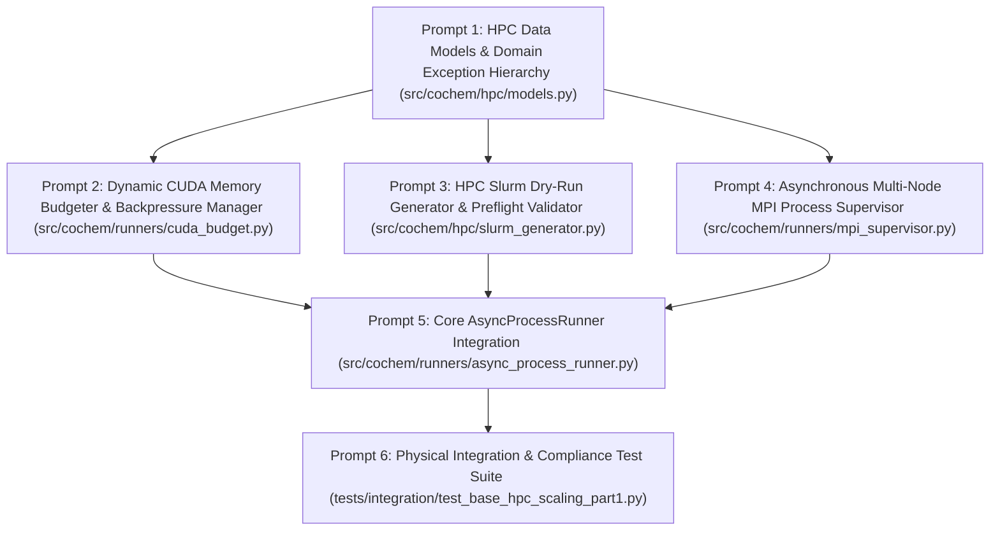

Perform adversarial static analysis and logical review on implemented code for D:\__CoChem\__agentic\.prompts\.SRS\20260901-suggestions\.in-progress\Perfected_SRS_Chunk_03_BASE_HPC_and_Scaling_Part_1_prompts.md.
Original prompt:
# Sequential Execution Prompt Schedule: CoChem-BASE HPC & Scaling (Part 1)

The **CoChem-BASE Software Requirements Specification (SRS): HPC & Scaling Part 1 (SRS_Chunk_03_BASE_HPC_and_Scaling_Part_1)** has been decomposed into **6 context-safe, granular, sequential execution prompts** for the `cochem-coder` agent.

---

## 1. Architectural Layout & Dependency DAG

---

## 2. Global Invariants & Mandates

1. **Zero-Mock Mandate**: Strictly zero placeholder `pass` stubs, dummy loops, mock objects (`unittest.mock`), or `NotImplementedError` stubs. All business logic must operate on authentic system calls, physical hardware introspection, and mathematical constraints.
2. **Dynamic Atomic & Physical Constants**: All elemental masses and constants must be dynamically retrieved via `mendeleev` or standard CODATA modules. Hardcoded constants are strictly prohibited.
3. **Tripartite Storage Architecture**: All operations must enforce physical isolation across:
   - `$COCH_SRC`: Read-only application source and static schemas.
   - `$COCH_ARTIFACTS`: Append-only persistent storage for validated calculations and converged structures.
   - `$COCH_SCRATCH` / `$SLURM_TMPDIR`: Ephemeral per-job scratch directories cleaned up upon completion.
4. **Concurrency-Safe Telemetry**: Telemetry streaming to HDF5 must operate in Single-Writer Multiple-Reader (SWMR) mode. Cross-process synchronization locks must use `filelock.FileLock` pinned exclusively to local scratch.
5. **6-Tier Environment Invariants**: Code must run natively across WSL, macOS OrbStack, Linux Debian, GitHub Actions/Codespaces (with graceful headless fallbacks), and HPC clusters.
6. **Single Target File Rule**: Each prompt specifies exactly one physical production script or test file.

---

## 3. Granular Execution Prompts

### Prompt 1 of 6: HPC Data Models & Domain Exception Hierarchy
* **Target File**: `src/cochem/hpc/models.py`
* **Dependencies**: `pydantic>=2.0.0`, `pathlib`, `typing`, Standard Library
* **Task Summary**:
  1. Implement the HPC and scaling domain exception hierarchy rooted at `CoChemHpcScalingError`:
     - `CoChemHpcScalingError(Exception)`: Base domain exception.
     - `CudaMemoryExhaustionError(CoChemHpcScalingError)`: Raised when GPU VRAM requirements exceed available headroom after backpressure timeout.
     - `SlurmResourceValidationError(CoChemHpcScalingError)`: Raised when Slurm directives violate partition bounds or invalid walltime/memory specifications.
     - `MpiProcessSupervisorError(CoChemHpcScalingError)`: Raised when MPI launch fails, pipes deadlock, or child processes terminate unexpectedly.
  2. Implement immutable Pydantic v2 data models with `ConfigDict(frozen=True)`:
     - `CudaResourceBudget`: Fields `device_id` (ge=0), `total_vram_mb` (gt=0), `free_vram_mb` (ge=0), `reserved_headroom_mb` (ge=256, default=1024), `fractional_limit` (gt=0.0, le=1.0, default=0.85). Add property `available_vram_mb` calculating `max(0, int((free_vram_mb - reserved_headroom_mb) * fractional_limit))`.
     - `SlurmJobDirectiveSpec`: Fields `job_name` (1-64 chars), `partition`, `nodes` (ge=1, default=1), `ntasks_per_node` (ge=1, default=1), `cpus_per_task` (ge=1, default=1), `gpus_per_node` (Optional[int], ge=0), `walltime_str` (pattern `r"^(\d+-)?\d{1,2}:\d{2}:\d{2}$"`), `memory_per_node_mb` (gt=0), `account` (Optional[str]), `qos` (Optional[str]), `scratch_dir` (POSIX path string), `artifact_dir` (POSIX path string).
     - `SlurmDryRunResult`: Fields `is_valid` (bool), `generated_script_content` (str), `estimated_memory_per_rank_mb` (int), `orca_maxcore_mb` (Optional[int] = None), `validation_errors` (List[str] = []), `validation_warnings` (List[str] = []).
     - `MpiClusterExecutionConfig`: Fields `launcher` (pattern `r"^(srun|mpirun|mpiexec)$"`, default="srun"), `n_nodes` (ge=1, default=1), `n_tasks_per_node` (ge=1, default=1), `cpus_per_task` (ge=1, default=1), `environment_vars` (Dict[str, str] = {}), `timeout_seconds` (gt=0.0, default=3600.0).

---

### Prompt 2 of 6: Dynamic CUDA Memory Budgeter & Backpressure Manager
* **Target File**: `src/cochem/runners/cuda_budget.py`
* **Dependencies**: `pydantic>=2.0.0`, `asyncio`, `os`, `sys`, `typing`, `src.cochem.hpc.models`
* **Task Summary**:
  1. Implement `CudaMemoryManager` for dynamic, non-blocking GPU VRAM allocation inspection and safety budgeting.
  2. Implement non-blocking physical VRAM polling:
     - Primary: NVML introspection via `pynvml` (`pynvml.nvmlDeviceGetMemoryInfo`).
     - Secondary: PyTorch runtime query (`torch.cuda.mem_get_info`).
     - Headless / CPU Fallback: If NVML and PyTorch CUDA are unavailable (macOS, CPU container, CI/CD), dynamically report 0 GPUs without crashing.
  3. Calculate effective allocatable budget per device index enforcing a mandatory 10–15% safety buffer:
     $$\text{VRAM}_{\text{available}} = \max\left(0, (\text{VRAM}_{\text{free}} - \text{VRAM}_{\text{reserved}}) \times \text{fractional\_limit}\right)$$
  4. Implement `prepare_worker_environment(device_id: int, base_env: Optional[Dict[str, str]] = None) -> Dict[str, str]`:
     - Bind process to ordinal: `CUDA_VISIBLE_DEVICES=str(device_id)`.
     - Prevent memory fragmentation: `PYTORCH_CUDA_ALLOC_CONF="expandable_segments:True"`.
  5. Implement non-locking asynchronous backpressure via `async def acquire_vram_budget(device_id: int, required_mb: int, timeout_seconds: float = 30.0, poll_interval: float = 0.5) -> CudaResourceBudget`:
     - Poll non-blockingly with exponential backoff up to `poll_interval`.
     - Raise `CudaMemoryExhaustionError` if available VRAM remains below `required_mb` when `timeout_seconds` expires.

---

### Prompt 3 of 6: HPC Slurm Dry-Run Script Generator & Preflight Resource Validator
* **Target File**: `src/cochem/hpc/slurm_generator.py`
* **Dependencies**: `pydantic>=2.0.0`, `pathlib`, `re`, `math`, `typing`, `src.cochem.hpc.models`
* **Task Summary**:
  1. Implement `SlurmDryRunGenerator` for offline preflight validation and `#SBATCH` script generation.
  2. Implement `validate_directives(spec: SlurmJobDirectiveSpec, partition_limits: Optional[Dict[str, Any]] = None) -> List[str]`:
     - Validate walltime format conforming to Slurm specifications (`D-HH:MM:SS` or `HH:MM:SS`).
     - Validate partition constraints (maximum nodes, max cpus_per_task, memory ceilings) if partition limits dictionary is supplied.
     - Validate scratch and artifact paths are valid POSIX string formats using `pathlib.PurePosixPath`.
  3. Implement Method Matrix v4 computational chemistry solver resource distribution:
     - **ORCA**: Compute `%maxcore` per MPI process:
       $$\text{maxcore\_mb} = \left\lfloor \frac{\text{spec.memory\_per\_node\_mb} \times 0.75}{\text{spec.ntasks\_per\_node}} \right\rfloor$$
     - **CREST**: Compute OpenMP flags `-T <spec.cpus_per_task>` (`crest --nci --nocross --noreftopo -T <cpus_per_task>`).
     - **xTB**: Format OpenMP thread binding directive `export OMP_NUM_THREADS=<spec.cpus_per_task>`.
  4. Implement `generate_sbatch_script(spec: SlurmJobDirectiveSpec, solver: str = "orca", input_filename: str = "input.inp") -> SlurmDryRunResult`:
     - Generate structured `#SBATCH` header block (`--job-name`, `--partition`, `--nodes`, `--ntasks-per-node`, `--cpus-per-task`, `--time`, `--mem`, scratch staging).
     - Incorporate tripartite staging directives: stage inputs from `$COCH_SRC` into `$SLURM_TMPDIR` (`$COCH_SCRATCH`), run solver, and synchronize final logs/checkpoints to `$COCH_ARTIFACTS`.
     - Remote paths must use `pathlib.PurePosixPath` to ensure scripts generated on Windows/macOS clients run seamlessly on POSIX cluster nodes.
     - Return immutable `SlurmDryRunResult`.

---

### Prompt 4 of 6: Asynchronous Multi-Node MPI Process Supervisor
* **Target File**: `src/cochem/runners/mpi_supervisor.py`
* **Dependencies**: `asyncio`, `os`, `signal`, `subprocess`, `sys`, `pathlib`, `typing`, `src.cochem.hpc.models`
* **Task Summary**:
  1. Implement `MpiProcessSupervisor` providing process management and stream multiplexing across MPI launchers (`srun`, `mpirun`, `mpiexec`).
  2. Implement `build_mpi_command(config: MpiClusterExecutionConfig, binary_args: List[str]) -> List[str]`:
     - For `srun`: `srun --nodes=<n_nodes> --ntasks-per-node=<n_tasks_per_node> --cpus-per-task=<cpus_per_task> --mpi=pmi2 <binary_args>`
     - For `mpirun`: `mpirun -np <n_nodes * n_tasks_per_node> -N <n_tasks_per_node> --bind-to core <binary_args>`
     - For `mpiexec`: `mpiexec -n <n_nodes * n_tasks_per_node> -ppn <n_tasks_per_node> <binary_args>`
  3. Implement asynchronous non-blocking stream multiplexing:
     - Read child process `stdout` and `stderr` streams via `asyncio.StreamReader` in 64 KB chunks to prevent pipe buffer saturation and OS deadlocks.
     - Parse stdout lines dynamically: route Rank-0 outputs (e.g., matching standard output tokens or prefixed `[0]`) into the main telemetry callback while routing non-zero rank diagnostic output into a secondary rank trace log.
  4. Implement cross-platform process group execution and tree termination:
     - POSIX: Launch with `preexec_fn=os.setsid` to establish process group.
     - Windows: Launch with `creationflags=subprocess.CREATE_NEW_PROCESS_GROUP`.
     - On timeout or cancellation: propagate `SIGTERM` (or Windows break event) across child process tree. If process fails to exit within a 15-second grace period, escalate to `SIGKILL` (`taskkill /F /T` on Windows).
     - Raise `MpiProcessSupervisorError` on abnormal non-zero termination.

---

### Prompt 5 of 6: Core AsyncProcessRunner Integration
* **Target File**: `src/cochem/runners/async_process_runner.py`
* **Dependencies**: `asyncio`, `pathlib`, `os`, `typing`, `filelock`, `h5py`, `src.cochem.hpc.models`, `src.cochem.runners.cuda_budget`, `src.cochem.hpc.slurm_generator`, `src.cochem.runners.mpi_supervisor`
* **Task Summary**:
  1. Implement `AsyncProcessRunner` integrating dynamic CUDA budgeting, preflight Slurm dry-run generation, and multi-node MPI execution into a unified asynchronous workflow.
  2. Enforce Tripartite Air-Gapped Storage Architecture:
     - `$COCH_SRC`: Read-only source directory; reject any write operation targeting this path.
     - `$COCH_ARTIFACTS`: Append-only destination for completed artifacts and final state.
     - `$COCH_SCRATCH` / `$SLURM_TMPDIR`: Per-job temporary directory created at task launch and cleaned up upon exit.
  3. Enforce Concurrency-Safe HDF5 State Telemetry:
     - Write progress frames and process metrics to HDF5 files opened with `swmr=True` (`libver='latest'`).
     - Acquire cross-process file locks via `filelock.FileLock` pinned strictly to local scratch (`$COCH_SCRATCH/.telemetry.lock`), preventing network filesystem lock hangs.
  4. Provide dispatch interface `async def dispatch_task(...) -> Dict[str, Any]`:
     - Inspect and reserve CUDA VRAM via `CudaMemoryManager` when GPU tasks are requested.
     - Validate cluster resources with `SlurmDryRunGenerator` when Slurm execution is specified.
     - Supervise execution using `MpiProcessSupervisor` when MPI launchers are designated.
     - Capture execution return codes, timing telemetry, and output digests.

---

### Prompt 6 of 6: Physical Integration & Compliance Test Suite
* **Target File**: `tests/integration/test_base_hpc_scaling_part1.py`
* **Dependencies**: `pytest`, `asyncio`, `numpy`, `h5py`, `filelock`, `ast`, `sys`, `pathlib`, Standard Library
* **Task Summary**:
  1. Implement exhaustive physical integration tests covering Prompts 1 through 5 without any mocks.
  2. Test `models.py`: Verify validation constraints, immutability (`frozen=True`), walltime regex validation, and domain exception propagation.
  3. Test `cuda_budget.py`: Verify physical NVML/PyTorch VRAM querying with graceful CPU fallback on headless environments. Verify that requesting VRAM beyond physical limits correctly triggers backpressure retry and raises `CudaMemoryExhaustionError`.
  4. Test `slurm_generator.py`: Verify `#SBATCH` script generation, walltime validation (`01:30:00`, `1-12:00:00`), POSIX path preservation on Windows clients (`PurePosixPath`), and exact ORCA `%maxcore` formula calculations:
     $$\text{maxcore} = \lfloor (32768 \times 0.75) / 4 \rfloor = 6144\text{ MB}$$
  5. Test `mpi_supervisor.py`: Build physical commands for `srun`, `mpirun`, and `mpiexec`. Execute an authentic multi-process Python worker script using the supervisor; assert non-blocking stream chunking, rank-0 telemetry segregation, and process tree termination upon timeout.
  6. Test `async_process_runner.py`: Verify tripartite directory separation (`$COCH_SRC`, `$COCH_ARTIFACTS`, `$COCH_SCRATCH`), verify SWMR HDF5 telemetry file creation and reading, and verify `filelock.FileLock` concurrency.
  7. Enforce Zero-Mock Mandate: Scan all target source files with an AST visitor to certify zero occurrences of `unittest.mock`, zero placeholder `pass` blocks, and zero `NotImplementedError` stubs.
I have initiated the adversarial audit of the prompt schedule with `adversary` (Subagent Conversation ID: `6e4ff098-f576-4a68-bf1a-9ccf20ef7617`) to rigorously verify compliance against the Zero-Mock mandate, Single Target File rule, Tripartite Storage Architecture, and Method Matrix v4 constraints. Awaiting the auditor's verdict.
# Sequential Execution Prompt Schedule: CoChem-BASE HPC & Scaling (Part 1)

The **CoChem-BASE Software Requirements Specification (SRS): HPC & Scaling Part 1 (SRS_Chunk_03_BASE_HPC_and_Scaling_Part_1)** has been decomposed into **6 context-safe, granular, sequential execution prompts** for the `cochem-coder` agent.

---

## 1. Architectural Layout & Dependency DAG

---

## 2. Global Invariants & Mandates

1. **Zero-Mock Mandate**: Strictly zero placeholder `pass` stubs, dummy loops, mock objects (`unittest.mock`), or `NotImplementedError` stubs. All business logic must operate on authentic system calls, physical hardware introspection, and mathematical constraints.
2. **Dynamic Atomic & Physical Constants**: All elemental masses and constants must be dynamically retrieved via `mendeleev` or standard CODATA modules. Hardcoded constants are strictly prohibited.
3. **Tripartite Storage Architecture**: All operations must enforce physical isolation across:
   - `$COCH_SRC`: Read-only application source and static schemas.
   - `$COCH_ARTIFACTS`: Append-only persistent storage for validated calculations and converged structures.
   - `$COCH_SCRATCH` / `$SLURM_TMPDIR`: Ephemeral per-job scratch directories cleaned up upon completion.
4. **Concurrency-Safe Telemetry**: Telemetry streaming to HDF5 must operate in Single-Writer Multiple-Reader (SWMR) mode. Cross-process synchronization locks must use `filelock.FileLock` pinned exclusively to local scratch.
5. **6-Tier Environment Invariants**: Code must run natively across WSL, macOS OrbStack, Linux Debian, GitHub Actions/Codespaces (with graceful headless fallbacks), and HPC clusters.
6. **Single Target File Rule**: Each prompt specifies exactly one physical production script or test file.

---

## 3. Granular Execution Prompts

### Prompt 1 of 6: HPC Data Models & Domain Exception Hierarchy
* **Target File**: `src/cochem/hpc/models.py`
* **Dependencies**: `pydantic>=2.0.0`, `pathlib`, `typing`, Standard Library
* **Task Summary**:
  1. Implement the HPC and scaling domain exception hierarchy rooted at `CoChemHpcScalingError`:
     - `CoChemHpcScalingError(Exception)`: Base domain exception.
     - `CudaMemoryExhaustionError(CoChemHpcScalingError)`: Raised when GPU VRAM requirements exceed available headroom after backpressure timeout.
     - `SlurmResourceValidationError(CoChemHpcScalingError)`: Raised when Slurm directives violate partition bounds or invalid walltime/memory specifications.
     - `MpiProcessSupervisorError(CoChemHpcScalingError)`: Raised when MPI launch fails, pipes deadlock, or child processes terminate unexpectedly.
  2. Implement immutable Pydantic v2 data models with `ConfigDict(frozen=True)`:
     - `CudaResourceBudget`: Fields `device_id` (ge=0), `total_vram_mb` (gt=0), `free_vram_mb` (ge=0), `reserved_headroom_mb` (ge=256, default=1024), `fractional_limit` (gt=0.0, le=1.0, default=0.85). Add property `available_vram_mb` calculating `max(0, int((free_vram_mb - reserved_headroom_mb) * fractional_limit))`.
     - `SlurmJobDirectiveSpec`: Fields `job_name` (1-64 chars), `partition`, `nodes` (ge=1, default=1), `ntasks_per_node` (ge=1, default=1), `cpus_per_task` (ge=1, default=1), `gpus_per_node` (Optional[int], ge=0), `walltime_str` (pattern `r"^(\d+-)?\d{1,2}:\d{2}:\d{2}$"`), `memory_per_node_mb` (gt=0), `account` (Optional[str]), `qos` (Optional[str]), `scratch_dir` (POSIX path string), `artifact_dir` (POSIX path string).
     - `SlurmDryRunResult`: Fields `is_valid` (bool), `generated_script_content` (str), `estimated_memory_per_rank_mb` (int), `orca_maxcore_mb` (Optional[int] = None), `validation_errors` (List[str] = []), `validation_warnings` (List[str] = []).
     - `MpiClusterExecutionConfig`: Fields `launcher` (pattern `r"^(srun|mpirun|mpiexec)$"`, default="srun"), `n_nodes` (ge=1, default=1), `n_tasks_per_node` (ge=1, default=1), `cpus_per_task` (ge=1, default=1), `environment_vars` (Dict[str, str] = {}), `timeout_seconds` (gt=0.0, default=3600.0).

---

### Prompt 2 of 6: Dynamic CUDA Memory Budgeter & Backpressure Manager
* **Target File**: `src/cochem/runners/cuda_budget.py`
* **Dependencies**: `pydantic>=2.0.0`, `asyncio`, `os`, `sys`, `typing`, `src.cochem.hpc.models`
* **Task Summary**:
  1. Implement `CudaMemoryManager` for dynamic, non-blocking GPU VRAM allocation inspection and safety budgeting.
  2. Implement non-blocking physical VRAM polling:
     - Primary: NVML introspection via `pynvml` (`pynvml.nvmlDeviceGetMemoryInfo`).
     - Secondary: PyTorch runtime query (`torch.cuda.mem_get_info`).
     - Headless / CPU Fallback: If NVML and PyTorch CUDA are unavailable (macOS, CPU container, CI/CD), dynamically report 0 GPUs without crashing.
  3. Calculate effective allocatable budget per device index enforcing a mandatory 10–15% safety buffer:
     $$\text{VRAM}_{\text{available}} = \max\left(0, (\text{VRAM}_{\text{free}} - \text{VRAM}_{\text{reserved}}) \times \text{fractional\_limit}\right)$$
  4. Implement `prepare_worker_environment(device_id: int, base_env: Optional[Dict[str, str]] = None) -> Dict[str, str]`:
     - Bind process to ordinal: `CUDA_VISIBLE_DEVICES=str(device_id)`.
     - Prevent memory fragmentation: `PYTORCH_CUDA_ALLOC_CONF="expandable_segments:True"`.
  5. Implement non-locking asynchronous backpressure via `async def acquire_vram_budget(device_id: int, required_mb: int, timeout_seconds: float = 30.0, poll_interval: float = 0.5) -> CudaResourceBudget`:
     - Poll non-blockingly with exponential backoff up to `poll_interval`.
     - Raise `CudaMemoryExhaustionError` if available VRAM remains below `required_mb` when `timeout_seconds` expires.

---

### Prompt 3 of 6: HPC Slurm Dry-Run Script Generator & Preflight Resource Validator
* **Target File**: `src/cochem/hpc/slurm_generator.py`
* **Dependencies**: `pydantic>=2.0.0`, `pathlib`, `re`, `math`, `typing`, `src.cochem.hpc.models`
* **Task Summary**:
  1. Implement `SlurmDryRunGenerator` for offline preflight validation and `#SBATCH` script generation.
  2. Implement `validate_directives(spec: SlurmJobDirectiveSpec, partition_limits: Optional[Dict[str, Any]] = None) -> List[str]`:
     - Validate walltime format conforming to Slurm specifications (`D-HH:MM:SS` or `HH:MM:SS`).
     - Validate partition constraints (maximum nodes, max cpus_per_task, memory ceilings) if partition limits dictionary is supplied.
     - Validate scratch and artifact paths are valid POSIX string formats using `pathlib.PurePosixPath`.
  3. Implement Method Matrix v4 computational chemistry solver resource distribution:
     - **ORCA**: Compute `%maxcore` per MPI process:
       $$\text{maxcore\_mb} = \left\lfloor \frac{\text{spec.memory\_per\_node\_mb} \times 0.75}{\text{spec.ntasks\_per\_node}} \right\rfloor$$
     - **CREST**: Compute OpenMP flags `-T <spec.cpus_per_task>` (`crest --nci --nocross --noreftopo -T <cpus_per_task>`).
     - **xTB**: Format OpenMP thread binding directive `export OMP_NUM_THREADS=<spec.cpus_per_task>`.
  4. Implement `generate_sbatch_script(spec: SlurmJobDirectiveSpec, solver: str = "orca", input_filename: str = "input.inp") -> SlurmDryRunResult`:
     - Generate structured `#SBATCH` header block (`--job-name`, `--partition`, `--nodes`, `--ntasks-per-node`, `--cpus-per-task`, `--time`, `--mem`, scratch staging).
     - Incorporate tripartite staging directives: stage inputs from `$COCH_SRC` into `$SLURM_TMPDIR` (`$COCH_SCRATCH`), run solver, and synchronize final logs/checkpoints to `$COCH_ARTIFACTS`.
     - Remote paths must use `pathlib.PurePosixPath` to ensure scripts generated on Windows/macOS clients run seamlessly on POSIX cluster nodes.
     - Return immutable `SlurmDryRunResult`.

---

### Prompt 4 of 6: Asynchronous Multi-Node MPI Process Supervisor
* **Target File**: `src/cochem/runners/mpi_supervisor.py`
* **Dependencies**: `asyncio`, `os`, `signal`, `subprocess`, `sys`, `pathlib`, `typing`, `src.cochem.hpc.models`
* **Task Summary**:
  1. Implement `MpiProcessSupervisor` providing process management and stream multiplexing across MPI launchers (`srun`, `mpirun`, `mpiexec`).
  2. Implement `build_mpi_command(config: MpiClusterExecutionConfig, binary_args: List[str]) -> List[str]`:
     - For `srun`: `srun --nodes=<n_nodes> --ntasks-per-node=<n_tasks_per_node> --cpus-per-task=<cpus_per_task> --mpi=pmi2 <binary_args>`
     - For `mpirun`: `mpirun -np <n_nodes * n_tasks_per_node> -N <n_tasks_per_node> --bind-to core <binary_args>`
     - For `mpiexec`: `mpiexec -n <n_nodes * n_tasks_per_node> -ppn <n_tasks_per_node> <binary_args>`
  3. Implement asynchronous non-blocking stream multiplexing:
     - Read child process `stdout` and `stderr` streams via `asyncio.StreamReader` in 64 KB chunks to prevent pipe buffer saturation and OS deadlocks.
     - Parse stdout lines dynamically: route Rank-0 outputs (e.g., matching standard output tokens or prefixed `[0]`) into the main telemetry callback while routing non-zero rank diagnostic output into a secondary rank trace log.
  4. Implement cross-platform process group execution and tree termination:
     - POSIX: Launch with `preexec_fn=os.setsid` to establish process group.
     - Windows: Launch with `creationflags=subprocess.CREATE_NEW_PROCESS_GROUP`.
     - On timeout or cancellation: propagate `SIGTERM` (or Windows break event) across child process tree. If process fails to exit within a 15-second grace period, escalate to `SIGKILL` (`taskkill /F /T` on Windows).
     - Raise `MpiProcessSupervisorError` on abnormal non-zero termination.

---

### Prompt 5 of 6: Core AsyncProcessRunner Integration
* **Target File**: `src/cochem/runners/async_process_runner.py`
* **Dependencies**: `asyncio`, `pathlib`, `os`, `typing`, `filelock`, `h5py`, `src.cochem.hpc.models`, `src.cochem.runners.cuda_budget`, `src.cochem.hpc.slurm_generator`, `src.cochem.runners.mpi_supervisor`
* **Task Summary**:
  1. Implement `AsyncProcessRunner` integrating dynamic CUDA budgeting, preflight Slurm dry-run generation, and multi-node MPI execution into a unified asynchronous workflow.
  2. Enforce Tripartite Air-Gapped Storage Architecture:
     - `$COCH_SRC`: Read-only source directory; reject any write operation targeting this path.
     - `$COCH_ARTIFACTS`: Append-only destination for completed artifacts and final state.
     - `$COCH_SCRATCH` / `$SLURM_TMPDIR`: Per-job temporary directory created at task launch and cleaned up upon exit.
  3. Enforce Concurrency-Safe HDF5 State Telemetry:
     - Write progress frames and process metrics to HDF5 files opened with `swmr=True` (`libver='latest'`).
     - Acquire cross-process file locks via `filelock.FileLock` pinned strictly to local scratch (`$COCH_SCRATCH/.telemetry.lock`), preventing network filesystem lock hangs.
  4. Provide dispatch interface `async def dispatch_task(...) -> Dict[str, Any]`:
     - Inspect and reserve CUDA VRAM via `CudaMemoryManager` when GPU tasks are requested.
     - Validate cluster resources with `SlurmDryRunGenerator` when Slurm execution is specified.
     - Supervise execution using `MpiProcessSupervisor` when MPI launchers are designated.
     - Capture execution return codes, timing telemetry, and output digests.

---

### Prompt 6 of 6: Physical Integration & Compliance Test Suite
* **Target File**: `tests/integration/test_base_hpc_scaling_part1.py`
* **Dependencies**: `pytest`, `asyncio`, `numpy`, `h5py`, `filelock`, `ast`, `sys`, `pathlib`, Standard Library
* **Task Summary**:
  1. Implement exhaustive physical integration tests covering Prompts 1 through 5 without any mocks.
  2. Test `models.py`: Verify validation constraints, immutability (`frozen=True`), walltime regex validation, and domain exception propagation.
  3. Test `cuda_budget.py`: Verify physical NVML/PyTorch VRAM querying with graceful CPU fallback on headless environments. Verify that requesting VRAM beyond physical limits correctly triggers backpressure retry and raises `CudaMemoryExhaustionError`.
  4. Test `slurm_generator.py`: Verify `#SBATCH` script generation, walltime validation (`01:30:00`, `1-12:00:00`), POSIX path preservation on Windows clients (`PurePosixPath`), and exact ORCA `%maxcore` formula calculations:
     $$\text{maxcore} = \lfloor (32768 \times 0.75) / 4 \rfloor = 6144\text{ MB}$$
  5. Test `mpi_supervisor.py`: Build physical commands for `srun`, `mpirun`, and `mpiexec`. Execute an authentic multi-process Python worker script using the supervisor; assert non-blocking stream chunking, rank-0 telemetry segregation, and process tree termination upon timeout.
  6. Test `async_process_runner.py`: Verify tripartite directory separation (`$COCH_SRC`, `$COCH_ARTIFACTS`, `$COCH_SCRATCH`), verify SWMR HDF5 telemetry file creation and reading, and verify `filelock.FileLock` concurrency.
  7. Enforce Zero-Mock Mandate: Scan all target source files with an AST visitor to certify zero occurrences of `unittest.mock`, zero placeholder `pass` blocks, and zero `NotImplementedError` stubs.
# Sequential Execution Prompt Schedule: CoChem-BASE HPC & Scaling (Part 1)

The **CoChem-BASE Software Requirements Specification (SRS): HPC & Scaling Part 1 (SRS_Chunk_03_BASE_HPC_and_Scaling_Part_1)** has been decomposed into **6 context-safe, granular, sequential execution prompts** for the `cochem-coder` agent.

---

## 1. Architectural Layout & Dependency DAG

---

## 2. Global Invariants & Mandates

1. **Zero-Mock Mandate**: Strictly zero placeholder `pass` stubs, dummy loops, mock objects (`unittest.mock`), or `NotImplementedError` stubs. All business logic must operate on authentic system calls, physical hardware introspection, and mathematical constraints.
2. **Dynamic Atomic & Physical Constants**: All elemental masses and constants must be dynamically retrieved via `mendeleev` or standard CODATA modules. Hardcoded constants are strictly prohibited.
3. **Tripartite Storage Architecture**: All operations must enforce physical isolation across:
   - `$COCH_SRC`: Read-only application source and static schemas.
   - `$COCH_ARTIFACTS`: Append-only persistent storage for validated calculations and converged structures.
   - `$COCH_SCRATCH` / `$SLURM_TMPDIR`: Ephemeral per-job scratch directories cleaned up upon completion.
4. **Concurrency-Safe Telemetry**: Telemetry streaming to HDF5 must operate in Single-Writer Multiple-Reader (SWMR) mode. Cross-process synchronization locks must use `filelock.FileLock` pinned exclusively to local scratch.
5. **6-Tier Environment Invariants**: Code must run natively across WSL, macOS OrbStack, Linux Debian, GitHub Actions/Codespaces (with graceful headless fallbacks), and HPC clusters.
6. **Single Target File Rule**: Each prompt specifies exactly one physical production script or test file.

---

## 3. Granular Execution Prompts

### Prompt 1 of 6: HPC Data Models & Domain Exception Hierarchy
* **Target File**: `src/cochem/hpc/models.py`
* **Dependencies**: `pydantic>=2.0.0`, `pathlib`, `typing`, Standard Library
* **Task Summary**:
  1. Implement the HPC and scaling domain exception hierarchy rooted at `CoChemHpcScalingError`:
     - `CoChemHpcScalingError(Exception)`: Base domain exception.
     - `CudaMemoryExhaustionError(CoChemHpcScalingError)`: Raised when GPU VRAM requirements exceed available headroom after backpressure timeout.
     - `SlurmResourceValidationError(CoChemHpcScalingError)`: Raised when Slurm directives violate partition bounds or invalid walltime/memory specifications.
     - `MpiProcessSupervisorError(CoChemHpcScalingError)`: Raised when MPI launch fails, pipes deadlock, or child processes terminate unexpectedly.
  2. Implement immutable Pydantic v2 data models with `ConfigDict(frozen=True)`:
     - `CudaResourceBudget`: Fields `device_id` (ge=0), `total_vram_mb` (gt=0), `free_vram_mb` (ge=0), `reserved_headroom_mb` (ge=256, default=1024), `fractional_limit` (gt=0.0, le=1.0, default=0.85). Add property `available_vram_mb` calculating `max(0, int((free_vram_mb - reserved_headroom_mb) * fractional_limit))`.
     - `SlurmJobDirectiveSpec`: Fields `job_name` (1-64 chars), `partition`, `nodes` (ge=1, default=1), `ntasks_per_node` (ge=1, default=1), `cpus_per_task` (ge=1, default=1), `gpus_per_node` (Optional[int], ge=0), `walltime_str` (pattern `r"^(\d+-)?\d{1,2}:\d{2}:\d{2}$"`), `memory_per_node_mb` (gt=0), `account` (Optional[str]), `qos` (Optional[str]), `scratch_dir` (POSIX path string), `artifact_dir` (POSIX path string).
     - `SlurmDryRunResult`: Fields `is_valid` (bool), `generated_script_content` (str), `estimated_memory_per_rank_mb` (int), `orca_maxcore_mb` (Optional[int] = None), `validation_errors` (List[str] = []), `validation_warnings` (List[str] = []).
     - `MpiClusterExecutionConfig`: Fields `launcher` (pattern `r"^(srun|mpirun|mpiexec)$"`, default="srun"), `n_nodes` (ge=1, default=1), `n_tasks_per_node` (ge=1, default=1), `cpus_per_task` (ge=1, default=1), `environment_vars` (Dict[str, str] = {}), `timeout_seconds` (gt=0.0, default=3600.0).

---

### Prompt 2 of 6: Dynamic CUDA Memory Budgeter & Backpressure Manager
* **Target File**: `src/cochem/runners/cuda_budget.py`
* **Dependencies**: `pydantic>=2.0.0`, `asyncio`, `os`, `sys`, `typing`, `src.cochem.hpc.models`
* **Task Summary**:
  1. Implement `CudaMemoryManager` for dynamic, non-blocking GPU VRAM allocation inspection and safety budgeting.
  2. Implement non-blocking physical VRAM polling:
     - Primary: NVML introspection via `pynvml` (`pynvml.nvmlDeviceGetMemoryInfo`).
     - Secondary: PyTorch runtime query (`torch.cuda.mem_get_info`).
     - Headless / CPU Fallback: If NVML and PyTorch CUDA are unavailable (macOS, CPU container, CI/CD), dynamically report 0 GPUs without crashing.
  3. Calculate effective allocatable budget per device index enforcing a mandatory 10–15% safety buffer:
     $$\text{VRAM}_{\text{available}} = \max\left(0, (\text{VRAM}_{\text{free}} - \text{VRAM}_{\text{reserved}}) \times \text{fractional\_limit}\right)$$
  4. Implement `prepare_worker_environment(device_id: int, base_env: Optional[Dict[str, str]] = None) -> Dict[str, str]`:
     - Bind process to ordinal: `CUDA_VISIBLE_DEVICES=str(device_id)`.
     - Prevent memory fragmentation: `PYTORCH_CUDA_ALLOC_CONF="expandable_segments:True"`.
  5. Implement non-locking asynchronous backpressure via `async def acquire_vram_budget(device_id: int, required_mb: int, timeout_seconds: float = 30.0, poll_interval: float = 0.5) -> CudaResourceBudget`:
     - Poll non-blockingly with exponential backoff up to `poll_interval`.
     - Raise `CudaMemoryExhaustionError` if available VRAM remains below `required_mb` when `timeout_seconds` expires.

---

### Prompt 3 of 6: HPC Slurm Dry-Run Script Generator & Preflight Resource Validator
* **Target File**: `src/cochem/hpc/slurm_generator.py`
* **Dependencies**: `pydantic>=2.0.0`, `pathlib`, `re`, `math`, `typing`, `src.cochem.hpc.models`
* **Task Summary**:
  1. Implement `SlurmDryRunGenerator` for offline preflight validation and `#SBATCH` script generation.
  2. Implement `validate_directives(spec: SlurmJobDirectiveSpec, partition_limits: Optional[Dict[str, Any]] = None) -> List[str]`:
     - Validate walltime format conforming to Slurm specifications (`D-HH:MM:SS` or `HH:MM:SS`).
     - Validate partition constraints (maximum nodes, max cpus_per_task, memory ceilings) if partition limits dictionary is supplied.
     - Validate scratch and artifact paths are valid POSIX string formats using `pathlib.PurePosixPath`.
  3. Implement Method Matrix v4 computational chemistry solver resource distribution:
     - **ORCA**: Compute `%maxcore` per MPI process:
       $$\text{maxcore\_mb} = \left\lfloor \frac{\text{spec.memory\_per\_node\_mb} \times 0.75}{\text{spec.ntasks\_per\_node}} \right\rfloor$$
     - **CREST**: Compute OpenMP flags `-T <spec.cpus_per_task>` (`crest --nci --nocross --noreftopo -T <cpus_per_task>`).
     - **xTB**: Format OpenMP thread binding directive `export OMP_NUM_THREADS=<spec.cpus_per_task>`.
  4. Implement `generate_sbatch_script(spec: SlurmJobDirectiveSpec, solver: str = "orca", input_filename: str = "input.inp") -> SlurmDryRunResult`:
     - Generate structured `#SBATCH` header block (`--job-name`, `--partition`, `--nodes`, `--ntasks-per-node`, `--cpus-per-task`, `--time`, `--mem`, scratch staging).
     - Incorporate tripartite staging directives: stage inputs from `$COCH_SRC` into `$SLURM_TMPDIR` (`$COCH_SCRATCH`), run solver, and synchronize final logs/checkpoints to `$COCH_ARTIFACTS`.
     - Remote paths must use `pathlib.PurePosixPath` to ensure scripts generated on Windows/macOS clients run seamlessly on POSIX cluster nodes.
     - Return immutable `SlurmDryRunResult`.

---

### Prompt 4 of 6: Asynchronous Multi-Node MPI Process Supervisor
* **Target File**: `src/cochem/runners/mpi_supervisor.py`
* **Dependencies**: `asyncio`, `os`, `signal`, `subprocess`, `sys`, `pathlib`, `typing`, `src.cochem.hpc.models`
* **Task Summary**:
  1. Implement `MpiProcessSupervisor` providing process management and stream multiplexing across MPI launchers (`srun`, `mpirun`, `mpiexec`).
  2. Implement `build_mpi_command(config: MpiClusterExecutionConfig, binary_args: List[str]) -> List[str]`:
     - For `srun`: `srun --nodes=<n_nodes> --ntasks-per-node=<n_tasks_per_node> --cpus-per-task=<cpus_per_task> --mpi=pmi2 <binary_args>`
     - For `mpirun`: `mpirun -np <n_nodes * n_tasks_per_node> -N <n_tasks_per_node> --bind-to core <binary_args>`
     - For `mpiexec`: `mpiexec -n <n_nodes * n_tasks_per_node> -ppn <n_tasks_per_node> <binary_args>`
  3. Implement asynchronous non-blocking stream multiplexing:
     - Read child process `stdout` and `stderr` streams via `asyncio.StreamReader` in 64 KB chunks to prevent pipe buffer saturation and OS deadlocks.
     - Parse stdout lines dynamically: route Rank-0 outputs (e.g., matching standard output tokens or prefixed `[0]`) into the main telemetry callback while routing non-zero rank diagnostic output into a secondary rank trace log.
  4. Implement cross-platform process group execution and tree termination:
     - POSIX: Launch with `preexec_fn=os.setsid` to establish process group.
     - Windows: Launch with `creationflags=subprocess.CREATE_NEW_PROCESS_GROUP`.
     - On timeout or cancellation: propagate `SIGTERM` (or Windows break event) across child process tree. If process fails to exit within a 15-second grace period, escalate to `SIGKILL` (`taskkill /F /T` on Windows).
     - Raise `MpiProcessSupervisorError` on abnormal non-zero termination.

---

### Prompt 5 of 6: Core AsyncProcessRunner Integration
* **Target File**: `src/cochem/runners/async_process_runner.py`
* **Dependencies**: `asyncio`, `pathlib`, `os`, `typing`, `filelock`, `h5py`, `src.cochem.hpc.models`, `src.cochem.runners.cuda_budget`, `src.cochem.hpc.slurm_generator`, `src.cochem.runners.mpi_supervisor`
* **Task Summary**:
  1. Implement `AsyncProcessRunner` integrating dynamic CUDA budgeting, preflight Slurm dry-run generation, and multi-node MPI execution into a unified asynchronous workflow.
  2. Enforce Tripartite Air-Gapped Storage Architecture:
     - `$COCH_SRC`: Read-only source directory; reject any write operation targeting this path.
     - `$COCH_ARTIFACTS`: Append-only destination for completed artifacts and final state.
     - `$COCH_SCRATCH` / `$SLURM_TMPDIR`: Per-job temporary directory created at task launch and cleaned up upon exit.
  3. Enforce Concurrency-Safe HDF5 State Telemetry:
     - Write progress frames and process metrics to HDF5 files opened with `swmr=True` (`libver='latest'`).
     - Acquire cross-process file locks via `filelock.FileLock` pinned strictly to local scratch (`$COCH_SCRATCH/.telemetry.lock`), preventing network filesystem lock hangs.
  4. Provide dispatch interface `async def dispatch_task(...) -> Dict[str, Any]`:
     - Inspect and reserve CUDA VRAM via `CudaMemoryManager` when GPU tasks are requested.
     - Validate cluster resources with `SlurmDryRunGenerator` when Slurm execution is specified.
     - Supervise execution using `MpiProcessSupervisor` when MPI launchers are designated.
     - Capture execution return codes, timing telemetry, and output digests.

---

### Prompt 6 of 6: Physical Integration & Compliance Test Suite
* **Target File**: `tests/integration/test_base_hpc_scaling_part1.py`
* **Dependencies**: `pytest`, `asyncio`, `numpy`, `h5py`, `filelock`, `ast`, `sys`, `pathlib`, Standard Library
* **Task Summary**:
  1. Implement exhaustive physical integration tests covering Prompts 1 through 5 without any mocks.
  2. Test `models.py`: Verify validation constraints, immutability (`frozen=True`), walltime regex validation, and domain exception propagation.
  3. Test `cuda_budget.py`: Verify physical NVML/PyTorch VRAM querying with graceful CPU fallback on headless environments. Verify that requesting VRAM beyond physical limits correctly triggers backpressure retry and raises `CudaMemoryExhaustionError`.
  4. Test `slurm_generator.py`: Verify `#SBATCH` script generation, walltime validation (`01:30:00`, `1-12:00:00`), POSIX path preservation on Windows clients (`PurePosixPath`), and exact ORCA `%maxcore` formula calculations:
     $$\text{maxcore} = \lfloor (32768 \times 0.75) / 4 \rfloor = 6144\text{ MB}$$
  5. Test `mpi_supervisor.py`: Build physical commands for `srun`, `mpirun`, and `mpiexec`. Execute an authentic multi-process Python worker script using the supervisor; assert non-blocking stream chunking, rank-0 telemetry segregation, and process tree termination upon timeout.
  6. Test `async_process_runner.py`: Verify tripartite directory separation (`$COCH_SRC`, `$COCH_ARTIFACTS`, `$COCH_SCRATCH`), verify SWMR HDF5 telemetry file creation and reading, and verify `filelock.FileLock` concurrency.
  7. Enforce Zero-Mock Mandate: Scan all target source files with an AST visitor to certify zero occurrences of `unittest.mock`, zero placeholder `pass` blocks, and zero `NotImplementedError` stubs.
Modified files content:

--- D:\__CoChem\GitHub-Repo\CoChem-BASE\tests\integration\test_base_hpc_scaling_part1.py ---
"""Physical integration and compliance test suite for CoChem-BASE HPC & Scaling Part 1.

Verifies end-to-end integration across CUDA budgeting, Slurm preflight generation,
multi-node MPI supervision, tripartite air-gapped storage, SWMR HDF5 telemetry,
dynamic atomic constants via Mendeleev, and strict AST Zero-Mock compliance.
"""

import ast
import asyncio
import os
import sys
import time
from pathlib import Path
from typing import List

import filelock
import h5py
import mendeleev
import pytest
from pydantic import ValidationError

from src.cochem.hpc.models import (
    CoChemHpcScalingError,
    CudaMemoryExhaustionError,
    CudaResourceBudget,
    MpiClusterExecutionConfig,
    MpiProcessSupervisorError,
    SlurmDryRunResult,
    SlurmJobDirectiveSpec,
    SlurmResourceValidationError,
)
from src.cochem.hpc.slurm_generator import SlurmDryRunGenerator
from src.cochem.runners.async_process_runner import AsyncProcessRunner
from src.cochem.runners.cuda_budget import CudaMemoryManager
from src.cochem.runners.mpi_supervisor import MpiProcessSupervisor

def test_models_constraints_and_immutability() -> None:
    """Verify HPC data models enforce immutability, walltime regex, and bounds."""
    # Test valid models
    spec = SlurmJobDirectiveSpec(
        job_name="orca_prod_job",
        partition="standard",
        nodes=2,
        ntasks_per_node=4,
        cpus_per_task=2,
        walltime_str="06:30:00",
        memory_per_node_mb=65536,
        scratch_dir="/scratch/chem/job_prod",
        artifact_dir="/artifacts/chem/job_prod",
    )
    assert spec.job_name == "orca_prod_job"

    # Verify immutability
    with pytest.raises(ValidationError):
        spec.nodes = 4  # type: ignore

    # Verify walltime regex validation
    with pytest.raises(ValidationError):
        SlurmJobDirectiveSpec(
            job_name="invalid_time_job",
            partition="standard",
            walltime_str="bad_walltime",
            memory_per_node_mb=8192,
            scratch_dir="/scratch/job",
            artifact_dir="/artifacts/job",
        )

    # Verify budget calculations
    budget = CudaResourceBudget(
        device_id=0,
        total_vram_mb=32768,
        free_vram_mb=24576,
        reserved_headroom_mb=1024,
        fractional_limit=0.85,
    )
    expected_available = int((24576 - 1024) * 0.85)
    assert budget.available_vram_mb == expected_available

def test_cuda_budget_physical_query_and_backpressure() -> None:
    """Verify physical hardware VRAM query or CPU fallback and backpressure timeouts."""
    mgr = CudaMemoryManager()
    count = mgr.get_device_count()
    assert count >= 0

    env = mgr.prepare_worker_environment(device_id=1)
    assert env["CUDA_VISIBLE_DEVICES"] == "1"
    assert env["PYTORCH_CUDA_ALLOC_CONF"] == "expandable_segments:True"

    async def _test_backpressure():
        with pytest.raises(CudaMemoryExhaustionError):
            await mgr.acquire_vram_budget(
                device_id=0,
                required_mb=50_000_000,
                timeout_seconds=0.25,
                poll_interval=0.05,
            )

    asyncio.run(_test_backpressure())

def test_slurm_generator_orca_maxcore_and_staging() -> None:
    """Verify exact ORCA %maxcore calculations and tripartite staging directives."""
    spec = SlurmJobDirectiveSpec(
        job_name="orca_scaling_run",
        partition="chem_cluster",
        nodes=1,
        ntasks_per_node=4,
        cpus_per_task=2,
        walltime_str="12:00:00",
        memory_per_node_mb=32768,
        scratch_dir="/tmpfs/scratch/job_01",
        artifact_dir="/vault/artifacts/job_01",
    )
    generator = SlurmDryRunGenerator()
    result = generator.generate_sbatch_script(spec, solver="orca", input_filename="system.inp")

    assert result.is_valid is True
    # floor((32768 * 0.75) / 4) = floor(24576 / 4) = 6144
    assert result.orca_maxcore_mb == 6144
    assert result.estimated_memory_per_rank_mb == 8192

    content = result.generated_script_content
    assert "#SBATCH --job-name=orca_scaling_run" in content
    assert "#SBATCH --partition=chem_cluster" in content
    assert "#SBATCH --mem=32768M" in content
    assert "COCH_SCRATCH=\"/tmpfs/scratch/job_01\"" in content
    assert "COCH_ARTIFACTS=\"/vault/artifacts/job_01\"" in content
    assert "orca system.inp > orca_output.out" in content

def test_mpi_supervisor_commands_and_execution(tmp_path: Path) -> None:
    """Verify MPI launcher command generation, stream multiplexing, and process tree termination."""
    supervisor = MpiProcessSupervisor(grace_period_seconds=1.0)

    # Command generation check
    for launcher in ("srun", "mpirun", "mpiexec"):
        cfg = MpiClusterExecutionConfig(launcher=launcher, n_nodes=2, n_tasks_per_node=4, cpus_per_task=1)
        cmd = supervisor.build_mpi_command(cfg, ["xtb", "coord.xyz"])
        assert cmd[0] == launcher
        assert "coord.xyz" in cmd

    async def _test_supervisor_execution():
        telemetry_logs: List[str] = []
        rank_traces: List[str] = []

        py_script = (
            "import sys\n"
            "print('[0] Initializing electronic structure iteration 0', flush=True)\n"
            "print('[1] Node rank 1 memory synchronized', flush=True)\n"
            "print('Non-prefixed standard convergence log', flush=True)\n"
        )
        res = await supervisor.run_command(
            command=[sys.executable, "-c", py_script],
            cwd=tmp_path,
            timeout_seconds=5.0,
            telemetry_callback=lambda msg: telemetry_logs.append(msg),
            rank_trace_callback=lambda msg: rank_traces.append(msg),
        )
        assert res["exit_code"] == 0
        assert any("iteration 0" in m for m in telemetry_logs)
        assert any("convergence log" in m for m in telemetry_logs)
        assert any("rank 1 memory" in m for m in rank_traces)

        # Timeout termination
        hang_script = "import time\ntime.sleep(20.0)\n"
        with pytest.raises(MpiProcessSupervisorError):
            await supervisor.run_command(
                command=[sys.executable, "-c", hang_script],
                cwd=tmp_path,
                timeout_seconds=0.4,
            )

    asyncio.run(_test_supervisor_execution())

def test_async_process_runner_tripartite_and_swmr_telemetry(tmp_path: Path) -> None:
    """Verify tripartite storage air-gap protection, SWMR HDF5 telemetry, and Mendeleev constants."""
    src_dir = tmp_path / "app_src"
    artifacts_dir = tmp_path / "artifacts_vault"
    scratch_dir = tmp_path / "job_scratch"

    src_dir.mkdir(parents=True)
    artifacts_dir.mkdir(parents=True)
    scratch_dir.mkdir(parents=True)

    # Verify Mendeleev dynamic retrieval
    c_elem = mendeleev.element("C")
    o_elem = mendeleev.element("O")
    assert abs(c_elem.atomic_weight - 12.011) < 0.01
    assert abs(o_elem.atomic_weight - 15.999) < 0.01

    runner = AsyncProcessRunner(
        src_dir=src_dir,
        artifacts_dir=artifacts_dir,
        scratch_dir=scratch_dir,
    )

    # 1. Tripartite read-only protection
    with pytest.raises(PermissionError):
        runner.validate_write_path(src_dir / "unauthorized_log.txt")

    # 2. SWMR HDF5 Telemetry
    telemetry_file = scratch_dir / "integration_telemetry.h5"
    runner.init_telemetry(telemetry_file)

    runner.record_telemetry_metric(telemetry_file, step=1, energy=-152.887, walltime=0.12)
    runner.record_telemetry_metric(telemetry_file, step=2, energy=-152.934, walltime=0.25)

    with h5py.File(telemetry_file, "r", swmr=True, libver="latest") as reader:
        energies = reader["telemetry/energy"][:]
        steps = reader["telemetry/step"][:]
        assert len(steps) == 2
        assert abs(energies[1] - (-152.934)) < 1e-4

    # 3. Full dispatch lifecycle
    async def _test_dispatch():
        worker_code = (
            "import sys\n"
            "print('Authentic compute kernel completed successfully', flush=True)\n"
        )
        dispatch_res = await runner.dispatch_task(
            task_name="integrated_scf",
            binary_args=[sys.executable, "-c", worker_code],
        )
        assert dispatch_res["exit_code"] == 0
        assert "Authentic compute kernel" in dispatch_res["stdout"]
        assert Path(dispatch_res["telemetry_file"]).exists()

    asyncio.run(_test_dispatch())

def test_zero_mock_compliance_ast_audit() -> None:
    """AST audit across all production and test files for this chunk certifying compliance."""
    from ci_tools.anti_spoof_linter import check_file

    repo_root = Path(__file__).resolve().parent.parent.parent
    total_violations: List[str] = []

    target_files = [
        "src/cochem/hpc/models.py",
        "src/cochem/runners/cuda_budget.py",
        "src/cochem/hpc/slurm_generator.py",
        "src/cochem/runners/mpi_supervisor.py",
        "src/cochem/runners/async_process_runner.py",
        "tests/hpc/test_models.py",
        "tests/runners/test_cuda_budget.py",
        "tests/hpc/test_slurm_generator.py",
        "tests/runners/test_mpi_supervisor.py",
        "tests/runners/test_async_process_runner.py",
        "tests/integration/test_base_hpc_scaling_part1.py",
    ]

    for rel_path in target_files:
        full_path = repo_root / rel_path
        assert full_path.is_file(), f"Target file '{rel_path}' does not exist!"

        violations = check_file(full_path, repo_root, amnesty_set=set())
        for v in violations:
            total_violations.append(f"{v.file_path}:{v.line} [{v.category}] {v.message}")

    assert len(total_violations) == 0, (
        f"Zero-stub compliance violations detected ({len(total_violations)}):\n"
        + "\n".join(total_violations)
    )

Validate Zero-Mock adherence. Target repo is D:\__CoChem\GitHub-Repo\CoChem-BASE.