Parallel audit completed. Review the following output for any necessary interventions:
I have initiated the parallel adversarial static analysis across `D:\__CoChem\GitHub-Repo\CoChem-BASE` by dispatching two specialized Agent Council members concurrently:

1. **`adversary`** (ID: `38c6d4fb-d1f0-4f5a-b005-b8d3bbba10aa`): Hunting for Zero-Mock mandate violations, mocked objects/classes, placeholder dictionaries, synthetic data bypasses, faked jobs, and Mendeleev mass mandate violations.
2. **`cochem-audit`** (ID: `e925460f-81b8-48b4-85ea-8d5455ea1123`): Evaluating Method Matrix v4 compliance, Mendeleev dynamic mass retrieval, logical integrity, subprocess/threading safety, type integrity, and error handling.

Awaiting their independent findings.
The `adversary` agent has delivered its findings, identifying multiple critical Zero-Mock violations, active mock evasion mechanisms, synthetic simulation loops, and hardcoded atomic mass tables.

Currently awaiting the completion of the `cochem-audit` subagent's architectural, compliance, and logical integrity static analysis.
# Parallel Adversarial Static Analysis Audit Report

**Target Repository:** `D:\__CoChem\GitHub-Repo\CoChem-BASE`  
**Execution Mode:** Parallel Agent Swarm (`adversary` and `cochem-audit`)  
**Audit Status:** **FAILURE** (Critical Violations Identified Across Zero-Mock, Mendeleev Mandate, Security, and Method Matrix v4 Standards)

---

## Executive Summary

Pursuant to the instructions in [`parallel_audit_payload.md`](file:///D:/__CoChem/GitHub-Repo/CoChem-BASE/parallel_audit_payload.md), an exhaustive, dual-agent parallel static analysis was conducted across `D:\__CoChem\GitHub-Repo\CoChem-BASE`. 

The audit uncovered multiple critical vulnerabilities, synthetic mock patterns, bypass lists, physical constant violations, and security risks across five primary domains:

```mermaid
graph TD
    A["CoChem-BASE Static Analysis"] --> B["Zero-Mock & Anti-Spoofing Failures"]
    A --> C["Mendeleev Library Mandate Violations"]
    A --> D["Method Matrix v4 Architectural Non-Compliance"]
    A --> E["Security & Concurrency Vulnerabilities"]
    A --> F["Code Quality & Static Analysis Health"]

    B --> B1["Mock Evasion Script (fix_test.py)"]
    B --> B2[".anti_spoof_amnesty.json Whitelist (92 files)"]
    B --> B3["Synthetic Optimization Loops (gui/torq.py)"]

    C --> C1["118-Element Static Table (atomic_data.py)"]
    C --> C2["Hardcoded CIAAW Dictionaries & 12.0 amu Fallback"]
    C --> C3["Spoofed Authority on ImportError (setup_phase_4.py)"]

    D --> D1["DEFGRID1 Coarse Grid Default (calc_input_generator.py)"]
    D --> D2["Defective Dispersion Regex (calc_input_generator.py)"]
    D --> D3["Missing JAX x64 Precision Flags"]

    E --> E1["subprocess shell=True Command Injection"]
    E --> E2["Non-Atomic File Locking Race Condition (cochem_h5_healer.py)"]
    E --> E3["Detached Daemon Exit in HPC Worker (cochem_mps_worker.sh)"]

    F --> F1["1,701 Ruff Lint Errors"]
    F --> F2["81 Mypy Typing Errors"]
    F --> F3["448 Swallowed Exceptions (except Exception: pass)"]
```

---

## 1. Zero-Mock & Anti-Spoofing Failures

### 1.1 Mock Detection Evasion Scripts
* **Location:** [`fix_test.py:8-27`](file:///D:/__CoChem/GitHub-Repo/CoChem-BASE/fix_test.py#L8-L27)
* **Finding:** Contains an active transformation script designed to strip `from unittest.mock import patch` and replace it with `monkeypatch.setattr('...', lambda: ...)` to evade AST filters hunting for `unittest.mock`.
* **Severity:** **CRITICAL**

### 1.2 Anti-Spoofing Amnesty Whitelist Bypass
* **Location:** [`.anti_spoof_amnesty.json:1-92`](file:///D:/__CoChem/GitHub-Repo/CoChem-BASE/.anti_spoof_amnesty.json#L1-L92)
* **Finding:** Contains an explicit amnesty whitelist of 92 files shielding them from static AST anti-spoofing and concurrency audits.
* **Severity:** **HIGH**

### 1.3 Synthetic Physics & Artificial Optimization Loops
* **Location:** [`cochem_base/gui/torq.py:372-430`](file:///D:/__CoChem/GitHub-Repo/CoChem-BASE/cochem_base/gui/torq.py#L372-L430)
* **Finding:** Implements a synthetic optimization loop that fakes quantum mechanical descent using `base_energy -= energy_drop` and `time.sleep()` rather than interfacing with real computational backends.
* **Severity:** **CRITICAL**

### 1.4 Mock Stubs, Lambdas, and Test Doubles in Test Suites
* **Locations:**
  * [`test_suite/test_cochem_setup_phase_1.py:612-615, 917-922`](file:///D:/__CoChem/GitHub-Repo/CoChem-BASE/test_suite/test_cochem_setup_phase_1.py#L612-L615): Defines `class MockCompletedProcess` and stubs `subprocess.run` and `run_phase_1_audit`.
  * [`test_suite/test_headless_run.py:105, 178`](file:///D:/__CoChem/GitHub-Repo/CoChem-BASE/test_suite/test_headless_run.py#L105-L178): Uses `monkeypatch.setattr` for `provision_silo` and `run_all_preflight_checks`.
  * [`test_suite/test_cochem_mint_ingestor.py:214-224`](file:///D:/__CoChem/GitHub-Repo/CoChem-BASE/test_suite/test_cochem_mint_ingestor.py#L214-L224): Defines `class MockEvent`.
  * [`tests/test_cochem_unity_installer_dashboard.py:433-446`](file:///D:/__CoChem/GitHub-Repo/CoChem-BASE/tests/test_cochem_unity_installer_dashboard.py#L433-L446): Defines `class FakeUsage`.
  * [`test_suite/test_anti_spoof_amnesty.py:36-39`](file:///D:/__CoChem/GitHub-Repo/CoChem-BASE/test_suite/test_anti_spoof_amnesty.py#L36-L39): Base64-encodes prohibited string `b"dW5pdHRlc3QubW9jaw=="` to hide mock references from scanners.
* **Severity:** **HIGH**

---

## 2. Mendeleev Library Mandate & Physical Constant Violations

### 2.1 Static Periodic Table & Isotopic Mass Dictionaries
* **Locations:**
  * [`cochem_base/io/atomic_data.py:64-119`](file:///D:/__CoChem/GitHub-Repo/CoChem-BASE/cochem_base/io/atomic_data.py#L64-L119): Hardcodes static dictionary `_PERIODIC_TABLE_RAW` for all 118 elements and nuclear masses, falling back to `float(z * 2)` if missing.
  * [`cochem_tensor_extractor.py:64-182`](file:///D:/__CoChem/GitHub-Repo/CoChem-BASE/cochem_tensor_extractor.py#L64-L182): Hardcodes static `CIAAW_ISOTOPIC_MASSES: Dict[str, float]`.
  * [`cochem_torq_vault.py:30-140`](file:///D:/__CoChem/GitHub-Repo/CoChem-BASE/cochem_torq_vault.py#L30-L140): Duplicate static `CIAAW_ISOTOPIC_MASSES` dictionary.
  * [`cochem_core_registry_schema.py:43-62`](file:///D:/__CoChem/GitHub-Repo/CoChem-BASE/cochem_core_registry_schema.py#L43-L62): Hardcodes static `ISOTOPIC_MASSES` dictionary.
  * [`orchestrator/cochem_setup_phase_10.py:566-582`](file:///D:/__CoChem/GitHub-Repo/CoChem-BASE/orchestrator/cochem_setup_phase_10.py#L566-L582): Hardcodes `_STANDARD_ATOMIC_WEIGHTS` dictionary.
  * [`calc/cochem_kie_profiler.py:16-24`](file:///D:/__CoChem/GitHub-Repo/CoChem-BASE/calc/cochem_kie_profiler.py#L16-L24): Hardcodes static `HEAVY_ISOTOPES` dictionary.
* **Severity:** **CRITICAL**
* **Remediation:** Remove all static mass tables; dynamically retrieve values using `from mendeleev import element` (e.g. `element(symbol).mass` or `element(symbol).isotopes`).

### 2.2 Silent Fallback to 12.0 amu Default
* **Locations:** [`cochem_tensor_extractor.py:196`](file:///D:/__CoChem/GitHub-Repo/CoChem-BASE/cochem_tensor_extractor.py#L196), [`cochem_torq_vault.py:152`](file:///D:/__CoChem/GitHub-Repo/CoChem-BASE/cochem_torq_vault.py#L152), [`intake/cochem_stage2_ingestor.py:146`](file:///D:/__CoChem/GitHub-Repo/CoChem-BASE/intake/cochem_stage2_ingestor.py#L146)
* **Finding:** When an element is unrecognized, functions silently return `12.0` amu (carbon-12) or `1.008`, which corrupts moment of inertia tensors and rotational constants.
* **Severity:** **HIGH**
* **Remediation:** Raise explicit `MissingDataError` or `ProvenanceErrorCode.UNRECOGNIZED_ELEMENT` rather than defaulting to carbon-12.

### 2.3 Spoofed Mendeleev Authority on ImportError
* **Location:** [`orchestrator/cochem_setup_phase_4.py:789-829`](file:///D:/__CoChem/GitHub-Repo/CoChem-BASE/orchestrator/cochem_setup_phase_4.py#L789-L829)
* **Finding:** When `mendeleev` cannot be imported, the exception is caught and hardcoded masses (`12.0`, `13.00335`, etc.) are assigned while setting `authority="mendeleev-iupac-standard"`.
* **Severity:** **HIGH**

---

## 3. Method Matrix v4 Compliance

### 3.1 Coarse Grid Default for DFT Optimizations
* **Location:** [`calc/cochem_calc_input_generator.py:88-89`](file:///D:/__CoChem/GitHub-Repo/CoChem-BASE/calc/cochem_calc_input_generator.py#L88-L89)
* **Finding:** Defaults to `defgrid1` instead of `defgrid3`, violating Method Matrix v4 §4.4 which mandates `DEFGRID3` for DFT optimizations of non-covalent complexes to eliminate grid noise.
* **Severity:** **HIGH**

### 3.2 Incomplete Dispersion Functional Whitelist
* **Location:** [`calc/cochem_calc_input_generator.py:37-39`](file:///D:/__CoChem/GitHub-Repo/CoChem-BASE/calc/cochem_calc_input_generator.py#L37-L39)
* **Finding:** Only accepts `"D3"` or `"D4"`, erroneously rejecting valid Method Matrix v4 functionals such as `wB97M-V`, `r2SCAN-V`, `VV10`, `r2SCAN-3c`, and `B97-3c`.
* **Severity:** **HIGH**

### 3.3 Missing Startup JAX FP64 Enforcement
* **Locations:** [`calc/cochem_kie_profiler.py`](file:///D:/__CoChem/GitHub-Repo/CoChem-BASE/calc/cochem_kie_profiler.py), [`cochem_topos/jax_md_confiner.py`](file:///D:/__CoChem/GitHub-Repo/CoChem-BASE/cochem_topos/jax_md_confiner.py), [`cochem_torq_export.py`](file:///D:/__CoChem/GitHub-Repo/CoChem-BASE/cochem_torq_export.py), [`cochem_core_hdf5_manager.py`](file:///D:/__CoChem/GitHub-Repo/CoChem-BASE/cochem_core_hdf5_manager.py)
* **Finding:** Missing `jax.config.update("jax_enable_x64", True)` before operations, risking catastrophic precision loss in Eckart frame projections and Hamiltonian diagonalizations.
* **Severity:** **HIGH**

---

## 4. Security, Concurrency & Logical Integrity

### 4.1 Subprocess Command Injection via `shell=True`
* **Location:** [`calc/cochem_calc_execution_router.py:96-99`](file:///D:/__CoChem/GitHub-Repo/CoChem-BASE/calc/cochem_calc_execution_router.py#L96-L99)
* **Finding:** Executes raw un-sanitized string commands via `subprocess.run(..., shell=True)`.
* **Severity:** **HIGH**
* **Remediation:** Tokenize command strings with `shlex.split()` and pass `shell=False`.

### 4.2 Non-Atomic Lock File Creation in HDF5 Healer
* **Location:** [`cochem_h5_healer.py:67-68`](file:///D:/__CoChem/GitHub-Repo/CoChem-BASE/cochem_h5_healer.py#L67-L68)
* **Finding:** Creates lock files with `with open(lock_file, "w"):`, creating a race condition between concurrent healing processes.
* **Severity:** **HIGH**
* **Remediation:** Use `os.open(path, os.O_CREAT | os.O_EXCL | os.O_WRONLY)` or `filelock.FileLock`.

### 4.3 Premature Daemon Process Exit in MPS Worker Launcher
* **Location:** [`HPC_Launchers/cochem_mps_worker.sh:47-54`](file:///D:/__CoChem/GitHub-Repo/CoChem-BASE/HPC_Launchers/cochem_mps_worker.sh#L47-L54)
* **Finding:** `nvidia-cuda-mps-control -d` daemonizes and detaches, causing bare `wait` to return immediately and trigger `cleanup()` which kills the daemon.
* **Severity:** **HIGH**

### 4.4 Broad Exception Swallowing
* **Locations:** 448 instances across `cochem_catalog_compiler.py`, `cochem_core_registry_schema.py`, `cochem_spcat_bridge.py`, `cochem_h5_healer.py`.
* **Finding:** `except Exception: pass` silently masks broken invariants, malformed inputs, and runtime crashes.
* **Severity:** **MEDIUM-HIGH**

---

## 5. Static Analysis & Tooling Summary

| Metric | Result | Target | Status |
|---|---|---|---|
| **Ruff Lint Violations** | 1,701 errors across 249 files (`F401`: 675, `W293`: 633, `I001`: 192) | 0 | ❌ Non-compliant |
| **Mypy Type Errors** | 81 errors across 53 files | 0 | ❌ Non-compliant |
| **Swallowed Exceptions** | 448 bare `pass` clauses | 0 | ❌ Non-compliant |
| **Zero-Mock Violations** | 66 instances + 1 evasion script + 1 amnesty file | 0 | ❌ Non-compliant |
| **Mendeleev Mass Tables** | 6 static dictionaries + 3 silent 12.0 fallbacks | 0 | ❌ Non-compliant |

---

## Swarm State Record
[`swarm_state.json`](file:///D:/__CoChem/GitHub-Repo/CoChem-BASE/swarm_state.json) has been updated to reflect the completed adversarial static analysis and record the audit failure findings. All subagents have been cleanly reaped via garbage collection.
