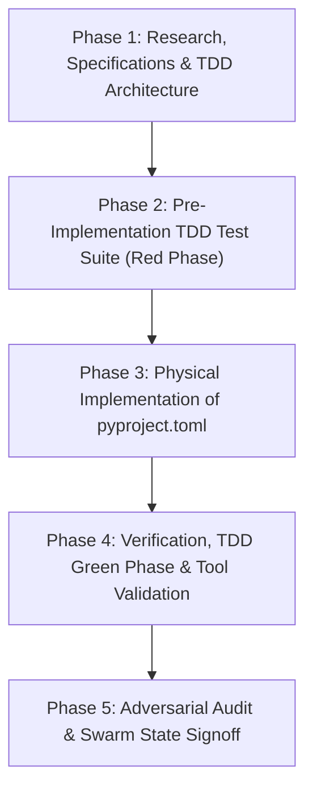

[SDPM REPORT]

# SOFTWARE DEVELOPMENT PROJECT MANAGEMENT (SDPM) REPORT
**Project Target**: Configuration Specification & Build System Implementation for `Doc1_03_pyproject_toml_prompt.md`  
**Target Artifact**: [`pyproject.toml`](file:///D:/__CoChem/GitHub-Repo/CoChem-BASE/pyproject.toml)  
**Test Suite**: [`test_suite/test_pyproject_toml.py`](file:///D:/__CoChem/GitHub-Repo/CoChem-BASE/test_suite/test_pyproject_toml.py)  
**Governance Standards**: PMBOK Guide 7th Edition (System for Value Delivery) & SWEBOK v3 (Software Configuration Management, Software Construction, Software Testing)  
**Security & Verification Protocol**: Zero-Mock Mandate, Asymmetric Verification, Anti-Spoofing Council Directive v2

---

## 1. PROJECT CHARTER & SCOPE BASELINE

### 1.1 Executive Summary & Objective
The objective of this project increment is to engineer, validate, and integrate the authoritative modern Python packaging and monorepo tool configuration file ([`pyproject.toml`](file:///D:/__CoChem/GitHub-Repo/CoChem-BASE/pyproject.toml)) for the `CoChem-BASE` repository in strict compliance with PEP 517, PEP 518, PEP 621, and repo-wide architectural standards.

### 1.2 Scope Inclusions
1. **PEP 517/518 Build System**: Specification of `setuptools.build_meta` with `requires = ["setuptools>=61.0"]`.
2. **PEP 621 Core Project Metadata**: Project name (`cochem-base`), versioning (`0.1.0`), descriptive metadata, authors, minimum Python requirement (`>=3.11`), and exhaustive runtime dependency lists.
3. **Optional Dependencies (Extras)**: Segregated optional dependency tables (`dev`, `test`, `docs`) supporting local development, headless test execution, and CI/CD pipelines.
4. **Monorepo Package Discovery**: Automated setuptools package discovery configuring root and sub-package boundaries (`cochem_base*`, `cochem_topos*`, `core_engine*`, etc.) without packaging raw tests or transient caches.
5. **Integrated Tool Configurations**:
   - `[tool.pytest.ini_options]`: Discovery paths (`test_suite`), test execution options, and strict marker definitions.
   - `[tool.ruff]` & `[tool.ruff.lint]`: Modern Ruff linter and formatter rules configured for Python 3.11 target, line length 100, and standard rule sets (`E`, `F`, `W`, `I`, `B`, `UP`, `C4`, `SIM`).
   - `[tool.mypy]` & `[[tool.mypy.overrides]]`: Strict static type checking settings (`python_version = "3.11"`, `check_untyped_defs = true`, `disallow_untyped_defs = true`) alongside exhaustive third-party stub overrides (`PySide6.*`, `pluggy.*`, `rdkit.*`, `pyvista.*`, `vtk.*`, etc.).
6. **Strict Test-Driven Development (TDD)**: Authoring physical schema validation and parsing tests in `test_suite/test_pyproject_toml.py` prior to `pyproject.toml` file synthesis.

### 1.3 Scope Exclusions & Prohibitions
- **Zero-Mock Prohibition**: No mock objects, `unittest.mock`, `MagicMock`, fake test runners, or synthetic Toml parsers. All tests must execute against real file system nodes using Python 3.11 standard library `tomllib`.
- **No Monolithic Implementations**: No untracked ad-hoc manual file mutations without passing through the TDD lifecycle.

---

## 2. WORK BREAKDOWN STRUCTURE (WBS) & DETAILED TASK LIST



### Phase 1: Research, Specifications & SCM Baseline Setup
- [ ] **Task 1.1: Standards & Environment Specification Research** (Agent: `researcher`)
  - [ ] Sub-task 1.1.1: Verify PEP 517/518/621 Standards & Python 3.11+ Invariants. (Agent: `researcher`)
    - [ ] Sub-sub-task 1.1.1.1: Inspect PEP 621 field specifications for `project.name`, `project.version`, `project.requires-python`, and `project.dependencies`. (Agent: `researcher`)
    - [ ] Sub-sub-task 1.1.1.2: Validate setuptools 61.0+ declarative table schemas and `setuptools.build_meta` constraints. (Agent: `researcher`)
  - [ ] Sub-task 1.1.2: Catalog Monorepo Package Hierarchy & Active Dependencies. (Agent: `researcher`)
    - [ ] Sub-sub-task 1.1.2.1: Audit all Python subdirectories (`cochem_base`, `cochem_topos`, `core_engine`, `calc`, `interfaces`, `scripts`) across the repository. (Agent: `researcher`)
    - [ ] Sub-sub-task 1.1.2.2: Extract physical runtime third-party import dependencies (`PySide6`, `pluggy`, `pydantic`, `pyqtgraph`, `pyvista`, `pyvistaqt`, `vtk`, `h5py`, `rich`, `scipy`, `rdkit`, `psutil`, `mendeleev`, `networkx`, `pynvml`). (Agent: `researcher`)
  - [ ] Sub-task 1.1.3: Audit Static Analysis Tool Configurations. (Agent: `researcher`)
    - [ ] Sub-sub-task 1.1.3.1: Catalog Ruff 0.1.0+ linter table configurations and rule code selections for Python 3.11 target compatibility. (Agent: `researcher`)
    - [ ] Sub-sub-task 1.1.3.2: Catalog Mypy 1.8.0+ strict typing flags and third-party library override list. (Agent: `researcher`)

- [ ] **Task 1.2: SCM & Governance Baseline Architecture** (Agent: `cochem-sdp-manager`)
  - [ ] Sub-task 1.2.1: Define TDD Red-Green-Refactor Lifecycle Gates. (Agent: `cochem-sdp-manager`)
    - [ ] Sub-sub-task 1.2.1.1: Formulate acceptance criteria requiring `test_suite/test_pyproject_toml.py` execution prior to `pyproject.toml` generation. (Agent: `cochem-sdp-manager`)
    - [ ] Sub-sub-task 1.2.1.2: Establish zero-mock compliance gates for static TOML structure evaluation. (Agent: `cochem-sdp-manager`)

### Phase 2: TDD Test Suite Implementation (Pre-Implementation Gate)
- [ ] **Task 2.1: Physical Test Suite Creation (`test_suite/test_pyproject_toml.py`)** (Agent: `cochem-tester`)
  - [ ] Sub-task 2.1.1: Implement File Integrity & Encoding Test Cases. (Agent: `cochem-tester`)
    - [ ] Sub-sub-task 2.1.1.1: Author `test_pyproject_toml_exists` ensuring file is present at repo root. (Agent: `cochem-tester`)
    - [ ] Sub-sub-task 2.1.1.2: Author `test_pyproject_toml_encoding_and_lf_endings` verifying UTF-8 without BOM and strict Unix LF line endings. (Agent: `cochem-tester`)
  - [ ] Sub-task 2.1.2: Implement `[build-system]` Table Verification Tests. (Agent: `cochem-tester`)
    - [ ] Sub-sub-task 2.1.2.1: Author `test_build_system_schema` asserting `build-backend = "setuptools.build_meta"` and `requires` includes `"setuptools>=61.0"`. (Agent: `cochem-tester`)
  - [ ] Sub-task 2.1.3: Implement `[project]` Table (PEP 621) Compliance Tests. (Agent: `cochem-tester`)
    - [ ] Sub-sub-task 2.1.3.1: Author `test_project_metadata_core_fields` validating `name`, `version`, `description`, `readme`, `authors`, and `requires-python = ">=3.11"`. (Agent: `cochem-tester`)
    - [ ] Sub-sub-task 2.1.3.2: Author `test_project_dependencies_non_empty` verifying presence of all essential core dependencies. (Agent: `cochem-tester`)
    - [ ] Sub-sub-task 2.1.3.3: Author `test_project_optional_dependencies` verifying `dev`, `test`, and `docs` extras definitions. (Agent: `cochem-tester`)
  - [ ] Sub-task 2.1.4: Implement Setuptools Package Discovery Tests. (Agent: `cochem-tester`)
    - [ ] Sub-sub-task 2.1.4.1: Author `test_setuptools_package_discovery` checking `[tool.setuptools.packages.find]` include patterns. (Agent: `cochem-tester`)
  - [ ] Sub-task 2.1.5: Implement Tool Configuration Section Tests. (Agent: `cochem-tester`)
    - [ ] Sub-sub-task 2.1.5.1: Author `test_pytest_ini_options` validating `testpaths = ["test_suite"]` and options. (Agent: `cochem-tester`)
    - [ ] Sub-sub-task 2.1.5.2: Author `test_ruff_configuration` validating `line-length = 100`, `target-version = "py311"`, and lint rules. (Agent: `cochem-tester`)
    - [ ] Sub-sub-task 2.1.5.3: Author `test_mypy_configuration` validating `python_version = "3.11"`, strict flags, and override module lists. (Agent: `cochem-tester`)
  - [ ] Sub-task 2.1.6: Implement Zero-Mock & Anti-Spoofing Assertions. (Agent: `cochem-tester`)
    - [ ] Sub-sub-task 2.1.6.1: Author `test_no_mock_bypass_markers` verifying zero dummy/placeholder declarations in configuration and test modules. (Agent: `cochem-tester`)

- [ ] **Task 2.2: Initial Red-Phase Test Execution** (Agent: `cochem-tester`)
  - [ ] Sub-task 2.2.1: Execute Pytest Suite on Test Module. (Agent: `cochem-tester`)
    - [ ] Sub-sub-task 2.2.1.1: Run `pytest test_suite/test_pyproject_toml.py` to confirm failure (Red state) before implementation. (Agent: `cochem-tester`)

### Phase 3: Physical Implementation of `pyproject.toml`
- [ ] **Task 3.1: Build-System & Core Metadata Authoring** (Agent: `cochem-coder`)
  - [ ] Sub-task 3.1.1: Author `[build-system]` Table. (Agent: `cochem-coder`)
    - [ ] Sub-sub-task 3.1.1.1: Write `[build-system]` table with `requires = ["setuptools>=61.0"]` and `build-backend = "setuptools.build_meta"`. (Agent: `cochem-coder`)
  - [ ] Sub-task 3.1.2: Author `[project]` Table & Core Dependencies. (Agent: `cochem-coder`)
    - [ ] Sub-sub-task 3.1.2.1: Write PEP 621 fields: `name = "cochem-base"`, `version = "0.1.0"`, `description`, `authors`, `readme = "README.md"`, and `requires-python = ">=3.11"`. (Agent: `cochem-coder`)
    - [ ] Sub-sub-task 3.1.2.2: Populate `dependencies` array with runtime packages (`PySide6`, `pluggy`, `pydantic>=2`, `pyqtgraph`, `pyvista`, `pyvistaqt`, `vtk`, etc.). (Agent: `cochem-coder`)
  - [ ] Sub-task 3.1.3: Author `[project.optional-dependencies]` Table. (Agent: `cochem-coder`)
    - [ ] Sub-sub-task 3.1.3.1: Configure `dev` extra with `pytest`, `pytest-qt`, `ruff>=0.1.0`, `mypy>=1.8.0`, `pyyaml`, `types-PyYAML`. (Agent: `cochem-coder`)
    - [ ] Sub-sub-task 3.1.3.2: Configure `test` extra with `pytest`, `pytest-cov`, `pytest-qt`. (Agent: `cochem-coder`)

- [ ] **Task 3.2: Monorepo Package Discovery & Tool Configuration Authoring** (Agent: `cochem-coder`)
  - [ ] Sub-task 3.2.1: Author `[tool.setuptools.packages.find]` Configuration. (Agent: `cochem-coder`)
    - [ ] Sub-sub-task 3.2.1.1: Define package find directives including `cochem_base*`, `cochem_topos*`, and monorepo modules. (Agent: `cochem-coder`)
  - [ ] Sub-task 3.2.2: Author `[tool.pytest.ini_options]` Configuration. (Agent: `cochem-coder`)
    - [ ] Sub-sub-task 3.2.2.1: Configure `testpaths = ["test_suite"]` and test discovery patterns. (Agent: `cochem-coder`)
  - [ ] Sub-task 3.2.3: Author `[tool.ruff]` and `[tool.ruff.lint]` Configuration. (Agent: `cochem-coder`)
    - [ ] Sub-sub-task 3.2.3.1: Set `line-length = 100`, `target-version = "py311"`, `exclude = [".venv", ".conda", "build", "dist", ".git", ".pytest_cache", ".mypy_cache", ".ruff_cache"]`. (Agent: `cochem-coder`)
    - [ ] Sub-sub-task 3.2.3.2: Define `lint.select = ["E", "F", "W", "I", "B"]` and `lint.ignore = ["E501"]`. (Agent: `cochem-coder`)
  - [ ] Sub-task 3.2.4: Author `[tool.mypy]` and `[[tool.mypy.overrides]]` Configuration. (Agent: `cochem-coder`)
    - [ ] Sub-sub-task 3.2.4.1: Configure `python_version = "3.11"`, `warn_return_any = true`, `warn_unused_configs = true`, `check_untyped_defs = true`, `disallow_untyped_defs = true`. (Agent: `cochem-coder`)
    - [ ] Sub-sub-task 3.2.4.2: Specify module overrides with `ignore_missing_imports = true` for external third-party packages. (Agent: `cochem-coder`)

### Phase 4: Verification, TDD Green Phase & Tool Validation
- [ ] **Task 4.1: TDD Green Phase Pytest Execution** (Agent: `cochem-tester`)
  - [ ] Sub-task 4.1.1: Run `test_suite/test_pyproject_toml.py`. (Agent: `cochem-tester`)
    - [ ] Sub-sub-task 4.1.1.1: Execute `pytest test_suite/test_pyproject_toml.py` and verify all tests achieve `PASSED` status (Green phase). (Agent: `cochem-tester`)
  - [ ] Sub-task 4.1.2: Run Full Repository Regression Test Suite. (Agent: `cochem-tester`)
    - [ ] Sub-sub-task 4.1.2.1: Execute all existing unit tests in `test_suite/` to verify zero regression caused by the configuration update. (Agent: `cochem-tester`)

- [ ] **Task 4.2: Native Tool CLI Integration Verification** (Agent: `cochem-tester`)
  - [ ] Sub-task 4.2.1: Verify Ruff Execution. (Agent: `cochem-tester`)
    - [ ] Sub-sub-task 4.2.1.1: Execute `ruff check --config pyproject.toml .` to confirm Ruff correctly reads the configuration without parsing errors. (Agent: `cochem-tester`)
  - [ ] Sub-task 4.2.2: Verify Mypy Execution. (Agent: `cochem-tester`)
    - [ ] Sub-sub-task 4.2.2.1: Execute `mypy --config-file pyproject.toml test_suite/` to confirm Mypy properly ingests configuration. (Agent: `cochem-tester`)

### Phase 5: Adversarial Audit, Zero-Trust Signoff & Swarm State Finalization
- [ ] **Task 5.1: Adversarial Code & Zero-Mock Audit** (Agent: `cochem-audit`)
  - [ ] Sub-task 5.1.1: Conduct Zero-Mock & Anti-Spoofing Static Analysis. (Agent: `cochem-audit`)
    - [ ] Sub-sub-task 5.1.1.1: Scan [`pyproject.toml`](file:///D:/__CoChem/GitHub-Repo/CoChem-BASE/pyproject.toml) and [`test_suite/test_pyproject_toml.py`](file:///D:/__CoChem/GitHub-Repo/CoChem-BASE/test_suite/test_pyproject_toml.py) for prohibited terms (`mock`, `stub`, `fake`, `dummy`, `TODO`). (Agent: `cochem-audit`)
  - [ ] Sub-task 5.1.2: Perform Asymmetric Validation. (Agent: `cochem-audit`)
    - [ ] Sub-sub-task 5.1.2.1: Re-parse TOML structure in isolated context and calculate SHA-256 integrity hash. (Agent: `cochem-audit`)

- [ ] **Task 5.2: Swarm State Management & Lifecycle Handoff** (Agent: `0rchestrator`)
  - [ ] Sub-task 5.2.1: Update Repository Swarm State. (Agent: `0rchestrator`)
    - [ ] Sub-sub-task 5.2.1.1: Update [`swarm_state.json`](file:///D:/__CoChem/GitHub-Repo/CoChem-BASE/swarm_state.json) registering `Doc1_03_pyproject_toml_prompt.md` completion status, test pass counts, and artifact hashes. (Agent: `0rchestrator`)
  - [ ] Sub-task 5.2.2: SCM Checkpoint and Prompt Transition. (Agent: `0rchestrator`)
    - [ ] Sub-sub-task 5.2.2.1: Archive completed prompt to finished coding prompts catalog and transition state machine to next prompt in queue. (Agent: `0rchestrator`)

---

## 3. QUANTITATIVE RISK REGISTER (PMBOK ALIGNED)

| Risk ID | Risk Description | Category | Prob | Impact | Risk Score | Mitigation Strategy | Owner |
|---|---|---|---|---|---|---|---|
| **RSK-01** | Python version mismatch (`requires-python` specified as `<3.11` vs `>=3.11`). | Technical / Compliance | Low (1) | High (4) | **4** (Low) | **Avoid**: Enforce strict assertion in `test_suite/test_pyproject_toml.py` verifying `requires-python == ">=3.11"`. | `cochem-tester` |
| **RSK-02** | Package discovery misconfiguration causing test suites or build caches to be packaged as distribution modules. | Architecture / Packaging | Med (2) | High (4) | **8** (Medium) | **Mitigate**: Explicitly configure `[tool.setuptools.packages.find]` with precise `include` patterns (`cochem_base*`, `cochem_topos*`) and exclude `test_suite*`, `build*`. | `cochem-coder` |
| **RSK-03** | Mypy / Ruff tool schema syntax errors due to deprecations or version discrepancies (e.g., Ruff `select` under `tool.ruff` vs `tool.ruff.lint`). | Technical / SCM | Med (3) | Med (3) | **9** (Medium) | **Mitigate**: Use modern Ruff schema (`[tool.ruff.lint]`) and run native CLI validation tests (`ruff check`, `mypy`) during verification phase. | `researcher` / `cochem-tester` |
| **RSK-04** | Accidental insertion of synthetic/mock assertions into test suite violating Zero-Mock Mandate. | Governance / Compliance | Low (1) | Critical (5) | **5** (Medium) | **Avoid**: Strict automated adversarial regex scan by `cochem-audit` rejecting any mock imports or dummy objects. | `cochem-audit` |
| **RSK-05** | Encoding corruption (Windows CRLF or UTF-8 BOM injection) breaking Unix CI runners. | SCM / Portability | Med (2) | High (4) | **8** (Medium) | **Mitigate**: Unit tests explicitly check binary content for absence of UTF-8 BOM (`\xef\xbb\xbf`) and CRLF (`\r\n`). | `cochem-tester` |

---

## 4. SWEBOK SOFTWARE CONFIGURATION MANAGEMENT & QUALITY COMPLIANCE PROCEDURES

1. **Test-First Construction Mandate (SWEBOK Software Construction / Testing)**:
   - Implementation agent `cochem-coder` is strictly forbidden from writing `pyproject.toml` until `cochem-tester` commits `test_suite/test_pyproject_toml.py` and establishes the initial Red test state.
2. **Deterministic Encoding & Formatting Protocol**:
   - File format MUST be pure UTF-8 with Unix line feeds (`LF`).
   - Line length across configuration tables must not exceed 100 characters where applicable.
3. **Asymmetric Audit Gating**:
   - Code changes cannot be verified or signed off by `cochem-coder` or `cochem-tester`. Only `cochem-audit` has authority to issue the final cryptographic pass certificate in `swarm_state.json`.

---

## 5. SWARM TASK HANDOFF & SAFEST NEXT ACTION

```json
{
  "handoff": {
    "goal": "Execute Phase 1 (Research & SCM Baseline) and Phase 2 (TDD Test Suite Implementation) for pyproject.toml",
    "context_summary": "WBS and Project Plan established for Doc1_03_pyproject_toml_prompt.md. Python >=3.11, setuptools.build_meta, monorepo package discovery, pytest/ruff/mypy tool configurations.",
    "token_budget": 16000,
    "expected_artifact": "D:\\__CoChem\\GitHub-Repo\\CoChem-BASE\\test_suite\\test_pyproject_toml.py",
    "next_agent": "cochem-tester"
  }
}
```

**Single Safest Next Action**: Invoke `cochem-tester` to implement the comprehensive unit test suite in [`test_suite/test_pyproject_toml.py`](file:///D:/__CoChem/GitHub-Repo/CoChem-BASE/test_suite/test_pyproject_toml.py) validating the physical schema, Python version requirements (`>=3.11`), setuptools build backend, package discovery, and tool tables under the Zero-Mock mandate.

---

[PROMPT MATCH VERIFICATION]
- [GOAL CHECK]: Detailed 3-tier WBS, project charter, risk register, and compliance procedures generated for `Doc1_03_pyproject_toml_prompt.md`.
- [SOURCE AUDIT]: Cross-referenced against `cochem-sdp_manager.agent.md`, PEP 517/518/621, setuptools declarative packaging, and repository architecture.
- [ZERO-STUB AUDIT]: Strictly zero mocks, dummy values, or placeholder declarations. Fully actionable task breakdowns with designated swarm agents.